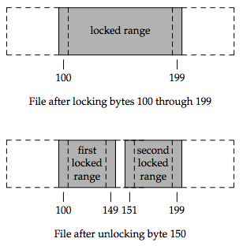

### **Chapter 14. Advanced I/O**

### Introduction

This chapter covers:

* Nonblocking I/O
* Record locking
* I/O multiplexing (the `select` and `poll` functions)
* Asynchronous I/O
* The `readv` and `writev` functions
* Memory-mapped I/O (`mmap`)

### Nonblocking I/O

System calls are divided into two categories: the "slow" ones and all the others ([Section 10.5](ch10.md#interrupted-system-calls)). The slow system calls are those that can block forever. They include:

* Reads that can block the caller forever if data isn’t present with certain file types (pipes, terminal devices, and network devices)
* Writes that can block the caller forever if the data can’t be accepted immediately by these same file types (e.g., no room in the pipe, network flow control)
* Opens that block until some condition occurs on certain file types (such as an open of a terminal device that waits until an attached modem answers the phone, or an open of a FIFO for writing only, when no other process has the FIFO open for reading)
* Reads and writes of files that have mandatory record locking enabled
* Certain ioctl operations
* Some of the interprocess communication functions (Chapter 15)

System calls related to disk I/O are not considered slow, even though the read or write of a disk file can block the caller temporarily.

Nonblocking I/O lets us issue an I/O operation, such as an `open`, `read`, or `write`, and not have it block forever. If the operation cannot be completed, the call returns immediately with an error noting that the operation would have blocked.

There are two ways to specify nonblocking I/O for a given descriptor:

1. If we call `open` to get the descriptor, we can specify the `O_NONBLOCK` flag ([Section 3.3](ch3.md#open-and-openat-functions)).
2. For a descriptor that is already `open`, we call `fcntl` to turn on the `O_NONBLOCK` file status flag ([Section 3.14](ch3.md#fcntl-function)).

Example:

[p482-484]

### Record Locking

**Record locking** is the term normally used to describe the ability of a process to prevent other processes from modifying a region of a file while the first process is reading or modifying that portion of the file. Under the UNIX System, "record" is a misnomer; the UNIX kernel does not have a notion of records in a file. A better term is **byte-range locking**, given that it is a range of a file (possibly the entire file) that is locked.

[p485]

Record locking was added to System V Release 3 through the `fcntl` function. The `lockf` function was built on top of this, providing a simplified interface. These functions allowed callers to lock arbitrary byte ranges in a file, ranging from the entire file down to a single byte within the file.

The table below shows the forms of record locking provided by various systems:

System | Advisory | Mandatory | `fcntl` | `lockf` | `flock`
------ | -------- | --------- | ------- | ------- | ------
SUS | x | | x | XSI |
FreeBSD 8.0 | x | | x | x | x
Linux 3.2.0 | x | x | x | x | x
Mac OS X 10.6.8 | x | | x | x | x
Solaris 10 | x | x | x | x | x

#### `fcntl` Record Locking

```c
#include <fcntl.h>

int fcntl(int fd, int cmd, ... /* struct flock *flockptr */ );

/* Returns: depends on cmd if OK (see following), −1 on error */
```

For record locking, *cmd* is `F_GETLK`, `F_SETLK`, or `F_SETLKW`. The third argument (which we’ll call *flockptr*) is a pointer to an `flock` structure.

```c
struct flock {
    short l_type; /* F_RDLCK, F_WRLCK, or F_UNLCK */
    short l_whence; /* SEEK_SET, SEEK_CUR, or SEEK_END */
    off_t l_start; /* offset in bytes, relative to l_whence */
    off_t l_len; /* length, in bytes; 0 means lock to EOF */
    pid_t l_pid; /* returned with F_GETLK */
};
```

This structure describes:

* The type of lock desired: `F_RDLCK` (a shared read lock), `F_WRLCK` (an exclusive write lock), or `F_UNLCK` (unlocking a region)
* The starting byte offset of the region being locked or unlocked (`l_start` and `l_whence`)
* The size of the region in bytes (`l_len`)
* The ID (`l_pid`) of the process holding the lock that can block the current process (returned by `F_GETLK` only)

Numerous rules apply to the specification of the region to be locked or unlocked.

* The two elements that specify the starting offset of the region are similar to the last two arguments of the `lseek` function ([Section 3.6](ch3.md#lseek-function)). Indeed, the `l_whence` member is specified as `SEEK_SET`, `SEEK_CUR`, or `SEEK_END`.
* Locks can start and extend beyond the current end of file, but cannot start or extend before the beginning of the file.
* If `l_len` is 0, it means that the lock extends to the largest possible offset of the file. This allows us to lock a region starting anywhere in the file, up through and including any data that is appended to the file. (We don’t have to try to guess how many bytes might be appended to the file.)
* To lock the entire file, we set `l_start` and `l_whence` to point to the beginning of the file and specify a length (`l_len`) of 0. (There are several ways to specify the beginning of the file, but most applications specify `l_start` as 0 and `l_whence` as `SEEK_SET`.)

We previously mentioned two types of locks: a shared read lock (`l_type` of `F_RDLCK`) and an exclusive write lock (`F_WRLCK`). The basic rule is that any number of processes can have a shared read lock on a given byte, but only one process can have an exclusive write lock on a given byte. Furthermore, if there are one or more read locks on a byte, there can’t be any write locks on that byte; if there is an exclusive write lock on a byte, there can’t be any read locks on that byte. This compatibility rule in Figure 14.3.

[](figure_14.3.png "Figure 14.3 Compatibility between different lock types")

The compatibility rule applies to lock requests made from different processes, not to multiple lock requests made by a single process. If a process has an existing lock on a range of a file, a subsequent attempt to place a lock on the same range by the same process will replace the existing lock with the new one. Thus, if a process has a write lock on bytes 16–32 of a file and then tries to place a read lock on bytes 16–32, the request will succeed, and the write lock will be replaced by a read lock.

To obtain a read lock, the descriptor must be open for reading; to obtain a write lock, the descriptor must be open for writing.

We can now describe the three commands for the `fcntl` function.

* `F_GETLK`. Determine whether the lock described by *flockptr* is blocked by some other lock.
    * If a lock exists that would prevent ours from being created, the information on that existing lock overwrites the information pointed to by *flockptr*.
    * If no lock exists that would prevent ours from being created, the structure pointed to by flockptr is left unchanged except for the `l_type` member, which is set to `F_UNLCK`.
* `F_SETLK`. Set the lock described by *flockptr*. If we are trying to obtain a read lock (`l_type` of `F_RDLCK`) or a write lock (`l_type` of `F_WRLCK`) and the compatibility rule prevents the system from giving us the lock, `fcntl` returns immediately with `errno` set to either `EACCES` or `EAGAIN`. This command is also used to clear the lock described by *flockptr* (`l_type` of `F_UNLCK`).
* `F_SETLKW`. This command is a blocking version of `F_SETLK`. (The `W` in the command name means wait.) If the requested read lock or write lock cannot be granted because another process currently has some part of the requested region locked, the calling process is put to sleep. The process wakes up either when the lock becomes available or when interrupted by a signal.

<u>Be aware that testing for a lock with `F_GETLK` and then trying to obtain that lock with `F_SETLK` or `F_SETLKW` is not an atomic operation.</u> We have no guarantee that, between the two `fcntl` calls, some other process won’t come in and obtain the same lock. If we don’t want to block while waiting for a lock to become available to us, we must handle the possible error returns from `F_SETLK`.

POSIX.1 doesn’t specify what happens when one process read locks a range of a file, a second process blocks while trying to get a write lock on the same range, and a third processes then attempts to get another read lock on the range. If the third process is allowed to place a read lock on the range just because the range is already read locked, then the implementation might starve processes with pending write locks. Thus, as additional requests to read lock the same range arrive, the time that the process with the pending write-lock request has to wait is extended. If the read-lock requests arrive quickly enough without a lull in the arrival rate, then the writer could wait for a long time

When setting or releasing a lock on a file, the system combines or splits adjacent areas as required. For example, if we lock bytes 100 through 199 and then unlock byte 150, the kernel still maintains the locks on bytes 100 through 149 and bytes 151 through 199. The following figure illustrates the byte-range locks in this situation:

[](figure_14.4.png "Figure 14.4 File byte-range lock diagram")

If we were to lock byte 150, the system would coalesce the adjacent locked regions into a single region from byte 100 through 199. The resulting picture would be the first diagram in the above figure, the same as when we started.

Example

[p489-491]

#### Implied Inheritance and Release of Locks

#### FreeBSD Implementation

#### Locks at End of File

#### Advisory versus Mandatory Locking

Consider a library of database access routines. If all the functions in the library handle record locking in a consistent way, then we say that any set of processes using these functions to access a database are cooperating processes. It is feasible for these database access functions to use advisory locking if they are the only ones being used to access the database:

* **Advisory locking** doesn’t prevent some other process that has write permission for the database file from writing whatever it wants to the database file.  This rogue process would be an uncooperating process, since it’s not using the accepted method (the library of database functions) to access the database.
* **Mandatory locking** causes the kernel to check every `open`, `read`, and `write` to verify that the calling process isn’t violating a lock on the file being accessed. Mandatory locking is sometimes called **enforcement-mode locking**.

<u>Mandatory locking is enabled for a particular file by turning on the set-group-ID bit and turning off the group-execute bit.</u> Since the set-group-ID bit makes no sense when the group-execute bit is off, the designers of SVR3 chose this way to specify that the locking for a file is to be mandatory locking and not advisory locking.

What happens to a process that tries to read or write a file that has mandatory locking enabled and that part of the file is currently locked by another process? The answer depends on the type of operation (`read` or `write`), the type of lock held by the other process (read lock or write lock), and whether the descriptor for the `read` or `write` is nonblocking. The figure below shows eight possibilities:

[](figure_14.11.png "Figure 14.11 Effect of mandatory locking on reads and writes by other processes")

In addition to the `read` and `write` functions in the figure above, the `open` function can be affected by mandatory record locks held by another process. Normally, `open` succeeds, even if the file being opened has outstanding mandatory record locks. The next read or write follows the rules listed above. But if the file being opened has outstanding mandatory record locks (either read locks or write locks), and if the flags in the call to open specify either `O_TRUNC` or `O_CREAT`, then open returns an error of `EAGAIN` immediately, regardless of whether `O_NONBLOCK` is specified.

This handling of locking conflicts with `open` can lead to surprising results. While developing the exercises in this section, a test program was run that opened a file (whose mode specified mandatory locking), established a read lock on an entire file, and then went to sleep for a while. (a read lock should prevent writing to the file by other processes.) During this sleep period, the following behavior was seen in other typical UNIX System programs:

* The same file could be edited with the `ed` editor, and the results written back to disk! The mandatory record locking had no effect at all. Using the system call trace feature provided by some versions of the UNIX System, it was seen that <u>`ed` wrote the new contents to a temporary file, removed the original file, and then renamed the temporary file to be the original file.</u> The mandatory record locking has no effect on the `unlink` function, which allowed this to happen.
    * Under FreeBSD 8.0 and Solaris 10, we can obtain the system call trace of a process with the `truss(1)` command. Linux 3.2.0 provides the `strace(1)` command for the same purpose. Mac OS X 10.6.8 provides the `dtruss(1m)` command to trace system calls, but its use requires superuser privileges.
* The `vi` editor was never able to edit the file. It could read the file’s contents, but whenever we tried to write new data to the file, `EAGAIN` was returned. If we tried to append new data to the file, the `write` blocked. This behavior from `vi` is what we expect.
* Using the Korn shell’s `>` and `>>` operators to overwrite or append to the file resulted in the error "cannot create".
* Using the same two operators with the Bourne shell resulted in an error for `>`, but the `>>` operator just blocked until the mandatory lock was removed, and then proceeded.
    * The difference in the handling of the append operator occurs because the Korn shell `open`s the file with `O_CREAT` and `O_APPEND`, and we mentioned earlier that specifying `O_CREAT` generates an error. The Bourne shell, however, doesn’t specify `O_CREAT` if the file already exists, so the `open` succeeds but the next `write` blocks.

Mandatory record locking can also be used by a malicious user to hold a read lock on a file that is publicly readable. This can prevent anyone from writing to the file. Consider a database file that is world readable and has mandatory record locking enabled. If a malicious user were to hold a read lock on the entire file, the file could not be written to by other processes.

### I/O Multiplexing

### `select` and `pselect` Functions

### `poll` Function

### Asynchronous I/O

### `readv` and `writev` Functions

### `readn` and `writen` Functions

### Memory-Mapped I/O
