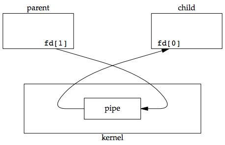
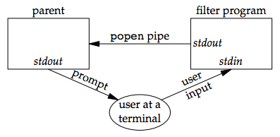
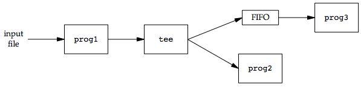
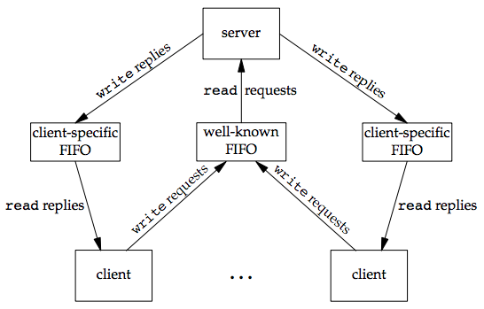

### **Chapter 15. Interprocess Communication**

This chapter discusses other techniques for processes to communicate with one another: interprocess communication (IPC).

The figure below summarizes the various forms of IPC that are supported by the four implementations discussed in this text.

[](figure_15.1.png "Figure 15.1 Summary of UNIX System IPC")

* The "SUS" column allows an implementation to support full-duplex pipes, but requires only half-duplex pipes.
* "(full)" shows implementations that support half-duplex pipes by using full-duplex pipes.
* The bullet means that basic functionality is supported.
* "UDS" means that the feature of full-duplex pipes can be provided through UNIX domain sockets

[p533-534]

The first ten forms of IPC in the figure above are usually restricted to IPC between processes on the same host. The final two rows: sockets and STREAMS, are the only two forms that are generally supported for IPC between processes on different hosts.

This chapter dicusses classical IPC: pipes, FIFOs, message queues, semaphores, and shared memory.

### Pipes

Pipes are the oldest form of UNIX System IPC and are provided by all UNIX systems. Pipes have two limitations:

1. Historically, they have been half duplex (data flows in only one direction).  Some systems now provide full-duplex pipes, but for maximum portability, we should never assume that this is the case.
2. Pipes can be used only between processes that have a common ancestor. Normally, a pipe is created by a process, that process calls `fork`, and the pipe is used between the parent and the child.

FIFOs (Section 15.5) get around the second limitation, and that UNIX domain sockets (Section 17.2) get around both limitations.

Despite these limitations, half-duplex pipes are still the most commonly used form of IPC. Every time you type a sequence of commands in a pipeline for the shell to execute, the shell creates a separate process for each command and links the standard output of one process to the standard input of the next using a pipe.

A pipe is created by calling the `pipe` function.

```c
#include <unistd.h>

int pipe(int fd[2]);

/* Returns: 0 if OK, −1 on error */
```

Two file descriptors are returned through the *fd* argument: *fd[0]* is open for reading, and *fd[1]* is open for writing. The output of *fd[1]* is the input for *fd[0]*.

POSIX.1 allows for implementations to support full-duplex pipes. For these implementations, *fd[0]* and *fd[1]* are open for both reading and writing.

Two ways to picture a half-duplex pipe are shown in the figure below. The left half of the figure shows the two ends of the pipe connected in a single process. The right half of the figure emphasizes that the data in the pipe flows through the kernel.

[](figure_15.2.png "Figure 15.2 Two ways to view a half-duplex pipe")

The `fstat` function returns a file type of FIFO for the file descriptor of either end of a pipe. We can test for a pipe with the `S_ISFIFO` macro.

POSIX.1 states that the `st_size` member of the stat structure is undefined for pipes. But when the `fstat` function is applied to the file descriptor for the read end of the pipe, many systems store in `st_size` the number of bytes available for reading in the pipe, which is nonportable.

A pipe in a single process is next to useless. Normally, the process that calls `pipe` then calls `fork`, creating an IPC channel from the parent to the child, or vice versa. The following figure shows this scenario:

[](figure_15.3.png "Figure 15.3 Half-duplex pipe after a fork")

What happens after the `fork` depends on which direction of data flow we want. For a pipe from the parent to the child, the parent closes the read end of the pipe (*fd[0]*), and the child closes the write end (*fd[1]*). The following figure shows the resulting arrangement of descriptors.

[](figure_15.4.png "Figure 15.4 Pipe from parent to child")

For a pipe from the child to the parent, the parent closes fd[1], and the child closes fd[0].

When one end of a pipe is closed, two rules apply:

1. If we `read` from a pipe whose write end has been closed, `read` returns 0 to
indicate an end of file after all the data has been read.
    * Technically, we should say that this end of file is not generated until there are no more writers for the pipe.
    * It’s possible to duplicate a pipe descriptor so that multiple processes have the pipe open for writing.
    * Normally, there is a single reader and a single writer for a pipe. (The FIFOs in the next section dicusses that there are multiple writers for a single FIFO.)
2. If we `write` to a pipe whose read end has been closed, the signal `SIGPIPE` is generated. If we either ignore the signal or catch it and return from the signal handler, `write` returns −1 with `errno` set to `EPIPE`.

When we’re writing to a pipe (or FIFO), the constant `PIPE_BUF` specifies the kernel’s pipe buffer size. A write of `PIPE_BUF` bytes or less will not be interleaved with the writes from other processes to the same pipe (or FIFO). But if multiple processes are writing to a pipe (or FIFO), and if we write more than `PIPE_BUF` bytes, the data might be interleaved with the data from the other writers. We can determine the value of `PIPE_BUF` by using `pathconf` or `fpathconf`.

#### Example: creating a pipe between a parent and its child

<small>[ipc1/pipe1.c](https://github.com/shichao-an/apue.3e/blob/master/)</small>

```c
#include "apue.h"

int
main(void)
{
	int		n;
	int		fd[2];
	pid_t	pid;
	char	line[MAXLINE];

	if (pipe(fd) < 0)
		err_sys("pipe error");
	if ((pid = fork()) < 0) {
		err_sys("fork error");
	} else if (pid > 0) {		/* parent */
		close(fd[0]);
		write(fd[1], "hello world\n", 12);
	} else {					/* child */
		close(fd[1]);
		n = read(fd[0], line, MAXLINE);
		write(STDOUT_FILENO, line, n);
	}
	exit(0);
}
```

The pipe direction in the code above matches the orientation shown in [Figure 15.4](figure_15.4.png)

#### Example: pager

To avoid writing all the data to a temporary file and calling system to display that file, we want to pipe the output directly to the pager. To do this, we create a pipe, `fork` a child process, <u>set up the child’s standard input to be the read end of the pipe</u>, and `exec` the user’s pager program, as shown in the program below. [p538]

<small>[ipc1/pipe2.c](https://github.com/shichao-an/apue.3e/blob/master/ipc1/pipe2.c)</small>

```c
#include "apue.h"
#include <sys/wait.h>

#define	DEF_PAGER	"/bin/more"		/* default pager program */

int
main(int argc, char *argv[])
{
	int		n;
	int		fd[2];
	pid_t	pid;
	char	*pager, *argv0;
	char	line[MAXLINE];
	FILE	*fp;

	if (argc != 2)
		err_quit("usage: a.out <pathname>");

	if ((fp = fopen(argv[1], "r")) == NULL)
		err_sys("can't open %s", argv[1]);
	if (pipe(fd) < 0)
		err_sys("pipe error");

	if ((pid = fork()) < 0) {
		err_sys("fork error");
	} else if (pid > 0) {								/* parent */
		close(fd[0]);		/* close read end */

		/* parent copies argv[1] to pipe */
		while (fgets(line, MAXLINE, fp) != NULL) {
			n = strlen(line);
			if (write(fd[1], line, n) != n)
				err_sys("write error to pipe");
		}
		if (ferror(fp))
			err_sys("fgets error");

		close(fd[1]);	/* close write end of pipe for reader */

		if (waitpid(pid, NULL, 0) < 0)
			err_sys("waitpid error");
		exit(0);
	} else {										/* child */
		close(fd[1]);	/* close write end */
		if (fd[0] != STDIN_FILENO) {
			if (dup2(fd[0], STDIN_FILENO) != STDIN_FILENO)
				err_sys("dup2 error to stdin");
			close(fd[0]);	/* don't need this after dup2 */
		}

		/* get arguments for execl() */
		if ((pager = getenv("PAGER")) == NULL)
			pager = DEF_PAGER;
		if ((argv0 = strrchr(pager, '/')) != NULL)
			argv0++;		/* step past rightmost slash */
		else
			argv0 = pager;	/* no slash in pager */

		if (execl(pager, argv0, (char *)0) < 0)
			err_sys("execl error for %s", pager);
	}
	exit(0);
}
```

This program does the following:

1. Before calling `fork`, we create a pipe.
2. After the `fork`, the parent closes its read end, and the child closes its write end.
3. The child then calls `dup2` to have its standard input be the read end of the pipe.
4. When the pager program is executed, its standard input will be the read end of the pipe.

When we duplicate one descriptor onto another (`fd[0]` onto standard input in the child), we have to be careful that the descriptor doesn’t already have the desired value. If the descriptor already had the desired value and we called `dup2` and `close`, the single copy of the descriptor would be closed. In this program, if standard input had not been opened by the shell, the `fopen` at the beginning of the program should have used descriptor 0, the lowest unused descriptor, so `fd[0]` should never equal standard input. Nevertheless, <u>whenever we call `dup2` and close to duplicate one descriptor onto another, we’ll always compare the descriptors first, as a defensive programming measure.</u>

#### Implementation of the `TELL` and `WAIT` functions using pipes

Recall the five functions `TELL_WAIT`, `TELL_PARENT`, `TELL_CHILD`, `WAIT_PARENT`, and `WAIT_CHILD` from [Section 8.9](ch8.md#race-conditions). Here is an implementation using pipes:

<small>[ipc1/tellwait.c](https://github.com/shichao-an/apue.3e/blob/master/ipc1/tellwait.c)</small>

```c
#include "apue.h"

static int	pfd1[2], pfd2[2];

void
TELL_WAIT(void)
{
	if (pipe(pfd1) < 0 || pipe(pfd2) < 0)
		err_sys("pipe error");
}

void
TELL_PARENT(pid_t pid)
{
	if (write(pfd2[1], "c", 1) != 1)
		err_sys("write error");
}

void
WAIT_PARENT(void)
{
	char	c;

	if (read(pfd1[0], &c, 1) != 1)
		err_sys("read error");

	if (c != 'p')
		err_quit("WAIT_PARENT: incorrect data");
}

void
TELL_CHILD(pid_t pid)
{
	if (write(pfd1[1], "p", 1) != 1)
		err_sys("write error");
}

void
WAIT_CHILD(void)
{
	char	c;

	if (read(pfd2[0], &c, 1) != 1)
		err_sys("read error");

	if (c != 'c')
		err_quit("WAIT_CHILD: incorrect data");
}
```

This program creates two pipes before the `fork`, as shown in the figure below. The parent writes the character "p" across the top pipe when `TELL_CHILD` is called, and the child writes the character "c" across the bottom pipe when `TELL_PARENT` is called. The corresponding `WAIT_xxx` functions do a blocking `read` for the single character.

[](figure_15.8.png "Figure 15.8 Using two pipes for parent–child synchronization")

Each pipe has an extra reader, which doesn’t matter. That is, in addition to the child reading from `pfd1[0]`, the parent has this end of the top pipe open for reading. This doesn’t affect us, since the parent doesn’t try to read from this pipe.

### `popen` and `pclose` Functions

The standard I/O library has historically provided the `popen` and `pclose` functions. These two functions handle all the dirty work that we’ve been doing ourselves: creating a pipe, `fork`ing a child, closing the unused ends of the pipe, executing a shell to run the command, and waiting for the command to terminate.

```c
#include <stdio.h>

FILE *popen(const char *cmdstring, const char *type);

/* Returns: file pointer if OK, NULL on error */

int pclose(FILE *fp);

/* Returns: termination status of cmdstring, or −1 on error */
```

The function `popen` does a `fork` and `exec` to execute the *cmdstring* and returns a standard I/O file pointer. If *type* is "r", the file pointer is connected to the standard output of *cmdstring*, as shown in the figure below:

[](figure_15.9.png "Figure 15.9 Result of fp = popen(cmdstring, r)")

If type is "w", the file pointer is connected to the standard input of *cmdstring*, as shown in the figure below:

[](figure_15.10.png "Figure 15.10 Result of fp = popen(cmdstring, w)")

The `pclose` function closes the standard I/O stream, waits for the command to terminate, and returns the termination status of the shell. (The termination status is described in [Section 8.6](ch8.md#exit-status-vs-termination-status). The `system` function, described in [Section 8.13](ch8.md#system-function), also returns the termination status.) If the shell cannot be executed, the termination status returned by `pclose` is as if the shell had executed `exit(127)`.

The cmdstring is executed by the Bourne shell, as in:

```shell
sh -c cmdstring
```

This means that the shell expands any of its special characters in *cmdstring*. This allows us to say, for example,

```c
fp = popen("ls *.c", "r");
```

or

```c
fp = popen("cmd 2>&1", "r");
```

#### Example: pager using `popen`

The following program is an reimplementation of [pager in the previous example](#example-pager) using `popen`:

<small>[ipc1/popen2.c](https://github.com/shichao-an/apue.3e/blob/master/ipc1/popen2.c)</small>

```c
#include "apue.h"
#include <sys/wait.h>

#define	PAGER	"${PAGER:-more}" /* environment variable, or default */

int
main(int argc, char *argv[])
{
	char	line[MAXLINE];
	FILE	*fpin, *fpout;

	if (argc != 2)
		err_quit("usage: a.out <pathname>");
	if ((fpin = fopen(argv[1], "r")) == NULL)
		err_sys("can't open %s", argv[1]);

	if ((fpout = popen(PAGER, "w")) == NULL)
		err_sys("popen error");

	/* copy argv[1] to pager */
	while (fgets(line, MAXLINE, fpin) != NULL) {
		if (fputs(line, fpout) == EOF)
			err_sys("fputs error to pipe");
	}
	if (ferror(fpin))
		err_sys("fgets error");
	if (pclose(fpout) == -1)
		err_sys("pclose error");

	exit(0);
}
```

Using `popen` reduces the amount of code we have to write. The shell command `${PAGER:-more}` means to use the value of the shell variable `PAGER` if it is defined and non-null; otherwise, use the string `more`.

#### Example: `popen` and `pclose` Functions

The following code shows our version of `popen` and `pclose`:

<small>[ipc1/popen.c](https://github.com/shichao-an/apue.3e/blob/master/ipc1/popen.c)</small>

```c
#include "apue.h"
#include <errno.h>
#include <fcntl.h>
#include <sys/wait.h>

/*
 * Pointer to array allocated at run-time.
 */
static pid_t	*childpid = NULL;

/*
 * From our open_max(), {Prog openmax}.
 */
static int		maxfd;

FILE *
popen(const char *cmdstring, const char *type)
{
	int		i;
	int		pfd[2];
	pid_t	pid;
	FILE	*fp;

	/* only allow "r" or "w" */
	if ((type[0] != 'r' && type[0] != 'w') || type[1] != 0) {
		errno = EINVAL;
		return(NULL);
	}

	if (childpid == NULL) {		/* first time through */
		/* allocate zeroed out array for child pids */
		maxfd = open_max();
		if ((childpid = calloc(maxfd, sizeof(pid_t))) == NULL)
			return(NULL);
	}

	if (pipe(pfd) < 0)
		return(NULL);	/* errno set by pipe() */
	if (pfd[0] >= maxfd || pfd[1] >= maxfd) {
		close(pfd[0]);
		close(pfd[1]);
		errno = EMFILE;
		return(NULL);
	}

	if ((pid = fork()) < 0) {
		return(NULL);	/* errno set by fork() */
	} else if (pid == 0) {							/* child */
		if (*type == 'r') {
			close(pfd[0]);
			if (pfd[1] != STDOUT_FILENO) {
				dup2(pfd[1], STDOUT_FILENO);
				close(pfd[1]);
			}
		} else {
			close(pfd[1]);
			if (pfd[0] != STDIN_FILENO) {
				dup2(pfd[0], STDIN_FILENO);
				close(pfd[0]);
			}
		}

		/* close all descriptors in childpid[] */
		for (i = 0; i < maxfd; i++)
			if (childpid[i] > 0)
				close(i);

		execl("/bin/sh", "sh", "-c", cmdstring, (char *)0);
		_exit(127);
	}

	/* parent continues... */
	if (*type == 'r') {
		close(pfd[1]);
		if ((fp = fdopen(pfd[0], type)) == NULL)
			return(NULL);
	} else {
		close(pfd[0]);
		if ((fp = fdopen(pfd[1], type)) == NULL)
			return(NULL);
	}

	childpid[fileno(fp)] = pid;	/* remember child pid for this fd */
	return(fp);
}

int
pclose(FILE *fp)
{
	int		fd, stat;
	pid_t	pid;

	if (childpid == NULL) {
		errno = EINVAL;
		return(-1);		/* popen() has never been called */
	}

	fd = fileno(fp);
	if (fd >= maxfd) {
		errno = EINVAL;
		return(-1);		/* invalid file descriptor */
	}
	if ((pid = childpid[fd]) == 0) {
		errno = EINVAL;
		return(-1);		/* fp wasn't opened by popen() */
	}

	childpid[fd] = 0;
	if (fclose(fp) == EOF)
		return(-1);

	while (waitpid(pid, &stat, 0) < 0)
		if (errno != EINTR)
			return(-1);	/* error other than EINTR from waitpid() */

	return(stat);	/* return child's termination status */
}
```

From this code, we can see:

* Each time `popen` is called, we save the child’s process ID in the array `childpid`, which we index by the file descriptor. This way, when `pclose` is called with the `FILE` pointer as its argument, we call the standard I/O function `fileno` to get the file descriptor and then have the child process ID for the call to `waitpid`. Since it’s possible for a given process to call popen more than once, we dynamically allocate the `childpid` array (the first time popen is called), with room for as many children as there are file descriptors. [p545]
* POSIX.1 requires that popen close any streams that are still open in the child from previous calls to popen. To do this, we go through the `childpid` array in the child, closing any descriptors that are still open.
* What happens if the caller of `pclose` has established a signal handler for `SIGCHLD`? The call to `waitpid` from `pclose` would return an error of `EINTR`. Since the caller is allowed to catch this signal (or any other signal that might interrupt the call to `waitpid`), we simply call `waitpid` again if it is interrupted by a caught signal.
* If the application calls `waitpid` and obtains the exit status of the child created by `popen`, we will call `waitpid` when the application calls `pclose`, find that the child no longer exists, and return −1 with `errno` set to `ECHILD`. This is the behavior required by POSIX.1 in this situation.

[p546]

#### Security concerns of `popen`

`popen` should never be called by a set-user-ID or set-group-ID program.  When it executes the command, `popen` does the equivalent of:

```c
execl("/bin/sh", "sh", "-c", command, NULL);
```

which executes the shell and command with the environment inherited by the caller. A malicious user can manipulate the environment so that the shell executes commands other than those intended, with the elevated permissions granted by the set-ID file mode.

#### Example: transforming input using `popen`

<u>One thing that `popen` is especially well suited for is executing simple filters to transform the input or output of the running command.</u> Such is the case when a command wants to build its own pipeline.

Consider an application that writes a prompt to standard output and reads a line from standard input. With the popen function, we can interpose a program between the application and its input to transform the input. The following figure shows the arrangement of processes in this situation.

[](figure_15.13.png "Figure 15.13 Transforming input using popen")

The following program is a simple filter to demonstrate this operation:

<small>[ipc1/myuclc.c](https://github.com/shichao-an/apue.3e/blob/master/ipc1/myuclc.c)</small>

```c
#include "apue.h"
#include <ctype.h>

int
main(void)
{
	int		c;

	while ((c = getchar()) != EOF) {
		if (isupper(c))
			c = tolower(c);
		if (putchar(c) == EOF)
			err_sys("output error");
		if (c == '\n')
			fflush(stdout);
	}
	exit(0);
}
```

The filter copies standard input to standard output, converting any uppercase character to lowercase. The reason we’re careful to `fflush` standard output after writing a newline is discussed in the next section when we talk about coprocesses.

We compile this filter into the executable file `myuclc`, which we then invoke from the program in the following code using `popen`:

<small>[ipc1/popen1.c](https://github.com/shichao-an/apue.3e/blob/master/ipc1/popen1.c)</small>

```c
#include "apue.h"
#include <sys/wait.h>

int
main(void)
{
	char	line[MAXLINE];
	FILE	*fpin;

	if ((fpin = popen("myuclc", "r")) == NULL)
		err_sys("popen error");
	for ( ; ; ) {
		fputs("prompt> ", stdout);
		fflush(stdout);
		if (fgets(line, MAXLINE, fpin) == NULL)	/* read from pipe */
			break;
		if (fputs(line, stdout) == EOF)
			err_sys("fputs error to pipe");
	}
	if (pclose(fpin) == -1)
		err_sys("pclose error");
	putchar('\n');
	exit(0);
}
```

We need to call `fflush` after writing the prompt, because the standard output is normally line buffered, and the prompt does not contain a newline.

### Coprocesses

A UNIX system filter is a program that reads from standard input and writes to standard output. Filters are normally connected linearly in shell pipelines. A filter becomes a **coprocess** when the same program generates the filter’s input and reads the filter’s output.

The Korn shell provides coprocesses. The Bourne shell, the Bourne-again shell, and the C shell don’t provide a way to connect processes together as coprocesses. A coprocess normally runs in the background from a shell, and its standard input and standard output are connected to another program using a pipe.  Although the shell syntax required to initiate a coprocess and connect its input and output to other processes is quite contorted, coprocesses are also useful from a C program.

Whereas `popen` gives us a one-way pipe to the standard input or from the standard output of another process, with a coprocess we have two one-way pipes to the other process: one to its standard input and one from its standard output. We want to write to its standard input, let it operate on the data, and then read from its standard output.

#### Example: invoking `add2` as a coprocess

For example, the process creates two pipes: one is the standard input of the coprocess and the other is the standard output of the coprocess. The figure below shows this arrangement:

[](figure_15.16.png "Figure 15.16 Driving a coprocess by writing its standard input and reading its standard output")

The following program is a simple coprocess that reads two numbers from its standard input, computes their sum, and writes the sum to its standard output.

<small>[ipc1/add2.c](https://github.com/shichao-an/apue.3e/blob/master/ipc1/add2.c)</small>

```c

#include "apue.h"

int
main(void)
{
	int		n, int1, int2;
	char	line[MAXLINE];

	while ((n = read(STDIN_FILENO, line, MAXLINE)) > 0) {
		line[n] = 0;		/* null terminate */
		if (sscanf(line, "%d%d", &int1, &int2) == 2) {
			sprintf(line, "%d\n", int1 + int2);
			n = strlen(line);
			if (write(STDOUT_FILENO, line, n) != n)
				err_sys("write error");
		} else {
			if (write(STDOUT_FILENO, "invalid args\n", 13) != 13)
				err_sys("write error");
		}
	}
	exit(0);
}
```

We compile this program and leave the executable in the file `add2`.

The following program invokes the `add2` coprocess after reading two numbers from its standard input. The value from the coprocess is written to its standard output.

<small>[ipc1/pipe4.c](https://github.com/shichao-an/apue.3e/blob/master/ipc1/pipe4.c)</small>

```c
#include "apue.h"

static void	sig_pipe(int);		/* our signal handler */

int
main(void)
{
	int		n, fd1[2], fd2[2];
	pid_t	pid;
	char	line[MAXLINE];

	if (signal(SIGPIPE, sig_pipe) == SIG_ERR)
		err_sys("signal error");

	if (pipe(fd1) < 0 || pipe(fd2) < 0)
		err_sys("pipe error");

	if ((pid = fork()) < 0) {
		err_sys("fork error");
	} else if (pid > 0) {							/* parent */
		close(fd1[0]);
		close(fd2[1]);

		while (fgets(line, MAXLINE, stdin) != NULL) {
			n = strlen(line);
			if (write(fd1[1], line, n) != n)
				err_sys("write error to pipe");
			if ((n = read(fd2[0], line, MAXLINE)) < 0)
				err_sys("read error from pipe");
			if (n == 0) {
				err_msg("child closed pipe");
				break;
			}
			line[n] = 0;	/* null terminate */
			if (fputs(line, stdout) == EOF)
				err_sys("fputs error");
		}

		if (ferror(stdin))
			err_sys("fgets error on stdin");
		exit(0);
	} else {									/* child */
		close(fd1[1]);
		close(fd2[0]);
		if (fd1[0] != STDIN_FILENO) {
			if (dup2(fd1[0], STDIN_FILENO) != STDIN_FILENO)
				err_sys("dup2 error to stdin");
			close(fd1[0]);
		}

		if (fd2[1] != STDOUT_FILENO) {
			if (dup2(fd2[1], STDOUT_FILENO) != STDOUT_FILENO)
				err_sys("dup2 error to stdout");
			close(fd2[1]);
		}
		if (execl("./add2", "add2", (char *)0) < 0)
			err_sys("execl error");
	}
	exit(0);
}

static void
sig_pipe(int signo)
{
	printf("SIGPIPE caught\n");
	exit(1);
}
```

This program creates two pipes, with the parent and the child closing the ends they don’t need. We have to use two pipes: one for the standard input of the coprocess and one for its standard output. <u>The child then calls `dup2` to move the pipe descriptors onto its standard input and standard output, before calling `execl`.</u> If we `kill` the add2 coprocess while the above program is waiting for our input and then enter two numbers, the signal handler is invoked when the program writes to the pipe that has no reader.

#### Example: invoking `add2` as a coprocess using standard I/O

The previous example of coprocess `add2` purposely used low-level I/O (UNIX system calls): `read` and `write`. What happens if we rewrite this coprocess to use standard I/O? The following program is the new version:

<small>[ipc1/add2stdio.c](https://github.com/shichao-an/apue.3e/blob/master/ipc1/add2stdio.c)</small>

```c
#include "apue.h"

int
main(void)
{
	int		int1, int2;
	char	line[MAXLINE];

	while (fgets(line, MAXLINE, stdin) != NULL) {
		if (sscanf(line, "%d%d", &int1, &int2) == 2) {
			if (printf("%d\n", int1 + int2) == EOF)
				err_sys("printf error");
		} else {
			if (printf("invalid args\n") == EOF)
				err_sys("printf error");
		}
	}
	exit(0);
}
```

If we invoke this new coprocess from the [parent program](https://github.com/shichao-an/apue.3e/blob/master/ipc1/pipe4.c) from the previous example, it no longer works. The problem is the default standard I/O buffering. When the above program is invoked, the first `fgets` on the standard input causes the standard I/O library to allocate a buffer and choose the type of buffering. Since the standard input is a pipe, the standard I/O library defaults to fully buffered. The same thing happens with the standard output. While `add2` is blocked reading from its standard input, the parent program blocked reading from the pipe. We have a deadlock.

We can change the [above program](https://github.com/shichao-an/apue.3e/blob/master/ipc1/add2stdio.c) by adding the following four lines before the while loop:

```c
if (setvbuf(stdin, NULL, _IOLBF, 0) != 0)
    err_sys("setvbuf error");
if (setvbuf(stdout, NULL, _IOLBF, 0) != 0)
    err_sys("setvbuf error");
```

These lines cause `fgets` to return when a line is available and cause `printf` to do an `fflush` when a newline is output (refer to [Section 5.4](ch5.md#buffering) for the details on standard I/O buffering). Making these explicit calls to `setvbuf` fixes the program.

If we aren’t able to modify the program that we’re piping the output into, other techniques are required. For example, if we use `awk(1)` as a coprocess from our program (instead of the `add2` program), the following won’t work:

```awk
#! /bin/awk -f
{ print $1 + $2 }
```

The reason this won’t work is again the standard I/O buffering. But in this case, we cannot change the way `awk` works (unless we have the source code for it). We are unable to modify the executable of `awk` in any way to change the way the standard I/O buffering is handled.

The solution for this general problem is to make the coprocess being invoked (`awk` in this case) think that its standard input and standard output are connected to a terminal. That causes the standard I/O routines in the coprocess to line buffer these two I/O streams, similar to what we did with the explicit calls to `setvbuf` previously. We use pseudo terminals to do this in Chapter 19.

### FIFOs

FIFOs are sometimes called named pipes. Unnamed pipes can be used only between related processes when a common ancestor has created the pipe. With FIFOs, however, unrelated processes can exchange data.

A FIFO is a type of file ([Chapter 4](ch4.md#file-types)). One of the encodings of the `st_mode` member of the stat structure indicates that a file is a FIFO. We can test for this with the `S_ISFIFO` macro. Creating a FIFO is similar to creating a file; the *pathname* for a FIFO exists in the file system.

```c
#include <sys/stat.h>

int mkfifo(const char *path, mode_t mode);
int mkfifoat(int fd, const char *path, mode_t mode);

/* Both return: 0 if OK, −1 on error */
```

The specification of the *mode* argument is the same as for the `open` function. The rules for the user and group ownership of the new FIFO are the same as we described in [Section 4.6](ch4.md#ownership-of-new-files-and-directories).  The `mkfifoat` function is similar to the mkfifo function, except that it can be used to create a FIFO in a location relative to the directory represented by by the *fd* file descriptor argument. Like the other *at functions, there are three cases:

1. If the *path* parameter specifies an absolute pathname, then the *fd* parameter is ignored and the `mkfifoat` function behaves like the `mkfifo` function.
2. If the *path* parameter specifies a relative pathname and the *fd* parameter is a valid file descriptor for an open directory, the pathname is evaluated relative to this directory.
3. If the *path* parameter specifies a relative pathname and the *fd* parameter has the special value `AT_FDCWD`, the pathname is evaluated starting in the current working directory, and `mkfifoat` behaves like `mkfifo`.

Once we have used `mkfifo` or `mkfifoat` to create a FIFO, we open it using `open`. The normal file I/O functions (e.g., `close`, `read`, `write`, `unlink`) all work with FIFOs.

Applications can create FIFOs with the `mknod` and `mknodat` functions. Because POSIX.1 originally didn’t include `mknod`, the `mkfifo` function was invented specifically for POSIX.1.  The `mknod` and `mknodat` functions are included in the XSI option in POSIX.1.  POSIX.1 also includes support for the `mkfifo(1)` command. All four platforms discussed in this text provide this command. As a result, we can create a FIFO using a shell command and then access it with the normal shell I/O redirection.

When we open a FIFO, the nonblocking flag (`O_NONBLOCK`) affects what happens:

* In the normal case (without `O_NONBLOCK`), an open for read-only blocks until some other process opens the FIFO for writing. Similarly, an open for writeonly blocks until some other process opens the FIFO for reading.
* If `O_NONBLOCK` is specified, an `open` for read-only returns immediately. But an open for write-only returns −1 with `errno` set to `ENXIO` if no process has the FIFO open for reading.

As with a pipe, if we `write` to a FIFO that no process has open for reading, the signal `SIGPIPE` is generated. When the last writer for a FIFO closes the FIFO, an end of file is generated for the reader of the FIFO.

It is common to have multiple writers for a given FIFO. This means that we have to worry about atomic writes if we don’t want the writes from multiple processes to be interleaved. As with pipes, the constant `PIPE_BUF` specifies the maximum amount of data that can be written atomically to a FIFO.

There are two uses for FIFOs.

1. FIFOs are used by shell commands to pass data from one shell pipeline to another without creating intermediate temporary files.
2. FIFOs are used as rendezvous points in client–server applications to pass data between the clients and the servers.

#### Using FIFOs to Duplicate Output Streams

FIFOs can be used to duplicate an output stream in a series of shell commands. This prevents writing the data to an intermediate disk file (similar to using pipes to avoid intermediate disk files). But whereas pipes can be used only for linear connections between processes, a FIFO has a name, so it can be used for nonlinear connections.

Consider a procedure that needs to process a filtered input stream twice. The figure below shows this arrangement.

[](figure_15.20.png "Figure 15.20 Procedure that processes a filtered input stream twice")

With a FIFO and the UNIX program `tee(1)`, we can accomplish this procedure without using a temporary file. (The `tee` program copies its standard input to both its standard output and the file named on its command line.)

```bash
mkfifo fifo1
prog3 < fifo1 &
prog1 < infile | tee fifo1 | prog2
```

We create the FIFO and then start `prog3` in the background, reading from the FIFO. We then start `prog1` and use `tee` to send its input to both the FIFO and `prog2`. The following figure shows the process arrangement.

[](figure_15.21.png "Figure 15.21 Using a FIFO and tee to send a stream to two different processes")

#### Client–Server Communication Using a FIFO

Another use for FIFOs is to send data between a client and a server. If we have a server that is contacted by numerous clients, each client can write its request to a well-known FIFO that the server creates. "well-known" means that the pathname of the FIFO is known to all the clients that need to contact the server.

[](figure_15.22.png "Figure 15.22 Clients sending requests to a server using a FIFO")

<u>Since there are multiple writers for the FIFO, the requests sent by the clients to the server need to be less than `PIPE_BUF` bytes in size. This prevents any interleaving of the client writes.</u>

The problem in using FIFOs for this type of client–server communication is how to send replies back from the server to each client. A single FIFO can’t be used, as the clients would never know when to read their response versus responses for other clients. One solution is for each client to send its process ID with the request. The server then creates a unique FIFO for each client, using a pathname based on the client’s process ID. For example, the server can create a FIFO with the name `/tmp/serv1.XXXXX`, where `XXXXX` is replaced with the client’s process ID. This arrangement is shown the figure below.

This arrangement works, although it is impossible for the server to tell whether a client crashes. A client crash leaves the client-specific FIFO in the file system. The server also must catch `SIGPIPE`, since it’s possible for a client to send a request and terminate before reading the response, leaving the client-specific FIFO with one writer (the server) and no reader.

[](figure_15.23.png "Figure 15.23 Client–server communication using FIFOs")

With the arrangement shown in the figure above, if the server opens its well-known FIFO read-only (since it only reads from it) each time the number of clients goes from 1 to 0, the server will read an end of file on the FIFO. To prevent the server from having to handle this case, a common trick is just to have the server open its well-known FIFO for read–write.

### XSI IPC

The three types of IPC that we call XSI IPC: message queues, semaphores, and shared memory, have many similarities. This section covers these similar features; in the following sections, we look at the specific functions for each of the three IPC types.

#### Identifiers and Keys

Each IPC structure (message queue, semaphore, or shared memory segment) in the kernel is referred to by a non-negative integer identifier. To send a message to or fetch a message from a message queue, for example, all we need know is the identifier for the queue. Unlike file descriptors, IPC identifiers are not small integers. Indeed, when a given IPC structure is created and then removed, the identifier associated with that structure continually increases until it reaches the maximum positive value for an integer, and then wraps around to 0.

The identifier is an internal name for an IPC object. Cooperating processes need an external naming scheme to be able to rendezvous using the same IPC object. For this purpose, an IPC object is associated with a *key* that acts as an external name.

Whenever an IPC structure is being created (by calling `msgget`, `semget`, or `shmget`), a key must be specified. The data type of this key is the primitive system data type `key_t`, which is often defined as a long integer in the header `<sys/types.h>`.  This key is converted into an identifier by the kernel.

[p557-560]

#### Permission Structure

#### Configuration Limits

#### Advantages and Disadvantages

### Message Queues

A message queue is a linked list of messages stored within the kernel and identified by a message queue identifier. The message queue is called a *queue* and its identifier is called a *queue ID*.

[p561-565]

### Semaphores

A semaphore isn’t a form of IPC similar to the others described (pipes, FIFOs, and message queues). A semaphore is a counter used to provide access to a shared data object for multiple processes.

The Single UNIX Specification includes an alternative set of semaphore interfaces that were originally part of its real-time extensions. These interfaces are discussed in [Section 15.10](#posix-semaphores).

To obtain a shared resource, a process needs to do the following:

1. Test the semaphore that controls the resource.
2. If the value of the semaphore is positive, the process can use the resource. In this case, the process decrements the semaphore value by 1, indicating that it has used one unit of the resource.
3. Otherwise, if the value of the semaphore is 0, the process goes to sleep until the semaphore value is greater than 0. When the process wakes up, it returns to step 1.

When a process is done with a shared resource that is controlled by a semaphore, the semaphore value is incremented by 1. If any other processes are asleep, waiting for the semaphore, they are awakened.

<u>To implement semaphores correctly, the test of a semaphore’s value and the decrementing of this value must be an atomic operation. For this reason, semaphores are normally implemented inside the kernel.</u>

A common form of semaphore is called a **binary semaphore**. It controls a single resource, and its value is initialized to 1. In general, however, a semaphore can be initialized to any positive value, with the value indicating how many units of the shared resource are available for sharing.

[p566-570]

#### Timing Comparison of Semaphores, Record Locking, and Mutexes

If we are sharing a single resource among multiple processes, we can use one of three
techniques to coordinate access:

* A semaphore
* Record locking
* A mutex that is mapped into the address spaces of both processes

It’s interesting to compare the timing differences between the three techniques:

* **Semaphore**. With a semaphore, we create a semaphore set consisting of a single member and initialize the semaphore’s value to 1.
    * To allocate the resource, we call semop with a `sem_op` of −1;
    * To release the resource, we perform a `sem_op` of +1.

    We also specify `SEM_UNDO` with each operation, to handle the case of a process that terminates without releasing its resource.

* **Record locking**. With record locking, we create an empty file and use the first byte of the file (which need not exist) as the lock byte.
    * To allocate the resource, we obtain a write lock on the byte;
    * To release it, we unlock the byte.

    The record locking properties guarantee that if a process terminates while holding a lock, the kernel automatically releases the lock.

* **Mutex**. To use a mutex, we need both processes to map the same file into their address spaces and initialize a mutex at the same offset in the file using the `PTHREAD_PROCESS_SHARED` mutex attribute.
    * To allocate the resource, we lock the mutex;
    * To release the resource, we unlock the mutex.

    If a process terminates without releasing the mutex, recovery is difficult unless we use a robust mutex (`pthread_mutex_consistent` function discussed in Section 12.4.1).

The following table shows the time required to perform these three locking techniques on Linux. In each case, the resource was allocated and then released 1,000,000 times. This was done simultaneously by three different processes. The times are the totals in seconds for all three processes.

Operation | User | System | Clock
--------- | ---- | ------ | -----
semaphores with undo | 0.50 | 6.08 | 7.55
advisory record locking | 0.51 | 9.06 | 4.38
mutex in shared memory | 0.21 | 0.40 | 0.25

On Linux, record locking is faster than semaphores, but mutexes in shared memory outperform both semaphores and record locking. If we’re locking a single resource and don’t need all the fancy features of XSI semaphores, record locking is preferred over semaphores. The reasons are that it is much simpler to use, it is faster (on this platform), and the system takes care of any lingering locks when a process terminates.  Even though using a mutex in shared memory is the fastest option on this platform, we still prefer to use record locking, unless performance is the primary concern. There are two reasons for this. First, recovery from process termination is more difficult using a mutex in memory shared among multiple processes. Second, the process-shared mutex attribute isn’t universally supported yet. In older versions of the Single UNIX Specification, it was optional. Although it is still optional in SUSv4, it is now required by all XSI-conforming implementations. Of the four platforms covered in this text, only Linux 3.2.0 and Solaris 10 currently support the
process-shared mutex attribute.

### Shared Memory

### POSIX Semaphores

### Client–Server Properties

### Doubts and Solutions

#### Verbatim

##### **p537 on pipes**

> When we’re writing to a pipe (or FIFO), the constant `PIPE_BUF` specifies the kernel’s pipe buffer size. A write of `PIPE_BUF` bytes or less will not be interleaved with the writes from other processes to the same pipe (or FIFO). But if multiple processes are writing to a pipe (or FIFO), and if we write more than `PIPE_BUF` bytes, the data might be interleaved with the data from the other writers.

<span class="text-danger">Question</span>: What does "interleaved" mean here?

##### **p548 on coprocess**

> The Bourne shell, the Bourne-again shell, and the C shell don’t provide a way to connect processes together as coprocesses.

<span class="text-danger">Question</span>: The Bourne-again shell has no coprocess?

<span class="text-info">Solution</span>: Coprocess has been added to Bash 4.0 in 2009:

* [Stackoverflow](http://unix.stackexchange.com/questions/86270/how-do-you-use-the-command-coproc-in-bash)
