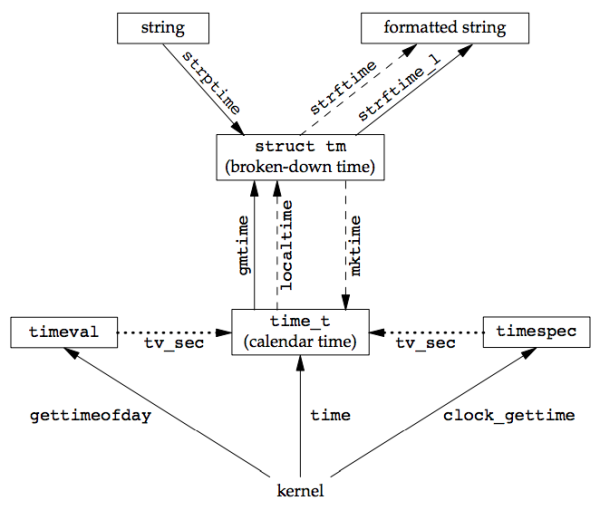

### **Chapter 6. System Data Files and Information**

This chapter covers portable interfaces to data files, system identification functions and the time and date functions.

### Password File

The UNIX System's password file, called the user database by POSIX.1, contains the following fields:

[](figure_6.1.png "Figure 6.1 Fields in /etc/passwd file")

Historically, the password file has been stored in `/etc/passwd` and has been an ASCII file.

* `root` has a user ID of 0 (superuser)
* The encrypted password field contains a single character as a placeholder (`x`)
* Some fields can be empty
* The shell field contains the user's login shell. The default value for an empty shell field is usually `/bin/sh`. Other executable that prevents a user from loggin in to a system:
    * `/dev/null`
    * `/bin/false`: exits with an unsuccessful (nonzero) status
    * `/bin/true`: exits with a successful (zero) status
    * `nologin`: prints a customizable error message and exits with a nonzero exit status
* `nobody` user name can be used to allow people to log in to a system, but with a user ID (65534) and group ID (65534) that provide no privileges.
* Some systems that provide the `finger(1)` command support additional information in the comment field

Some systems provide the `vipw` command to allow administrators to edit the password file.

<small>[apue_getpwuid.h](https://gist.github.com/shichao-an/00b608f959de8dad0b1b)</small>

```c
#include <pwd.h>

struct passwd *getpwuid(uid_t uid);
struct passwd *getpwnam(const char *name);

/* Both return: pointer if OK, NULL on error */
```

* `getpwuid`: used by the `ls(1)` program to map the numerical user ID contained in an i-node into a user's login name.
* `getpwnam`: used by the `login(1)` program when we enter our login name

Both functions return a pointer to a passwd structure that the functions fill in. <u>This structure is usually a static variable within the function, so its contents are overwritten each time we call either of these functions.</u>

<small>[apue_getpwent.h](https://gist.github.com/shichao-an/ffbbc20702760d6a4fab)</small>

```c
#include <pwd.h>

struct passwd *getpwent(void);

/* Returns: pointer if OK, NULL on error or end of file */

void setpwent(void);
void endpwent(void);
```

* `getpwent`: returns the next entry (a pointer to a structure that it has filled in, this structure is overwritten each time we call this function) in the password file.
* `setpwent`: rewinds files
* `endpwent`: closes files

Example:

* [getpwnam.c](https://github.com/shichao-an/apue.3e/blob/master/datafiles/getpwnam.c)

`setpwent` at the beginning of this function is self-defense: we ensure that the files are rewound, in case the caller has already opened them by calling getpwent.

### Shadow Passwords

Systems store the encrypted password in another file, often called the **shadow password file**. Minimally, this file has to contain the user name and the encrypted password.

[](figure_6.3.png "Figure 6.3 Fields in /etc/shadow file")

The shadow password file should not be readable by the world. Only a few programs need to access encrypted passwords, e.g. `login(1)` and `passwd(1)`, and these programs are often set-user-ID root. With shadow passwords, the regular password file, `/etc/passwd`, can be left readable by the world.

<small>[apue_getspnam.h](https://gist.github.com/shichao-an/bad119e8e6ed442e25bf)</small>

```c

#include <shadow.h>

struct spwd *getspnam(const char *name);
struct spwd *getspent(void);

/* Both return: pointer if OK, NULL on error */

void setspent(void);
void endspent(void);
```

### Group File

The UNIX System’s group file, called the group database by POSIX.1, contains the following fields:

[](figure_6.4.png "Figure 6.4 Fields in /etc/group file")

The field `gr_mem` is an array of pointers to the user names that belong to this group. This array is terminated by a null pointer.

<small>[apue_getgrgid.h](https://gist.github.com/shichao-an/c280f5fa5d15b006e8af)</small>

```c
#include <grp.h>

struct group *getgrgid(gid_t gid);
struct group *getgrnam(const char *name);

/* Both return: pointer if OK, NULL on error */
```

Like the password file functions, both of these functions normally return pointers to a static variable, which is overwritten on each call.

<small>[apue_getgrent.h](https://gist.github.com/shichao-an/98d14c0850ac1f357993)</small>

```c
#include <grp.h>

struct group *getgrent(void);

/* Returns: pointer if OK, NULL on error or end of file */

void setgrent(void);
void endgrent(void);
```

* `getgrent`: reads the next entry from the group file, opening the file first, if it’s not already open

### Supplementary Group IDs

`newgrp(1)` can be used to change the real group ID to the new group’s ID. We could always go back to our original group (as listed in `/etc/passwd`) by executing `newgrp` without any arguments.

With 4.2BSD, the concept of **supplementary group IDs** was introduced. The file access permission checks were modified so that in addition to comparing the the file’s group ID to the process effective group ID, it was also compared to all the supplementary group IDs.

The constant `NGROUPS_MAX` specifies the number of supplementary group IDs.

<small>[apue_getgroups.h](https://gist.github.com/shichao-an/72cd85f9279a4501249c)</small>

```c
#include <unistd.h>

int getgroups(int gidsetsize, gid_t grouplist[]);

/* Returns: number of supplementary group IDs if OK, −1 on error */

#include <grp.h> /* on Linux */
#include <unistd.h> /* on FreeBSD, Mac OS X, and Solaris */

int setgroups(int ngroups, const gid_t grouplist[]);

#include <grp.h> /* on Linux and Solaris */
#include <unistd.h> /* on FreeBSD and Mac OS X */

int initgroups(const char *username, gid_t basegid);

/* Both return: 0 if OK, −1 on error */
```

* `getgroups`
    * *gidsetsize* > 0: the function fills in the array up to *gidsetsize* supplementary group IDs
    * *gidsetsize* = 0: the function returns only the number of supplementary group IDs; `grouplist` is not modified
* `setgroups`: called by the superuser to set the supplementary group ID list for the calling process
* `initgroups`: reads the entire group file with the functions `getgrent`, `setgrent`, and `endgrent` and determines the group membership for username.  It then calls setgroups to initialize the supplementary group ID list for the user. It includes *basegid* in the supplementary group ID list; basegid is the group ID from the password file for username. See [Setting the Group IDs](http://www.gnu.org/software/libc/manual/html_node/Setting-Groups.html)


### Implementation Differences

[p184-185]


### Other Data Files

Numerous other files are used by UNIX systems in normal day-to-day operation.

Services and networks:

* `/etc/services`
* `/etc/protocols`
* `/etc/networks`

The general principle is that every data file has at least three functions:

* `get`: reads the next record, opening the file
* `set`: opens the file, if not already open, and rewinds the file
* `end`: closes the data file

Description | Data file | Header | Structure | Additional keyed lookup functions
----------- | --------- | ------ | --------- | ---------------------------------
passwords | `/etc/passwd` | `<pwd.h>` | `passwd` | `getpwnam`, `getpwuid`
groups | `/etc/group` | `<grp.h>` | `group` | `getgrnam`, `getgrgid`
shadow | `/etc/shadow` | `<shadow.h>` | `spwd` | `getspnam`
hosts | `/etc/hosts` | `<netdb.h>` | `hostent` | `getnameinfo`, `getaddrinfo`
networks | `/etc/networks` | `<netdb.h>` | `netent` | `getnetbyname`, `getnetbyaddr`
protocols | `/etc/protocols` | `<netdb.h>` | `protoent` | `getprotobyname`, `getprotobynumber`
services | `/etc/services` | `<netdb.h>` | `servent` | `getservbyname`, `getservbyport`

### Login Accounting

Two data files provided with most UNIX systems:

* `utmp`: keeps track of all the users currently logged in
* `wtmp`: keeps track of all logins and logouts

```c
struct utmp {
    char ut_line[8]; /* tty line: "ttyh0", "ttyd0", "ttyp0", ... */
    char ut_name[8]; /* login name */
    long ut_time; /* seconds since Epoch */
};
```

On login, the `login` program fills one of these structures, and writes it to the `utmp` and `wtmp` file. On logout, the `init` process erases this entry (fills with null bytes) in `utmp` file and appends a new logout entry. This logout entry in the `wtmp` file had the `ut_name` field zeroed out. Special entries were appended to the `wtmp` file to indicate when the system was rebooted and right before and after the system’s time and date was changed.

The `who(1)` program read the `utmp` file and printed its contents in a readable form


### System Identification

<small>[apue_uname.h](https://gist.github.com/shichao-an/7477d4a7e401fc628fe9)</small>

```c
#include <sys/utsname.h>

int uname(struct utsname *name);

/* Returns: non-negative value if OK, −1 on error */
```

```c
struct utsname {
    char sysname[]; /* name of the operating system */
    char nodename[]; /* name of this node */
    char release[]; /* current release of operating system */
    char version[]; /* current version of this release */
    char machine[]; /* name of hardware type */
};
```

<small>[apue_gethostname.h](https://gist.github.com/shichao-an/bd385512d7844d84cf2b)</small>

```c
#include <unistd.h>

int gethostname(char *name, int namelen);

/* Returns: 0 if OK, −1 on error */
```

`gethostname` (now defined as part of POSIX.1) specifies that the maximum host name length is `HOST_NAME_MAX`.

Interface | FreeBSD 8.0 | Linux 3.2.0 | Mac OS X 10.6.8 | Solaris 10
--------- | ----------- | ----------- | --------------- | ----------
`uname` | 256 | 65 | 256 | 257
`gethostname` | 256 | 64 | 256 | 256

If the host is connected to a TCP/IP network, the <u>host name is normally the fully qualified domain name of the host.</u>

There is also a `hostname(1)` command that can fetch or set the host name. (The host name is set by the superuser using a similar function, `sethostname`.) The host name is normally set at bootstrap time from one of the start-up files invoked by `/etc/rc` or `init`.

### Time and Date Routines

**Calendar times**: number of seconds (represented in a `time_t` data type) that have passed since the [Epoch](http://en.wikipedia.org/wiki/Unix_time): 00:00:00 January 1, 1970, Coordinated Universal Time (UTC). These calendar times represent both the time and the date. The UNIX System has always differed from other operating systems in:

* keeping time in UTC instead of the local time
* automatically handling conversions, such as daylight saving time
* keeping the time and date as a single quantity

The `time` function returns the current time and date.

<small>[apue_time.h](https://gist.github.com/shichao-an/2b5d80841cbdf01791cd)</small>

```c
#include <time.h>

time_t time(time_t *calptr);

/* Returns: value of time if OK, −1 on error */
```

The time value is always returned as the value of the function. If the argument is non-null, the time value is also stored at the location pointed to by *calptr*.

#### Clock type identifiers

The real-time extensions to POSIX.1 added support for multiple system clocks. A clock is identified by the `clockid_t` type.

Identifier | Option | Description
---------- | ------ | -----------
`CLOCK_REALTIME` | | real system time
`CLOCK_MONOTONIC` | `_POSIX_MONOTONIC_CLOCK` | real system time with no negative jumps
`CLOCK_PROCESS_CPUTIME_ID` | `_POSIX_CPUTIME` | CPU time for calling process
`CLOCK_THREAD_CPUTIME_ID` | `_POSIX_THREAD_CPUTIME` | CPU time for calling thread

<small>[apue_clock_gettime.h](https://gist.github.com/shichao-an/83e13fecc886c9653976)</small>

```c
#include <sys/time.h>

int clock_gettime(clockid_t clock_id, struct timespec *tsp);
/* Returns: 0 if OK, −1 on error */

int clock_getres(clockid_t clock_id, struct timespec *tsp);
/* Returns: 0 if OK, −1 on error */

int clock_settime(clockid_t clock_id, const struct timespec *tsp);
/* Returns: 0 if OK, −1 on error */

int gettimeofday(struct timeval *restrict tp, void *restrict tzp);
/* Returns: 0 always */
```

* `clock_gettime`: gets the time of the specified clock. The time is returned in a [`timespec`](ch4.md#timespec-structure) structure
* `clock_getres`: determines the resolution of a given system clock. It initializes the `timespec` structure pointed to by the *tsp*
* `clock_settime`: sets the time for a particular clock.
* `gettimeofday`: now obsolescent. The only legal value for *tzp* is `NULL`.

Once we have the integer value that counts the number of seconds since the Epoch, we normally call a function to convert it to a broken-down time structure, and then call another function to generate a human-readable time and date.

[](figure_6.9.png "Figure 6.9 Relationship of the various time functions")

The two functions `localtime` and `gmtime` convert a calendar time into a broken-down time, a `tm` structure.

```c
struct tm { /* a broken-down time */
    int tm_sec; /* seconds after the minute: [0 - 60] */
    int tm_min; /* minutes after the hour: [0 - 59] */
    int tm_hour; /* hours after midnight: [0 - 23] */
    int tm_mday; /* day of the month: [1 - 31] */
    int tm_mon; /* months since January: [0 - 11] */
    int tm_year; /* years since 1900 */
    int tm_wday; /* days since Sunday: [0 - 6] */
    int tm_yday; /* days since January 1: [0 - 365] */
    int tm_isdst; /* daylight saving time flag: <0, 0, >0 */
};
```

The reason that the seconds can be greater than 59 is to allow for a [leap second](http://en.wikipedia.org/wiki/Leap_second).

<small>[apue_gmtime.h](https://gist.github.com/shichao-an/6be4fa71d74422d28709)</small>

```c
#include <time.h>

struct tm *gmtime(const time_t *calptr);
struct tm *localtime(const time_t *calptr);

/* Both return: pointer to broken-down time, NULL on error */
```

* `gmtime`: converts the calendar time to UTC time (broken time)
* `localtime`: converts the calendar time to local time (broken time)
* `mktime`: takes a broken-down time, expressed as a local time, and converts it into a `time_t` value
* The `strftime` and `strftime_l` functions are the same, except that the `strftime_l` function allows the caller to specify the locale as an argument. The strftime function uses the locale specified by the `TZ` environment variable
    * *tmptr* argument is the time value to format, specified by a pointer to a broken-down time value. [p192]
    * *format* argument controls the formatting of the time value

#### Conversion specifiers for `strftime`

Format | Description | Example
------ | ----------- | -------
`%a` | abbreviated weekday name | `Thu`
`%A` | full weekday name | `Thursday`
`%b` | abbreviated month name | `Jan`
`%B` | full month name | `January`
`%c` | date and time | `Thu Jan 19 21:24:52 2012`
`%C` | year/100: [00–99] | `20`
`%d` | day of the month: [01–31] | `19`
`%D` | date [MM/DD/YY] | `01/19/12`
`%e` | day of month (single digit preceded by space) [1–31] | `19`
`%F` | ISO 8601 date format [YYYY–MM–DD] | `2012-01-19`
`%g` | last two digits of ISO 8601 week-based year [00–99] | `12`
`%G` | ISO 8601 week-based year | `2012`
`%h` | same as `%b` | `Jan`
`%H` | hour of the day (24-hour format): [00–23] | `21`
`%I` | hour of the day (12-hour format): [01–12] | `09`
`%j` | day of the year: [001–366] | `019`
`%m` | month: [01–12] | `01`
`%M` | minute: [00–59] | `24`
`%n` | newline character |
`%p` | AM/PM | `PM`
`%r` | locale’s time (12-hour format) | `09:24:52 PM`
`%R` | same as `%H:%M` | `21:24`
`%S` | second: [00–60] | `52`
`%t` | horizontal tab character |
`%T` | same as `%H:%M:%S` | `21:24:52`
`%u` | ISO 8601 weekday [Monday = 1, 1–7] | `4`
`%U` | Sunday week number: [00–53] | `03`
`%V` | ISO 8601 week number: [01–53] | `03`
`%w` | weekday: [0 = Sunday, 0–6] | `4`
`%W` | Monday week number: [00–53] | `03`
`%x` | locale’s date 01/19/| `12`
`%X` | locale’s time 21:24:| `52`
`%y` | last two digits of year: [00–99] | `12`
`%Y` | year | `2012`
`%z` | offset from UTC in ISO 8601 format | `-0500`
`%Z` | time zone name | `EST`
`%%` | translates to a percent sign | `%`

* `strftime` example: [strftime.c](https://github.com/shichao-an/apue.3e/blob/master/datafiles/strftime.c)

#### Conversion specifiers for `strptime`

Format | Description
------ | -----------
`%a` | abbreviated or full weekday name
`%A` | same as `%a`
`%b` | abbreviated or full month name
`%B` | same as `%b`
`%c` | date and time
`%C` | all but the last two digits of the year
`%d` | day of the month: [01–31]
`%D` | date [MM/DD/YY]
`%e` | same as `%d`
`%h` | same as `%b`
`%H` | hour of the day (24-hour format): [00–23]
`%I` | hour of the day (12-hour format): [01–12]
`%j` | day of the year: [001–366]
`%m` | month: [01–12]
`%M` | minute: [00–59]
`%n` | any white space
`%p` | AM/PM
`%r` | locale’s time (12-hour format, AM/PM notation)
`%R` | time as `%H:%M`
`%S` | second: [00–60]
`%t` | any white space
`%T` | time as `%H:%M:%S`
`%U` | Sunday week number: [00–53]
`%w` | weekday: [0 = Sunday, 0–6]
`%W` | Monday week number: [00–53]
`%x` | locale’s date
`%X` | locale’s time
`%y` | last two digits of year: [00–99]
`%Y` | year
`%%` | translates to a percent sign

Functions that are affected by `TZ` environment variable. If defined, the value of this environment variable is used by these functions instead of the default time zone:

* `localtime`
* `mktime`
* `strftime`
