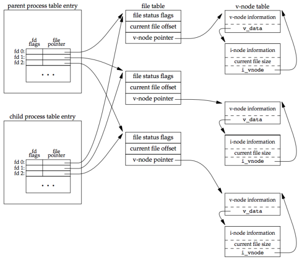
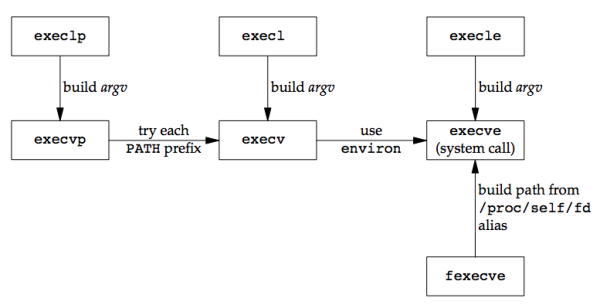

### **Chapter 8. Process Control**

### Process Identifiers

Every process has a unique process ID, a non-negative integer. As processes terminate, their IDs can be reused. <u>Most UNIX systems implement algorithms to delay reuse so that newly created processes are assigned IDs different from those used by processes that terminated recently. This prevents a new process from being mistaken for the previous process to have used the same ID.</u>

There are some special processes, but the details differ from implementation to implementation:

* Process ID 0: scheduler process (often known as the **swapper**), which is part of the kernel and is known as a system process
* Process ID 1: `init` process, invoked by the kernel at the end of the bootstrap procedure.
    * It is responsible for bringing up a UNIX system after the kernel has been bootstrapped. `init` usually reads the system-dependent initialization files (`/etc/rc*` files or `/etc/inittab` and the files in `/etc/init.d`) and brings the system to a certain state.
    * It never dies.
    * It is a normal user process, not a system process within the kernel.
    * It runs with superuser privileges.

<u>Each UNIX System implementation has its own set of kernel processes that provide operating system services.</u> For example, on some virtual memory implementations of the UNIX System, process ID 2 is the *pagedaemon*. This process is responsible for supporting the paging of the virtual memory system.

<small>[apue_getpid.h](https://gist.github.com/shichao-an/4afacfab973219fb4721)</small>

```c
include <unistd.h>

pid_t getpid(void);
/* Returns: process ID of calling process */

pid_t getppid(void);
/* Returns: parent process ID of calling process */

uid_t getuid(void);
/* Returns: real user ID of calling process */

uid_t geteuid(void);
/* Returns: effective user ID of calling process */

gid_t getgid(void);
/* Returns: real group ID of calling process */

gid_t getegid(void);
/* Returns: effective group ID of calling process */
```

None of these functions has an error return.

### `fork` Function

An existing process can create a new one by calling the `fork` function.

<small>[apue_fork.h](https://gist.github.com/shichao-an/1d1bfd83197d3c929164)</small>

```c
#include <unistd.h>

pid_t fork(void);

/* Returns: 0 in child, process ID of child in parent, −1 on error */
```

* The new process created by `fork` is called the **child process**. This function is called once but returns twice. The only difference in the returns is that the return value in the child is 0, whereas the return value in the parent is the process ID of the new child. [p299]
    * `fork` returns child's process ID in parent: a process can have more than one child, and <u>there is no function that allows a process to obtain the process IDs of its children</u>
    * `fork` returns 0 in child: <u>a process can have only a single parent, and the child can always call `getppid` to obtain the process ID of its parent</u>
* Both the child and the parent continue executing with the instruction that follows the call to `fork`. The child is a copy of the parent. For example, the child gets a copy of the parent’s data space, heap, and stack. Note that this is a copy for the child the parent and the child do not share these portions of memory. The parent and the child do share the text segment.
* Copy-on-write (COW) is used on modern implementations: a complete copy of the parent’s data, stack and heap is not performed. The shared regions are changed to read-only by the kernel. The kernel makes a copy of that piece of memory only if either process tries to modify these regions.

Variations of the `fork` function are provided by some platforms. All four platforms discussed in this book support the `vfork(2)` variant discussed in the next section. Linux 3.2.0 also provides new process creation through the `clone(2)` system call. This is a generalized form of `fork` that allows the caller to control what is shared between parent and child.

Example ([fork1.c](https://github.com/shichao-an/apue.3e/blob/master/proc/fork1.c)):

```c
#include "apue.h"

int globvar = 6; /* external variable in initialized data */
char buf[] = "a write to stdout\n";

int
main(void)
{
    int var; /* automatic variable on the stack */
    pid_t pid;

    var = 88;
    if (write(STDOUT_FILENO, buf, sizeof(buf)-1) != sizeof(buf)-1)
        err_sys("write error");
    printf("before fork\n"); /* we don’t flush stdout */

    if ((pid = fork()) < 0) {
        err_sys("fork error");
    } else if (pid == 0) { /* child */
        globvar++; /* modify variables */
        var++;
    } else {
        sleep(2); /* parent */
    }

    printf("pid = %ld, glob = %d, var = %d\n", (long)getpid(), globvar,
           var);
    exit(0);
}
```

```text
$ ./a.out
a write to stdout
before fork
pid = 430, glob = 7, var = 89 # child’s variables were changed
pid = 429, glob = 6, var = 88 # parent’s copy was not changed
$ ./a.out > temp.out
$ cat temp.out
a write to stdout
before fork
pid = 432, glob = 7, var = 89
before fork
pid = 431, glob = 6, var = 88
```

Analysis:

* Whether the child starts executing before the parent or vice versa is not known. The order depends on the scheduling algorithm used by the kernel. If it’s required that the child and parent synchronize their actions, some form of interprocess communication is required.
* `sizeof(buf)-1` (subtracting 1 from the size of `buf`) avoids writing the terminating null byte. `strlen` calculates the length of a string not including the terminating null byte, while `sizeof` calculates the size of the buffer, including the terminating null byte. However, using `strlen` requires a function call, whereas `sizeof` calculates the buffer length at compile time.
* "a write to stdout" (once): `write` function is not buffered and is called before the `fork`, its data is written once to standard output
* "before fork" (once in the first case, twice in the second case): <u>`printf` from the standard I/O library is buffered</u>
    * First case (running the program interactively): standard I/O is <u>line buffered</u> and standard output buffer is flushed by the newline
    * Second case (redirect stdout to a file): standard I/O is <u>fully buffered</u>. The `printf` (`printf("before fork\n");`) before the `fork` is called once, but the line remains in the buffer when `fork` is called. <u>This buffer is then copied into the child when the parent’s data space is copied to the child. Both the parent and the child now have a standard I/O buffer with this line in it.</u> The second `printf` (`printf("pid = %ld, glob = %d, var = %d\n", ...);`), right before the exit, just appends its data to the existing buffer. When each process terminates, its copy of the buffer is finally flushed.

#### File Sharing

One characteristic of `fork` is that all file descriptors that are open in the parent are duplicated in the child, because it’s as if the `dup` function had been called for each descriptor. The parent and the child shareafile table entry for every open descriptor.

For a process that has three different files opened for standard input, standard output, and standard error, on return from `fork`, we have the arrangement shown below:

[](figure_8.2.png "Figure 8.2 Sharing of open files between parent and child after fork")

It is important that the parent and the child share the same file offset. Otherwise, this type of interaction would be more difficult to accomplish and would require explicit actions by the parent.

There are two normal cases for handling the descriptors after a `fork`:

1. The parent waits for the child to complete.
2. Both the parent and the child go their own ways. After the fork, both the parent and child close the descriptors that they don't need, so neither interferes with the other’s open descriptors. This scenario is often found with network servers.

Besides the open files, other properties of the parent are inherited by the child:

* Real user ID, real group ID, effective user ID, and effective group ID
* Supplementary group IDs
* Process group ID
* Session ID
* Controlling terminal
* The set-user-ID and set-group-ID flags
* Current working directory
* Root directory
* File mode creation mask
* Signal mask and dispositions
* The close-on-exec flag for any open file descriptors
* Environment
* Attached shared memory segments
* Memory mappings
* Resource limits

The differences between the parent and child are:

* The return values from fork are different.
* The process IDs are different.
* The two processes have different parent process IDs: the parent process ID of the child is the parent; the parent process ID of the parent doesn’t change.
* The child’s `tms_utime`, `tms_stime`, `tms_cutime`, and `tms_cstime` values are set to 0 (these times are discussed in Section 8.17).
* File locks set by the parent are not inherited by the child.
* Pending alarms are cleared for the child.
* The set of pending signals for the child is set to the empty set

#### The two main reasons for `fork` to fail

1. If too many processes are already in the system, which usually means that something else is wrong
2. If the total number of processes for this real user ID exceeds the system’s limit. (`CHILD_MAX` specifies the maximum number of simultaneous processes per real user ID.)

#### The two uses for `fork`

1. When a process wants to duplicate itself so that the parent and the child can each execute different sections of code at the same time.
    * This is common for network servers—the parent waits for a service request from a client. When the request arrives, the parent calls `fork` and lets the child handle the request. The parent goes back to waiting for the next service request to arrive.
2. When a process wants to execute a different program.
    * This is common for shells. In this case, the child does an `exec` right after it returns from the `fork`.

Some operating systems combine the operations from step 2, a `fork` followed by an `exec`, into a single operation called a `spawn`. The UNIX System separates the two, as there are numerous cases where it is useful to `fork` without doing an `exec`. Also, separating the two operations allows the child to change the per-process attributes between the `fork` and the `exec`, such as I/O redirection, user ID, signal disposition, and so on

### `vfork` Function

The function `vfork` has the same calling sequence and same return values as `fork`, but the semantics of the two functions differ.

The `vfork` function was intended to create a new process for the purpose of executing a new program (step 2 at the end of the previous section). <u>The `vfork` function creates the new process, just like `fork`, without copying the address space of the parent into the child</u>, as the child won’t reference that address space; the child simply calls `exec` (or `exit`) right after the `vfork`. Instead, <u>the child runs in the address space of the parent until it calls either `exec` or `exit`.</u>

This optimization is more efficient on some implementations of the UNIX System, but leads to undefined results if the child:

* modifies any data (except the variable used to hold the return value from `vfork`)
* makes function calls
* returns without calling `exec` or `exit`

Another difference between the two functions is that `vfork` guarantees that the child runs first, until the child calls `exec` or `exit`. When the child calls either of these functions, the parent resumes. (This can lead to deadlock if the child depends on further actions of the parent before calling either of these two functions.)

Example ([vfork1.c](https://github.com/shichao-an/apue.3e/blob/master/proc/vfork1.c))

The program is a modified version of the program from [fork1.c](https://github.com/shichao-an/apue.3e/blob/master/proc/fork1.c). We’ve replaced the call to `fork` with `vfork` and removed the write to standard output. Also, we don’t need to have the parent call `sleep`, as we’re guaranteed that it is put to sleep by the kernel until the child calls either `exec` or `exit`.

```c
#include "apue.h"

int globvar = 6; /* external variable in initialized data */

int
main(void)
{
    int var; /* automatic variable on the stack */
    pid_t pid;

    var = 88;
    printf("before vfork\n"); /* we don’t flush stdio */
    if ((pid = vfork()) < 0) {
        err_sys("vfork error");
    } else if (pid == 0) { /* child */
        globvar++; /* modify parent’s variables */
        var++;
        _exit(0); /* child terminates */
    }

    /* parent continues here */
    printf("pid = %ld, glob = %d, var = %d\n", (long)getpid(), globvar,
           var);
    exit(0);
}
```
Running this program gives us

```text
$ ./a.out
before vfork
pid = 29039, glob = 7, var = 89
```

Analysis:

* The incrementing of the variables done by the child changes the values in the parent. Because the child runs in the address space of the parent.
* `_exit` is called instead of `exit`, because `_exit` does not perform any flushing of standard I/O buffers. If we call `exit` instead, the results are indeterminate. Depending on the implementation of the standard I/O library, we might see no difference in the output, or we might find that the output from the <u>first `printf`</u> (see [Doubts and Solutions](#doubts-and-solutions)) in the parent has disappeared.
    * If the implementation only flushes the standard I/O streams, then we will see no difference from the output generated if the child called `_exit`.
    * If the implementation also closes the standard I/O streams, however, the memory representing the `FILE` object for the standard output will be cleared out. Because the child is borrowing the parent’s address space, when the parent resumes and calls `printf`, no output will appear and `printf` will return −1.
    * The parent’s `STDOUT_FILENO` is still valid, as the child gets a copy of the parent’s file descriptor array


Most modern implementations of `exit` do not close the streams. Because the process is about to exit, the kernel will close all the file descriptors open in the process. Closing them in the library simply adds overhead without any benefit.

### `exit` Functions

A process can terminate normally in five ways (as described in [Section 7.3](ch7/#process-termination)):

1. Executing a return from the `main` function. This is equivalent to calling `exit`.
2. Calling the `exit` function, which includes the calling of all exit handlers that have been registered by calling `atexit` and closing all standard I/O streams.
    * ISO C does not deal with file descriptors, multiple processes (parents and children), and job control. The definition of this function is incomplete for a UNIX system.
3. Calling the `_exit` or `_Exit` function.
    * `_Exit`: defined by ISO C to provide a way for a process to terminate without running exit handlers or signal handlers
    * `_exit`: called by `exit` and handles the UNIX system-specific details; `_exit` is specified by POSIX.1.
    * Whether standard I/O streams are flushed depends on the implementation.
    * On UNIX systems, `_Exit` and `_exit` are synonymous and do not flush standard I/O streams.
4. Executing a `return` from the start routine of the last thread in the process.
    * The return value of the thread is not used as the return value of the process. When the last thread returns from its start routine, the process exits with a termination status of 0.
5. Calling the `pthread_exit` function from the last thread in the process.

The three forms of abnormal termination:

1. Calling `abort`. This is a special case of the next item, as it generates the `SIGABRT` signal.
2. When the process receives certain signals. The signal can be generated by:
    * the process itself, e.g. calling the `abort` function
    * some other processes
    * the kernel, e.g. the process references a memory location not within its address space or tries to divide by 0
3. The last thread responds to a cancellation request. By default, cancellation occurs in a deferred manner: one thread requests that another be canceled, and sometime later the target thread terminates.

Regardless of how a process terminates, the same code in the kernel is eventually executed. This kernel code closes all the open descriptors for the process, releases the memory that it was using, and so on.

The terminating process is to be able to notify its parent how it terminated by by passing an exit status as the argument to one of the three exit functions. In the case of an abnormal termination, the kernel (not the process) generates a termination status to indicate the reason for the abnormal termination. In any case, the parent of the process can obtain the termination status from either the `wait` or the `waitpid` function.

#### Exit status vs. termination status

* **Exit status**: is the argument to one of the three exit functions or the return value from main.
* **Termination status**: the exit status is converted into a termination status by the kernel when `_exit` is finally called. If the child terminated normally, the parent can obtain the exit status of the child.


#### Orphan process

**Orphan process** (or **orphaned child process**) is any process whose parent terminates.

The child has a parent process after the call to `fork`. What happens if the parent terminates before the child? The answer is the `init` process becomes the parent process of any process whose parent terminates. This is called "the process has been inherited by `init`". Whenever a process terminates, the kernel goes through all active processes to see whether the terminating process is the parent of any process that still exists. If so, the parent process ID of the surviving process is changed to be 1 (the process ID of `init`). This way, it's guaranteed that every process has a parent.

#### Zombie process

**Zombie process** is a process that has terminated, but whose parent has not yet waited for it. The `ps(1)` command prints the state of a zombie process
as *Z*.

What happens when a child terminates before its parent?

If the child completely disappeared, the parent wouldn’t be able to fetch its termination status when and if the parent was finally ready to check if the child had terminated. The kernel keeps a small amount of information for every terminating process, so that the information is available when the parent of the terminating process calls `wait` or `waitpid`. This information consists of the process ID, the termination status of the process, and the amount of CPU time taken by the process. The kernel can discard all the memory used by the process and close its open files.

#### `init`'s children

What happens when a process that has been inherited by `init` terminates? It does not become a zombie. `init` is written so that whenever one of its children terminates, `init` calls one of the `wait` functions to fetch the termination status. By doing this, init prevents the system from being clogged by zombies.

One of init’s children refers to either of the following:

* A process that `init` generates directly (e.g. `getty`)
* A process whose parent has terminated and has been subsequently inherited by `init`.


### `wait` and `waitpid` Functions
<u>When a process terminates, either normally or abnormally, the kernel notifies the parent by sending the `SIGCHLD` signal to the parent.</u> Because the termination of a child is an asynchronous event (it can happen at any time while the parent is running). This signal is the asynchronous notification from the kernel to the parent. The parent can choose to ignore this signal, or it can provide a function that is called when the signal occurs: a signal handler. <u>The default action for this signal is to be ignored.</u>

A process that calls `wait` or `waitpid` can:

* Block, if all of its children are still running
* Return immediately with the termination status of a child, if a child has terminated and is waiting for its termination status to be fetched
* Return immediately with an error, if it doesn’t have any child processes

If the process is calling `wait` because it received the `SIGCHLD` signal, we expect wait to return immediately. But if we call it at any random point in time, it can block.

<small>[apue_wait.h](https://gist.github.com/shichao-an/8eef8437e6dd5a045c18)</small>

```c
#include <sys/wait.h>

pid_t wait(int *statloc);
pid_t waitpid(pid_t pid, int *statloc, int options);

/* Both return: process ID if OK, 0 (see later), or −1 on error */
```

The differences between these two functions are:

* The `wait` function can block the caller until a child process terminates, whereas `waitpid` has an option that prevents it from blocking.
* The `waitpid` function doesn’t wait for the child that terminates first; it has a number of options that control which process it waits for.

If a child has already terminated and is a zombie, `wait` returns immediately with that child’s status. Otherwise, it blocks the caller until a child terminates. If the caller blocks and has multiple children, `wait` returns when one terminates. We can always tell which child terminated, because the process ID is returned by the function.

The argument `statloc` is is a pointer to an integer. If this argument is not a null pointer, the termination status of the terminated process is stored in the location pointed to by the argument.

The integer status that these two functions return has been defined by the implementation, with certain bits indicating the exit status (for a normal return), other bits indicating the signal number (for an abnormal return), one bit indicating whether a core file was generated, and so on.

Four mutually exclusive macros are defined in `<sys/wait.h>` to tell us how the process terminated, and they all begin with `WIF`. Based on which of these four macros is true, other macros are used to obtain the exit status, signal number, and the like.

Macros to examine the termination status returned by `wait` and `waitpid`:

Macro | Description
----- | -----------
`WIFEXITED(status)` | True if status was returned for a child that terminated normally. In this case, we can execute `WEXITSTATUS(status)` to fetch the low-order 8 bits of the argument that the child passed to `exit`, `_exit`, or `_Exit`.
`WIFSIGNALED(status)` | True if status was returned for a child that terminated abnormally, by receipt of a signal that it didn’t catch. In this case, we can execute `WTERMSIG(status)` to fetch the signal number that caused the termination. Additionally, some implementations (but not the Single UNIX Specification) define the macro `WCOREDUMP(status)` that returns true if a core file of the terminated process was generated.
`WIFSTOPPED(status)` | True if status was returned for a child that is currently stopped. In this case, we can execute `WSTOPSIG(status)` to fetch the signal number that caused the child to stop.
`WIFCONTINUED(status)` | True if status was returned for a child that has been continued after a job control stop (XSI option; `waitpid` only).

The function `pr_exit` uses these macros (above) to print a description of the termination status.

* [lib/prexit.c](https://github.com/shichao-an/apue.3e/blob/master/lib/prexit.c)

```c
#include "apue.h"
#include <sys/wait.h>

void
pr_exit(int status)
{
	if (WIFEXITED(status))
		printf("normal termination, exit status = %d\n",
				WEXITSTATUS(status));
	else if (WIFSIGNALED(status))
		printf("abnormal termination, signal number = %d%s\n",
				WTERMSIG(status),
#ifdef	WCOREDUMP
				WCOREDUMP(status) ? " (core file generated)" : "");
#else
				"");
#endif
	else if (WIFSTOPPED(status))
		printf("child stopped, signal number = %d\n",
				WSTOPSIG(status));
}
```

* [wait1.c](https://github.com/shichao-an/apue.3e/blob/master/proc/wait1.c)

```c
#include "apue.h"
#include <sys/wait.h>

int
main(void)
{
	pid_t	pid;
	int		status;

	if ((pid = fork()) < 0)
		err_sys("fork error");
	else if (pid == 0)				/* child */
		exit(7);

	if (wait(&status) != pid)		/* wait for child */
		err_sys("wait error");
	pr_exit(status);				/* and print its status */

	if ((pid = fork()) < 0)
		err_sys("fork error");
	else if (pid == 0)				/* child */
		abort();					/* generates SIGABRT */

	if (wait(&status) != pid)		/* wait for child */
		err_sys("wait error");
	pr_exit(status);				/* and print its status */

	if ((pid = fork()) < 0)
		err_sys("fork error");
	else if (pid == 0)				/* child */
		status /= 0;				/* divide by 0 generates SIGFPE */

	if (wait(&status) != pid)		/* wait for child */
		err_sys("wait error");
	pr_exit(status);				/* and print its status */

	exit(0);
}
```

Results:

```text
$ ./a.out
normal termination, exit status = 7
abnormal termination, signal number = 6 (core file generated)
abnormal termination, signal number = 8 (core file generated)
```

We print the signal number from `WTERMSIG`. We can look at the `<signal.h>` header to verify that `SIGABRT` has a value of 6 and that `SIGFPE` has a value of 8.


#### `wait` for a specific process: `waitpid`

If we have more than one child, `wait` returns on termination of any of the children. If we want to wait for a specific process to terminate (assuming we know which process ID we want to wait for), in older versions of the UNIX System, we would have to call `wait` and compare the returned process ID with the one we’re interested in. The POSIX.1 `waitpid` function can be used to wait for a specific process.

The interpretation of the pid argument for waitpid depends on its value:

* *pid* == −1 - Waits for any child process. In this respect, `waitpid` is equivalent to `wait`.
* *pid* > 0 - Waits for the child whose process ID equals *pid*.
* *pid* == 0 - Waits for any child whose **process group ID** equals that of the calling process.
* *pid* < −1 - Waits for any child whose process group ID equals the absolute value of *pid*.

The `waitpid` function returns the process ID of the child that terminated and stores the child’s termination status in the memory location pointed to by *statloc*.

##### Errors of `wait` and `waitpid`

* With `wait`, the only real error is if the calling process has no children. (Another error return is possible, in case the function call is interrupted by a signal) [p242]
* With `waitpid`, it’s possible to get an error if the specified process or process group does not exist or is not a child of the calling process

##### *options* argument of `waitpid`

The *options* argument either is 0 or is constructed from the bitwise OR of the constants in the table below.

The *options* constants for `waitpid`:

Constant | Description
-------- | -----------
`WCONTINUED` |  If the implementation supports job control, the status of any child specified by *pid* that has been continued after being stopped, but whose status has not yet been reported, is returned (XSI option).
`WNOHANG` | The `waitpid` function will not block if a child specified by *pid* is not immediately available. In this case, the return value is 0.
`WUNTRACED` | If the implementation supports job control, the status of any child specified by *pid* that has stopped, and whose status has not been reported since it has stopped, is returned. The `WIFSTOPPED` macro determines whether the return value corresponds to a stopped child process.

The `waitpid` function provides three features that aren’t provided by the `wait` function:

1. The `waitpid` function lets us wait for one particular process, whereas the `wait` function returns the status of any terminated child (`popen` function)
2. The `waitpid` function provides a nonblocking version of `wait`. There are times when we want to fetch a child’s status, but we don’t want to block.
3. The `waitpid` function provides support for job control with the `WUNTRACED` and `WCONTINUED` options.

##### `fork` twice

Example ([fork2.c](https://github.com/shichao-an/apue.3e/blob/master/proc/fork2.c))

If we want to write a process so that it `fork`s a child but we don’t want to wait for the child to complete and we don’t want the child to become a zombie until we terminate, <u>the trick is to call `fork` twice.</u>

```c
#include "apue.h"
#include <sys/wait.h>

int
main(void)
{
	pid_t	pid;

	if ((pid = fork()) < 0) {
		err_sys("fork error");
	} else if (pid == 0) {		/* first child */
		if ((pid = fork()) < 0)
			err_sys("fork error");
		else if (pid > 0)
			exit(0);	/* parent from second fork == first child */

		/*
		 * We're the second child; our parent becomes init as soon
		 * as our real parent calls exit() in the statement above.
		 * Here's where we'd continue executing, knowing that when
		 * we're done, init will reap our status.
		 */
		sleep(2);
		printf("second child, parent pid = %ld\n", (long)getppid());
		exit(0);
	}

	if (waitpid(pid, NULL, 0) != pid)	/* wait for first child */
		err_sys("waitpid error");

	/*
	 * We're the parent (the original process); we continue executing,
	 * knowing that we're not the parent of the second child.
	 */
	exit(0);
}
```

Results:

```text
$ ./a.out
$ second child, parent pid = 1
```

Analysis:

We call `sleep` in the second child to ensure that the first child terminates before printing the parent process ID. After a `fork`, either the parent or the child can continue executing; we never know which will resume execution first. If we didn’t put the second child to sleep, and if it resumed execution after the `fork` before its parent, the parent process ID that it printed would be that of its parent, not process ID 1.

<u>Note that the shell prints its prompt when the original process terminates, which is before the second child prints its parent process ID.</u>

### `waitid` Function

The Single UNIX Specification includes an additional `waitid` function to retrieve the exit status of a process.

<small>[apue_waitid.h](https://gist.github.com/shichao-an/30873cd97704d1465d3f)</small>

```c
#include <sys/wait.h>

int waitid(idtype_t idtype, id_t id, siginfo_t *infop, int options);

/* Returns: 0 if OK, −1 on error */
```

Like `waitpid`, `waitid` allows a process to specify which children to wait for. Instead of encoding this information in a single argument combined with the process ID or process group ID, two separate arguments are used. The `id` parameter is interpreted based on the value of *idtype*.

* The *idtype* constants for `waitid`:

    Constant | Description
    -------- | -----------
    `P_PID` | Wait for a particular process: *id* contains the process ID of the child to wait for.
    `P_PGID` | Wait for any child process in a particular process group: *id* contains the process group ID of the children to wait for.
    `P_ALL` | Wait for any child process: *id* is ignored.

* The *options* argument is a bitwise OR of the flags shown below:

    Constant | Description
    -------- | -----------
    `WCONTINUED` | Wait for a process that has previously stopped and has been continued, and whose status has not yet been reported.
    `WEXITED` | Wait for processes that have exited.
    `WNOHANG` | Return immediately instead of blocking if there is no child exit status available.
    `WNOWAIT` | Don’t destroy the child exit status. The child’s exit status can be retrieved by a subsequent call to `wait`, `waitid`, or `waitpid`.
    `WSTOPPED` | Wait for a process that has stopped and whose status has not yet been reported.

    At least one of `WCONTINUED`, `WEXITED`, or `WSTOPPED` must be specified in the options argument.

* The *infop* argument is a pointer to a `siginfo` structure. This structure contains detailed information about the signal generated that caused the state change in the child process (Section 10.14)

### `wait3` and `wait4` Functions

Most UNIX system implementations provide two additional functions: `wait3` and `wait4`, with an additional argument *rusage* that allows the kernel to return a summary of the resources used by the terminated process and all its child processes.

<small>[apue_wait3.h](https://gist.github.com/shichao-an/5cb7ed8df3666337a292)</small>

```c
#include <sys/types.h>
#include <sys/wait.h>
#include <sys/time.h>
#include <sys/resource.h>

pid_t wait3(int *statloc, int options, struct rusage *rusage);
pid_t wait4(pid_t pid, int *statloc, int options, struct rusage *rusage);

/* Both return: process ID if OK, 0, or −1 on error */
```

The resource information includes such statistics as the amount of user CPU time, amount of system CPU time, number of page faults, number of signals received, and the like. Refer to the `getrusage(2)` manual page for additional details.

### Race Conditions

A **race condition** occurs when multiple processes are trying to do something with shared data and the final outcome depends on the order in which the processes run. The `fork` function is a lively breeding ground for race conditions, <u>if any of the logic after the `fork` depends on whether the parent or child runs first. In general, we cannot predict which process runs first. Even if we knew which process would run first, what happens after that process starts running depends on the system load and the kernel’s scheduling algorithm.</u>

We saw a potential race condition in the program in [Figure 8.8](#fork-twice) when the second child printed its parent process ID.

* If the second child runs before the first child, then its parent process will be the first child.
* If the first child runs first and has enough time to `exit`, then the parent process of the second child is init.
* If the system was heavily loaded, the second child could resume after sleep returns, before the first child has a chance to run, calling `sleep`  guarantees nothing.

Problems of this form can be difficult to debug because they tend to work "most of the time".

* A process that wants to wait for a child to terminate must call one of the `wait` functions.
* A process that wants to wait for its parent to terminate can use a loop in the following form:

```c
while (getppid() != 1)
    sleep(1);
```

The problem with this type of loop, called **polling**, is that it wastes CPU time, as the caller is awakened every second to test the condition.

To avoid race conditions and to avoid polling, some form of signaling is required between multiple processes:

* Signals can be used for this purpose
* Interprocess communication (IPC) can also be used

For a parent and child relationship, we often have the following scenario. After the `fork`, both the parent and the child have something to do. For example, the parent could update a record in a log file with the child’s process ID, and the child might have to create a file for the parent. In this example, we require that each process tell the other when it has finished its initial set of operations, and that each wait for the other to complete, before heading off on its own. The following code illustrates this scenario:

```c
#include "apue.h"

TELL_WAIT(); /* set things up for TELL_xxx & WAIT_xxx */

if ((pid = fork()) < 0) {
    err_sys("fork error");
} else if (pid == 0) { /* child */

    /* child does whatever is necessary ... */

    TELL_PARENT(getppid()); /* tell parent we’re done */
    WAIT_PARENT(); /* and wait for parent */

    /* and the child continues on its way ... */

    exit(0);
}

/* parent does whatever is necessary ... */

TELL_CHILD(pid); /* tell child we’re done */
WAIT_CHILD(); /* and wait for child */

/* and the parent continues on its way ... */
exit(0);
```

We assume that the header [`apue.h`](https://github.com/shichao-an/apue.3e/blob/master/include/apue.h) defines whatever variables are required. The five routines `TELL_WAIT`, `TELL_PARENT`, `TELL_CHILD`, `WAIT_PARENT`, and `WAIT_CHILD` can be either macros or functions ([lib/tellwait.c](https://github.com/shichao-an/apue.3e/blob/master/lib/tellwait.c)). We’ll show various ways to implement these `TELL` and `WAIT` routines in later chapters: Section 10.16 shows an implementation using signals; Figure 15.7 shows an implementation using pipes.

The program below contains a race condition because the output depends on the order in which the processes are run by the kernel and the length of time for which each process runs.

* [tellwait1.c](https://github.com/shichao-an/apue.3e/blob/master/proc/tellwait1.c)

```c
#include "apue.h"

static void charatatime(char *);

int
main(void)
{
	pid_t	pid;

	if ((pid = fork()) < 0) {
		err_sys("fork error");
	} else if (pid == 0) {
		charatatime("output from child\n");
	} else {
		charatatime("output from parent\n");
	}
	exit(0);
}

static void
charatatime(char *str)
{
	char	*ptr;
	int		c;

	setbuf(stdout, NULL);			/* set unbuffered */
	for (ptr = str; (c = *ptr++) != 0; )
		putc(c, stdout);
}
```

Results:

```text
$ ./a.out
ooutput from child
utput from parent
$ ./a.out
ooutput from child
utput from parent
$ ./a.out
output from child
output from parent
```

Analysis:
We set the standard output unbuffered, so every character output generates a write.  The goal in this example is to allow the kernel to switch between the two processes as often as possible to demonstrate the race condition.

We need to change (part of) the above program in to use the `TELL` and `WAIT` functions.

* The parent goes first:

```c
	} else if (pid == 0) {
		WAIT_PARENT();		/* parent goes first */
		charatatime("output from child\n");
	} else {
		charatatime("output from parent\n");
		TELL_CHILD(pid);
	}
```

* The child goes first:

```c
	} else if (pid == 0) {
		charatatime("output from child\n");
		TELL_PARENT(getppid());
	} else {
		WAIT_CHILD(); /* child goes first */
		charatatime("output from parent\n");
	}
```

### `exec` Functions

One use of the `fork` function is to create a new process (the child) that then causes another program to be executed by calling one of the `exec` functions.

* When a process calls one of the `exec` functions, that process is completely replaced by the new program which starts executing at its `main` function.
* The process ID does not change across an `exec`, because a new process is not created.
* `exec` merely replaces the current process (its text, data, heap, and stack segments) with a brand-new program from disk.

UNIX System process control primitives:

* `fork` creates new processes
* `exec` functions initiates new programs
* `exit` handles termination
* `wait` functions handle waiting for termination

We’ll use these primitives in later sections to build additional functions, such as `popen` and `system`.

There are seven different `exec` functions:

<small>[apue_execl.h](https://gist.github.com/shichao-an/5e094ad41cdca4af53da)</small>

```c
#include <unistd.h>

int execl(const char *pathname, const char *arg0, ... /* (char *)0 */ );
int execv(const char *pathname, char *const argv[]);
int execle(const char *pathname, const char *arg0, ...
           /* (char *)0, char *const envp[] */ );
int execve(const char *pathname, char *const argv[], char *const envp[]);
int execlp(const char *filename, const char *arg0, ... /* (char *)0 */ );
int execvp(const char *filename, char *const argv[]);
int fexecve(int fd, char *const argv[], char *const envp[]);

/* All seven return: −1 on error, no return on success */
```

The first four take a pathname argument, the next two take a filename argument, and the last one takes a file descriptor argument.

When *filename* argument is specified:

* If filename contains a slash, it is taken as a pathname.
* Otherwise, the executable file is searched for in the directories specified by the PATH environment variable.
* The `PATH` variable contains a list of directories, called path prefixes, that are separated by colons, like the `name=value` environment string `PATH=/bin:/usr/bin:/usr/local/bin/:.`. The dot (`.`) specifies the current directory (There are security reasons for never including the current directory in the search path). A zero-length prefix also means the current directory. It can be specified as:
    * a colon at the beginning of the *value*: `PATH=:/bin:/usr/bin`
    * two colons in a row: `PATH=/bin::/usr/bin`
    * a colon at the end of the *value*: `PATH=/bin:/usr/bin:`
If either `execlp` or `execvp` finds an executable file using one of the path prefixes, but the file isn’t a machine executable that was generated by the link editor, the function assumes that the file is a shell script and tries to invoke `/bin/sh` with the filename as input to the shell.

With `fexecve` (using a file descriptor), the caller can verify the file is in fact the intended file and execute it without a race. Otherwise, a malicious user with appropriate privileges could replace the executable file (or a portion of the path to the executable file) after it has been located and verified, but before the caller can execute it. See [TOCTTOU](ch3.md#tocttou) errors in Section 3.3.

The passing of the argument list (`l` stands for list and `v` stands for vector):

* `execl`, `execlp`, and `execle` require each of the command-line arguments to be specified as separate arguments.
* `execv`, `execvp`, `execve`, and `fexecve` require (the address) of an array of pointers to the arguments

The arguments for `execl`, `execle`, and `execlp` are shown as:

```c
    char *arg0, char *arg1, ..., char *argn, (char *)0
```

The final command-line argument is followed by a null pointer. If this null pointer is specified by the constant 0, we must cast it to a pointer; if we don’t, it’s interpreted as an integer argument.

The passing of the environment list to the new program.

* `execle`, `execve`, and `fexecve` functions (ending in `e`) allow us to pass a pointer to an array of pointers to the environment strings.
* `execl`, `execv`, `execlp` and `execvp` use the `environ` variable in the calling process to copy the existing environment for the new program. [p251]

The arguments to `execle` were shown as:

```c
char *pathname, char *arg0, ..., char *argn, (char *)0, char *envp[]
```

#### Differences among the seven `exec` functions

Function | *pathname* | *filename* | *fd* | Arg list | `argv[]` | `environ` | `envp[]` |
-------- |:--------:|:--------:|:--:|:--------:|:------:|:-------:|:-----: |
`execl`   | * |   |   | * |   | * |   |
`execlp`  |   | * |   | * |   | * |   |
`execle`  | * |   |   | * |   |   | * |
`execv`   | * |   |   |   | * | * |   |
`execvp`  |   | * |   |   | * | * |   |
`execve`  | * |   |   |   | * |   | * |
`fexecve` |   |   | * |   | * |   | * |
(letter in name) |  | p | f | l | v |  | e |


Every system has a limit on the total size of the argument list and the environment list. This limit is given by `ARG_MAX` and its value must be at least 4,096 bytes on a POSIX.1 system. For example, the following command can generate a shell error:

```console
$ grep getrlimit /usr/share/man/*/*
Argument list too long
```
To get around the limitation in argument list size, we can use the `xargs(1)`:

```console
$ find /usr/share/man -type f -print | xargs grep getrlimit
$ find /usr/share/man -type f -print | xargs bzgrep getrlimit
```

The process ID does not change after an `exec`, but the new program inherits additional properties from the calling process:

* Process ID and parent process ID
* Real user ID and real group ID
* Supplementary group IDs
* Process group ID
* Session ID
* Controlling terminal
* Time left until alarm clock
* Current working directory
* Root directory
* File mode creation mask
* File locks
* Process signal mask
* Pending signals
* Resource limits
* Nice value
* Values for `tms_utime`, `tms_stime`, `tms_cutime`, and `tms_cstime`

The handling of open files depends on the value of the close-on-exec (`FD_CLOEXEC`) flag for each descriptor:

* If this flag is set, the descriptor is closed across an exec. The default (the flag is not set) is to leave the descriptor open across the `exec`.
* POSIX.1 specifically requires that open directory streams (see `opendir` in [Chapter 4](ch4.md#reading-directories)). This is normally done by the
`opendir` function calling `fcntl` to set the close-on-exec flag.

The real user ID and the real group ID remain the same across the `exec`, but the effective IDs can change, depending on the status of the set-user-ID and the setgroup-ID bits for the program file that is executed. If the set-user-ID bit is set for the new program, the effective user ID becomes the owner ID of the program file.  Otherwise, the effective user ID is not changed (it’s not set to the real user ID). The group ID is handled in the same way.


#### `exec` library functions and system call

In many UNIX system implementations, only one of these seven functions, `execve`, is a system call within the kernel. The other six are just library functions that eventually invoke this system call.

Relationship of the seven `exec` functions:

[](figure_8.15.png "Figure 8.15 Relationship of the seven exec functions")

Example:

* [exec1.c](https://github.com/shichao-an/apue.3e/blob/master/proc/exec1.c)

```c
#include "apue.h"
#include <sys/wait.h>

char	*env_init[] = { "USER=unknown", "PATH=/tmp", NULL };

int
main(void)
{
	pid_t	pid;

	if ((pid = fork()) < 0) {
		err_sys("fork error");
	} else if (pid == 0) {	/* specify pathname, specify environment */
		if (execle("/home/sar/bin/echoall", "echoall", "myarg1",
				"MY ARG2", (char *)0, env_init) < 0)
			err_sys("execle error");
	}

	if (waitpid(pid, NULL, 0) < 0)
		err_sys("wait error");

	if ((pid = fork()) < 0) {
		err_sys("fork error");
	} else if (pid == 0) {	/* specify filename, inherit environment */
		if (execlp("echoall", "echoall", "only 1 arg", (char *)0) < 0)
			err_sys("execlp error");
	}

	exit(0);
}
```

* [echoall.c](https://github.com/shichao-an/apue.3e/blob/master/proc/echoall.c)

```c
#include "apue.h"

int
main(int argc, char *argv[])
{
	int			i;
	char		**ptr;
	extern char	**environ;

	for (i = 0; i < argc; i++)		/* echo all command-line args */
		printf("argv[%d]: %s\n", i, argv[i]);

	for (ptr = environ; *ptr != 0; ptr++)	/* and all env strings */
		printf("%s\n", *ptr);

	exit(0);
}
```

Results:

```text
$ ./a.out
argv[0]: echoall
argv[1]: myarg1
argv[2]: MY ARG2
USER=unknown
PATH=/tmp
$ argv[0]: echoall
argv[1]: only 1 arg
USER=sar
LOGNAME=sar
SHELL=/bin/bash
...
HOME=/home/sar

```
Analysis:

* The program `echoall` is executed twice in the program.
* We set the first argument, `argv[0]` in the new program, to be the filename component of the pathname. Some shells set this argument to be the complete pathname. This is a convention only; we can set `argv[0]` to any string we like.
    * The `login` command does this when it executes the shell. Before executing the shell, login adds a dash as a prefix to `argv[0]` to indicate to the shell that it is being invoked as a login shell. A login shell will execute the start-up profile commands, whereas a nonlogin shell will not.
* The shell prompt (`$`) appeared before the printing of `argv[0]` from the second exec. This occurred because the parent did not wait for this child process to finish.

### Changing User IDs and Group IDs

In the UNIX System, privileges and access control are on user and group IDs. When programs need additional privileges or access to unallowed resources, they need to change their user or group ID to an ID that has the appropriate privilege or access. It is similar when the programs need to lower their privileges or prevent access to certain resources. [p255]

When designing applications, we try to use the **least-privilege** model, which means our programs should use the least privilege necessary to accomplish any given task. This reduces the risk that security might be compromised by a malicious user trying to trick our programs into using their privileges in unintended ways.

We can set the real user ID and effective user ID with the `setuid` function and set the real group ID and the effective group ID with the `setgid` function.

<small>[apue_setuid.h](https://gist.github.com/shichao-an/1df2f6a9e252b679bf37)</small>

```c
#include <unistd.h>

int setuid(uid_t uid);
int setgid(gid_t gid);

/* Both return: 0 if OK, −1 on error */
```

The rules for who can change the IDs, considering only the user ID now (Everything we describe for the user ID also applies to the group ID.)

1. <u>If the process has superuser privileges, the `setuid` function sets the real user ID, effective user ID, and saved set-user-ID to *uid*.</u>
2. <u>If the process does not have superuser privileges, but *uid* equals either the real user ID or the saved set-user-ID, setuid sets only the effective user ID to *uid*. The real user ID and the saved set-user-ID are not changed.</u>
3. If neither of these two conditions is true, `errno` is set to `EPERM` and −1 is returned.

We are assuming that `_POSIX_SAVED_IDS` is true. The saved IDs areamandatory feature in the 2001 version of POSIX.1.

The statements about the three user IDs that the kernel maintains:

1. Only a superuser process can change the real user ID.
    *  Normally, the real user ID is set by the `login(1)` program when we log in and never changes. Because `login` is a superuser process, it sets all three user IDs when it calls `setuid`.
2. The effective user ID is set by the `exec` functions only if the set-user-ID bit is set for the program file.
    * If the set-user-ID bit is not set, the `exec` functions leave the effective user ID as its current value.
    * We can call `setuid` at any time to set the effective user ID to either the real user ID or the saved set-user-ID.
    * Naturally, we can’t set the effective user ID to any random value.
3. The saved set-user-ID is copied from the effective user ID by `exec`. If the file’s set-user-ID bit is set, this copy is saved after `exec` stores the effective user ID from the file’s user ID.

The following figure summarizes the various ways these three user IDs can be changed:

[](figure_8.18.png "Figure 8.18 Ways to change the three user IDs")

We can obtain only the current value of the real user ID and the effective user ID with the functions `getuid` and `geteuid` ([apue_getpid.h](https://gist.github.com/shichao-an/4afacfab973219fb4721)). There is no portable way to obtain the current value of the saved set-user-ID. FreeBSD 8.0 and LINUX 3.2.0 provide the `getresuid` and `getresgid` functions, which can be used to get the saved set-user-ID and saved set-group-ID, respectively.

#### `setreuid` and `setregid` Functions

Historically, BSD supported the swapping of the real user ID and the effective user ID with the setreuid function.

<small>[apue_setreuid.h](https://gist.github.com/shichao-an/2228040fa94d5bf40fb9)</small>

```c
#include <unistd.h>

int setreuid(uid_t ruid, uid_t euid);
int setregid(gid_t rgid, gid_t egid);

/* Both return: 0 if OK, −1 on error */
```

* A value of −1 for any of the arguments indicates that the corresponding ID should remain unchanged.
* An unprivileged user can always swap between the real user ID and the effective user ID. This allows a set-user-ID program to swap to the user’s normal permissions and swap back again later for set-user-ID operations.
* When the saved set-user-ID feature was introduced with POSIX.1, the rule was enhanced to also allow an unprivileged user to set its effective user ID to its saved set-user-ID.

[p257]

#### `seteuid` and `setegid` Functions

POSIX.1 includes `seteuid` and `setegid` that only change the effective user ID or effective group ID.

<small>[apue_seteuid.h](https://gist.github.com/shichao-an/e6ef350b0f660b11e2ba)</small>

```c
#include <unistd.h>

int seteuid(uid_t uid);
int setegid(gid_t gid);

/* Both return: 0 if OK, −1 on error */
```

* An unprivileged user can set its effective user ID to either its real user ID or its saved set-user-ID.
* <u>For a privileged user, only the effective user ID is set to *uid*. This differs from `setuid` function, which changes all three user IDs.</u>

The figure below summarizes all the functions that we’ve described here that modify the three user IDs:

[](figure_8.19.png "Figure 8.19 Summary of all the functions that set the various user IDs")

#### Group IDs

Everything covered so far for user IDs in this section also applies in a similar fashion to group IDs. The [supplementary group IDs](ch6.md#supplementary-group-ids) are not affected by `setgid`, `setregid`, or `setegid`.


#### Example of set-user-ID programs: `at`

On Linux 3.2.0, the `at` program is installed set-user-ID to user `daemon` and the programs are run by the `atd(8)` daemon. This allows the at command to write privileged files owned by the daemon that will run the commands on behalf of the user running the `at` command.

To prevent privilege breach, the daemon that run the commands on users's behalf have to switch between sets of privileges: users and those of the daemon. The following steps take place [p259-260]:

1. Assuming that the `at` program file is owned by `root` with set-user-ID bit set. When we run it, we have:
    * real user ID = our user ID (unchanged)
    * effective user ID = root
    * saved set-user-ID = root
2. `at` command reduces its privileges by calling `seteuid` function to set the effective user ID to our read user ID:
    * real user ID = our user ID (unchanged)
    * effective user ID = our user ID
    * saved set-user-ID = root (unchanged)
3. When `at` needs to access the configuration files (these files are owned by the daemon that will run the commands for us) that control which commands are to be run and the time at which they need to run, it calls `seteuid` to set the effective user ID to root, which is allowed because the argument to seteuid equals the saved set-user-ID:
    * real user ID = our user ID (unchanged)
    * effective user ID = root
    * saved set-user-ID = root (unchanged)
4. After the files are modified to record the commands to be run and the time at which they are to be run, the `at` command lowers its privileges by calling `seteuid` to set its effective user ID to our user ID:
    * real user ID = our user ID (unchanged)
    * effective user ID = our user ID
    * saved set-user-ID = root (unchanged)
5. The daemon starts out running with root privileges. To run commands on our behalf, the daemon calls `fork` and the child calls `setuid` to change its user ID to our user ID. Because the child is running with root privileges, this changes all of the IDs. We have:
    * real user ID = our user ID
    * effective user ID = our user ID
    * saved set-user-ID = our user ID

Then the daemon safely executes commands on our behalf, because it can access only the files to which we normally have access.

By using the saved set-user-ID in this fashion, we can use the extra privileges granted to us by the set-user-ID of the program file only when we need elevated privileges. Any other time, however, the process runs with our normal permissions. [p260]

### Interpreter Files

On contemporary UNIX systems, **interpreter files** are text files that begin with a line of the form ([shebang](https://en.wikipedia.org/wiki/Shebang_(Unix))):

```sh
#! pathname [ optional-argument ]
```

The space between the exclamation point and the pathname is optional. The most common of these interpreter files begin with the line:

```sh
#!/bin/sh
```

* *pathname* is normally an absolute pathname, since no special operations are performed on it (`PATH` is not used)
* The recognition of interpreter files is done within the kernel as part of processing the `exec` system call
* The actual file that gets executed by the kernel is not the interpreter file, but rather the file specified by the *pathname* on the first line of the interpreter file.

##### Interpreter file vs. Interpreter

* Interpreter file: is a text file that begins with `#!`.
* Interpreter: is specified by the *pathname* on the first line of the interpreter file.

Be aware that systems place a size limit on the first line of an interpreter file. This limit includes the `#!`, the *pathname*, the optional argument, the terminating newline, and any spaces. On Linux 3.2.0, the limit is 128 bytes.


##### Example: A program that `exec`s an interpreter file

* [exec2.c](https://github.com/shichao-an/apue.3e/blob/master/proc/exec2.c)

```c
#include "apue.h"
#include <sys/wait.h>

int
main(void)
{
    pid_t pid;

    if ((pid = fork()) < 0) {
        err_sys("fork error");
    } else if (pid == 0) { /* child */
        if (execl("/home/sar/bin/testinterp",
                  "testinterp", "myarg1", "MY ARG2", (char *)0) < 0)
            err_sys("execl error");
    }
    if (waitpid(pid, NULL, 0) < 0) /* parent */
        err_sys("waitpid error");
    exit(0);
}
```

Results:

```text
$ cat /home/sar/bin/testinterp
#!/home/sar/bin/echoarg foo
$ ./a.out
argv[0]: /home/sar/bin/echoarg
argv[1]: foo
argv[2]: /home/sar/bin/testinterp
argv[3]: myarg1
argv[4]: MY ARG2
```

Analysis:

The program (from [Section 7.4](ch7.md#command-line-arguments)) `echoarg` is the interpreter that echoes each of its command-line arguments.

When the kernel `exec`s the interpreter (`/home/sar/bin/echoarg`):

* `argv[0]` is *pathname* of the interpreter
* `argv[1]` is the optional argument from the interpreter file (`foo`)
* The remaining arguments are the *pathname* (`/home/sar/bin/testinterp`) and the second and third arguments from the call to `execl` in the program (`myarg1` and `MY ARG2`)
* Both `argv[1]` and `argv[2]` from the call to `execl` have been shifted right two positions.
* The kernel takes the *pathname* from the `execl` call instead of the first argument (`testinterp`), on the assumption that the *pathname* might contain more information than the first argument.

##### Example: `awk`

A common use for the optional argument following the interpreter pathname is to specify the `-f` option for programs that support this option. For example, an `awk(1)` program can be executed as:

```sh
awk -f myfile
```

It tells `awk` to read the `awk` program from the file `myfile`.

Using the `-f` option with an interpreter file lets us write

```sh
#!/bin/awk -f
# (awk program follows in the interpreter file)
```

* [awkexample](https://github.com/shichao-an/apue.3e/blob/master/proc/awkexample)

```sh
#!/usr/bin/awk -f
BEGIN {
    for (i = 0; i < ARGC; i++)
        printf "ARGV[%d] = %s\n", i, ARGV[i]
    exit
}
```

Assume the above interpreter file is  `/usr/local/bin/awkexample` and one of the path prefixes is `/usr/local/bin`, we can execute the program:

```text
$ awkexample file1 FILENAME2 f3
ARGV[0] = awk
ARGV[1] = file1
ARGV[2] = FILENAME2
ARGV[3] = f3
```

When `/bin/awk` is executed, its command-line arguments are:

```sh
/bin/awk -f /usr/local/bin/awkexample file1 FILENAME2 f3
```

[p263]

Interpreter files provide an efficiency gain for the user at some expense in the kernel, since it’s the kernel that recognizes these files. They are useful for the following reasons:

First, they hide that certain programs are scripts in some other language. For example, use `awkexample optional-arguments` instead of `awk -f awkexample optional-argument`, we do not need to know that the program is really an `awk` script.

Second, interpreter scripts provide an efficiency gain. For example, if we place the previous `awk` program into a shell script like this:

```sh
awk 'BEGIN {
    for (i = 0; i < ARGC; i++)
        printf "ARGV[%d] = %s\n", i, ARGV[i]
    exit
}' $*
```
More work is required when executing this script:

1. The shell reads the command and tries to `execlp` the filename (shell script). Since the shell script is an executable file but isn't a machine executable, an error is returned and `execlp` assumes that the file is a shell script.
2. `/bin/sh` is executed with the pathname of the shell script as its argument.
3. The shell correctly runs the script, but to run the `awk` programs, the shell does `fork`, `exec` and `wait`.

Third, interpreter scripts let us write shell scripts using shells other than `/bin/sh`. When it finds an executable file that isn’t a machine executable, `execlp` has to choose a shell to invoke, and it always uses `/bin/sh`.

### `system` Function

It is convenient to execute a command string from within a program.

<small>[apue_system.h](https://gist.github.com/shichao-an/37133deff99ae0661101)</small>

```c
#include <stdlib.h>

int system(const char *cmdstring);
```

Arguments:

If *cmdstring* is a null pointer, system returns nonzero only if a command processor is available, which determines whether the `system` function is supported on a given platform. Under UNIX systems, it is always available.

Return values:

Since `system` is implemented by calling `fork`, `exec`, and `waitpid`, there are three types of return values:

1. If either the `fork` fails or `waitpid` returns an error other than `EINTR`, `system` returns −1 with `errno` set to indicate the error.
2. If the `exec` fails, implying that the shell can’t be executed, the return value is as if the shell had executed `exit(127)`.
3. If all three functions succeed, the return value is the termination status of the shell, in the format specified for `waitpid`.

The code below is an implementation of the `system` function, which doesn't handle signals.

```c
#include	<sys/wait.h>
#include	<errno.h>
#include	<unistd.h>

int
system(const char *cmdstring)	/* version without signal handling */
{
	pid_t	pid;
	int		status;

	if (cmdstring == NULL)
		return(1);		/* always a command processor with UNIX */

	if ((pid = fork()) < 0) {
		status = -1;	/* probably out of processes */
	} else if (pid == 0) {				/* child */
		execl("/bin/sh", "sh", "-c", cmdstring, (char *)0);
		_exit(127);		/* execl error */
	} else {							/* parent */
		while (waitpid(pid, &status, 0) < 0) {
			if (errno != EINTR) {
				status = -1; /* error other than EINTR from waitpid() */
				break;
			}
		}
	}

	return(status);
}
```
* The shell’s `-c` option tells it to take the next command-line argument, *cmdstring*, as its command input instead of reading from standard input or from a given file. The shell parses this null-terminated C string and breaks it up into separate command-line arguments for the command. The actual command string that is passed to the shell can contain any valid shell commands.
* `_exit` is called instead of `exit`. This prevents any standard I/O buffers, which would have been copied from the parent to the child across the `fork`, from being flushed in the child.

[p266-267]

#### Set-User-ID Programs

<u>Calling `system` from a set-user-ID program creates a security hole and should never be attempted.</u>

[p267-269]

The superuser permissions that we gave the set-user-ID program are retained across the `fork` and `exec` that are done by `system`.

If it is running with special permissions (set-user-ID or set-group-ID), and wants to spawn another process, a process should use `fork` and `exec` directly, being certain to change back to normal permissions after the `fork`, before calling `exec`. The `system` function should never be used from a set-user-ID or a set-group-ID program.

### Process Accounting

On UNIX systems, process accounting can be enabled so that kernel writes an accounting record each time a process terminates, which typically contain a small amount of binary data with the name of the command, the amount of CPU time used, the user ID and group ID, the starting time.

The function `acct` enables and disables process accounting. The only use of this function is from the `accton(8)` command.

A superuser executes accton with a pathname argument to enable accounting. The accounting records are written to the specified file, which is usually `/var/account/acct` on FreeBSD and Mac OS X, `/var/log/account/pacct` on Linux, and `/var/adm/pacct` on Solaris. Accounting is turned off by executing accton without any arguments.

The structure of the accounting records is defined in the header `<sys/acct.h>`, which look something like:

```c
typedef u_short comp_t; /* 3-bit base 8 exponent; 13-bit fraction */

struct acct
{
    char ac_flag; /* flag (see Figure 8.26) */
    char ac_stat; /* termination status (signal & core flag only) */
    /* (Solaris only) */
    uid_t ac_uid; /* real user ID */
    gid_t ac_gid; /* real group ID */
    dev_t ac_tty; /* controlling terminal */
    time_t ac_btime; /* starting calendar time */
    comp_t ac_utime; /* user CPU time */
    comp_t ac_stime; /* system CPU time */
    comp_t ac_etime; /* elapsed time */
    comp_t ac_mem; /* average memory usage */
    comp_t ac_io; /* bytes transferred (by read and write) */
    /* "blocks" on BSD systems */
    comp_t ac_rw; /* blocks read or written */
    /* (not present on BSD systems) */
    char ac_comm[8]; /* command name: [8] for Solaris, */
    /* [10] for Mac OS X, [16] for FreeBSD, and */
    /* [17] for Linux */
};
```

* Times are recorded in units of clock ticks on most platforms, but FreeBSD stores microseconds instead.
* The `ac_flag` member records certain events during the execution of the process. See table below.

`ac_flag` | Description | FreeBSD 8.0 | Linux 3.2.0 | Mac OS X 10.6.8 | Solaris 10
--------- | ----------- | ----------- | ----------- | --------------- | ----------
`AFORK` | process is the result of `fork`, but never called `exec` | x | x | x | x
`ASU` | process used superuser privileges | | x | x | x
`ACORE` | process dumped core | x | x | x |
`AXSIG` | process was killed by a signal | x | x | x |
`AEXPND` | expanded accounting entry | | | | x
`ANVER` | new record format | x | | |

The data required for the accounting record (e.g. CPU times and number of characters transferred) is kept by the kernel in the process table and initialized whenever a new process is created, as in the child after a `fork`. Each accounting record is written when the process terminates. This has two consequences:

* We cannot get accounting records for processes that never terminate, such as `init` and kernel daemons.
* The order of the records in the accounting file corresponds to the termination order of the processes, not the order in which they were started. [p270]. We can’t reconstruct the exact starting order of various processes, given the data in the accounting file.

The accounting records correspond to processes, not programs. A new record is initialized by the kernel for the child after a `fork`, not when a new program is executed. Although exec doesn’t create a new accounting record, the command name changes, and the `AFORK` flag is cleared. For example, if A `exec`s B, then B `exec`s C, and C `exit`, only a single accounting record is written.  The command name in the record corresponds to program C, but the CPU times are the sum for programs A, B, and C.


### User Identification

Any process can find out its real and effective user ID and group ID. `getpwuid(getuid())` can be used to find out the login name of the user who’s running the program. However, a single user can have multiple login names, that is, a person might have multiple entries in the password file with the same user ID to have a different login shell for each entry. The system normally keeps track of the name we log in under the `utmp` file (see [Section 6.8](/apue/ch6/#login-accounting)), and the `getlogin` function provides a way to fetch that login name.

<small>[apue_getlogin.h](https://gist.github.com/shichao-an/c77a9e8660a3405a983c)</small>

```c
#include <unistd.h>

char *getlogin(void);

/* Returns: pointer to string giving login name if OK, NULL on error */
```

This function can fail if the process is not attached to a terminal that a user logged in to. We normally call these processes **daemons**.

Given the login name, we can then use it to look up the user in the password file (e.g. to determine the login shell) using `getpwnam`.

The environment variable `LOGNAME` is usually initialized with the user’s login name by `login(1)` and inherited by the login shell. However, a user can modify an environment variable, so we shouldn’t use `LOGNAME` to validate the user in any way. Instead, we should use `getlogin`.

### Process Scheduling

Historically, the UNIX System provided processes with only coarse control over their scheduling priority. The scheduling policy and priority were determined by the kernel.

* A process could choose to run with lower priority by adjusting its **nice value**
    * A process could be "nice" and reduce its share of the CPU by adjusting its nice value
* Only a privileged process was allowed to increase its scheduling priority.

In the Single UNIX Specification, nice values range from 0 to `(2*NZERO)−1`, although some implementations support a range from 0 to `2*NZERO`. Lower nice values have higher scheduling priority. Lower nice values have higher scheduling priority. <u>"The more nice you are, the lower your scheduling priority is."</u> `NZERO` is the default nice value of the system. [p276]

A process can retrieve and change its nice value with the `nice` function. With this function, a process can affect only its own nice value; it can’t affect the nice value of any other process.

<small>[apue_nice.h](https://gist.github.com/shichao-an/3c3be1b450591dc9488f)</small>

```c
#include <unistd.h>

int nice(int incr);

/* Returns: new nice value − NZERO if OK, −1 on error */
```

* The *incr* argument is added to the nice value of the calling process.
    * If *incr* is too large or too small, the system silently reduces it to the maximum or minimum legal value.
    * -1 is a legal successful return value. We need to clear `errno` before calling nice and check its value if nice returns −1. If the call to nice succeeds and the return value is −1, then errno will still be zero. If `errno` is nonzero, it means that the call to nice failed.

The `getpriority` function can be used to get the nice value for a process and for a group of related processes.

<small>[apue_getpriority.h](https://gist.github.com/shichao-an/fade39d67294333ef22b)</small>

```c
#include <sys/resource.h>

int getpriority(int which, id_t who);

/* Returns: nice value between −NZERO and NZERO−1 if OK, −1 on error */
```

* The *which* argument can take on one of three following values; it controls how the *who* argument is interpreted:
    * `PRIO_PROCESS`: a process
    * `PRIO_PGRP`: a process group
    * `PRIO_USER`: a user ID
* The *who* argument:
    * 0 (a value of zero): the calling process, process group, or user (depending on the value of the *which* argument).

When the which argument applies to more than one process, the highest priority (lowest value) of all the applicable processes is returned.

The `setpriority` function can be used to set the priority of a process, a process group, or all the processes belonging to a particular user ID.

<small>[apue_setpriority.h](https://gist.github.com/shichao-an/3b435940e3b7c43df4d6)</small>

```c
#include <sys/resource.h>

int setpriority(int which, id_t who, int value);

/* Returns: 0 if OK, −1 on error */
```

The *which* and *who* arguments are the same as in the *getpriority* function. The *value* is added to `NZERO` and this becomes the new nice value.

A child process inherits the nice value from its parent process in FreeBSD 8.0, Linux 3.2.0, Mac OS X 10.6.8, and Solaris 10.


### Process Times

Three times can be measured:

* **Wall clock time**
* **User CPU time**
* **System CPU time**

Any process can call the `times` function to obtain these values for itself and any terminated children.

<small>[apue_times.h](https://gist.github.com/shichao-an/a663bc3fb2c0274f9e02)</small>

```c
#include <sys/times.h>

clock_t times(struct tms *buf);

/* Returns: elapsed wall clock time in clock ticks if OK, −1 on error */
```

This function fills in the `tms` structure pointed to by *buf*:

```c
struct tms {
    clock_t tms_utime; /* user CPU time */
    clock_t tms_stime; /* system CPU time */
    clock_t tms_cutime; /* user CPU time, terminated children */
    clock_t tms_cstime; /* system CPU time, terminated children */
};
```
The `tms` structure does not contain any measurement for the wall clock time. Instead, the function returns the wall clock time as the value of the function. This value is measured from some arbitrary point in the past, so we can’t use its absolute value; instead, we use its relative value. We call `times` and save the return value. At some later time, we call `times` again and subtract the earlier return value from the new return value. The difference is the wall clock time.

The two structure fields for child processes contain values only for children that we have waited for with one of the `wait` functions.

All the `clock_t` values returned by this function are converted to seconds using the number of clock ticks per second, the `_SC_CLK_TCK` value returned by `sysconf`, that is, divide the `clock_t` value by the `_SC_CLK_TCK` value. For example,

[p280-282]

```c
#include "apue.h"
#include <sys/times.h>

clock_t start, end;
long clktck = 0;
struct tms tmsstart, tmsend

if ((clktck = sysconf(_SC_CLK_TCK)) < 0)
    err_sys("sysconf error");

if ((start = times(&tmsstart)) == -1) /* starting values */
    err_sys("times error");

/* do some work */

if ((end = times(&tmsend)) == -1) /* ending values */
    err_sys("times error");

printf(" real: %7.2f\n", real / (double) clktck);
```

### Summary

A thorough understanding of process control is essential for advanced UNIX programming. There are only a few functions to master: `fork`, the `exec` family, `_exit`, `wait`, and `waitpid`. These primitives are used in many applications.

Examination of the `system` function and process accounting gave us another look at all these process control functions.

An understanding of the various user IDs and group IDs that are provided (real, effective, and saved) is critical to writing safe set-user-ID programs.


### Doubts and Solutions
#### Verbatim

p235 on `vfork`
> If we call `exit` instead, the results are indeterminate. Depending on the implementation of the standard I/O library, we might see no difference in the output, or we might find that the output from the first `printf` in the parent has disappeared.

I think "first `printf`" should be "second `printf`", because the output of the first `printf` is flushed. For the second `printf`, it says "no output will appear and `printf` will return −1".
