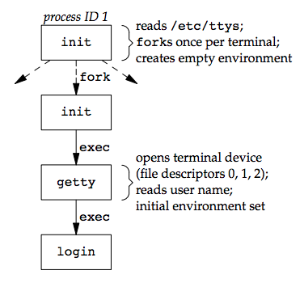
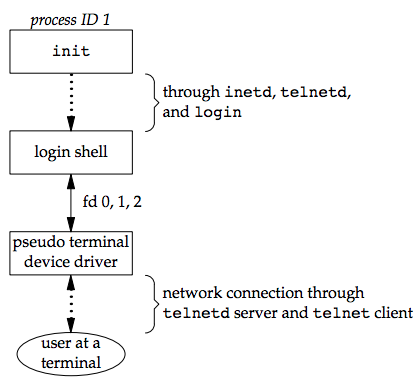
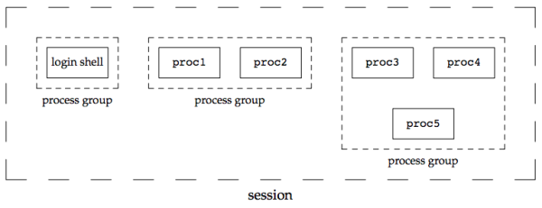
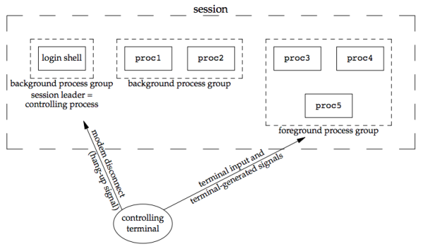
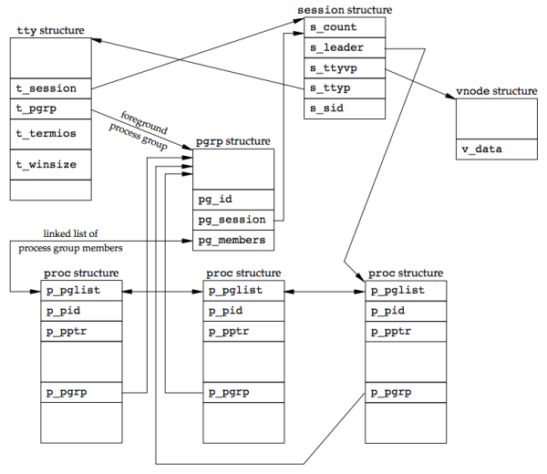

### **Chapter 9. Process Relationships**

### Introduction

Every process has a parent process (the initial kernel-level process is usually its own parent). The parent is notified when the child terminates, and the parent can obtain the child’s exit status.

This chapter details process groups and the concept of session introduced by POSIX.1, as well as relationship between the login shell that is invoked when a user logs in and all the processes that are started from the login shell.

The concept of UNIX system signal mechanism in [Chapter 10](ch10.md) is needed.

### Terminal Logins

In early UNIX systems, the terminals (dumb terminals that are hard-wired connected to the host) were either local (directly connected) or remote (connected through a modem). These logins came through a terminal device driver in the kernel. [p285]

As bitmapped graphical terminals became available, windowing systems were developed to provide users with new ways to interact with host computers.  Applications were developed to create "terminal windows" to emulate character-based terminals, allowing users to interact with hosts in familiar ways (i.e., via the shell command line).

Today, some platforms allow you to start a windowing system after logging in, whereas other platforms automatically start the windowing system for you. In the latter case, you might still have to log in, depending on how the windowing system is configured (some windowing systems can be configured to log you in automatically).

The procedure that we now describe is used to log in to a UNIX system using a terminal. The procedure is similar regardless of the type of terminal we use. It could be a:

* character-based terminal,
* a graphical terminal emulating a simple character-based terminal,
* or a graphical terminal running a windowing system.

#### BSD Terminal Logins

The file `/etc/ttys` (created by the system administrator) has one line per terminal device. Each line specifies the name of the device and other parameters (e.g. baud rate) that are passed to the `getty` program.

After the system is bootstrapped, the kernel creates the `init` process (PID 1) which brings the system up in multiuser mode. The `init` process reads the file `/etc/ttys` and, for every terminal device that allows a login, does a `fork` followed by an `exec` of the program `getty`.

[](figure_9.2.png "Figure 9.2 State of processes after login has been invoked")

All the processes shown in the figure above have a real user ID of 0 and an effective user ID of 0 (they all have superuser privileges). All the processes other than the original `init` process have a parent process ID of 1.

* The `init` process `exec`s the `getty` program with an empty environment.
* `getty` calls `open` to open terminal device for reading and writing. File descriptors 0, 1, and 2 are set to the device.
* Then, `getty` outputs something like `login:` and waits for us to enter our user name. `getty` can detect special characters to change the terminal's speed (baud rate). [p287]
* When we enter our user name, `getty`’s job is complete, and it then invokes the `login` program, similar to:

        execle("/bin/login", "login", "-p", username, (char *)0, envp);

* Though `init` invokes `getty` with an empty environment, `getty` creates an environment for `login` (the `envp` argument) with the name of the terminal (something like `TERM=foo`, where the type of terminal `foo` is taken from the `gettytab` file) and any environment strings that are specified in the `gettytab`. The `-p` flag to `login` tells it to preserve the environment that it is passed and to add to that environment, not replace it.
* `login` does the following things:
    * It calls `getpwnam` to fetch our password file entry.
    * It calls `getpass(3)` to display the prompt `Password:` and read our password (with echoing disabled).
    * It calls `crypt(3)` to encrypt the password that we entered and compares the encrypted result to the `pw_passwd` field from our shadow password file entry.
    * If the login attempt fails because of an invalid password (after a few tries), `login` calls `exit` with an argument of 1. This termination will be noticed by the parent (`init`), and it will do another `fork` followed by an `exec` of `getty`, starting the procedure over again for this terminal.

This is the traditional authentication procedure used on UNIX systems. Modern UNIX systems have evolved to support multiple authentication procedures. FreeBSD, Linux, Mac OS X, and Solaris all support a more flexible scheme known as PAM ([Pluggable Authentication Modules](https://en.wikipedia.org/wiki/Pluggable_authentication_module)). PAM allows an administrator to configure the authentication methods to be used to access services that are written to use the PAM library. [p288]

If we log in correctly, `login` will:

* Change to our home directory (`chdir`)
* Change the ownership of our terminal device (`chown`) so we own it
* Change the access permissions for our terminal device so we have permission to read from and write to it
* Set our group IDs by calling `setgid` and `initgroups`
* Initialize the environment with all the information that login has:
    * our home directory (`HOME`),
    * shell (`SHELL`),
    * user name (`USER` and `LOGNAME`),
    * and a default path (`PATH`).
* Change to our user ID (`setuid`) and invoke our login shell, as in

        execl("/bin/sh", "-sh", (char *)0);

    The minus sign as the first character of `argv[0]` is a flag to all the shells that indicates they are being invoked as a **login shell**. The shells can look at this character and modify their start-up accordingly.

The `login` can optionally print the [message-of-the-day](https://en.wikipedia.org/wiki/Motd_(Unix)) file, check for new mail, and performs other tasks.

Since it is called by a superuser process, `setuid` changes all three user IDs: the real user ID, effective user ID, and saved set-user-ID. The call to `setgid` that was done earlier by `login` has the same effect on all three group IDs.

At this point, our login shell is running. Its parent process ID is the original `init` process (process ID 1), so when our login shell terminates, `init` is sent a `SIGCHLD` signal and it starts the whole procedure over again for this terminal. File descriptors 0, 1, and 2 for our login shell are set to the terminal device. See the figure below:

[](figure_9.3.png "Figure 9.3 Arrangement of processes after everything is set for a terminal login")

Our login shell now reads its start-up files (`.profile` for the Bourne shell and Korn shell; `.bash_profile`, `.bash_login`, or `.profile` for the GNU Bourne-again shell; and `.cshrc` and `.login` for the C shell). These start-up files usually change some of the environment variables and add many other variables to the environment. For example, most users set their own `PATH` and often prompt for the actual terminal type (`TERM`). When the start-up files are done, we finally get the shell’s prompt and can enter commands.

#### Mac OS X Terminal Logins

On Mac OS X, the terminal login process follows essentially the same steps as in the BSD login process (since Mac OS X is based in part on FreeBSD) with the following differences:

* The work of `init` is performed by `launchd`.
* We are presented with a graphical-based login screen from the start.

#### Linux Terminal Logins

The Linux login procedure is very similar to the BSD procedure. The login command is derived from 4.3BSD. The main difference is in terminal configuration.

Some Linux distributions ship with a version of the `init` program that uses administrative files patterned after System V’s `init` file formats. where `/etc/inittab` specifies the terminal devices for which `init` should start a `getty` process. Other Linux distributions, such as Ubuntu, ship with a version of init that is known as "[Upstart](https://en.wikipedia.org/wiki/Upstart)". It uses configuration files named `*.conf` that are
stored in the `/etc/init` directory. For example, the specifications for running `getty` on `/dev/tty1` might be found in the file `/etc/init/tty1.conf`.

Depending on the version of `getty` in use, the terminal characteristics are specified either on the command line (as with `agetty`) or in the file `/etc/gettydefs` (as with `mgetty`).

#### Solaris Terminal Logins

[p290]


### Network Logins

The main difference between a serial terminal login and a network login is that the connection between the terminal and the computer isn’t point-to-point. In this case, `login` is simply a service available, just like any other network service, such as FTP or SMTP.

With the terminal logins, `init` knows which terminal devices are enabled for logins and spawns a `getty` process for each device. In the case of network logins, however, all the logins come through the kernel’s network interface drivers (e.g., the Ethernet driver), and we don’t know ahead of time how many of these will occur. Instead of having a process waiting for each possible login, we now have to wait for a network connection request to arrive.

To allow the same software to process logins over both terminal logins and network logins, a software driver called a **pseudo terminal** (detailed in [Chapter 19](ch19.md)) is used to emulate the behavior of a serial terminal and map terminal operations to network operations, and vice versa.


#### BSD Network Logins

In BSD, the `inetd` process, sometimes called the *Internet superserver*, waits for most network connections.

As part of the system start-up, `init` invokes a shell that executes the shell script `/etc/rc`, which starts `inetd` along with other daemons. Once the shell script terminates, the parent process of `inetd` becomes `init`; `inetd` waits for TCP/IP connection requests to arrive at the host. When a connection request arrives for it to handle, `inetd` does a `fork` and `exec` of the appropriate program.

Assume a TCP connection request arrives for the TELNET server (a remote login application). The remote user initiates the login by starting the TELNET client:

```sh
telnet hostname
```

The client opens a TCP connection to *hostname* and the user who started the client program is now logged in to the server’s host. The figure below shows the sequence of processes involved in executing the TELNET server, called `telnetd`:

[](figure_9.4.png "Figure 9.4 Sequence of processes involved in executing TELNET server")

Then, <u>the `telnetd` process then opens a pseudo terminal device and splits into two processes using `fork`,</u> which do the following:

* The parent (`telnetd`) handles the communication across the network connection.
* The child `exec`s the `login` program.
* The parent and the child are connected through the pseudo terminal. Before doing the `exec`, the child sets up file descriptors 0, 1, and 2 to the pseudo terminal.
* If we log in correctly, login performs the same steps described in [Section 9.2](#bsd-terminal-logins): it changes to our home directory and sets our group IDs, user ID, and our initial environment. Then `login` replaces itself with our login shell by calling `exec`.

[](figure_9.5.png "Figure 9.5 Arrangement of processes after everything is set for a network login")

Whether we log in through a terminal ([Figure 9.3](figure_9.3.png)) or a network ([Figure 9.5](figure_9.5.png)), we have a login shell with its standard input, standard output, and standard error connected to either a terminal device or a pseudo terminal device.

In the coming sections, we'll see that the login shell is the start of a POSIX.1 session, and that the terminal or pseudo terminal is the controlling terminal for the session.

#### Mac OS X Network Logins

The network login on Mac OS X is identical to that on BSD, except that the `telnet` daemon is run from `launchd`. By default, the `telnet` daemon is disabled on Mac OS X (although it can be enabled with the `launchctl(1)` command). The preferred way to perform a network login on Mac OS X is with `ssh`, the secure shell command.

#### Linux Network Logins

Network logins under Linux are the same as under BSD, except that some distributions use an alternative `inetd` process called the extended Internet services daemon, `xinetd`. The `xinetd` process provides a finer level of control over services it starts compared to `inetd`.

#### Solaris Network Logins

[p293]

### Process Groups

In addition to having a process ID, each process belongs to a **process group**.

* A process group is a collection of one or more processes (usually associated with the same job) that can receive signals from the same terminal.
* Each process group has a unique process group ID. Process group IDs are similar to process IDs: they are positive integers and can be stored in a `pid_t` data type.

The function `getpgrp` returns the process group ID of the calling process. The `getpgid` function took a *pid* argument and returned the process group for that process.

<small>[apue_getpgrp.h](https://gist.github.com/shichao-an/08bcc3cf9a23ca95c00a)</small>

```c
#include <unistd.h>

pid_t getpgrp(void);
/* Returns: process group ID of calling process */

pid_t getpgid(pid_t pid);
/* Returns: process group ID if OK, −1 on error */
```

For `getpgid`, if *pid* is 0, the process group ID of the calling process is returned. Thus,

```c
getpgid(0);
```

is equivalent to:

```c
getpgrp();
```

Each process group can have a **process group leader**, whose process group ID equals to its process ID.

#### Process group lifetime

The process group life time is the period of time that begins when the group is created and ends when the last remaining process leaves the group. It is possible for a process group leader to create a process group, create processes in the group, and then terminate. The process group still exists, as long as at least one process is in the group, regardless of whether the group leader terminates. The last remaining process in the process group can either terminate or enter some other process group.

#### `setpgid` function

A process can join an existing process group or creates a new process group by calling `setpgid`.

<small>[apue_setpgid.h](https://gist.github.com/shichao-an/0b1832544be00d3a9490)</small>

```c
#include <unistd.h>

int setpgid(pid_t pid, pid_t pgid);

/* Returns: 0 if OK, −1 on error */
```

The `setpgid` function sets the process group ID of the process whose process ID equals *pid* to *pgid*.

Arguments:

* If *pid* == *pgid*, the process specified by *pid* becomes a process group leader.
* If *pid* == 0, the process ID of the caller is used.
* If *pgid* == 0, then the specified *pid* is used as the process group ID.

Rules:

* A process can set the process group ID of only itself or any of its children.
* A process cannot change the process group ID of one of its children after that child has called one of the `exec` functions.

##### Job-control shells

In most job-control shells, this function is called after a `fork` to have the parent set the process group ID of the child, and to have the child set its own process group ID. <u>One of these calls is redundant, but by doing both, we are guaranteed that the child is placed into its own process group before either process assumes that this has happened.  If we didn’t do this, we would have a race condition, since the child’s process group membership would depend on which process executes first.</u> (See [Doubts and Solutions](##doubts-and-solutions) for details) [p294]


##### Process groups and signals

We can send a signal to either a single process (identified by its process ID) or a process group (identified by its process group ID). Similarly, the `waitpid` function lets us wait for either a single process or one process from a specified process group.

### Sessions

A **session** is a collection of one or more process groups.

[](figure_9.6.png "Figure 9.6 Arrangement of processes into process groups and sessions")

The processes in a process group are usually placed there by a shell pipeline. The arrangement in the figure above is generated by the shell commands of the form:

```sh
proc1 | proc2 &
proc3 | proc4 | proc5
```

#### The `setsid` function

A process establishes a new session by calling the `setsid` function.

<small>[apue_setsid.h](https://gist.github.com/shichao-an/48edc52023515e0df704)</small>

```c
#include <unistd.h>

pid_t setsid(void);

/* Returns: process group ID if OK, −1 on error */
```

If the calling process is not a process group leader, this function creates a new session. Three things happen:

1. The process becomes the **session leader** of this new session. (A session leader is the process that creates a session.) The process is the only process in this new session
2. The process becomes the process group leader of a new process group. The new process group ID is the process ID of the calling process.
3. The process has no controlling terminal. If the process had a controlling terminal before calling `setsid`, that association is broken.

<u>This function returns an error if the caller is already a process group leader.</u>

#### Ensuring the successful call of `setsid`

Since the `setsid` function returns an error if the caller is a process group leader, to ensure this is not the case, the usual practice is to call `fork` and have the parent terminate and the child continue. It is guaranteed that the child is not a process group leader, because the process group ID of the parent is inherited by the child, but the child gets a new process ID. Hence, it is impossible for the child’s process ID to equal its inherited process group ID.

#### Session Leader and Session ID

The Single UNIX Specification talks only about a "session leader"; there is no "session ID" similar to a process ID or a process group ID. A session leader is a single process that has a unique process ID, so we could talk about a session ID that is the process ID of the session leader. This concept of a session ID was introduced in SVR4.

#### The `getsid` function

The `getsid` function returns the process group ID of a process’s session leader.

<small>[apue_getsid.h](https://gist.github.com/shichao-an/745eaee552865545e529)</small>

```c
#include <unistd.h>

pid_t getsid(pid_t pid);

/* Returns: session leader’s process group ID if OK, −1 on error */
```

If *pid* is 0, `getsid` returns the process group ID of the calling process’s session leader. For security reasons, some implementations may restrict the calling process from obtaining the process group ID of the session leader if *pid* doesn’t belong to the same session as the caller.

### Controlling Terminal

Sessions and process groups have a few other characteristics.

* A session can have a single **controlling terminal**. This is usually the terminal device (in the case of a [terminal login](##terminal-logins)) or pseudo terminal device (in the case of a [network login](#network-logins)) on which we log in.
* The session leader that establishes the connection to the controlling terminal is called the **controlling process**.
* The process groups within a session can be divided into a single **foreground process group** and one or more **background process groups**.
* If a session has a controlling terminal, it has a single foreground process group and all other process groups in the session are background process groups.
* Whenever we press the terminal’s interrupt key (often DELETE or Control-C), the interrupt signal is sent to all processes in the foreground process group.
* Whenever we press the terminal’s quit key (often Control-backslash), the quit signal is sent to all processes in the foreground process group.
* If a modem (or network) disconnect is detected by the terminal interface, the hang-up signal is sent to the controlling process (the session leader).

These characteristics are shown in the figure below:

[](figure_9.7.png "Figure 9.7 Process groups and sessions showing controlling terminal")

Usually, the controlling terminal is established automatically when we log in.

#### Mechanisms of allocating a controlling terminal

##### System V

Systems derived from UNIX System V allocate the controlling terminal for a session when the session leader opens the first terminal device that is not already associated with a session, as long as the call to `open` does not specify the `O_NOCTTY` flag.

##### BSD

BSD-based systems allocate the controlling terminal for a session when the session leader calls `ioctl` with a request argument of `TIOCSCTTY` (the third argument is a null pointer). The session cannot already have a controlling terminal for this call to succeed. Normally, this call to `ioctl` follows a call to `setsid`, which guarantees that the process is a session leader without a controlling terminal.

Note that although Mac OS X 10.6.8 is derived from BSD, it behaves like System V when allocating a controlling terminal.

Method | FreeBSD 8.0 | Linux 3.2.0 | Mac OS X 10.6.8 | Solaris 10
------ | ----------- | ----------- | --------------- | ----------
`open` without `O_NOCTTY` | | x | x | x
`TIOCSCTTY` `ioctl` command | x | x | x | x

When a program wants to talk to the controlling terminal, regardless of whether the standard input or standard output is redirected, it can `open` the file `/dev/tty`. This special file is a synonym within the kernel for the controlling terminal. If the program doesn’t have a controlling terminal, the `open` of this device will fail.

##### The `crypt` command and `getpass` function

The classic example is the `getpass(3)` function, which reads a password (with terminal echoing turned off, of course). [p298]

The `getpass` function is called by the `crypt(1)` program and can be used in a pipeline. For example:

```sh
crypt < salaries | lpr
```

It decrypts the file salaries and pipes the output to the print spooler. Because `crypt` reads its input file on its standard input, the standard input can’t be used to enter the password. Also, `crypt` is designed so that we have to enter the encryption password each time we run the program, to prevent us from saving the password in a file (which could be a security hole).

### `tcgetpgrp`, `tcsetpgrp`, and `tcgetsid` Functions

We need a way to tell the kernel which process group is the foreground process group, so that the terminal device driver knows where to send the terminal input and the terminal-generated signals. ([Figure 9.7](figure_9.7.png))

<small>[apue_tcgetpgrp.h](https://gist.github.com/shichao-an/93937e8a69a6f2971055)</small>

```c
#include <unistd.h>

pid_t tcgetpgrp(int fd);
/* Returns: process group ID of foreground process group if OK, −1 on error */

int tcsetpgrp(int fd, pid_t pgrpid);
/* Returns: 0 if OK, −1 on error */
```

* The function `tcgetpgrp` returns the process group ID of the foreground process group associated with the terminal open on *fd*.
* If the process has a controlling terminal, the process can call `tcsetpgrp` to set the foreground process group ID to *pgrpid*. The value of *pgrpid* must be the process group ID of a process group in the same session, and *fd* must refer to the controlling terminal of the session.

These two functions are normally called by job-control shells.

The `tcgetsid` function allows an application to obtain the process group ID for the session leader given a file descriptor for the controlling TTY.

<small>[apue_tcgetsid.h](https://gist.github.com/shichao-an/16ba6f5516fc48ec7f84)</small>

```c
#include <termios.h>

pid_t tcgetsid(int fd);

/* Returns: session leader’s process group ID if OK, −1 on error */
```

Applications that need to manage controlling terminals can use `tcgetsid` to identify the session ID of the controlling terminal’s session leader, which is equivalent to the session leader’s process group ID.

### Job Control

**Job control** allows us to start multiple jobs (groups of processes) from a single terminal and to control which jobs can access the terminal and which jobs are run in the background. Job control requires three forms of support:

1. A shell that supports job control
2. The terminal driver in the kernel must support job control
3. The kernel must support certain job-control signals

From our perspective, when using job control from a shell, we can start a job in either the foreground or the background. A job is simply a collection of processes, often a pipeline of processes.

For example, start a job consisting of one process in the foreground:

```sh
vi main.c
```

Start two jobs in the background (all the processes invoked by these background jobs are in the background.):

```sh
pr *.c | lpr &
make all &
```

#### Korn shell example

When we start a background job, the shell assigns it a job identifier and prints one or more of the process IDs.

```shell-session
$ make all > Make.out &
[1] 1475
$ pr *.c | lpr &
[2] 1490
$   # just press RETURN
[2] + Done pr *.c | lpr &
[1] + Done make all > Make.out &
```

* The `make` is job number 1 and the starting process ID is 1475. The next pipeline is job number 2 and the process ID of the first process is 1490.
* When the jobs are done and we press RETURN, the shell tells us that the jobs are complete. The reason we have to press RETURN is to have the shell print its prompt. The shell doesn’t print the changed status of background jobs at any random time (only after we press RETURN and right before it prints its prompt, to let us enter a new command line). If the shell didn’t do this, it could produce output while we were entering an input line.
* The interaction with the terminal driver arises because a special terminal character affects the foreground job. The terminal driver looks for three special characters, which generate signals to (all processes in ) the foreground process group:
    * `SIGINT`: generated by the interrupt character (typically DELETE or Control-C).
    * `SIGQUIT`: generated by the quit character (typically Control-backslash).
    * `SIGTSTP`: generated by the suspend character (typically Control-Z).

While we can have a foreground job and one or more background jobs, only the foreground job receives terminal input (the characters that we enter at the terminal). It is not an error for a background job to try to read from the terminal, but the terminal driver detects this and sends a special signal to the background job: `SIGTTIN`. This signal normally stops the background job; by using the shell, we are notified of this event and can bring the job into the foreground so that it can read from the terminal.

```shell-session
cat > temp.foo &   # start in background, but it’ll read from standard input
[1] 1681
$                  # we press RETURN
[1] + Stopped (SIGTTIN) cat > temp.foo &
$ fg %1            # bring job number 1 into the foreground
cat > temp.foo     # the shell tells us which job is now in the foreground
hello, world       # enter one line
ˆD                 # type the end-of-file character
$ cat temp.foo     # check that the one line was put into the file
hello, world
```

* `SIGTTIN`: When the background `cat` tries to read its standard input (the controlling terminal), the terminal driver, knowing that it is a background job, sends the `SIGTTIN` signal to the background job.
* The shell detects the change in status of its child (see `wait` and `waitpid` function in [Section 8.6](ch8.md#wait-and-waitpid-functions)) and tells us that the job has been stopped.
* The shell’s `fg` command move the stopped job into the foreground, which causes the shell to place the job into the foreground process group (tcsetpgrp) and send the continue signal (`SIGCONT`) to the process group.
* Since it is now in the foreground process group, the job can read from the controlling terminal.

Note that this example doesn’t work on Mac OS X 10.6.8. When we try to bring the cat command into the foreground, the read fails with errno set to EINTR. Since Mac OS X is based on FreeBSD, and FreeBSD works as expected, this must be a bug in Mac OS X.

There is an option that we can allow or disallow a background job to send its output to the controlling terminal. Normally, we use the `stty(1)` command to change this option.

```shell-session
$ cat temp.foo &   # execute in background
[1] 1719
$ hello, world     # the output from the background job appears after the prompt
we press RETURN
[1] + Done cat temp.foo &
$ stty tostop      # disable ability of background jobs to output to controlling terminal
$ cat temp.foo &   # try it again in the background
[1] 1721
$                  # we press RETURN and find the job is stopped
[1] + Stopped(SIGTTOU) cat temp.foo &
$ fg %1            # resume stopped job in the foreground
cat temp.foo       # the shell tells us which job is now in the foreground
hello, world       # and here is its output
```

When we disallow background jobs from writing to the controlling terminal, cat will block when it tries to write to its standard output, because the terminal driver identifies the write as coming from a background process and sends the job the `SIGTTOU` signal. When we use the shell’s `fg` command to bring the job into the foreground, the job completes.

The figure below summarizes some of the features of job control that have been described so far:

[](figure_9.9.png "Figure 9.9 Summary of job control features with foreground and background jobs, and terminal driver")

* The solid lines through the terminal driver box mean that the terminal I/O and the terminal-generated signals are always connected from the foreground process group to the actual terminal.
* The dashed line corresponding to the `SIGTTOU` signal means that whether the output from a process in the background process group appears on the terminal is an option.

Job control was originally designed and implemented before windowing terminals were widespread. It is a required feature of POSIX.1. [p302-303]

### Shell Execution of Programs

This section examines how the shells execute programs and how this relates to the concepts of process groups, controlling terminals, and sessions

#### The shell without job control: the Bourne shell on Solaris

For example, with the classic Bourne shell running on Solaris, we execute:

```sh
ps -o pid,ppid,pgid,sid,comm
```

The output is

```text
  PID  PPID  PGID  SID COMMAND
  949   947   949  949 sh
 1774   949   949  949 ps
```

* The parent of the `ps` command is the shell.
* Both the shell and the `ps` command are in the same session and foreground process group (949), <u>because that is what you get when you execute a command with a shell that doesn’t support job control.</u>

##### Terminal process group ID: `tpgid` option of the `ps(1)` command

[p303]

Some platforms support an `tpgid` option to have the `ps(1)` command print the process group ID associated with the session’s controlling terminal. This value would be shown under the TPGID column:

```sh
ps -o pid,ppid,pgid,sid,tpgid,comm
```

Note that it is misleading to associate a process with a terminal process group ID (the TPGID column):

* A process does not have a terminal process control group. A process belongs to a process group, and the process group belongs to a session.
* The session may or may not have a controlling terminal.
    * If the session does have a controlling terminal, then the terminal device knows the process group ID of the foreground process. This value can be set in the terminal driver with the `tcsetpgrp` function ([Figure 9.9](figure_9.9.png)).
* The foreground process group ID is an attribute of the terminal, not the process. This value from the terminal device driver is what `ps` prints as the TPGID. If it finds that the session doesn’t have a controlling terminal, `ps` prints either 0 or −1, depending on the platform.

If we execute the command in the background:

```sh
ps -o pid,ppid,pgid,sid,comm &
```

The only value that changes is the process ID of the command:

```text
  PID  PPID  PGID  SID COMMAND
  949   947   949  949 sh
 1812   949   949  949 ps
```

This shell doesn’t know about job control, so the background job is not put into its own process group and the controlling terminal isn’t taken away from the background job.

To see how this shell handles a pipeline, we execute:

```sh
ps -o pid,ppid,pgid,sid,comm | cat1
```

The output is:

```text
  PID  PPID  PGID  SID COMMAND
  949   947   949  949 sh
 1823   949   949  949 cat1
 1824  1823   949  949 ps
```

The program `cat1` is just a copy of the standard `cat` program, with a different name. The last process in the pipeline (`cat`) is the child of the shell and that the first process in the pipeline (`ps`) is a child of the last process. It appears that <u>the shell `fork`s a copy of itself and that this copy then forks to make each of the previous processes in the pipeline.</u>

If we execute the pipeline in the background:

```sh
ps -o pid,ppid,pgid,sid,comm | cat1 &
```

Only the process IDs change. Since the shell doesn’t handle job control, the process group ID of the background processes remains 949, as does the process group ID of the session

If a background process tries to read from its controlling terminal, like:

```sh
cat > temp.foo &
```

Without job control, the shell automatically redirects the standard input of a background process to `/dev/null`, if the process doesn’t redirect standard input itself. A read from `/dev/null` generates an end of file. This means that our background `cat` process immediately reads an end of file and terminates normally.

The previous paragraph adequately handles the case of a background process accessing the controlling terminal through its standard input, but what happens if a background process specifically opens `/dev/tty` and reads from the controlling terminal? The answer is "It depends", but the result is probably not what we want. For example:

```sh
crypt < salaries | lpr &
```

This pipeline is run in the background, but the `crypt` program opens `/dev/tty`, changes the terminal characteristics (to disable echoing), reads from the device, and resets the terminal characteristics. The prompt `Password:` from `crypt` is printed on the terminal, but what we enter (the encryption password) is read by the shell, which tries to execute a command of that name. The next line we enter to the shell is taken as the password, and the file is not encrypted correctly, sending junk to the printer. Here we have two processes trying to read from the same device at the same time, and the result depends on the system. Job control, as described earlier, handles this multiplexing of a single terminal between multiple processes in a better fashion. [p304]

If we execute three processes in the pipeline, we can examine the process control used by this shell:

```sh
ps -o pid,ppid,pgid,sid,comm | cat1 | cat2
```

The output is: [p305]

```text
  PID  PPID  PGID  SID COMMAND
  949   947   949  949 sh
 1988   949   949  949 cat2
 1989  1988   949  949 ps
 1990  1988   949  949 cat1
```

Again, the last process in the pipeline is the child of the shell, and all previous processes in the pipeline are children of the last process. See the figure below:

[](figure_9.10.png "Figure 9.10 Processes in the pipeline ps | cat1 | cat2 when invoked by Bourne shell")

Since the last process in the pipeline is the child of the login shell, the shell is notified when that process (`cat2`) terminates.

#### The shell with job control: Bourne-again shell on Linux

Starting with this example, foreground process group are shown in **`bolder font`**.

The command:

```sh
ps -o pid,ppid,pgid,sid,tpgid,comm
```
gives us:

<pre>
   PID   PPID   PGID   SID  TPGID  COMMAND
  2837   2818   2837  2837   5796  bash
  <b>5796</b>   2837   <b>5796</b>  2837   5796  ps
</pre>

We can see the result, which is different from the Bourne shell example:

* The Bourne-again shell places the foreground job (`ps`) into its own process group (5796).
* The `ps` command is the process group leader and the only process in this process group. This process group is the foreground process group, since it has the controlling terminal.
* The login shell is a background process group while the `ps` command executes.
* Both process groups, 2837 and 5796, are members of the same session.

Executing this process in the background:

```sh
ps -o pid,ppid,pgid,sid,tpgid,comm &
```

gives us:

<pre>
   PID   PPID   PGID   SID  TPGID  COMMAND
  <b>2837</b>   2818   <b>2837</b>  2837   2837  bash
  5797   2837   5797  2837   2837  ps
</pre>

* `ps` command is again placed into its own process group.
* The process group (5797) is no longer the foreground process group but a background process group.
* The foreground process group is our login shell, as indicated by TPGID of 2837.

Executing two processes in a pipeline, as in:

```sh
ps -o pid,ppid,pgid,sid,tpgid,comm | cat1
```

gives us:

<pre>
   PID   PPID   PGID   SID  TPGID  COMMAND
  2837   2818   2837  2837   5799  bash
  <b>5799</b>   2837   <b>5799</b>  2837   5799  ps
  <b>5800</b>   2837   <b>5799</b>  2837   5799  cat1
</pre>

* Both processes, `ps` and `cat1`, are placed into a new process group (5799), which is the foreground process group.
* The login shell is the parent of both processes. This is different from the Bourne shell, which created the last process (`cat1`) in the pipeline first, and this process is the parent of first process (`ps`).

If we execute this pipeline in the background:

```sh
ps -o pid,ppid,pgid,sid,tpgid,comm | cat1 &
```

The output:

<pre>
   PID   PPID   PGID   SID  TPGID  COMMAND
  <b>2837</b>   2818   <b>2837</b>  2837   2837  bash
  5801   2837   5801  2837   2837  ps
  5802   2837   5801  2837   2837  cat1
</pre>

The results are similar, but now `ps` and `cat1` are placed in the same background process group (5801).

[p307]

### Orphaned Process Groups

A process whose parent terminates is called an orphan and is inherited by the `init` process. The entire process groups that can be orphaned and this section discusses how POSIX.1 handles this situation.

#### Example of a process whose child is stopped

The following figure shows a situation: the parent process has `fork`ed a child that stops, and the parent is about to exit.

[](figure_9.11.png "Figure 9.11 Example of a process group about to be orphaned")

The program that creates an orphaned process group is shown below:

* [relation/orphan3.c]()

```c
#include "apue.h"
#include <errno.h>

static void
sig_hup(int signo)
{
	printf("SIGHUP received, pid = %ld\n", (long)getpid());
}

static void
pr_ids(char *name)
{
	printf("%s: pid = %ld, ppid = %ld, pgrp = %ld, tpgrp = %ld\n",
	    name, (long)getpid(), (long)getppid(), (long)getpgrp(),
	    (long)tcgetpgrp(STDIN_FILENO));
	fflush(stdout);
}

int
main(void)
{
	char	c;
	pid_t	pid;

	pr_ids("parent");
	if ((pid = fork()) < 0) {
		err_sys("fork error");
	} else if (pid > 0) {	/* parent */
		sleep(5);		/* sleep to let child stop itself */
	} else {			/* child */
		pr_ids("child");
		signal(SIGHUP, sig_hup);	/* establish signal handler */
		kill(getpid(), SIGTSTP);	/* stop ourself */
		pr_ids("child");	/* prints only if we're continued */
		if (read(STDIN_FILENO, &c, 1) != 1)
			printf("read error %d on controlling TTY\n", errno);
	}
	exit(0);
}
```

Result in a job-control shell:

```shell-session
$ ./a.out
parent: pid = 6099, ppid = 2837, pgrp = 6099, tpgrp = 6099
child: pid = 6100, ppid = 6099, pgrp = 6099, tpgrp = 6099
$ SIGHUP received, pid = 6100
child: pid = 6100, ppid = 1, pgrp = 6099, tpgrp = 2837
read error 5 on controlling TTY
```

Analysis: [p307-309]

* The shell places the foreground process into its own process group (6099) and the shell itself stays in its own process group (2837). The child inherits the process group of its parent (6099).
* After `fork`, the parent sleeps for 5 seconds. This is our (imperfect) way of letting the child execute before the parent terminates.
* The child establishes a signal handler for the hang-up signal (`SIGHUP`) so we can see whether it is sent to the child. (signal handlers are discussed in [Chapter 10](ch10.md))
* The child sends itself the stop signal (`SIGTSTP`) with the `kill` function. This stops the child, similar to our stopping a foreground job with our terminal’s suspend character (Control-Z).
* When the parent terminates, the child is orphaned, so the child’s parent process ID becomes 1, which is the `init` process ID.
* At this point, the child is a member of an **orphaned process group**:
    * The POSIX.1 definition of an orphaned process group: one in which the parent of every member is either itself a member of the group or is not a member of the group’s session. Another way of saying this is: <u>the process group is not orphaned as long as a process in the group has a parent in a different process group but in the same session.</u>
    * If the process group is not orphaned, there is a chance that one of those parents in a different process group but in the same session will restart a stopped process in the process group that is not orphaned. Here, the parent of every process in the group (e.g., process 1 is the parent of process 6100) belongs to another session.
*  Since the process group is orphaned when the parent terminates, and the process group contains a stopped process, POSIX.1 requires that every process in the newly orphaned process group be sent the hang-up signal (`SIGHUP`) followed by the continue signal (`SIGCONT`).
    * This causes the child to be continued, after processing the hang-up signal. The default action for the hang-up signal is to terminate the process, so we have to provide a signal handler to catch the signal. We therefore expect the `printf` in the `sig_hup` function to appear before the `printf` in the `pr_ids` function.
* Note that the shell prompt appears with the output from the child, because two processes (login shell and the child) are writing to the terminal. The parent process ID of the child has become 1.
* After calling `pr_ids` in the child, the program tries to read from standard input. POSIX.1 specifies that the `read` is to return an error with `errno` set to `EIO` (whose value is 5 on this system) in this situation. [p309]
    * As discussed earlier in this chapter, when a process in a background process group tries to read from its controlling terminal, `SIGTTIN` is generated for the background process group. But for an orphaned process group, if the kernel were to stop it with this signal, the processes in the process group would probably never be continued.
* Finally, our child was placed in a background process group when the parent terminated, since the parent was executed as a foreground job by the shell.

### FreeBSD Implementation

The figure below shows the FreeBSD implementation of sessions and process groups:

[](figure_9.13.png "Figure 9.13 FreeBSD implementation of sessions and process groups")

* `session` structure is allocated for each session (each time `setsid` is called).
    * `s_count`: number of process groups in the session. When this counter is decremented to 0, the structure can be freed.
    * `s_leader`: pointer to the proc structure of the session leader.
    * `s_ttyvp`: pointer to the vnode structure of the controlling terminal.
    * `s_ttyp`: pointer to the tty structure of the controlling terminal.
    * `s_sid`: session ID. (Not part of the Single UNIX Specification)

When `setsid` is called, a new session structure is allocated within the kernel. `s_count` is set to 1, `s_leader` is set to point to the `proc` structure of the calling process, `s_sid` is set to the process ID, and `s_ttyvp` and `s_ttyp` are set to null pointers, since the new session doesn’t have a controlling terminal.

* `tty` structure is contained in the kernel for each terminal device and each pseudo terminal device.
    * `t_session` points to the `session` structure that has this terminal as its controlling terminal. This pointer is used by the terminal to send a hangup signal to the session leader if the terminal loses carrier ([Figure 9.7](figure_9.7.png)). Note that the `tty` and `session` structure point to each other.
    * `t_pgrp` points to the `pgrp` structure of the foreground process group. This field is used by the terminal driver to send signals to the foreground process group. The three signals generated by entering special characters that are sent to the foreground process group are:
        * interrupt
        * quit
        * suspend
    * `t_termios` is a structure containing all the special characters and related information for this terminal, such as baud rate, whether echo is enabled, and so on.
    * `t_winsize` is a `winsize` structure that contains the current size of the terminal window. When the size of the terminal window changes, the `SIGWINCH` signal is sent to the foreground process group.

The kernel finds the foreground process group of a particular session by following fields of pointers, starting with the `session` structure:

* Follow `s_ttyp` of the `session` structure to get to the `tty` structure (controlling terminal).
* Follow `t_pgrp` of the `tty` structure to get to the `pgrp` structure (foreground process group).

* `pgrp` structure contains the information for a particular process group.
    * `pg_id` is the process group ID.
    * `pg_session` points to the `session` structure for the session to which this process group belongs.
    * `pg_members` is a pointer to the list of `proc` structures that are members of this process group. The `p_pglist` structure in that `proc` structure is a doubly linked list entry that points to both the next process and the previous process in the group. [p311]
* `vnode` structureis allocated when the controlling terminal device is opened. All references to `/dev/tty` in a process go through this `vnode` structure.

### Summary

This chapter describes relation between groups of processes, sessions, which are made up of process groups. Job control is a feature supported by most UNIX systems. The controlling terminal for a process, `/dev/tty`, is also involved in these process relationships.

### Doubts and Solutions
#### Verbatim
p294 on `fork`'s race condition concerning `setpgid`

> In most job-control shells, this function is called after a `fork` to have the parent set the process group ID of the child, and to have the child set its own process group ID. One of these calls is redundant, but by doing both, we are guaranteed that the child is placed into its own process group before either process assumes that this has happened.  If we didn’t do this, we would have a race condition, since the child’s process group membership would depend on which process executes first.

Solution:

The shell (parent) wants and ensures the process to be in the right process group at any time before either of the child and parent continues execution.

* [Stack Overflow](http://stackoverflow.com/a/6026564/1751342)
* [Launching Jobs](http://www.gnu.org/software/libc/manual/html_node/Launching-Jobs.html#Launching-Jobs) in the GNU C Library
