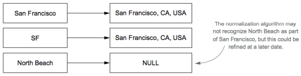
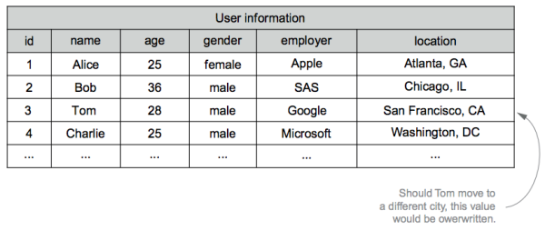
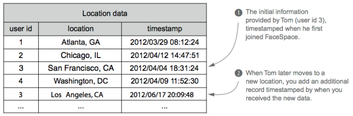
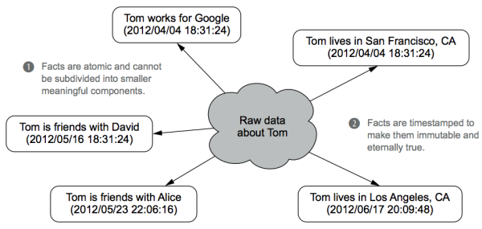
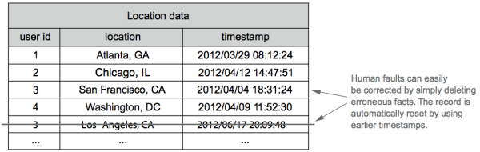
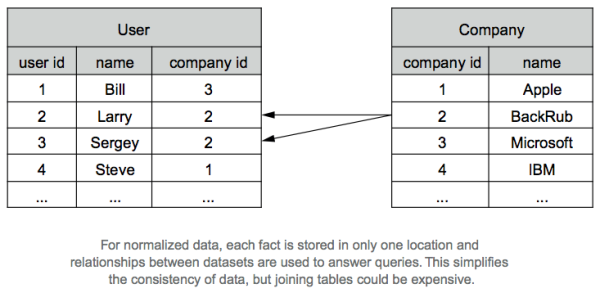
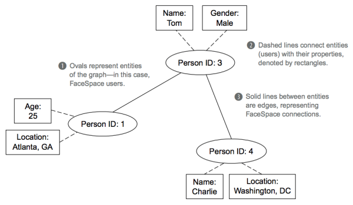

### **Chapter 2. Data model for Big Data**

The last chapter discusses basics of the Lambda Architecture, which provides a practical way to implement an arbitrary function on arbitrary data in real time.

[p28]

The master dataset is at the core of the Lambda Architecture, as shown in the figure below.

[](figure_2.1.png "Figure 2.1 The master dataset in the Lambda Architecture serves as the source of truth for your Big Data system. Errors at the serving and speed layers can be corrected, but corruption of the master dataset is irreparable.")

In the figure, the texts are:

1. The master dataset is the source of truth in your system and cannot withstand corruption.
2. The data in the speed layer realtime views has a high turnover rate, so any errors are quickly expelled.
3. Any errors introduced into the serving layer batch views are overwritten because they are continually rebuilt from the master dataset.

The master dataset in the Lambda Architecture serves as the source of truth for your Big Data system. <u>Errors at the serving and speed layers can be corrected, but corruption of the master dataset is irreparable.</u> If you lose all your serving layer datasets and speed layer datasets, you could reconstruct your application from the master dataset. This is because the batch views served by the serving layer are produced via functions on the master dataset, and since the speed layer is based only on recent data, it can construct itself within a few hours.

The master dataset must be safeguarded from corruption, which may be caused by errors due to:

* Overloaded machines
* Failing disks
* Power outages all could cause errors
* Human error with dynamic data systems, which is an intrinsic risk and inevitable eventuality.

The master dataset must be carefully engineered to prevent corruption in all these cases, as fault tolerance is essential to the health of a long-running data system.

There are two components to the master dataset:

* The data model you use.
* How you physically store the master dataset.

This chapter is about designing a data model for the master dataset and the properties such a data model should have. Physically storing a master dataset is the topic of the next chapter.

### The properties of data

Suppose you’re designing the next big social network: FaceSpace.  When a new user, Tom, joins your site, he starts to invite his friends and family. What information should you store regarding Tom’s connections?  You have a number of choices, including the following:

* The sequence of Tom’s friend and unfriend events
* Tom’s current list of friends
* Tom’s current number of friends

The following figure exhibits these options and their relationships.

[](figure_2.2.png "Figure 2.2 Three possible options for storing friendship information for FaceSpace. Each option can be derived from the one to its left, but it’s a one-way process.")

This example illustrates information dependency. Each layer of information can be derived from the previous one (the one to its left), but it’s a one-way process. [p29]

The notion of dependency shapes the definitions of the terms:

* **Information** is the general collection of knowledge relevant to your Big Data system. It’s synonymous with the colloquial usage of the word *data*.
* **Data** refers to the information that can’t be derived from anything else. Data serves as the axioms from which everything else derives.
* **Queries** are questions you ask of your data.
    * For example, you query your financial transaction history to determine your current bank account balance.
* **Views** are information that has been derived from your base data. They are built to assist with answering specific types of queries.

The following figure illustrates the FaceSpace information dependency in terms of data, views, and queries.

[](figure_2.3.png "Figure 2.3 The relationships between data, views, and queries")

<u>One person’s data can be another’s view.</u> Suppose an advertising firm creates a crawler that scrapes demographic information from user profiles on FaceSpace. FaceSpace has complete access to all the information Tom provided. For example, his complete birthdate is March 13, 1984, but he only makes his birthday (March 13) available on his public profile. His birthday is a view from FaceSpace’s perspective because it’s derived from his birthdate, but it’s data to the advertiser because they have limited information about Tom. This relationship is shown in the figure below:

[](figure_2.4.png "Figure 2.4 Classifying information as data or a view depends on your perspective. To FaceSpace, Tom’s birthday is a view because it’s derived from the user’s birthdate. But the birthday is considered data to a third-party advertiser.")

Having established a shared vocabulary, the key properties of data can be introduced:

* Rawness
* Immutability
* Perpetuity (or the "eternal trueness of data").

These three key concepts is foundational to understanding Big Data systems.

[p31]

#### Data is raw

A data system answers questions about information acquired in the past. You want to be able to answer as many questions as possible. You always want to store the rawest data you can get your hands on. The rawer your data, the more information you can deduce from it, and the more questions you can ask of it. In the previous FaceSpace example, FaceSpace data is more valuable than the advertiser’s.

Stock market trading has millions of shares and billions of dollars changing a daily basis. Historically, stock prices are recorded daily as an opening price, high price, low price, and closing price. However, those bits of data often don’t provide the big picture and can potentially skew your perception of what happened.

In the following figure, for example, it records the price data for Google, Apple, and Amazon stocks on a day when Google announced new products targeted at their competitors.

[](figure_2.5.png "Figure 2.5 A summary of one day of trading for Google, Apple, and Amazon stocks: previous close, opening, high, low, close, and net change.")

This data suggests that:

* Amazon may not have been affected by Google’s announcement, as its stock price moved only slightly.
* The announcement had either no effect on Apple, or a positive effect.

At a finer time granularity, you can get a clearer picture of the events and probe into potential cause and effect relationships. The following figure depicts the minute-by-minute relative changes in the stock prices, which suggests that both Amazon and Apple were indeed affected by the announcement, Amazon more so than Apple.

[](figure_2.6.png "Figure 2.6 Relative stock price changes of Google, Apple, and Amazon on June 27, 2012, compared to closing prices on June 26 (www.google.com/finance). Short-term analysis isn’t supported by daily records but can be performed by storing data at finer time resolutions.")

[p32]

Storing raw data is highly valuable because you cannot know all the questions you want answered in advance. The rawest data enables you maximize your ability to obtain new insights, whereas summarizing, overwriting, or deleting information limits what your data can tell you. The trade-off is that rawer data typically entails more data. However, Big Data technologies are designed to manage petabytes and exabytes of data. Specifically, they manage the storage of your data in a distributed, scalable manner while supporting the ability to directly query the data.

The following texts discuss what information you should store as your raw data.

##### **Unstructured data is rawer than normalized data**

When deciding what raw data to store, a common hazy area is the line between *parsing* and *semantic normalization*. Semantic normalization is the process of reshaping free-form information into a structured form of data.

For example, FaceSpace may request Tom’s location. He may input anything for that field, such as San Francisco, CA, SF, North Beach, etc. A semantic normalization algorithm would try to match the input with a known place, as show in the figure below:

[](figure_2.7.png "Figure 2.7 Semantic normalization of unstructured location responses to city, state, and country. A simple algorithm will normalize “North Beach” to NULL if it doesn’t recognize it as a San Francisco neighborhood.")

It’s better to store the unstructured string, because your semantic normalization algorithm may improve over time. If you store the unstructured string, you can renormalize that data at a later time when you have improved your algorithms. In the preceding example, you may later adapt the algorithm to recognize North Beach as a neighborhood in San Francisco, or you may want to use the neighborhood information for another purpose.

As a rule of thumb:

* If your algorithm for extracting the data is simple and accurate, like extracting an age from an HTML page, you should store the results of that algorithm.
* If the algorithm is subject to change, due to improvements or broadening the requirements, store the unstructured form of the data.

##### **More information doesn’t necessarily mean rawer data**

Assume Tom is a blogger, and he wants to add his posts to his FaceSpace profile. What exactly should you store once Tom provides the URL of his blog?

Storing the pure text of the blog entries is certainly a possibility. But any phrases in italics, boldface, or large font were deliberately emphasized by Tom and could prove useful in text analysis. For example, you could use this additional information for an index to make FaceSpace searchable. We’d thus argue that the annotated text entries are a rawer form of data than ASCII text strings.

At the other end of the spectrum, you could also store the full HTML of Tom’s blog as your data. While it’s considerably more information in terms of total bytes, the color scheme, stylesheets, and JavaScript code of the site can’t be used to derive any additional information about Tom. They serve only as the container for the contents of the site and shouldn’t be part of your raw data.

#### Data is immutable

In relational database, update is one of the fundamental operations. However, for immutability in Big Data, you don’t update or delete data, you only add more.

##### **Advantages of using immutable schema for Big Data systems** *

* **Human-fault tolerance**. This is the most important advantage of the immutable model.
    * [As discussed in Chapter 1](ch1.md#robustness-and-fault-tolerance), human-fault tolerance is an essential property of data systems. You must limit the impact of human mistakes and have mechanisms for recovering from them.
        * With a mutable data model, a mistake can cause data to be lost, because values are actually overridden in the database.
        * With an immutable data model, no data can be lost. If bad data is written, earlier (good) data units still exist. Fixing the data system is just a matter of deleting the bad data units and recomputing the views built from the master dataset.
* **Simplicity**.
    * Mutable data models imply that the data must be indexed in some way so that specific data objects can be retrieved and updated.
    * In contrast, <u>with an immutable data model you only need the ability to append new data units to the master dataset, which does not require an index for your data, which is a huge simplification.</u> As discussed in the next chapter, storing a master dataset is as simple as using flat files.

##### **Comparison between immutable and mutable schema** *

The advantages of keeping your data immutable become evident when comparing with a mutable schema.

The following figure shows a mutable schema for FaceSpace user information. If Tom moves to Los Angeles, previous values are overwritten and lost.

[](figure_2.8.png "Figure 2.8 A mutable schema for FaceSpace user information. When details change—say, Tom moves to Los Angeles—previous values are overwritten and lost.")

With an immutable schema, rather than storing a current snapshot, you create a separate record every time a user’s information evolves. Accomplishing this requires two changes:

1. Track each field of user information in a separate table.
2. Tie each unit of data to a moment in time when the information is known to be true.

The following figure shows a corresponding immutable schema for storing FaceSpace information.

[](figure_2.9.png "Figure 2.10 Instead of updating preexisting records, an immutable schema uses new records to represent changed information. An immutable schema thus can store multiple records for the same user. (Other tables omitted because they remain unchanged.)")

Instead of updating preexisting records, an immutable schema uses new records to represent changed information. An immutable schema thus can store multiple records for the same user.

In the above figure, there are two location records for Tom (user ID #3), and because the data units are tied to particular times, they can both be true. <u>Tom’s current location involves a simple query on the data: look at all the locations, and pick the one with the most recent timestamp.</u> By keeping each field in a separate table, you only record the information that changed. This requires less space for storage and guarantees that each record is new information and is not simply carried over from the last record.

A trade-off of the immutable approach is that it uses more storage than a mutable schema:

1. The user ID is specified for every property, rather than once per row in a mutable approach.
2. The entire history of events is stored rather than the current view of the world.

You should take advantage of Big Data's ability to store large amounts of data using Big Data technologies to get the benefits of immutability. Having a simple and strongly human-fault tolerant master dataset is important.

#### Data is eternally true

The key consequence of immutability is that each piece of data is true forever. Tagging each piece of data with a timestamp is a practical way to make data eternally true.

In general, your master dataset consistently grows by adding new immutable and eternally true pieces of data. There are some special cases in which you delete data, and these cases are not incompatible with data being eternally true. Consider the following cases:

* **Garbage collection**. When you perform garbage collection, you delete all data units that have low value. You can use garbage collection to implement data-retention policies that control the growth of the master dataset. For example, you may decide to implement a policy that keeps only one location per person per year instead of the full history of each time a user changes locations.
* **Regulations**. Government regulations may require you to purge data from your databases under certain conditions.

Deleting the data is not a statement about the truthfulness of the data, but instead the value of the data. Although the data is eternally true, you may prefer to "forget" the information either because you must or because it doesn't provide enough value for the storage cost.

It is important to distinguish that the deleting we are referring to is a special and rare case. In normal usage, data is immutable, and you enforce that property by taking actions such as setting the appropriate permissions. Since deleting data is rare, the utmost care can be taken to ensure that it is done safely. We believe deleting data is most safely accomplished by producing a second copy of the master dataset with the offending data filtered out, running analytic jobs to verify that the correct data was filtered, and then and only then replacing the old version of the master dataset.

### The fact-based model for representing data

Data is the set of information that can’t be derived from anything else, but there are many ways to represent it within the master dataset, such as:

* Traditional relational tables
* Structured XML
* Semistructured JSON documents

There are other possibilities for storing data. However, we recommend the fact-based model for this purpose. In the fact-based model, you deconstruct the data into fundamental units called *facts*.

#### Example facts and their properties

The following figure depicts examples of facts about Tom from the FaceSpace data, as well as two core properties of facts: they are *atomic* and *timestamped*.

[](figure_2.11.png "Figure 2.11 All of the raw data concerning Tom is deconstructed into timestamped, atomic units we call facts.")

* **Atomicity.** Facts are atomic and cannot be subdivided into smaller meaningful components.
    * Collective data, such as Tom’s friend list in the figure, are represented as multiple, independent facts. As a consequence of being atomic, there’s no redundancy of information across distinct facts.
* **Timestamp.** Facts are timestamped to make them immutable and eternally true.

##### **Making Facts Identifiable**

Besides being atomic and timestamped, facts should be associated with a uniquely identifiable piece of data.

Suppose you want to store data about pageviews on FaceSpace. Your first approach
might look something like this (in pseudo-code):

```text
struct PageView:
  DateTime timestamp
  String url
  String ip_address
```

Facts using this structure don’t uniquely identify a particular pageview event. If multiple pageviews come in at the same time for the same URL from the same IP address, each pageview will have the exact same data record and there’s no way to tell whether they refer to distinct events or duplicate entries were accidentally introduced into your dataset.

To distinguish different pageviews, you can add a *nonce* (a 64-bit number randomly generated for each pageview) to your schema :

```text
struct PageView:
  Datetime timestamp
  String url
  String ip_address
  Long nonce
```

The addition of the nonce makes it possible to distinguish pageview events from each other, and if two pageview data units are identical (all fields, including the nonce), they refer to the exact same event.

Making facts identifiable means that you can write the same fact to the master dataset multiple times without changing the semantics of the master dataset. Your queries can filter out the duplicate facts when doing their computations. Having distinguishable facts makes implementing the rest of the Lambda Architecture much easier.

##### **Duplicates aren’t as rare as you might think**

Once FaceSpace becomes a hit, it will require hundreds, then thousands, of web servers. Building the master dataset will require aggregating the data from each of these servers to a central system—no trivial task. There are data collection tools suitable for this situation: Facebook’s [Scribe](https://en.wikipedia.org/wiki/Scribe_(log_server)), [Apache Flume](https://en.wikipedia.org/wiki/Apache_Flume), [syslog-ng](https://en.wikipedia.org/wiki/Syslog-ng), etc., but any solution must be fault tolerant.

A common "fault" these systems must anticipate is a network partition where the destination datastore becomes unavailable. Fault-tolerant systems commonly handle failed operations by retrying until they succeed. Because the sender will not know which data was last received, a standard approach is to resend all data yet to be acknowledged by the recipient. But if part of the original attempt did make it to the metastore, you’d end up with duplicates in your dataset. This approach is simpler and has less performance costs than the transactional approach. By embracing distinguishable facts, it removes the need for transactional appends to the master dataset and make it easier to reason about the correctness of the full system.

#### Benefits of the fact-based model

With a fact-based model, the master dataset will be an ever-growing list of immutable, atomic facts, which has the following advantages:

* Is queryable at any time in its history
* Tolerates human errors
* Handles partial information
* Has the advantages of both normalized and [denormalized](https://en.wikipedia.org/wiki/Denormalization) forms

##### **The dataset is queryable at any time in its history**

You have the ability to query your data for any time covered by your dataset. This is a direct consequence of facts being timestamped and immutable. "Updates" and "deletes" are performed by adding new facts with more recent timestamps. You can reconstruct the state of the world at the time specified by your query.

##### **The data is human-fault tolerant**

Human-fault tolerance is achieved by simply deleting any erroneous facts. As shown in the following figure, human faults can easily be corrected by simply deleting erroneous facts. The record is automatically reset by using earlier timestamps.

[](figure_2.12.png "Figure 2.12 To correct for human errors, simply remove the incorrect facts. This process automatically resets to an earlier state by “uncovering” any relevant previous facts.")

##### **The dataset easily handles partial information**

Storing one fact per record makes it easy to handle partial information about an entity without introducing NULL values into your dataset. Your dataset would only have facts for the known information. <u>Any "absent" fact would be logically equivalent to NULL.</u> Additional information provided at a later time would naturally be introduced via new facts.

##### **The data storage and query processing layers are separate**

There is another key advantage of the fact-based model that is in part due to the structure of the Lambda Architecture itself. By storing the information at both the batch and serving layers, you have the benefit of keeping your data in both normalized and denormalized forms and reaping the benefits of both.

Normalization is an overloaded term. Data normalization is completely unrelated to the [semantic normalization](#unstructured-data-is-rawer-than-normalized-data) term used earlier in this chapter. In this case, [data normalization](https://en.wikipedia.org/wiki/Database_normalization) refers to storing data in a structured manner to minimize redundancy and promote consistency.

##### **Normalization and denormalization** *

Relational tables require you to choose between normalized and denormalized schemas based on what’s most important to you: query efficiency or data consistency. Suppose you wanted to store the employment information. The following figure offers a simple denormalized schema.

[](figure_2.13.png "Figure 2.13 A simple denormalized schema for storing employment information")

In this denormalized schema, the same company name is stored in multiple rows. This would allow you to quickly determine the number of employees for each company, but you would need to update many rows should a company change its name. Having information stored in multiple locations increases the risk of it becoming inconsistent.

In comparison, in the figure below, data in a normalized schema is stored in only one location. If BackRub should change its name to Google, there's a single row in the Company table that needs to be altered. This removes the risk of inconsistency, but you must join the tables to answer queries, which is a potentially expensive computation.

[](figure_2.14.png "Figure 2.14 Two normalized tables for storing the same employment information")

In relational databases, queries are performed directly on the data at the storage level. You must weigh the importance of query efficiency versus data consistency and choose between the normalized and denormalized schema types.

In contrast, the objectives of query processing and data storage are cleanly separated
in the Lambda Architecture. Look at the batch and server layers in the figure below:

[](figure_2.15.png "Figure 2.15 The Lambda Architecture has the benefits of both normalization and denormalization by separating objectives at different layers.")

The Lambda Architecture gives you the conceptual benefits of full normalization with the performance benefits of indexing data in different ways to optimize queries:

* The master dataset is fully normalized.
    * No data is stored redundantly (as in earlier discussion of the fact-based model). Updates are easily handled because adding a new fact with a current timestamp "overrides" any previous related facts.
* The batch views are like denormalized tables, because one piece of data from the master dataset may get indexed into many batch views.
    * The key difference is that the batch views are defined as functions on the master dataset. Accordingly, there is no need to update a batch view because it will be continually rebuilt from the master dataset. This has the additional benefit that the batch views and master dataset will never be out of sync.

With all of these benefits, the fact-based model is an excellent choice for your master dataset.

### Graph schemas

The facts do not convey the structure behind data: there is no types of facts and no relationships between the facts. Graph schemas are graphs that capture the structure of a dataset stored using the fact-based model.

#### Elements of a graph schema

The following figure depicts a graph schema representing the relationships between the FaceSpace facts. It provides a useful visualization of users, their individual information, and the friendships between them.

[](figure_2.16.png "Figure 2.16 Visualizing the relationship between FaceSpace facts")

The three core components of a graph schema:

* **Nodes** are the entities in the system. In this example, the nodes are the FaceSpace users, represented by a user ID
* **Edges** are relationships between nodes.
* **Properties** are information about entities.

Edges are strictly between nodes. Even though properties and nodes are visually connected in the figure, these lines are not edges. They are present only to help illustrate the association between users and their personal information.

#### The need for an enforceable schema

We need to decide what format to store facts. A semistructured text format like JSON would provide simplicity and flexibility, allowing essentially anything to be written to the master dataset, but is too flexible for our needs. For example:

```json
{"id": 3, "field":"age", "value":28, "timestamp": 1333589484}
```
There are no issues with the representation of this single fact, but we cannot ensure that all subsequent facts will follow the same format. As a result of human error, the dataset could also possibly include facts like these:

```json
{"name":"Alice", "field":"age", "value":25,
"timestamp":"2012/03/29 08:12:24"}
{"id":2, "field":"age", "value":36}
```

Both of these examples are valid JSON, but they have inconsistent formats or missing data (e.g. timestamp, which is important, as discussed in the last section). You must provide guarantees about the contents of your dataset.

The solution is to use an enforceable schema that defines the structure of your facts. Enforceable schemas require a bit more work, but they guarantee all required fields are present and ensure all values are of the expected type. When a mistake is made creating a piece of data, an enforceable schema will give errors at that time, rather than when someone is trying to use the data later in a different system. The closer the error appears to the bug, the easier it is to catch and fix.

The next chapter discusses how to implement an enforceable schema using a *serialization framework*, which provides a language-neutral way to define the nodes, edges, and properties of your schema. It then generates code (in different languages) that serializes and deserializes the objects in your schema so they can be stored in and retrieved from your master dataset.

### A complete data model for SuperWebAnalytics.com

This section uses the SuperWebAnalytics.com example. The following figure contains a graph schema suitable for our purpose.

[](figure_2.17.png "Figure 2.17 The graph schema for SuperWebAnalytics.com. There are two node types: people and pages.  People nodes and their properties are slightly shaded to distinguish the two.")

There are two types of nodes: people and pages.

* Nodes: there are two distinct categories of people nodes to distinguish people with a known identity from people you can only identify using a web browser cookie.
* Edges are simple in this schema:
    * A *pageview* edge occurs between a person and a page for each distinct view
    * An *equiv* edge occurs between two person nodes when they represent the same individual. This edge would occur when a person initially identified by only a cookie is fully identified at a later time.
* Properties are self-explanatory.

The fact-based model and graph schemas can evolve as different types of data become available.

* A graph schema provides a consistent interface to arbitrarily diverse data, so it's easy to incorporate new types of information.
* Schema additions are done by defining new node, edge, and property types. Due to the atomicity of facts, these additions do not affect previously existing fact types.

### Summary

The fact-based model provides a simple yet expressive representation of your data by naturally keeping a full history of each entity over time. Its append-only nature makes it easy to implement in a distributed system, and it can easily evolve as your data and your needs change.

### Doubts and Solutions

#### Verbatim

##### **p37 on deleting immutable data**

> We believe deleting data is most safely accomplished by producing a second copy of the master dataset with the offending data filtered out, running analytic jobs to verify that the correct data was filtered, and then and only then replacing the old version of the master dataset.

<span class="text-danger">Question</span>: "Producing a second copy of the master dataset"? It this real? What's the cost of storage and time to do this?
