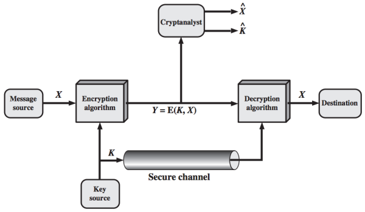

#### **Part 1: Symmetric Ciphers**

### **Chapter 2. Classical Encryption Techniques**

#### Definitions of Terms *

* **Plaintext**: original message
* **Ciphertext**: coded message
* **Enciphering** or **encryption**: the process of converting from plaintext to ciphertext
* **Deciphering** or **decryption:** the process of restoring the plaintext from the ciphertext

The many schemes used for encryption constitute the area of study known as [**cryptography**](https://en.wikipedia.org/wiki/Cryptography). Such a scheme is known as a [**cryptographic system**](https://en.wikipedia.org/wiki/Cryptosystem) (cryptosystem) or a [**cipher**](https://en.wikipedia.org/wiki/Cipher). Techniques used for deciphering a message without any knowledge of the enciphering details fall into the area of [**cryptanalysis**](https://en.wikipedia.org/wiki/Cryptanalysis). Cryptanalysis is what the layperson calls "breaking the code". The areas of cryptography and cryptanalysis together are called **cryptology**.

### Symmetric Cipher Model

A symmetric encryption scheme has five ingredients (as shown in the following figure):

* **Plaintext**: This is the original <u>intelligible</u> message or data that is fed into the algorithm as input.
* **Encryption algorithm**: The encryption algorithm performs various substitutions and transformations on the plaintext.
* **Secret key**: The secret key is also input to the encryption algorithm. The key is a value independent of the plaintext and of the algorithm. The algorithm will produce a different output depending on the specific key being used at the time. <u>The exact substitutions and transformations performed by the algorithm depend on the key.</u>
* **Ciphertext**: This is the scrambled (unintelligible) message produced as output.
    * It depends on the plaintext and the secret key. For a given message, two different keys will produce two different ciphertexts.
* **Decryption algorithm**: This is essentially the encryption algorithm run in reverse. It takes the ciphertext and the secret key and produces the original plaintext.

#### Encryption Requirements *

There are two requirements for secure use of conventional encryption:

1. The encryption algorithm must be strong.
    * At a minimum, an opponent who knows the algorithm and has access to one or more ciphertexts would be unable to decipher the ciphertext or figure out the key.
    * In a stronger form, the opponent should be unable to decrypt ciphertexts or discover the key <u>even if he or she has a number of ciphertexts together with the plaintext for each ciphertext.</u>
2. Sender and receiver must have obtained copies of the secret key in a secure fashion and must keep the key secure. If someone can discover the key and knows the algorithm, all communication using this key is readable.

#### Why not keep the encryption algorithm secret? *

We assume that it is impractical to decrypt a message on the basis of the ciphertext plus knowledge of the encryption/decryption algorithm. This means we do not need to keep the algorithm secret; we need to keep only the key secret. This feature of symmetric encryption makes low-cost chip implementations of data encryption algorithms widely available and incorporated into a number of products. With the use of symmetric encryption, the principal security problem is maintaining the secrecy of the key.

#### Model of Symmetric Cryptosystem *

The essential elements of a symmetric encryption scheme is described in the following figure:

* A source produces a message in plaintext, \(X = [X_1, X_2, ..., X_M]\).
* A key of the form \(K = [K_1, K_2, ..., K_J]\) is generated.
    * If the key is generated at the message source, then it must also be provided to the destination by means of some secure channel.
    * Alternatively, a third party could generate the key and securely deliver it to both source and destination.
* The ciphertext \(Y = [Y_1, Y_2, ..., Y_N]\) is produced by the encryption algorithm with the message *X* and the encryption key *K* as input.

The encryption process is:

$$ Y = E(K, X) $$

This notation indicates that *Y* is produced by using encryption algorithm E as a function of the plaintext *X*, with the specific function determined by the value of the key *K*.

The intended receiver with the key is able to invert the transformation:

$$ X = D(K, Y) $$

An opponent, observing *Y* but not having access to *K* or *X*, may attempt to recover *X* or *K* or both. It is assumed that the opponent knows the encryption (E) and decryption (D) algorithms. The opponent may do one of the following:

* Recover *X* by generating a plaintext estimate \(\hat{X}\), if the opponent is interested in only this particular message.
* Recover *K* by generating an estimate \(\hat{K}\), if the opponent is interested in being able to read future messages.

#### Cryptography

Cryptographic systems are characterized along three independent dimensions:

1. **Type of operations for transforming plaintext to ciphertext**. All encryption algorithms are based on two general principles:
    * **Substitution**: each element in the plaintext (bit, letter, group of bits or letters) is mapped into another element,
    * **Transposition**: elements in the plaintext are rearranged.

    The fundamental requirement is that no information be lost (all operations are reversible). *Product systems* involve multiple stages of substitutions and transpositions.

2. **Number of keys used**.
    * If both sender and receiver use the same key, the system is referred to as symmetric, single-key, secret-key, or conventional encryption.
    * If the sender and receiver use different keys, the system is referred to as asymmetric, two-key, or public-key encryption.
3. **How the plaintext is processed**.
    * A [block cipher](https://en.wikipedia.org/wiki/Block_cipher) processes the input one block of elements at a time, producing an output block for each input block.
    * A [stream cipher](https://en.wikipedia.org/wiki/Stream_cipher) processes the input elements continuously, producing output one element at a time, as it goes along.

#### Cryptanalysis and Brute-Force Attack

The objective of attacking an encryption system is to recover the key in use rather than simply to recover the plaintext of a single ciphertext. There are two general approaches to attacking a conventional encryption scheme:

* **Cryptanalysis** (cryptanalytic attacks): This attack relies on the nature of the algorithm plus some knowledge of the general characteristics of the plaintext or some sample plaintext–ciphertext pairs. It exploits the characteristics of the algorithm to attempt to deduce a specific plaintext or to deduce the key being used.
* **Brute-force attack**: The attacker tries every possible key on a piece of ciphertext until an intelligible translation into plaintext is obtained. On average, half of all possible keys must be tried to achieve success.

If either type of attack succeeds in deducing the key, then future and past messages encrypted with that key are compromised.

##### **Cryptanalytic attacks** *

The following table summarizes the various types of cryptanalytic attacks based on the amount of information known to the cryptanalyst.

Type of Attack | Known to Cryptanalyst
-------------- | ---------------------
Ciphertext Only | <ul><li>Encryption algorithm</li><li>Ciphertext</li></ul>
Known Plaintext | <ul><li>Encryption algorithm</li><li>Ciphertext</li><li>One or more plaintext–ciphertext pairs formed with the secret key</li></ul>
Chosen Plaintext | <ul><li>Encryption algorithm</li><li>Ciphertext</li><li>Plaintext message chosen by cryptanalyst, together with its corresponding ciphertext generated with the secret key</li></ul>
Chosen Ciphertext | <ul><li>Encryption algorithm</li><li>Ciphertext</li><li>Ciphertext chosen by cryptanalyst, together with its corresponding decrypted plaintext generated with the secret key</li></ul>
Chosen Text | Combination of "Chosen Plaintext" and "Chosen Ciphertext"

[p32]

In general, we can assume that the opponent does know the algorithm used for encryption. If the key space is very large, the brute-force approach of trying all possible keys, which is one possible attack, becomes impractical. Thus, the opponent must anaylyze the ciphertext itself, applying various statistical tests to it. To use this approach, the opponent must have some general idea of the type of plaintext that is concealed.

In many cases, the analyst has more information than ciphertext only. The analyst may be able to capture one or more plaintext messages as well as their encryptions, or may know that certain plaintext patterns will appear in a message. For example, a file that is encoded in the Postscript format always begins with the same pattern, or there may be a standardized header or banner to an electronic funds transfer message. All these are examples of *known plaintext*. With this knowledge, the analyst may be able to deduce the key on the basis of the way in which the known plaintext is transformed. This is known as the [known-plaintext attack](https://en.wikipedia.org/wiki/Known-plaintext_attack).

