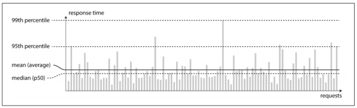

### **Chapter 1. Reliable, Scalable and Maintainable Applications**

Many applications today are **data-intensive**, as opposed to **compute-intensive**. Raw CPU power is rarely a limiting factor for these applications. Bigger problems are usually the amount of data, the complexity of data, and the speed at which it is changing.

A data-intensive application is typically built from standard building blocks which provide common functionality, such as:

* Store data so that they can be found later (*databases*)
* Remember the result of an expensive operation, to speed up reads (*caches*)
* Allow users to search data by keyword or filter it in various ways (*search indexes*)
* Send a message to another process, to be handled asynchronously (*stream processing*)
* Periodically crunch a large amount of accumulated data (*batch processing*)

When building an application, most engineers wouldn't write a new data storage engine from scratch, because databases are a perfectly good tool for the job. However, there are many database systems with different characteristics, because different applications have different requirements. When building an application, we still need to figure out which tools and which approaches are the most appropriate for the task at hand. Sometimes it can be hard to combine several tools when you need to do something that a single tool cannot do alone.

This chapter starts by exploring the fundamentals of what we are trying to achieve: reliable, scalable and maintainable data systems and then clarify what those things mean, outline some ways of thinking about them, and go over the basics need for later chapters.

### Thinking About Data Systems

Typically, databases, queues, caches, etc. are very different categories of tools. Although a database and a message queue have some superficial similarity (both store data for some time), they have very different access patterns, which means different performance characteristics, and thus very different implementations.

Why do we label them under an umbrella term like *data systems*?

First, many new tools for data storage and processing have emerged in recent years, which are optimized for a variety of different use cases, and they no longer fit into traditional categories. For example, there are data stores that are also used as message queues (Redis), and there are message queues with database-like durability guarantees (Kafka). The boundaries between the categories are becoming blurred.

Second, increasingly many applications now have such demanding or wide-ranging requirements that a single tool can no longer meet all of its data processing and storage needs. Instead, the work is broken down into tasks that can be performed efficiently on a single tool, and those different tools are stitched together using application code.

For example, if you have an application-managed caching layer (using memcached or similar), or a full-text search server separate from your main database (such as Elasticsearch or Solr), it is normally the application code's responsibility to keep those caches and indexes in sync with the main database. The following figure is one possible architecture (which will be detailed in later chapters):

[](figure_1-1.png "Figure 1-1. One possible architecture for a data system that combines several components.")

When you combine several tools in order to provide a service, the service's interface or API usually hides those implementation details from clients. You have essentially created a new, special-purpose data system from smaller, general-purpose components. Your composite data system may provide certain guarantees, e.g. that the cache will be correctly invalidated or updated on writes, so that outside clients see consistent results.

If you are designing a data system or service, a lot of tricky questions arise:

* How do you ensure that the data remains correct and complete, even when things go wrong internally?
* How do you provide consistently good performance to clients, even when parts of your system are degraded?
* How do you scale to handle an increase in load?
* What does a good API for the service look like?

There are many factors that may influence the design of a data system, including:

* Skills and experience of the people involved
* Legacy system dependencies
* Time‐scale for delivery
* Organization's tolerance of different kinds of risk
* Regulatory constraints

This book focuses on three concerns that are important in most software systems:

* **Reliability**. The system should continue to work correctly (performing the correct function at the desired performance) even in the face of adversity (hardware or software faults, and even human error). See [Reliability](#reliability).
* **Scalability**. As the system grows (in data volume, traffic volume or complexity), there should be reasonable ways of dealing with that growth. See [Scalability](#scalability).
* **Maintainability**. Over time, many different people will work on the system (engineering and operations, both maintaining current behavior and adapting the system to new use cases), and they should all be able to work on it productively. See [Maintainability](#maintainability).

### Reliability

Typical expectations for software include:

* The application performs the function that the user expected.
* It can tolerate the user making mistakes, or using the software in unexpected ways.
* Its performance is good enough for the required use case, under expected load and data volume.
* The system prevents any unauthorized access and abuse.

If all those things together mean "working correctly", then *reliability* roughly means "continuing to work correctly, even when things go wrong".

The things that can go wrong are called *faults*, and systems that anticipate faults and can cope with them are called [*fault-tolerant*](https://en.wikipedia.org/wiki/Fault_tolerance) or *resilient*. The term is slightly misleading: it suggests that we could make a system tolerant of every possible kind of fault, which in reality is not feasible. It only makes sense to talk about tolerating certain *types of fault*.

Note that a *fault* is not the same as a *failure*.

* A fault is usually defined as one component of the system deviating from its spec.
* A failure is when the system as a whole stops providing the required service to the user.

It is impossible to reduce the probability of a fault to zero; therefore it is usually best to design fault tolerance mechanisms that prevent faults from causing failures. This book covers several techniques for building reliable systems from unreliable parts.

Counter-intuitively, in such fault-tolerant systems, it can make sense to increase the rate of faults by triggering them deliberately (for example, by randomly killing individual processes without warning). Many critical bugs are actually due to poor error handling; by deliberately inducing faults, you ensure that the fault-tolerance machinery is continually exercised and tested, which can increase your confidence that faults will be handled correctly when they occur naturally. The Netflix [chaos monkey](https://github.com/Netflix/chaosmonkey) is an example of this approach.

Although we generally prefer tolerating faults over preventing faults, there are cases where prevention is better than cure (e.g. because no cure exists). This is the case with security matters, for example: if an attacker has compromised a system and gained access to sensitive data, that event cannot be undone. However, this book mostly deals with the kinds of fault that can be cured, as described in the following sections.

#### Hardware faults

Hardware faults are a common cause of system failure. For example:

* Hard disks crash
* RAM becomes faulty
* The power grid has a blackout
* Someone unplugs the wrong network cable

These things happen *all the time* when you have a lot of machines.

Hard disks are reported as having a [mean time to failure](https://en.wikipedia.org/wiki/Mean_time_between_failures) (MTTF) of about 10 to 50 years. Thus, on a storage cluster with 10,000 disks, we should expect on average one disk to die per day.

Adding redundancy to the individual hardware components can reduce the failure rate of the system. For example:

* Disks may be set up in a RAID configuration.
* Servers may have dual power supplies and hot-swappable CPUs.
* Data centers may have batteries and diesel generators for backup power.

When one component dies, the redundant component can take its place while the broken component is replaced. This approach cannot completely prevent hardware problems from causing failures, but it is well understood, and can often keep a machine running uninterrupted for years.

Redundancy of hardware components was sufficient for most applications, since it makes total failure of a single machine fairly rare. As long as you can restore a backup onto a new machine fairly quickly, the downtime in case of failure is not catastrophic in most applications. Thus, multi-machine redundancy was only required by a small number of applications for which high availability was absolutely essential.

However, as data volumes and computing demands increase, more applications are using larger numbers of machines, which proportionally increases the rate of hardware faults. Moreover, in some "cloud" platforms such as Amazon Web Services it is fairly common for virtual machine instances to become unavailable without warning, as the platform is designed to prioritize flexibility and [elasticity](https://en.wikipedia.org/wiki/Elasticity_(cloud_computing)) over single-machine reliability.

Hence there is a move towards systems that can tolerate the loss of entire machines, by using [software fault-tolerance](https://en.wikipedia.org/wiki/Software_fault_tolerance) techniques in preference to hardware redundancy. Such systems also have operational advantages: a single-server system requires planned downtime if you need to reboot the machine (to apply operating system security patches, for example), whereas a system that can tolerate machine failure can be patched one node at a time, without downtime of the entire system.

#### Software errors

Hardware faults are usually considered as being random and independent from each other: one machine's disk failing does not imply that another machine's disk is going to fail. There may be weak correlations (for example due to a common cause, such as the temperature in the server rack), but otherwise it is unlikely that a large number of hardware components will fail at the same time.

Another class of fault is a systematic error within the system, which are harder to anticipate. Because they are correlated across nodes, they tend to cause many more system failures than uncorrelated hardware faults. Examples include:

* A software bug that causes every instance of an application server to crash when given a particular bad input. For example, consider the [leap second](https://en.wikipedia.org/wiki/Leap_second) on [June 30, 2012](https://en.wikipedia.org/wiki/Leap_second#Examples_of_problems_associated_with_the_leap_second) that caused many applications to hang simultaneously, due to a bug in the Linux kernel.
* A runaway process uses up some shared resource: CPU time, memory, disk space or network bandwidth.
* A service that the system depends on slows down, becomes unresponsive or starts returning corrupted responses.
* [Cascading failures](https://en.wikipedia.org/wiki/Cascading_failure), where a small fault in one component triggers a fault in another component, which in turn triggers further faults.

The bugs that cause these kinds of software fault often lie dormant for a long time until they are triggered by an unusual set of circumstances. In those circumstances, it is revealed that the software is making some kind of assumption about its environment, and while that assumption is usually true, it eventually stops being true for some reason.

There is no quick solution to systematic faults in software, but many small things can help:

* Carefully thinking about assumptions and interactions in the system
* Thorough testing
* Process isolation
* Allowing processes to crash and restart
* Measuring, monitoring and analyzing system behavior in production

If a system is expected to provide some guarantee (for example, in a message queue the number of incoming messages equals the number of outgoing messages), it can constantly check itself while it is running, and raise an alert if a discrepancy is found.

#### Human errors

Humans design and build software systems, and the operators who keep the system running are also human. Even when they have the best intentions, humans are known to be unreliable. A study of large Internet services found that configuration errors by operators were the leading cause of outages, whereas hardware faults (servers or network) cause only 10–25% of outages.

The best systems combine several approaches in spite of unreliable humans:

* Design systems that minimizes opportunities for error. For example, well-designed abstractions, APIs and admin interfaces make it easy to do "the right thing", and discourage "the wrong thing". However, if the interfaces are too restrictive, people will work around them, negating their benefit, so this is a tricky balance to get right.
* Decouple the places where people make the most mistakes from the places where they can cause failures. In particular, provide fully-featured non-production sandbox environments where people can explore and experiment safely, using real data, without affecting real users.
* Test thoroughly at all levels, from unit tests to whole-system integration tests and manual tests. Automated testing is widely used and valuable for covering corner cases that rarely arise in normal operation.
* Allow quick and easy recovery from human errors, to minimize the impact in the case of a failure. For example:
    * Make it fast to roll back configuration changes.
    * Roll out new code gradually (so that any unexpected bugs affect only a small subset of users).
    * Provide tools to recompute data (in case it turns out that the old computation was incorrect).
* Set up detailed and clear monitoring, such as performance metrics and error rates. In other engineering disciplines this is referred to as [*telemetry*](https://en.wikipedia.org/wiki/Telemetry) (for example, once a rocket has left the ground, telemetry is essential for tracking what is happening and for understanding failures). Monitoring can show us early warning signals, and allow us to check whether any assumptions or constraints are being violated. When a problem occurs, metrics can be invaluable in diagnosing the issue.
* Good management practices and training.

#### How important is reliability?

Bugs in business applications cause lost productivity (and legal risks if figures are reported incor‐ rectly), and outages of e-commerce sites can have huge costs in terms of lost revenue and reputation. Even in "non-critical" applications we have a responsibility to our users.

There are situations in which we may choose to sacrifice reliability in order to reduce development cost (e.g. when developing a prototype product for an unproven market) or operational cost (e.g. for a service with a very narrow profit margin), but we should be very conscious of when we are cutting corners.

### Scalability

That a system is working reliably today doesn't mean it will necessarily work
reliably in future. One common reason for degradation is increased load:

* Perhaps it has grown from 10,000 concurrent users to 100,000 concurrent users.
* Perhaps it is processing much larger volumes of data than it did before.

Scalability is the term to describe a system's ability to cope with increased load. It is not a one-dimensional label that we can attach to a system: it is meaningless to say "X is scalable" or "Y doesn't scale". Rather, discussing scalability means to discuss the question: if the system grows in a particular way, what are our options for coping with the growth? How can we add computing resources to handle the additional load?

#### Describing load

Load can be described with a few numbers which we call *load parameters*. The best choice of parameters depends on the architecture of your system. For example, it can be:

* Requests per second to a webserver
* Ratio of reads to writes in a database
* The number of simultaneously active users in a chat room
* The hit rate on a cache

Perhaps the average case is what matters for you, or perhaps your bottleneck is dominated by a small number of extreme cases.

Consider Twitter as an example, using data published in November 2012. Two of Twitter's main operations are:

* *Post tweet*. A user can publish a new message to their followers (4.6 k requests/sec on average, over 12 k requests/sec at peak).
* *Home timeline*. A user can view tweets recently published by the people they follow (300 k requests/sec).

Simply handling 12,000 writes per second (the peak rate for posting tweets) would be fairly easy. However, Twitter's scaling challenge is not primarily due to tweet volume, but due to [fan-out](https://en.wikipedia.org/wiki/Fan-out_(software)) (In transaction processing systems, we use it to describe the number of requests to other services that we need to make in order to serve one incoming request): each user follows many people, and each user is followed by many people.

There are broadly two approaches to implementing these two operations:

Approach 1: posting a tweet inserts the new tweet into a global collection of tweets. When a user requests home timeline:

1. Look up all the people they follow.
2. Find all recent tweets for each of those users
3. Merge them (sorted by time).

In a relational database like the one in the following figure:

[](figure_1-2.png "Figure 1-2. Simple relational schema for implementing a Twitter home timeline.")

The SQL query of it would be like:

```sql
SELECT tweets.*, users.* FROM tweets
 JOIN users ON tweets.sender_id = users.id
 JOIN follows ON follows.followee_id = users.id
 WHERE follows.follower_id = current_user
```

Approach 2: maintain a cache for each user's home timeline (see figure below). When a user posts a tweet, look up all the people who follow that user, and insert the new tweet into each of their home timeline caches. The request to read the home timeline is cheap, because its result has been computed ahead of time.

[](figure_1-3.png "Figure 1-3. Twitter's data pipeline for delivering tweets to followers, with load parameters as of November 2012")

The first version of Twitter used approach 1, but the systems struggled to keep up with the load of home timeline queries, so the company switched to approach 2. This works better because the average rate of published tweets is almost two orders of magnitude lower than the rate of home timeline reads, so it's preferable to do more work at write time and less at read time.

However, the downside of approach 2 is that posting a tweet now requires a lot of extra work. A tweet is delivered to about 75 followers on average, so 4.6 k tweets per second become 345 k writes per second to the home timeline caches. However, the number of followers per user varies wildly, and some users have over 30 million followers. This means that a single tweet may result in over 30 million writes to home timelines. It is a significant challenge to deliver tweets to followers in a timely manner.

In Twitter, the distribution of followers per user (maybe weighted by how often those users tweet) is a key load parameter for discussing scalability, since it determines the fan-out load. Now that approach 2 is robustly implemented, Twitter is moving to a hybrid of both approaches. Most users' tweets continue to be fanned out to home timelines at the time when they are posted, but a small number of users with a very large number of followers are excepted from this fan-out. Instead, when the home timeline is read, the tweets from celebrities followed by the user are fetched separately and merged with the home timeline when the timeline is read, like in approach 1. This hybrid approach is able to deliver consistently good performance.

#### Describing performance

Once you have described the load on our system, you can investigate what happens when the load increases in two ways:

* When you increase a load parameter, and keep the system resources (CPU, memory, network bandwidth, etc.) unchanged, how is performance of your system affected?
* When you increase a load parameter, how much do you need to increase the resources if you want to keep performance unchanged?

Both questions require performance numbers.

In a batch-processing system such as Hadoop, we usually care about [*throughput*](https://en.wikipedia.org/wiki/Throughput): the number of records we can process per second, or the total time it takes to run a job on a dataset of a certain size.

* In an ideal world, the running time of a batch job is the size of the dataset divided by throughput.
* In practice, the running time is often longer, due to skew (data not being spread evenly across worker processes) or waiting for the slowest task to complete.

In online systems, the [*response time*](https://en.wikipedia.org/wiki/Response_time_(technology)) of a service is usually more important. It is time between a client sending a request and receiving a response.

##### **Latency vs. Response Time** *

[Latency](https://en.wikipedia.org/wiki/Latency_(engineering)) and response time are often used synonymously, but they are not the same.

* The response time is what the client sees: besides the actual time to process the request (the service time), it includes network delays and queueing delays.
* Latency is the duration that a request is waiting to be handled, during which it is latent, awaiting service.

Even if you only make the same request over and over again, you will get a slightly different response time on every try. In practice, in a system handling a variety of requests, the response time can vary a lot. Therefore, we need to think of response time not as a single number, but as a distribution of values that you can measure.

In the following figure, each gray bar represents a request to a service, and its height shows how long that request took.

[](figure_1-4.png "Figure 1-4. Illustrating mean and percentiles: response times for a sample of 100 requests to a service")

Most requests are reasonably fast, but there are occasional [*outliers*](https://en.wikipedia.org/wiki/Outlier) that take much longer. The slow requests may be intrinsically more expensive, e.g. because they process more data. But even in a scenario where all requests should take the same time, you get variation, where random additional latency could be introduced by:

* A context switch to a background process
* The loss of a network packet and TCP retransmission
* A garbage collection pause
* A page fault forcing a read from disk
* Mechanical vibrations in the server rack
* Many other things

##### **Percentiles: p50, p95, p99 and p99.9** *

It's common to use the *average* response. Strictly speaking, the term *average* doesn't refer to any particular formula, but in practice it is usually understood as the [arithmetic mean](https://en.wikipedia.org/wiki/Arithmetic_mean): sum the *n* values and divide by *n*.) However, the mean is not a very good metric to know the "typical" response time, because it doesn't tell how many users actually experienced that delay.

Usually it is better to use [*percentiles*](https://en.wikipedia.org/wiki/Percentile). If you take your list of response times and sort it, from fastest to slowest, then the median is the half-way point: for example, if your median response time is 200 ms, that means half your requests return in less than 200 ms, and half your requests take longer than that.

<u>This makes the median a good metric if you want to know how long users typically have to wait</u>: half of user requests are served in less than the median response time, and the other half take longer than the median. The median is also known as **50th percentile**, and sometimes abbreviated as **p50**. Note that the median is the half-way point for a single request; if the user makes several requests (over the course of a session, or because several resources are included in a single page), the probability that at least one of them is slower than the median is much greater than 50%.

In order to figure out how bad your outliers are, you can look at higher percentiles: the **95th**, **99th** and **99.9th percentile** are common (abbreviated **p95**, **p99** and **p99.9**). They are the response time thresholds at which 95%, 99% or 99.9% of requests are faster than that particular threshold. For example, if the 95th percentile response time is 1.5 seconds, that means 95 out of 100 requests take less than 1.5 seconds, and 5 out of 100 requests take 1.5 seconds or more.

<u>High percentiles are important because they directly affect user experience of the service.</u> For example, Amazon describes response time requirements for internal services in terms of the 99.9th percentile, even though it only affects 1 in 1,000 requests. This is because the customers with the slowest requests are often those who have made many purchases, i.e. the most valuable customers. It's important to keep those customers happy by ensuring the website is fast for them: Amazon has also observed that a 100 ms increase in response time reduces sales by 1% and others report that a 1-second slowdown reduces a customer satisfaction metric by 16%.

On the other hand, optimizing the 99.99th percentile (the slowest 1 in 10,000 requests) was deemed too expensive and not yield enough benefit for Amazon's purposes. Reducing response times at very high percentiles is difficult because they are easily affected by random events outside of your control, and the benefits are diminishing.

##### **SLOs and SLAs** *

Percentiles are often used in [**service level objectives**](https://en.wikipedia.org/wiki/Service_level_objective) (SLOs) and [**service level agreements**](https://en.wikipedia.org/wiki/Service-level_agreement) (SLAs), contracts that define the expected performance and availability of a service. For example, an SLA may state that the service is considered to be up if it has a median response time of less than 200 ms and a 99th percentile under 1 s (if the response time is longer, it might as well be down), and the service may be required to be up at least 99.9% of the time. This sets expectations for clients of the service, and allows customers to demand a refund if the SLA is not met.

Queueing delays are often a large part of the response time at high percentiles. As a server can only process a small number of things in parallel (for example, limited by its number of CPU cores), it only takes a small number of slow requests to hold up the processing of subsequent requests. This effect is sometimes known as [**head-of-line blocking**](https://en.wikipedia.org/wiki/Head-of-line_blocking). Even if those subsequent requests are fast to process on the server, the client will see a slow overall response time due to the time waiting for the prior request to complete. Due to this effect, it is important to measure response times on the client side.

When generating load artificially in order to test the scalability of a system, <u>the load-generating client needs to keep sending requests independently of the response time.</u> If the client waits for the previous request to complete before sending the next one, that behavior has the effect of artificially keeping the queues shorter in the test than they would be in reality, which skews the measurements

##### **Percentiles in Practice** *

High percentiles become especially important in backend services that are called multiple times as part of serving a single end-user request. Even if you make the calls in parallel, the end-user request still needs to wait for the slowest of the parallel calls to complete. It takes just one slow call to make the entire end-user request slow. See the figure below:

[](figure_1-5.png "Figure 1-5. When several backend calls are needed to serve a request, it takes just a single slow backend request to slow down the entire end-user request.")

Even if only a small percentage of backend calls are slow, the chance of getting a slow call increases if an end-user request requires multiple backend calls, and so a higher proportion of end-user requests end up being slow.

If you want to add response time percentiles to the monitoring dashboards for your services, you need to efficiently calculate them on an ongoing basis. For example, you may want to keep a rolling window of response times of requests in the last ten minutes. Every minute, you calculate the median and various percentiles over the values in that window, and plot those metrics on a graph.

The naive implementation is to keep a list of response times for all requests within the time window, and to sort that list every minute. If that is too inefficient for you, there are algorithms which can calculate a good approximation of percentiles at minimal CPU and memory cost, such as forward decay, [t-digest](https://github.com/tdunning/t-digest) or [HdrHistogram](http://hdrhistogram.github.io/HdrHistogram/). Beware that averaging percentiles, e.g. to reduce the time resolution or to combine data from several machines, is mathematically meaningless. The right way of aggregating response time data is to add the histograms

#### Approaches for coping with load

An architecture that is appropriate for one level of load is unlikely to cope with ten times that load. For a fast-growing service, it is likely that you will need to re-think your architecture on every order of magnitude load increase or even more often than that.

The dichotomy between the following two is often discussed:

* **Scaling up**: vertical scaling, moving to a more powerful machine
* **Scaling out**: horizontal scaling, distributing the load across multiple smaller machines

Distributing load across multiple machines is also known as a [shared nothing architecture](https://en.wikipedia.org/wiki/Shared_nothing_architecture). A system that can run on a single machine is often simpler, but high-end machines can become very expensive, so very intensive workloads often can't avoid scaling out. In reality, good architectures usually involve a pragmatic mixture of approaches: for example, several fairly powerful machines can still be simpler and cheaper than a large number of small virtual machines.

Some systems are [*elastic*](https://en.wikipedia.org/wiki/Elasticity_(cloud_computing)), meaning that they can automatically add computing resources when they detect a load increase, whereas other systems are scaled manually (a human analyzes the capacity and decides to add more machines to the system). An elastic system can be useful if load is highly unpredictable, but manually scaled systems are simpler and may have fewer operational surprises.

While distributing stateless services across multiple machines is fairly straightforward, taking stateful data systems from a single node to a distributed setup can introduce a lot of additional complexity. For this reason, common wisdom until recently was to keep your database on a single node (scale up) until scaling cost or high-availability requirements forced you to make it distributed.

As the tools and abstractions for distributed systems get better, this common wisdom may change, at least for some kinds of application. <u>It is conceivable that distributed data systems will become the default in future, even for use cases that don't handle large volumes of data or traffic.</u> This book covers distributed data systems in terms of scalability, but also ease of use and maintainability.

The architecture of systems that operate at large scale is usually highly specific to the application. There is no such thing as a generic, one-size-fits-all scalable architecture. The problem may be:

* The volume of reads
* The volume of writes
* The volume of data to store
* The complexity of the data
* The response time requirements
* The access patterns
* Some mixture of all of these plus many more issues.

For example, a system that is designed to handle 100,000 requests per second, each 1 kB in size, looks very different from a system that is designed for three requests per minute, each 2 GB in size, even though the two systems have the same data throughput.

An architecture that scales well for a particular application is built around assumptions of which operations will be common and which will be rare (the [load parameters](#describing-load)). If those assumptions turn out to be wrong, the engineering effort for scaling is at best wasted, and at worst counter-productive. <u>In an early-stage startup or an unproven product it's usually more important to be able to iterate quickly on product features than to scale to some hypothetical future load.</u>

Even though they are specific to a particular application, scalable architectures are nevertheless usually built from general-purpose building blocks, arranged in familiar patterns.

### Maintainability

The majority of the cost of software is not in its initial development, but in its ongoing maintenance:

* Fixing bugs
* Keeping systems operational
* Investigating failures
* Adapting it to new platforms
* Modifying it for new use cases
* Repaying technical debt
* Adding new features

Unfortunately, many people working on software systems dislike maintenance of so-called [legacy systems](https://en.wikipedia.org/wiki/Legacy_system), which perhaps involves fixing other people's mistakes, or working with platforms that are now outdated, or systems that were forced to do things they were never intended for. Every legacy system is unpleasant in its own way, and so it is difficult to give general recommendations for dealing with them.

However, we can and should design software that will hopefully minimize pain during maintenance, and thus avoid creating legacy software ourselves. To this end, we will pay particular attention to three design principles for software systems:

* **Operability**. Make it easy for operations teams to keep the system running smoothly.
* **Simplicity**. Make it easy for new engineers to understand the system, by removing as much complexity as possible from the system. (Note this is not the same as simplicity of the user interface.)
* **Evolvability**. Make it easy for engineers in future to make changes to the system, adapting it for unanticipated use cases as requirements change. Also known as *extensibility*, *modifiability* or *plasticity*.

#### Operability: making life easy for operations

It has been suggested that:

> Good operations can often work around the limitations of bad (or incomplete) software, but good software cannot run reliably with bad operations.

While some aspects of operations can and should be automated, it is still up to humans to set up that automation in the first place, and to make sure it's working correctly.

Operations teams are vital to keeping a software system running smoothly. A good operations team typically does the following:

* Monitoring the health of the system, and quickly restoring service if it goes into a bad state;
* Tracking down the cause of problems, such as system failures or degraded performance;
* Keeping software and platforms up-to-date, including security patches;
* Keeping tabs on how different systems affect each other, so that a problematic change can be avoided before it causes damage;
* Anticipating future problems and solving them before they occur, e.g. [capacity planning](https://en.wikipedia.org/wiki/Capacity_planning);
* Establishing good practices and tools for [deployment](https://en.wikipedia.org/wiki/Software_deployment), [configuration management](https://en.wikipedia.org/wiki/Software_configuration_management) and more;
* Performing complex maintenance tasks, such as moving an application from one platform to another;
* Maintaining security of the system as configuration changes are made;
* Defining processes that make operations predictable and help keep the production environment stable;
* Preserving the organization's knowledge about the system, even as individual people come and go;

Good operability means making routine tasks easy, allowing the operations team to focus their effort on high-value activities. Data systems can do various things to make routine tasks easy, including:

* Provide visibility into the runtime behavior and internals of the system, with good monitoring;
* Good support for automation and integration with standard tools;
* Avoid dependency on individual machines (allowing machines to be taken down for maintenance while the system as a whole continues running uninterrupted);
* Good documentation and an easy-to-understand operational model ("if I do X, Y will happen");
* Good default behavior, but also giving administrators the freedom to override defaults when needed;
* Self-healing where appropriate, but also giving administrators manual control over the system state when needed;
* Predictable behavior, minimizing surprises.
