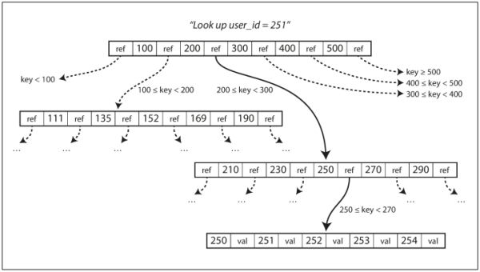

### **Chatper 3. Storage and Retrieval**

On the most fundamental level, a database needs to do two things:

1. When you give it some data, it should store the data.
2. When you ask it again later, it should give the data back to you.

[Chapter 2](ch2.md) discussed data models and query languages, the format in which you (the application developer) give the database your data, and the mechanism by which you can ask for it again later.

This chapter is from the database's point of view: how we can store the data that we're given, and how we can find it again when we're asked for it.

As an application developer, you are probably not going to implement your own storage engine from scratch, but you do need to select a storage engine that is appropriate for your application. You need to care about how the database handles storage and retrieval internally.

In particular, there is a big difference between:

* Storage engines that are optimized for transactional workloads: see [Transaction Processing or Analytics?](#transaction-processing-or-analytics)
* Storage engines that are optimized for analytics: see [Column-Oriented Storage](#column-oriented-storage)

### Data Structures That Power Your Database

Consider the world's simplest database, implemented as two Bash functions:

```bash
#!/bin/bash

db_set () {
    echo "$1,$2" >> database
}

db_get () {
    grep "^$1," database | sed -e "s/^$1,//" | tail -n 1
}
```

These two functions implement a key-value store:

* You can call `db_set` key value, which will store key and value in the database. The key and value can be anything you like, e.g., the value could be a JSON document.
* You can then call `db_get` key, which looks up the most recent value associated with that particular key and returns it.

```shell-session
$ db_set 123456 '{"name":"London","attractions":["Big Ben","London Eye"]}'
$ db_set 42 '{"name":"San Francisco","attractions":["Golden Gate Bridge"]}'
$ db_get 42
{"name":"San Francisco","attractions":["Golden Gate Bridge"]}
```

The underlying storage format is very simple: a text file where each line contains a key-value pair, separated by a comma (roughly like a [CSV](https://en.wikipedia.org/wiki/Comma-separated_values) file, ignoring escaping issues). Every call to `db_set` appends to the end of the file, so if you update a key several times, the old versions of the value are not overwritten, you need to look at the last occurrence of a key in a file to find the latest value (hence the `tail -n 1` in `db_get`):

This `db_set` function actually has pretty good performance, because appending to a file is generally very efficient. Similarly to what `db_set` does, many databases internally use a log, which is an append-only data file. Real databases have more issues to deal with, for example:

* Concurrency control
* Reclaiming disk space so that the log doesn't grow forever
* Handling errors and partially written records

> <small>The word *log* is often used to refer to application logs, where an application outputs text that describes what’s happening. In this book, *log* is used in the more general sense: an append-only sequence of records. It doesn't have to be human-readable; it might be binary and intended only for other programs to read.</small>

On the other hand, the `db_get` function has terrible performance if you have a large number of records in your database. `db_get` has to scan the entire database file from beginning to end, looking for occurrences of the key. In algorithmic terms, the cost of a lookup is *O(n)*.

In order to efficiently find the value for a particular key in the database, we need a different data structure: an *index*. The general idea behind index is to keep some additional metadata on the side, which acts as a signpost and helps you to locate the data you want. If you want to search the same data in several different ways, you may need several different indexes on different parts of the data.

An index is an additional structure that is derived from the primary data. Many databases allow you to add and remove indexes, and this doesn't affect the contents of the database; it only affects the performance of queries. Maintaining additional structures incurs overhead, especially on writes. For writes, it's hard to beat the performance of simply appending to a file, because that's the simplest possible write operation. Any kind of index usually slows down writes, because the index also needs to be updated every time data is written.

<u>This is an important trade-off in storage systems: well-chosen indexes speed up read queries, but every index slows down writes.</u> For this reason, databases don't usually index everything by default, but require you (the application developer or database administrator) to choose indexes manually, using your knowledge of the application's typical query patterns. You can then choose the indexes that give your application the greatest benefit, without introducing more overhead than necessary.

#### Hash Indexes

Although key-value data is not the only kind of data you can index, but it's very common, and it's a useful building block for more complex indexes.

Key-value stores are quite similar to the [*dictionary*](https://en.wikipedia.org/wiki/Associative_array) type that you can find in most programming languages, and which is usually implemented as a [hash map](https://en.wikipedia.org/wiki/Hash_table) (hash table).

In the preceding example, our data storage consists only of appending to a file. Then the simplest possible indexing strategy is this: keep an in-memory hash map where every key is mapped to a byte offset in the data file, as illustrated in [Figure 3-1](figure_3-1.png).

* Whenever you append a new key-value pair to the file, you also update the hash map to reflect the offset of the data you just wrote (this works both for inserting new keys and for updating existing keys).
* When you want to look up a value, use the hash map to find the offset in the data file, seek to that location, and read the value.

[](figure_3-1.png "Figure 3-1. Storing a log of key-value pairs in a CSV-like format, indexed with an in-memory hash map.")

This may sound simplistic, but it is a viable approach. In fact, this is essentially what [Bitcask](https://en.wikipedia.org/wiki/Bitcask) (the default storage engine in [Riak](https://en.wikipedia.org/wiki/Riak)) does:

* Bitcask offers high-performance reads and writes, subject to the requirement that all the keys fit in the available RAM, since the hash map is kept completely in memory.
* The values can use more space than there is available memory, since they can be loaded from disk with just one disk seek.
* If part of the data file is already in the filesystem cache, a read doesn't require any disk I/O at all.

A storage engine like Bitcask is well suited to situations where the value for each key is updated frequently. For example, the key is an URL of a cat video and the value might be the number of times it has been played. In this kind of workload, there are a lot of writes, but there are not too many distinct keys. Although you have a large number of writes per key, but it's feasible to keep all keys in memory.

So far we only ever append to a file. How do we avoid eventually running out of disk space? A good solution is to break the log into segments of a certain size by closing a segment file when it reaches a certain size, and making subsequent writes to a new segment file. We can then perform *compaction* on these segments, as illustrated in [Figure 3-2](figure_3-2.png). Compaction means throwing away duplicate keys in the log, and keeping only the most recent update for each key.

[](figure_3-2.png "Figure 3-2. Compaction of a key-value update log (counting the number of times each cat video was played), retaining only the most recent value for each key")

Moreover, since compaction often makes segments much smaller (assuming that a key is overwritten several times on average within one segment), we can also merge several segments together at the same time as performing the compaction, as shown in [Figure 3-3](figure_3-3.png). Segments are never modified after they have been written, so the merged segment is written to a new file. The merging and compaction of frozen segments can be done in a background thread, and while it is going on, we can still continue to serve read and write requests as normal, using the old segment files. After the merging process is complete, we switch read requests to using the new merged segment instead of the old segments, and then the old segment files can simply be deleted.

[](figure_3-3.png "Figure 3-3. Performing compaction and segment merging simultaneously.")

Each segment now has its own in-memory hash table, mapping keys to file offsets. In order to find the value for a key, we first check the most recent segment's hash map; if the key is not present we check the second-most-recent segment, and so on. The merging process keeps the number of segments small, so lookups don't need to check many hash maps.

Some of the issues that are important in a real implementation are:

* **File format**. CSV is not the best format for a log. It’s faster and simpler to use a binary format that first encodes the length of a string in bytes, followed by the raw string (without need for escaping).
* **Deleting records**. If you want to delete a key and its associated value, you have to append a special deletion record to the data file (sometimes called a [*tombstone*](https://en.wikipedia.org/wiki/Tombstone_(data_store))). When log segments are merged, the tombstone tells the merging process to discard any previous values for the deleted key.
* **Crash recovery**. If the database is restarted, the in-memory hash maps are lost. In principle, you can restore each segment's hash map by reading the entire segment file from beginning to end and noting the offset of the most recent value for every key as you go along. However, that might take a long time if the segment files are large, which would make server restarts painful. Bitcask speeds up recovery by storing a snapshot of each segment's hash map on disk, which can be loaded into memory more quickly.
* **Partially written records**. The database may crash at any time, including halfway through appending a record to the log. Bitcask files include checksums, allowing such corrupted parts of the log to be detected and ignored.
* **Concurrency control**. As writes are appended to the log in a strictly sequential order, a common implementation choice is to have only one writer thread. Data file segments are append-only and otherwise immutable, so they can be read concurrently by multiple threads.

An append-only log seems wasteful at first glance: why don't you update the file in place, overwriting the old value with the new value?

The append-only design turns out to be good for several reasons:

* Appending and segment merging are sequential write operations, which are generally much faster than random writes, especially on magnetic spinning-disk hard drives. To some extent sequential writes are also preferable on flash-based solid state drives (SSDs). See further discussions [Comparing BTrees and LSM-Trees](#comparing-btrees-and-lsm-trees).
* Concurrency and crash recovery are much simpler if segment files are append-only or immutable. For example, you don't have to worry about the case where a crash happened while a value was being overwritten, leaving you with a file containing part of the old and part of the new value spliced together.
* Merging old segments avoids the problem of data files getting fragmented over time.

However, the hash table index also has limitations:

* The hash table must fit in memory, so if you have a very large number of keys, you're out of luck. In principle, you could maintain a hash map on disk, but unfortunately it is difficult to make an on-disk hash map perform well. It requires a lot of random access I/O, it is expensive to grow when it becomes full, and hash collisions require fiddly logic.
* [Range queries](https://en.wikipedia.org/wiki/Range_query_(database)) are not efficient. For example, you cannot easily scan over all keys between `kitty00000` and` kitty99999`. You'd have to look up each key individually in the hash maps.

The indexing structure in the next section doesn't have those limitations.

#### SSTables and LSM-Trees

In [Figure 3-3](figure_3-3.png), each log-structured storage segment is a sequence of key-value pairs. These pairs appear in the order that they were written, and values later in the log take precedence over values for the same key earlier in the log. Apart from that, the order of key-value pairs in the file does not matter.

Now we can make a simple change to the format of our segment files: we require that the sequence of key-value pairs is *sorted by key*. At first glance, that requirement seems to break our ability to use sequential writes (to be discussed later).

We call this format *Sorted String Table*, or *SSTable* for short. We also require that each key only appears once within each merged segment file (the compaction process already ensures that).

SSTables have several big advantages over log segments with hash indexes:

[](figure_3-4.png "Figure 3-4. Merging several SSTable segments, retaining only the most recent value for each key.")

1. Merging segments is simple and efficient, even if the files are bigger than the available memory. The approach is like the one used in the [*mergesort*](https://en.wikipedia.org/wiki/Merge_sort) algorithm and is illustrated in [Figure 3-4](figure_3-4.png) (above): read the input files side by side, for the first key in each file, copy the lowest key (according to the sort order) to the output file, and repeat. This produces a new merged segment file, also sorted by key. When multiple segments contain the same key, keep the value from the most recent segment and discard the values in older segments. [p77]
2. In order to find a particular key in the file, you no longer need to keep an index of all the keys in memory. See [Figure 3-5](figure_3-5.png) (below) for an example: you're looking for the key `handiwork`, but you don't know the exact offset of that key in the segment file. However, you do know the offsets for the keys `handbag` and `handsome`, and because of the sorting you know that `handiwork` must appear between those two. This means you can jump to the offset for `handbag` and scan from there until you find `handiwork` (or not, if the key is not present in the file).
    * You still need an in-memory index to tell you the offsets for some of the keys, but it can be sparse: one key for every few kilobytes of segment file is sufficient, because a few kilobytes can be scanned very quickly.
    *  If all keys and values had a fixed size, you could use binary search on a segment file and avoid the in-memory index entirely. However, they are usually variable-length in practice, which makes it difficult to tell where one record ends and the next one starts if you don't have an index.
3. Since read requests need to scan over several key-value pairs in the requested range anyway, it is possible to group those records into a block and compress it before writing it to disk (indicated by the shaded area in [Figure 3-5](figure_3-5.png)). Each entry of the sparse in-memory index then points at the start of a compressed block.  Besides saving disk space, compression also reduces the I/O bandwidth use.

[](figure_3-5.png "Figure 3-5. An SSTable with an in-memory index.")

##### **Constructing and maintaining SSTables**

How do you get your data to be sorted by key in the first place? Incoming writes can occur in any order.

Maintaining a sorted structure on disk is possible (see [B-Trees](#b-trees) in the upcoming section), but maintaining it in memory is much easier. With a plenty of well-known tree data structures you can use, such as [red-black trees](https://en.wikipedia.org/wiki/Red%E2%80%93black_tree) or [AVL trees](https://en.wikipedia.org/wiki/AVL_tree), you can insert keys in any order and read them back in sorted order.

We can now make our storage engine work as follows:

* When a write comes in, add it to an in-memory balanced tree data structure (for example, a red-black tree). This in-memory tree is sometimes called a *memtable*.
* When the memtable gets bigger than some threshold (typically a few megabytes) write it out to disk as an SSTable file. This can be done efficiently because the tree already maintains the key-value pairs sorted by key. The new SSTable file becomes the most recent segment of the database. While the SSTable is being written out to disk, writes can continue to a new memtable instance.
* In order to serve a read request, first try to find the key in the memtable, then in the most recent on-disk segment, then in the next-older segment, etc.
* From time to time, run a merging and compaction process in the background to combine segment files and to discard overwritten or deleted values.

This works very well except for one problem: if the database crashes, the most recent writes (which are in the memtable but not yet written out to disk) are lost. In order to avoid that problem, we can keep a separate log on disk to which every write is immediately appended, just like in the previous section. That log is not in sorted order, but that doesn't matter, because its only purpose is to restore the memtable after a crash. Every time the memtable is written out to an SSTable, the corresponding log can be discarded.

##### **Making an LSM-tree out of SSTables**

The algorithm described here is essentially what is used in [LevelDB](https://en.wikipedia.org/wiki/LevelDB) and [RocksDB](https://en.wikipedia.org/wiki/RocksDB), key-value storage engine libraries that are designed to be embedded into other applications. Among other things, LevelDB can be used in Riak as an alternative to Bitcask. Similar storage engines are used in [Cassandra](https://en.wikipedia.org/wiki/Apache_Cassandra) and [HBase](https://en.wikipedia.org/wiki/Apache_HBase), both of which were inspired by Google's [Bigtable](https://en.wikipedia.org/wiki/Bigtable) paper.

Originally this indexing structure was described by [Patrick O'Neil](https://en.wikipedia.org/wiki/Patrick_O%27Neil) et al. under the name [Log-Structured Merge-Tree](https://en.wikipedia.org/wiki/Log-structured_merge-tree) (or LSM-Tree), building on earlier work on [log-structured filesystems](https://en.wikipedia.org/wiki/Log-structured_file_system). Storage engines that are based on this principle of merging and compacting sorted files are often called LSM storage engines.

[Lucene](https://en.wikipedia.org/wiki/Apache_Lucene), an indexing engine for full-text search used by [Elasticsearch](https://en.wikipedia.org/wiki/Elasticsearch) and [Solr](https://en.wikipedia.org/wiki/Apache_Solr), uses a similar method for storing its *term dictionary*. A full-text index is much more complex than a key-value index but is based on a similar idea: given a word in a search query, find all the documents (web pages, product descriptions, etc.) that mention the word. This is implemented with a key-value structure where the key is a word (a *term*) and the value is the list of IDs of all the documents that contain the word (the postings list). In Lucene, this mapping from term to postings list is kept in SSTable-like sorted files, which are merged in the background as needed.

##### **Performance optimizations**

As always, a lot of detail goes into making a storage engine perform well in practice. For example, the LSM-tree algorithm can be slow when looking up keys that do not exist in the database: you have to check the memtable, then the segments all the way back to the oldest before you can be sure that the key does not exist. In order to optimize this kind of access, storage engines often use additional [Bloom filters](https://en.wikipedia.org/wiki/Bloom_filter). (A Bloom filter is a memory-efficient data structure for approximating the contents of a set. It can tell you if a key does not appear in the database, and thus saves many unnecessary disk reads for nonexistent keys.)

There are also different strategies to determine the order and timing of how SSTables are compacted and merged. The most common options are *size-tiered* and *leveled* compaction. LevelDB and RocksDB use leveled compaction (hence the name of LevelDB), HBase uses size-tiered, and Cassandra supports both.

* In **size-tiered compaction**, newer and smaller SSTables are successively merged into older and larger SSTables. (See [DS210 Size Tiered Compaction](https://academy.datastax.com/resources/ds210-datastax-enterprise-operations-apache-cassandra?unit=size-tiered-compaction))
* In **leveled compaction**, the key range is split up into smaller SSTables and older data is moved into separate "levels", which allows the compaction to proceed more incrementally and use less disk space. (See [DS210 Leveled Compaction](https://academy.datastax.com/resources/ds210-datastax-enterprise-operations-apache-cassandra?unit=leveled-compaction))

Even though there are many subtleties, the basic idea of LSM-trees is keeping a cascade of SSTables that are merged in the background, which is simple and effective. Even when the dataset is much bigger than the available memory it continues to work well. Since data is stored in sorted order, you can efficiently perform range queries (scanning all keys above some minimum and up to some maximum), and because the disk writes are sequential the LSM-tree can support remarkably high write throughput.

#### B-Trees

Though gaining acceptance, the log-structured indexes are not the most common type of index. The most widely used indexing structure is quite different: the [*B-tree*](https://en.wikipedia.org/wiki/B-tree).

Introduced in 1970 and called "ubiquitous" less than 10 years later, B-trees remain the standard index implementation in almost all relational databases, and also used by many non-relational databases.

Like SSTables, B-trees keep key-value pairs sorted by key, which allows efficient key-value lookups and range queries. But that's where the similarity ends: B-trees have a very different design philosophy.

The log-structured indexes break the database down into variable-size *segments*, typically several megabytes or more in size, and always write a segment sequentially. By contrast, B-trees break the database down into fixed-size *blocks* or *pages*, traditionally 4 KB in size (sometimes bigger), and read or write one page at a time. This design corresponds more closely to the underlying hardware, as disks are also arranged in fixed-size blocks.

Each page can be identified using an address or location, which allows one page to refer to another (similar to a pointer, but on disk instead of in memory). We can use these page references to construct a tree of pages, as illustrated in [Figure 3-6](figure_3-6.png) (below).

[](figure_3-6.png "Figure 3-6. Looking up a key using a B-tree index.")

* One page is designated as the *root* of the B-tree, which is where you starts your lookup.
* The page contains several keys and references to child pages.
* Each child is responsible for a continuous range of keys, and the keys between the references indicate where the boundaries between those ranges lie.

In the [Figure 3-6](figure_3-6.png) example (above), we are looking for the key 251, so we know that we need to follow the page reference between the boundaries 200 and 300. That takes us to a similar-looking page that further breaks down the 200–300 range into subranges. Eventually we get down to a page containing individual keys (a *leaf page*), which either contains the value for each key inline or contains references to the pages where the values can be found.

The number of references to child pages in one page of the B-tree is called the [*branching factor*](https://en.wikipedia.org/wiki/Branching_factor). For example, in Figure 3-6 the branching factor is six. In practice, the branching factor depends on the amount of space required to store the page references and the range boundaries, but typically it is several hundred.

* If you want to update the value for an existing key in a B-tree, you search for the leaf page containing that key, change the value in that page, and write the page back to disk (any references to that page remain valid).
* If you want to add a new key, you need to find the page whose range encompasses the new key and add it to that page. If there isn't enough free space in the page to accommodate the new key, it is split into two half-full pages, and the parent page is updated to account for the new subdivision of key ranges. See [Figure 3-7](figure_3-7.png) (below).

[](figure_3-7.png "Figure 3-7. Growing a B-tree by splitting a page.")

This algorithm ensures that the tree remains *balanced*: a B-tree with n keys always has a depth of *O(log n)*. Most databases can fit into a B-tree with a depth of three or four levels, so you don't need to follow many page references to find the page. (A four-level tree of 4 KB pages with a branching factor of 500 can store up to 256 TB.)

##### **Making B-trees reliable**

The underlying write operation of a B-tree is to overwrite a page on disk with new data. It is assumed that the overwrite does not change the location of the page: all references to that page remain intact when the page is overwritten. This is in contrast to log-structured indexes such as LSM-trees, which only append to files (and eventually delete obsolete files) but never modify files in place.

You can think of overwriting a page on disk as an actual hardware operation:

* On a magnetic hard drive, this means moving the disk head to the right place, waiting for the right position on the spinning platter to come around, and then overwriting the appropriate sector with new data.
* On SSDs, what happens is somewhat more complicated, due to the fact that an SSD must erase and rewrite fairly large blocks of a storage chip at a time.

Moreover, some operations require several different pages to be overwritten. For example, if you split a page because an insertion caused it to be overfull, you need to write the two pages that were split, and also overwrite their parent page to update the references to the two child pages. This is a dangerous operation, because if the database crashes after only some of the pages have been written, you end up with a corrupted index (e.g., there may be an *orphan* page that is not a child of any parent).

In order to make the database resilient to crashes, it is common for B-tree implementations to include an additional data structure on disk: a [*write-ahead log*](https://en.wikipedia.org/wiki/Write-ahead_logging) (WAL, also known as a [*redo log*](https://en.wikipedia.org/wiki/Redo_log)). This is an append-only file to which every B-tree modification must be written before it can be applied to the pages of the tree itself. When the database comes back up after a crash, this log is used to restore the B-tree back to a consistent state.

Concurrency control is required if multiple threads are going to access the B-tree at the same time, otherwise a thread may see the tree in an inconsistent state. This is typically done by protecting the tree's data structures with *latches* (lightweight locks). (In this regard, log-structured approaches are simpler in this regard, because they do all the merging in the background without interfering with incoming queries and atomically swap old segments for new segments from time to time.)

##### **B-tree optimizations**

Many optimizations for B-trees have been developed over the years, such as:

* Instead of overwriting pages and maintaining a write-ahead log for crash recovery, some databases (like [LMDB](https://en.wikipedia.org/wiki/Lightning_Memory-Mapped_Database)) use a [copy-on-write](https://en.wikipedia.org/wiki/Copy-on-write) scheme. A modified page is written to a different location, and a new version of the parent pages in the tree is created, pointing at the new location. This approach is also useful for concurrency control (see [Snapshot Isolation and Repeatable Read](ch7.md#snapshot-isolation-and-repeatable-read) in Chapter 7).
* We can save space in pages by not storing the entire key, but abbreviating it. Especially in pages on the interior of the tree, keys only need to provide enough information to act as boundaries between key ranges. Packing more keys into a page allows the tree to have a higher branching factor, and thus fewer levels. (This variant is sometimes known as a [B+ tree](https://en.wikipedia.org/wiki/B%2B_tree), although the optimization is so common that it often isn't distinguished from other B-tree variants.)
* In general, pages can be positioned anywhere on disk; there is nothing requiring pages with nearby key ranges to be nearby on disk. If a query needs to scan over a large part of the key range in sorted order, that page-by-page layout can be inefficient, because a disk seek may be required for every page that is read. Many B-tree implementations therefore try to lay out the tree so that leaf pages appear in sequential order on disk. However, it's difficult to maintain that order as the tree grows.
    * By contrast, since LSM-trees rewrite large segments of the storage in one go during merging, it's easier for them to keep sequential keys close to each other on disk.
* Additional pointers have been added to the tree. For example, each leaf page may have references to its sibling pages to the left and right, which allows scanning keys in order without jumping back to parent pages.
* B-tree variants such as [*fractal trees*](https://en.wikipedia.org/wiki/Fractal_tree_index) borrow some log-structured ideas to reduce disk seeks.
