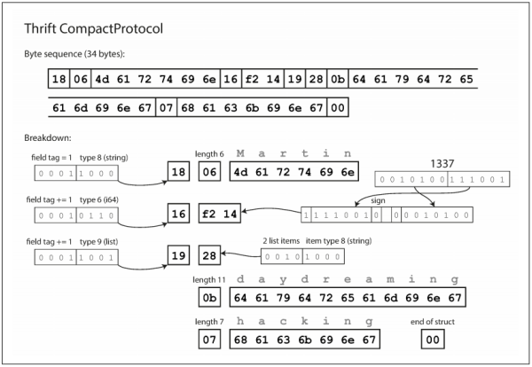

### **Chatper 4. Encoding and Evolution**

Applications change over time:

* Features are added or modified as new products are launched,
* User requirements become better understood, or,
* Business circumstances change.

[Chapter 1](ch1.md) introduced the idea of evolvability: we should aim to build systems that make it easy to adapt to change (see [Evolvability: Making Change Easy](ch1.md#evolvability-making-change-easy)).

[p111]

A change to an application's features also requires a change to data that it stores. The data models in [Chapter 2](ch2.md) have different ways of coping with such change:

* Relational databases generally assume that all data in the database conforms to one schema: although that schema can be changed (through schema migrations; i.e., `ALTER` statements), there is exactly one schema in force at any one point in time.
* By contrast, schema-on-read ("schemaless") databases don't enforce a schema, so the database can contain a mixture of older and newer data formats written at different times (see [Schema flexibility in the document model](ch2.md#schema-flexibility-in-the-document-model)).

When a data format or schema changes, a corresponding change to application code often needs to happen However, in a large application, code changes often cannot happen instantaneously:

* With server-side applications, you needs to perform a [*rolling upgrade*](https://en.wikipedia.org/wiki/Rolling_release) (also known as a *staged rollout*), deploying the new version to a few nodes at a time, checking whether the new version is running smoothly, and gradually working your way through all the nodes. This allows new versions to be deployed without service downtime, and thus encourages more frequent releases and better evolvability.
* With client-side applications you're at the mercy of the user, who may not install the update for some time.

This means that old and new versions of the code, and old and new data formats, may potentially all coexist in the system at the same time. In order for the system to continue running smoothly, we need to maintain compatibility in both directions:

* **Backward compatibility**. Newer code can read data that was written by older code. This is normally not hard to achieve: as author of the newer code, you know the format of data written by older code, and so you can explicitly handle it
(if necessary by simply keeping the old code to read the old data).
* **Forward compatibility**. Older code can read data that was written by newer code. This can be trickier, because it requires older code to ignore additions made by a newer version of the code

This chapter discusses the following topics:

* Several formats for encoding data, including JSON, XML, Protocol Buffers, Thrift, and Avro
* In particular, how those formats handle schema changes and how they support systems where old and new data and code need to coexist.
* How those formats are used for data storage and for communication: in web services, Representational State Transfer (REST), and remote procedure calls (RPC), as well as message-passing systems such as actors and message queues.

### Formats for Encoding Data

Programs usually work with data in two different representations:

1. In memory, data is kept in data structures such as objects, structs, lists, arrays, hash tables and trees, optimized for efficient access and manipulation by the CPU (typically using pointers).
2. When you want to write data to a file or send it over the network, you have to encode it as some kind of self-contained sequence of bytes (for example, a JSON document). Since a pointer wouldn't make sense to any other process, this sequence-of-bytes representation looks quite different from the data structures that are normally used in memory, with the exception of some special cases, such as certain [memory-mapped files](https://en.wikipedia.org/wiki/Memory-mapped_file) or when operating directly on compressed data (as described in [Column Compression](ch3.md#column-compression) in Chapter 3).

Thus, we need translation between the two representations:

* The translation from the in-memory representation to a byte sequence is called **encoding** (also known as [*serialization*](https://en.wikipedia.org/wiki/Serialization) or [*marshalling*](https://en.wikipedia.org/wiki/Marshalling_(computer_science))).
* The reverse is called **decoding** (*parsing*, *deserialization*, [*unmarshalling*](https://en.wikipedia.org/wiki/Unmarshalling)).

The term [*serialization*](https://en.wikipedia.org/wiki/Serializability) is also used in the context of [transactions](https://en.wikipedia.org/wiki/Database_transaction) (see [Chapter 7](ch7.md)), with a completely different meaning. We'll stick with *encoding* in this book.

#### Language-Specific Formats

Many programming languages come with built-in support for encoding in-memory
objects into byte sequences. For example:

* Java has [`java.io.Serializable`](https://docs.oracle.com/javase/8/docs/api/java/io/Serializable.html) (see [Java Object Serialization Specification](https://docs.oracle.com/javase/8/docs/platform/serialization/spec/serialTOC.html))
* Ruby has [`Marshal`](https://ruby-doc.org/core-2.5.0/Marshal.html)
* Python has [`pickle`](https://docs.python.org/3/library/pickle.html)

Many third-party libraries also exist, such as [Kryo](https://github.com/EsotericSoftware/kryo) for Java.

These encoding libraries are very convenient, because they allow in-memory objects to be saved and restored with minimal additional code, but they also have a number of problems:

* **Language-Specific**. The encoding is often tied to a particular programming language, and reading the data in another language is very difficult.
* **Security**. In order to restore data in the same object types, the decoding process needs to be able to instantiate arbitrary classes. This is a source of security problems: if an attacker can get your application to decode an arbitrary byte sequence, they can instantiate arbitrary classes, which in turn often allows them to do terrible things such as remotely executing arbitrary code.
* **Versioning**. As they are intended for quick and easy encoding of data, they often neglect the inconvenient problems of forward and backward compatibility.
* **Efficiency**. The efficiency such as the CPU time taken to encode or decode, and the size of the encoded structure, is also often an afterthought. For example, Java's built-in serialization is notorious for its bad performance and bloated encoding.

For these reasons it's generally a bad idea to use your language's built-in encoding for anything other than very transient purposes.

#### JSON, XML, and Binary Variants

JSON and XML are the widely known and supported standardized encodings widely supported, XML is often criticized for being too verbose and unnecessarily complicated. JSON's popularity is mainly due to its built-in support in web browsers (by virtue of being a subset of JavaScript) and simplicity relative to XML. CSV is another popular language-independent format, albeit less powerful.

As textual formats, JSON, XML, and CSV also have some subtle problems:

* Ambiguity in numbers. In XML and CSV, you cannot distinguish between a number and a string that happens to consist of digits (except by referring to an external schema). JSON distinguishes strings and numbers, but it doesn't distinguish integers and floating-point numbers, and it doesn't specify a precision.
    * This is a problem when dealing with large numbers; for example, integers greater than 2<sup>53</sup> cannot be exactly represented in an [IEEE 754 double-precision floating-point](https://en.wikipedia.org/wiki/Double-precision_floating-point_format) number, so such numbers become inaccurate when parsed in a language that uses floating-point numbers (such as JavaScript). Such an example occurs on Twitter, which uses a 64-bit number to identify each tweet. The JSON returned by Twitter's API includes tweet IDs twice, once as a JSON number and once as a decimal string, to work around the fact that the numbers are not correctly parsed by JavaScript applications.
* Lacking binary strings support. JSON and XML have good support for Unicode character strings (i.e., human-readable text), but they don't support binary strings (sequences of bytes without a character encoding).
    * Binary strings are a useful feature, so people get around this limitation by encoding the binary data as text using [Base64](https://en.wikipedia.org/wiki/Base64). The schema is then used to indicate that the value should be interpreted as Base64-encoded. This works, but it's somewhat hacky and increases the data size by 33%.
* There is optional schema support for both XML (see [XML Schema](https://www.w3.org/XML/Schema)) and JSON (see [JSON Schema](http://json-schema.org/)). Use of XML schemas is fairly widespread, but many JSON-based tools don't bother using schemas. Since the correct interpretation of data (such as numbers and binary strings) depends on the schema, applications that don't use XML/JSON schemas need to potentially hardcode the appropriate encoding/decoding logic instead.
* CSV does not have any schema, so it is up to the application to define the meaning of each row and column. If an application change adds a new row or column, you have to handle that change manually.

Despite these flaws, JSON, XML, and CSV are good enough for many purposes. It's likely that they will remain popular, especially as data interchange formats (i.e., for sending data from one organization to another).

##### **Binary encoding**

For data that is used only internally within your organization, you could choose a format that is more compact or faster to parse.

Although JSON is less verbose than XML, they both still use a lot of space compared to binary formats. This led to the development of a profusion of binary encodings:

* For JSON: [MessagePack](https://en.wikipedia.org/wiki/MessagePack), [BSON](https://en.wikipedia.org/wiki/BSON), BJSON, [UBJSON](https://en.wikipedia.org/wiki/UBJSON), BISON, and [Smile](https://en.wikipedia.org/wiki/Smile_(data_interchange_format))
* For XML: [WBXML](https://en.wikipedia.org/wiki/WBXML) and [Fast Infoset](https://en.wikipedia.org/wiki/Fast_Infoset) (FI)

These formats have been adopted in various niches, but none of them are as widely adopted as the textual versions of JSON and XML.

Some of these formats extend the set of datatypes (e.g., distinguishing integers and floating-point numbers, or adding support for binary strings), but otherwise they keep the JSON/XML data model unchanged. In particular, since they don't prescribe a schema, they need to include all the object field names within the encoded data.

For example, in a binary encoding of the JSON document below, they will need to include the strings `userName`, `favoriteNumber`, and `interests` somewhere.

<small>Example 4-1</small>

```json
{
    "userName": "Martin",
    "favoriteNumber": 1337,
    "interests": ["daydreaming", "hacking"]
}
```

The following figure shows the byte sequence that you get if you encode the JSON document in the above example with MessagePack.

[](figure_4-1.png "Figure 4-1. Example record (Example 4-1) encoded using MessagePack.")

The first few bytes are as follows:

1. The first byte, `0x83`, indicates that what follows is an object (top four bits = `0x80`) with three fields (bottom four bits = `0x03`). (If an object has more than 15 fields, so that the number of fields doesn't fit in four bits, it then gets a different type indicator, and the number of fields is encoded in two or four bytes.)
2. The second byte, `0xa8`, indicates that what follows is a string (top four bits = `0xa0`) that is eight bytes long (bottom four bits = `0x08`).
3. The next eight bytes are the field name `userName` in ASCII. Since the length was indicated previously, there's no need for any marker to tell us where the string ends (or any escaping).
4. The next seven bytes encode the six-letter string value `Martin` with a prefix `0xa6`, and so on.

The binary encoding is 66 bytes long, which is only a little less than the 81 bytes taken by the textual JSON encoding (with whitespace removed). All the binary encodings of JSON are similar in this regard. It's not clear whether such a small space reduction (and perhaps a speedup in parsing) is worth the loss of human-readability.

#### Thrift and Protocol Buffers

[Apache Thrift](https://en.wikipedia.org/wiki/Apache_Thrift) and [Protocol Buffers](https://en.wikipedia.org/wiki/Protocol_Buffers) (protobuf) are binary encoding libraries that are based on the same principle. Protocol Buffers was originally developed at Google, Thrift was originally developed at Facebook, and both were made open source in 2007–08.

Both Thrift and Protocol Buffers require a schema for any data that is encoded. To encode the data in Example 4-1 in Thrift, you would describe the schema in the Thrift [interface definition language](https://en.wikipedia.org/wiki/Interface_description_language) (IDL) like this:

```thrift
struct Person {
  1: required string userName,
  2: optional i64 favoriteNumber,
  3: optional list<string> interests
}
```

The equivalent schema definition for Protocol Buffers looks very similar:

```protobuf
message Person {
    required string user_name = 1;
    optional int64 favorite_number = 2;
    repeated string interests = 3;
}
```

Thrift and Protocol Buffers each come with a code generation tool that takes a schema definition like the ones shown above, and produces classes that implement the schema in various programming languages. Your application code can call this generated code to encode or decode records of the schema.

Thrift has two different binary encoding formats: [*BinaryProtocol*](https://github.com/apache/thrift/blob/master/doc/specs/thrift-binary-protocol.md) and [*CompactProtocol*](https://github.com/apache/thrift/blob/master/doc/specs/thrift-compact-protocol.md).

Encoding Example 4-1 in BinaryProtocol takes 59 bytes, as shown in the following figure:

[](figure_4-2.png "Figure 4-2. Example record encoded using Thrift's BinaryProtocol.")

Similarly to [Figure 4-1](figure_4-1.png), each field has:

* A type annotation and,
* A length indication, when required (e.g.length of a string, number of items in a list).

The strings that appear in the data ("Martin", "daydreaming", "hacking") are also encoded as ASCII (or rather, UTF-8), similar to before.

The big difference compared to Figure 4-1 is that there are no field names (`userName`, `favoriteNumber`, `interests`). Instead, the encoded data contains *field tags*, which are numbers (`1`, `2`, and `3`). Those are the numbers that appear in the schema definition. Field tags are like aliases for fields.

The Thrift CompactProtocol encoding is semantically equivalent to BinaryProtocol, but it packs the same information into only 34 bytes, as shown in the figure below.

[](figure_4-3.png "Figure 4-3. Example record encoded using Thrift's CompactProtocol.")

The size is much smaller because:

* It packs the field type and tag number into a single byte.
* It uses variable-length integers.

Rather than using a full eight bytes for the number 1337, it is encoded in two bytes, with the top bit of each byte used to indicate whether there are still more bytes to come. This means numbers between –64 and 63 are encoded in one byte, numbers between –8192 and 8191 are encoded in two bytes, etc. Bigger numbers use more bytes

Finally, Protocol Buffers (which has only one binary encoding format) encodes the same data as shown in the figure below. It does the bit packing slightly differently, but is otherwise very similar to Thrift's CompactProtocol. Protocol Buffers fits the same record in 33 bytes.

[](figure_4-4.png "Figure 4-4. Example record encoded using Protocol Buffers.")

Note in the schemas shown earlier, each field was marked either `required` or `optional`, but this makes no difference to how the field is encoded (nothing in the binary data indicates whether a field was required). The difference is simply that required enables a runtime check that fails if the field is not set, which can be useful for catching bugs.

##### **Field tags and schema evolution**

Schemas inevitably need to change over time. This is called [*schema evolution*](https://en.wikipedia.org/wiki/Schema_evolution). How do Thrift and Protocol Buffers handle schema changes while keeping backward and forward compatibility?

An encoded record is just the concatenation of its encoded fields. Each field is identified by its tag number (the numbers `1`, `2`, `3` in the sample schemas) and annotated with a datatype. If a field value is not set, it is simply omitted from the encoded record. From this you can see that field tags are critical to the meaning of the encoded data. You can change the name of a field in the schema, since the encoded data never refers to field names, but you cannot change a field's tag, since that would make all existing encoded data invalid.

* Forward compatibility (old code can read data written by new code). You can add new fields to the schema, provided that you give each field a new tag number. If old code (which doesn't know about the new tag numbers you added) tries to read data written by new code, it can simply ignore a new field with a tag number it doesn't recognize. The datatype annotation allows the parser to determine how many bytes it needs to skip.
* Backward compatibility (new code can can read data written by old code). As long as each field has a unique tag number, new code can always read old data, because the tag numbers still have the same meaning. The only detail is that if you add a new field, you cannot make it required.  If you were to add a field and make it required, that check would fail if new code read data written by old code, because the old code will not have written the new field that you added. <u>Therefore, to maintain backward compatibility, every field you add after the initial deployment of the schema must be optional or have a default value.</u>

Removing a field is just like adding a field, with backward and forward compatibility concerns reversed:

* You can only remove a field that is optional (a required field can never be removed);
* You can never use the same tag number again (because you may still have data written somewhere that includes the old tag number, and that field must be ignored by new code).

##### **Datatypes and schema evolution**

Changing the datatype of a field may be possible, but there is a risk that values will lose precision or get truncated.

For example, say you change a 32-bit integer into a 64-bit integer:

* New code can easily read data written by old code, because the parser can fill in any missing bits with zeros.
* However, if old code reads data written by new code, the old code is still using a 32-bit variable to hold the value. If the decoded 64-bit value won't fit in 32 bits, it will be truncated.

Protocol Buffers does not have a list or array datatype, but instead has a `repeated` marker for fields (which is a third option alongside `required` and `optional`). As you can see in [Figure 4-4](figure_4-4.png), the encoding of a repeated field is just what it says on the tin: the same field tag simply appears multiple times in the record. This has the nice effect that it's okay to change an `optional` (single-valued) field into a `repeated` (multi-valued) field:

* New code reading old data sees a list with zero or one elements (depending on whether the field was present);
* Old code reading new data sees only the last element of the list.

Thrift has a dedicated list datatype, which is parameterized with the datatype of the list elements. This does not allow the same evolution from single-valued to multi-valued as Protocol Buffers does, but it has the advantage of supporting nested lists.

#### Avro

[Apache Avro](https://en.wikipedia.org/wiki/Apache_Avro) is another binary encoding format that is interestingly different from Protocol Buffers and Thrift. It was started in 2009 as a subproject of Hadoop, because Thrift was not a good fit for Hadoop's use cases.

Avro also uses a schema to specify the structure of the data being encoded. It has two schema languages:

* Avro IDL: intended for human editing
* JSON: more easily machine-readable

An example schema, written in Avro IDL, looks like this:

```avro
record Person {
    string               userName;
    union { null, long } favoriteNumber = null;
    array<string>        interests;
}
```

The equivalent JSON representation of that schema is as follows:

```json
{
    "type": "record",
    "name": "Person",
    "fields": [
        {"name": "userName", "type": "string"},
        {"name": "favoriteNumber", "type": ["null", "long"], "default": null},
        {"name": "interests", "type": {"type": "array", "items": "string"}}
    ]
}
```

Notice that there are no tag numbers in the schema. If we encode our example record (Example 4-1) using this schema, the Avro binary encoding is just 32 bytes long—the most compact of all the encodings we have seen. The breakdown of the encoded byte sequence is shown in the figure below.

[](figure_4-5.png "Figure 4-5. Example record encoded using Avro.")

In the byte sequence, there is nothing to identify fields or their datatypes. The encoding simply consists of values concatenated together. For example:

* A string is just a length prefix followed by UTF-8 bytes, but there's nothing in the encoded data that tells you that it is a string. It could just as well be an integer, or something else entirely.
* An integer is encoded using a variable-length encoding (the same as Thrift's CompactProtocol).

To parse the binary data, you go through the fields in the order that they appear in the schema and use the schema to tell you the datatype of each field. This means that the binary data can only be decoded correctly if the code reading the data is using the exact same schema as the code that wrote the data. Any mismatch in the schema between the reader and the writer would mean incorrectly decoded data.

How does Avro support schema evolution?

##### **The writer's schema and the reader's schema**

When an application wants to encode some data (to write it to a file or database, to send it over the network, etc.), it encodes the data using whatever version of the schema it knows about (e.g., the schema may be compiled into the application). This is known as the **writer's schema**.

When an application wants to decode some data (read it from a file or database, receive it from the network, etc.), it is expecting the data to be in some schema, which is known as the **reader's schema**. That is the schema the application code is relying on (e.g., code may have been generated from that schema during the application's build process).

The key idea with Avro is that the writer's schema and the reader's schema don't have to be the same—they only need to be compatible. When data is decoded (read), the Avro library resolves the differences by looking at the writer's schema and the reader's schema side by side and translating the data from the writer's schema into the reader's schema. The [Avro specification](http://avro.apache.org/docs/1.8.2/) defines exactly how this resolution works, and it is illustrated in figure below.

[](figure_4-6.png "Figure 4-6. An Avro reader resolves differences between the writer's schema and the reader's schema.")

For example:

* It's no problem if the writer's schema and the reader's schema have their fields in a different order, because the schema resolution matches up the fields by field name.
* If the code reading the data encounters a field that appears in the writer's schema but not in the reader's schema, it is ignored.
* If the code reading the data expects some field, but the writer's schema does not contain a field of that name, it is filled in with a default value declared in the reader's schema.

##### **Schema evolution rules**

* Forward compatibility means that you can have a new version of the schema as writer and an old version of the schema as reader.
* Conversely, backward compatibility means that you can have a new version of the schema as reader and an old version as writer.

To maintain compatibility, you may only add or remove a field that has a default value. For example, say you add a field with a default value, so this new field exists in the new schema but not the old one. When a reader using the new schema reads a record written with the old schema, the default value is filled in for the missing field.

* If you were to add a field that has no default value, new readers wouldn't be able to read data written by old writers, so you would break backward compatibility.
* If you were to remove a field that has no default value, old readers wouldn't be able to read data written by new writers, so you would break forward compatibility.

In some programming languages, `null` is an acceptable default for any variable, but this is not the case in Avro: if you want to allow a field to be null, you have to use a [*union type*](https://avro.apache.org/docs/1.8.2/spec.html#Unions). For example, `union { null, long, string } field`; indicates that `field` can be a number, or a string, or null. You can only use null as a default value if it is one of the branches of the union. (The default value must be of the type of the *first* branch of the union.) This helps prevent bugs by being explicit about what can and cannot be null, rather than having everything nullable by default.

Consequently, Avro doesn't have `optional` and `required` markers in the same way as Protocol Buffers and Thrift do (it has union types and default values instead).

Changing the datatype of a field is possible, since Avro can convert the type. Changing the name of a field is possible but a little tricky: the reader's schema can contain aliases for field names, so it can match an old writer's schema field names against the aliases. This means that changing a field name is backward compatible but not forward compatible. Similarly, adding a branch to a union type is backward compatible but not forward compatible.

##### **But what is the writer's schema?**

How does the reader know the writer's schema with which a particular piece of data was encoded?

The answer depends on the context in which Avro is being used. For example:

* **Large file with lots of records**. A common use for Avro (especially in the context of Hadoop) is for storing a large file containing millions of records, all encoded with the same schema. (This situation will be discussed in [Chapter 10](ch10.md).) In this case, the writer of that file can just include the writer's schema once at the beginning of the file. Avro specifies a file format ([object container files](https://avro.apache.org/docs/1.8.2/spec.html#Object+Container+Files)) to do this.
* **Database with individually written records**. In a database, different records may be written using different writer's schemas. You cannot assume that all the records will have the same schema. The simplest solution is to include a version number at the beginning of every encoded record, and to keep a list of schema versions in your database. A reader can fetch a record, extract the version number, and then fetch the writer's schema for that version number from the database. Using that writer's schema, it can decode the rest of the record.
* **Sending records over a network connection**. When two processes are communicating over a bidirectional network connection, they can negotiate the schema version on connection setup and then use that schema for the lifetime of the connection. The Avro RPC protocol (see [Dataflow Through Services: REST and RPC](#dataflow-through-services-rest-and-rpc)) works like this.

A database of schema versions is a useful thing to have in any case, since it acts as documentation and gives you a chance to check schema compatibility. As for the version number, you could use a simple incrementing integer, or you could use a hash of the schema.

##### **Dynamically generated schemas**

One advantage of Avro's approach, compared to Protocol Buffers and Thrift, is that the schema doesn't contain any tag numbers.

Avro is friendlier to *dynamically generated* schemas. For example, you have a relational database and you want to dump its contents to a file using a binary format to avoid the aforementioned problems with textual formats (JSON, CSV, SQL). If you use Avro, you can easily generate an Avro schema (in the JSON representation we saw earlier) from the relational schema and encode the database contents using that schema, dumping it all to an Avro object container file. You generate a record schema for each database table, and each column becomes a field in that record. The column name in the database maps to the field name in Avro.

If the database schema changes (for example, a table has one column added and one column removed), you can just generate a new Avro schema from the updated database schema and export data in the new Avro schema. The data export process does not need to pay any attention to the schema change; it can simply do the schema conversion every time it runs. Anyone who reads the new data files will see that the fields of the record have changed, but since the fields are identified by name, the updated writer's schema can still be matched up with the old reader's schema.

By contrast, if you were using Thrift or Protocol Buffers for this purpose, the field tags would likely have to be assigned by hand: every time the database schema changes, an administrator would have to manually update the mapping from database column names to field tags. (It might be possible to automate this, but the schema generator would have to be very careful to not assign previously used field tags.) This kind of dynamically generated schema simply wasn't a design goal of Thrift or Protocol Buffers, whereas it was for Avro.

##### **Code generation and dynamically typed languages**

Thrift and Protocol Buffers rely on code generation: after a schema has been defined, you can generate code that implements this schema in a programming language of your choice. This is useful in statically typed languages such as Java, C++, or C#, because it allows efficient in-memory structures to be used for decoded data, and it allows type checking and autocompletion in IDEs when writing programs that access the data structures.

In dynamically typed programming languages such as JavaScript, Ruby, or Python, there is not much point in generating code, since there is no compile-time type checker to satisfy. Moreover, in the case of a dynamically generated schema (such as an Avro schema generated from a database table), code generation is an unnecessarily obstacle to getting to the data.

Avro provides optional code generation for statically typed programming languages, but it can be used just as well without any code generation. If you have an object container file (which embeds the writer's schema), you can simply open it using the Avro library and look at the data in the same way as you could look at a JSON file. The file is [*self-describing*](https://en.wikipedia.org/wiki/Self-documenting_code) since it includes all the necessary metadata.

This property is especially useful in conjunction with dynamically typed data processing languages like [Apache Pig](https://en.wikipedia.org/wiki/Pig_(programming_tool)). In Pig, you can just open some Avro files, start analyzing them, and write derived datasets to output files in Avro format without even thinking about schemas.

#### The Merits of Schemas

Protocol Buffers, Thrift, and Avro all use a schema to describe a binary encoding format and their schema languages are much simpler than XML Schema or JSON Schema, which support much more detailed validation rules, e.g., "the string value of this field must match this regular expression" or "the integer value of this field must be between 0 and 100" (see [JSON Schema Validation](http://json-schema.org/latest/json-schema-validation.html)). They have grown to support a fairly wide range of programming languages.

The ideas on which these encodings are based are by no means new. For example, they have a lot in common with [ASN.1](https://en.wikipedia.org/wiki/Abstract_Syntax_Notation_One), a schema definition language that was first standardized in 1984. It was used to define various network protocols, and its binary encoding ([DER](https://en.wikipedia.org/wiki/X.690#DER_encoding)) is still used to encode SSL certificates ([X.509](https://en.wikipedia.org/wiki/X.690)), for example. ASN.1 supports schema evolution using tag numbers, similar to Protocol Buffers and Thrift. However, it's also very complex and badly documented, so ASN.1 is probably not a good choice for new applications.

Many data systems also implement proprietary binary encoding for their data. For example, most relational databases have a network protocol for sending queries to the database. Those protocols are generally specific to a particular database, and the database vendor provides a driver (e.g., using the [ODBC](https://en.wikipedia.org/wiki/Open_Database_Connectivity) or [JDBC](https://en.wikipedia.org/wiki/Java_Database_Connectivity) APIs) that decodes responses from the database's network protocol into in-memory data structures

We can see that although textual data formats such as JSON, XML, and CSV are widespread, binary encodings based on schemas are also a viable option. They have a number of nice properties:

* They can be much more compact than the various "binary JSON" variants, since they can omit field names from the encoded data.
* The schema is a valuable form of documentation, and because the schema is required for decoding, you can be sure that it is up to date (whereas manually maintained documentation may easily diverge from reality).
* Keeping a database of schemas allows you to check forward and backward compatibility of schema changes, before anything is deployed.
* For users of statically typed programming languages, the ability to generate code from the schema is useful, since it enables type checking at compile time.

### Modes of Dataflow

There are many ways data can flow from one process to another. We will explore some of the most common ways how data flows between processes:

* Via databases (see [Dataflow Through Databases](#dataflow-through-databases))
* Via service calls (see [Dataflow Through Services: REST and RPC](#dataflow-through-services-rest-and-rpc))
* Via asynchronous message passing (see [Message-Passing Dataflow](#message-passing-dataflow))

#### Dataflow Through Databases

In a database:

* The process that writes to the database encodes the data
* The process that reads from the database decodes it

There may just be a single process accessing the database, in which case the reader is simply a later version of the same process. In that case, you can think of storing something in the database as sending a message to your future self.

* Backward compatibility is necessary. Otherwise your future self won't be able to decode what you previously wrote.
* Forward compatibility is also often required for databases. If the application is changing, it is likely that some processes accessing the database will be running newer code and some will be running older code. For example, if a new version is currently being deployed in a rolling upgrade, some instances have been updated while others haven't yet. This means that a value in the database may be written by a *newer* version of the code, and subsequently read by an *older* version of the code that is still running.
* An additional snag. If you add a field to a record schema, and the newer code writes a value for that new field to the database. Subsequently, an older version of the code (which doesn't yet know about the new field) reads the record, updates it, and writes it back. In this situation, the desirable behavior is usually for the old code to keep the new field intact, even though it couldn't be interpreted.

The encoding formats discussed previously support such preservation of unknown fields, but sometimes you need to take care at an application level, as illustrated in [Figure 4-7](figure_4-7.png) below. When an older version of the application updates data previously written by a newer version of the application, data may be lost if you're not careful.

[](figure_4-7.png "Figure 4-7. When an older version of the application updates data previously written by a newer version of the application, data may be lost if you're not careful.")

##### **Different values written at different times**

A database generally allows any value to be updated at any time. This means that within a single database you may have some values that were written five milliseconds ago, and some values that were written five years ago.

When you deploy a new version of your application, you may entirely replace the old version with the new version within a few minutes. The same is not true of database contents: the five-year-old data will still be there, in the original encoding, unless you have explicitly rewritten it since then. This observation is sometimes summed up as *data outlives code*.

Rewriting (*migrating*) data into a new schema is certainly possible, but it's an expensive thing to do on a large dataset, so most databases avoid it if possible. Most relational databases allow simple schema changes, such as adding a new column with a `null` default value, without rewriting existing data (except for MySQL, which often rewrites an entire table even though it is not strictly necessary, as mentioned in [Schema flexibility in the document model](ch2.md#schema-flexibility-in-the-document-model)). When an old row is read, the database fills in `nulls` for any columns that are missing from the encoded data on disk. LinkedIn's document database [Espresso](https://engineering.linkedin.com/espresso/introducing-espresso-linkedins-hot-new-distributed-document-store) uses Avro for storage, allowing it to use Avro's schema evolution rules.

Schema evolution thus allows the entire database to appear as if it was encoded with a single schema, even though the underlying storage may contain records encoded with various historical versions of the schema.

##### **Archival storage**

You may take a snapshot of your database from time to time, e.g., for backup purposes or for loading into a data warehouse (see [Data Warehousing](ch3.md#data-warehousing)). In this case, the data dump will typically be encoded using the latest schema, even if the original encoding in the source database contained a mixture of schema versions from different eras. Since you're copying the data anyway, you might as well encode the copy of the data consistently.

As the data dump is written in one go and is immutable, formats like Avro object container files are a good fit. This is also a good opportunity to encode the data in an analytics-friendly column-oriented format such as [Parquet](https://en.wikipedia.org/wiki/Apache_Parquet) (see [Column Compression](ch3.md#column-compression)).

[Chapter 10](ch10.md) has more about using data in archival storage.

#### Dataflow Through Services: REST and RPC

When you have processes that need to communicate over a network, there are a few different ways of arranging that communication. The most common arrangement is to have two roles: *clients* and *servers*. The servers expose an API over the network, and the clients can connect to the servers to make requests to that API. The API exposed by the server is known as a *service*.

Web browsers are not the only type of client. The server's response is typically not HTML for displaying to a human, but rather data in an encoding that is convenient for further processing by the client-side application code (such as JSON). Although HTTP may be used as the transport protocol, the API implemented on top is application-specific, and the client and server need to agree on the details of that API.

A server can itself be a client to another service (for example, a typical web app server acts as client to a database). This approach is often used to decompose a large application into smaller services by area of functionality, such that one service makes a request to another when it requires some functionality or data from that other service. This way of building applications has traditionally been called a [*service-oriented architecture*](https://en.wikipedia.org/wiki/Service-oriented_architecture) (SOA), more recently refined and rebranded as [*microservices architecture*](https://en.wikipedia.org/wiki/Microservices).

In some ways, services are similar to databases: they typically allow clients to submit and query data. However, while databases allow arbitrary queries using the query languages (discussed in [Chapter 2](ch2.md)), services expose an application-specific API that only allows inputs and outputs that are predetermined by the business logic (application code) of the service. This restriction provides a degree of encapsulation: services can impose fine-grained restrictions on what clients can and cannot do.

A key design goal of a service-oriented/microservices architecture is to make the application easier to change and maintain by making services independently deployable and evolvable. In other words, we should expect old and new versions of servers and clients to be running at the same time, and so the data encoding used by servers and clients must be compatible across versions of the service API—precisely what we've been talking about in this chapter. [p132]

##### **Web services**

When HTTP is used as the underlying protocol for talking to the service, it is called a [*web service*](https://en.wikipedia.org/wiki/Web_service). This is a slight misnomer, because web services are not only used on the web, but in several different contexts. For example:

1. A client application running on a user's device making requests to a service over HTTP.
2. One service making requests to another service owned by the same organization, often located within the same datacenter, as part of a service-oriented or microservices architecture. (Software that supports this kind of use case is sometimes called [*middleware*](https://en.wikipedia.org/wiki/Middleware_(distributed_applications)).)
3. One service making requests to a service owned by a different organization, usually via the internet. This is used for data exchange between different organizations' backend systems. This category includes public APIs provided by online services, such as credit card processing systems, or [OAuth](https://en.wikipedia.org/wiki/OAuth) for shared access to user data.

There are two popular approaches to web services: [*REST*](https://en.wikipedia.org/wiki/Representational_state_transfer) and [*SOAP*](https://en.wikipedia.org/wiki/SOAP).

* REST is not a protocol, but rather a design philosophy that builds upon the principles of HTTP. It emphasizes simple data formats, using URLs for identifying resources and using HTTP features for cache control, authentication, and content type negotiation. REST has been gaining popularity compared to SOAP, at least in the context of cross-organizational service integration, and is often associated with microservices. An API designed according to the principles of REST is called *RESTful*.
* By contrast, SOAP is an XML-based protocol for making network API requests. Although it is most commonly used over HTTP, it aims to be independent from HTTP and avoids using most HTTP features. Instead, it comes with a sprawling and complex multitude of related standards (the *web service framework*, known as *WS-**) that add various features.

The API of a SOAP web service is described using an XML-based language called the [Web Services Description Language](https://en.wikipedia.org/wiki/Web_Services_Description_Language), or WSDL. WSDL enables code generation so that a client can access a remote service using local classes and method calls (which are encoded to XML messages and decoded again by the framework). This is useful in statically typed programming languages, but less so in dynamically typed ones (see [Code generation and dynamically typed languages](#code-generation-and-dynamically-typed-languages)).

[p133]

Although SOAP is still used in many large enterprises, it has fallen out of favor in most smaller companies.

RESTful APIs tend to favor simpler approaches, typically involving less code generation and automated tooling. A definition format such as [OpenAPI](https://en.wikipedia.org/wiki/OpenAPI_Specification), also known as [Swagger](https://swagger.io/specification/), can be used to describe RESTful APIs and produce documentation.

##### **The problems with remote procedure calls (RPCs)**

#### Message-Passing Dataflow
