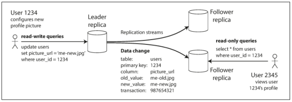

### **Chatper 5. Replication**

*Replication* means keeping a copy of the same data on multiple machines that are connected via a network. As discussed in the introduction to [Part II](part2.md), there are several reasons why you might want to replicate data:

* To keep data geographically close to your users (and thus reduce latency)
* To allow the system to continue working even if some of its parts have failed (and thus increase availability)
* To scale out the number of machines that can serve read queries (and thus increase read throughput)

[p151]

If the data that you're replicating does not change over time, then replication is easy: just copy the data to every node. All of the difficulty in replication lies in handling changes to replicated data. We will discuss three popular algorithms for replicating changes between nodes:

* Single-leader replication
* Multi-leader replication
* Leaderless replication

Almost all distributed databases use one of these three approaches, and all have various pros and cons.

There are many trade-offs to consider with replication: for example:

* Whether to use synchronous or asynchronous replication
* How to handle failed replicas

Replication of databases is an old topic and the principles haven't changed much since the 1970s, because the fundamental constraints of networks have remained the same. However, outside of research, many developers continued to assume for a long time that a database consisted of just one node. Mainstream use of distributed databases is more recent. Since many application developers are new to this area, there has been a lot of misunderstanding around issues such as [eventual consistency](https://en.wikipedia.org/wiki/Eventual_consistency). See [Problems with Replication Lag](#problems-with-replication-lag) section for details about eventual consistency and things like the *read-your-writes* and *monotonic reads* guarantees.

### Leaders and Followers

Each node that stores a copy of the database is called a *replica*. With multiple replicas, how do we ensure that all the data ends up on all the replicas?

Every write to the database needs to be processed by every replica; otherwise, the replicas would no longer contain the same data. The most common solution for this is called *leader-based replication* (also known as *active/passive* or *master–slave replication*) and is illustrated in [Figure 5-1](figure_5-1.png). It works as follows:

1. One of the replicas is designated the *leader* (also known as *master* or *primary*).  When clients want to write to the database, they must send their requests to the leader, which first writes the new data to its local storage.
2. The other replicas are known as *followers* (*read replicas*, *slaves*, *secondaries*, or *hot standbys*). Whenever the leader writes new data to its local storage, it also sends the data change to all of its followers as part of a *replication log* or *change stream*. Each follower takes the log from the leader and updates its local copy of the database accordingly, by applying all writes in the same order as they were processed on the leader.
3. When a client wants to read from the database, it can query either the leader or any of the followers. However, writes are only accepted on the leader (the followers are read-only from the client's point of view).

 replication.")

* This mode of replication is a built-in feature of many relational databases, such as PostgreSQL (since version 9.0), MySQL, [Oracle Data Guard](https://en.wikipedia.org/wiki/Oracle_Data_Guard), and SQL Server's AlwaysOn Availability Groups [3].
* It is also used in some nonrelational databases, including MongoDB, RethinkDB, and [Espresso](https://engineering.linkedin.com/espresso/introducing-espresso-linkedins-hot-new-distributed-document-store) (LinkedIn's distributed document store).
* Finally, leader-based replication is not restricted to only databases: distributed message brokers such as Kafka  and RabbitMQ highly available queues also use it.
* Some [network filesystems](https://en.wikipedia.org/wiki/Clustered_file_system#Distributed_file_systems) and replicated block devices such as [DRBD](https://en.wikipedia.org/wiki/Distributed_Replicated_Block_Device) are similar.
