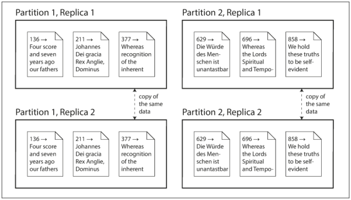

### **Part II. Distributed Data**

There are various reasons why you might want to distribute a database across multiple machines:

* **Scalability**. If your data volume, read load, or write load grows bigger than a single machine can handle, you can potentially spread the load across multiple machines.
* **Fault tolerance/high availability**. If your application needs to continue working even if one machine (or several machines, or the network, or an entire datacenter) goes down, you can use multiple machines to give you redundancy. When one fails, another one can take over.
* **Latency**. If you have users around the world, you might want to have servers at various locations worldwide so that each user can be served from a datacenter that is geographically close to them. That avoids the users having to wait for network packets to travel halfway around the world.

### Scaling to Higher Load

If all you need is to scale to higher load, the simplest approach is to buy a more powerful machine (sometimes called *vertical scaling* or *scaling up*). Many CPUs, many RAM chips, and many disks can be joined together under one operating system, and a fast interconnect allows any CPU to access any part of the memory or disk. In this kind of [*shared-memory architecture*](https://en.wikipedia.org/wiki/Shared_memory), all the components can be treated as a single machine.

The problems with a shared-memory approach are:

* The cost grows faster than linearly: a machine with twice as many CPUs, twice as much RAM, and twice as much disk capacity as another typically costs significantly more than twice as much.
* Due to bottlenecks, a machine twice the size cannot necessarily handle twice the load.
* A shared-memory architecture may offer limited fault tolerance. Although high-end machines have hot-swappable components (you can replace disks, memory modules, and even CPUs without shutting down the machines), but it is definitely limited to a single geographic location.

Another approach is the [*shared-disk architecture*](https://en.wikipedia.org/wiki/Shared_disk_architecture), which uses several machines with independent CPUs and RAM, but stores data on an array of disks that is shared between the machines connected via a fast network, such as [Network Attached Storage](https://en.wikipedia.org/wiki/Network-attached_storage) (NAS) or [Storage Area Network](https://en.wikipedia.org/wiki/Storage_area_network) (SAN). This architecture is used for some data warehousing workloads, but contention and the overhead of locking limit the scalability of the shared-disk approach.

#### Shared-Nothing Architectures

By contrast, [*shared-nothing architectures*](https://en.wikipedia.org/wiki/Shared-nothing_architecture) (sometimes called *horizontal scaling* or *scaling out*) have gained a lot of popularity. In this approach, each machine or virtual machine running the database software is called a *node*. Each node uses its CPUs, RAM, and disks independently. Any coordination between nodes is done at the software level, using a conventional network.

No special hardware is required by a shared-nothing system, so you can use whatever machines have the best price/performance ratio. You can potentially distribute data across multiple geographic regions, and thus reduce latency for users and potentially be able to survive the loss of an entire datacenter.

While a distributed shared-nothing architecture has many advantages, it usually also incurs additional complexity for applications and sometimes limits the expressiveness of the data models you can use. In some cases, a simple single-threaded program can perform significantly better than a cluster with over 100 CPU cores. On the other hand, shared-nothing systems can be very powerful.

#### Replication Versus Partitioning

There are two common ways data is distributed across multiple nodes:

* **Replication**. Keeping a copy of the same data on several different nodes, potentially in different locations. Replication provides redundancy: if some nodes are unavailable, the data can still be served from the remaining nodes. Replication can also help improve performance. See details in [Chapter 5](ch5.md).
* **Partitioning**. Splitting a big database into smaller subsets called [*partitions*](https://en.wikipedia.org/wiki/Partition_(database)) so that different partitions can be assigned to different nodes (also known as [*sharding*](https://en.wikipedia.org/wiki/Shard_(database_architecture))). See details in [Chapter 6](ch6.md).

In the following figure, a database split into two partitions, with two replicas per partition.

* Transactions are discussed in [Chapter 7](ch7.md).
* The fundamental limitations of distributed systems are discussed in [Chapters 8](ch8.md) and [Chapter 9](ch9.md).
