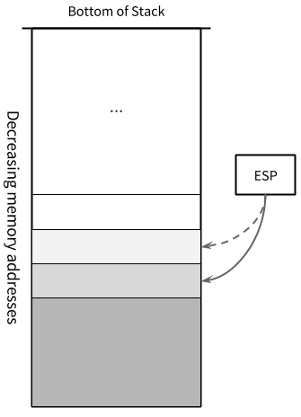

### **x86 Disassembly**

### Stack

<small>[The Stack](https://en.wikibooks.org/wiki/X86_Disassembly/The_Stack)</small>

A **stack** is a data structure that stores data values contiguously in memory.

* To read from the stack is said "to pop".
* To write to the stack is said "to push".

A stack is also known as a LIFO queue (Last In First Out) since values are popped from the stack in the reverse order that they are pushed onto it. Popped data disappears from the stack.

All x86 architectures use a stack as a temporary storage area in RAM that allows the processor to quickly store and retrieve data in memory.

* The current top of the stack is pointed to by the ESP register.
* The stack "grows" downward, from high to low memory addresses. Values recently pushed onto the stack are located in memory addresses above the ESP pointer.
* No register specifically points to the bottom of the stack. However, most operating systems monitor the stack bounds to detect both of the following conditions:
    * "underflow" (popping an empty stack)
    * "overflow" (pushing too much information on the stack)

When a value is popped off the stack, the value remains sitting in memory until overwritten. However, <u>you should never rely on the content of memory addresses below ESP, because other functions may overwrite these values without your knowledge.</u>

#### Push and Pop

The following lines of ASM code are basically equivalent:

##### **Push**

```nasm
push eax
```
is equivalent to:

```nasm
sub esp, 4
mov DWORD PTR SS:[esp], eax
```

##### **Pop**

```nasm
pop eax
```
is equivalent to:

```nasm
mov eax, DWORD PTR SS:[esp]
add esp, 4
```

In the above assembly code:

* [`DWORD`](https://msdn.microsoft.com/en-us/library/6ykwckb8.aspx) [`PTR`](https://msdn.microsoft.com/en-us/library/ek20ye9k.aspx): specifies a pointer to a double word (4 bytes) type.
* `SS:[esp]`: the [colon](https://msdn.microsoft.com/en-us/library/94b6khh4.aspx) (:) means overriding the default segment of `[esp]` with the Stack Segment (SS). SS is used as a segment prefix and ESP is dereferenced.

The single command actually performs much faster than the alternative. It can be visualized that the stack grows from right to left, and ESP decreases as the stack grows in size. The following figure shows a push operation.

[](figure_01.png "Figure 01 Push to a stack")

### ESP In Action

The following code discards 3 items that were pushed earlier onto the stack, without saving the values:

```nasm
pop eax
pop eax
pop eax
```

A faster method is to simply perform some basic arithmetic on ESP to make the pointer go "above" the data items, so they cannot be read anymore, and can be overwritten with the next round of `push` commands:

```nasm
add esp, 12  ; 3 DWORDs (4 bytes * 3)
```

If we want to reserve room on the stack for an item bigger than a `DWORD`, we can use a subtraction to artificially move ESP forward. We can then access our reserved memory directly as a memory pointer, or we can access it indirectly as an offset value from ESP itself.

For example, to create an array of 100 byte values on the stack and store the pointer to the base of this array in EDI:

```nasm
sub esp, 100  ; num of bytes in our array
mov edi, esp  ; copy address of 100 bytes area to edi
```

To destroy that array, use the following instruction:

```
add esp, 100
```

#### Reading Without Popping

To read values on the stack without popping them off the stack, ESP can be used with an offset. For instance, to read the 3 `DWORD` values from the top of the stack into EAX, we can use the instructions:

```nasm
mov eax, DWORD PTR SS:[esp]
mov eax, DWORD PTR SS:[esp + 4]
mov eax, DWORD PTR SS:[esp + 8]
```

Since ESP moves downward as the stack grows, data on the stack can be accessed with a positive offset. <u>A negative offset should never be used because data "above" the stack cannot be counted on to stay the way you left it.</u> The operation of reading from the stack without popping is often referred to as "peeking".

#### Data Allocation

There are two areas in the computer memory where a program can store data:

1. The **stack** is a linear LIFO buffer that allows fast allocations and deallocations, but has a limited size.
2. The **heap** is typically a non-linear data storage area, typically implemented using linked lists, binary trees, or other more exotic methods.
    * Heaps are slightly more difficult to interface with and to maintain than a stack, and allocations and deallocations are performed more slowly. However, heaps can grow as the data grows, and new heaps can be allocated when data quantities become too large.

Explicitly declared variables are allocated on the stack.

* Stack variables are finite in number, and have a definite size.
* Heap variables can be varied in number and in size.

### Functions and Stack Frames

Functions are frequently set up with a **stack frame** to allow access to both function parameters and automatic function variables in the execution environment. <u>The idea behind a stack frame is that each subroutine can act independently of its location on the stack, and each subroutine can act as if it is the top of the stack.</u>

* When a function is called, a new [stack frame](https://en.wikipedia.org/wiki/Call_stack#Structure) is created at the current ESP location.
* All items from previous functions are higher up on the stack, and should not be modified. The current function has access to the remainder of the stack.
* The current function always has access to the "top" of the stack. Therefore, functions do not need to take account of the memory usage of other functions or programs.


- - -

### References

* [x86 Disassembly](https://en.wikibooks.org/wiki/X86_Disassembly)
* [Microsoft Macro Assembler Reference](https://msdn.microsoft.com/en-us/library/afzk3475.aspx)
