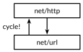

### **Chapter 11. Testing**

[p301]

Programs today are far larger and more complex than in [Maurice Wilkes](https://en.wikipedia.org/wiki/Maurice_Wilkes)'s time, and a great deal of effort has been spent on techniques to make this complexity manageable. Two techniques in particular stand out for their effectiveness:

1. Routine peer review of programs before they are deployed.
2. Testing.

Testing, by which we implicitly mean automated testing, is the practice of writing small programs that check that the code under test (the production code) behaves as expected for certain inputs, which are usually either carefully chosen to exercise certain features or randomized to ensure broad coverage.

[p301]

Go's approach to testing is rather low-tech in. It relies on one command, `go test`, and a set of conventions for writing test functions that `go test` can run. The comparatively lightweight mechanism is effective for pure testing, and it extends naturally to benchmarks and systematic examples for documentation.

In practice, writing test code is not much different from writing the original program itself.  We write short functions that focus on one part of the task. We have to be careful of boundary conditions, think about data structures, and reason about what results a computation should produce from suitable inputs. But this is the same process as writing ordinary Go code.

### The `go test` Tool

The [`go test`](https://golang.org/cmd/go/#hdr-Description_of_testing_flags) subcommand is a test driver for Go packages that are organized according to certain conventions. In a package directory, files whose names end with `_test.go` are not part of the package ordinarily built by `go build` but are a part of it when built by `go test`.

Within `*_test.go` files, three kinds of functions are treated specially: tests, benchmarks, and
examples.

* A *test function* is a function whose name begins with `Test`. It exercises some program logic for correct behavior; `go test` calls the test function and reports the result, which is either `PASS` or `FAIL`.
* A *benchmark function* has a name beginning with `Benchmark` and measures the performance of some operation; `go test` reports the mean execution time of the operation.
* A *example function*, whose name starts with `Example`, provides machine-checked documentation.

The `go test` tool scans the `*_test.go` files for these special functions, generates a temporary `main` package that calls them all in the proper way, builds and runs it, reports the results, and then cleans up.

### Test Functions

Each test file must import the testing package. Test functions have the following signature:

```go
func TestName(t *testing.T) {
	// ...
}
```

Test function names must begin with `Test`; the optional suffix `Name` must begin with a capital letter:

```go
func TestSin(t *testing.T) { /* ... */ }
func TestCos(t *testing.T) { /* ... */ }
func TestLog(t *testing.T) { /* ... */ }
```

The `t` parameter provides methods for reporting test failures and logging additional information.

For example, the package [gopl.io/ch11/word1](https://github.com/shichao-an/gopl.io/blob/master/ch11/word1/word.go) contains a single function `IsPalindrome` that reports whether a string reads the same forward and backward.

<small>[gopl.io/ch11/word1/word.go](https://github.com/shichao-an/gopl.io/blob/master/ch11/word1/word.go)</small>

```go
// Package word provides utilities for word games.
package word

// IsPalindrome reports whether s reads the same forward and backward.
// (Our first attempt.)
func IsPalindrome(s string) bool {
	for i := range s {
		if s[i] != s[len(s)-1-i] {
			return false
		}
	}
	return true
}
```

In the same directory, the file [word_test.go](https://github.com/shichao-an/gopl.io/blob/master/ch11/word1/word_test.go) contains two test functions named `TestPalindrome` and `TestNonPalindrome`. Each checks that `IsPalindrome` gives the right answer for a single input and reports failures using `t.Error`:

```go

package word

import "testing"

func TestPalindrome(t *testing.T) {
	if !IsPalindrome("detartrated") {
		t.Error(`IsPalindrome("detartrated") = false`)
	}
	if !IsPalindrome("kayak") {
		t.Error(`IsPalindrome("kayak") = false`)
	}
}

func TestNonPalindrome(t *testing.T) {
	if IsPalindrome("palindrome") {
		t.Error(`IsPalindrome("palindrome") = true`)
	}
}
```

A `go test` (or `go build`) command with no package arguments operates on the package in the current directory. We can build and run the tests with the following command.

```shell-session
$ cd $GOPATH/src/gopl.io/ch11/word1
$ go test
ok
gopl.io/ch11/word1 0.008s
```

However, `IsPalindrome` cannot recognize some other palindrome strings such as "été" or "A man, a plan, a canal: Panama".

```go
func TestFrenchPalindrome(t *testing.T) {
	if !IsPalindrome("été") {
		t.Error(`IsPalindrome("été") = false`)
	}
}

func TestCanalPalindrome(t *testing.T) {
	input := "A man, a plan, a canal: Panama"
	if !IsPalindrome(input) {
		t.Errorf(`IsPalindrome(%q) = false`, input)
	}
}
```

To avoid writing the long input string twice, we use `Errorf`, which provides formatting like `Printf`.

When the two new tests have been added, the `go test` command fails with informative error messages.

```shell-session
$ go test
--- FAIL: TestFrenchPalindrome (0.00s)
word_test.go:28: IsPalindrome("été") = false
--- FAIL: TestCanalPalindrome (0.00s)
word_test.go:35: IsPalindrome("A man, a plan, a canal: Panama") = false
FAIL
FAIL
```

As a bonus, running `go test` is usually quicker than manually going through the steps described in the bug report, allowing us to iterate more rapidly. If the test suite contains many slow tests, we may make even faster progress if we're selective about which ones we run.

The `-v` flag prints the name and execution time of each test in the package:

```shell-session
$ go test -v
=== RUN TestPalindrome
--- PASS: TestPalindrome (0.00s)
=== RUN TestNonPalindrome
--- PASS: TestNonPalindrome (0.00s)
=== RUN TestFrenchPalindrome
--- FAIL: TestFrenchPalindrome (0.00s)
word_test.go:28: IsPalindrome("été") = false
=== RUN TestCanalPalindrome
--- FAIL: TestCanalPalindrome (0.00s)
word_test.go:35: IsPalindrome("A man, a plan, a canal: Panama") = false
FAIL
exit status 1
FAIL gopl.io/ch11/word1 0.017s
```

The `-run` flag, whose argument is a regular expression, causes `go test` to run only those tests whose function name matches the pattern:

```shell-session
$ go test -v -run="French|Canal"
=== RUN TestFrenchPalindrome
--- FAIL: TestFrenchPalindrome (0.00s)
word_test.go:28: IsPalindrome("été") = false
=== RUN TestCanalPalindrome
--- FAIL: TestCanalPalindrome (0.00s)
word_test.go:35: IsPalindrome("A man, a plan, a canal: Panama") = false
FAIL
exit status 1
FAIL
```

Once we've gotten the selected tests to pass, we should invoke `go test` with no flags to run the entire test suite one last time before we commit the change.

A quick investigation reveals the cause of the first bug to be `IsPalindrome`'s use of byte sequences, not rune sequences, so that non-ASCII characters such as the é in "`été`" confuse it. The second bug arises from not ignoring spaces, punctuation, and letter case.

Then we rewrite the function more carefully:

<small>[gopl.io/ch11/word2/word.go](https://github.com/shichao-an/gopl.io/blob/master/ch11/word2/word.go)</small>

```shell-session
// Package word provides utilities for word games.
package word

import "unicode"

// IsPalindrome reports whether s reads the same forward and backward.
// Letter case is ignored, as are non-letters.
func IsPalindrome(s string) bool {
	var letters []rune
	for _, r := range s {
		if unicode.IsLetter(r) {
			letters = append(letters, unicode.ToLower(r))
		}
	}
	for i := range letters {
		if letters[i] != letters[len(letters)-1-i] {
			return false
		}
	}
	return true
}
```

We also write a more comprehensive set of test cases that combines all the previous ones and a number of new ones into a table.

```go
func TestIsPalindrome(t *testing.T) {
	var tests = []struct {
		input string
		want  bool
	}{
		{"", true},
		{"a", true},
		{"aa", true},
		{"ab", false},
		{"kayak", true},
		{"detartrated", true},
		{"A man, a plan, a canal: Panama", true},
		{"Evil I did dwell; lewd did I live.", true},
		{"Able was I ere I saw Elba", true},
		{"été", true},
		{"Et se resservir, ivresse reste.", true},
		{"palindrome", false}, // non-palindrome
		{"desserts", false},   // semi-palindrome
	}
	for _, test := range tests {
		if got := IsPalindrome(test.input); got != test.want {
			t.Errorf("IsPalindrome(%q) = %v", test.input, got)
		}
	}
}
```

The new tests pass:

```shell-session
$ go test gopl.io/ch11/word2
ok gopl.io/ch11/word2 0.015s
```

This style of [table-driven testing](https://en.wikipedia.org/wiki/Keyword-driven_testing) (see also [TableDrivenTests](https://github.com/golang/go/wiki/TableDrivenTests)) is very common in Go. It is straightforward to add new table entries as needed.

The output of a failing test does not include the entire stack trace at the moment of the call to `t.Errorf`. Nor does `t.Errorf` cause a panic or stop the execution of the test, unlike assertion failures in many test frameworks for other languages. Tests are independent of each other. If an early entry in the table causes the test to fail, later table entries will still be checked, and thus we may learn about multiple failures during a single run.

When we really must stop a test function, perhaps because some initialization code failed or to prevent a failure already reported from causing a confusing cascade of others, we use `t.Fatal` or `t.Fatalf`. <u>These must be called from the same goroutine as the `Test` function, not from another one created during the test.</u>

Test failure messages are usually of the form "`f(x) = y, want z`", where `f(x)` explains the attempted operation and its input, `y` is the actual result, and `z` the expected result:

* Where convenient, actual Go syntax is used for the `f(x)` part.
* Displaying `x` is particularly important in a table-driven test, since a given assertion is executed many times with different values.
* Avoid boilerplate and redundant information. When testing a boolean function such as `IsPalindrome`, omit the `want z` part since it adds no information. If `x`, `y`, or `z` is lengthy, print a concise summary of the relevant parts instead.
* The author of a test should strive to help the programmer who must diagnose a test failure.

#### Randomized Testing

Table-driven tests are convenient for checking that a function works on inputs which are carefully selected to exercise interesting cases in the logic. Another approach, [*randomized testing*](https://en.wikipedia.org/wiki/Random_testing), explores a broader range of inputs by constructing inputs at random.

How do we know what output to expect from our function, given a random input? There are two strategies:

1. Write an alternative implementation of the function that uses a less efficient but simpler and clearer algorithm, and check that both implementations give the same result.
2. Create input values according to a pattern so that we know what output to expect.

The example below uses the second approach: the `randomPalindrome` function generates words that are known to be palindromes by construction.

```go
import "math/rand"

// randomPalindrome returns a palindrome whose length and contents
// are derived from the pseudo-random number generator rng.
func randomPalindrome(rng *rand.Rand) string {
	n := rng.Intn(25) // random length up to 24
	runes := make([]rune, n)
	for i := 0; i < (n+1)/2; i++ {
	  r := rune(rng.Intn(0x1000)) // random rune up to '\u0999'
	  runes[i] = r
	  runes[n-1-i] = r
  }
	return string(runes)
}

func TestRandomPalindromes(t *testing.T) {
	// Initialize a pseudo-random number generator.
	seed := time.Now().UTC().UnixNano()
	t.Logf("Random seed: %d", seed)
	rng := rand.New(rand.NewSource(seed))
	for i := 0; i < 1000; i++ {
	  p := randomPalindrome(rng)
	  if !IsPalindrome(p) {
	    t.Errorf("IsPalindrome(%q) = false", p)
	  }
	}
}
```

Since randomized tests are nondeterministic, it is critical the failing test logs sufficient information to reproduce the failure. In the above example, the input `p` to `IsPalindrome` is all we need to know, but for functions that accept more complex inputs, it may be simpler to log the seed of the pseudo-random number generator (as we do above) than to dump the entire input data structure. With that seed value, we can easily modify the test to replay the failure deterministically.

By using the current time as a source of randomness, the test will explore novel inputs each time it is run, over the entire course of its lifetime. This is especially valuable if your project uses an automated system to run all its tests periodically.

#### Testing a Command

The `go test` tool is useful for testing library packages. We can use it to test commands as well. A package named `main` ordinarily produces an executable program, but it can also be imported as a library.

Consider the [`echo`](https://github.com/shichao-an/gopl.io/blob/master/ch2/echo4/main.go) program of [Section 2.3.2](ch2.md#pointers). The program is split into two functions: `echo` does the real work, while `main` parses and reads the flag values and reports any errors returned by `echo`.

<small>[gopl.io/ch11/echo/echo.go](https://github.com/shichao-an/gopl.io/blob/master/ch11/echo/echo.go)</small>

```go
// Echo prints its command-line arguments.
package main

import (
	"flag"
	"fmt"
	"io"
	"os"
	"strings"
)

var (
	n = flag.Bool("n", false, "omit trailing newline")
	s = flag.String("s", " ", "separator")
)

var out io.Writer = os.Stdout // modified during testing

func main() {
	flag.Parse()
	if err := echo(!*n, *s, flag.Args()); err != nil {
		fmt.Fprintf(os.Stderr, "echo: %v\n", err)
		os.Exit(1)
	}
}

func echo(newline bool, sep string, args []string) error {
	fmt.Fprint(out, strings.Join(args, sep))
	if newline {
		fmt.Fprintln(out)
	}
	return nil
}
```

We will write a test:

* It calls `echo` with a variety of arguments and flag settings and check that it prints the correct output in each case, so we've added parameters to `echo` to reduce its dependence on global variables.
* We've also introduced another global variable, `out`, the `io.Writer` to which the result will be written. By having `echo` write through this variable, not directly to `os.Stdout`, the tests can substitute a different `Writer` implementation that records what was written for later inspection.

The test is in file [echo_test.go](https://github.com/shichao-an/gopl.io/blob/master/ch11/echo/echo_test.go):

```go
package main

import (
	"bytes"
	"fmt"
	"testing"
)

func TestEcho(t *testing.T) {
	var tests = []struct {
		newline bool
		sep     string
		args    []string
		want    string
	}{
		{true, "", []string{}, "\n"},
		{false, "", []string{}, ""},
		{true, "\t", []string{"one", "two", "three"}, "one\ttwo\tthree\n"},
		{true, ",", []string{"a", "b", "c"}, "a,b,c\n"},
		{false, ":", []string{"1", "2", "3"}, "1:2:3"},
	}

	for _, test := range tests {
		descr := fmt.Sprintf("echo(%v, %q, %q)",
			test.newline, test.sep, test.args)

		out = new(bytes.Buffer) // captured output
		if err := echo(test.newline, test.sep, test.args); err != nil {
			t.Errorf("%s failed: %v", descr, err)
			continue
		}
		got := out.(*bytes.Buffer).String()
		if got != test.want {
			t.Errorf("%s = %q, want %q", descr, got, test.want)
		}
	}
}
```

Notice that the test code is in the same package as the production code. <u>Although the package name is `main` and it defines a `main` function, during testing this package acts as a library that exposes the function `TestEcho` to the test driver; its `main` function is ignored. By organizing the test as a table, we can easily add new test cases.</u> Let's see what happens when the test fails, by adding this line to the table:

```go
{true, ",", []string{"a", "b", "c"}, "a b c\n"}, // NOTE: wrong expectation!
```

`go test` prints:

```shell-session
$ go test gopl.io/ch11/echo
--- FAIL: TestEcho (0.00s)
echo_test.go:31: echo(true, ",", ["a" "b" "c"]) = "a,b,c", want "a b c\n"
FAIL
FAIL gopl.io/ch11/echo 0.006s
```

The error message describes the attempted operation (using Go-like syntax), the actual behavior, and the expected behavior, in that order. With an informative error message such as this, you may have a pretty good idea about the root cause before you've even located the source code of the test.

It's important that code being tested not call `log.Fatal` or `os.Exit`, since these will stop the process in its tracks; calling these functions should be regarded as the exclusive right of `main`. If something totally unexpected happens and a function panics, the test driver will recover, though the test will be considered a failure. Expected errors such as those resulting from bad user input, missing files, or improper configuration should be reported by returning a non-nil error value. However, our echo example is so simple that it will never return a non-nil error.

#### White-Box Testing

We can categorize tests by the level of knowledge required for the internal workings of the package under test:

* A [*black-box test*](https://en.wikipedia.org/wiki/Black-box_testing) assumes nothing about the package other than
what is exposed by its API and specified by its documentation. The package's internals are opaque.
* In contrast, a [*white-box test*](https://en.wikipedia.org/wiki/White-box_testing) (or *clear box test*) has privileged access to the internal functions and data structures of the package and can make observations and changes that an ordinary client cannot. For example, a white-box test can check that the invariants of the package's data types are maintained after every operation.

The two approaches are complementary:

* Black-box tests are usually more robust, needing fewer updates as the software evolves. They also help the author empathize with the client of the package and can reveal flaws in the API design.
* In contrast, white-box tests can provide more detailed coverage of the trickier parts of the implementation.

In the previous examples:

* `TestIsPalindrome` calls only the exported function `IsPalindrome` and is thus a black-box test.
* `TestEcho` calls the `echo` function and updates the global variable `out`, both of which are unexported, making it a white-box test.

While developing `TestEcho`, we modified the `echo` function to use the package-level variable `out` when writing its output, so that the test could replace the standard output with an alternative implementation that records the data for later inspection. Using the same technique, we can replace other parts of the production code with easy-to-test "fake" implementations. The advantage of fake implementations is that they can be simpler to configure, more predictable, more reliable, and easier to observe. They can also avoid undesirable side effects such as updating a production database or charging a credit card.

The code below shows the quota-checking logic in a web service that provides networked storage to users. When users exceed 90% of their quota, the system sends them a warning email.

<small>[gopl.io/ch11/storage1/storage.go](https://github.com/shichao-an/gopl.io/blob/master/ch11/storage1/storage.go)</small>

```go
package storage

import (
	"fmt"
	"log"
	"net/smtp"
)

func bytesInUse(username string) int64 { return 0 /* ... */ }

// Email sender configuration.
// NOTE: never put passwords in source code!
const sender = "notifications@example.com"
const password = "correcthorsebatterystaple"
const hostname = "smtp.example.com"

const template = `Warning: you are using %d bytes of storage,
%d%% of your quota.`

func CheckQuota(username string) {
	used := bytesInUse(username)
	const quota = 1000000000 // 1GB
	percent := 100 * used / quota
	if percent < 90 {
		return // OK
	}
	msg := fmt.Sprintf(template, used, percent)
	auth := smtp.PlainAuth("", sender, password, hostname)
	err := smtp.SendMail(hostname+":587", auth, sender,
		[]string{username}, []byte(msg))
	if err != nil {
		log.Printf("smtp.SendMail(%s) failed: %s", username, err)
	}
}
```

However, we don't want the test to send out real email. We can move the email logic into its own function and store that function in an unexported package-level variable, `notifyUser`.

<small>[gopl.io/ch11/storage2/storage.go](https://github.com/shichao-an/gopl.io/blob/master/ch11/storage2/storage.go)</small>

```go
var notifyUser = func(username, msg string) {
	auth := smtp.PlainAuth("", sender, password, hostname)
	err := smtp.SendMail(hostname+":587", auth, sender,
		[]string{username}, []byte(msg))
	if err != nil {
		log.Printf("smtp.SendEmail(%s) failed: %s", username, err)
	}
}

func CheckQuota(username string) {
	used := bytesInUse(username)
	const quota = 1000000000 // 1GB
	percent := 100 * used / quota
	if percent < 90 {
		return // OK
	}
	msg := fmt.Sprintf(template, used, percent)
	notifyUser(username, msg)
}
```

We can now write a test that substitutes a simple fake notification mechanism instead of sending real email. This one records the notified user and the contents of the message.

<small>[gopl.io/ch11/storage2/quota_test.go](https://github.com/shichao-an/gopl.io/blob/master/ch11/storage2/quota_test.go)</small>

```go
//!+test
package storage

import (
	"strings"
	"testing"
)

func TestCheckQuotaNotifiesUser(t *testing.T) {
	var notifiedUser, notifiedMsg string
	notifyUser = func(user, msg string) {
		notifiedUser, notifiedMsg = user, msg
	}

	const user = "joe@example.org"

	// Simulate a 980MB-used condition for this user.
	// NOTE: this differs slightly from the printed version.
	usage["joe@example.org"] = 980000000

	CheckQuota(user)
	if notifiedUser == "" && notifiedMsg == "" {
		t.Fatalf("notifyUser not called")
	}
	if notifiedUser != user {
		t.Errorf("wrong user (%s) notified, want %s",
			notifiedUser, user)
	}
	const wantSubstring = "98% of your quota"
	if !strings.Contains(notifiedMsg, wantSubstring) {
		t.Errorf("unexpected notification message <<%s>>, "+
			"want substring %q", notifiedMsg, wantSubstring)
	}
}
```

There's one problem: after this test function has returned, `CheckQuota` no longer works as it should because it's still using the test's fake implementation of `notifyUsers`. (There is always a risk of this kind when updating global variables.) We must modify the test to restore the previous value so that subsequent tests observe no effect, and we must do this on all execution paths, including test failures and panics. This naturally suggests `defer`.

```go
func TestCheckQuotaNotifiesUser(t *testing.T) {
	// Save and restore original notifyUser.
	saved := notifyUser
	defer func() { notifyUser = saved }()
	// Install the test's fake notifyUser.
	var notifiedUser, notifiedMsg string
	notifyUser = func(user, msg string) {
		notifiedUser, notifiedMsg = user, msg
	}
	// ...rest of test...
}
```

This pattern can be used to do the following:

* Temporarily save and restore all kinds of global variables, including command-line flags, debugging options, and performance parameters
* Install and remove hooks that cause the production code to call some test code when something interesting happens
* Coax the production code into rare but important states, such as timeouts, errors, and even specific interleavings of concurrent activities.

Using global variables in this way is safe only because `go test` does not normally run multiple tests concurrently.

#### External Test Packages

Consider the following packages:

* [`net/url`](https://golang.org/pkg/net/url/), which provides a URL parser
* [`net/http`](https://golang.org/pkg/net/http/), which provides a web server and HTTP client library.

The higher-level `net/http` depends on the lower-level `net/url`. However, one of the tests in `net/url` is an example demonstrating the interaction between URLs and the HTTP client library. In other words, a test of the lower-level package imports the higher-level package.

[](figure_11.1.png "Figure 11.1. A test of net/url depends on net/http.")

Declaring this test function in the `net/url` package would create a cycle in the package import graph, as depicted by the upwards arrow in figure above, but as we explained in [Section 10.1](ch10.md#introduction), the Go specification forbids import cycles.

We resolve the problem by declaring the test function in an external test package, that is, in a file in the `net/url` directory whose package declaration reads package `url_test`. The extra suffix `_test` is a signal to `go test` that it should build an additional package containing just these files and run its tests. It may be helpful to think of this external test package as if it had the import path `net/url_test`, but it cannot be imported under this or any other name. See [The Last Segment Convention](ch10.md#the-last-segment-convention) in Chapter 10 for details.

Because external tests live in a separate package, they may import helper packages that also depend on the package being tested; an in-package test cannot do this. In terms of the design layers, the external test package is logically higher up than both of the packages it depends upon, as shown in the figure below.

[](figure_11.2.png "Figure 11.2. External test packages break dependency cycles.")

By avoiding import cycles, external test packages allow tests, especially [*integration tests*](https://en.wikipedia.org/wiki/Integration_testing) (which test the interaction of several components), to import other packages freely, exactly as an application would.

We can use the `go list` tool to summarize Go source files in a package directory to determine if they are one of the following:
* production code
* in-package tests
* external tests.

Use the `fmt` package as an example:

`GoFiles` is the list of files that contain the production code; these are the files that `go build` will include in your application:

```shell-session
$ go list -f={{.GoFiles}} fmt
[doc.go format.go print.go scan.go]
```

`TestGoFiles` is the list of files that also belong to the `fmt` package, but these files, whose names all end in `_test.go`, are included only when building tests:

```shell-session
$ go list -f={{.TestGoFiles}} fmt
[export_test.go]
```

The package's tests would usually reside in these files, though unusually `fmt` has none. The purpose of `export_test.go` in a moment.

`XTestGoFiles` is the list of files that constitute the external test package, `fmt_test`, so these files must import the fmt package in order to use it; again, they are included only during testing:

```go
$ go list -f={{.XTestGoFiles}} fmt
[fmt_test.go scan_test.go stringer_test.go]
```

Sometimes an external test package may need privileged access to the internals of the package under test. For example, a white-box test must live in a separate package to avoid an import cycle. In such cases, we use a trick: we add declarations to an in-package `_test.go` file to expose the necessary internals to the external test. This file thus offers the test a "back door" to the package. If the source file exists only for this purpose and contains no tests itself, it is often called `export_test.go`.

For example, the implementation of the `fmt` package needs the functionality of [`unicode.IsSpace`](https://golang.org/pkg/unicode/#IsSpace) as part of [`fmt.Scanf`](https://golang.org/pkg/fmt/#Scanf). To avoid creating an undesirable dependency, `fmt` does not import the `unicode` package and its large tables of data; instead, it contains a simpler implementation, which it calls `isSpace`.

To ensure that the behaviors of `fmt.isSpace` and `unicode.IsSpace` do not drift apart, `fmt` prudently contains a test. It is an external test, and thus it cannot access `isSpace` directly, so `fmt` opens a back door to it by declaring an exported variable that holds the internal `isSpace` function. This is the entirety of the `fmt` package's `export_test.go` file.

```go
package fmt

var IsSpace = isSpace
```

This test file defines no tests; it declares the exported symbol `fmt.IsSpace` for use by the external test. This trick can also be used whenever an external test needs to use some of the techniques of white-box testing.
