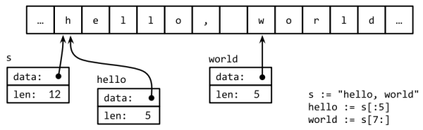

### **Chapter 3. Basic Data Types**

Computers operate fundamentally on fixed-size numbers called **words**, which are interpreted as integers, floating-point numbers, bit sets, or memory addresses, then combined into larger aggregates.

Go’s types fall into four categories:

* Basic types: numbers, strings, and booleans.
* Aggregate types: arrays and structs.
* Reference types: pointers, slices, maps, functions, and channels .
* Interface types

Basic types (discussed in this chapter) include numbers, strings, and booleans.

### Integers

Go provides both signed and unsigned integer arithmetic. There are four distinct sizes of
signed integers: 8, 16, 32, and 64 bits. They represented by:

* Signed: `int8`, `int16`, `int32`, and `int64`;
* Unsigned: `uint8`, `uint16`, `uint32`, and `uint64`.

There are also two types `int` and `uint` that are the natural or most efficient size for signed and unsigned integers on a particular platform: `int` is by far the most widely used numeric type. Both these types have the same size, either 32 or 64 bits, but one must not make assumptions about which; different compilers may make different choices even on identical hardware.

* The type `rune` is an synonym for `int32` and conventionally indicates that a value is a Unicode
code point. The two names may be used interchangeably.
* The type `byte` is an synonym for `uint8`, and emphasizes that the value is a piece of raw data rather than a small numeric quantity.
* `uintptr` is an unsigned integer type, whose width is not specified but is sufficient to hold all the bits of a pointer value. The `uintptr` type is used only for low-level programming, such as at the boundary of a Go program with a C library or an operating system (discussed with the `unsafe` package in [Chapter 13](ch13.md)).

Regardless of their size, `int`, `uint`, and `uintptr` are different types from their explicitly sized siblings. Thus `int` is not the same type as `int32`, even if the natural size of integers is 32 bits, and an explicit conversion is required to use an `int` value where an `int32` is needed, and vice versa.

#### Signedness *

Signed numbers are represented in [2’s-complement](https://en.wikipedia.org/wiki/Two%27s_complement) form, in which the high-order bit is reserved for the sign of the number and the range of values of an n-bit number is from −2<sup>*n*−1</sup> to 2<sup>*n*−1</sup>−1. Unsigned integers use the full range of bits for non-negative values and thus have the range 0 to 2<sup>*n*−1</sup>. For instance, the range of `int8` is −128 to 127, whereas the range of `uint8` is 0 to 255.

#### Binary operators *

Go’s binary operators for arithmetic, logic, and comparison are listed here in order of decreasing precedence:

```text
* / % << >> & &^
+ - | ^
== != < <= > >=
&&
||
```

There are only five levels of precedence for binary operators. Operators at the same level associate to the left; parentheses may be required for clarity, or to make the operators evaluate in the intended order in an expression like `mask & (1 << 28)`.

Each operator in the first two lines of the table above, has a corresponding assignment operator. For instance, `+` has `+=` that may be used to abbreviate an assignment statement.

##### **Arithmetic operators** *

The integer [arithmetic operators](https://golang.org/ref/spec#Arithmetic_operators) `+`, `-`, `*`, and `/` may be applied to integer, floating-point, and complex numbers, but the remainder operator `%` applies only to integers.

* The behavior of `%` for negative numbers varies across programming languages. In Go, the sign of the remainder is always the same as the sign of the [dividend](https://en.wikipedia.org/wiki/Division_(mathematics)), so `-5%3` and `-5%-3` are both `-2`.
* The behavior of `/` depends on whether its operands are integers, so `5.0/4.0` is `1.25`, but `5/4` is `1` because integer division truncates the result toward zero.

##### **Integer overflow** *

If the result of an arithmetic operation, whether signed or unsigned, has more bits than can be represented in the result type, it is said to *overflow*. The high-order bits that do not fit are silently discarded. If the original number is a signed type, the result could be negative if the leftmost bit is a 1, as in the `int8` example here:

```go
var u uint8 = 255
fmt.Println(u, u+1, u*u) // "255 0 1"

var i int8 = 127
fmt.Println(i, i+1, i*i) // "127 -128 1"
```

##### **Comparison and comparability** *

Binary comparison operators are:

* `==`: equal to
* `!=`: not equal to
* `<`: less than
* `<=`: less than or equal to
* `>`: greater than
* `>=`: greater than or equal to

The type of a comparison expression is a boolean.

* All values of basic type (booleans, numbers, and strings) are *comparable*. This means two values of the same type may be compared using the `==` and `!=` operators.
* Integers, floating-point numbers, and strings are *ordered* by the comparison operators.
* The values of many other types are not comparable, and no other types are ordered.

##### **Unary operators** *

There are also unary addition and subtraction operators:

* `+`: unary positive (no effect)
* `-`: unary negation

For integers, `+x` is a shorthand for `0+x` and `-x` is a shorthand for `0-x`; for floating-point and complex numbers, `+x` is just `x` and `-x` is the negation of `x`.

##### **Bitwise binary operators** *

The following are bitwise binary operators. The first four of them treat their operands as bit patterns with no concept of arithmetic carry or sign:

* `&`: bitwise AND
* `|`: bitwise OR
* `^`: bitwise XOR
* `&^`: bit clear (AND NOT)
* `<<`: left shift
* `>>`: right shift

The operator `^` has two usages:

* When used as a binary operator, it is bitwise exclusive OR (XOR)
* When used as a unary prefix operator, it is bitwise negation or complement, which means it returns a value with each bit in its operand inverted.

The `&^` operator is bit clear (AND NOT): in the expression `z = x &^ y`, each bit of `z` is 0 if the corresponding bit of `y` is 1; otherwise it equals the corresponding bit of `x`.

##### **Bitwise operation examples** *

The code below shows how bitwise operations can be used to interpret a `uint8` value as a compact and efficient set of 8 independent bits. It uses `Printf`'s `%b` verb to print a number’s binary digits; `08` modifies `%b` to pad the result with zeros to exactly 8 digits.


```go
var x uint8 = 1<<1 | 1<<5
var y uint8 = 1<<1 | 1<<2

fmt.Printf("%08b\n", x)    // "00100010", the set {1, 5}
fmt.Printf("%08b\n", y)    // "00000110", the set {1, 2}

fmt.Printf("%08b\n", x&y)  // "00000010", the intersection {1}
fmt.Printf("%08b\n", x|y)  // "00100110", the union {1, 2, 5}
fmt.Printf("%08b\n", x^y)  // "00100100", the symmetric difference {2, 5}
fmt.Printf("%08b\n", x&^y) // "00100000", the difference {5}

for i := uint(0); i < 8; i++ {
	if x&(1<<i) != 0 { // membership test
		fmt.Println(i) // "1", "5"
	}
}

fmt.Printf("%08b\n", x<<1) // "01000100", the set {2, 6}
fmt.Printf("%08b\n", x>>1) // "00010001", the set {0, 4}
```

[Section 6.5](ch6.md#example-bit-vector-type) shows an implementation of integer sets that can be much bigger than a byte.

In the shift operations `x<<n` and `x>>n`:

* The `n` operand determines the number of bit positions to shift and must be unsigned.
* The `x` operand may be unsigned or signed.

Arithmetically:

* A left shift `x<<n` is equivalent to multiplication by 2<sup>n</sup>.
* A right shift `x>>n` is equivalent to the floor of division by 2<sup>n</sup>.

For unsigned numbers, both left and right shifts fill the vacated bits with zeros. However, <u>right shifts of signed numbers fill the vacated bits with copies of the sign bit.</u> For this reason, it is important to use unsigned arithmetic when you’re treating an integer as a bit pattern.

##### **Usages of unsigned numbers**

Although Go provides unsigned numbers and arithmetic, we tend to use the signed `int` form even for quantities that can’t be negative, such as the length of an array (though `uint` might seem a more obvious choice). The built-in `len` function returns a signed `int`. Consider the following example:

```go
medals := []string{"gold", "silver", "bronze"}
	for i := len(medals) - 1; i >= 0; i-- {
		fmt.Println(medals[i]) // "bronze", "silver", "gold"
}
```

If `len` returned an unsigned number, then `i` would be a `uint`, and the condition `i >= 0` would always be true by definition. After the third iteration, in which `i == 0`, the `i--` statement would cause `i` to become not `−1`, but the maximum `uint` value (for example, 2<sup>64</sup>−1), and the evaluation of `medals[i]` would fail at run time, or panic ([Section 5.9](ch5.md#panic)), by attempting to access an element outside the bounds of the slice.

For this reason, unsigned numbers tend to be used only when their bitwise operators or peculiar arithmetic operators are required, such as

* Implementing bit sets
* Parsing binary file formats
* For hashing and cryptography.

They are typically not used for merely non-negative quantities.

Binary operators for arithmetic and logic (except shifts) must have operands of the same type. In cases where operands have different types, an explicit conversion is required. This eliminates a whole class of problems and makes programs easier to understand.

Consider this sequence:

```go
var apples int32 = 1
var oranges int16 = 2
var compote int = apples + oranges // compile error
```

Attempting to compile these three declarations produces an error message:

```text
invalid operation: apples + oranges (mismatched types int32 and int16)
```

This type mismatch can be fixed in several ways, most directly by converting everything to a common type:

```go
var compote = int(apples) + int(oranges)
```

As described in [Section 2.5](ch2.md#type-declarations), for every type `T`, the conversion operation `T(x)` converts the value `x` to type `T` if the conversion is allowed. Many integer-to-integer conversions do not entail any change in value, but only tell the compiler how to interpret a value. However, some conversions may change the value or lose precision:

* A conversion that narrows a big integer into a smaller one.
* A conversion from integer to floating-point or vice versa.

```go
f := 3.141 // a float64
i := int(f)
fmt.Println(f, i)
// "3.141 3"
f = 1.99
fmt.Println(int(f)) // "1"
```

Float to integer conversion discards any fractional part, truncating toward zero. You should avoid conversions in which the operand is out of range for the target type, because the behavior depends on the implementation:

```go
f := 1e100  // a float64
i := int(f) // result is implementation-dependent
```

Integer literals of any size and type can be written as one of the following:

* Ordinary decimal numbers,
* Octal numbers, if they begin with 0, e.g. 0666
* Hexadecimal, if they begin with 0x or 0X, e.g. 0xdeadbeef. Hex digits may be upper or lower case.

Nowadays octal numbers seem to be used for exactly one purpose: file permissions on POSIX systems. Hexadecimal numbers are widely used to emphasize the bit pattern of a number over its numeric value.  When printing numbers using the `fmt` package, we can control the [radix](https://en.wikipedia.org/wiki/Radix) and format with the `%d`, `%o`, and `%x` verbs, as shown in this example:

```go
o := 0666
fmt.Printf("%d %[1]o %#[1]o\n", o) // "438 666 0666"
x := int64(0xdeadbeef)
fmt.Printf("%d %[1]x %#[1]x %#[1]X\n", x)
// Output:
// 3735928559 deadbeef 0xdeadbeef 0XDEADBEEF
```

The above example describes two `fmt` tricks.

1. Usually a `Printf` format string containing multiple `%` verbs would require the same number of extra operands, but the `[1]` "adverbs" after `%` tell `Printf` to use the first operand.
2. The `#` adverb for `%o` or `%x` or `%X` tells `Printf` to emit a `0` or `0x` or `0X` prefix respectively.

Rune literals are written as a character within single quotes. The simplest example is an ASCII character like `'a'`, but it’s possible to write any Unicode code point either directly or with numeric escapes. This will be discussed in later sections.

Runes are printed with `%c`, or with `%q` if quoting is desired:

```go
ascii := 'a'
unicode := 'D'
newline := '\n'
fmt.Printf("%d %[1]c %[1]q\n", ascii)   // "97 a 'a'"
fmt.Printf("%d %[1]c %[1]q\n", unicode) // "22269 D 'D'"
fmt.Printf("%d %[1]q\n", newline)       // "10 '\n'"
```

### Floating-Point Numbers

There are two sizes of floating-point numbers, whose properties are governed by the [IEEE 754 standard](https://en.wikipedia.org/wiki/IEEE_floating_point) (implemented by all modern CPUs). The limits of floating-point values can be found in the `math` package.

* `float32`
    * The largest `float32` is the constant `math.MaxFloat32`, which is about `3.4e38`.
    * The smallest positive value is `1.4e-45`.
* `float64`
    * The largest `float64` is the constant `math.MaxFloat64`, which is about `1.8e308`.
    * The smallest positive value is `4.9e-324`.

A `float32` provides approximately six decimal digits of precision, whereas a `float64` provides about 15 digits. <u>`float64` should be preferred for most purposes because `float32` computations accumulate error rapidly if not careful</u>; the smallest positive integer that cannot be exactly represented as a `float32` is not large:

Floating-point numbers can be written literally using decimals. For example:

```go
const e = 2.71828 // (approximately)
```

Digits may be omitted before the decimal point (e.g. `.707`) or after it (e.g. `1.`). Very small or very large numbers are better written in scientific notation, with the letter `e` or `E` preceding the decimal exponent:

```go
const Avogadro = 6.02214129e23
const Planck = 6.62606957e-34
```

Floating-point values can be printed with `Printf`'s following verbs:

* `%g`: it chooses the most compact representation that has adequate precision, i.e. `%e` for large exponents, `%f` otherwise
* `%e` (exponent): decimal point with exponent (scientific notation)
* `%f`: decimal point but no exponent

All three verbs allow field width and numeric precision to be controlled.

```go
for x := 0; x < 8; x++ {
	fmt.Printf("x = %d e**x = %8.3f\n", x, math.Exp(float64(x)))
}
```

The code above prints the powers of *e* with three decimal digits of precision, aligned in an eight-character field:

```text
x = 0 e**x =    1.000
x = 1 e**x =    2.718
x = 2 e**x =    7.389
x = 3 e**x =   20.086
x = 4 e**x =   54.598
x = 5 e**x =  148.413
x = 6 e**x =  403.429
x = 7 e**x = 1096.633
```

In addition to mathematical functions, the `math` package has functions for creating and detecting the special values defined by [IEEE 754](https://en.wikipedia.org/wiki/IEEE_floating_point):

* Positive and negative infinities, which represent numbers of excessive magnitude and the result of division by zero;
* [NaN](https://en.wikipedia.org/wiki/NaN) ("not a number"), the result of such mathematically dubious operations as `0/0` or `Sqrt(-1)`.

```go
var z float64
fmt.Println(z, -z, 1/z, -1/z, z/z) // "0 -0 +Inf -Inf NaN"
```

The function `math.IsNaN` tests whether its argument is a not-a-number value, and `math.NaN` returns such a value. It’s tempting to use NaN as a sentinel value in a numeric computation. Be careful when testing whether a specific computational result is equal to NaN: any comparison with NaN always yields `false`.

```go
nan := math.NaN()
fmt.Println(nan == nan, nan < nan, nan > nan) // "false false false"
```

If a function that returns a floating-point result might fail, it’s better to report the failure separately, like this:

```go
func compute() (value float64, ok bool) {
	// ...
	if failed {
		return 0, false
	}
	return result, true
}
```

[p58-60]

### Complex Numbers

Go provides two sizes of complex numbers, `complex64` and `complex128`, whose components are `float32` and `float64` respectively. The built-in function `complex` creates a complex number from its real and imaginary components, and the built-in `real` and `imag` functions extract those components:

```go
var x complex128 = complex(1, 2) // 1+2i
var y complex128 = complex(3, 4) // 3+4i
fmt.Println(x*y)                 // "(-5+10i)"
fmt.Println(real(x*y))           // "-5"
fmt.Println(imag(x*y))           // "10"
```

If a floating-point literal or decimal integer literal is immediately followed by `i`, such as `3.141592i` or `2i`, it becomes an *imaginary literal*, denoting a complex number with a zero real component:

```go
fmt.Println(1i * 1i) // "(-1+0i)", i$ = -1
```

Complex numbers use the rules for constant arithmetic; complex constants can be added to other constants. Therefore, complex numbers can be written naturally, like `1+2i` or `2i+1`. The declarations of `x` and `y` above can be simplified:

```go
x := 1 + 2i
y := 3 + 4i
```

Complex numbers may be compared for equality with `==` and `!=`. Two complex numbers are equal if their real parts are equal and their imaginary parts are equal. The `math/cmplx` package provides library functions for working with complex numbers, such as the complex square root and exponentiation functions.

```go
fmt.Println(cmplx.Sqrt(-1)) // "(0+1i)"
```

[p61-63]

### Booleans

A value of type `bool`, or [**boolean**](https://en.wikipedia.org/wiki/Boolean_data_type), has only two possible values, `true` and `false`.

* The conditions in `if` and `for` statements are booleans
* Comparison operators (e.g. `==`, `<>`) produce a boolean result.
* The unary operator `!` is logical negation. For example, `!true` is `false`, or, `(!true==false)==true`.
* Redundant boolean expressions can be simplified, like `x==true` to `x`.

Boolean values can be combined with the `&&` (AND) and `||` (OR) operators, which have [short-circuit behavior](https://en.wikipedia.org/wiki/Short-circuit_evaluation): <u>if the answer is already determined by the value of the left operand, the right operand is not evaluated, making it safe to write expressions like this:</u>

```go
s != "" && s[0] == 'x'
```

where `s[0]` would panic if applied to an empty string.

Since `&&` has higher precedence than `||` (mnemonic: `&&` is boolean multiplication, `||` is boolean addition), no parentheses are required for conditions of this form:

```go
if 'a' <= c && c <= 'z' ||
	'A' <= c && c <= 'Z' ||
	'0' <= c && c <= '9' {
	// ...ASCII letter or digit...
}
```

There is no implicit conversion from a boolean value to a numeric value like 0 or 1, or vice versa.

It might be worth writing conversion functions:

```go
// btoi returns 1 if b is true and 0 if false.
func btoi(b bool) int {
	if b {
		return 1
	}
		return 0
}

// itob reports whether i is non-zero.
func itob(i int) bool { return i != 0 }
```
### Strings

A string is an immutable sequence of bytes. Strings may contain arbitrary data, including bytes with value 0, but usually they contain human-readable text. <u>Text strings are conventionally interpreted as UTF-8-encoded sequences of Unicode code points (runes).</u>

The built-in `len` function returns the number of bytes (not runes) in a string, and the index operation `s[i]` retrieves the `i`-th byte of string `s`, where 0 ≤ `i` < `len(s)`.

```go
s := "hello, world"
fmt.Println(len(s)) // "12"
fmt.Println(s[0], s[7]) // "104 119" ('h' and 'w')
```

In the above code, `s[0]` and `s[7]` [is of `uint8` type](http://play.golang.org/p/X1hEmf1qts).

Attempting to access a byte outside this range results in a panic:

```go
c := s[len(s)] // panic: index out of range
```

The `i`-th byte of a string is not necessarily the `i`-th character of a string, because the UTF-8 encoding of a non-ASCII code point requires two or more bytes.

#### The substring operation *

The *substring* operation `s[i:j]` yields a new string consisting of the bytes of the original string starting at index `i` and continuing up to, but not including, the byte at index `j`. The result contains `j-i` bytes.

```go
fmt.Println(s[0:5]) // "hello"
```

A panic results if either index is out of bounds or if `j` is less than `i`.

Either or both of the `i` and `j` operands may be omitted:

* If `i` is omitted, it defaults to 0 (the start of the string)
* If `j` is omitted, it defaults to `len(s)` (its end).

```go
fmt.Println(s[:5]) // "hello"
fmt.Println(s[7:]) // "world"
fmt.Println(s[:]) // "hello, world"
```

#### String concatenation, comparison and immutability *

The `+` operator makes a new string by concatenating two strings:

```go
fmt.Println("goodbye" + s[5:]) // "goodbye, world"
```

Strings may be compared with comparison operators (e.g. `==` and `<`); the comparison is done byte by byte, so the result is the natural lexicographic ordering.

String values are immutable: the byte sequence contained in a string value can never be changed.

```go
s[0] = 'L' // compile error: cannot assign to s[0]
```

However, we can assign a new value to a string variable. `+=` can be used to append one string to another:

```go
s := "left foot"
t := s
s += ", right foot"
```

This does not modify the string that `s` originally held but causes `s` to hold the new string formed by the `+=` statement; meanwhile, `t` still contain`s` the old string.

Immutability means that it is safe for two copies of a string to share the same underlying memory, making it cheap to copy strings of any length. Similarly, a string `s` and a substring like `s[7:]` may safely share the same data, so the substring operation is also cheap. No new memory is allocated in either case. The following figure illustrates the arrangement of a string and two of its substrings sharing the same underlying byte array.

[](figure_3.4.png "Figure 3.4. The string "hello, world" and two substrings.")

#### String Literals

A string value can be written as a **string literal**, a sequence of bytes enclosed in double quotes:

```go
"Hello, 世界"
```

Go source files are always encoded in UTF-8 and Go text strings are conventionally interpreted as UTF-8. We can include Unicode code points in string literals.

Within a double-quoted string literal, [**escape sequences**](https://en.wikipedia.org/wiki/Escape_sequence) that begin with a backslash `\` can be used to insert arbitrary byte values into the string. Some escapes handles [ASCII control codes](https://en.wikipedia.org/wiki/Control_character#In_ASCII) like newline, carriage return, and tab:

* `\a`: "alert" or bell
* `\b`: backspace
* `\f`: form feed
* `\n`: newline
* `\r`: carriage return
* `\t`: tab
* `\v`: vertical tab
* `\'`: single quote (only in the rune literal `'\''`)
* `\"`: double quote (only within `"..."` literals)
* `\\`: backslash

Arbitrary bytes can also be included in literal strings using hexadecimal or octal escapes.

* A hexadecimal escape is written `\xhh`, with exactly two hexadecimal digits `h` (in upper or lower case).
* An octal escape is written `\ooo` with exactly three octal digits `o` (0 through 7) not exceeding `\377` (255 in decimal).

Both denote a single byte with the specified value.

A **raw string literal** is written `` `...` ``, using [backquotes](https://en.wikipedia.org/wiki/Grave_accent#Use_in_programming) instead of double quotes. Within a raw string literal, no escape sequences are processed; the contents are taken literally, including backslashes and newlines, so a raw string literal may spread over several lines in the program source. <u>The only processing is that [carriage returns](https://en.wikipedia.org/wiki/Carriage_return) are deleted so that the value of the string is the same on all platforms,</u> including those that conventionally put carriage returns in text files.

Raw string literals are a convenient way to write regular expressions, which tend to have lots of backslashes. They are also useful for HTML templates, JSON literals, and command usage messages, which often extend over multiple lines.

```
const GoUsage = `Go is a tool for managing Go source code.
Usage:
go command [arguments]
...`
```

#### Unicode

In early days, [ASCII](https://en.wikipedia.org/wiki/ASCII) (short for American Standard Code for Information Interchange), or more precisely US-ASCII, uses 7 bits to represent 128 "characters": the upper- and lower-case letters of English, digits, and a variety of punctuation and device-control characters. With the growth of the Internet, data in various languages has become much more common. How to deal with this variety?

The answer is [Unicode](https://en.wikipedia.org/wiki/Unicode) ([unicode.org](http://unicode.org/)), which collects all of the characters in all of the world's writing systems, plus:

* Accents and other diacritical marks
* Control codes like tab and carriage return
* Plenty of esoterica

Each of these characters is assigned a standard number called a **Unicode code point** or, in Go terminology, a **rune**.

Unicode version 8 defines code points for over 120,000 characters in over 100 languages and scripts. In computer programs and data, the natural data type to hold a single rune is `int32`. This is what Go uses and is why it has the synonym `rune` for precisely this purpose.

A sequence of runes can be represented as a sequence of `int32` values. In this representation, which is called [UTF-32](https://en.wikipedia.org/wiki/UTF-32) or UCS-4, the encoding of each Unicode code point has the same size, 32 bits. This is simple and uniform, but it uses much more space than necessary since most computer-readable text is in ASCII, which requires only 8 bits or 1 byte per character. All the characters in widespread use still number fewer than 65,536, which would fit in 16 bits.

#### UTF-8

[UTF-8](https://en.wikipedia.org/wiki/UTF-8) is a variable-length encoding of Unicode code points as bytes. UTF-8 was invented by [Ken Thompson](https://en.wikipedia.org/wiki/Ken_Thompson) and [Rob Pike](https://en.wikipedia.org/wiki/Rob_Pike), two of the creators of Go, and is now a Unicode standard. It uses between 1 and 4 bytes to represent each rune, but only 1 byte for ASCII characters, and only 2 or 3 bytes for most runes in common use. <u>The high-order bits of the first byte of the encoding for a rune indicate how many bytes follow:</u>

* <u>A high-order `0` indicates 7-bit ASCII, where each rune takes only 1 byte, so it is identical to conventional ASCII.</u>
* A high-order `110` indicates that the rune takes 2 bytes; the second byte begins with 10.
* Larger runes have analogous encodings.

Encoding Format | Range | Description
----------------|-------|------------
`0xxxxxx` | runes 0−127 | (ASCII)
`11xxxxx 10xxxxxx` | 128−2047 | (values <128 unused)
`110xxxx 10xxxxxx 10xxxxxx` | 2048−65535 | (values <2048 unused)
`1110xxx 10xxxxxx 10xxxxxx 10xxxxxx` | 65536−0x10ffff | (other values unused)

Although a variable-length encoding precludes direct indexing to access the *n*-th character of a string, UTF-8 has many desirable properties:

* The UTF-8 encoding is compact, compatible with ASCII, and self-synchronizing: it's possible to find the beginning of a character by backing up no more than three bytes.
* It's a prefix code, so it can be decoded from left to right without any ambiguity or lookahead. No rune’s encoding is a substring of any other, or even of a sequence of others, so you can search for a rune by just searching for its bytes, without worrying about the preceding context.
* The lexicographic byte order equals the Unicode code point order, so sorting UTF-8 works naturally.
* There are no embedded NUL (zero) bytes, which is convenient for programming languages that use NUL to terminate strings.

Go source files are always encoded in UTF-8, and UTF-8 is the preferred encoding for text strings manipulated by Go programs.

* The [`unicode`](https://golang.org/pkg/unicode/) package provides functions for working with individual runes (such as distinguishing letters from numbers, or converting an uppercase letter to a lower-case one)
* The [`unicode/utf8`](https://golang.org/pkg/unicode/utf8/) package provides functions for encoding and decoding runes as bytes using UTF-8.

Many Unicode characters are hard to type on a keyboard or to distinguish visually from similar-looking ones; some are even invisible. Unicode escapes in Go string literals can be specified by their numeric code point value. There are two forms:

* `\u`*hhhh* for a 16-bit value
* `\U`*hhhhhhhh* for a 32-bit value

Each *h* is a hexadecimal digit, though the 32-bit form is used very infrequently. Each denotes the UTF-8 encoding of the specified code point. For example, the following **string literals** all represent the same [*six-byte*](https://play.golang.org/p/Y3nE6aDtMX) string:

```go
"世界"
"\xe4\xb8\x96\xe7\x95\x8c"
"\u4e16\u754c"
"\U00004e16\U0000754c"
```

The three escape sequences above provide alternative notations for the first string, but the values they denote are identical. Unicode escapes may also be used in rune literals. These three **rune literals** are equivalent:

```go
'世'
'\u4e16'
'\U00004e16'
```

A rune whose value is less than 256 may be written with a single hexadecimal escape, such as `'\x41'` for `'A'`, but for higher values, a `\u` or `\U` escape must be used. Consequently, <u>`'\xe4\xb8\x96'` is not a legal rune literal, even though those three bytes are a valid UTF-8 encoding of a single code point.</u>

<u>Due to the properties of UTF-8, many string operations don't require decoding.</u>

We can test whether one string contains another:

* As a prefix:

```go
func HasPrefix(s, prefix string) bool {
	return len(s) >= len(prefix) && s[:len(prefix)] == prefix
}
```

* As a suffix:

```go
func HasSuffix(s, suffix string) bool {
	return len(s) >= len(suffix) && s[len(s)-len(suffix):] == suffix
}
```

* A as a substring:

```go
func Contains(s, substr string) bool {
	for i := 0; i < len(s); i++ {
		if HasPrefix(s[i:], substr) {
			return true
		}
	}
	return false
}
```

These functions, which are drawn from the `strings` package, use the same logic for UTF-8-encoded text as for raw bytes. This is not true for other encodings.

If we care about the individual Unicode characters, we have to use other mechanisms. Consider the string from our very first example, "Hello, 世界", which includes two East Asian characters. The following figure illustrates its representation in memory.

[](figure_3.5.png "Figure 3.5. A range loop decodes a UTF-8-encoded string.")

The string contains 13 bytes, but interpreted as UTF-8, it encodes only nine code points or runes:

```go
import "unicode/utf8"

s := "Hello, 世界"
fmt.Println(len(s)) // "13"
fmt.Println(utf8.RuneCountInString(s)) // "9"
```

The `unicode/utf8` package provides the decoder to process those characters, with which we can use like this:

```go
for i := 0; i < len(s); {
	r, size := utf8.DecodeRuneInString(s[i:])
	fmt.Printf("%d\t%c\n", i, r)
	i += size
}
```

Each call to `DecodeRuneInString` returns `r`, the rune itself, and size, the number of bytes occupied by the UTF-8 encoding of `r`. The size is used to update the byte index `i` of the next rune in the string.

Go’s `range` loop, when applied to a string, performs UTF-8 decoding implicitly. The output of the loop below is also shown in [Figure 3.5](figure_3.5.png); notice how the index jumps by more than 1 for each non-ASCII rune.

```go
for i, r := range "Hello, 世界" {
	fmt.Printf("%d\t%q\t%d\n", i, r, r)
}
```

We could use a simple range loop to count the number of runes in a string, like this:

```go
n := 0
for _, _ = range s {
	n++
}
```

As with the other forms of range loop, we can omit the variables we don’t need:

```go
n := 0
for range s {
	n++
}
```

The result of `n` is the same to that of `utf8.RuneCountInString(s)`.

In Go, although it is a matter of convention that text strings are interpreted as UTF-8-encoded sequences of Unicode code points, it's a necessity for correct use of `range` loops on strings.

##### **The replacement characters** *

What happens if we range over a string containing arbitrary binary data or UTF-8 data containing errors?

Each time a UTF-8 decoder, whether explicit in a call to `utf8.DecodeRuneInString` or implicit in a `range` loop, consumes an unexpected input byte, it generates a special Unicode [replacement character](https://en.wikipedia.org/wiki/Specials_(Unicode_block)#Replacement_character), `'\uFFFD'`, which is usually printed as a white question mark inside a black hexagonal or diamond-like shape �. When a program encounters this rune value, it’s often a sign that some upstream part of the system that generated the string data has been careless in its treatment of text encodings.

UTF-8 is convenient as an interchange format, but within a program <u>runes may be more convenient because they are of uniform size and are thus easily indexed in arrays and slices.</u>

##### **`[]rune` conversion** *

A `[]rune` conversion applied to a UTF-8-encoded string returns the sequence of Unicode code points that the string encodes:

```go
// "program" in Japanese katakana
s := "プログラム"
fmt.Printf("% x\n", s) // "e3 83 97 e3 83 ad e3 82 b0 e3 83 a9 e3 83 a0"
r := []rune(s)
fmt.Printf("%x\n", r) // "[30d7 30ed 30b0 30e9 30e0]"
```

If a slice of runes is converted to a string, it produces the concatenation of the UTF-8 encodings of each rune:

```go
fmt.Println(string(r)) // "プログラム"
```

Converting an integer value to a string interprets the integer as a rune value, and yields the UTF-8 representation of that rune:

```go
fmt.Println(string(65))     // "A", not "65"
fmt.Println(string(0x4eac)) // "京"
```

If the rune is invalid, the replacement character is substituted:

```go
fmt.Println(string(1234567)) // "�"
```

#### Strings and Byte Slices

Four standard packages are particularly important for manipulating strings:

* [`bytes`](https://golang.org/pkg/bytes/)
* [`strings`](https://golang.org/pkg/strings/)
* [`strconv`](https://golang.org/pkg/strconv/)
* [`unicode`](https://golang.org/pkg/unicode/)

The `strings` package provides many functions for searching, replacing, comparing, trimming, splitting, and joining strings.

The `bytes` package has similar functions for manipulating slices of bytes, of type `[]byte`, which share some properties with `strings`. Because strings are immutable, building up strings incrementally can involve a lot of allocation and copying. In such cases, it’s more efficient to use the `bytes.Buffer` type.

The `strconv` package provides functions for converting boolean, integer, and floating-point values to and from their string representations, and functions for quoting and unquoting strings.

The `unicode` package provides functions that use the Unicode standard categories for letters, digits, etc:

* Rune classifying functions like `IsDigit`, `IsLetter`, `IsUpper`, and `IsLower`. Each function takes a single rune argument and returns a boolean.
* Conversion functions like `ToUpper` and `ToLower` convert a rune into the given case if it is a letter.
    * The `strings` package has similar functions, also called `ToUpper` and `ToLower`, that return a new string with the specified transformation applied to each character of the original string.

##### **The `basename` function** *

The `basename` function in the following example was inspired by the Unix shell utility [`basename`](https://en.wikipedia.org/wiki/Basename). In our version, `basename(s)` removes any prefix of `s` that looks like a file system path with components separated by slashes, and it removes any suffix that looks like a file type:

```go
fmt.Println(basename("a/b/c.go")) // "c"
fmt.Println(basename("c.d.go"))   // "c.d"
fmt.Println(basename("abc"))      // "abc"
```

The first version of `basename` does not use any libraries:

<small>[gopl.io/ch3/basename1/main.go](https://github.com/shichao-an/gopl.io/blob/master/ch3/basename1/main.go)</small>

A simpler version uses the `strings.LastIndex` library function:

<small>[gopl.io/ch3/basename2/main.go](https://github.com/shichao-an/gopl.io/blob/master/ch3/basename2/main.go)</small>

```go
func basename(s string) string {
	slash := strings.LastIndex(s, "/") // -1 if "/" not found
	s = s[slash+1:]
	if dot := strings.LastIndex(s, "."); dot >= 0 {
		s = s[:dot]
	}
	return s
}
```

##### **The `path` and `path/filepath` packages** *

The [`path`](https://golang.org/pkg/path/) and [`path/filepath`](https://golang.org/pkg/path/filepath/) packages provide a set of functions for manipulating hierarchical names.

* The `path` package works with slash-delimited paths on any platform. It shouldn’t be used for file names, but it is appropriate for other domains, like URL.
* The `path/filepath` package manipulates file names using the rules for the host platform, such as `/foo/bar` for POSIX or `c:\foo\bar` on Microsoft Windows.

##### **A substring example: `comma`** *

The task is to take a string representation of an integer, such as "12345", and insert commas every three places, as in "12,345".

<small>[gopl.io/ch3/comma/main.go](https://github.com/shichao-an/gopl.io/blob/master/ch3/comma/main.go)</small>

```go
// comma inserts commas in a non-negative decimal integer string.
func comma(s string) string {
	n := len(s)
	if n <= 3 {
		return s
	}
	return comma(s[:n-3]) + "," + s[n-3:]
}
```
[p73]


A string contains an array of bytes that, once created, is immutable. By contrast, the elements of a byte slice can be freely modified.

Strings can be converted to byte slices and back again:

```go
s := "abc"
b := []byte(s)
s2 := string(b)
```

* The `[]byte(s)` conversion allocates a new byte array holding a copy of the bytes of `s`, and yields a slice that references the entirety of that array.
* The `string(b)` conversion from byte slice back to string also makes a copy, to ensure immutability of the resulting string `s2`.

To avoid conversions and unnecessary memory allocation, many of the utility functions in the `bytes` package directly parallel their counterparts in the `strings` package. For example, the following functions are from `strings`:

```go
func Contains(s, substr string) bool
func Count(s, sep string) int
func Fields(s string) []string
func HasPrefix(s, prefix string) bool
func Index(s, sep string) int
func Join(a []string, sep string) string
```

and the corresponding ones from `bytes`:

```go
func Contains(b, subslice []byte) bool
func Count(s, sep []byte) int
func Fields(s []byte) [][]byte
func HasPrefix(s, prefix []byte) bool
func Index(s, sep []byte) int
func Join(s [][]byte, sep []byte) []byte
```

The only difference is that strings have been replaced by byte slices.

The `bytes` package provides the [`Buffer`](https://golang.org/pkg/bytes/#Buffer) type for efficient manipulation of byte slices. A `Buffer` starts out empty but grows as data of types like `string`, `byte`, and `[]byte` are written to it. A `bytes.Buffer` variable requires no initialization because its zero value is usable:

<small>[gopl.io/ch3/printints/main.go](https://github.com/shichao-an/gopl.io/blob/master/ch3/printints/main.go)</small>

```go
// intsToString is like fmt.Sprintf(values) but adds commas.
func intsToString(values []int) string {
	var buf bytes.Buffer
	buf.WriteByte('[')
	for i, v := range values {
		if i > 0 {
			buf.WriteString(", ")
		}
		fmt.Fprintf(&buf, "%d", v)
	}
	buf.WriteByte(']')
	return buf.String()
}
```

When appending the UTF-8 encoding of an arbitrary rune to a `bytes.Buffer`, it’s best to use `bytes.Buffer`’s `WriteRune` method, but `WriteByte` is fine for ASCII characters such as `'['` and `']'`.

The `bytes.Buffer` type is extremely versatile. [Chapter 7](ch7.md) discusses how it may be used as a replacement for a file whenever an I/O function requires either of:

* A sink for bytes (`io.Writer`) as `Fprintf` does above.
* A source of bytes (`io.Reader`).

#### Conversions between Strings and Numbers

In addition to conversions between strings, runes, and bytes, it's often necessary to convert between numeric values and their string representations, which is done with functions from the `strconv` package.

To convert an integer to a string, there are two options:

* `fmt.Sprintf`
* `strconv.Itoa("integer to ASCII")`:

```go
x := 123
y := fmt.Sprintf("%d", x)
fmt.Println(y, strconv.Itoa(x)) // "123 123"
```

`FormatInt` and `FormatUint` can be used to format numbers in a different base:

```go
fmt.Println(strconv.FormatInt(int64(x), 2)) // "1111011"
```

The `fmt.Printf` verbs `%b`, `%d`, `%u`, and `%x` are often more convenient than Format functions, especially if we want to include additional information besides the number:

```go
s := fmt.Sprintf("x=%b", x) // "x=1111011"
```

To parse a string representing an integer, use the `strconv` functions `Atoi` or `ParseInt`, or `ParseUint` for unsigned integers:

```go
x, err := strconv.Atoi("123") // x is an int
y, err := strconv.ParseInt("123", 10, 64) // base 10, up to 64 bits
```

The third argument of `ParseInt` gives the size of the integer type that the result must fit into: the special value of 0 implies `int`. In any case, the type of the result `y` is always `int64`, which you can then convert to a smaller type.

[`fmt.Scanf`](https://golang.org/pkg/fmt/#Scanf) can be used to parse input that consists of orderly mixtures of strings and numbers all on a single line, but it is inflexible, especially when handling incomplete or irregular input.

### Constants

<u>Constants are expressions whose value is known to the compiler and whose evaluation is guaranteed to occur at compile time, not at run time.</u> The underlying type of every constant is a basic type: boolean, string, or number.

A `const` declaration defines named values that look syntactically like variables but whose value is constant, which prevents accidental changes during program execution.

```go
const pi = 3.14159 // approximately; math.Pi is a better approximation
```

As with variables, a sequence of constants can appear in one declaration, appropriate for a group of related values:

```go
const (
	e  = 2.71828
	pi = 3.14159
)
```

Computations on constants can be evaluated at compile time, reducing the work necessary at run time and enabling other compiler optimizations. Errors ordinarily detected at run time can be reported at compile time when their operands are constants, such as:

* Integer division by zeros
* String indexing out of bounds
* Floating-point operation that would result in a non-finite value

The results of all arithmetic, logical, and comparison operations applied to constant operands are themselves constants, as are the results of conversions and calls to certain built-in functions such as `len`, `cap`, `real`, `imag`, `complex`, and [`unsafe.Sizeof`](https://golang.org/pkg/unsafe/#Sizeof).

Constant expressions may appear in types, specifically as the length of an array type:

```go
const IPv4Len = 4
// parseIPv4 parses an IPv4 address (d.d.d.d).
func parseIPv4(s string) IP {
	var p [IPv4Len]byte
	// ...
}
```

A constant declaration may have a type and a value. In the absence of an explicit type, the type is inferred from the expression on the right-hand side. In the following, `time.Duration` is a named type whose underlying type is `int64`, and `time.Minute` is a constant of that type. Both of the constants declared below have the type `time.Duration` (revealed by `%T`):

```go
const noDelay time.Duration = 0
const timeout = 5 * time.Minute
fmt.Printf("%T %[1]v\n", noDelay)     // "time.Duration 0"
fmt.Printf("%T %[1]v\n", timeout)     // "time.Duration 5m0s
fmt.Printf("%T %[1]v\n", time.Minute) // "time.Duration 1m0s"
```

When a sequence of constants is declared as a group, the right-hand side expression may be omitted for all but the first of the group, implying that the previous expression and its type should be used again. For example:

```go
const (
	a = 1
	b
	c = 2
	d
)

fmt.Println(a, b, c, d) // "1 1 2 2"
```

### Doubts and Solution

#### Verbatim

##### **p53 on bitwise binary operator `&^`**

> The `&^` operator is bit clear (AND NOT): in the expression `z = x &^ y`, each bit of `z` is 0 if the corresponding bit of `y` is 1; otherwise it equals the corresponding bit of `x`.

<span class="text-danger">Question</span>: What does it mean?

<span class="text-info">Solution</span>:

* [Stack Overflow](http://stackoverflow.com/questions/28432398/difference-between-some-operators-golang): `x &^ y` means to get the bits that are in `x` AND NOT in `y`. See also [bitwise operation examples](#bitwise-operation-examples).
"BF"
