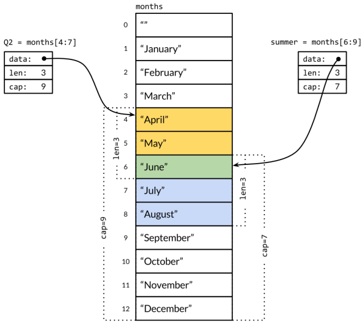

### **Chapter 4. Composite Types**

This chapter discusses composite types: arrays, slices, maps, and structs.

* Arrays and structs are *aggregate* types, whose values are concatenations of other values in memory.
    * Arrays are homogeneous. The elements all have the same type.
    * Structs are heterogeneous.

    Both arrays and structs are fixed size.

* Slices and maps are dynamic data structures that grow as values are added.

### Arrays

An array is a fixed-length sequence of zero or more elements of a particular type.

* Arrays are rarely used directly in Go due to fixed length. Slices are commonly used due to versatililty.
* The built-in function `len` returns the number of elements in the array.

```go
var a [3]int // array of 3 integers
fmt.Println(a[0]) // print the first element
fmt.Println(a[len(a)-1]) // print the last element, a[2]

// Print the indices and elements.
for i, v := range a {
	fmt.Printf("%d %d\n", i, v)
}

// Print the elements only.
for _, v := range a {
	fmt.Printf("%d\n", v)
}
```

By default, the elements of an array are initially set to the [zero value](https://golang.org/ref/spec#The_zero_value) for the element type.

#### Array literals *

An **array literal** can be used to initialize an array with a list of values:

```go
var q [3]int = [3]int{1, 2, 3}
var r [3]int = [3]int{1, 2}
fmt.Println(r[2]) // "0"
```

If an ellipsis "..." appears in place of the length, then the array length is determined by the number of initializers. The definition of `q` in the above example can be simplified to:

```go
q := [...]int{1, 2, 3}
fmt.Printf("%T\n", q) // "[3]int"
```

The size of an array is part of its type. For example, `[3]int` and `[4]int` are different types. The size must be a constant expression, whose value can be computed as the program is being compiled.

```go
q := [3]int{1, 2, 3}
q = [4]int{1, 2, 3, 4} // compile error: cannot assign [4]int to [3]int
```

The literal syntax is similar for arrays, slices, maps, and structs, as discussed later. Besides specifying a list of values in order, but it is also possible to specify a list of index and value pairs, for example:

```go
type Currency int

const (
	USD Currency = iota
	EUR
	GBP
	RMB
)

symbol := [...]string{USD: "$", EUR: "€", GBP: "£", RMB: "¥"}
fmt.Println(RMB, symbol[RMB]) // "3 ¥"
```

Indices can appear in any order and some may be omitted. Unspecified values take on the zero value for the element type. For instance:

```go
r := [...]int{99: -1}
```

This defines an array `r` with 100 elements, all zero except for the last, which has value −1.

#### Comparison of arrays *

If element type is comparable, then the array type is also comparable. We can directly compare two arrays of that type using the `==` operator, which reports whether all corresponding elements are equal. The `!=` operator is its negation.

```go
a := [2]int{1, 2}
b := [...]int{1, 2}
c := [2]int{1, 3}
fmt.Println(a == b, a == c, b == c) // "true false false"
d := [3]int{1, 2}
fmt.Println(a == d) // compile error: cannot compare [2]int == [3]int
```

[p83]

#### Arrays as function parameters *

When a function is called, a copy of each argument value is assigned to the corresponding parameter variable, so the function receives a copy, not the original. This also applies to arrays in Go. This behavior is different from languages that implicitly pass arrays by reference.

Passing large arrays in this way can be inefficient, and any changes that the function makes to array elements affect only the copy, not the original. We can explicitly pass a pointer to an array. For example, the following function `zero` zeroes the contents of a `[32]byte` array:

```go
func zero(ptr *[32]byte) {
	for i := range ptr {
		ptr[i] = 0
	}
}
```

The following function is a different version of `zero` that uses the array literal `[32]byte{}`, each element of which has the zero value (which is zero) for `byte`.

```go
func zero(ptr *[32]byte) {
	*ptr = [32]byte{}
}
```

Passing a pointer to an array is efficient and allows the called function to mutate the caller’s variable. However, arrays are still inherently inflexible because of their fixed size. In the above example:

* The `zero` function will not accept a pointer to a `[16]byte` variable
* There is no way to add or remove array elements.

For these reasons, other than special cases like [SHA256’s fixed-size hash](https://github.com/shichao-an/gopl.io/blob/master/ch4/sha256/main.go), arrays are seldom used as function parameters and instead, slices are used.

### Slices

Slices represent variable-length sequences whose elements all have the same type. A slice type is written `[]T`, where the elements have type `T`. It looks like an array type without a size.

A slice is a lightweight data structure that gives access to a subsequence of its [*underlying array*](https://golang.org/ref/spec#Slice_types).

#### Components of a slice *

A slice has three components:

* **Pointer**: the pointer points to the first element of the array that is reachable through the slice, which is not necessarily the array's first element.
* **Length**: the length is the number of slice elements. It can't exceed the capacity.
* **Capacity**: the capacity is usually the number of elements between the start of the slice and the end of the underlying array.

The built-in functions `len` and `cap` the values of length and capacity respectively.

Multiple slices can share the same underlying array and may refer to overlapping parts of that array.

The following figure shows an array of strings for the months of the year, and two overlapping slices of it. The array is declared as:

```go
months := [...]string{1: "January", /* ... */, 12: "December"}
```

[](figure_4.1.png "Figure 4.1. Two overlapping slices of an array of months.")

The slice operator `s[i:j]`, where 0 ≤ `i` ≤ `j` ≤ `cap(s)`, creates a new slice that refers to elements `i` through `j-1` of the sequence `s`. This sequence `s` may be any of the following:

* An array variable
* A pointer to an array
* Another slice

The resulting slice has `j-i` elements. If `i` is omitted, it's 0, and if `j` is omitted, it's `len(s)`. For example:

* The slice `months[1:13]` refers to the whole range of valid months, as does the slice `months[1:]`.
* The slice `months[:]` refers to the whole array.

Overlapping slices in the figure are defined like this:

```go
Q2 := months[4:7]
summer := months[6:9]
fmt.Println(Q2)     // ["April" "May" "June"]
fmt.Println(summer) // ["June" "July" "August"]
```

The following (inefficient) code is a test for common elements of the two slices, which outputs "June":

```go
for _, s := range summer {
	for _, q := range Q2 {
		if s == q {
			fmt.Printf("%s appears in both\n", s)
		}
	}
}
```

#### Substring operation and slice operator *

The [substring operation](ch3.md#the-substring-operation) on strings is similar to the slice operator on `[]byte` slices in that:

* Both are written `x[m:n]`.
* Both return a subsequence of the original bytes, sharing the underlying representation so that both operations take constant time.

The expression `x[m:n]` yields a string if `x` is a string, or a `[]byte` if `x` is a `[]byte`.

Since a slice contains a pointer to an element of an array, passing a slice to a function permits the function to modify the underlying array elements. In other words, copying a slice creates an *alias* ([Section 2.3.2](ch2.md#pointers)) for the underlying array.

#### Reversing and rotating slices *

The function `reverse` reverses the elements of an `[]int` slice in place, and it may be applied to slices of any length.

<small>[gopl.io/ch4/rev/main.go](https://github.com/shichao-an/gopl.io/blob/master/ch4/rev/main.go)</small>

```go
// reverse reverses a slice of ints in place.
func reverse(s []int) {
	for i, j := 0, len(s)-1; i < j; i, j = i+1, j-1 {
		s[i], s[j] = s[j], s[i]
	}
}
```

To reverse the whole array `a`:

```go
a := [...]int{0, 1, 2, 3, 4, 5}
reverse(a[:])
fmt.Println(a) // "[5 4 3 2 1 0]"
```

A simple way to *rotate* a slice left by *n* elements is to apply the `reverse` function three times: first to the leading n elements, then to the remaining elements, and finally to the whole slice.  (To rotate to the right, make the third call first.)

```go
s := []int{0, 1, 2, 3, 4, 5}
// Rotate s left by two positions.
reverse(s[:2])
reverse(s[2:])
reverse(s)
fmt.Println(s) // "[2 3 4 5 0 1]"
```

In the above two examples, we can see that expression that initializes the slice `s` differs from that for the array `a`. A slice literal looks like an array literal, a sequence of values separated by commas and surrounded by braces, but the size is not given. <u>This implicitly creates an array variable of the right size and yields a slice that points to it.</u> As with [array literals](#array-literals), slice literals may specify the values in order, or give their indices explicitly, or use a mix of the two styles.

#### Comparison of slices *

Unlike arrays, slices are not comparable, so we cannot use `==` to test whether two slices contain the same elements. The standard library provides the highly optimized `bytes.Equal` function for comparing two slices of bytes (`[]byte`).

To compare other types of slice, we must do the comparison ourselves. For example:

```go
func equal(x, y []string) bool {
	if len(x) != len(y) {
		return false
	}
	for i := range x {
	  if x[i] != y[i] {
	  	return false
		}
	}
	return true
}
```

Although this "deep" equality test is natural and no more costly at run time than the `==` operator for arrays of strings, slice comparisons do not work this way. There are two reasons why deep equivalence is problematic:

1. Unlike array elements, the elements of a slice are indirect, making it possible for a slice to contain itself. There is no simple, efficient and obvious way to deal with such cases.
2. Because slice elements are indirect, a fixed slice value may contain different elements at different times as the contents of the underlying array are modified.
    * **Deep equivalence would make slices unsuitable for use as map keys.** Because Go's map type (hash table) makes only shallow copies of its keys, it requires that equality for each key remain the same throughout the lifetime of the map.
    * **Shallow equality test is useful but confusing.** For reference types like pointers and channels, the `==` operator tests reference identity, that is, whether the two entities refer to the same thing. An analogous "shallow" equality test for slices could be useful, and it would solve the problem with maps, but the inconsistent treatment of slices and arrays by the `==` operator would be confusing. <u>The safest choice is to disallow slice comparisons altogether.</u>

The only legal slice comparison is against `nil`:

```go
if summer == nil { /* ... */ }
```

#### The zero value of slices *

The zero value of a slice type is `nil`.

* A nil slice has no underlying array.
* A nil slice has length and capacity zero.

There are also non-nil slices of length and capacity zero, such as `[]int{}` or `make([]int, 3)[3:]`.

As with any type that can have nil values, the nil value of a particular slice type can be written using a conversion expression such as `[]int(nil)`.

```go
var s []int    // len(s) == 0, s == nil
s = nil        // len(s) == 0, s == nil
s = []int(nil) // len(s) == 0, s == nil
s = []int{}    // len(s) == 0, s != nil
```

To test whether a slice is empty, use `len(s) == 0`, not `s == nil`. Other than comparing equal to `nil`, a nil slice behaves like any other zero-length slice (for example, `reverse(nil)` is perfectly safe). <u>Unless clearly documented to the contrary, Go functions should treat all zero-length slices the same way, whether nil or non-nil.</u>

The built-in function `make` creates a slice of a specified element type, length, and capacity. The capacity argument may be omitted, in which case the capacity equals the length.

```go
make([]T, len)
make([]T, len, cap) // same as make([]T, cap)[:len]
```

* In the first form, the slice is a view of the entire array.
* In the second, the slice is a view of only the array's first `len` elements, but its capacity includes the entire array. The additional elements are set aside for future growth.

Behind the scene, `make` creates an unnamed array variable and returns a slice of it; the array is accessible only through the returned slice.

#### The `append` Function

The built-in `append` function appends items to slices:

```go
var runes []rune
for _, r := range "Hello, 世界" {
	runes = append(runes, r)
}
fmt.Printf("%q\n", runes) // "['H' 'e' 'l' 'l' 'o' ',' '' '世' '界']"
```

The loop uses `append` to build the slice of nine runes encoded by the string literal. It is equivalent to using the built-in conversion: `[]rune("Hello, 世界")`.

The following examples discusses how the `append` works, which is crucial to understanding how slices work.

In the code below, `appendInt` is a function specialized for `[]int` slices:

<small>[gopl.io/ch4/append/main.go](https://github.com/shichao-an/gopl.io/blob/master/ch4/append/main.go)</small>

```go
func appendInt(x []int, y int) []int {
	var z []int
	zlen := len(x) + 1
	if zlen <= cap(x) {
		// There is room to grow.  Extend the slice.
		z = x[:zlen]
	} else {
		// There is insufficient space.  Allocate a new array.
		// Grow by doubling, for amortized linear complexity.
		zcap := zlen
		if zcap < 2*len(x) {
			zcap = 2 * len(x)
		}
		z = make([]int, zlen, zcap)
		copy(z, x) // a built-in function; see text
	}
	z[len(x)] = y
	return z
}
```

Each call to `appendInt` checks whether the slice has sufficient capacity to hold the new elements in the existing array:

* If there is sufficient capacity, `appendInt` extends the slice by defining a larger slice (still within the original array), copies the element `y` into the new space, and returns the slice. The input `x` and the result `z` share the same underlying array.
* If there is insufficient space for growth, `appendInt` allocates a new array big enough to hold the result, copy the values from `x` into it, then append the new element `y`. The result `z` now refers to a different underlying array from `x`.

##### **The `copy` function** *

The built-in function `copy` copies elements from one slice to another of the same type. Its first argument is the destination and its second is the source, resembling the order of operands in an assignment like `dst = src`. The slices may refer to the same underlying array, or they may even overlap.

<u>`copy` actually copies `k` elements, where `k` is smaller of the two slice lengths, and returns `k`. There is no danger of running off the end or overwriting something out of range.</u> [p89]

For efficiency, expanding the array by doubling its size at each expansion avoids an excessive number of allocations and ensures that appending a single element takes constant time on average. The following program demonstrates the effect:

```go
func main() {
	var x, y []int
	for i := 0; i < 10; i++ {
		y = appendInt(x, i)
		fmt.Printf("%d cap=%d\t%v\n", i, cap(y), y)
		x = y
	}
}
```

Each change in capacity indicates an allocation and a copy:

```text
0 cap=1   [0]
1 cap=2   [0 1]
2 cap=4   [0 1 2]
3 cap=4   [0 1 2 3]
4 cap=8   [0 1 2 3 4]
5 cap=8   [0 1 2 3 4 5]
6 cap=8   [0 1 2 3 4 5 6]
7 cap=8   [0 1 2 3 4 5 6 7]
8 cap=16  [0 1 2 3 4 5 6 7 8]
9 cap=16  [0 1 2 3 4 5 6 7 8 9]
```

The following two figures show what happen at `i=3` iteration: appending with room to grow. [p89-90]

[](figure_4.2.png "Figure 4.2. Appending with room to grow.")

The following two figures show what happen at `i=4` iteration: appending without room to grow.  [p90]

[](figure_4.3.png "Figure 4.3. Appending without room to grow.")

##### **Updating the slice variable when calling `append`** *

The built-in `append` function uses a more sophisticated growth strategy than `appendInt`. Usually we don't know whether a given call to `append` will cause a reallocation, so we can't assume that the original slice refers to the same array as the resulting slice or not. This means we must not assume that operations on elements of the old slice will (or will not) be reflected in the new slice. As a result, <u>it's usual to assign the result of a call to `append` to the same slice variable whose value we passed to `append`:</u>

```go
runes = append(runes, r)
```

<u>Updating the slice variable is required not just when calling `append`, but for any function that may change the length or capacity of a slice or make it refer to a different underlying array.</u> To use slices correctly, remember that although the elements of the underlying array are indirect, the slice's pointer, length, and capacity are not. To update them requires an assignment like the one above. Slices are not "pure" reference types but resemble an aggregate type such as this struct:

```go
type IntSlice struct {
	ptr *int
	len, cap int
}
```

##### **Variadic functions** *

The `appendInt` function adds a single element to a slice, but the built-in `append` is able to add more than one new element, or a whole slice of them.

```go
var x []int
x = append(x, 1)
x = append(x, 2, 3)
x = append(x, 4, 5, 6)
x = append(x, x...) // append the slice x
fmt.Println(x)      // "[1 2 3 4 5 6 1 2 3 4 5 6]"
```

The following modification of `append` matches the behavior of the built-in `append`. The ellipsis "..." in the declaration of `appendInt` makes the function [**variadic**](https://gobyexample.com/variadic-functions): it accepts any number of final arguments. The corresponding ellipsis in the call above to `append` shows how to supply a list of arguments from a slice. Variadic functions are detailed in [Section 5.7](ch5.md#variadic-functions).

```go
func appendInt(x []int, y ...int) []int {
	var z []int
	zlen := len(x) + len(y)
	// ...expand z to at least zlen...
	copy(z[len(x):], y)
	return z
}
```

#### In-Place Slice Techniques

This section discusses examples of functions that modify the elements of a slice in place, like `rotate` and `reverse`.

Given a list of strings, the `nonempty` function returns the non-empty ones:

<small>[gopl.io/ch4/nonempty/main.go](https://github.com/shichao-an/gopl.io/blob/master/ch4/nonempty/main.go)</small>

```go
// Nonempty is an example of an in-place slice algorithm.
package main

import "fmt"

// nonempty returns a slice holding only the non-empty strings.
// The underlying array is modified during the call.
func nonempty(strings []string) []string {
	i := 0
	for _, s := range strings {
		if s != "" {
			strings[i] = s
			i++
		}
	}
	return strings[:i]
}
```

The subtle part is that the input slice and the output slice share the same underlying array.  This avoids the need to allocate another array, though the contents of data are partly overwritten, as shown in the second `Printf` statement below:

```go
data := []string{"one", "", "three"}
fmt.Printf("%q\n", nonempty(data)) // `["one" "three"]`
fmt.Printf("%q\n", data)           // `["one" "three" "three"]`
```

The `nonempty` function can also be written using `append`:

```go
func nonempty2(strings []string) []string {
	out := strings[:0] // zero-length slice of original
	for _, s := range strings {
		if s != "" {
			out = append(out, s)
		}
	}
	return out
}
```

The above two variants, which reuse an array, requires that at most one output value is produced for each input value, which is true of many algorithms that filter out elements of a sequence or combine adjacent ones. Such usage is the exception, not the rule, but it can be clear, efficient, and useful on occasion.

#### Implementing a stack using a slice *

A slice can be used to implement a stack. Given an initially empty slice `stack`, we can push a new value onto the end of the slice with `append`:

```go
stack = append(stack, v) // push v
```

The top of the stack is the last element:

```go
top := stack[len(stack)-1] // top of stack
```

Shrink the stack by popping that element:

```go
stack = stack[:len(stack)-1] // pop
```

#### Removing an element from a slice *

To remove an element from the middle of a slice, preserving the order of the remaining elements, use `copy` to slide the higher-numbered elements down by one to fill the gap:

```go
func remove(slice []int, i int) []int {
  copy(slice[i:], slice[i+1:])
	return slice[:len(slice)-1]
}

func main() {
	s := []int{5, 6, 7, 8, 9}
	fmt.Println(remove(s, 2)) // "[5 6 8 9]"
}
```

If we don't need to preserve the order, just move the last element into the gap:

```go
func remove(slice []int, i int) []int {
	slice[i] = slice[len(slice)-1]
	return slice[:len(slice)-1]
}

func main() {
	s := []int{5, 6, 7, 8, 9}
	fmt.Println(remove(s, 2)) // "[5 6 9 8]
}
```

### Maps
