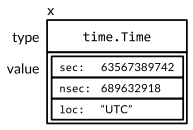

### **Chapter 7. Interfaces**

Interface types express generalizations or abstractions about the behaviors of other types. By generalizing, interfaces facilitate more flexible and adaptable functions because they are not tied to the details of one particular implementation.

Different from the notion of interfaces in other object-oriented languages, Go's interfaces is distinctive in that they are satisfied implicitly. In other words, there's no need to declare all the interfaces that a given concrete type satisfies; simply possessing the necessary methods is enough. With this design, you are able to create new interfaces that are satisfied by existing concrete types without changing the existing types, which is particularly useful for types defined in packages that you don't control.

This chapter discusses:

* Basic mechanics of interface types and their values
* Several important interfaces from the standard library
* Type assertions and type switches

### Interfaces as Contracts

#### Concrete type and interface type *

All the types discussed so far are [**concrete types**](https://en.wikipedia.org/wiki/Class_(computer_programming)#Abstract_and_Concrete). A concrete type specifies the exact representation of its values and exposes the intrinsic operations of that representation, such as arithmetic for numbers, or indexing, `append`, and `range` for slices. A concrete type may also provide additional behaviors through its methods. When you have a value of a concrete type, you know exactly what it is and what you can do with it.

There is another kind of type in Go called an **interface type**. An interface is an [**abstract type**](https://en.wikipedia.org/wiki/Abstract_type). It doesn't expose the representation or internal structure of its values, or the set of basic operations they support; it reveals only some of their methods. When you have a value of an interface type, you know nothing about what it is; you know only what it can do, or more precisely, what behaviors are provided by its methods.

#### The `io.Writer` interface *

This book has used two similar functions for string formatting:

* `fmt.Printf`, which writes the result to the standard output (a file)
* `fmt.Sprintf`, which returns the result as a string

Thanks to interfaces, both of these functions are in effect wrappers around a third function, `fmt.Fprintf`, which is agnostic about what happens to the result it computes:

```go
package fmt

func Fprintf(w io.Writer, format string, args ...interface{}) (int, error)

func Printf(format string, args ...interface{}) (int, error) {
	return Fprintf(os.Stdout, format, args...)
}

func Sprintf(format string, args ...interface{}) string {
	var buf bytes.Buffer
	Fprintf(&buf, format, args...)
	return buf.String()
}
```

The `F` prefix of `Fprintf` stands for *file* and indicates that the formatted output should be written to the file provided as the first argument.

* In the `Printf` case, the argument, `os.Stdout`, is an [`*os.File`](https://golang.org/pkg/os/#File).
* In the `Sprintf` case, the argument is not a file but superficially resembles one: `&buf` is a pointer to a memory buffer to which bytes can be written.

The first parameter of `Fprintf` is not a file either. It's an [`io.Writer`](https://golang.org/pkg/io/#Writer), which is an interface type with the following declaration:

<small>[go/src/io/io.go](https://github.com/golang/go/blob/master/src/io/io.go)</small>

```go
package io

// Writer is the interface that wraps the basic Write method.
//
// Write writes len(p) bytes from p to the underlying data stream.
// It returns the number of bytes written from p (0 <= n <= len(p))
// and any error encountered that caused the write to stop early.
// Write must return a non-nil error if it returns n < len(p).
// Write must not modify the slice data, even temporarily.
//
// Implementations must not retain p.
type Writer interface {
	Write(p []byte) (n int, err error)
}
```

The `io.Writer` interface defines the contract between `Fprintf` and its callers.

* The contract requires that the caller provide a value of a concrete type like `*os.File` or `*bytes.Buffer` that has a method called `Write` with the appropriate signature and behavior.
* The contract guarantees that `Fprintf` will do its job given any value that satisfies the `io.Writer` interface.
* `Fprintf` may not assume that it is writing to a file or to memory, only that it can call `Write`.

Because `fmt.Fprintf` assumes nothing about the representation of the value and relies only on the behaviors guaranteed by the `io.Writer` contract, we can safely pass a value of any concrete type that satisfies `io.Writer` as the first argument to `fmt.Fprintf`. This freedom to substitute one type for another that satisfies the same interface is called *substitutability*, and is a hallmark of object-oriented programming.

The following example uses a new type. The `Write` method of the `*ByteCounter` type below merely counts the bytes written to it before discarding them. (The conversion is required to make the types of `len(p)` and `*c` match in the `+=` assignment statement.)

<small>[gopl.io/ch7/bytecounter/main.go](https://github.com/shichao-an/gopl.io/blob/master/ch7/bytecounter/main.go)</small>

```go
type ByteCounter int

func (c *ByteCounter) Write(p []byte) (int, error) {
	*c += ByteCounter(len(p)) // convert int to ByteCounter
	return len(p), nil
}
```

Since `*ByteCounter` satisfies the `io.Writer` contract, we can pass it to `Fprintf`; the `ByteCounter` correctly accumulates the length of the result.

```go
var c ByteCounter
c.Write([]byte("hello"))
fmt.Println(c) // "5", = len("hello")

c = 0 // reset the counter
var name = "Dolly"
fmt.Fprintf(&c, "hello, %s", name)
fmt.Println(c) // "12", = len("hello, Dolly")
```

#### The `fmt.Stringer` interface *

Besides `io.Writer`, `fmt.Stringer` is another interface of great importance to the `fmt` package. `Fprintf` and `Fprintln` provide a way for types to control how their values are printed. For example:

* In [Section 2.5](ch2.md#type-declarations), we defined a `String` method for the `Celsius` type so that temperatures would print as "`100°C`.
* In [Section 6.5](ch6.md#example-bit-vector-type), we equipped `*IntSet` with a `String` method so that sets would be rendered using traditional set notation like "`{1 2 3}`".

Declaring a `String` method makes a type satisfy `fmt.Stringer`, which is one of the most widely used interfaces of all:

<small>[go/src/fmt/print.go](https://github.com/golang/go/blob/master/src/fmt/print.go)</small>

```go
package fmt

// The String method is used to print values passed
// as an operand to any format that accepts a string
// or to an unformatted printer such as Print.
type Stringer interface {
	String() string
}
```

[Section 7.10](#type-assertions) will explain how the `fmt` package discovers which values satisfy this interface.

### Interface Types

An interface type specifies a set of methods that a concrete type must possess to be considered an instance of that interface.

The `io.Writer` type is one of the most widely used interfaces because it provides an abstraction of all the types to which bytes can be written, such as files, memory buffers, network connections, HTTP clients, archivers and hashers. The `io` package defines many other useful interfaces. A `Reader` represents any type from which you can read bytes, and a `Closer` is any value that you can close, such as a file or a network connection. (Notice the naming convention for many of Go's single-method interfaces.)

```go
package io

type Reader interface {
	Read(p []byte) (n int, err error)
}

type Closer interface {
	Close() error
}
```

The following are examples of new interface types as combinations of existing ones:

```go
type ReadWriter interface {
	Reader
	Writer
}

type ReadWriteCloser interface {
	Reader
	Writer
	Closer
}
```

The syntax used above, which resembles [struct embedding](ch4#struct-embedding-and-anonymous-fields), enables us to name another interface as a shorthand for writing out all of its methods. This is called *embedding* an interface. We could have written `io.ReadWriter` without embedding like this:

```go
type ReadWriter interface {
	Read(p []byte) (n int, err error)
	Write(p []byte) (n int, err error)
}
```

We can even use a mixture of the two styles:

```go
type ReadWriter interface {
	Read(p []byte) (n int, err error)
	Writer
}
```

All three declarations have the same effect. The order in which the methods appear is immaterial. All that matters is the set of methods.

### Interface Satisfaction

A type *satisfies* an interface if it possesses all the methods the interface requires. For example:

* An `*os.File` satisfies `io.Reader`, `Writer`, `Closer`, and `ReadWriter`.
* A `*bytes.Buffer` satisfies `Reader`, `Writer`, and `ReadWriter`, but does not satisfy `Closer` because it does not have a `Close` method.

As a shorthand, Go programmers often say that a concrete type "is a" particular interface type, meaning that it satisfies the interface. For example:

* A `*bytes.Buffer` is an `io.Writer`.
* An `*os.File` is an `io.ReadWriter`.

The assignability rule ([Section 2.4.2](ch2.md##assignability)) for interfaces is very simple: an expression may be assigned to an interface only if its type satisfies the interface. For example:

```go
var w io.Writer
w = os.Stdout           // OK: *os.File has Write method
w = new(bytes.Buffer)   // OK: *bytes.Buffer has Write method
w = time.Second         // compile error: time.Duration lacks Write method

var rwc io.ReadWriteCloser
rwc = os.Stdout         // OK: *os.File has Read, Write, Close methods
rwc = new(bytes.Buffer) // compile error: *bytes.Buffer lacks Close method
```

This rule applies even when the right-hand side is itself an interface:

```go
w = rwc     // OK: io.ReadWriteCloser has Write method
rwc = w     // compile error: io.Writer lacks Close method
```

We should explain one subtlety in what it means for a type to have a method. Recall from [Section 6.2](ch6.md#methods-with-a-pointer-receiver) that for each named concrete type `T`, some of its methods have a receiver of type `T` itself whereas others require a `*T` pointer. Recall also that it is legal to call a `*T` method on an argument of type `T` as long as the argument is a variable; the compiler implicitly takes its address. However, this is mere syntactic sugar: a value of type `T` does not possess all the methods that a `*T` pointer does; as a result, `T` might satisfy fewer interfaces.

For example, the `String` method of the `IntSet` type from [Section 6.5](ch6.md#example-bit-vector-type) requires a pointer receiver, so we cannot call that method on a non-addressable `IntSet` value:

```go
type IntSet struct { /* ... */ }
func (*IntSet) String() string
var _ = IntSet{}.String() // compile error: String requires *IntSet receiver
```

But we can call it on an `IntSet` variable:

```go
var s IntSet
var _ = s.String() // OK: s is a variable and &s has a String method
```

However, since only `*IntSet` has a `String` method, only `*IntSet` satisfies the `fmt.Stringer` interface:

```go
var _ fmt.Stringer = &s // OK
var _ fmt.Stringer = s  // compile error: IntSet lacks String method
```

[Section 12.8](ch12.md#displaying-the-methods-of-a-type) includes a program that prints the methods of an arbitrary value, and the `godoc -analysis=type` tool ([Section 10.7.4](ch10.md#documenting-packages)) displays the methods of each type and the relationship between interfaces and concrete types.

An interface wraps and conceals the concrete type and value that it holds. <u>Only the methods revealed by the interface type may be called, even if the concrete type has others</u>:

```go
os.Stdout.Write([]byte("hello")) // OK: *os.File has Write method
os.Stdout.Close()                // OK: *os.File has Close method

var w io.Writer
w = os.Stdout
w.Write([]byte("hello")) // OK: io.Writer has Write method
w.Close()                // compile error: io.Writer lacks Close method
```

#### Empty interface: `interface{}` *

An interface with more methods, such as `io.ReadWriter`, tells us more about the values it contains, and places greater demands on the types that implement it, than does an interface with fewer methods such as `io.Reader`. Similarly, the type `interface{}`, which has no methods at all, tell us about nothing about the concrete types that satisfy it. This may seem useless, but in fact the type `interface{}`, which is called the **empty interface** type, is indispensable. Because the empty interface type places no demands on the types that satisfy it, we can assign any value to the empty interface.

```go
var any interface{}
any = true
any = 12.34
any = "hello"
any = map[string]int{"one": 1}
any = new(bytes.Buffer)
```

The empty interface type has been used in the very first example in this book, because it is what allows functions like `fmt.Println`, or `errorf` in [Section 5.7](ch5.md#anonymous-functions), to accept arguments of any type.

Having created an `interface{}` value containing a boolean, float, string, map, pointer, or any other type, we can do nothing directly to the value it holds since the interface has no methods. We need a way to get the value back out again, which can be done using a type assertion, discussed in [Section 7.10](#type-assertions).

Since interface satisfaction depends only on the methods of the two types involved, there is no need to declare the relationship between a concrete type and the interfaces it satisfies. However, it is occasionally useful to document and assert the relationship when it is intended but not otherwise enforced by the program. The declaration below asserts at compile time that a value of type `*bytes.Buffer` satisfies `io.Writer`:

```go
// *bytes.Buffer must satisfy io.Writer
var w io.Writer = new(bytes.Buffer)
```

We needn't allocate a new variable since any value of type `*bytes.Buffer` will do, even `nil`, which we write as `(*bytes.Buffer)(nil)` using an explicit conversion. Since we never intend to refer to `w`, we can replace it with the blank identifier, which makes more frugal variant:

```go
// *bytes.Buffer must satisfy io.Writer
var _ io.Writer = (*bytes.Buffer)(nil)
```

Non-empty interface types such as `io.Writer` are most often satisfied by a pointer type, particularly when one or more of the interface methods implies some kind of mutation to the receiver, as the `Write` method does. A pointer to a struct is an especially common method-bearing type.

Pointer types are not the only types that satisfy interfaces, and even interfaces with mutator methods may be satisfied by other reference types. For example:

* Slice types with methods (`geometry.Path`, [Section 6.1](ch6.md#method-declarations))
* Map types with methods (`url.Values`, [Section 6.2.1](ch6.md#nil-is-a-valid-receiver-value)),
* Function type with methods (`http.HandlerFunc`, [Section 7.7](#the-httphandler-interface)).
* Even basic types may satisfy interfaces: in [Section 7.4](#parsing-flags-with-flagvalue), `time.Duration` satisfies `fmt.Stringer`.

A concrete type may satisfy many unrelated interfaces. For example, a program that organizes or sells digitized cultural artifacts might define the following set of concrete types:

```text
Album
Book
Movie
Magazine
Podcast
TVEpisode
Track
```

Each abstraction of interest can be expressed as an interface. Some properties are common to all artifacts, such as a title, a creation date, and a list of creators (authors or artists).

```go
type Artifact interface {
	Title() string
	Creators() []string
	Created() time.Time
}
```

Other properties are restricted to certain types of artifacts. Properties of the printed word are relevant only to books and magazines, whereas only movies and TV episodes have a screen resolution.

```go
type Text interface {
	Pages() int
	Words() int
	PageSize() int
}

type Audio interface {
	Stream() (io.ReadCloser, error)
	RunningTime() time.Duration
	Format() string // e.g., "MP3", "WAV"
}

type Video interface {
  Stream() (io.ReadCloser, error)
  RunningTime() time.Duration
  Format() string // e.g., "MP4", "WMV"
  Resolution() (x, y int)
}
```

These interfaces are not the only useful way to group related concrete types together and express the facets they share in common. We may discover other groupings later. For example, if we find we need to handle `Audio` and `Video` items in the same way, we can define a `Streamer` interface to represent their common aspects without changing any existing type declarations.

```go
type Streamer interface {
	Stream() (io.ReadCloser, error)
	RunningTime() time.Duration
	Format() string
}
```

Each grouping of concrete types based on their shared behaviors can be expressed as an interface type. Unlike class-based languages, in which the set of interfaces satisfied by a class is explicit, in Go we can define new abstractions or groupings of interest when we need them, without modifying the declaration of the concrete type. This is particularly useful when the concrete type comes from a package written by a different author. Of course, there do need to be underlying commonalities in the concrete types.

### Parsing Flags with `flag.Value`

This section discusses another standard interface, `flag.Value`, which enables us to define new notations for command-line flags. For example, the following program sleeps for a specified period of time:

<small>[gopl.io/ch7/sleep/sleep.go](https://github.com/shichao-an/gopl.io/blob/master/ch7/sleep/sleep.go)</small>

```go
var period = flag.Duration("period", 1*time.Second, "sleep period")

func main() {
	flag.Parse()
	fmt.Printf("Sleeping for %v...", *period)
	time.Sleep(*period)
	fmt.Println()
}
```

Before it goes to sleep it prints the time period. The `fmt` package calls the `time.Duration`'s `String` method to print the period in a user-friendly notation instead of [a number of nanoseconds](ch6.md#other-aspects-of-encapsulation):

```shell-session
$ go build gopl.io/ch7/sleep
$ ./sleep
Sleeping for 1s...
```

* By default, the sleep period is one second, but it can be controlled through the `-period` command-line flag.
* The `flag.Duratio` function creates a flag variable of type `time.Duration` and allows the user to specify the duration in a variety of user-friendly formats, including the same notation printed by the `String` method. This symmetry of design leads to a nice user interface.

```shell-session
$ ./sleep -period 50ms
Sleeping for 50ms...
$ ./sleep -period 2m30s
Sleeping for 2m30s...
$ ./sleep -period 1.5h
Sleeping for 1h30m0s...
$ ./sleep -period "1 day"
invalid value "1 day" for flag -period: time: invalid duration 1 day
```

It's easy to define new flag notations for our own data types. We need only define a type that satisfies the `flag.Value` interface, whose declaration is:

```go
package flag

// Value is the interface to the value stored in a flag.
type Value interface {
	String() string
	Set(string) error
}
```

* The `String` method formats the flags' value for use in command-line help messages; thus every `flag.Value` is also a `fmt.Stringer`.
* The `Set` method parses its string argument and updates the flag value. In effect, the `Set` method is the inverse of the `String` method, and it is good practice for them to use the same notation.

The following example defines a `celsiusFlag` type that allows a temperature to be specified in Celsius, or in Fahrenheit with an appropriate conversion. Notice that `celsiusFlag` embeds a `Celsius` ([Section 2.5](ch2.md#type-declarations)), thereby getting a `String` method for free. To satisfy `flag.Value`, we need only declare the Set method:

<small>[gopl.io/ch7/tempconv/tempconv.go](https://github.com/shichao-an/gopl.io/blob/master/ch7/tempconv/tempconv.go)</small>

```go
type celsiusFlag struct{ Celsius }

func (f *celsiusFlag) Set(s string) error {
	var unit string
	var value float64
	fmt.Sscanf(s, "%f%s", &value, &unit) // no error check needed
	switch unit {
	case "C", "°C":
		f.Celsius = Celsius(value)
		return nil
	case "F", "°F":
		f.Celsius = FToC(Fahrenheit(value))
		return nil
	}
	return fmt.Errorf("invalid temperature %q", s)
}
```

The call to [`fmt.Sscanf`](https://golang.org/pkg/fmt/#Sscanf) parses a floating-point number (`value`) and a string (`unit`) from the input `s`. Although one must usually check `Sscanf`'s error result, in this case we don't need to because if there was a problem, no switch case will match.

The `CelsiusFlag` function below wraps it all up.

```go
// CelsiusFlag defines a Celsius flag with the specified name,
// default value, and usage, and returns the address of the flag variable.
// The flag argument must have a quantity and a unit, e.g., "100C".
func CelsiusFlag(name string, value Celsius, usage string) *Celsius {
	f := celsiusFlag{value}
	flag.CommandLine.Var(&f, name, usage)
	return &f.Celsius
}
```

* To the caller, it returns a pointer to the `Celsius` field embedded within the `celsiusFlag` variable `f`. The `Celsius` field is the variable that will be updated by the `Set` method during flags processing.
* The call to `Var` adds the flag to the application's set of command-line flags, the global variable `flag.CommandLine`. Programs with complex command-line interfaces may have several variables of this type.
* <u>The call to `Var` assigns a `*celsiusFlag` argument to a `flag.Value` parameter, causing the compiler to check that `*celsiusFlag` has the necessary methods.</u> (See [Section 7.3](#interface-satisfaction))

The following program uses `CelsiusFlag`:

<small>[gopl.io/ch7/tempflag/tempflag.go](https://github.com/shichao-an/gopl.io/blob/master/ch7/tempflag/tempflag.go)</small>

```
var temp = tempconv.CelsiusFlag("temp", 20.0, "the temperature")

func main() {
	flag.Parse()
	fmt.Println(*temp)
}
```

Run this program:

```shell-session
$ go build gopl.io/ch7/tempflag
$ ./tempflag
20°C
$ ./tempflag -temp -18C
-18°C
$ ./tempflag -temp 212°F
100°C
$ ./tempflag -temp 273.15K
invalid value "273.15K" for flag -temp: invalid temperature "273.15K"
Usage of ./tempflag:
-temp value
the temperature (default 20°C)
$ ./tempflag -help
Usage of ./tempflag:
-temp value
the temperature (default 20°C)
```

### Interface Values

Conceptually, an **interface value** (a value of an interface type) has two components:

* A concrete type, called the interface's *dynamic type*
* A value of that type, called the interface's *dynamic value*

For a statically typed language like Go, types are a compile-time concept, so a type is not a value. In our conceptual model, a set of values called *type descriptors* provide information about each type, such as its name and methods. In an interface value, the type component is represented by the appropriate type descriptor.

In the four statements below, the variable `w` takes on three different values. (The initial and final values are the same.)

```go
var w io.Writer
w = os.Stdout
w = new(bytes.Buffer)
w = nil
```

The first statement declares `w`:

```go
var w io.Writer
```

In Go, variables are always initialized to a well-defined value, and interfaces are no exception.  The zero value for an interface has both its type and value components set to `nil` (see the figure below).

[](figure_7.1.png "Figure 7.1. A nil interface value.")

An interface value is described as nil or non-nil based on its dynamic type, so this is a nil interface value. You can test whether an interface value is nil using `w == nil` or `w != nil`. Calling any method of a nil interface value causes a panic:

```go
w.Write([]byte("hello")) // panic: nil pointer dereference
```

The second statement assigns a value of type `*os.File` to `w`:

```go
w = os.Stdout
```

This assignment involves an implicit conversion from a concrete type to an interface type, and is equivalent to the explicit conversion `io.Writer(os.Stdout)`. Such conversion, whether explicit or implicit, captures the type and the value of its operand. The interface value's dynamic type is set to the type descriptor for the pointer type `*os.File`, and its dynamic value holds a copy of `os.Stdout`, which is a pointer to the `os.File` variable representing the standard output of the process (see the figure below).

[](figure_7.2.png "Figure 7.2. An interface value containing an *os.File pointer.")

Calling the `Write` method on an interface value containing an `*os.File` pointer causes the `(*os.File).Write` method to be called, which prints "hello".

```go
w.Write([]byte("hello")) // "hello"
```

In general, we cannot know at compile time what the dynamic type of an interface value will be, so a call through an interface must use [*dynamic dispatch*](https://en.wikipedia.org/wiki/Dynamic_dispatch). Instead of a direct call, the compiler must generate code to obtain the address of the method named `Write` from the type descriptor, then make an indirect call to that address. The receiver argument for the call is a copy of the interface's dynamic value,` os.Stdout`. The effect is as if we had made this call directly:

```go
os.Stdout.Write([]byte("hello")) // "hello"
```

The third statement assigns a value of type `*bytes.Buffer` to the interface value:

```go
w = new(bytes.Buffer)
```

The dynamic type is now `*bytes.Buffer` and the dynamic value is a pointer to the newly allocated buffer (see figure below).

[](figure_7.3.png "Figure 7.3. An interface value containing a *bytes.Buffer pointer.")

A call to the `Write` method uses the same mechanism as before:

```go
w.Write([]byte("hello")) // writes "hello" to the bytes.Buffer
```

This time, the type descriptor is `*bytes.Buffer`, so the `(*bytes.Buffer).Write` method is called, with the address of the buffer as the value of the receiver parameter. The call appends "`hello`" to the buffer.

Finally, the fourth statement assigns `nil` to the interface value:

```go
w = nil
```

This resets both its components to `nil`, restoring `w` to the same state as when it was declared, as shown in [Figure 7.1](figure_7.1.png).

An interface value can hold arbitrarily large dynamic values. For example, the `time.Time`
type is a struct type with several unexported fields.

```go
var x interface{} = time.Now()
```

This interface value is like the following figure:

[](figure_7.4.png "Figure 7.4. An interface value holding a time.Time struct.")

Conceptually, the dynamic value always fits inside the interface value, no matter how large its type. Note that this is only a conceptual model; a realistic implementation is quite different.

Interface values may be compared using `==` and `!=`. Two interface values are equal if either of the following occurs:

* Both of them are nil.
* Their dynamic types are identical and their dynamic values are equal according to the usual behavior of `==` for that type.

Because interface values are comparable, they may be used as the keys of a map or as the operand of a switch statement. However, if two interface values are compared and have the same dynamic type, but that type is not comparable (e.g. slice), then the comparison fails with a panic:

```go
var x interface{} = []int{1, 2, 3}
fmt.Println(x == x) // panic: comparing uncomparable type []int
```

Therefore, interface types are unusual: interface values are comparable, but may panic, while other types are either safely comparable or not comparable at all:

* Safely comparable, such as basic types and pointers
* Not comparable, such as slices, maps, and functions

When comparing interface values or aggregate types that contain interface values, we must be aware of the potential for a panic. A similar risk exists when using interfaces as map keys or switch operands. <u>Only compare interface values if you are certain that they contain dynamic values of comparable types.</u>

When handling errors, or during debugging, it is often helpful to report the dynamic type of an interface value, using the `fmt` package's `%T` verb:

```go
var w io.Writer
fmt.Printf("%T\n", w) // "<nil>"

w = os.Stdout
fmt.Printf("%T\n", w) // "*os.File"

w = new(bytes.Buffer)
fmt.Printf("%T\n", w) // "*bytes.Buffer"
```

Internally, `fmt` uses reflection ([Chapter 12](ch12.md)) to obtain the name of the interface's dynamic type.

#### Caveat: An Interface Containing a Nil Pointer Is Non-Nil

A nil interface value, which contains no value at all, is not the same as an interface value containing a pointer that happens to be nil.

In the program below, when `debug` is set to `true`, the function collects the output of the function `f` in a `bytes.Buffer`.

```go
const debug = true

func main() {
	var buf *bytes.Buffer
	if debug {
		buf = new(bytes.Buffer) // enable collection of output
	}
	f(buf) // NOTE: subtly incorrect!
	if debug {
		// ...use buf...
	}
}

// If out is non-nil, output will be written to it.
func f(out io.Writer) {
	// ...do something...
	if out != nil {
		out.Write([]byte("done!\n"))
	}
}
```

We might expect that changing `debug` to `false` would disable the collection of the output, but in fact it causes the program to panic during the `out.Write` call:

```go
if out != nil {
	out.Write([]byte("done!\n")) // panic: nil pointer dereference
}
```

When `main` calls `f`, it assigns a nil pointer of type `*bytes.Buffer` to the `out` parameter, so the dynamic value of `out` is `nil`. However, its dynamic type is `*bytes.Buffer`, meaning that `out` is a non-nil interface containing a nil pointer value (see figure below), so the defensive check `out != nil` is still true.

[](figure_7.5.png "Figure 7.5. A non-nil interface containing a nil pointer.")

The dynamic dispatch mechanism determines that `(*bytes.Buffer).Write` must be called but this time with a receiver value that is nil. For some types, such as `*os.File`, nil is a valid receiver ([Section 6.2.1](ch6.md#nil-is-a-valid-receiver-value)), but `*bytes.Buffer` is not among them. The method is called, but it panics as it tries to access the buffer.

The problem is that although a nil `*bytes.Buffer` pointer has the methods needed to satisfy the interface, it doesn't satisfy the *behavioral* requirements of the interface. In particular, the call violates the implicit precondition of `(*bytes.Buffer).Write` that its receiver is not nil, so assigning the nil pointer to the interface was a mistake. The solution is to change the type of `buf` in `main` to `io.Writer`, thereby avoiding the assignment of the dysfunctional value to the interface in the first place:

```go
var buf io.Writer
if debug {
	buf = new(bytes.Buffer) // enable collection of output
}
f(buf) // OK
```

### Sorting with `sort.Interface`

Sorting is a frequently used operation in many programs. [p186]

In many languages, the sorting algorithm is associated with the sequence data type, while the ordering function is associated with the type of the elements.

In Go, the [`sort`](https://golang.org/pkg/sort/) package provides in-place sorting of any sequence according to any ordering function. However, its design is rather unusual:

* `sort.Sort` function assumes nothing about the representation of either the sequence or its elements. Instead, it uses an interface, `sort.Interface`, to specify the contract between the generic sort algorithm and each sequence type that may be sorted.
* An implementation of this interface determines both the concrete representation of the sequence, which is often a slice, and the desired ordering of its elements.

An in-place sort algorithm needs three things:

* The length of the sequence
* A means of comparing two elements
* A way to swap two elements

They are the three methods of `sort.Interface`:

```go
package sort

type Interface interface {
	Len() int
	Less(i, j int) bool // i, j are indices of sequence elements
	Swap(i, j int)
}
```

To sort any sequence, we need to define a type that implements these three methods, then apply `sort.Sort` to an instance of that type. For example, consider sorting a slice of strings. The new type `StringSlice` and its `Len`, `Less`, and `Swap` methods are shown below:

```go
type StringSlice []string
func (p StringSlice) Len() int           { return len(p) }
func (p StringSlice) Less(i, j int) bool { return p[i] < p[j] }
func (p StringSlice) Swap(i, j int)      { p[i], p[j] = p[j], p[i] }
```

Now we can sort a slice of strings, `names`, by converting the slice to a `StringSlice` like this:

```go
sort.Sort(StringSlice(names))
```

The conversion yields a slice value with the same length, capacity, and underlying array as `names` but with a type that has the three methods required for sorting.

Sorting a slice of strings is so common that the sort package provides the `StringSlice` type and a function called `Strings`. The call above can be simplified as:

```go
sort.Strings(names)
```

This technique can be easily adapted to other sort orders, for instance, to ignore capitalization or special characters. For more complicated sorting, we use the same idea, but with more complicated data structures or more complicated implementations of the `sort.Interface` methods.

#### Example: sorting a playlist *

The following example is a music playlist, displayed as a table. Each track is a single row, and each column is an attribute of that track. The playlist can be sorted by any attribute in the columns.

The variable `tracks` below contains a playlist. Each element is indirect, a pointer to a `Track`. Although the code below would work if we stored the `Track`s directly, the `sort` function will swap many pairs of elements, so it will run faster if each element is a pointer, which is a single machine word, instead of an entire `Track`.

<small>[gopl.io/ch7/sorting/main.go](https://github.com/shichao-an/gopl.io/blob/master/ch7/sorting/main.go)</small>

```go
type Track struct {
	Title  string
	Artist string
	Album  string
	Year   int
	Length time.Duration
}

var tracks = []*Track{
	{"Go", "Delilah", "From the Roots Up", 2012, length("3m38s")},
	{"Go", "Moby", "Moby", 1992, length("3m37s")},
	{"Go Ahead", "Alicia Keys", "As I Am", 2007, length("4m36s")},
	{"Ready 2 Go", "Martin Solveig", "Smash", 2011, length("4m24s")},
}

func length(s string) time.Duration {
	d, err := time.ParseDuration(s)
	if err != nil {
		panic(s)
	}
	return d
}
```

The `printTracks` function prints the playlist as a table. It uses the [`text/tabwriter`](https://golang.org/pkg/text/tabwriter/) package to produce a table whose columns are neatly aligned and padded.

* `*tabwriter.Writer` satisfies `io.Writer`.
* It collects each piece of data written to it.
* Its `Flush` method formats the entire table and writes it to `os.Stdout`.

```go
func printTracks(tracks []*Track) {
	const format = "%v\t%v\t%v\t%v\t%v\t\n"
	tw := new(tabwriter.Writer).Init(os.Stdout, 0, 8, 2, ' ', 0)
	fmt.Fprintf(tw, format, "Title", "Artist", "Album", "Year", "Length")
	fmt.Fprintf(tw, format, "-----", "------", "-----", "----", "------")
	for _, t := range tracks {
		fmt.Fprintf(tw, format, t.Title, t.Artist, t.Album, t.Year, t.Length)
	}
	tw.Flush() // calculate column widths and print table
}
```

To sort the playlist by the `Artist` field, we define a new slice type with the necessary `Len`, `Less`, and `Swap` methods, similar to the `StringSlice` example.

```go
type byArtist []*Track

func (x byArtist) Len() int           { return len(x) }
func (x byArtist) Less(i, j int) bool { return x[i].Artist < x[j].Artist }
func (x byArtist) Swap(i, j int)      { x[i], x[j] = x[j], x[i] }
```

To call the generic `sort` routine, we must first convert tracks to the new type, `byArtist`, that defines the order:

```go
sort.Sort(byArtist(tracks))
```

After sorting the slice by artist, the output from `printTracks` is:

```text
Title       Artist          Album              Year  Length
-----       ------          -----              ----  ------
Go Ahead    Alicia Keys     As I Am            2007  4m36s
Go          Delilah         From the Roots Up  2012  3m38s
Ready 2 Go  Martin Solveig  Smash              2011  4m24s
Go          Moby            Moby               1992  3m37s
```

To sort by artist in reverse order, we needn't define a new type `byReverseArtist` with an inverted `Less` method. The `sort` package provides a [`Reverse`](https://golang.org/pkg/sort/#Reverse) function that transforms any sort order to its inverse.

```go
sort.Sort(sort.Reverse(byArtist(tracks)))
```

The `sort.Reverse` function uses composition ([Section 6.3](ch6.md#composing-types-by-struct-embedding)), which is an important idea. The `sort` package defines an unexported type `reverse`, which is a struct that embeds a `sort.Interface`. The `Less` method for `reverse` calls the `Less` method of the embedded `sort.Interface` value, but with the indices flipped, reversing the order of the sort results.

```go
package sort
type reverse struct{ Interface } // that is, sort.Interface
func (r reverse) Less(i, j int) bool { return r.Interface.Less(j, i) }
func Reverse(data Interface) Interface { return reverse{data} }
```

`Len` and `Swap`, the other two methods of `reverse`, are implicitly provided by the original `sort.Interface` value because it is an embedded field. The exported function `Reverse` returns an instance of the reverse type that contains the original `sort.Interface` value.

To sort by a different column, we must define a new type, such as `byYear`:

```go
type byYear []*Track

func (x byYear) Len() int           { return len(x) }
func (x byYear) Less(i, j int) bool { return x[i].Year < x[j].Year }
func (x byYear) Swap(i, j int)      { x[i], x[j] = x[j], x[i] }
```

Similarly, sort `tracks` by year using `sort.Sort(byYear(tracks))`.

For every slice element type and every ordering function we need, we declare a new implementation of `sort.Interface`; the `Len` and `Swap` methods have identical definitions for all slice types.

In the following example, the concrete type `customSort` combines a slice with a function, so we can define a new sort order by writing only the comparison function. Incidentally, the concrete types that implement `sort.Interface` are not always slices; `customSort` is a struct type.

```go
type customSort struct {
	t    []*Track
	less func(x, y *Track) bool
}

func (x customSort) Len() int           { return len(x.t) }
func (x customSort) Less(i, j int) bool { return x.less(x.t[i], x.t[j]) }
func (x customSort) Swap(i, j int)      { x.t[i], x.t[j] = x.t[j], x.t[i] }
```

The following code defines a multi-tier ordering function whose primary sort key is the `Title`, secondary key is the `Year`, and tertiary key is the running time, `Length`. This is the call to `Sort` using an anonymous ordering function:

```go
sort.Sort(customSort{tracks, func(x, y *Track) bool {
	if x.Title != y.Title {
		return x.Title < y.Title
	}
	if x.Year != y.Year {
		return x.Year < y.Year
	}
	if x.Length != y.Length {
		return x.Length < y.Length
	}
	return false
}})
```

[p190]

Although sorting a sequence of length *n* requires O(*n* log *n*) comparison operations, testing whether a sequence is already sorted requires at most *n*−1 comparisons. The [`IsSorted`](https://golang.org/pkg/sort/#IsSorted) function from the `sort` package checks this for us. Like `sort.Sort`, it abstracts both the sequence and its ordering function using `sort.Interface`, but it never calls the `Swap` method.

The following code demonstrates the [`IntsAreSorted`](https://golang.org/pkg/sort/#IntsAreSorted) and [`Ints`](https://golang.org/pkg/sort/#Ints) functions and the [`IntSlice`](https://golang.org/pkg/sort/#IntSlice) type from the `sort` package:

```go
values := []int{3, 1, 4, 1}
fmt.Println(sort.IntsAreSorted(values)) // "false"
sort.Ints(values)
fmt.Println(values)                     // "[1 1 3 4]"
fmt.Println(sort.IntsAreSorted(values)) // "true"
sort.Sort(sort.Reverse(sort.IntSlice(values)))
fmt.Println(values)                     // "[4 3 1 1]"
fmt.Println(sort.IntsAreSorted(values)) // "false"
```

For convenience, the `sort` package provides versions of its functions and types specialized for `[]int`, `[]string`, and `[]float64` using their natural orderings. For other types, such as `[]int64` or `[]uint`, we need to write types on our own, though the path is short.

### The `http.Handler` Interface

Chapter 1 discusses how to use the [`net/http`](https://golang.org/pkg/net/http/) package to implement web clients ([Section 1.5](ch1.md#fetching-a-url)) and servers ([Section 1.7](ch1.md#a-web-server)). This section focuses on server API, whose foundation is the `http.Handler` interface:

```go
package http

type Handler interface {
	ServeHTTP(w ResponseWriter, r *Request)
}

func ListenAndServe(address string, h Handler) error
```

The `ListenAndServe` function requires two arguments:

* A server address, such as "localhost:8000"
* An instance of the `Handler` interface, to which all requests should be dispatched.

This function runs forever, or until the server fails or fails to start; when it fails, it always returns an non-nil error.

The program of the following example shows the simplest implementation of an e-commerce site with a database mapping the items for sale to their prices in dollars. It models the inventory as a map type, `database`, to which we've attached a `ServeHTTP` method so that it satisfies the `http.Handler` interface. The handler ranges over the map and prints the items.

<small>[gopl.io/ch7/http1/main.go](https://github.com/shichao-an/gopl.io/blob/master/ch7/http1/main.go)</small>

```go
func main() {
	db := database{"shoes": 50, "socks": 5}
	log.Fatal(http.ListenAndServe("localhost:8000", db))
}

type dollars float32

func (d dollars) String() string { return fmt.Sprintf("$%.2f", d) }

type database map[string]dollars

func (db database) ServeHTTP(w http.ResponseWriter, req *http.Request) {
	for item, price := range db {
		fmt.Fprintf(w, "%s: %s\n", item, price)
	}
}
```

If we start the server:

```shell-session
$ go build gopl.io/ch7/http1
$ ./http1 &
```

Then connect to it with the `fetch` program from [Section 1.5](ch1.md#fetching-a-url) (or a web browser if you prefer), we get the following output:

```text
$ go build gopl.io/ch1/fetch
$ ./fetch http://localhost:8000
shoes: $50.00
socks: $5.00
```

The following program shows a more realistic server that defines multiple different URLs, each triggering a different behavior. It names the existing one `/list` and adds another one called `/price` that reports the price of a single item, specified as a request parameter like `/price?item=socks`.

<small>[gopl.io/ch7/http2/main.go](https://github.com/shichao-an/gopl.io/blob/master/ch7/http2/main.go)</small>

```go
func (db database) ServeHTTP(w http.ResponseWriter, req *http.Request) {
	switch req.URL.Path {
	case "/list":
		for item, price := range db {
			fmt.Fprintf(w, "%s: %s\n", item, price)
		}
	case "/price":
		item := req.URL.Query().Get("item")
		price, ok := db[item]
		if !ok {
			w.WriteHeader(http.StatusNotFound) // 404
			fmt.Fprintf(w, "no such item: %q\n", item)
			return
		}
		fmt.Fprintf(w, "%s\n", price)
	default:
		w.WriteHeader(http.StatusNotFound) // 404
		fmt.Fprintf(w, "no such page: %s\n", req.URL)
	}
}
```

The handler above decides what logic to execute based on the path component of the URL, `req.URL.Path`. If the handler doesn't recognize the path, it reports an HTTP error to the client by calling `w.WriteHeader(http.StatusNotFound)`; this must be done before writing any text to `w`. `http.ResponseWriter` is another interface, which augments `io.Writer` with methods for sending HTTP response headers. Equivalently, we could use the `http.Error` utility function:

```go
msg := fmt.Sprintf("no such page: %s\n", req.URL)
http.Error(w, msg, http.StatusNotFound) // 404
```

The case for `/price` calls the URL's `Query` method to parse the HTTP request parameters as a map, or more precisely, a multimap of type `url.Values` ([Section 6.2.1](ch6.md#nil-is-a-valid-receiver-value)) from the `net/url` package. It then finds the first item parameter and looks up its price. If the item wasn't found, it reports an error.

The following is an example session with the new server:

```text
$ go build gopl.io/ch7/http2
$ go build gopl.io/ch1/fetch
$ ./http2 &
$ ./fetch http://localhost:8000/list
shoes: $50.00
socks: $5.00
$ ./fetch http://localhost:8000/price?item=socks
$5.00
$ ./fetch http://localhost:8000/price?item=shoes
$50.00
$ ./fetch http://localhost:8000/price?item=hat
no such item: "hat"
$ ./fetch http://localhost:8000/help
no such page: /help
```
