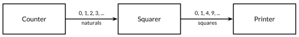

### **Chapter 8. Goroutines and Channels**

Concurrent programming, the expression of a program as a composition of several autonomous activities, has never been more important than it is today.

Go enables two styles of concurrent programming.

* This chapter presents goroutines and channels, which support [communicating sequential processes](https://en.wikipedia.org/wiki/Communicating_sequential_processes) (CSP), a model of concurrency in which values are passed between independent activities (goroutines) but variables are for the most part confined to a single activity.
* [Chapter 9](ch9.md) covers some aspects of the more traditional model of **shared memory multithreading**, which will be familiar to those who used threads in other mainstream languages.

### Goroutines

In Go, each concurrently executing activity is called a *goroutine*. If you have used operating system threads or threads in other languages, then you can assume for now that a goroutine is similar to a thread.  The differences between threads and goroutines are essentially quantitative, not qualitative, and will be described in [Section 9.8](ch9.md#goroutines-and-threads).

When a program starts, its only goroutine is the one that calls the `main` function, so we call it the *main goroutine*. New goroutines are created by the `go` statement:

* Syntactically, a `go` statement is an ordinary function or method call prefixed by the keyword `go`.
* A `go` statement causes the function to be called in a newly created goroutine. The go statement itself completes immediately.

```go
f()    // call f(); wait for it to return
go f() // create a new goroutine that calls f(); don't wait
```

In the example below, the main goroutine computes the 45th Fibonacci number using an inefficient recursive algorithm, which runs for an appreciable time, during which we provide the user with a visual indication that the program is still running, by displaying an animated textual "spinner".

<small>[gopl.io/ch8/spinner/main.go](https://github.com/shichao-an/gopl.io/blob/master/ch8/spinner/main.go)</small>

```go

func main() {
	go spinner(100 * time.Millisecond)
	const n = 45
	fibN := fib(n) // slow
	fmt.Printf("\rFibonacci(%d) = %d\n", n, fibN)
}

func spinner(delay time.Duration) {
	for {
		for _, r := range `-\|/` {
			fmt.Printf("\r%c", r)
			time.Sleep(delay)
		}
	}
}

func fib(x int) int {
	if x < 2 {
		return x
	}
	return fib(x-1) + fib(x-2)
}
```

After several seconds of animation, the `fib(45)` call returns and the main function prints its result:

```text
Fibonacci(45) = 1134903170
```

The `main` function then returns. When this happens, all goroutines are abruptly terminated and the program exits. Other than by returning from `main` or exiting the program, there is no programmatic way for one goroutine to stop another, but as we will see later, there are ways to communicate with a goroutine to request that it stop itself.

Notice how the program is expressed as the composition of two autonomous activities, spinning and Fibonacci computation. Each is written as a separate function but both make progress concurrently.

### Example: Concurrent Clock Server

Networking is a natural domain to use concurrency since servers typically handle many connections from their clients at once, each client being essentially independent of the others. This section introduces the [`net`](https://golang.org/pkg/net/) package, which provides the components for building networked client and server programs that communicate over TCP, UDP, or Unix domain sockets. The [`net/http`](https://golang.org/pkg/net/http/) package introduced since [Chapter 1](ch1.md) is built on top of functions from the `net` package.

The first example is a sequential clock server that writes the current time to the client once per second:

<small>[gopl.io/ch8/clock1/clock.go](https://github.com/shichao-an/gopl.io/blob/master/ch8/clock1/clock.go)</small>

```go
// Clock1 is a TCP server that periodically writes the time.
package main

import (
	"io"
	"log"
	"net"
	"time"
)

func main() {
	listener, err := net.Listen("tcp", "localhost:8000")
	if err != nil {
		log.Fatal(err)
	}
	for {
		conn, err := listener.Accept()
		if err != nil {
			log.Print(err) // e.g., connection aborted
			continue
		}
		handleConn(conn) // handle one connection at a time
	}
}

func handleConn(c net.Conn) {
	defer c.Close()
	for {
		_, err := io.WriteString(c, time.Now().Format("15:04:05\n"))
		if err != nil {
			return // e.g., client disconnected
		}
		time.Sleep(1 * time.Second)
	}
}
```

* The `Listen` function creates a [`net.Listener`](https://golang.org/pkg/net/#Listener), an object that listens for incoming connections on a network port, in this case TCP port `localhost:8000`. The listener's `Accept` method blocks until an incoming connection request is made, then returns a [`net.Conn`](https://golang.org/pkg/net/#Conn) object representing the connection.
* The `handleConn` function handles one complete client connection.
    * In a loop, it writes the current time, `time.Now()`, to the client.
    * Since `net.Conn` satisfies the `io.Writer` interface, we can write directly to it.
    * The loop ends when the write fails, most likely because the client has disconnected, at which point `handleConn` closes its side of the connection using a deferred call to `Close` and goes back to waiting for another connection request.
* The `time.Time.Format` method provides a way to format date and time information by example. Its argument is a template indicating how to format a reference time, specifically `Mon Jan 2 03:04:05PM 2006 UTC-0700`.
    * The reference time has eight components. Any collection of them can appear in the `Format` string in any order and in a number of formats; the selected components of the date and time will be displayed in the selected formats. This example uses the hour, minute, and second of the time.
    * The `time` package defines templates for many standard time formats, such as [`time.RFC1123`](https://golang.org/pkg/time/#pkg-constants). The same mechanism is used in reverse when parsing a time using `time.Parse`.

To connect to the server, we need a client program such as `nc` ("netcat"), a standard utility program for manipulating network connections:

```shell-session
$ go build gopl.io/ch8/clock1
$ ./clock1 &
$ nc localhost 8000
13:58:54
13:58:55
13:58:56
13:58:57
^C
```

The client displays the time sent by the server each second until we interrupt the client with Control-C, which on Unix systems is echoed as `^C` by the shell. We can also use `telnet`, or the following simple Go version of `netcat` that uses `net.Dial` to connect to a TCP server:

<small>[gopl.io/ch8/netcat1/netcat.go](https://github.com/shichao-an/gopl.io/blob/master/ch8/netcat2/netcat.go)</small>

```go
// Netcat1 is a read-only TCP client.
package main

import (
	"io"
	"log"
	"net"
	"os"
)

func main() {
	conn, err := net.Dial("tcp", "localhost:8000")
	if err != nil {
		log.Fatal(err)
	}
	defer conn.Close()
	mustCopy(os.Stdout, conn)
}

func mustCopy(dst io.Writer, src io.Reader) {
	if _, err := io.Copy(dst, src); err != nil {
		log.Fatal(err)
	}
}
```

This program reads data from the connection and writes it to the standard output until an end-of-file condition or an error occurs. The `mustCopy` function is a utility used in several examples in this section.

We run two clients at the same time on different terminals, one shown to the left and one to the right:

```text
$ go build gopl.io/ch8/netcat1
$ ./netcat1
13:58:54                        $ ./netcat1
13:58:55
13:58:56
^C
                                13:58:57
                                13:58:58
                                13:58:59
                                ^C
$ killall clock1
```

The second client must wait until the first client is finished because the server is sequential; it deals with only one client at a time.  Only one small change is needed to make the server concurrent: adding the `go` keyword to the call to `handleConn` causes each call to run in its own goroutine.

<small>[gopl.io/ch8/clock2/clock.go](https://github.com/shichao-an/gopl.io/blob/master/ch8/clock2/clock.go)</small>

```go
for {
	conn, err := listener.Accept()
	if err != nil {
		log.Print(err) // e.g., connection aborted
		continue
	}
	go handleConn(conn) // handle connections concurrently
}
```

Now, multiple clients can receive the time at once.

```text
$ go build gopl.io/ch8/clock2
$ ./clock2 &
$ go build gopl.io/ch8/netcat1
$ ./netcat1
14:02:54                     $ ./netcat1
14:02:55                     14:02:55
14:02:56                     14:02:56
14:02:57                     ^C
14:02:58
14:02:59                     $ ./netcat1
14:03:00                     14:03:00
14:03:01                     14:03:01
^C                           14:03:02
                             ^C
```

### Example: Concurrent Echo Server

The clock server used one goroutine per connection. In this section, we'll build an echo server that uses multiple goroutines per connection. Most echo servers merely write whatever they read, which can be done with this trivial version of `handleConn`:

```go
func handleConn(c net.Conn) {
	io.Copy(c, c) // NOTE: ignoring errors
	c.Close()
}
```

This version of echo server simulates the reverberations of a real echo, with the response loud at first ("HELLO!"), then moderate ("Hello!") after a delay, then quiet ("hello!") before fading to nothing:

<small>[gopl.io/ch8/reverb1/reverb.go](https://github.com/shichao-an/gopl.io/blob/master/ch8/reverb1/reverb.go)</small>

```go
func echo(c net.Conn, shout string, delay time.Duration) {
	fmt.Fprintln(c, "\t", strings.ToUpper(shout))
	time.Sleep(delay)
	fmt.Fprintln(c, "\t", shout)
	time.Sleep(delay)
	fmt.Fprintln(c, "\t", strings.ToLower(shout))
}

func handleConn(c net.Conn) {
	input := bufio.NewScanner(c)
	for input.Scan() {
		echo(c, input.Text(), 1*time.Second)
	}
	// NOTE: ignoring potential errors from input.Err()
	c.Close()
}
```

The following client program sends terminal input to the server while also copying the server response to the output:

<small>[gopl.io/ch8/netcat2/netcat.go](https://github.com/shichao-an/gopl.io/blob/master/ch8/netcat2/netcat.go)</small>

```go
func main() {
	conn, err := net.Dial("tcp", "localhost:8000")
	if err != nil {
		log.Fatal(err)
	}
	defer conn.Close()
	go mustCopy(os.Stdout, conn)
	mustCopy(conn, os.Stdin)
}
```

While the main goroutine reads the standard input and sends it to the server, a second goroutine reads and prints the server's response. When the main goroutine encounters the end of the input (for example, after the user types Control-D (`^D`)) at the terminal, the program stops, even if the other goroutine still has work to do. ([Section 8.4.1](#unbuffered-channels) discusses how to make the program wait for both sides to finish)

```text
$ go build gopl.io/ch8/reverb1
$ ./reverb1 &
$ go build gopl.io/ch8/netcat2
$ ./netcat2
Hello?
    HELLO?
    Hello?
    hello?
Is there anybody there?
    IS THERE ANYBODY THERE?
Yooo-hooo!
    Is there anybody there?
    is there anybody there?
    YOOO-HOOO!
    Yooo-hooo!
    yooo-hooo!
^D
$ killall reverb1
```

Notice that the third shout from the client is not dealt with until the second shout has petered out, which is not very realistic. A real echo would consist of the *composition* of the three independent shouts. To simulate it, more goroutines are needed; all we need to do is add the `go` keyword, this time to the call to `echo`:

<small>[gopl.io/ch8/reverb2/reverb.go](https://github.com/shichao-an/gopl.io/blob/master/ch8/reverb2/reverb.go)</small>

```go
func handleConn(c net.Conn) {
	input := bufio.NewScanner(c)
	for input.Scan() {
		go echo(c, input.Text(), 1*time.Second)
	}
	// NOTE: ignoring potential errors from input.Err()
	c.Close()
}
```

The arguments to the function started by `go` are evaluated when the `go` statement itself is executed; thus `input.Text()` is evaluated in the main goroutine.

Now the echoes are concurrent and overlap in time:

```text
$ go build gopl.io/ch8/reverb2
$ ./reverb2 &
$ ./netcat2
Is there anybody there?
    IS THERE ANYBODY THERE?
Yooo-hooo!
    Is there anybody there?
    YOOO-HOOO!
    is there anybody there?
    Yooo-hooo!
    yooo-hooo!
^D
$ killall reverb2
```

<u>All that was required to make the server use concurrency, not just to handle connections from multiple clients but even within a single connection, was the insertion of two `go` keywords.</u>

However in adding these keywords, we had to consider carefully that it is safe to call methods of `net.Conn` concurrently, which is not true for most types. The next chapter discusses the crucial concept of concurrency safety in the.

### Channels

If goroutines are the activities of a concurrent Go program, channels are the connections between them.

* A channel is a communication mechanism that enables one goroutine to send values to another goroutine.
* Each channel is a conduit for values of a particular type, called the channel's *element type*. The type of a channel whose elements have type int is written `chan int`.

To create a channel, use the built-in `make` function:

```go
ch := make(chan int) // ch has type 'chan int'
```

A channel is a reference to the data structure created by `make`.

* When we copy a channel or pass one as an argument to a function, we are copying a reference, so caller and callee refer to the same data structure.
* As with other reference types, the zero value of a channel is `nil`.
* Two channels of the same type may be compared using `==`. The comparison is `true` if both are references to the same channel data structure. A channel may also be compared to `nil`.

A channel has two principal operations, *send* and *receive*, collectively known as *communications*. A send statement transmits a value from one goroutine, through the channel, to another goroutine executing a corresponding receive expression.

Both operations are written using the `<-` operator.

* In a send statement, the `<-` separates the channel and value operands.
* In a receive expression, `<-` precedes the channel operand. A receive expression whose result is not used is a valid statement.

```go
ch <- x // a send statement

x=<-ch  // a receive expression in an assignment statement
<-ch    // a receive statement; result is discarded
```

Channels support a third operation, *close*, which sets a flag indicating that no more values will ever be sent on this channel.

* Send operations on a closed channel will panic.
* Receive operations on a closed channel yield the values that have been sent until no more values are left; any receive operations thereafter complete immediately and yield the zero value of the channel's element type.

To close a channel, call the built-in `close` function:

```go
close(ch)
```

A channel created with a simple call to `make` is called an *unbuffered* channel. `make` accepts an optional second argument, an integer called the channel's *capacity*. If the capacity is nonzero, `make` creates a `buffered` channel.

```go
ch = make(chan int)    // unbuffered channel
ch = make(chan int, 0) // unbuffered channel
ch = make(chan int, 3) // buffered channel with capacity 3
```

Unbuffered channels are discussed in [Section 8.4.1](#unbuffered-channels) and buffered channels in [Section 8.4.4](#buffered-channels).

#### Unbuffered Channels

* A send operation on an unbuffered channel blocks the sending goroutine until another goroutine executes a corresponding receive on the same channel, at which point the value is transmitted and both goroutines may continue.
* Conversely, if the receive operation was attempted first, the receiving goroutine is blocked until another goroutine performs a send on the same channel.

Communication over an unbuffered channel causes the sending and receiving goroutines to *synchronize*. Because of this, unbuffered channels are sometimes called *synchronous* channels. When a value is sent on an unbuffered channel, the receipt of the value happens *before* the reawakening of the sending goroutine.

In discussions of concurrency:

* When we say *x happens before y*, we don't mean merely that *x* occurs earlier in time than *y*. We mean that it is guaranteed to do so and that all its prior effects (e.g. updates to variables) are complete and that you may rely on them.
* When we say *x is concurrent with y*, we mean *x* neither happens before *y* nor after *y*.
    * This doesn't mean that *x* and *y* are necessarily simultaneous; it merely means that we cannot assume anything about their ordering.
    * As discussed in the next chapter, it's necessary to order certain events during the program's execution to avoid the problems that arise when two goroutines access the same variable concurrently.

The client program in [Section 8.3](#example-concurrent-echo-server) copies input to the server in its main goroutine, so the client program terminates as soon as the input stream closes, even if the background goroutine is still working. To make the program wait for the background goroutine to complete before exiting, we use a channel to synchronize the two goroutines:

<small>[gopl.io/ch8/netcat3/netcat.go](https://github.com/shichao-an/gopl.io/blob/master/ch8/netcat3/netcat.go)</small>

```go
func main() {
	conn, err := net.Dial("tcp", "localhost:8000")
	if err != nil {
		log.Fatal(err)
	}
	done := make(chan struct{})
	go func() {
		io.Copy(os.Stdout, conn) // NOTE: ignoring errors
		log.Println("done")
		done <- struct{}{} // signal the main goroutine
	}()
	mustCopy(conn, os.Stdin)
	conn.Close()
	<-done // wait for background goroutine to finish
}
```

When the user closes the standard input stream, `mustCopy` returns and the main goroutine calls `conn.Close()`, closing both halves of the network connection:

* Closing the write half of the connection causes the server to see an end-of-file condition.
* Closing the read half causes the background goroutine's call to `io.Copy` to return a "read from closed connection" error, which is why we've removed the error logging. Notice that the go statement calls a literal function, a common construction.

Before it returns, the background goroutine logs a message, then sends a value on the done channel. The main goroutine waits until it has received this value before returning. As a result, the program always logs the "`done`" message before exiting.

Messages sent over channels have two important aspects. Each message has a value, but sometimes the fact of communication and the moment at which it occurs are important. We call messages *events* when we wish to stress this aspect. When the event carries no additional information, that is, its sole purpose is synchronization, we'll emphasize this by using a channel whose element type is `struct{}`, though it's common to use a channel of `bool` or `int` for the same purpose since `done <- 1` is shorter than `done <- struct{}{}`.

#### Pipelines

Channels can be used to connect goroutines together so that the output of one is the input to another. This is called a *pipeline*. The program below consists of three goroutines connected by two channels, as shown the following figure.

[](figure_8.1.png "Figure 8.1. A three-stage pipeline.")

<small>[gopl.io/ch8/pipeline1/main.go](https://github.com/shichao-an/gopl.io/blob/master/ch8/pipeline1/main.go)</small>

```go
func main() {
	naturals := make(chan int)
	squares := make(chan int)

	// Counter
	go func() {
		for x := 0; ; x++ {
			naturals <- x
		}
	}()

	// Squarer
	go func() {
		for {
			x := <-naturals
			squares <- x * x
		}
	}()

	// Printer (in main goroutine)
	for {
		fmt.Println(<-squares)
	}
}
```

The first goroutine, `counter`, generates the integers 0, 1, 2, ..., and sends them over a channel to the second goroutine, `squarer`, which receives each value, squares it, and sends the result over another channel to the third goroutine, `printer`, which receives the squared values and prints them.

This program prints the infinite series of squares 0, 1, 4, 9, and so on. Pipelines like this may be found in long-running server programs where channels are used for lifelong communication between goroutines containing infinite loops.  If the sender knows that no further values will ever be sent on a channel, it is useful to communicate this fact to the receiver goroutines so that they can stop waiting. This is accomplished by closing the channel using the built-in `close` function:

```go
close(naturals)
```

After a channel has been closed, any further send operations on it will panic. After the closed channel has been *drained* (that is, after the last sent element has been received), all subsequent receive operations will proceed without blocking but will yield a zero value. Closing the `naturals` channel above would cause the `squarer`'s loop to spin as it receives a never-ending stream of zero values, and to send these zeros to the `printer`.

There is no way to test directly whether a channel has been closed, but there is a variant of the receive operation that produces two results: the received channel element, plus a boolean value, conventionally called `ok`, which is `true` for a successful receive and `false` for a receive on a closed and drained channel. Using this feature, we can modify the `squarer`'s loop to stop when the `naturals` channel is drained and close the `squares` channel in turn.

```go
// Squarer
go func() {
	for {
		x, ok := <-naturals
		if !ok {
			break // channel was closed and drained
		}
		squares <- x * x
	}
	close(squares)
}()
```

Since this pattern is common, the language enables us to use a `range` loop to iterate over channels. This is a more convenient syntax for receiving all the values sent on a channel and terminating the loop after the last one. In the pipeline below, when the `counter` goroutine finishes its loop after 100 elements, it closes the `naturals` channel, causing the `squarer` to finish its loop and close the `squares` channel. Finally, the main goroutine finishes its loop and the program exits. In a more complex program, it might make sense for the `counter` and `squarer` functions to defer the calls to `close` at the outset.

<small>[gopl.io/ch8/pipeline2/main.go](https://github.com/shichao-an/gopl.io/blob/master/ch8/pipeline2/main.go)</small>

```go
func main() {
	naturals := make(chan int)
	squares := make(chan int)

	// Counter
	go func() {
		for x := 0; x < 100; x++ {
			naturals <- x
		}
		close(naturals)
	}()

	// Squarer
	go func() {
		for x := range naturals {
			squares <- x * x
		}
		close(squares)
	}()

	// Printer (in main goroutine)
	for x := range squares {
		fmt.Println(x)
	}
}
```

Not every channel needs closing. It's only necessary to close a channel when it is important to tell the receiving goroutines that all data have been sent. A channel that the garbage collector determines to be unreachable will have its resources reclaimed whether or not it is closed. (Don't confuse this with the `close` operation for open files. It is important to call the `Close` method on every file when you've finished with it.) Attempting to close an already-closed channel causes a panic, as does closing a `nil` channel. Closing channels has another use as a broadcast mechanism ([Section 8.9](#cancellation)).

#### Unidirectional Channel Types

As programs grow, it is natural to break up large functions into smaller pieces. The previous example program naturally divides into three functions:

```go
func counter(out chan int)
func squarer(out, in chan int)
func printer(in chan int)
```

The `squarer` function takes two parameters, the input channel and the output channel: `in` is only to be received from, and `out` is only to be sent to. The names `in` and `out` convey this intention, but nothing prevents squarer from sending to in or receiving from out.

This arrangement is typical. When a channel is supplied as a function parameter, it is nearly always with the intent that it be used exclusively for sending or exclusively for receiving.

To document this intent and prevent misuse, the Go type system provides *unidirectional* channel types that expose only one of the send and receive operations:

* The type `chan<- int`, a send-only channel of `int`, allows sends but not receives.
* The type `<-chan int`, a receive-only channel of `int`, allows receives but not sends.

Violations of this discipline are detected at compile time.

Since the `close` operation asserts that no more sends will occur on a channel, only the sending goroutine is in a position to call it, and for this reason it is a compile-time error to attempt to close a receive-only channel.

The following program is the squaring pipeline with unidirectional channel types:

<small>[gopl.io/ch8/pipeline3/main.go](https://github.com/shichao-an/gopl.io/blob/master/ch8/pipeline3/main.go)</small>

```go
func counter(out chan<- int) {
	for x := 0; x < 100; x++ {
		out <- x
	}
	close(out)
}

func squarer(out chan<- int, in <-chan int) {
	for v := range in {
		out <- v * v
	}
	close(out)
}

func printer(in <-chan int) {
	for v := range in {
		fmt.Println(v)
	}
}

func main() {
	naturals := make(chan int)
	squares := make(chan int)

	go counter(naturals)
	go squarer(squares, naturals)
	printer(squares)
}
```

* The call `counter(naturals)` implicitly converts naturals, a value of type `chan int`, to the type of the parameter, `chan<- int`.
* The `printer(squares)` call does a similar implicit conversion to `<-chan int`.

Conversions from bidirectional to unidirectional channel types are permitted in any assignment, but not backward. Once you have a value of a unidirectional type such as `chan<- int`, there is no way to obtain from it a value of type `chan int` that refers to the same channel data structure.

#### Buffered Channels

A buffered channel has a queue of elements. The queue's maximum size is determined  by the capacity argument to `make` when it is created. The statement below creates a buffered channel capable of holding three string values.

```go
ch = make(chan string, 3)
```

The following figure a graphical representation of `ch` and the channel to which it refers.

[](figure_8.2.png "Figure 8.2. An empty buffered channel.")

A send operation on a buffered channel inserts an element at the back of the queue, and a receive operation removes an element from the front.

* If the channel is full, the send operation blocks its goroutine until space is made available by another goroutine's receive.
* If the channel is empty, a receive operation blocks until a value is sent by another goroutine.

We can send up to three values on this channel without the goroutine blocking:

```go
ch <- "A"
ch <- "B"
ch <- "C"
```

At this point, the channel is full, as shown below; a fourth send statement would block.

[](figure_8.3.png "Figure 8.3. A full buffered channel.")

If we receive one value like this:

```go
fmt.Println(<-ch) // "A"
```

The channel is neither full nor empty (as shown in the figure below), so either a send operation or a receive operation could proceed without blocking. In this way, <u>the channel's buffer decouples the sending and receiving goroutines.</u>

[](figure_8.4.png "Figure 8.4. A partially full buffered channel.")

The built-in `cap` function obtains the channel's buffer capacity:

```go
fmt.Println(cap(ch)) // "3"
```

The built-in `len` function returns the number of elements currently buffered

```go
fmt.Println(len(ch)) // "2"
```

Since in a concurrent program this information is likely to be stale as soon as it is retrieved, its value is limited, but it could conceivably be useful during fault diagnosis or performance optimization.

After two more receive operations the channel is empty again, and a fourth would block:

```go
fmt.Println(<-ch) // "B"
fmt.Println(<-ch) // "C"
```

In real programs, the send and receive operations are usually performed by different goroutines. It is a mistake to use buffered channels within a single goroutine as a queue. Channels are deeply connected to goroutine scheduling, and without another goroutine receiving from the channel, a sender (and perhaps the whole program) risks becoming blocked forever.

The example below shows an application of a buffered channel. It makes parallel requests to three mirror sites. It sends their responses over a buffered channel, then receives and returns only the first response, which is the quickest one to arrive. Thus `mirroredQuery` returns a result even before the two slower servers have responded. (It's quite normal for several goroutines to send values to the same channel concurrently, as in this example, or to receive from the same channel.)

```go
func mirroredQuery() string {
	responses := make(chan string, 3)
	go func() { responses <- request("asia.gopl.io") }()
	go func() { responses <- request("europe.gopl.io") }()
	go func() { responses <- request("americas.gopl.io") }()
	return <-responses // return the quickest response
}

func request(hostname string) (response string) { /* ... */ }
```

If we had used an unbuffered channel in the above example, the two slower goroutines would have gotten stuck trying to send their responses on a channel from which no goroutine will ever receive. This situation, called a *goroutine leak*, would be a bug. <u>Unlike garbage variables, leaked goroutines are not automatically collected, so it is important to make sure that goroutines terminate themselves when no longer needed.</u>

The choice between unbuffered and buffered channels, and the choice of a buffered channel's capacity, may both affect the correctness of a program.

* Unbuffered channels give stronger synchronization guarantees because every send operation is synchronized with its corresponding receive
* With buffered channels, the send and receive operations are decoupled.

When we know an upper bound on the number of values that will be sent on a channel, it's not unusual to create a buffered channel of that size and perform all the sends before the first value is received. Failure to allocate sufficient buffer capacity would cause the program to deadlock.

##### **Packaging cake example** *

Channel buffering may also affect program performance. Imagine three cooks in a cake shop, one baking, one icing, and one inscribing each cake before passing it on to the next cook in the assembly line:

* In a kitchen with little space, each cook that has finished a cake must wait for the next cook to become ready to accept it. This is analogous to communication over an unbuffered channel.
* If there is space for one cake between each cook, a cook may place a finished cake there and immediately start work on the next. This is analogous to a buffered channel with capacity 1.
    * As long as the cooks work at about the same rate on average, most of these handovers proceed quickly, smoothing out transient differences in their respective rates.
    * More space between cooks (larger buffers) can smooth out bigger transient variations in their rates without stalling the assembly line, such as happens when one cook takes a short break, then later rushes to catch up.

On the other hand, a buffer provides no benefit in either of the following case:

* When an earlier stage of the assembly line is consistently faster than the following stage, the buffer between them will spend most of its time full.
* When a later stage is faster, the buffer will usually be empty.

If the second stage is more elaborate, a single cook may not be able to keep up with the supply from the first cook or meet the demand from the third. To solve the problem, we could hire another cook to help the second, performing the same task but working independently. This is analogous to creating another goroutine communicating over the same channels.

The [gopl.io/ch8/cake](https://github.com/shichao-an/gopl.io/blob/master/ch8/cake/cake.go) package simulates this cake shop, with several parameters.

### Looping in Parallel

This section explores some common concurrency patterns for executing all the iterations of a loop in parallel. The following examples consider the problem of producing thumbnail-size images from a set of full-size ones. The [gopl.io/ch8/thumbnail](https://github.com/shichao-an/gopl.io/blob/master/ch8/thumbnail/thumbnail.go) package provides an `ImageFile` function that can scale a single image.

The program below loops over a list of image file names and produces a thumbnail for each one:

<small>[gopl.io/ch8/thumbnail/thumbnail_test.go](https://github.com/shichao-an/gopl.io/blob/master/ch8/thumbnail/thumbnail_test.go)</small>

```go
// makeThumbnails makes thumbnails of the specified files.
func makeThumbnails(filenames []string) {
	for _, f := range filenames {
		if _, err := thumbnail.ImageFile(f); err != nil {
			log.Println(err)
		}
	}
}
```

The order in which we process the files doesn't matter, since each scaling operation is independent of all the others. Problems like this that consist entirely of subproblems that are completely independent of each other are described as [*embarrassingly parallel*](https://en.wikipedia.org/wiki/Embarrassingly_parallel). Embarrassingly parallel problems are the easiest kind to implement concurrently and enjoy performance that scales linearly with the amount of parallelism.

The following first attempt at a concurrent version just adds a `go` keyword. Let's ignore errors for now and address them later.

```go
// NOTE: incorrect!
func makeThumbnails2(filenames []string) {
	for _, f := range filenames {
		go thumbnail.ImageFile(f) // NOTE: ignoring errors
	}
}
```

This version runs too fast, since it takes less time than the original, even when the slice of file names contains only a single element. This is because `makeThumbnails` returns before it has finished doing what it was supposed to do. It starts all the goroutines, one per file name, but doesn't wait for them to finish.

There is no direct way to wait until a goroutine has finished, but we can change the inner goroutine to report its completion to the outer goroutine by sending an event on a shared channel. Since we know that there are exactly `len(filenames)` inner goroutines, the outer goroutine need only count that many events before it returns:

```go
// makeThumbnails3 makes thumbnails of the specified files in parallel.
func makeThumbnails3(filenames []string) {
	ch := make(chan struct{})
	for _, f := range filenames {
		go func(f string) {
			thumbnail.ImageFile(f) // NOTE: ignoring errors
			ch <- struct{}{}
		}(f)
	}

	// Wait for goroutines to complete.
	for range filenames {
		<-ch
	}
}
```

Notice that we passed the value of `f` as an explicit argument to the literal function instead of using the declaration of `f` from the enclosing for loop (as shown below):

```go
for _, f := range filenames {
	go func() {
		thumbnail.ImageFile(f) // NOTE: incorrect!
		// ...
	}()
}
```

Recall the problem of loop variable capture inside an anonymous function, described in [Section 5.6.1](ch5.md#caveat-capturing-iteration-variables). In the above code, the single variable `f` is shared by all the anonymous function values and updated by successive loop iterations. By the time the new goroutines start executing the literal function, the `for` loop may have updated `f` and started another iteration or finished entirely, so when these goroutines read the value of `f`, they all observe it to have the value of the final element of the slice. By adding an explicit parameter, we ensure that we use the value of `f` that is current when the go statement is executed.

In the next version of `makeThumbnails`, if an worker goroutine's call to `thumbnail.ImageFile` fails to create a file, it returns an error to the main goroutine. `makeThumbnails4` returns the first error it receives from any of the scaling operations:

```go
// makeThumbnails4 makes thumbnails for the specified files in parallel.
// It returns an error if any step failed.
func makeThumbnails4(filenames []string) error {
	errors := make(chan error)

	for _, f := range filenames {
		go func(f string) {
			_, err := thumbnail.ImageFile(f)
			errors <- err
		}(f)
	}

	for range filenames {
		if err := <-errors; err != nil {
			return err // NOTE: incorrect: goroutine leak!
		}
	}

	return nil
}
```

This function has a subtle bug. When it encounters the first non-nil error, it returns the error to the caller, leaving no goroutine draining the errors channel. Each remaining worker goroutine will block forever when it tries to send a value on that channel, and will never terminate. This results in a goroutine leak ([Section 8.4.4](#buffered-channels)), which may cause the whole program to get stuck or to run out of memory.

The simplest solution is to use a buffered channel with sufficient capacity that no worker goroutine will block when it sends a message. An alternative solution is to create another goroutine to drain the channel while the main goroutine returns the first error without delay.

The next version of `makeThumbnails` uses a buffered channel to return the names of the generated image files along with any errors.

```go
// makeThumbnails5 makes thumbnails for the specified files in parallel.
// It returns the generated file names in an arbitrary order,
// or an error if any step failed.
func makeThumbnails5(filenames []string) (thumbfiles []string, err error) {
	type item struct {
		thumbfile string
		err       error
	}

	ch := make(chan item, len(filenames))
	for _, f := range filenames {
		go func(f string) {
			var it item
			it.thumbfile, it.err = thumbnail.ImageFile(f)
			ch <- it
		}(f)
	}

	for range filenames {
		it := <-ch
		if it.err != nil {
			return nil, it.err
		}
		thumbfiles = append(thumbfiles, it.thumbfile)
	}

	return thumbfiles, nil
}
```

The final version of `makeThumbnails` is shown below. It returns the total number of bytes occupied by the new files. Unlike the previous versions, however, it receives the file names not as a slice but over a channel of strings, so we cannot predict the number of loop iterations.

To know when the last goroutine has finished (which may not be the last one to start), we need to increment a counter before each goroutine starts and decrement it as each goroutine finishes. This demands a special kind of counter that can be safely manipulated from multiple goroutines and that provides a way to wait until it becomes zero. This counter type is known as [`sync.WaitGroup`](https://golang.org/pkg/sync/#WaitGroup) as shown in the code below:

```go
// makeThumbnails6 makes thumbnails for each file received from the channel.
// It returns the number of bytes occupied by the files it creates.
func makeThumbnails6(filenames <-chan string) int64 {
	sizes := make(chan int64)
	var wg sync.WaitGroup // number of working goroutines
	for f := range filenames {
		wg.Add(1)
		// worker
		go func(f string) {
			defer wg.Done()
			thumb, err := thumbnail.ImageFile(f)
			if err != nil {
				log.Println(err)
				return
			}
			info, _ := os.Stat(thumb) // OK to ignore error
			sizes <- info.Size()
		}(f)
	}

	// closer
	go func() {
		wg.Wait()
		close(sizes)
	}()

	var total int64
	for size := range sizes {
		total += size
	}
	return total
}
```

The structure of the code above is a common and idiomatic pattern for looping in parallel when we don't know the number of iterations:

* Note the asymmetry in the `Add` and `Done` methods.
    * `Add` increments the counter and must be called before the worker goroutine starts, not within it; <u>otherwise we would not be sure that the `Add` happens before the "closer" goroutine calls `Wait`.</u>
    * `Add` takes a parameter, but `Done` does not; it's equivalent to `Add(-1)`. We use `defer` to ensure that the counter is decremented even in the error case.
* The `sizes` channel carries each file size back to the main goroutine, which receives them using a `range` loop and computes the sum.
* Observe how we create a closer goroutine that waits for the workers to finish before closing the `sizes` channel. These two operations, `wait` and `close`, must be concurrent with the loop over `sizes`. Consider the alternatives:
    * If the `wait` operation were placed in the main goroutine before the loop, it would never end.
    * If the `wait` operation were placed after the loop, it would be unreachable since with nothing closing the channel, the loop would never terminate.

The following figure illustrates the sequence of events in the `makeThumbnails6` function:

[](figure_8.5.png "Figure 8.5. The sequence of events in makeThumbnails6.")

* The vertical lines represent goroutines.
* The thin segments indicate sleep, the thick segments activity.
* The diagonal arrows indicate events that synchronize one goroutine with another.

Notice how the main goroutine spends most of its time in the `range` loop asleep, waiting for a worker to send a value or the closer to close the channel.

### Example: Concurrent Web Crawler

[Section 5.6](ch5.md#anonymous-functions) shows a simple web crawler that explored the link graph of the web in breadth-first order. In this section show is concurrent version so that independent calls to `crawl` can exploit the I/O parallelism available in the web. The `crawl` function remains exactly as it was in [gopl.io/ch5/findlinks3](https://github.com/shichao-an/gopl.io/blob/master/ch5/findlinks3/findlinks.go):

<small>[gopl.io/ch8/crawl1/findlinks.go](https://github.com/shichao-an/gopl.io/blob/master/ch8/crawl1/findlinks.go)</small>

```go
func crawl(url string) []string {
	fmt.Println(url)
	list, err := links.Extract(url)
	if err != nil {
		log.Print(err)
	}
	return list
}
```

The main function resembles `breadthFirst` ([Section 5.6](ch5.md#anonymous-functions)):

* As before, a `worklist` records the queue of items that need processing, each item being a list of URLs to crawl, but this time a channel is used instead of a slice.
* Each call to `crawl` occurs in its own goroutine and sends the links it discovers back to the `worklist`.

```go
func main() {
	worklist := make(chan []string)

	// Start with the command-line arguments.
	go func() { worklist <- os.Args[1:] }()

	// Crawl the web concurrently.
	seen := make(map[string]bool)
	for list := range worklist {
		for _, link := range list {
			if !seen[link] {
				seen[link] = true
				go func(link string) {
					worklist <- crawl(link)
				}(link)
			}
		}
	}
}
```

Notice that the `crawl` goroutine takes link as an explicit parameter to avoid the problem of loop variable capture  in [Section 5.6.1](ch5.md#caveat-capturing-iteration-variables). Also notice that the initial send of the command-line arguments to the `worklist` must run in its own goroutine to avoid deadlock, a stuck situation in which both the main goroutine and a crawler goroutine attempt to send to each other while neither is receiving. An alternative solution would be to use a buffered channel.

The crawler is now highly concurrent and prints a storm of URLs, but it has two problems.  The first problem manifests itself as error messages in the log after a few seconds of operation:

```text
$ go build gopl.io/ch8/crawl1
$ ./crawl1 http://gopl.io/
http://gopl.io/
https://golang.org/help/
https://golang.org/doc/
https://golang.org/blog/
...
2015/07/15 18:22:12 Get ...: dial tcp: lookup blog.golang.org: no such host
2015/07/15 18:22:12 Get ...: dial tcp 23.21.222.120:443: socket:
too many open files
...
```

The program created so many network connections at once that it exceeded the per-process limit on the number of open files, causing operations such as DNS lookups and calls to `net.Dial` to start failing.

The program is too parallel. Unbounded parallelism is rarely a good idea since there is always a limiting factor in the system, such as:

* The number of CPU cores for compute-bound workloads
* The number of spindles and heads for local disk I/O operations
* The bandwidth of the network for streaming downloads or the serving capacity of a web service.

The solution is to limit the number of parallel uses of the resource to match the level of parallelism that is available. A simple way to do that in our example is to ensure that no more than *n* calls to `links.Extract` are active at once, where *n* is comfortably less than the file descriptor limit.

We can limit parallelism using a buffered channel of capacity *n* to model a concurrency primitive called a *counting semaphore*. Conceptually, each of the *n* vacant slots in the channel buffer represents a token entitling the holder to proceed. Sending a value into the channel acquires a token, and receiving a value from the channel releases a token, creating a new vacant slot. This ensures that at most *n* sends can occur without an intervening receive.Since the channel element type is not important, we'll use `struct{}`, which has size zero.

In the following rewritten `crawl` function, the call to `links.Extract` is bracketed by operations to acquire and release a token, thus ensuring that at most 20 calls to it are active at one time. It's good practice to keep the semaphore operations as close as possible to the I/O operation they regulate.

<small>[gopl.io/ch8/crawl2/findlinks.go](https://github.com/shichao-an/gopl.io/blob/master/ch8/crawl2/findlinks.go)</small>

```go
// tokens is a counting semaphore used to
// enforce a limit of 20 concurrent requests.
var tokens = make(chan struct{}, 20)

func crawl(url string) []string {
	fmt.Println(url)
	tokens <- struct{}{} // acquire a token
	list, err := links.Extract(url)
	<-tokens // release the token

	if err != nil {
		log.Print(err)
	}
	return list
}
```

The second problem is that the program never terminates, even when it has discovered all the links reachable from the initial URLs. For the program to terminate, we need to break out of the main loop when the `worklist` is empty and no crawl goroutines are active.

```go
func main() {
	worklist := make(chan []string)
	var n int // number of pending sends to worklist

	// Start with the command-line arguments.
	n++
	go func() { worklist <- os.Args[1:] }()

	// Crawl the web concurrently.
	seen := make(map[string]bool)
	for ; n > 0; n-- {
		list := <-worklist
		for _, link := range list {
			if !seen[link] {
				seen[link] = true
				n++
				go func(link string) {
					worklist <- crawl(link)
				}(link)
			}
		}
	}
}
```

In this version, the counter `n` keeps track of the number of sends to the `worklist` that are yet to occur. Each time we know that an item needs to be sent to the worklist, we increment `n`, once before we send the initial command-line arguments, and again each time we start a crawler goroutine. The main loop terminates when `n` falls to zero, since there is no more work to be done.

This concurrent crawler now runs about 20 times faster than the breadth-first crawler from [Section 5.6](ch5.md#anonymous-functions)  and terminates correctly if it should complete its task.

The program below shows an alternative solution to the problem of excessive concurrency. It uses the original `crawl` function that has no counting semaphore, but calls it from one of 20 long-lived crawler goroutines, thus ensuring that at most 20 HTTP requests are active concurrently.

<small>[gopl.io/ch8/crawl3/findlinks.go](https://github.com/shichao-an/gopl.io/blob/master/ch8/crawl3/findlinks.go)</small>

```go
func main() {
	worklist := make(chan []string)  // lists of URLs, may have duplicates
	unseenLinks := make(chan string) // de-duplicated URLs

	// Add command-line arguments to worklist.
	go func() { worklist <- os.Args[1:] }()

	// Create 20 crawler goroutines to fetch each unseen link.
	for i := 0; i < 20; i++ {
		go func() {
			for link := range unseenLinks {
				foundLinks := crawl(link)
				go func() { worklist <- foundLinks }()
			}
		}()
	}

	// The main goroutine de-duplicates worklist items
	// and sends the unseen ones to the crawlers.
	seen := make(map[string]bool)
	for list := range worklist {
		for _, link := range list {
			if !seen[link] {
				seen[link] = true
				unseenLinks <- link
			}
		}
	}
}
```

In the above program:

* The crawler goroutines are all fed by the same channel, `unseenLinks`.
* The main goroutine is responsible for de-duplicating items it receives from the worklist, and then sending each unseen one over the `unseenLinks` channel to a crawler goroutine.
* The `seen` map is *confined* within the main goroutine; that is, it can be accessed only by that goroutine. Like other forms of information hiding, confinement helps us reason about the correctness of a program. For example:

    * Local variables cannot be mentioned by name from outside the function in which they are declared.
    * Variables that do not escape ([Section 2.3.4](ch2.md#lifetime-of-variables)) from a function cannot be accessed from outside that function.
    * Encapsulated fields of an object cannot be accessed except by the methods of that object.

    In all cases, information hiding helps to limit unintended interactions between parts of the program.

* Links found by `crawl` are sent to the worklist from a dedicated goroutine to avoid deadlock.
* To save space, this example does not address the problem of termination.

### Multiplexing with `select`

The program below does the countdown for a rocket launch. The [`time.Tick`](https://golang.org/pkg/time/#Tick) function returns a channel on which it sends events periodically, acting like a [metronome](https://en.wikipedia.org/wiki/Metronome). The value of each event is a timestamp, but it is rarely as interesting as the fact of its delivery.

<small>[gopl.io/ch8/countdown1/countdown.go](https://github.com/shichao-an/gopl.io/blob/master/ch8/countdown1/countdown.go)</small>

```go
func main() {
	fmt.Println("Commencing countdown.")
	tick := time.Tick(1 * time.Second)
	for countdown := 10; countdown > 0; countdown-- {
		fmt.Println(countdown)
		<-tick
	}
	launch()
}
```

The following code adds the ability to abort the launch sequence by pressing the return key during the countdown. First, it starts a goroutine that tries to read a single byte from the standard input and, if it succeeds, sends a value on a channel called `abort`.

<small>[gopl.io/ch8/countdown2/countdown.go](https://github.com/shichao-an/gopl.io/blob/master/ch8/countdown2/countdown.go)</small>

```go
abort := make(chan struct{})
go func() {
	os.Stdin.Read(make([]byte, 1)) // read a single byte
	abort <- struct{}{}
}()
```

Now each iteration of the countdown loop needs to wait for an event to arrive on one of the two channels:

* The ticker channel if everything is fine ("nominal" in NASA jargon)
* An abort event if there was an "anomaly"

We can't just receive from each channel because whichever operation we try first will block until completion. We need to multiplex these operations with a *select statement*.

The general form of a select statement is shown above.

```go
select {
case <-ch1:
	// ...
case x := <-ch2:
	// ...use x...
case ch3 <- y:
	// ...
default:
	// ...
}
```

Like a switch statement, it has a number of cases and an optional default. Each case specifies a *communication* (a send or receive operation on some channel) and an associated block of statements.

* In the first case, a receive expression appears on its own.
* In the second case, a receive expression appears within a short variable declaration. This enables you to refer to the received value.

A `select` waits until a communication for some case is ready to proceed. It then performs that communication and executes the case's associated statements; the other communications do not happen. A `select` with no cases, `select{}`, waits forever.

Let's return to our rocket launch program. The `time.After` function immediately returns a channel, and starts a new goroutine that sends a single value on that channel after the specified time. The select statement below waits until the first of two events arrives, either an abort event or the event indicating that 10 seconds have elapsed. If 10 seconds go by with no abort, the launch proceeds.

```go
func main() {
	// ...create abort channel...

	fmt.Println("Commencing countdown.  Press return to abort.")
	select {
	case <-time.After(10 * time.Second):
		// Do nothing.
	case <-abort:
		fmt.Println("Launch aborted!")
		return
	}
	launch()
}
```


The example below is more subtle. The channel `ch`, whose buffer size is 1, is alternately empty then full, so only one of the cases can proceed, either the send when `i` is even, or the receive when `i` is odd. It always prints `0 2 4 6 8`.

```go
ch := make(chan int, 1)
for i := 0; i < 10; i++ {
	select {
	case x := <-ch:
		fmt.Println(x) // "0" "2" "4" "6" "8"
	case ch <- i:
	}
}
```

If multiple cases are ready, `select` picks one at random, which ensures that every channel has an equal chance of being selected. Increasing the buffer size of the previous example makes its output nondeterministic, because when the buffer is neither full nor empty, the select statement figuratively tosses a coin.

The following launch program prints the countdown. The select statement below causes each iteration of the loop to wait up to 1 second for an abort, but no longer.

<small>[gopl.io/ch8/countdown3/countdown.go](https://github.com/shichao-an/gopl.io/blob/master/ch8/countdown3/countdown.go)</small>

```go
func main() {
	// ...create abort channel...

	fmt.Println("Commencing countdown.  Press return to abort.")
	tick := time.Tick(1 * time.Second)
	for countdown := 10; countdown > 0; countdown-- {
		fmt.Println(countdown)
		select {
		case <-tick:
			// Do nothing.
		case <-abort:
			fmt.Println("Launch aborted!")
			return
		}
	}
	launch()
}
```

The `time.Tick` function behaves as if it creates a goroutine that calls `time.Sleep` in a loop, sending an event each time it wakes up. When the countdown function above returns, it stops receiving events from tick, but the ticker goroutine is still there, trying in vain to send on a channel from which no goroutine is receiving, which is a **goroutine leak** ([Section 8.4.4](#buffered-channels)).

The `Tick` function is convenient, but it's appropriate only when the ticks will be needed throughout the lifetime of the application. Otherwise, we should use this pattern:

```go
ticker := time.NewTicker(1 * time.Second)
<-ticker.C // receive from the ticker's channel
ticker.Stop() // cause the ticker's goroutine to terminate
```

Sometimes we want to try to send or receive on a channel but avoid blocking if the channel is not ready, which a non-blocking communication. A select statement can do that. A select may have a default, which specifies what to do when none of the other communications can proceed immediately.

The select statement below receives a value from the `abort` channel if there is one to receive; otherwise it does nothing. This is a *non-blocking* receive operation; doing it repeatedly is called [polling](https://en.wikipedia.org/wiki/Polling_(computer_science)) a channel.

```go
select {
case <-abort:
	fmt.Printf("Launch aborted!\n")
	return
default:
	// do nothing
}
```

The zero value for a channel is `nil`, and nil channels are sometimes useful. Because send and receive operations on a nil channel block forever, a case in a select statement whose channel is nil is never selected. This enables us to use nil to enable or disable cases that correspond to features like:

* Handling timeouts or cancellation
* Responding to other input events
* Emitting output

The next section gives us an example.

### Example: Concurrent Directory Traversal

This section builds a program that reports the disk usage of one or more directories specified on the command line, like the Unix [`du`](https://en.wikipedia.org/wiki/Du_(Unix)) command. Most of its work is done by the `walkDir` function below, which enumerates the entries of the directory `dir` using the `dirents` helper function.

<small>[gopl.io/ch8/du1/main.go](https://github.com/shichao-an/gopl.io/blob/master/ch8/du1/main.go)</small>

```go
// walkDir recursively walks the file tree rooted at dir
// and sends the size of each found file on fileSizes.
func walkDir(dir string, fileSizes chan<- int64) {
	for _, entry := range dirents(dir) {
		if entry.IsDir() {
			subdir := filepath.Join(dir, entry.Name())
			walkDir(subdir, fileSizes)
		} else {
			fileSizes <- entry.Size()
		}
	}
}

// dirents returns the entries of directory dir.
func dirents(dir string) []os.FileInfo {
	entries, err := ioutil.ReadDir(dir)
	if err != nil {
		fmt.Fprintf(os.Stderr, "du1: %v\n", err)
		return nil
	}
	return entries
}
```

* The [`ioutil.ReadDir`](https://golang.org/pkg/io/ioutil/#ReadDir) function returns a slice of [`os.FileInfo`](https://golang.org/pkg/os/#FileInfo), which is the same information that a call to [`os.Stat`](https://golang.org/pkg/os/#Stat) returns for a single file.
* For each subdirectory, `walkDir` recursively calls itself, and for each file, `walkDir` sends a message (the size of the file in bytes) on the `fileSizes` channel.

The main function below uses two goroutines:

* The background goroutine calls `walkDir` for each director `y` specified on the command line and finally closes the `fileSizes` channel.
* The main goroutine computes the sum of the file sizes it receives from the channel and finally prints the total.

```go
// The du1 command computes the disk usage of the files in a directory.
package main

import (
	"flag"
	"fmt"
	"io/ioutil"
	"os"
	"path/filepath"
)

func main() {
	// Determine the initial directories.
	flag.Parse()
	roots := flag.Args()
	if len(roots) == 0 {
		roots = []string{"."}
	}

	// Traverse the file tree.
	fileSizes := make(chan int64)
	go func() {
		for _, root := range roots {
			walkDir(root, fileSizes)
		}
		close(fileSizes)
	}()

	// Print the results.
	var nfiles, nbytes int64
	for size := range fileSizes {
		nfiles++
		nbytes += size
	}
	printDiskUsage(nfiles, nbytes)
}

func printDiskUsage(nfiles, nbytes int64) {
	fmt.Printf("%d files  %.1f GB\n", nfiles, float64(nbytes)/1e9)
}
```

This program pauses for a long while before printing its result:

```shell-session
$ go build gopl.io/ch8/du1
$ ./du1 $HOME /usr /bin /etc
213201 files 62.7 GB
```

The program would be nicer if it kept us informed of its progress. However, simply moving the `printDiskUsage` call into the loop would cause it to print thousands of lines of output. The variant of `du` below prints the totals periodically, but only if the `-v `flag is specified since not all users will want to see progress messages. The background goroutine that loops over `roots` remains unchanged.

In the following program:

* The main goroutine uses a ticker to generate events every 500ms.
* The select statement waits for either a file size message, in which case it updates the totals, or a tick event, in which case it prints the current totals.
* If the `-v` flag is not specified, the `tick` channel remains nil, and its case in the `select` is effectively disabled.

<small>[gopl.io/ch8/du2/main.go](https://github.com/shichao-an/gopl.io/blob/master/ch8/du2/main.go)</small>

```go
var verbose = flag.Bool("v", false, "show verbose progress messages")

func main() {
	// ...start background goroutine...
	// Print the results periodically.
	var tick <-chan time.Time
	if *verbose {
		tick = time.Tick(500 * time.Millisecond)
	}
	var nfiles, nbytes int64
loop:
	for {
		select {
		case size, ok := <-fileSizes:
			if !ok {
				break loop // fileSizes was closed
			}
			nfiles++
			nbytes += size
		case <-tick:
			printDiskUsage(nfiles, nbytes)
		}
	}
	printDiskUsage(nfiles, nbytes) // final totals
}
```

Since the program no longer uses a `range` loop, the first `select` case must explicitly test whether the `fileSizes` channel has been closed, using the two-result form of receive operation. If the channel has been closed, the program breaks out of the loop. <u>The labeled `break` statement breaks out of both the `select` and the `for` loop; an unlabeled break would break out of only the `select`, causing the loop to begin the next iteration.</u>

The program now gives us a stream of updates:

```go
$ go build gopl.io/ch8/du2
$ ./du2 -v $HOME /usr /bin /etc
28608 files 8.3 GB
54147 files 10.3 GB
93591 files 15.1 GB
127169 files 52.9 GB
175931 files 62.2 GB
213201 files 62.7 GB
```
