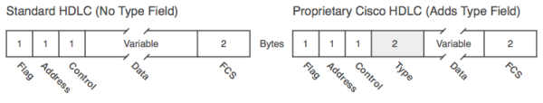

#### **Part I: Networking Fundamentals**

## Chapter 1. Introduction to Computer Networking

## Chapter 2. The TCP/IP and OSI Networking Models

### TCP/IP Networking Model

A **networking model** (**networking architecture** or **networking blueprint**), refers to a comprehensive set of documents that define everything that should happen for a computer network to work.

The TCP/IP model both defines and references a large collection of protocols that allow computers to communicate. TCP/IP uses documents called [**Requests for Comments**](http://en.wikipedia.org/wiki/Request_for_Comments) (RFC).

#### Data Encapsulation Terminology

1. Create and encapsulate the application data with any required application layer headers.
2. Encapsulate the data supplied by the application layer inside a transport layer header. 
3. Encapsulate the data supplied by the transport layer inside an Internet layer (IP) header.
4. Encapsulate the data supplied by the Internet layer inside a data link layer header and trailer. This is the only layer that uses both a **header** and a **trailer**.
5. Transmit the bits.

### OSI Networking Model

#### Describing Protocols by Referencing the OSI Layers

Networking documents often describe TCP/IP protocols and standards by referencing OSI layers, both by layer number and layer name. For instance, a common description of a LAN switch is “layer 2 switch,” with “layer 2” referring to OSI layer 2.

Layer Name | Protocols and Specifications | Devices
---------- | ---------------------------- | -------
Application, presentation, session (Layers 5–7) | Telnet, HTTP, FTP, SMTP, POP3, VoIP, SNMP | Firewall, intrusion detection systems, hosts
Transport (Layer 4) | TCP, UDP | Hosts, firewalls
Network (Layer 3) | IP | Router
Data link (Layer 2) | Ethernet (IEEE 802.3), HDLC, Frame Relay, PPP | LAN switch, wireless access point, cable modem, DSL modem
Physical (Layer 1) | RJ-45, EIA/TIA-232, V.35, Ethernet (IEEE 802.3) | LAN hub, LAN repeater, cables

#### OSI Layering Concepts and Benefits

[p41]

* Less complex
* Standard interfaces
* Easier to learn
* Easier to develop
* Multivendor interoperability
* Modular engineering

#### OSI Encapsulation Terminology

The TCP/IP model uses terms such as **segment**, **packet**, and **frame** to refer to various layers and their respective encapsulated data. OSI uses a more generic term: **protocol data unit** (PDU).

## Chapter 3. Fundamentals of LANs
### An Overview of Modern Ethernet LANs

Types of cabling:

* **[Unshielded Twisted-Pair](http://en.wikipedia.org/wiki/Twisted_pair#Unshielded_twisted_pair_.28UTP.29)** (UTP)
* **Fiber-optic**

Most IEEE standards define a different variation of Ethernet at the physical layer. 
For the data link layer:

* 802.3 Media Access Control (MAC) sublayer
* 802.2 Logical Link Control (LLC) sublayer

[p52]

Common Name | Speed | Alternative Name | Name of IEEE Standard | Cable Type, Maximum Length
----------- | ----- | ---------------- | --------------------- | --------------------------
Ethernet | 10 Mbps | 10BASE-T | IEEE 802.3 | Copper, 100 m
Fast Ethernet | 100 Mbps | 100BASE-TX | IEEE 802.3u | Copper, 100 m
Gigabit Ethernet | 1000 Mbps | 1000BASE-LX, 1000BASE-SX | IEEE 802.3z | Fiber, 550 m (SX) 5 km (LX)
Gigabit Ethernet | 1000 Mbps | 1000BASE-T | IEEE 802.3ab | 100 m

The term Ethernet is often used to mean "all types of Ethernet", but in some cases it is used to mean "10BASE-T Ethernet"

### A Brief History of Ethernet
* Carrier sense multiple access with collision detection (CSMA/CD) algorithm

#### Repeaters

**Repeaters** extended the length of LANs by cleaning up the electrical signal and repeating it (a Layer 1 function) but without interpreting the meaning of the electrical signal. [p56]

#### Building 10BASE-T Networks with Hubs

**Hubs** are essentially repeaters with multiple physical ports. It simply regenerates the electrical signal that comes in one port and sends the same signal out every other port.

### Ethernet UTP Cabling
#### Transmitting Data Using Twisted Pairs

UTP cabling consists of matched pairs of wires that are indeed twisted together, with current on the two wires in opposite directions.

#### UTP Cabling Pinouts for **10BASE-T and 100BASE-TX**

10BASE-T and 100BASE-TX Ethernet define that one pair should be used to send data in one direction, with the other pair used to send data in the other direction.

The wires in the UTP cable must be connected to the correct **pin positions** in the RJ-45 connectors in order for communication to work correctly. 

[p62-64]

The following applies to 10BASE-T and 100BASE-TX only:

* Ethernet **straight-through cable**: both ends of the cable use the same EIA/TIA pinout standard on each end of the cable. A straight-through cable is used when the devices on the ends of the cable use opposite pins when they transmit data.
* Ethernet **crossover cable**:  two devices both use the same pins to transmit and the pinouts of the cable are set up to swap the wire pair

Devices That Transmit on 1,2 and Receive on 3,6 | Devices That Transmit on 3,6 and Receive on 1,2 
----------------------------------------------- | -----------------------------------------------
PC NICs | Hubs
Routers | Switches
Wireless Access Point (Ethernet interface) | —
Networked printers (printers that connect directly to the LAN) | —

#### **1000BASE-T Cabling**

1000BASE-T differs from 10BASE-T and 100BASE-TX as far as the cabling and pinouts:

* Reequires four wire pairs
* Transmits and receives on each of the four wire pairs simultaneously
* Has no concept of straight-through and crossover cables

### Improving Performance by Using Switches Instead of Hubs

CSMA/CD logic helps prevent collisions and also defines how to act when a collision does occur:

1. A device with a frame to send listens until the Ethernet is not busy.
2. When the Ethernet is not busy, the sender(s) begin(s) sending the frame.
3. The sender(s) listen(s) to make sure that no collision occurred.
4. If a collision occurs, the devices that had been sending a frame each send a jamming signal to ensure that all stations recognize the collision.
5. After the jamming is complete, each sender randomizes a timer and waits that long before trying to resend the collided frame. When each random timer expires, the process starts over with Step 1.

#### Increasing Available Bandwidth Using Switches

The term **collision domain** defines the set of devices whose frames could collide. For example, all devices connected to the hub are in the same collision domain. To avoid collisions, and to recover when they occur, devices in the same collision domain use CSMA/CD.

**Switches** significantly reduce, or even eliminate, the number of collisions on a LAN:

* Switches interpret the bits in the received frame so that they can typically send the frame out the one required port, rather than all other ports
* If a switch needs to forward multiple frames out the same port, the switch buffers the frames in memory, sending one at a time, thereby avoiding collisions

The switch’s logic requires that the switch look at the Ethernet header, which is considered a Layer 2 feature. As a result, switches are considered to operate as a Layer 2 device, whereas hubs are Layer 1 devices.

Buffering (temporarily holds the frame in memory) also helps prevent collisions.

Switch features provide significant performance improvements:

* If only one device is cabled to each port of a switch, no collisions can occur.
* Devices connected to one switch port do not share their bandwidth with devices connected to another switch port. Each has its own separate bandwidth, meaning that a switch with 100-Mbps ports has 100 Mbps of bandwidth **per port**.

##### Shared Ethernet vs. Switched Ethernet

* **Shared Ethernet**: bandwidth is shared among the devices on the LAN because they must take turns using the LAN because of the CSMA/CD algorithm. A hub with 24 100-Mbps Ethernet devices connected to it allows for a theoretical maximum of 100 Mbps of bandwidth
* **Switched Ethernet**: bandwidth does not have to be shared, allowing for far greater performance. A switch with 24 100-Mbps Ethernet devices connected to it supports 100 Mbps for each port, or 2400 Mbps (2.4 Gbps) theoretical maximum bandwidth.

#### Doubling Performance by Using Full-Duplex Ethernet

In an Ethernet network using hubs, CSMA/CD imposes **half-duplex** logic on each device, meaning that only one device can send at a time. LAN switches with only one device cabled to each port of the switch allow the use of **full-duplex** operation; Ethernet card can send and receive concurrently.

### Ethernet Data-Link Protocols
#### Ethernet Addressing

LAN Addressing Term or Feature | Description
------------------------------ | -----------
MAC | Media Access Control. 802.3 (Ethernet) defines the MAC sublayer of IEEE Ethernet.
Ethernet address, NIC address, LAN address | Other names often used instead of MAC address. These terms describe the 6-byte address of the LAN interface card.
Burned-in address | The 6-byte address assigned by the vendor making the card.
Unicast address | A term for a MAC that represents a single LAN interface.
Broadcast address | An address that means “all devices that reside on this LAN right now.” (FFFF.FFFF.FFFF)
Multicast address | On Ethernet, a multicast address implies some subset of all devices currently on the Ethernet LAN. (0100.5exx.xxxx, any value can be used in the last half)

#### Ethernet Framing

**Framing** defines the meaning of the bits transmitted and received over a network.

* **Data** field holds Layer 3 packets (L3 PDU)
* **Maximum transmission unit** (MTU) defines the maximum Layer 3 packet that can be sent over a medium. 1500 bytes is the largest IP MTU allowed over an Ethernet.

#### Identifying the Data Inside an Ethernet Frame

**Type/Length** filed:

* **Length** field: with a value less than hex 0600 (decimal 1536); another field is needed to identify the type of L3 PDU inside the frame.
* **Type** field: value of hexadecimal 0800 (decimal 2048) implies an IP packet

#### Error Detection

Errors (bit changes) occur due to electrical interference. Trailer containing a **Frame Check Sequence** (FCS) field used for error detection.

## Chapter 4. Fundamentals of WANs

The WAN topics in this chapter describe mainly how enterprise networks use WANs to connect remote sites.

### OSI Layer 1 for Point-to-Point WANs

* **Leased line** or **leased circuit**: WAN cable, line or point-to-point connection that is paid for use
* Telephone company (telco), or public telephone and telegraph (PTT)
* **Service provider**: a company that provides any form of WAN connectivity, including Internet services.

Routers provide the capability to connect many different types of OSI Layer 1 and Layer 2 technologies. A router is connected to each end of a WAN connection.

* Central Office (CO): a building where the telco locates the devices used to create its own network
* Channel service unit/data service ([CSU/DSU](http://en.wikipedia.org/wiki/CSU/DSU))
* **demarc** ([demarcation point](http://en.wikipedia.org/wiki/Demarcation_point)): he point at which the telco’s responsibility is on one side and the customer’s responsibility is on the other
* [Customer premises equipment](http://en.wikipedia.org/wiki/Customer-premises_equipment) (CPE): devices that are at the customer site

#### WAN Cabling Standards

[p84]

#### Clock Rates, Synchronization, DCE, and DTE

[p86]

* Synchronization: various devices need to synchronize their clocks so that they run at exactly the same speed to make a link work
* Data communications equipment (DCE): device that provides clocking, typically the CSU/DSU
* Data terminal equipment (DTE): device receiving clocking, typically the router

#### Link Speeds

Name(s) of Line | Bit Rate
--------------- | --------
DS0 | 64 kbps
DS1 (T1) | 1.544 Mbps (24 DS0s, plus 8 kbps overhead)
DS3 (T3) | 44.736 Mbps (28 DS1s, plus management overhead)
E1 | 2.048 Mbps (32 DS0s)
E3 | 34.368 Mbps (16 E1s, plus management overhead)
J1 (Y1) | 2.048 Mbps (32 DS0s; Japanese standard)

### OSI Layer 2 for Point-to-Point WANs

#### HDLC

[High-Level Data Link Control](http://en.wikipedia.org/wiki/High-Level_Data_Link_Control) (HDLC) defines framing to:

* Delivers data across the link 
* Check for errors
* Identify the packet type

#### Point-to-Point Protocol

Point-to-Point Protocol (PPP) behaves much like HDLC. The framing looks identical to the Cisco proprietary HDLC framing. PPP has become the most popular and feature-rich of WAN data link layer protocols. [p91]

#### Point-to-Point WAN Summary

WAN Terminology [p91-92]

* Synchronous: The imposition of time ordering on a bit stream
* Clock source: The device to which the other devices on the link adjust their speed when using synchronous links
* CSU/DSU: Used on digital links as an interface to the telephone company in the United States. Routers typically use a short cable from a serial interface to a CSU/DSU, which is attached to the line from the telco
* Telco
* Four-wire circuit: A line from the telco with four wires, composed of two twisted-pair wires. Each pair is used to send in one direction, so a four-wire circuit allows full-duplex communication.
* T1
* E1

All the following terms may be used to refer to a point-to-point leased line:

* leased line
* leased circuit
* link
* serial link
* serial line
* point-to-point link
* circuit
