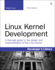
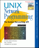
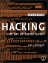

### **Shichao's Notes**

This site documents reading and learning notes of the following books and materials.

  

    
    <gcse:searchbox-only></gcse:searchbox-only>
  

### Books

The following is the primary reading list of books. Each chapter is organized as a single page; the included sections are noted with major concepts, along with personal doubts (with possible solutions figured out afterwards) and summary.

##### [APUE](apue/index.md)

Advanced Programming in the UNIX Environment, 3rd Edition

<small>by W. Richard Stevens and Stephen A. Rago</small>

##### [LKD](lkd/index.md)

")

Linux Kernel Development (3rd Edition)

<small>by Robert Love</small>

#### [UTLK](utlk/index.md)

Understanding the Linux Kernel, Third Edition

<small>by Daniel P. Bovet and Marco Cesati</small>

#### [UNP](unp/index.md)

")

Unix Network Programming, Volume 1: The Sockets Networking API (3rd Edition)

<small>by W. Richard Stevens and Bill Fenner</small>

#### [TCPv1](tcpv1/index.md)

")

TCP/IP Illustrated, Volume 1: The Protocols (2nd Edition)

<small>by Kevin R. Fall and W. Richard Stevens</small>

#### [TCPIP](tcpip/index.md)

The TCP/IP Guide: A Comprehensive, Illustrated Internet Protocols Reference

<small>by Charles M. Kozierok</small>

#### [LSP](lsp/index.md)

")

Linux System Programming: Talking Directly to the Kernel and C Library (Second Edition)

<small>by Robert Love</small>

#### [TLPI](tlpi/index.md)

The Linux Programming Interface

<small>by Michael Kerrisk</small>

#### [GOPL](gopl/index.md)

The Go Programming Language

<small>by Alan A. A. Donovan and Brian W. Kernighan</small>

#### [DevOps](devops/index.md)

DevOps: A Software Architect's Perspective

<small>by Len Bass, Ingo Weber, Liming Zhu</small>

#### [ICND1](icnd1/index.md)

CCENT/CCNA ICND1 640-822 Official Cert Guide, Third Edition

#### [ICND2](icnd2/index.md)

CCNA ICND2 Official Exam Certification Guide, Second Edition

#### [SPEC](spec/index.md)

Systems Performance: Enterprise and the Cloud

<small>by Brendan Gregg</small>

#### [CNAPP](cnapp/index.md)

Content Networking: Architecture, Protocols, and Practice

<small>by Markus Hofmann</small>

#### [HTAE](htae/index.md)

Hacking: The Art of Exploitation, 2nd Edition

<small>by Jon Erickson</small>

### Materials

The following is the supplementary books and materials. Each topic, which may have one or more primary references listed, is included in a single page.

#### [Bash](bash/index.md)

* [The GNU Bash Reference Manual](https://www.gnu.org/software/bash/manual/)

#### [C](c/index.md)

* Patterns in C

#### [Go](golang/index.md)

* The Way To Go: A Thorough Introduction To The Go Programming Language
* [The Go Documentation](https://golang.org/doc/)
* [The Go Programming Language Specification](https://golang.org/ref/spec)

#### [Python](python/index.md)

* Python Essential Reference (4th Edition)

#### [Ruby](ruby/index.md)

* Programming Ruby 1.9 & 2.0: The Pragmatic Programmers' Guide (4th Edition)

#### [x86 Assembly](asm/index.md)

* [Wikibooks](https://en.wikibooks.org/wiki/X86_Assembly)

#### [iptables](iptables/index.md)

* [Iptables Tutorial 1.2.2](http://homes.di.unimi.it/sisop/qemu/iptables-tutorial.pdf)

#### [Nginx](nginx/index.md)

* [nginx documentation](http://nginx.org/en/docs/)
* [NGINX and NGINX Plus Tutorial and Admin Guide](http://nginx.com/resources/admin-guide/)

#### [Vim](vim/index.md)

* Learning the vi and Vim Editors, 7th Edition
* [Learn Vimscript the Hard Way](http://learnvimscriptthehardway.stevelosh.com/)
