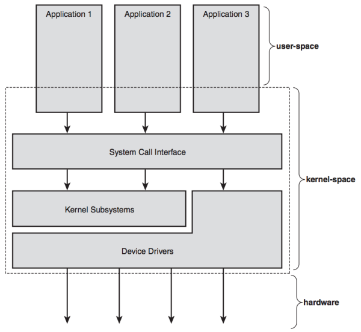
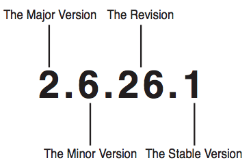

### **Chapter 1. Introduction to the Linux Kernel**

<strong>TODO:</strong> Expand this chapter.

### Overview of Operating Systems and Kernels

In Linux, we can generalize that each processor is doing exactly one of three things at any given moment:

* In user-space, executing user code in a process
* In kernel-space, in process context, executing on behalf of a specific process
* In kernel-space, in interrupt context, not associated with a process, handling an interrupt

### Linux Versus Classic Unix Kernels

Notable differences exist between the Linux kernel and classic Unix systems:

* Linux supports the dynamic loading of kernel modules.Although the Linux kernel is monolithic, it can dynamically load and unload kernel code on demand.
* Linux has symmetrical multiprocessor (SMP) support.
* The Linux kernel is preemptive.
* Linux takes an interesting approach to thread support: It does not differentiate between threads and normal processes.To the kernel, all processes are the same (some just happen to share resources).
* Linux provides an object-oriented device model with device classes, hot-pluggable events, and a user-space device filesystem (sysfs).
* Linux ignores some common Unix features that the kernel developers consider poorly designed, such as STREAMS, or standards that are impossible to cleanly implement.
* Linux is free in every sense of the word

### Linux Kernel Versions

Linux kernels come in two flavors: stable and development.

### The Linux Kernel Development Community

The main forum for this community is the Linux Kernel Mailing List (oft-shortened to *lkml*). Subscription information is available at [http://vger.kernel.org](http://vger.kernel.org).

