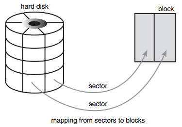

### **Chapter 14. The Block I/O Layer**

**Block devices** are hardware devices distinguished by the random (not necessarily sequential) access of fixed-size chunks of data. The fixed-size chunks of data are called **blocks**. The most common block device is a hard disk, but many other block devices exist, such as floppy drives, Blu-ray readers, and flash memory. Notice how these are all devices on which you mount a filesystem; filesystems are the lingua franca of block devices.

The other basic type of device is a **character device**. Character devices, or *char* devices, are accessed as a stream of sequential data, one byte after another. Example character devices are serial ports and keyboards.

#### Character Device vs. Block Device *

<u>If the hardware device is accessed as a stream of data, it is implemented as a character device. On the other hand, if the device is accessed randomly (nonsequentially), it is a block device.</u>

The difference comes down to whether the device accesses data randomly, in other words, whether the device can *seek* to one position from another. [p289]

* As a driver, the keyboard provides a stream of data. The keyboard driver is thus a char device; the device provides a stream of characters that the user types onto the keyboard.
* A hard drive, conversely, is quite different. The hard drive’s driver might ask to read the contents of one arbitrary block and then read the contents of a different block; the blocks need not be consecutive. The hard disk’s data is accessed randomly, and not as a stream; therefore, the hard disk is a block device.

Managing block devices in the kernel requires more care, preparation, and work than managing character devices. <u>Character devices have only one position, the current one, whereas block devices must be able to navigate back and forth between any location on the media.</u>

The kernel does not have to provide an entire subsystem dedicated to the management of character devices, but block devices receive exactly that. Such a subsystem is a necessity partly because of the complexity of block devices. A large reason for such extensive support is that block devices are quite performance sensitive; getting every last drop out of your hard disk is much more important than squeezing an extra percent of speed out of your keyboard. Furthermore, the complexity of block devices provides a lot of room for such optimizations.

The topic of this chapter is how the kernel manages block devices and their requests. This part of the kernel is known as the **block I/O layer**.

### Anatomy of a Block Device

#### Sector *

The smallest addressable unit on a block device is a [**sector**](https://en.wikipedia.org/wiki/Disk_sector). Sector sizes are powers of two, but 512 bytes is the most common size. The sector size is a physical property of the device, and the sector is the fundamental unit of all block devices; the device cannot address or operate on a unit smaller than the sector, although many block devices can operate on multiple sectors at one time. Most block devices have 512-byte sectors, although other sizes are common. For example, many CD-ROM discs have 2-kilobyte sectors.

#### Block *

The [**block**](https://en.wikipedia.org/wiki/Block_(data_storage)) is the smallest logically addressable unit for software.

The block is an abstraction of the filesystem; filesystems can be
accessed only in multiples of a block. Although the physical device is addressable at the
sector level, the kernel performs all disk operations in terms of blocks.

#### Block vs. Sector *

* The block size can be no smaller than the sector and must be a multiple of a sector, because the device’s smallest addressable unit is the sector.
* The kernel (as with hardware and the sector) needs the block to be a power of two.
* The kernel also requires that a block be no larger than the page size ([Chapter 12](ch12.md) and [Chapter 19](ch19.md)

Therefore, block sizes are a power-of-two multiple of the sector size and are not greater than the page size. Common block sizes are 512 bytes, 1 kilobyte, and 4 kilobytes.

##### **Confusion of block and sector** *

Some people confusingly refer to sectors and blocks with different names:

* Sectors, the smallest addressable unit to the device, are sometimes called "hard sectors" or "device blocks".
* Blocks, the smallest addressable unit to the filesystem, are sometimes referred to as "filesystem blocks" or "I/O blocks".

This chapter continues to call the two notions sectors and blocks, but you should keep these other terms in mind. Below is a diagram of the relationship between sectors and blocks:

[](figure_14.1.png "Figure 14.1 Relationship between sectors and blocks.")

Hard disk related terminology, such as clusters, [cylinders](https://en.wikipedia.org/wiki/Cylinder-head-sector), and heads are specific only to certain block devices and are mostly invisible to user-space software. The reason that the sector is important to the kernel is because all device I/O must be done in units of sectors. In turn, blocks, which is the higher-level concept used by the kernel, are built on top of sectors.

### Buffers and Buffer Heads

When a block is stored in memory (e.g. after a read or pending a write), it is stored in a **buffer**.  Each buffer is associated with exactly one block.The buffer serves as the object that represents a disk block in memory. A block is composed of one or more sectors but is no more than a page in size,  a single page can hold one or more blocks in memory. Because the kernel requires some associated control information to accompany the data (such as from which block device and which specific block the buffer is), each buffer is associated with a descriptor. This descriptor is called a **buffer head** and is of type struct `buffer_head`. The `buffer_head` structure holds all the information that the kernel needs to manipulate buffers and is defined in `<linux/buffer_head.h>` ([include/linux/buffer_head.h](https://github.com/shichao-an/linux/blob/v2.6.34/include/linux/buffer_head.h)).

<small>[include/linux/buffer_head.h#L61](https://github.com/shichao-an/linux/blob/v2.6.34/include/linux/buffer_head.h#L61)</small>

```c
struct buffer_head {
    unsigned long b_state;             /* buffer state flags */
    struct buffer_head *b_this_page;   /* list of page’s buffers */
    struct page *b_page;               /* associated page */
    sector_t b_blocknr;                /* starting block number */
    size_t b_size;                     /* size of mapping */
    char *b_data;                      /* pointer to data within the page */
    struct block_device *b_bdev;       /* associated block device */
    bh_end_io_t *b_end_io;             /* I/O completion */
    void *b_private;                   /* reserved for b_end_io */
    struct list_head b_assoc_buffers;  /* associated mappings */
    struct address_space *b_assoc_map; /* associated address space */
    atomic_t b_count;                  /* use count */
};
```

#### The `b_state` field and `bh_state_bits` enumeration *

The `b_state` field specifies the state of this particular buffer. It can be one or more of the flags in the following table. The legal flags are stored in the `bh_state_bits` ([include/linux/buffer_head.h#L19](https://github.com/shichao-an/linux/blob/v2.6.34/include/linux/buffer_head.h#L19)) enumeration, which is defined in `<linux/buffer_head.h>`.

**Status Flag** | **Meaning**
--------------- | -----------
`BH_Uptodate` | Buffer contains valid data.
`BH_Dirty` | Buffer is dirty. (The contents of the buffer are newer than the contents of the block on disk and therefore the buffer must eventually be written back to disk.)
`BH_Lock` | Buffer is undergoing disk I/O and is locked to prevent concurrent access.
`BH_Req` | Buffer is involved in an I/O request.
`BH_Mapped` | Buffer is a valid buffer mapped to an on-disk block.
`BH_New` | Buffer is newly mapped via `get_block()` and not yet accessed.
`BH_Async_Read` | Buffer is undergoing asynchronous read I/O via `end_buffer_async_read()`.
`BH_Async_Write` | Buffer is undergoing asynchronous write I/O via `end_buffer_async_write()`.
`BH_Delay` | Buffer does not yet have an associated on-disk block (delayed allocation).
`BH_Boundary` | Buffer forms the boundary of contiguous blocks; the next block is discontinuous.
`BH_Write_EIO` | Buffer incurred an I/O error on write.
`BH_Ordered` | Ordered write.
`BH_Eopnotsupp` | Buffer incurred a "not supported" error.
`BH_Unwritten` | Space for the buffer has been allocated on disk but the actual data has not yet been written out.
`BH_Quiet` | Suppress errors for this buffer.

The `bh_state_bits` enumeration also contains a `BH_PrivateStart` flag (as the last value in the list). This is not a valid state flag but instead corresponds to the first usable bit of which other code can make use. All bit values equal to and greater than `BH_PrivateStart` are not used by the block I/O layer proper, so these bits are safe to use by individual drivers who want to store information in the `b_state` field. Drivers can base the bit values of their internal flags off this flag and rest assured that they are not encroaching on an official bit used by the block I/O layer.

#### `b_count`

The `b_count` field is the buffer’s usage count. The value is incremented and decremented by two inline functions defined in `<linux/buffer_head.h>`:

<small>[include/linux/buffer_head.h#L252](https://github.com/shichao-an/linux/blob/v2.6.34/include/linux/buffer_head.h#L252)</small>

```c
static inline void get_bh(struct buffer_head *bh)
{
        atomic_inc(&bh->b_count);
}

static inline void put_bh(struct buffer_head *bh)
{
        smp_mb__before_atomic_dec();
        atomic_dec(&bh->b_count);
}
```

* Before manipulating a buffer head, you must increment its reference count via `get_bh()` to ensure that the buffer head is not deallocated out from under you.
* When finished with the buffer head, decrement the reference count via `put_bh()`.

#### Physical block, page and buffer *

* The physical block on disk to which a given buffer corresponds is the `b_blocknr`-th logical block on the block device described by `b_bdev`.
* The physical page in memory to which a given buffer corresponds is the page pointed to by `b_page`. More specifically, `b_data` is a pointer directly to the block (that exists somewhere in `b_page`), which is `b_size` bytes in length. Therefore, the block is located in memory starting at address `b_data` and ending at address (`b_data` + `b_size`).

The purpose of a buffer head is to describe this mapping between the on-disk block and the physical in-memory buffer (which is a sequence of bytes on a specific page). Acting as a descriptor of this buffer-to-block mapping is the data structure’s only role in the kernel.
