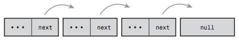
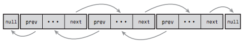

### **Chapter 6. Kernel Data Structures**

This chapter introduces several built-in data structures for use in Linux kernel code: [p85]

* Linked lists
* Queues
* Maps
* Binary trees

These generic data structures are provided to encourage code reuse. Kernel developers should use these data structures whenever possible and not "roll your own" solutions.

### Linked Lists

As the simplest and most common data structure in the Linux kernel, a **linked list** is a data structure that allows the storage and manipulation of a variable number of *elements*, called the *nodes* of the list.

Unlike in a static array, the elements in a linked list are dynamically created and inserted into the list, which enables the management of a varying number of elements unknown at compile time. The elements do not necessarily occupy contiguous regions in memory and thus need to be linked together (each element in the list contains a pointer to the *next* element).

#### Singly and Doubly Linked Lists

The simplest data structure for a linked list is like:

```c
/* an element in a linked list */
struct list_element {
    void *data; /* the payload */
    struct list_element *next; /* pointer to the next element */
};
```
The following figure shows a linked list:

[](figure_6.1.png "Figure 6.1 A singly linked list.")

* A **singly linked lists**: each element does not have a pointer to the *previous* element.
* A **doubly linked lists**: each element also contains a pointer to the *previous* element (linked both forward and backward).

A data structure representing a doubly linked list would look similar to this:

```c
/* an element in a linked list */
struct list_element {
    void *data; /* the payload */
    struct list_element *next; /* pointer to the next element */
    struct list_element *prev; /* pointer to the previous element */
};
```

The following figure shows doubly linked list:

[](figure_6.2.png "Figure 6.2 A doubly linked list.")

#### Circular Linked Lists

Normally, the last element in a linked list has no next element, so it is set to point to a special value, such as `NULL`. In a **circular linked list**, last element does not point to a special value, but points back to the first value.

<u>Circular linked lists can come in both doubly and singly linked versions. In a circular doubly linked list, the first node’s "previous" pointer points at the last node.</u>

The following two figures are singly and doubly circular linked lists, respectively:

[](figure_6.3.png "Figure 6.3 A circular singly linked list.")
[](figure_6.4.png "Figure 6.4 A circular doubly linked list.")

#### Moving Through a Linked List

To move through a linked list, simply follow the next pointer of an element, and visit the next element. This is linear movement.

<u>Linked lists are ill-suited for use cases where random access is an important operation.</u> Instead, you use linked lists when iterating over the whole list is important and the dynamic addition and removal of elements is required.

In linked list implementations:

* The first element is often represented by a special pointer, *head*, that enables easy access to the "start" of the list.
* In a noncircular-linked list, the last element is delineated by its next pointer being `NULL`.
* In a circular-linked list, the last element is delineated because it points to the *head* element.

[p87-88]

#### The Linux Kernel’s Implementation

The Linux kernel’s implementation is unique, in comparison to most linked list implementations including those described in the previous sections.

The common pattern for storing this structure in a linked list is to embed the list pointer in the structure. For example, to describe that member of the [*Canidae*](https://en.wikipedia.org/wiki/Canidae) family:

```c
struct fox {
    unsigned long tail_length; /* length in centimeters of tail */
    unsigned long weight; /* weight in kilograms */
    bool is_fantastic; /* is this fox fantastic? */
    struct fox *next; /* next fox in linked list */
    struct fox *prev; /* previous fox in linked list */
};
```

The Linux kernel approach is different. Instead of turning the structure into a linked list, the Linux approach is to "<u>embed a linked list node in the structure</u>".

##### **The Linked List Structure**

The linked-list code is declared in the header file `<linux/list.h>` ([include/linux/list.h#L19](https://github.com/shichao-an/linux/blob/v2.6.34/include/linux/list.h#L19)) and the data structure is simple:

```c
struct list_head {
    struct list_head *next
    struct list_head *prev;
};
```

The utility is in *how* the `list_head` structure is used:

```c
struct fox {
    unsigned long tail_length; /* length in centimeters of tail */
    unsigned long weight; /* weight in kilograms */
    bool is_fantastic; /* is this fox fantastic? */
    struct list_head list; /* list of all fox structures */
};
```

With this, `list.next` in fox points to the next element, and `list.prev` in fox points to the previous.

The kernel provides a family of routines to manipulate linked lists (for example, the `list_add()` method adds a new node to an existing linked list). These methods accept only `list_head` structures. <u>Using the macro `container_of()`, we can easily find the parent structure containing any given member variable. In C, the offset of a given variable into a structure is fixed by the ABI at compile time.</u>

<small>[include/linux/kernel.h#L709](https://github.com/shichao-an/linux/blob/v2.6.34/include/linux/kernel.h#L709)</small>

```c
#define container_of(ptr, type, member) ({ \
        const typeof( ((type *)0)->member ) *__mptr = (ptr); \
        (type *)( (char *)__mptr - offsetof(type,member) );})
```

Using `container_of()`, we can define a simple function to return the parent structure containing any `list_head`:

<small>[include/linux/list.h#L348](https://github.com/shichao-an/linux/blob/v2.6.34/include/linux/list.h#L348)</small>

```c
#define list_entry(ptr, type, member) \
        container_of(ptr, type, member)
```

### Queues

### Maps

### Binary Trees
