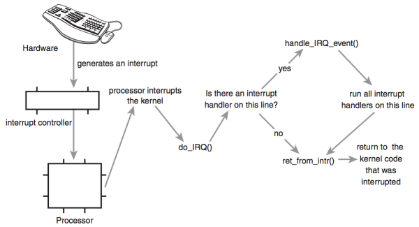

### **Chapter 7. Interrupts and Interrupt Handlers**

Processors can be orders of magnitudes faster than the hardware they talk to; it is not ideal for the kernel to issue a request and wait for a response from slower hardware. Instead, the kernel must be free to go and handle other work, dealing with the hardware only after that hardware has actually completed its work. [p113]

How can the processor work with hardware without impacting the machine's overall performance? As one solution, **polling** incurs overhead, because it must occur repeatedly regardless of whether the hardware is active or ready. A better solution is to provide a mechanism for the hardware to signal to the kernel when attention is needed. This mechanism is called an **interrupt**. This chapter dicusses interrupts and how the kernel responds to them, with special functions called **interrupt handlers**.

### Interrupts

* **Interrupts enable hardware to signal to the processor.**
    * For example, as you type, the keyboard controller (the hardware device that manages the keyboard) issues an electrical signal to the processor to alert the operating system to newly available key presses. These electrical signals are interrupts. The processor receives the interrupt and signals the operating system to enable the operating system to respond to the new data.
* **Hardware devices generate interrupts asynchronously** (with respect to the processor clock). Consequently, the kernel can be interrupted at any time to process interrupts.

An interrupt is produced by electronic signals from hardware devices and directed into input pins on an interrupt controller (a simple chip that multiplexes multiple interrupt lines into a single line to the processor):

1. Upon receiving an interrupt, the interrupt controller sends a signal to the processor.
2. The processor detects this signal and interrupts its current execution to handle the interrupt.
3. The processor can then notify the operating system that an interrupt has occurred, and the operating system can handle the interrupt appropriately.

Different devices are associated with different interrupts using a <u>unique value</u> associated with each interrupt. This enables the operating system to differentiate between interrupts and to know which hardware device caused which interrupt. In turn, the operating system can service each interrupt with its corresponding handler.

These interrupt values are often called [**interrupt request**](https://en.wikipedia.org/wiki/Interrupt_request_(PC_architecture)) (**IRQ**) lines:

* Each IRQ line is assigned a numeric value. For example, on the classic PC, IRQ zero is the timer interrupt and IRQ one is the keyboard interrupt.
* Some interrupts are dynamically assigned, such as interrupts associated with devices on the PCI bus. Other non-PC architectures have similar dynamic assignments for interrupt values.
* The kernel knows that a specific interrupt is associated with a specific device. The hardware then issues interrupts to get the kernel's attention.

#### Exceptions and Interrupts *

**Exceptions** are often discussed at the same time as interrupts. Unlike interrupts, exceptions occur synchronously with respect to the processor clock; they are often called **synchronous interrupts**. Exceptions are produced by the processor while executing instructions either in response to a programming error (e.g. divide by zero) or abnormal conditions that must be handled by the kernel (e.g. a page fault). Because many processor architectures handle exceptions in a similar manner to interrupts, the kernel infrastructure for handling the two is similar.

Simple definitions of the two:

* **Interrupts**: asynchronous interrupts generated by hardware.
* **Exceptions**: synchronous interrupts generated by the processor.

System calls (one type of exception) on the x86 architecture are implemented by the issuance of a software interrupt, which traps into the kernel and causes execution of a special system call handler. Interrupts work in a similar way, except hardware (not software) issues interrupts.

### Interrupt Handlers

An [**interrupt handler**](https://en.wikipedia.org/wiki/Interrupt_handler) or **interrupt service routine** (ISR) is the function that the kernel runs in response to a specific interrupt:

* **Each device that generates interrupts has an associated interrupt handler.**
* **The interrupt handler for a device is part of the device's [**driver**](https://en.wikipedia.org/wiki/Device_driver)** (the kernel code that manages the device).

In Linux, interrupt handlers are normal C functions, which match a specific prototype and thus enables the kernel to pass the handler information in a standard way. What differentiates interrupt handlers from other kernel functions is that the kernel invokes them in response to interrupts and that they run in a special context called **interrupt context**. This special context is occasionally called **atomic context** because code executing in this context is unable to block.

Because an interrupt can occur at any time, an interrupt handler can be executed at any time. It is imperative that the handler runs quickly, to resume execution of the interrupted code as soon as possible. It is important that

* To the hardware: the operating system services the interrupt without delay.
* To the rest of the system: the interrupt handler executes in as short a period as possible.

At the very least, an interrupt handler's job is to acknowledge the interrupt's receipt to the hardware. However, interrupt handlers can oftern have a large amount of work to perform.

### Top Halves Versus Bottom Halves

These two goals of an interrupt handler conflict with one another:

* Execute quickly
* Perform a large amount of work

Because of these competing goals, the processing of interrupts is split into two parts, or **halves**:

* **Top half.** The interrupt handler is the top half.  The top half is run immediately upon receipt of the interrupt and performs only the work that is time-critical, such as acknowledging receipt of the interrupt or resetting the hardware.
* **Bottom half.** Work that can be performed later is deferred until the bottom half. The bottom half runs in the future, at a more convenient time, with all interrupts enabled.

Linux provides various mechanisms for implementing bottom halves (discussed in [Chapter 8](ch8.md)).

For example using the network card:

1. When network cards receive packets from the network, the network cards immediately issue an interrupt. This optimizes network throughput and latency and avoids timeouts. [p115]
2. The kernel responds by executing the network card's registered interrupt.
3. The interrupt runs, acknowledges the hardware, copies the new networking packets into main memory, and readies the network card for more packets. These jobs are the important, time-critical, and hardware-specific work.
    * The kernel generally needs to quickly copy the networking packet into main memory because the network data buffer on the networking card is fixed and miniscule in size, particularly compared to main memory. Delays in copying the packets can result in a buffer overrun, with incoming packets overwhelming the networking card's buffer and thus packets being dropped.
    * After the networking data is safely in the main memory, the interrupt's job is done, and it can return control of the system to whatever code was interrupted when the interrupt was generated.
4. The rest of the processing and handling of the packets occurs later, in the bottom half.

This chapter discusses the top half. The next chapter covers the bottom.

### Registering an Interrupt Handler

Each device has one associated driver. If that device uses interrupts (and most do), that driver must register one interrupt handler.

Drivers can register an interrupt handler and enable a given interrupt line for handling with the function `request_irq()`, which is declared in `<linux/interrupt.h>`:

<small>[include/linux/interrupt.h#L117](https://github.com/shichao-an/linux/blob/v2.6.34/include/linux/interrupt.h#L117)</small>

```c
/* request_irq: allocate a given interrupt line */
int request_irq(unsigned int irq,
                irq_handler_t handler,
                unsigned long flags,
                const char *name,
                void *dev)
```

* The first parameter, `irq`, specifies the interrupt number to allocate
    * For some devices (e.g. legacy PC devices such as the system timer or keyboard), this value is typically hard-coded.
    * For most other devices, it is probed or otherwise determined programmatically and dynamically.
* The second parameter, `handler`, is a function pointer to the actual interrupt handler that services this interrupt. This function is invoked whenever the operating system receives the interrupt.

<small>[include/linux/interrupt.h#L80](https://github.com/shichao-an/linux/blob/v2.6.34/include/linux/interrupt.h#L80)</small>
```c
typedef irqreturn_t (*irq_handler_t)(int, void *);
```

Note the specific prototype of the handler function: It takes two parameters and has a return value of `irqreturn_t`.

#### Interrupt Handler Flags

The third parameter, `flags`, can be either zero or a bit mask of one or more of the flags defined in `<linux/interrupt.h>`. The most important of these flags are:

<small>[include/linux/interrupt.h#L56](https://github.com/shichao-an/linux/blob/v2.6.34/include/linux/interrupt.h#L56)</small>

* `IRQF_DISABLED`.
    * When set, this flag instructs the kernel to disable all interrupts when executing this interrupt handler.
    * When unset, interrupt handlers run with all interrupts except their own enabled.

    Most interrupt handlers do not set this flag, as disabling all interrupts is bad form. Its use is reserved for performance-sensitive interrupts that execute quickly. This flag is the current manifestation of the `SA_INTERRUPT` flag, which in the past distinguished between "fast" and "slow" interrupts.

* `IRQF_SAMPLE_RANDOM`. This flag specifies that interrupts generated by this device should contribute to the kernel [entropy pool](https://en.wikipedia.org/wiki/Hardware_random_number_generator#Estimating_entropy). The kernel entropy pool provides truly random numbers derived from various random events. If this flag is specified, the timing of interrupts from this device are fed to the pool as entropy. Do not set this if your device issues interrupts at a predictable rate (e.g. the system timer) or can be influenced by external attackers (e.g. a networking device). On the other hand, most other hardware generates interrupts at nondeterministic times and is therefore a good source of entropy.
* `IRQF_TIMER`. This flag specifies that this handler processes interrupts for the system timer.
* `IRQF_SHARED`. This flag specifies that the interrupt line can be shared among multiple interrupt handlers. Each handler registered on a given line must specify this flag; otherwise, only one handler can exist per line.

The fourth parameter, `name`, is name of the device associated with the interrupt. For example, this value for the keyboard interrupt on a PC is "keyboard". These text names are used by `/proc/irq` and `/proc/interrupts`.

The fifth parameter, `dev`, is used for shared interrupt lines. When an interrupt handler is freed ([discussed later](#freeing-an-interrupt-handler)), `dev` provides a unique cookie to enable the removal of only the desired interrupt handler from the interrupt line. Without this parameter, it would be impossible for the kernel to know which handler to remove on a given interrupt line. You can pass `NULL` here if the line is not shared, but you must pass a unique cookie if your interrupt line is shared. This pointer is also passed into the interrupt handler on each invocation. A common practice is to pass the driver's device structure. This pointer is unique and might be useful to have within the handlers.

`request_irq()` returns zero on success and nonzero value indicates an error, in which case the specified interrupt handler was not registered. A common error is `-EBUSY`, which denotes that the given interrupt line is already in use (and either the current user or you did not specify `IRQF_SHARED`).

`request_irq()` cannot be called from interrupt context (other situations where code cannot block), because it can block.  It is a common mistake to call `request_irq()` when it is unsafe to sleep. On registration, an entry corresponding to the interrupt is created in `/proc/irq`. The function `proc_mkdir()` creates new procfs entries. This function calls `proc_create()` to set up the new procfs entries, which in turn calls `kmalloc()` to allocate memory. `kmalloc()` can sleep ([Chapter 12](ch12.md#kmalloc)).

#### An Interrupt Example

In a driver, requesting an interrupt line and installing a handler is done via `request_irq()`:

```c
if (request_irq(irqn, my_interrupt, IRQF_SHARED, "my_device", my_dev)) {
    printk(KERN_ERR "my_device: cannot register IRQ %d\n", irqn);
    return -EIO;
}
```

In this example:

* `irqn` is the requested interrupt line
* `my_interrupt` is the handler;
* `IRQF_SHARED` specifies that the line can be shared;
* The device is named `my_device`;
* We passed `my_dev` for `dev`.

On failure, the code prints an error and returns. If the call returns zero, the handler has been successfully installed. From that point forward, the handler is invoked in response to an interrupt. It is important to initialize hardware and register an interrupt handler in the proper order to prevent the interrupt handler from running before the device is fully initialized.

#### Freeing an Interrupt Handler

When your driver unloads, you need to unregister your interrupt handler and disable the interrupt line, by calling:

<small>[include/linux/interrupt.h#L147](https://github.com/shichao-an/linux/blob/v2.6.34/include/linux/interrupt.h#L147)</small>

```c
void free_irq(unsigned int irq, void *dev)
```

* If the specified interrupt line is not shared, this function removes the handler and disables the line.
* If the interrupt line is shared, the handler identified via `dev` is removed, but the interrupt line is disabled only when the last handler is removed. With shared interrupt lines, a unique cookie is required to differentiate between the multiple handlers that can exist on a single line and enable `free_irq()` to remove only the correct handler.

In either case (shared or unshared), if `dev` is non-`NULL`, it must match the desired handler. A call to `free_irq()` must be made from process context.

The following table reviews the functions for registering and deregistering an interrupt handler.

Function | Description
-------- | -----------
`request_irq()` | Register a given interrupt handler on a given interrupt line.
`free_irq()` | Unregister a given interrupt handler; if no handlers remain on the line, the given interrupt line is disabled.

### Writing an Interrupt Handler

The following is a declaration of an interrupt handler, which matches the prototype of the `handler` argument given to `request_irq()`:

```c
static irqreturn_t intr_handler(int irq, void *dev)
```

* The first parameter, `irq`, is the numeric value of the interrupt line the handler is servicing. This value is not used very often, except in printing log messages.
    * `irq` was useful before version 2.0 of the Linux kernel, when there was not a `dev` parameter and `irq` was used to differentiate between multiple devices using the same driver and therefore the same interrupt handler, e.g. a computer with multiple hard drive controllers of the same type. [p118-119]
* The second parameter, `dev`, is a generic pointer to the same `dev` given to `request_irq()` when the interrupt handler was registered. [p119]
    * It can be a unique value (which is required to support sharing) to act as a cookie to differentiate between multiple devices potentially using the same interrupt handler.
    * It might also point to a structure of use to the interrupt handler. This structure is typically the `device` structure, which is both unique to each device and potentially useful to have within the handler.

The return value of an interrupt handler is the special type `irqreturn_t`, which has two special values:

* `IRQ_NONE`, returned when the interrupt handler detects an interrupt for which its device was not the originator.
* `IRQ_HANDLED`, returned if the interrupt handler was correctly invoked, and its device caused the interrupt.

Alternatively, `IRQ_RETVAL(val)` may be used. If `val` is nonzero, this macro returns `IRQ_HANDLED`. Otherwise, the macro returns `IRQ_NONE`.

These special values are used to let the kernel know whether devices are issuing spurious (unrequested) interrupts. If all the interrupt handlers on a given interrupt line return `IRQ_NONE`, then the kernel can detect the problem.

The return type `irqreturn_t` which is simply an `int`. This value provides backward compatibility with earlier kernels, which did not have this feature. Before 2.6, interrupt handlers returned void. <u>Drivers may simply typedef `irqreturn_t` to `void`</u> and define the different return values to no-ops and then work in 2.4 without further modification.

The interrupt handler is normally `static` because it is never called directly from another file.

The role of the interrupt handler depends entirely on the device and its reasons for issuing the interrupt.

* At a minimum, most interrupt handlers need to provide acknowledgment to the device that they received the interrupt.
* More complex devices need to additionally send and receive data and perform extended work in the interrupt handler. The extended work is pushed as much as possible into the bottom half handler.

#### Reentrancy and Interrupt Handlers *

Interrupt handlers in Linux need not be reentrant. <u>When a given interrupt handler is executing, the corresponding interrupt line is masked out on all processors, preventing another interrupt on the same line from being received.</u> Normally all other interrupts are enabled, so other interrupts are serviced, but the current line is always disabled. Consequently, the same interrupt handler is never invoked concurrently to service a nested interrupt. This greatly simplifies writing your interrupt handler.

#### Shared Handlers

A shared handler is similar to a nonshared handler, but has three main differences:

* The `IRQF_SHARED` flag must be set in the flags argument to `request_irq()`.
* The `dev` argument must be unique to each registered handler.
    * A pointer to any per-device structure is sufficient: a common choice is the `device` structure as it is both unique and potentially useful to the handler.
    * It cannot be `NULL` for a shared handler.
* The interrupt handler must be capable of distinguishing whether its device actually generated an interrupt, which requires both hardware support and associated logic in the interrupt handler; otherwise the interrupt handler would not know whether its associated device or some other device sharing the line caused the interrupt.

All drivers sharing the interrupt line must meet the previous requirements. If any one device does not share fairly, none can share the line. The call to `request_irq()` with `IRQF_SHARED` specified can succeed only if:

* The interrupt line is currently not registered, or,
* All registered handlers on the line also specified `IRQF_SHARED`.

Shared handlers, however, can mix usage of `IRQF_DISABLED`.

<u>When the kernel receives an interrupt, it invokes sequentially each registered handler on the line.</u> Therefore, it is important that the handler be capable of distinguishing whether it generated a given interrupt. The handler must quickly exit if its associated device did not generate the interrupt. This requires the hardware device to have a status register (or similar mechanism) that the handler can check. Most hardware has such a feature.

#### A Real-Life Interrupt Handler

The [real-time clock](https://en.wikipedia.org/wiki/Real-time_clock) (RTC) driver is a real interrupt handler, which can be found in [`drivers/char/rtc.c`](https://github.com/shichao-an/linux/blob/v2.6.34/drivers/char/rtc.c).

It is a device (separate from the system timer) which can do the following:

* Sets the system clock.
* Provides an alarm.
* Supplies a periodic timer.

On most architectures, the system clock is set by writing the desired time into a specific register or [I/O range](https://en.wikipedia.org/wiki/Input/output_base_address). An alarm or periodic timer functionality is normally implemented via interrupt. The interrupt is equivalent to a real-world clock alarm and the receipt of the interrupt is analogous to a buzzing alarm.

When the RTC driver loads, the function [`rtc_init()`](https://github.com/shichao-an/linux/blob/v2.6.34/drivers/char/rtc.c#L953) is invoked to initialize the driver, which includes registering the interrupt handler:

```c
/* register rtc_interrupt on rtc_irq */
if (request_irq(rtc_irq, rtc_interrupt, IRQF_SHARED, "rtc", (void *)&rtc_port)) {
        printk(KERN_ERR "rtc: cannot register IRQ %d\n", rtc_irq);
        return -EIO;
}
```

In this example:

* The interrupt line is stored in `rtc_irq`. This variable is set to the RTC interrupt for a given architecture. On a PC, the RTC is located at IRQ 8.
* The second parameter `rtc_interrupt` is the interrupt handler, which shares the interrupt line with other handlers with `IRQF_SHARED` flag.
* The fourth parameter indicates that the driver name is `rtc`.
* Because this device shares the interrupt line, it passes a unique per-device value for `dev`.

The handler code is:

<small>[drivers/char/rtc.c#L239](https://github.com/shichao-an/linux/blob/v2.6.34/drivers/char/rtc.c#L239)</small>

```c
static irqreturn_t rtc_interrupt(int irq, void *dev_id)
{
	/*
	 *	Can be an alarm interrupt, update complete interrupt,
	 *	or a periodic interrupt. We store the status in the
	 *	low byte and the number of interrupts received since
	 *	the last read in the remainder of rtc_irq_data.
	 */

	spin_lock(&rtc_lock);
	rtc_irq_data += 0x100;
	rtc_irq_data &= ~0xff;
	if (is_hpet_enabled()) {
		/*
		 * In this case it is HPET RTC interrupt handler
		 * calling us, with the interrupt information
		 * passed as arg1, instead of irq.
		 */
		rtc_irq_data |= (unsigned long)irq & 0xF0;
	} else {
		rtc_irq_data |= (CMOS_READ(RTC_INTR_FLAGS) & 0xF0);
	}

	if (rtc_status & RTC_TIMER_ON)
		mod_timer(&rtc_irq_timer, jiffies + HZ/rtc_freq + 2*HZ/100);

	spin_unlock(&rtc_lock);

	/* Now do the rest of the actions */
	spin_lock(&rtc_task_lock);
	if (rtc_callback)
		rtc_callback->func(rtc_callback->private_data);
	spin_unlock(&rtc_task_lock);
	wake_up_interruptible(&rtc_wait);

	kill_fasync(&rtc_async_queue, SIGIO, POLL_IN);

	return IRQ_HANDLED;
}
```

This function is invoked whenever the machine receives the RTC interrupt.

1. Note the spin lock calls:
    * The first set ensures that `rtc_irq_data` is not accessed concurrently by another processor on an SMP machine. The `rtc_irq_data` variable is an `unsigned long` that stores information about the RTC and is updated on each interrupt to reflect the status of the interrupt.
    * The second set protects `rtc_callback`, similarly to the first one. Locks are discussed in [Chapter 10 Kernel Synchronization Methods](ch10.md)
2. If an RTC periodic timer is set, it is updated via `mod_timer()`. Timers are discussed in [Chapter 11 Timers and Time Management](ch11.md).
3. The code under the comment "now do the rest of the actions" executes a possible preset callback function.The RTC driver enables a callback function to be registered and executed on each RTC interrupt.
4. This function returns `IRQ_HANDLED` to signify that it properly handled this device. <u>Because the interrupt handler does not support sharing, and there is no mechanism for the RTC to detect a spurious interrupt, this handler always returns `IRQ_HANDLED`.</u>

### Interrupt Context

When executing an interrupt handler, the kernel is in **interrupt context**.

#### Difference from the process context *

As discussed in [Chapter 3](ch3.md), the [process context](ch3.md#process-context) is the mode of operation the kernel is in while it is executing on behalf of a process, such as executing a system call or running a kernel thread.

* In process context, the `current` macro points to the associated task.
* Since a process is coupled to the kernel in process context, process context can sleep or otherwise invoke the scheduler.

Interrupt context is not associated with a process.

* <u>The `current` macro is not relevant, though it points to the interrupted process.</u>
* Without a backing process, interrupt context cannot sleep and cannot reschedule. Therefore, you cannot call certain functions from interrupt context. If a function sleeps, you cannot use it from your interrupt handler: this limits the functions that can be called from an interrupt handler.

Interrupt context is time-critical, because the interrupt handler interrupts other code.

* It should be kept in mind that the interrupt handler has interrupted other code (possibly even another interrupt handler on a different line). Due to asynchronous nature, it is imperative that all interrupt handlers be as quick and as simple as possible.
* As much as possible, work should be pushed out from the interrupt handler and performed in a bottom half, which runs at a more convenient time.

#### Stacks of an interrupt handler *

The setup of an interrupt handler's stacks is a configuration option.

* Historically, interrupt handlers did not receive their own stacks. Instead, they would share the stack of the process that they interrupted.
    * Note that <u>a process is always running. When nothing else is schedulable, the idle task runs.</u>
    * The kernel stack is two pages in size:
        * 8KB on 32-bit architectures.
        * 16KB on 64-bit architectures.
    * Because of sharing the stack, interrupt handlers must be exceptionally frugal with what data they allocate there. [p122]
* Early in the 2.6 kernel process, an option was added to reduce the stack size from two pages to one, providing only a 4KB stack on 32-bit system, and interrupt handlers were given their own stack, one stack per processor, one page in size. This stack is referred to as the **interrupt stack**.
    * Although the total size of the interrupt stack is half that of the original shared stack, the average stack space available is greater because interrupt handlers get the full page of memory to themselves, because previously every process on the system needed two pages of contiguous, nonswappable kernel memory.

Your interrupt handler should not care what stack setup is in use or what the size of the kernel stack is. Always use an absolute minimum amount of stack space.

### Implementing Interrupt Handlers

The implementation of the interrupt handling system in Linux is architecture-dependent. The implementation depends on the processor, the type of interrupt controller used, and the design of the architecture and machine.

The following figure is a diagram of the path an interrupt takes through hardware and the kernel.

[](figure_7.1.png "Figure 7.1 The path that an interrupt takes from hardware and on through the kernel.")

#### Interrupt from a device to the processor *

1. A device issues an interrupt by sending an electric signal over its bus to the [interrupt controller](https://en.wikipedia.org/wiki/Programmable_Interrupt_Controller).
2. If the interrupt line is enabled (they can be masked out), the interrupt controller sends the interrupt to the processor.
    * In most architectures, this is accomplished by an electrical signal sent over a special pin to the processor.
3. If interrupts are not disabled in the processor, the processor immediately stops what it is doing, disables the interrupt system, and jumps to a predefined location in memory and executes the code located there. This predefined point is set up by the kernel and is the entry point for interrupt handlers.

#### Interrupt in the kernel *

The interrupt in the kernel begins at this predefined entry point (which is similar to system calls that enter the kernel through a predefined exception handler):

1. For each interrupt line, the processor jumps to a unique location in memory and executes the code located there. In this manner, the kernel knows the IRQ number (the interrupt value) of the incoming interrupt.
2. The initial entry point (assembly entry routine) saves the interrupt value and stores the current register values of the interrupted task on the stack.
3. Then, the kernel calls `do_IRQ()`.

From this point, most of the interrupt handling code is written in C, but is still architecture-dependent.

The `do_IRQ()` function is declared as ([kernel/irq/handle.c#L449](https://github.com/shichao-an/linux/blob/v2.6.34/kernel/irq/handle.c#L449)):

```c
unsigned int do_IRQ(struct pt_regs regs)
```

1. Because the [C calling convention](https://en.wikipedia.org/wiki/X86_calling_conventions#cdecl) places function arguments at the top of the stack, the `pt_regs` structure contains the initial register values and the interrupt value, which were previously saved on the stack in the assembly entry routine. `do_IRQ()` can extract the interrupt value.
2. After the interrupt line is calculated, `do_IRQ()` acknowledges the receipt of the interrupt and disables interrupt delivery on the line.

On normal PC machines, these operations are handled by `mask_and_ack_8259A()` ([arch/x86/kernel/i8259.c#L147](https://github.com/shichao-an/linux/blob/master/arch/x86/kernel/i8259.c#L147)).

Next, `do_IRQ()` ensures that a valid handler is registered on the line and that it is enabled and not currently executing. If so, it calls `handle_IRQ_event()`, defined in [kernel/irq/handle.c](https://github.com/shichao-an/linux/blob/v2.6.34/kernel/irq/handle.c#L368), to run the installed interrupt handlers for the line.

<small>[kernel/irq/handle.c#L368](https://github.com/shichao-an/linux/blob/v2.6.34/kernel/irq/handle.c#L368)</small>

```c
/**
 * handle_IRQ_event - irq action chain handler
 * @irq:	the interrupt number
 * @action:	the interrupt action chain for this irq
 *
 * Handles the action chain of an irq event
 */
irqreturn_t handle_IRQ_event(unsigned int irq, struct irqaction *action)
{
	irqreturn_t ret, retval = IRQ_NONE;
	unsigned int status = 0;

	if (!(action->flags & IRQF_DISABLED))
		local_irq_enable_in_hardirq();

	do {
		trace_irq_handler_entry(irq, action);
		ret = action->handler(irq, action->dev_id);
		trace_irq_handler_exit(irq, action, ret);

		switch (ret) {
		case IRQ_WAKE_THREAD:
			/*
			 * Set result to handled so the spurious check
			 * does not trigger.
			 */
			ret = IRQ_HANDLED;

			/*
			 * Catch drivers which return WAKE_THREAD but
			 * did not set up a thread function
			 */
			if (unlikely(!action->thread_fn)) {
				warn_no_thread(irq, action);
				break;
			}

			/*
			 * Wake up the handler thread for this
			 * action. In case the thread crashed and was
			 * killed we just pretend that we handled the
			 * interrupt. The hardirq handler above has
			 * disabled the device interrupt, so no irq
			 * storm is lurking.
			 */
			if (likely(!test_bit(IRQTF_DIED,
					     &action->thread_flags))) {
				set_bit(IRQTF_RUNTHREAD, &action->thread_flags);
				wake_up_process(action->thread);
			}

			/* Fall through to add to randomness */
		case IRQ_HANDLED:
			status |= action->flags;
			break;

		default:
			break;
		}

		retval |= ret;
		action = action->next;
	} while (action);

	if (status & IRQF_SAMPLE_RANDOM)
		add_interrupt_randomness(irq);
	local_irq_disable();

	return retval;
}
```

1. Since the processor disabled interrupts, they are turned back on if `IRQF_DISABLED` was not specified during the handler's registration.
    * IRQF_DISABLED specifies that the handler must be run with interrupts disabled.
2. Each potential handler is executed in a loop. If this line is not shared, the loop terminates after the first iteration. Otherwise, all handlers are executed.
3. `add_interrupt_randomness()` is called if `IRQF_SAMPLE_RANDOM` was specified during registration. This function uses the timing of the interrupt to generate entropy for the [random number generator](https://en.wikipedia.org/wiki/Random_number_generation).
4. Interrupts are again disabled (`do_IRQ()` expects them still to be disabled) and the function returns.

Back in `do_IRQ()`, the function cleans up and returns to the initial entry point, which then jumps to `ret_from_intr`().

The routine `ret_from_intr()` ([arch/x86/kernel/entry_64.S#L820](https://github.com/shichao-an/linux/blob/v2.6.34/arch/x86/kernel/entry_64.S#L820)) is written in assembly, as with the initial entry code. This routine checks whether a reschedule is pending (this implies that `need_resched` is set, as discussed in [Chapter 4](ch4.md)):

* If a reschedule is pending:
    * If the kernel is returning to user-space (that is, the interrupt interrupted a user process), `schedule()` is called.
    * If the kernel is returning to kernel-space (that is, the interrupt interrupted the kernel itself), `schedule()` is called only if the `preempt_count` is zero (see [kernel preemption](ch4.md#kernel-preemption)). Otherwise it is not safe to preempt the kernel.
* After `schedule()` returns, or if there is no work pending, the initial registers are restored and the kernel resumes whatever was interrupted.

On x86, the initial assembly routines are located in [arch/x86/kernel/entry_64.S](https://github.com/shichao-an/linux/blob/v2.6.34/arch/x86/kernel/entry_64.S) ([entry_32.S](https://github.com/shichao-an/linux/blob/v2.6.34/arch/x86/kernel/entry_32.S) for 32-bit x86) and the C methods are located in [arch/x86/kernel/irq.c](https://github.com/shichao-an/linux/blob/v2.6.34/arch/x86/kernel/irq.c). Other supported architectures are similar.


### Doubts and Solution

#### Verbatim

##### **p119 on interrupt handlers**

> The interrupt handler is normally `static` because it is never called directly from another file.

<span class="text-danger">Question</span>: What does it mean?

##### **p120 on shared handlers**

> Shared handlers, however, can mix usage of `IRQF_DISABLED`.

<span class="text-danger">Question</span>: What does it mean?
