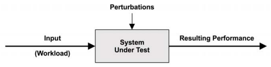
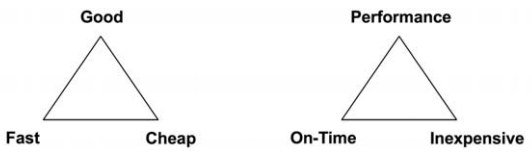
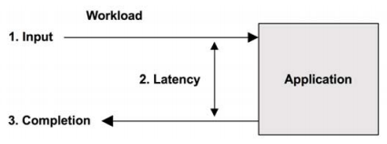
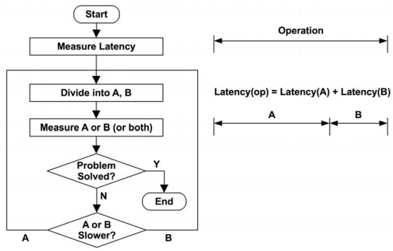

### **Chapter 2. Methodology**

Performance issues can arise from software, hardware, and any component along the data path. Methodologies help us approach complex systems by showing where to start and what steps to take to locate and analyze performance issues. [p15]

### Terminology

The following are key terms for systems performance. Later chapters provide additional terms and describe some of these in different contexts.

* **IOPS**: Input/output operations per second is a measure of the rate of data transfer operations.
    * For disk I/O, IOPS refers to reads and writes per second.
* [**Throughput**](https://en.wikipedia.org/wiki/Throughput): the rate of work performed. Especially in communications, the term is used to refer to the [data rate](https://en.wikipedia.org/wiki/Data_rate_units) (bytes per second or bits per second).
    * In some contexts (e.g., databases), throughput can refer to the operation rate (operations per second or transactions per second).
* **Response time**: the time for an operation to complete. This includes any time spent waiting and time spent being serviced (service time), including the time to transfer the result.
* **Latency**: Latency is a measure of time an operation spends waiting to be serviced.
    * In some contexts, it can refer to the entire time for an operation, equivalent to response time ([Section 2.3](#Concepts)).
* **Utilization**:
    * For resources that service requests, utilization is a measure of how busy a resource is, based on how much time in a given interval it was actively performing work.
    * For resources that provide storage, utilization may refer to the capacity that is consumed (e.g., memory utilization).
* **Saturation**: the degree to which a resource has queued work it cannot service.
* **Bottleneck**: In system performance, a bottleneck is a resource that limits the performance of the system. Identifying and removing systemic bottlenecks is a key activity of systems performance.
* **Workload**: The input to the system or the load applied is the workload. For a database, the workload consists of the database queries and commands sent by the clients.
* **Cache**: a fast storage area that can duplicate or buffer a limited amount of data, to avoid communicating directly with a slower tier of storage, thereby improving performance. For economic reasons, a cache is smaller than the slower tier.

### Models

#### System under Test

The performance of a [system under test](https://en.wikipedia.org/wiki/System_under_test) (SUT) is shown below:

[](figure_2.1.png "Figure 2.1 System under test")

**Perturbations** (interference) can affect results, including those caused by:

* Scheduled system activity,
* Other users of the system,
* Oher workloads.

The origin of the perturbations may not be clear and determining it can be particularly difficult in some cloud environments, where other activity (by guest tenants) on the physical host system is not observable from within a guest SUT.

Another difficulty is that modern environments may be composed of several networked components needed to service the input workload, including load balancers, web servers, database servers, application servers, and storage systems. The mere act of mapping the environment may help to reveal previously overlooked sources of perturbations. The environment may also be modeled as a network of queueing systems, for analytical study.

#### Queueing System

Some components and resources can be modeled as a queueing system. The following figure shows a simple queueing system.

[](figure_2.2.png "Figure 2.2 Simple queueing model")

### Concepts

#### Latency

The **latency** is the time spent waiting before an operation is performed.  The following figure, as an example of latency, shows a network transfer (e.g. HTTP GET request):

[](figure_2.3.png "Figure 2.3 Network connection latency")

In this example, the operation is a network service request to transfer data. Before this operation can take place, the system must wait for a network connection to be established, which is latency for this operation. The response time spans this latency and the operation time.

Depending on the target, the latency can be measured differently. For example, the load time for a website may be composed of three different times:

* DNS latency, which refers to the entire DNS operation.
* TCP connection latency, which refers to the initialization only (TCP handshake).
* TCP data transfer time.

At a higher level, the response time may be termed latency. [p19]

Time orders of magnitude and their abbreviations are listed in the following table:

Unit | Abbreviation | Fraction of 1 s
---- | ------------ | ---------------
Minute | m | 60
Second | s | 1
Millisecond | ms | 0.001 or 1/1000 or 1 x 10<sup>-3</sup>
Microsecond | μs | 0.000001 or 1/1000000 or 1 x 10<sup>-6</sup>
Nanosecond | ns | 0.000000001 or 1/1000000000 or 1 x 10<sup>-9</sup>
Picosecond | ps | 0.000000000001 or 1/1000000000000 or 1 x 10<sup>-12</sup>

When possible, other metric types can be converted to latency or time so that they can be compared. For example:

* Choosing the better performance between 100 network I/O or 50 disk I/O be a complicated choice, involving many factors: network hops, rate of network drops and retransmits, I/O size, random or sequential I/O, disk types, etc..
* Comparing 100 ms of total network I/O and 50 ms of total disk I/O is easier.

#### Time Scales

System components operate over vastly different time scales (orders of magnitude).

The following table is an example Time Scale of System Latencies (3.3 GHz processor):

Event | Latency | Scaled
----- | ------- | ------
1 CPU cycle | 0.3 ns | 1 s
Level 1 cache access | 0.9 ns | 3 s
Level 2 cache access | 2.8 ns | 9 s
Level 3 cache access | 12.9 ns | 43 s
Main memory access (DRAM, from CPU) | 120 ns | 6 min
Solid-state disk I/O (flash memory) | 50–150 μs | 2–6 days
Rotational disk I/O | 1–10 ms | 1–12 months
Internet: San Francisco to New York | 40 ms | 4 years
Internet: San Francisco to United Kingdom | 81 ms | 8 years
Internet: San Francisco to Australia | 183 ms | 19 years
TCP packet retransmit | 1–3 s | 105–317 years
OS virtualization system reboot | 4 s | 423 years
SCSI command time-out | 30 s | 3 millennia
Hardware (HW) virtualization system reboot | 40 s | 4 millennia
Physical system reboot | 5 m | 32 millennia

#### Trade-offs

Be aware of some common performance trade-offs. The figure below shows the good/fast/cheap "pick two" trade-off on the left alongside the terminology adjusted for IT projects on the right.

[](figure_2.4.png "Figure 2.4 Trade-offs: pick two")

A common trade-off in performance tuning is that between CPU and memory:

* Memory can be used to cache results, reducing CPU usage.
* CPU may be spent to compress data to reduce memory usage. (On modern systems with an abundance of CPU)

[p21]

Tunable parameters often come with trade-offs. For examples:

* **File system record size** (or block size):
    * Small record sizes, close to the application I/O size, will perform better for random I/O workloads and make more efficient use of the file system cache while the application is running.
    * Large record sizes will improve streaming workloads, including file system backups.
* **Network buffer size**:
    * Small buffer sizes will reduce the memory overhead per connection, helping the system scale.
    * Large sizes will improve network throughput.

#### Tuning Efforts

<u>Performance tuning is most effective when done closest to where the work is performed (e.g. within application itself)).</u> The following table shows an example of software stack, with tuning possibilities.

Layer | Tuning Targets
----- | --------------
Application | database queries performed
Database | database table layout, indexes, buffering
System calls | memory-mapped or read/write, sync or async I/O flags
File system | record size, cache size, file system tunables
Storage | RAID level, number and type of disks, storage tunables

##### **Application Level** *

Tuning at the application level may improve performance significantly due to the following reasons:

1. It may be possible to eliminate or reduce database queries and improve performance by a large factor (e.g., 20x).
    * Tuning down to the storage device level may eliminate or improve storage I/O, but tuning efforts have already been made executing higher-level OS stack code, so this may improve resulting application performance by only percentages (e.g., 20%).
2. Since many of today’s environments target rapid deployment for features and functionality, application development and testing tend to focus on correctness, leaving little or no time for performance measurement or optimization before production deployment. These activities are conducted later, when performance becomes a problem.

The application isn’t necessarily the most effective level from which to base observation. Slow queries may be best understood from their time spent on-CPU, or from the file system and disk I/O that they perform. These are observable from operating system tools.

In many environments (especially cloud computing), the application level is under constant development, pushing software changes into production weekly or daily. Large performance improvment (including fixes for regressions) are frequently found as the application code changes. In these environments, tuning for the operating system and observability from the operating system can be easy to overlook. Remember that operating system performance analysis can also identify application-level issues, not just OS-level issues, in some cases more easily than from the application alone.

#### Level of Appropriateness

Different organizations and environments have different requirements for performance [p22]. This doesn’t necessarily mean that some organizations are doing it right and some wrong. It depends on the [return on investment](https://en.wikipedia.org/wiki/Return_on_investment) (ROI) for performance expertise:

* Organizations with large data centers or cloud environments may need a team of performance engineers who analyze everything, including kernel internals and CPU performance counters, and frequently use dynamic tracing. They may also formally model performance and develop accurate predictions for future growth.
* Small start-ups may have time only for superficial checks, trusting third-party monitoring solutions to check their performance and provide alerts.

#### Point-in-Time Recommendations

The performance characteristics of environments change over time, due to the addition of more users, newer hardware, and updated software or firmware.

[p23]

Performance recommendations, especially the values of tunable parameters, are valid only at a specific *point in time*. What may have been the best advice from a performance expert one week may become invalid a week later after a software or hardware upgrade, or after adding more users.

#### Load versus Architecture

An application can perform badly due to an issue with the software configuration and hardware on which it is running: its architecture. However, an application can also perform badly simply due to too much load applied, resulting in queueing and long latencies. Load and architecture are pictured in the figure below:

[](figure_2.5.png "Figure 2.5 Load versus architecture")

If analysis of the architecture shows queueing of work but no problems with how the work is performed, the issue may be one of too much load applied. In a cloud computing environment, this is the point where more nodes can be introduced to handle the work.

##### **Single-threaded and multithreaded application** *

For example,

* An **issue of architecture** may be a single-threaded application that is busy on-CPU, with requests queueing while other CPUs are available and idle. In this case, performance is limited by the application’s single-threaded architecture.
* An **issue of load** may be a multithreaded application that is busy on all available CPUs, with requests still queueing. In this case, performance is limited by the available CPU capacity, or put differently, by more load than the CPUs can handle.

#### Scalability

The performance of the system under increasing load is its **scalability**. The following figure shows a typical throughput profile as a system’s load increases:

[](figure_2.6.png "Figure 2.6 Throughput versus load")

For some period, linear scalability is observed. A point is then reached, marked with a dotted line, where contention for a resource begins to affect performance. This point can be described as a *knee point*, as it is the boundary between two pro files. Beyond this point, the throughput profile departs from linear scalability, as contention for the resource increases. Eventually the overheads for increased contention and coherency cause less work to be completed and throughput to decrease.

This point may occur when a component reaches 100% utilization: the *saturation point*. It may also occur when a component approaches 100% utilization, and queueing begins to be frequent and significant. This point may occur when a component reaches 100% utilization: the saturation
point. It may also occur when a component approaches 100% utilization, and
queueing begins to be frequent and significant.

An example system that may exhibit this profile is an application that performs heavy compute, with more load added as threads. As the CPUs approach 100% utilization, performance begins to degrade as CPU scheduler latency increases. After peak performance, at 100% utilization, throughput begins to decrease as more threads are added, causing more context switches, which consume CPU resources and cause less actual work to be completed.

The same curve can be seen if you replace "load" on the *x* axis with a resource such as CPU cores (detailed in [Modeling](#modeling))

The degradation of performance for nonlinear scalability, in terms of average response time or latency, is graphed in the following figure:

[](figure_2.7.png "Figure 2.7 Performance degradation")

* The "fast" degradation profile may occur for memory load, when the system begins to page (or swap) to supplement main memory.
* The "slow" degradation profile may occur for CPU load.
* Another "fast" profile example is disk I/O. As load (and the resulting disk utilization) increases, I/O becomes more likely to queue behind other I/O. An idle rotational disk may serve I/O with a response time of about 1 ms, but when load increases, this can approach 10 ms.

<u>Linear scalability of response time could occur if the application begins to return errors when resources are unavailable, instead of queueing work. For example, a web server may return 503 "Service Unavailable" instead of adding requests to a queue, so that those requests that are served can be performed with a consistent response time.</u>

#### Known-Unknowns

The following notions are important:

* **Known-knowns**: These are things you know. You know you should be checking a performance metric, and you know its current value. For example, you know you should be checking CPU utilization, and you also know that the value is 10% on average.
* **Known-unknowns**: These are things you know that you do not know. You know you can check a metric or the existence of a subsystem, but you haven’t yet observed it. For example, you know you could be checking what is making the CPUs busy by the use of profiling but have yet to do so.
* **Unknown-unknowns**: These are things you do not know you do not know.  For example, you may not know that device interrupts can become heavy CPU consumers, so you are not checking them.

Performance is a field where "the more you know, the more you don’t know". It’s the same principle: the more you learn about systems, the more unknownunknowns you become aware of, which are then known-unknowns that you can check on.

#### Metrics

Performance metrics are statistics generated by the system, applications, or additional tools that measure activity of interest. They are studied for performance analysis and monitoring, either numerically at the command line or graphically using visualizations.

Common types of systems performance metrics include:

* **IOPS**: I/O operations per second
* **Throughput**: either operations or volume per second, depending on its context:
    * Database throughput is usually a measure of queries or requests (operations) per second.
    * Network throughput is a measure of bits or bytes (volume) per second.
* **Utilization**
* **Latency**

##### **Overhead**

Since CPU cycles must be spent to gather and store the metrics. This causes overhead, which can negatively affect the performance of the target of measurement. This is called the [**observer effect**](https://en.wikipedia.org/wiki/Observer_effect_(information_technology)).

##### **Issues**

The temptation is to assume that the software vendor has provided metrics that are well chosen, are bug-free, and provide complete visibility. In reality, metrics can be confusing, complicated, unreliable, inaccurate, and even plain wrong (due to bugs). Sometimes a metric was correct on one software version but did not get updated to reflect the addition of new code and code paths.

#### Utilization

The term *utilization* is often used for operating systems to describe device usage, such as for the CPU and disk devices. Utilization can be time-based or capacitybased.

##### **Time-Based**

Time-based utilization is the average amount of time the server or resource was busy, as defined in [queueing theory](https://en.wikipedia.org/wiki/Queueing_theory), along with the ratio:

> *U* = *B*/*T*

where:

* *U* = utilization
* *B* = total time the system was busy during *T*, the observation period

The "utilization" is also available from operating system performance tools. The disk monitoring tool [`iostat(1)`](http://man7.org/linux/man-pages/man1/iostat.1.html) calls this metric *%b* for percent busy, a term that better conveys the underlying metric: *B*/*T*.

This utilization metric means how busy a component is: when a component approaches 100% utilization, performance can seriously degrade when there is contention for the resource. Other metrics can be checked to confirm and to see if the component has therefore become a system bottleneck.

Some components can service multiple operations in parallel. Performance may not degrade much at 100% utilization, as they can accept more work. [p28]

* A disk that is 100% busy may also be able to accept and process more work, for example, by buffering writes in the on-disk cache to be completed later.
* Storage arrays frequently run at 100% utilization because some disk is busy 100% of the time, but the array has plenty of idle disks and can accept much more work.

##### **Capacity-Based**

The other definition of utilization in the context of capacity planning is:

> A system or component (such as a disk drive) is able to deliver a certain amount of throughput. At any level of performance, the system or component is working at some proportion of its capacity. That proportion is called the utilization.

This defines utilization in terms of capacity instead of time. It implies that a disk at 100% utilization cannot accept any more work. With the time-based definition, 100% utilization only means it is busy 100% of the time. Therefore, <u>100% busy does not mean 100% capacity.</u>

##### **Time-Based vs. Capacity-Based** *

Use elevator as an example:

* Time-Based Utilization: the elevator may be considered utilized when it is moving between floors, and not utilized when it is idle waiting. However, the elevator may be able to accept more passengers even when it is busy 100% of the time responding to calls.
* Capacity-Based Utilization: 100% capacity may mean the elevator is at its maximum payload capacity and cannot accept more passengers.

In an ideal world, we would be able to measure both types of utilization for a device, which usually isn't possible. [p29]

<u>In this book, *utilization* usually refers to the time-based version.</u> The capacity version is used for some volume-based metrics, such as memory usage.

##### **Non-Idle Time**

**Non-idle time** is a more accurate term to define utilization, but not yet in common usage. [p29]

#### Saturation

**Saturation** is the degree to which more work is requested of a resource than it can process. Saturation begins to occur at 100% utilization (capacity-based), as extra work cannot be processed and begins to queue. This is pictured in the following figure:

[](figure_2.8.png "Figure 2.8 Utilization versus saturation")

Any degree of saturation is a performance issue, as time is spent waiting (latency). For time-based utilization (percent busy), saturation may not begin at the 100% utilization mark, depending on the degree to which the resource can operate on work in parallel. [p30]

#### Profiling

**Profiling** is typically performed by [sampling](https://en.wikipedia.org/wiki/Sampling_(statistics)) the state of the system at timed intervals, and then studying the set of samples.

Unlike the previous metrics covered, including IOPS and throughput, the use of sampling provides a *coarse* view of the target’s activity, depending on the rate of sampling.

For example, CPU usage can be understood in reasonable detail by sampling the CPU program counter or stack backtrace at frequent intervals to gather statistics on the code paths that are consuming CPU resources, which is detailed in [Chapter 6](ch6.md).

#### Caching

Frequently used to improve performance, a cache stores results from a slower storage tier in a faster storage tier for reference. An example is caching disk blocks in main memory (RAM).

* Multiple tiers of caches may be used. CPUs commonly employ multiple hardware caches for main memory (Levels 1, 2, and 3), beginning with a very fast but small cache (Level 1) and increasing in both storage size and access latency. This is an economic trade-off between density and latency:level; and sizes are chosen for the best performance for the on-chip space available.
* There are many other caches present in a system, many of them implemented in software using main memory for storage.

Caching is detailed in [Section 3.2.11](ch3.md#caching).

##### **Cache metrics** *

**Hit ratio** is a metric of cache performance. It represents the number of times the needed data was found in the cache (hits) versus the number of times it was not (misses). The higher, the better, as a higher ratio reflects more data successfully accessed from faster media. The following figure shows the expected performance improvement for increasing cache hit ratios.

[](figure_2.9.png "Figure 2.9 Cache hit ratio and performance")

This is a nonlinear profile because of the difference in speed between cache hits and misses (the two storage tiers). The performance difference between 98% and 99% is much greater than that between 10% and 11%. The greater the difference, the steeper the slope becomes.

**Miss rate** is another metric, in terms of misses per second. This is proportional (linear) to the performance penalty of each miss.

The total runtime for each workload can be calculated as:

> runtime = (hit rate x hit latency) + (miss rate x miss latency)

This calculation uses the average hit and miss latencies and assumes the work is serialized.

##### **Algorithms**

Cache management algorithms and policies determine what to store in the limited space available for a cache:

* **Most recently used** (MRU) refers to a cache **retention policy**, which decides what to favor keeping in the cache: the objects that have been used most recently.
* **Least recently used** (LRU) can refer to an equivalent cache **eviction policy**, deciding what objects to remove from the cache when more space is needed.
* **Most frequently used** (MFU)
* **Least frequently used** (LFU)
* **Not frequently used** (NFU): an inexpensive but less thorough version of LRU.

##### **Hot, Cold, and Warm Caches**

The following words describe the state of the cache:

* Cold: A **cold cache** is empty, or populated with unwanted data. The hit ratio for a cold cache is zero (or near zero as it begins to warm up).
* Hot: A **hot cache** is populated with commonly requested data and has a high hit ratio, for example, over 99%.
* Warm: A **warm cache** is one that is populated with useful data but doesn’t have a high enough hit ratio to be considered hot.
* Warmth: Cache warmth describes how hot or cold a cache is. An activity that improves cache warmth is one that aims to improve the cache hit ratio.

When caches are first initialized, they begin cold and then warm up over time.  When the cache is large or the next-level storage is slow (or both), the cache can take a long time to become populated and warm.

[p32]

### Perspectives

There are two common perspectives for performance analysis: **workload analysis** and **resource analysis**, which can be thought of as either top-down or bottom-up analysis of the operating system software stack, as show in the figure below:

[](figure_2.10.png "Figure 2.10 Analysis perspectives")

#### Resource Analysis

Resource analysis begins with analysis of the system resources: CPUs, memory, disks, network interfaces, busses, and interconnects. It is most likely performed by system administrators, who are responsible for the physical environment resources.

##### **Activities** *

* **Performance issue investigations:** to see if a particular type of resource is responsible
* **Capacity planning**: for information to help size new systems, and to see when existing system resources may become exhausted

##### **Metrics with utilization as a focus** *

Resource analysis focuses on utilization to identify when resources are at or approaching their limit.

* Some resource types, such as CPUs, have utilization metrics readily available.
* Utilization for other resources can be estimated based on available metrics, for example, estimating network interface utilization by comparing the send and receive megabits per second (throughput) with the known maximum bandwidth.

[Metrics](#metrics) best suited for resource analysis include:

* IOPS
* Throughput
* [Utilization](#utilization)
* [Saturation](#saturation)

These metrics measure the following:

* What the resource is being asked to do
* How utilized or saturated
it is for a given load. Ot

Other types of metrics, including latency, are also of use to see how well the resource is responding for the given workload.

##### **Documentation on "stat" tools** *

Resource analysis is a common approach to performance analysis, in part because of the widely available documentation on the topic. Such documentation focuses on the operating system "stat" tools: [`vmstat(1)`](http://man7.org/linux/man-pages/man8/vmstat.8.html), [`iostat(1)`](http://man7.org/linux/man-pages/man1/iostat.1.html), [`mpstat(1)`](http://man7.org/linux/man-pages/man1/mpstat.1.html). Resource analysis is a perspective, but not the only perspective.

#### Workload Analysis

Workload analysis, as seen in the figure below, examines the performance of the applications, including the workload applied and how the application is responding. It is most commonly used by application developers and support staff, who are responsible for the application software and configuration.

[](figure_2.11.png "Figure 2.11 Workload analysis")

##### **Targets for workload analysis** *

* **Requests**: the workload applied
* **Latency**: the response time of the application
* **Completion**: looking for errors

Studying workload requests involves checking and summarizing their attributes: the process of *workload characterization* (detailed in [Section 2.5](#methodology)). For databases, these attributes may include the client host, database name, tables, and query string. This data may help identify unnecessary work or unbalanced work. Examining these attributes may identify ways to reduce or eliminate the work applied. (The fastest query is the one you don’t do at all.)

Latency (response time) is the most important metric for expressing application performance. For instance: for a MySQL database, it’s query latency; for Apache, it’s HTTP request latency. In these contexts, the term *latency* is used to mean the same as response time ([Section 2.3.1](#latency)).

##### **Identifying issues**

The tasks of workload analysis are identifying and confirming issues. Latency, for example, can be done by:

1. Looking for latency beyond an acceptable threshold,
2. Finding the source of the latency (drill-down analysis),
3. Confirming that the latency is improved after applying a fix.

Note that the starting point is the application. To investigate latency usually involves drilling down deeper into the application, libraries, and the operating system (kernel).

System issues may be identified by studying characteristics related to the completion of an event, including its error status. While a request may complete quickly, it may do so with an error status that causes the request to be retried, accumulating latency.

##### **Metrics for workload analysis** *

* Throughput (transactions per second)
* Latency

These measure the rate of requests and the resulting performance.

### Methodology

This section describes methodologies and procedures for system performance analysis and tuning, and introduces some new methods, particularly the [USE method](#the-use-method). Some [anti-methodologies](https://en.wiktionary.org/wiki/antimethodology) have also been included.

These methodologies have been categorized as different types in the following table:

Methodology | Type
----------- | ----
Streetlight anti-method | observational analysis
Random change anti-method | experimental analysis
Blame-someone-else anti-method | hypothetical analysis
Ad hoc checklist method | observational and experimental analysis
Problem statement | information gathering
Scientific method | observational analysis
Diagnosis cycle | analysis life cycle
Tools method | observational analysis
USE method | observational analysis
Workload characterization | observational analysis, capacity planning
Drill-down analysis | observational analysis
Latency analysis | observational analysis
Method R | observational analysis
Event tracing | observational analysis
Baseline statistics | observational analysis
Performance monitoring | observational analysis, capacity planning
Queueing theory | statistical analysis, capacity planning
Static performance tuning | observational analysis, capacity planning
Cache tuning | observational analysis, tuning
Micro-benchmarking | experimental analysis
Capacity planning | capacity planning, tuning

The following sections begin with commonly used but weaker methodologies for comparison, including the anti-methodologies. For the analysis of performance issues, the first methodology you should attempt is the [problem statement](#problem-statement) method, before moving on to others.

#### Streetlight Anti-Method

This method is actually the *absence* of a deliberate methodology. The user analyzes performance by choosing observability tools that are familiar, found on the Internet, or at random to see if anything obvious shows up. This approach is hit or miss and can overlook many types of issues.

Tuning performance may be attempted in a similar [trial-and-error](https://en.wikipedia.org/wiki/Trial_and_error) fashion, setting whatever tunable parameters are known and familiar to different values to see if that helps.

Even when this method reveals an issue, it can be slow as tools or tunings unrelated to the issue are found and tried, just because they’re familiar. This methodology is therefore named after an observational bias called the [**streetlight effect**](https://en.wikipedia.org/wiki/Streetlight_effect), illustrated by this parable:

> One night a police officer sees a drunk searching the ground beneath a streetlight and asks what he is looking for. The drunk says he has lost his keys. The police officer can’t find them either and asks: "Are you sure you lost them here, under the streetlight?" The drunk replies: "No, but this is where the light is best."

The performance equivalent would be looking at [`top(1)`](http://man7.org/linux/man-pages/man1/top.1.html), not because it makes sense, but because the user doesn’t know how to read other tools. This methodology does find may be *an issue* but not *the issue*. Other methodologies quantify findings, so that [false positives](https://en.wikipedia.org/wiki/False_positives_and_false_negatives) can be ruled out more quickly.

#### Random Change Anti-Method

This is an experimental anti-methodology. The user randomly guesses where the problem may be and then changes things until it goes away. To determine whether performance has improved as a result of each change, a metric is studied, such as:

* Application runtime
* Operation time
* Latency
* Operation rate (operations per second)
* Throughput (bytes per second)

This approach is as follows:

1. Pick a random item to change (e.g., a tunable parameter).
2. Change it in one direction.
3. Measure performance.
4. Change it in the other direction.
5. Measure performance.
6. Check whether the results in step 3 or step 5 better than the baseline. If so, keep the change and go back to step 1.

##### **Cons of the Random Change Anti-Method** *

Although this process may eventually unearth tuning that works for the tested workload, it has the following disadvantages:

1. It is very time-consuming and can also leave behind tuning that doesn’t make sense in the long term.
    * For example, an application change may improve performance because it works around a database or operating system bug, which is later fixed. But the application will still have that tuning that no longer makes sense, and that no one understood properly in the first place.
2. A change that isn’t properly understood causes a worse problem during peak production load and a need to back out the change during this time.

#### Blame-Someone-Else Anti-Method

This anti-methodology follows these steps:

1. Find a system or environment component for which you are not responsible.
2. Hypothesize that the issue is with that component.
3. Redirect the issue to the team responsible for that component.
4. When proven wrong, go back to step 1.

> Maybe it’s the network. Can you check with the network team if they have had dropped packets or something?

[p38]

This anti-methodology can be identified by a lack of data leading to the hypothesis. To avoid becoming a victim of blame-someone-else, ask the accuser for screen shots showing which tools were run and how the output was interpreted. You can take these screen shots and interpretations to someone else for a second opinion.

#### Ad Hoc Checklist Method

The ad hoc checklists used by support professionals are built from recent experience and issues for that system type. A typical scenario involves the deployment of a new server or application in production and a support professional checking for common issues when the system is under real load.

The following is an example checklist entry:

> Run `iostat –x 1` and check the await column. If this is consistently over 10 (ms) during load, then the disks are either slow or overloaded.

##### **Cons of ad hoc checklists** *

While these checklists can provide the most value in the shortest time frame, they have the following disadvantags:

* They are [point-in-time recommendations](#point-in-time-recommendations) and need to be frequently refreshed to stay current.
* They focus on issues for which there are known fixes that can be easily documented, such as the setting of tunable parameters, but not custom fixes to the source code or environment.

##### **Using ad hoc checklists correctly** *

An ad hoc checklist can be an effective way to ensure that everyone knows how to check for the worst of the issues, and that all the obvious culprits have been checked. A checklist can be written to be clear and prescriptive, showing how to identify each issue and what the fix is. However, this list must be constantly updated.

#### Problem Statement

Defining the problem statement is a routine task for support staff when first responding to issues. It’s done by asking the customer the following questions:

1. What makes you think there is a performance problem?
2. Has this system ever performed well?
3. What changed recently? Software? Hardware? Load?
4. Can the problem be expressed in terms of latency or runtime?
5. Does the problem affect other people or applications (or is it just you)?
6. What is the environment? What software and hardware are used? Versions?  Configuration?

Asking and answering these questions often points to an immediate cause and solution. The problem statement has therefore been included here as its own methodology and should be the first approach you use when tackling a new issue.

#### Scientific Method

The scientific method studies the unknown by making hypotheses and then testing them. It can be summarized in the following steps:

1. Question: begin with the performance problem statement.
2. Hypothesis: hypothesize what the cause of poor performance may be.
3. Prediction: make a prediction based on the hypothesis
4. Test: construct a test, which may be observational or experimental, that tests the prediction
5. Analysis: finish with analysis of the test data collected.

For example, you may find that application performance is degraded after migrating to a system with less main memory, and you hypothesize that the cause of poor performance is a smaller file system cache. You might use the following tests:

* **Observational test**: measure the cache miss rate on both systems, predicting that cache misses will be higher on the smaller system.
* **Experimental test** : increase the cache size (adding RAM), predicting that performance will improve.
    * Another easier experimental test is to artificially reduce the cache size (using tunable parameters), predicting that performance will be worse.

The following are some more examples.

##### **Example (Observational)**

1. Question: What is causing slow database queries?
2. Hypothesis: Noisy neighbors (other cloud computing tenants) are performing disk I/O, contending with database disk I/O (via the file system).
3. Prediction: If file system I/O latency is measured during a query, it will show that the file system is responsible for the slow queries.
4. Test: Tracing of database file system latency as a ratio of query latency shows that less than 5% of the time is spent waiting for the file system.
5. Analysis: The file system and disks are not responsible for slow queries.

Although the issue is still unsolved, some large components of the environment have been ruled out. The person conducting this investigation can return to step 2 and develop a new hypothesis

##### **Example (Experimental)**

1. Question: Why do HTTP requests take longer from host A to host C than from host B to host C?
2. Hypothesis: Host A and host B are in different data centers.
3. Prediction: Moving host A to the same data center as host B will fix the problem.
4. Test: Move host A and measure performance.
5. Analysis: Performance has been fixed—consistent with the hypothesis.

If the problem wasn’t fixed, reverse the experimental change (move host A back, in this case) before beginning a new hypothesis!

##### **Example (Experimental)**

1. Question: Why did file system performance degrade as the file system cache grew in size?
2. Hypothesis: A larger cache stores more records, and more compute is required to manage a larger cache than a smaller one.
3. Prediction: Making the record size progressively smaller, and therefore causing more records to be used to store the same amount of data, will make performance progressively worse.
4. Test: Test the same workload with progressively smaller record sizes.
5. Analysis: Results are graphed and are consistent with the prediction. Drilldown analysis is now performed on the cache management routines.

This is an example of a negative test: deliberately hurting performance to learn more about the target system.

#### Diagnosis Cycle

The **diagnosis cycle** is this:

> hypothesis → instrumentation → data → hypothesis

Like the scientific method, this method also deliberately tests a hypothesis through the collection of data. The cycle emphasizes that the data can lead quickly to a new hypothesis, which is tested and refined, and so on. <u>This is similar to a doctor making a series of small tests to diagnose a patient and refining the hypothesis based on the result of each test.</u>

Both of these approaches have a good balance of theory and data: try to move from hypothesis to data quickly, so that bad theories can be identified early and discarded, and better ones developed.

#### Tools Method

A tools-oriented approach is as follows:

1. List available performance tools.
2. For each tool, list useful metrics it provides.
3. For each metric, list possible rules for interpretation.

The result is a prescriptive checklist of tools, metrics and interpretation. While effective, this method relies exclusively on available (or known) tools, which can provide an incomplete view of the system, similar to the [streetlight anti-method](#streetlight-anti-method); it is worse if users are unaware of this. Issues that require custom tooling (e.g., dynamic tracing) may never be identified and solved.

##### **Major problems of the tools method** *

In practice, the tools method does identify certain resource bottlenecks, errors, and other types of problems, though often not efficiently.

When a large number of tools and metrics are available, it can be time-consuming to iterate through them. The situation gets worse when multiple tools appear to have the same functionality, and you spend additional time trying to understand the pros and cons of each. In some cases, such as file system micro-benchmark tools, there are over a dozen tools to choose from, when you may need only one.

#### The USE Method

The utilization, saturation, and errors (USE) method should be used early in a performance investigation to identify systemic bottlenecks. It can be summarized this way:

> For every resource, check utilization, saturation, and errors.

##### **Definitions of terms** *

* **Resource**: all physical server functional components (e.g. CPUs, busses).  Some software resources can also be examined, provided the metrics make
sense.
* **Utilization:** during a specific time interval, the percentage of time that the resource was busy servicing work. <u>While busy, the resource may still be able to accept more work; the degree to which it cannot do so is identified by saturation.</u>
* **Saturation:** the degree to which the resource has extra work that it can’t service, often waiting on a queue.
* **Errors**: the count of error events.

As explained in the [earlier section](#utilization), for some resource types such as main memory, utilization is the capacity of the resource that is used. This is different from the time-based definition. Once a capacity resource reaches 100% utilization, more work cannot be accepted, and the resource either queues the work (saturation) or returns errors, which are also identified using the USE method.

<u>Errors should be investigated because they can degrade performance and may not be immediately noticed when the failure mode is recoverable. This includes operations that fail and are retried, and devices that fail in a pool of redundant devices.</u>

##### **Comparing to the tools method** *

In contrast with the tools method, the USE method involves iterating over system resources instead of tools.

* Iterating resources helps you create a complete list of questions to ask, and only then do you search for tools to answer them.
* Even when tools cannot be found to answer questions, the knowledge that these questions are unanswered can be extremely useful for the performance analyst: they are now "[known-unknowns](#known-unknowns)".

The USE method also directs analysis to a limited number of key metrics, so that all system resources are checked as quickly as possible. After this, if no issues have been found, other methodologies can be used.

##### **Procedure**

The USE method is pictured as the flowchart in the following figure. Errors are placed first before utilization and saturation are checked. Errors are usually quick and easy to interpret, and it can be time-efficient to rule them out before investigating the other metrics.

[](figure_2.12.png "Figure 2.12 The USE method flow")

This method identifies problems that are likely to be system bottlenecks. Unfortunately, a system may be suffering from more than one performance problem, so the first thing you find may be a problem but not the problem. Each discovery can be investigated using further methodologies, before returning to the USE method as needed to iterate over more resources.

##### **Expressing Metrics**

The USE method metrics are usually expressed as follows:

* **Utilization**: as a percent over a time interval (e.g., "One CPU is running at 90% utilization")
* **Saturation**: as a wait-queue length (e.g., "The CPUs have an average runqueue length of four")
* **Errors:** number of errors reported (e.g., "This network interface has had 50 late collisions")

Though it may seem counterintuitive, <u>a short burst of high utilization can cause saturation and performance issues, even though the overall utilization is low over a long interval.</u> Some monitoring tools report utilization over 5-minute averages. For example, CPU utilization can vary dramatically from second to second, so a 5-minute average may disguise short periods of 100% utilization and saturation.

[p44]

##### **Resource List**

The first step in the USE method is to create a list of resources. Below is a generic list of server hardware resources, along with specific examples:

* **CPUs**: sockets, cores, hardware threads (virtual CPUs)
* **Main memory**: [DRAM](https://en.wikipedia.org/wiki/Dynamic_random-access_memory)
* **Network interfaces**: Ethernet ports
* **Storage devices**: disks
* **Controllers**: storage, network
* **Interconnects**: CPU, memory, I/O

Each component typically acts as a single resource type. For example:

* Main memory is a capacity resource
* Network interfaces are an I/O resource (which can mean either IOPS or throughput).

Some components can behave as multiple resource types. For example, a storage device is both an I/O resource and a capacity resource.

Consider all types that can lead to performance bottlenecks. I/O resources can be further studied as queueing systems, which queue and then service these requests.

<u>Some physical components, such as hardware caches (e.g., [CPU caches](https://en.wikipedia.org/wiki/CPU_cache)), can be left out of your checklist. The USE method is most effective for resources that suffer performance degradation under high utilization or saturation, leading to bottlenecks, while caches improve performance under high utilization.</u> These can be checked using other methodologies. If you are unsure whether to include a resource, include it, then see how well the metrics work in practice.

##### **Functional Block Diagram**

A functional block diagram for the system helps iterating over resources, such as the one shown below.

[](figure_2.13.png "Figure 2.13 Example two-processor functional block diagram")

The diagram also shows relationships, which can be very useful when looking for bottlenecks in the flow of data.

CPU, memory, and I/O interconnects and busses are often overlooked, but they are not common system bottlenecks, as they are typically designed to provide an excess of throughput. If they are, the problem can be difficult to solve. Possible solutions can be:

* Upgrade the main board
* Reduce load: for example, "[zero copy](https://en.wikipedia.org/wiki/Zero-copy)" projects lighten memory bus load.

For investigating interconnects, see CPU Performance Counters in [Section 6.4.1](ch6.md#hardware) on hardware.

##### **Metrics**

With list of resources, consider the metric types: utilization, saturation, and errors. These metrics can be either averages per interval or counts. The following table show some example resources and metric types:

Resource | Type | Metric
-------- | ---- | ------
CPU | utilization | CPU utilization (either per CPU or a system-wide average)
CPU | saturation | dispatcher-queue length (aka [run-queue](https://en.wikipedia.org/wiki/Run_queue) length)
Memory | utilization | available free memory (system-wide)
Memory | saturation | anonymous paging or thread swapping (page scanning is another indicator), or out-of-memory events
Network interface | utilization | receive throughput/max bandwidth, transmit throughput/ max bandwidth
Storage device I/O | utilization | device busy percent
Storage device I/O | saturation | wait-queue length
Storage device I/O | errors | device errors ("soft", "hard")

Some metrics are easy and some are difficult to check. [p47]

Some examples of harder combinations are provided in the following table:

Resource | Type | Metric
-------- | ---- | ------
CPU | errors | for example, correctable CPU cache [error-correcting code](https://en.wikipedia.org/wiki/ECC_memory) (ECC) events or faulted CPUs (if the OS + HW supports that)
Memory | errors | for example, failed `malloc()`s (although this is usually due to virtual memory exhaustion, not physical)
Network | saturation | saturation-related network interface or OS errors, e.g., Linux "overruns" or Solaris "nocanputs"
Storage controller | utilization | depends on the controller; it may have a maximum IOPS or throughput that can be checked against current activity
CPU interconnect | utilization | per-port throughput/maximum bandwidth (CPU performance counters)
Memory interconnect | saturation | memory stall cycles, high cycles per instruction (CPU performance counters)
I/O interconnect | utilization | bus throughput/maximum bandwidth (performance counters may exist on your HW, e.g., Intel "[uncore](https://en.wikipedia.org/wiki/Uncore)" events)

Some of these may not be available from standard operating system tools and may require the use of dynamic tracing or the CPU performance counter facility.

##### **Software Resources**

Software resources, usually smaller components of software, can be examined. For example:

* **Mutex locks:**
    * Utilization is the time the lock was held.
    * Saturation is the number of threads queued waiting on the lock.
* **Thread pools**:
    * Utilization is the time threads were busy processing work.
    * Saturation is the number of requests waiting to be serviced by the thread pool.
* **Process/thread capacity**:
    * Utilization is the current usage of processes or threads in the system.
    * Saturation is the number of process and threads waiting on allocation.
    * Errors are when the allocation failed (e.g. "cannot fork").
* **File descriptor capacity**: similar to process/thread capacity, but for file descriptors.

If these metrics do not work well in your case, use alternatives, such as [latency analysis](#latency-analysis).

##### **Suggested Interpretations**

Suggestions for interpreting the metric types:

* Utilization:
    * Utilization ~ 100%: usually a sign of a bottleneck (check saturation and its effect to confirm).
    * Utilization > 60%: may be a problem, because:
        * Depending on the interval, it can hide short bursts of 100% utilization.
        * Some resources such as hard disks (but not CPUs) usually cannot be interrupted during an operation, even for higher-priority work. As utilization increases, queueing delays become more frequent and noticeable.

        See [Section 2.6.5](#queueing-theory) on Queueing Theory, for more about 60% utilization.

* Saturation: Any degree of saturation can be a problem (nonzero). It may be measured as:
    * The length of a wait queue.
    * The time spent waiting on the queue.
* Errors: Nonzero error counters are worth investigating, especially if they are increasing while performance is poor.

[p48]

##### **Cloud Computing**

In a cloud computing environment, software resource controls may be in place to
limit tenants who are sharing one system.

OS virtualization at [Joyent](https://en.wikipedia.org/wiki/Joyent) ([SmartOS](https://en.wikipedia.org/wiki/SmartOS) Zones) imposes memory limits, CPU limits, and storage I/O throttling. Each of these resource limits can be examined with the USE method, similarly to examining the physical resources.

For example:

* "Memory capacity utilization" can be the tenant’s memory usage versus its memory cap.
* "Memory capacity saturation" can be seen by anonymous paging activity, even though the traditional page scanner may be idle.

#### Workload Characterization

Workload characterization is a simple and effective method for identifying load issues, by <u>focusing on the input to the system, rather than the resulting performance.</u> A system without architectural or configuration issues can be under more load than it can reasonably handle.

##### **Who, Why, What and How?** *

Workloads can be characterized by answering the following questions:

* **Who** is causing the load? Process ID, user ID, remote IP address?
* **Why** is the load being called? Code path, stack trace?
* **What** are the load characteristics? IOPS, throughput, direction (read/write), type? Include variance (standard deviation) where appropriate.
* **How** is the load changing over time? Is there a daily pattern?

Checking all of these can be useful. You may be surprised even when you have expectations about the answer. For example, the performance issue with a database, whose clients are a pool of web servers, may be caused by the load originating from the Internet, i.e. being under denial-of-service (DoS) attack.

##### **Eliminating unnecessary work** *

Eliminating unnecessary work is important, since sometimes unnecessary work is caused by:

* Applications malfunctioning. For example, a thread stuck in a loop creating unnecessary CPU work.
* Bad configurations. For example, system-wide backups that run during the day.

Characterizing the workload can identify these issues, and with maintenance or reconfiguration they may be eliminated.

##### **Throttling workload** *

If the identified workload cannot be eliminated, use system resource controls to throttle it. For example, a system backup task may be interfering with a production database by consuming CPU resources to compress the backup, and then network resources to transfer it. This CPU and network usage may be throttled using resource controls, so that the backup occurs more slowly without hurting the database.

##### **Simulation benchmarks** *

Apart from identifying issues, workload characterization can also be input for the design of simulation benchmarks. If the workload measurement is an average, ideally you will also collect details of the distribution and variation. This can be important for simulating the variety of workloads expected, rather than testing only an average workload. See [Section 2.8, Statistics](#statistics), for more about averages and variation (standard deviation), and [Chapter 12, Benchmarking](ch12.md).

##### **Separating load from architecture** *

<u>Analysis of the workload also helps separate problems of load from problems of architecture</u>, by identifying the former. Load versus architecture was introduced in [Section 2.3, Concepts](#load-versus-architecture).

##### **Tools and metrics** *

The specific tools and metrics for performing workload characterization depend on the target. Some applications record detailed logs of client activity, which can be the source for statistical analysis. They may also already provide daily or monthly reports of client usage, which can be mined for details.

#### Drill-Down Analysis

Drill-down analysis involves the following steps in order:

1. Examine an issue at a high level.
2. Narrow the focus based on the previous findings
3. Discard uninteresting areas.
4. Dig deeper into interesting areas.

The process can involve digging down through deeper layers of the software stack (to hardware if necessary) to find the root cause of the issue.

A drill-down analysis methodology has three stages:

1. **Monitoring**: This is used for continually recording high-level statistics over time, and identifying or alerting if a problem may be present.
    * Traditionally, [Simple Network Monitoring Protocol](https://en.wikipedia.org/wiki/Simple_Network_Management_Protocol) (SNMP) can be used to monitor supporting network-attached devices. The resulting data may reveal long-term patterns that may be missed when using command-line tools over short durations. Many monitoring solutions provide alerts if a problem is suspected, prompting analysis to move to the next stage.
2. **Identification**: Given a suspected problem, this narrows the investigation to particular resources or areas of interest, identifying possible bottlenecks.
    Identification is performed interactively on the server using standard observability tools (`vmstat(1)`, `iostat(1)`, and `mpstat(1)`) to check system components. [p50]
3. **Analysis**: Further examination of particular system areas is done to attempt to root-cause and quantify the issue.
    Analysis tools include those based on tracing or profiling for deeper inspection of suspect areas, such as `strace(1)`, [`truss(1)`](https://en.wikipedia.org/wiki/Truss_(Unix)), [perf](https://en.wikipedia.org/wiki/Perf_(Linux)), and [DTrace](https://en.wikipedia.org/wiki/DTrace).

##### **Five Whys**

Ask yourself "why?" then answer the question, and repeat up to five times in total (or more). For example:

1. A database has begun to perform poorly for many queries. Why?
2. It is delayed by disk I/O due to memory paging. Why?
3. Database memory usage has grown too large. Why?
4. The allocator is consuming more memory than it should. Why?
5. The allocator has a memory fragmentation issue.

This is a real-world example that very unexpectedly led to a fix in a system memory allocation library. It was the persistent questioning and drilling down to the core issue that led to the fix.

#### Latency Analysis

Latency analysis examines the time taken to complete an operation, which is then broken down into smaller components. By subdividing the components with the highest latency, the root cause can be identified and quantified.

Similar to drill-down analysis, latency analysis may drill down through layers of the software stack to find the origin of latency issues:

1. Examine how that workload was processed in the application.
2. Drill down into the operating system libraries, system calls, the kernel, and device drivers.

For example, analysis of MySQL query latency could involve answering the following questions:

1. Is there a query latency issue? (yes)
2. Is the query time largely spent on-CPU or waiting off-CPU? (off-CPU)
3. What is the off-CPU time spent waiting for? (file system I/O)
4. Is the file system I/O time due to disk I/O or lock contention? (disk I/O)
5. Is the disk I/O time likely due to random seeks or data transfer time? (transfer time)

Each step of the process posed a question that divided the latency into two parts, and then proceeded to analyze the larger part, which is a binary search. This process is shown in the figure below:

[](figure_2.14.png "Figure 2.14 Latency analysis procedure")

#### Method R

Method R is a performance analysis methodology developed for Oracle databases that focuses on finding the origin of latency.

[p52]

#### Event Tracing

Systems operate by processing discrete events, including

* CPU instructions
* Disk I/O and other disk commands
* Network packets
* System calls
* Library calls
* Application transactions
* Database queries

Performance analysis usually studies summaries of these events, such as:

* Operations per second
* Bytes per second
* Average latency

Network troubleshooting often requires packet-by-packet inspection, with tools such as `tcpdump(1)` ([Chapter 10, Network](ch10.md)). The following example summarizes packets as single lines of text:

```shell-session
# tcpdump -ni eth4 -ttt
tcpdump: verbose output suppressed, use -v or -vv for full protocol decode
listening on eth4, link-type EN10MB (Ethernet), capture size 65535 bytes
00:00:00.000000 IP 10.2.203.2.22 > 10.2.0.2.33986: Flags [P.], seq
1182098726:1182098918, ack 4234203806, win 132, options [nop,nop,TS val 1751498743
ecr 1751639660], length 192
00:00:00.000392 IP 10.2.0.2.33986 > 10.2.203.2.22: Flags [.], ack 192, win 501,
options [nop,nop,TS val 1751639684 ecr 1751498743], length 0
00:00:00.009561 IP 10.2.203.2.22 > 10.2.0.2.33986: Flags [P.], seq 192:560, ack 1,
win 132, options [nop,nop,TS val 1751498744 ecr 1751639684], length 368
00:00:00.000351 IP 10.2.0.2.33986 > 10.2.203.2.22: Flags [.], ack 560, win 501,
options [nop,nop,TS val 1751639685 ecr 1751498744], length 0
00:00:00.010489 IP 10.2.203.2.22 > 10.2.0.2.33986: Flags [P.], seq 560:896, ack 1,
win 132, options [nop,nop,TS val 1751498745 ecr 1751639685], length 336
00:00:00.000369 IP 10.2.0.2.33986 > 10.2.203.2.22: Flags [.], ack 896, win 501,
options [nop,nop,TS val 1751639686 ecr 1751498745], length 0
```

Storage device I/O at the block device layer can be traced using [`iosnoop(1M)`](https://developer.apple.com/library/mac/documentation/Darwin/Reference/ManPages/man1/iosnoop.1m.html) (DTrace-based, see [Chapter 9, Disks](ch9.md)). [p53-54]

The system call layer is another common location for tracing, with tools including:

* `strace(1)` on Linux
* `truss(1)` on Solaris-based systems (see [Chapter 5, Applications](ch5.md))


When performing event tracing, look for the following information:

* Input: all attributes of an event request: type, direction, size, and so on
* Times: start time, end time, latency (difference)
* Result: error status, result of event (size)

The following are useful for understanding performance issues:

* Examine attributes of the event, for either the request or the result.
* Include the timestamps to analyze latency when using event tracing tools.
    * The preceding `tcpdump(1)` output included delta timestamps, measuring the time between packets, using -ttt.

The study of prior events provides more information. A particularly bad latency event, known as a **latency [outlier](https://en.wikipedia.org/wiki/Outlier)**, may be caused by previous events rather than the event itself. For example, the event at the tail of a queue may have high latency but is caused by the previous queued events, not its own properties. This case can be identified from the traced events.


### Modeling

### Capacity Planning

### Statistics

### Monitoring

### Visualizations

### Doubts and Solutions

#### Verbatim

p17 on System under Test:

> The mere act of mapping the environment may help to reveal previously overlooked sources of perturbations. The environment may also be modeled as a network of queueing systems, for analytical study.

WTF?

p21 on Trade-offs:

> File system record size and network buffer size: small vs large

Further reading may be required to understand these trade-offs.

p49 on Workload Characterization:

> Apart from identifying issues, workload characterization can also be input for the design of simulation benchmarks.

Does this mean something like [load testing](https://en.wikipedia.org/wiki/Load_testing)? It seems awkward that this entire book never mentions "load testing".
