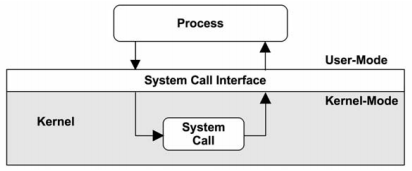

### **Chapter 3. Operating Systems**

An understanding of the operating system and its kernel is essential for systems
performance analysis, such as:

* How system calls are being performed,
* How CPUs are scheduling threads,
* How limited memory could be affecting performance,
* How a file system processes I/O.

This chapter has two parts:

* **Background** introduces terminology and operating system fundamentals.
* **Kernels** summarizes Linux and Solaris-based kernels.

### Terminology

The following is the core operating system terminology in this book:

* **Operating system**: This refers to the software and files that are installed on a system so that it can boot and execute programs. It includes the kernel, administration tools, and system libraries.
* **Kernel**: the program that manages the system, including devices (hardware), memory, and CPU scheduling. It runs in a privileged CPU mode that allows direct access to hardware, called **kernel mode**.
* **Process**: an OS abstraction and environment for executing a program. The program normally runs in **user mode**, with access to kernel mode (e.g., for performing device I/O) via **system calls** or **traps**.
* **Thread**: an executable context that can be scheduled to run on a CPU. The kernel has multiple threads, and a process contains one or more.
* **Task**: a Linux runnable entity, which can refer to a process (with a single thread), a thread from a multithreaded process, or kernel threads.
* **Kernel-space**: the memory address space for the kernel.
* **User-space**: the memory address space for processes.
* **User-land**: user-level programs and libraries (/usr/bin, /usr/lib, . . .).
* **Context switch**: a kernel routine that switches a CPU to operate in a different address space (context).
* **System call (syscall)**: a well-defined protocol for user programs to request the kernel to perform privileged operations, including device I/O.
* **Processor**: a physical chip containing one or more CPUs.
* **Trap**: a signal sent to the kernel, requesting a system routine (privileged action). Trap types include system calls, processor exceptions, and interrupts.
* **Interrupt**: a signal sent by physical devices to the kernel, usually to request servicing of I/O. An interrupt is a type of trap.

### Background

The following sections describe operating system concepts and kernel internals.

#### Kernel

The kernel manages CPU scheduling, memory, file systems, network protocols, and system devices (disks, network interfaces, etc.). It provides access to devices and kernel services via system calls. The role of the kernel is shown in the following figure:

* System libraries are often used to provide a richer and easier programming interface than the system calls alone.
    * It is pictured as a broken ring to show that applications can call system calls directly (if permitted by the operating system). [p87]
* Applications include all running user-level software, including databases, web servers, administration tools, and operating system shells.

##### **Kernel Execution**

The kernel is a large program, which primarily executes on demand, when a user-level program makes a system call or a device sends an interrupt. <u>Some kernel threads operate asynchronously for housekeeping, which may include the kernel clock routine and memory management tasks, but these try to be lightweight and consume very little CPU resources.</u>

* Workloads that perform frequent I/O frequently execute in kernel context.
* Workloads that are compute-intensive are left alone as much as possible by the kernel, so they can run uninterrupted on-CPU.

It may be tempting to think that the kernel cannot affect the performance of these workloads, but there are many cases where it does. The most obvious is CPU contention, when other threads are competing for CPU resources and the kernel scheduler needs to decide which will run and which will wait. The kernel also chooses which CPU a thread will run on and can choose CPUs with warmer hardware caches or better memory locality for the process, to significantly improve performance.

##### **Clock**

A core component of the original Unix kernel is the `clock()` routine, executed from a timer interrupt. It has historically been executed at 60, 100, or 1,000 times per second (250 for Linux 2.6.13) and each execution is called a *tick*. Its functions include:

* Updating the system time
* Expiring timers and time slices for thread scheduling
* Maintaining CPU statistics
* Executing *callouts* (scheduled kernel routines)

Some performance issues with the clock are improved in later kernels, including:

* **Tick latency**: For 100 Hz clocks, up to 10 ms of additional latency may be encountered for a timer as it waits to be processed on the next tick. This has been fixed using high-resolution real-time interrupts, so that execution occurs immediately without waiting.
* **Tick overhead**: Modern processors have dynamic power features, which can power down parts during idle periods. The clock routine interrupts this process, which for idle systems can consume power needlessly. Linux has implemented [dynamic ticks](https://www.kernel.org/doc/Documentation/timers/highres.txt), so that when the system is idle, the timer routine (clock) does not fire.

Modern kernels have moved much functionality out of the clock routine to on-demand interrupts, in an effort to create a *tickless kernel*. This includes Linux, where the clock routine (which is the *system timer interrupt*) performs little work other than updating the system clock and jiffies counter (*jiffies* is a Linux unit of time, similar to *ticks*).

##### **Kernel Mode**

The **kernel mode** is a special CPU mode, where the kernel is running. This mode allows full access to devices and the execution of privileged instructions. The kernel arbitrates device access to support multitasking, preventing processes and users from accessing each other's data unless explicitly allowed.

User programs (processes) run in **user mode**, where they request privileged operations (e.g. I/O) from the kernel via system calls. To perform a system call, execution will *mode-switch* from user to kernel mode, and then execute with the higher privilege level.

Each mode has its own software execution state including a stack and registers. The execution of privileged instructions in user mode causes **exceptions**, which are then properly handled by the kernel.

The switch between these modes takes time (CPU cycles), which adds a small amount of overhead for each I/O. Some services, such as NFS, have been implemented as kernel-mode software (instead of a user-mode daemon), so that they can perform I/O from and to devices without needing to switch to user mode.

If the system call blocks during execution, the process may switch off CPU and be replaced by another: a **context-switch**.

#### Stacks

A stack contains the execution ancestry for a thread in terms of functions and registers. <u>Stacks are used by CPUs for efficient processing of function execution in native software.</u>

When a function is called:

1. The current set of CPU registers (which store the state of the CPU) is saved to the stack.
2. A new stack frame is added to the top for the current execution of the thread.

When a function ends the execution and returns, it calls a "return" CPU instruction, which removes the current stack and returns execution to the previous one, restoring its state.

Stack inspection is an invaluable tool for debugging and performance analysis. Stacks show the call path to current execution, which often answers *why* something is executing.

### Doubts and Solutions

#### Verbatim

##### **p88 on kernel `clock()` routine**

> Linux has implemented [dynamic ticks](https://www.kernel.org/doc/Documentation/timers/highres.txt), so that when the system is idle, the timer routine (clock) does not fire.

Question: Need in-depth understanding of dynamic ticks.
