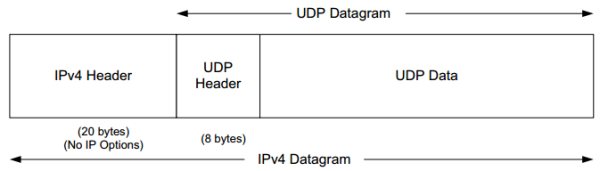

### **Chapter 10. User Datagram Protocol (UDP) and IP Fragmentation**

### Introduction

UDP is a simple, datagram-oriented, transport-layer protocol that preserves message boundaries:

* It does not provide error correction, sequencing, duplicate elimination, flow control, or congestion control.
* It can provide error detection, and it includes the true *end-to-end* checksum at the transport layer
* It provides minimal functionality itself, so applications using it have a great deal of control over how packets are sent and processed. Applications wishing to ensure that their data is reliably delivered or sequenced must implement these protections themselves.
* <u>Each UDP output operation requested by an application produces exactly one UDP datagram, which causes one IP datagram to be sent.</u>
    * This is in contrast to a stream-oriented protocol such as TCP ([Chapter 15](ch15.md)), where the amount of data written by an application may have little relationship to what actually gets sent in a single IP datagram or what is consumed at the receiver.

[[RFC0768](https://tools.ietf.org/html/rfc768)] is the official specification of UDP, and it has remained as a standard without significant revisions for more than 30 years.

* UDP provides no error correction as mentioned: it sends the datagrams that the application writes to the IP layer, but there is no guarantee that they ever reach their destination.
* There is no protocol mechanism to prevent high-rate UDP traffic from negatively impacting other network users.

#### Advantages of UDP *

Given this lack of reliability and protection, we might be tempted to conclude that there are no benefits to using UDP at all. This is not true, however. UDP has the following advantages:

* <u>Because of its connectionless character, it has less overhead than other transport protocols.</u>
* Broadcast and multicast operations ([Chapter 9](ch9.md)) are much more straightforward using a connectionless transport such as UDP.
* The ability of an application to choose its own unit of retransmission can be an important consideration.

#### Encapsulation of a UDP datagram *

The following figure shows the encapsulation of a UDP datagram as a single IPv4 datagram.

* The IPv6 encapsulation is similar, but other details differ slightly ([Section 10.5](#udp-and-ipv6)).
* The IPv4 **Protocol** field has the value 17 to indicate UDP.
* IPv6 uses the same value (17) in the **Next Header** field.
* [Later in this chapter](#ip-fragmentation) describes what happens when the size of the UDP datagram exceeds the MTU size and the datagram must be fragmented into more than one IP-layer packet.

[](figure_10-1.png "Figure 10-1 Encapsulation of a UDP datagram in a single IPv4 datagram (the typical case with no IPv4 options). The IPv6 encapsulation is similar; the UDP header follows the header chain.")

### UDP Header

THe following figure shows UDP datagram, including the payload and UDP header (which is always 8 bytes in size):

[](figure_10-2.png "Figure 10-2 The UDP header and payload (data) area. The Checksum field is end-to-end and is computed over the UDP pseudo-header, which includes the Source and Destination IP Address fields from the IP header. Thus, any modification made to those fields (e.g., by NAT) requires a modification to the UDP checksum")

* Port numbers act as mailboxes and help a protocol implementation identify the sending and receiving processes ([Chapter 1](ch1.md)). They are purely *abstract*: they do not correspond to any physical entity on a host. In UDP port numbers are positive 16-bit numbers:
    * <u>The source port number is optional; it may be set to 0 if the sender of the datagram never requires a reply.</u>

Transport protocols such as TCP and UDP, and SCTP [RFC4960] use the destination port number to help demultiplex incoming data from IP. <u>Because IP demultiplexes the incoming IP datagram to a particular transport protocol based on the value of the **Protocol** field in the IPv4 header or **Next Header** field in the IPv6 header, this means that the port numbers can be made independent among the transport protocols. That is, TCP port numbers are used only by TCP, and the UDP port numbers only by UDP, and so on.</u> A straightforward consequence of this separation is that two completely distinct servers can use the same port number and IP address, as long as they use different transport protocols.

Despite this independence, if a well-known service is provided (or can conceivably be provided) by both TCP and UDP, the port number is normally allocated to be the same for both transport protocols. This is purely for convenience and is not required by the protocols. See [[IPORT](http://www.iana.org/assignments/service-names-port-numbers/service-names-port-numbers.xhtml)] for details on how port numbers are formally assigned.

* The UDP **Length** field is the length of the UDP header and the UDP data in bytes. The minimum value for this field is 8 except when UDP is used with IPv6 jumbograms (see Section 10.5). Sending a UDP datagram with 0 bytes of data is acceptable, although rare.
    * The UDP Length field is redundant; the IPv4 header contains the datagram’s total length ([Chapter 5](ch5.md)), and the IPv6 header contains the payload length. The length of a UDP/IPv4 datagram is then the total length of the IPv4 datagram minus the length of the IPv4 header. A UDP/IPv6 datagram’s length is the value of the Payload Length field contained in the IPv6 header minus the lengths of any extension headers (unless jumbograms are being used). In either case, the UDP Length field should match the length computed from the IP-layer information.

### UDP Checksum

### Examples

### UDP and IPv6

### UDP-Lite

### IP Fragmentation

IP employs **fragmentation** and **reassembly**. Fragmentation in IPv4 can take place at the original sending host and at any intermediate routers along the end-to-end path. Note that datagram fragments can themselves be fragmented. Fragmentation in IPv6 is somewhat different because <u>only the source is permitted to perform fragmentation</u>.

When an IP datagram is fragmented, it is not reassembled until it reaches its final destination, because:

1. Not performing reassembly within the network alleviates the forwarding software (or hardware) in routers from implementing this feature
2. Different fragments of the same datagram may follow different paths to their common destination

#### Example: UDP/IPv4 Fragmentation

An UDP application may wish to avoid IP fragmentation, because when the size of the resulting datagram exceeds the link’s MTU, the IP datagram is split across multiple IP packets, which can lead to performance issues because <u>if any fragment is lost, the entire datagram is lost.</u>

[](figure_10-9.png "A single UDP datagram with 2992 UDP payload bytes is fragmented into three UDP/ IPv4 packets (no options).")

A single UDP datagram with 2992 UDP payload bytes is fragmented into three UDP/ IPv4 packets (no options). The UDP header that contains the source and destination port numbers appears only in the first fragment (a complicating factor for firewalls and NATs). Fragmentation is controlled by the **Identification**, **Fragment Offset**, and **More Fragments** (MF) fields in the IPv4 header.

The original UDP datagram included 2992 bytes of application (UDP payload) data and 8 bytes of UDP header, resulting in an IPv4 Total Length field value of 3020 bytes (IP header is 20-byte). When this datagram was fragmented into three packets, 40 extra bytes were created (20 bytes for each of the newly created IPv4 fragment headers). Thus, the total number of bytes sent is 3060. [p489]

Fields:

* **Identification**: its value (set by the original sender) is copied to each fragment and is used to group them together when they arrive
* **Fragment Offset**: the offset of the first byte of the fragment payload byte in the original IPv4 datagram (in 8-byte units)
* **MF**: indicates whether more fragments in the datagram should be expected and is 0 only in the final fragment

If one fragment is lost, the entire datagram is lost, since IP itself has no error correction mechanism of its own. Mechanisms such as timeout and retransmission are left as the responsibility of the higher layers. <u>For this reason, fragmentation is often avoided.</u>

We can use our `sock` program and increase the size of the datagram until fragmentation occurs. On an Ethernet, the maximum amount of data in a frame is ordinarily 1500 bytes, which leaves at most 1472 bytes for application data to avoid fragmentation, assuming 20 bytes for the IPv4 header and 8 bytes for the UDP header.

We will run our sock program with data sizes of 1471, 1472, 1473, and 1474 bytes. We expect the last two to cause fragmentation:

[p490-492]

```bash
Linux% sock -u -i -n1 -w1471 10.0.0.3 discard
Linux% sock -u -i -n1 -w1472 10.0.0.3 discard
Linux% sock -u -i -n1 -w1473 10.0.0.3 discard
Linux% sock -u -i -n1 -w1474 10.0.0.3 discard
```

```text
1 23:42:43.562452 10.0.0.5.46530 > 10.0.0.3.9:
		udp 1471 (DF) (ttl 64, id 61350, len 1499)
2 23:42:50.267424 10.0.0.5.46531 > 10.0.0.3.9:
		udp 1472 (DF) (ttl 64, id 62020, len 1500)
3 23:42:57.814555 10.0.0.5 > 10.0.0.3:
		udp (frag 37671:1@1480) (ttl 64, len 21)
4 23:42:57.814715 10.0.0.5.46532 > 10.0.0.3.9:
		udp 1473 (frag 37671:1480@0+) (ttl 64, len 1500)
5 23:43:04.368677 10.0.0.5 > 10.0.0.3:
		udp (frag 37672:2@1480) (ttl 64, len 22)
6 23:43:04.368838 10.0.0.5.46535 > 10.0.0.3.9:
		udp 1474 (frag 37672:1480@0+) (ttl 64, len 1500)
```

One observation that may be surprising is that the fragments with larger offsets are delivered *prior* to the first fragments. In effect, <u>the sender has intentionally reordered the fragments.</u> This behavior can be beneficial. If the last fragment is delivered first, the receiving host is able to ascertain the maximum amount of buffer space it will require in order to reassemble the entire datagram.


