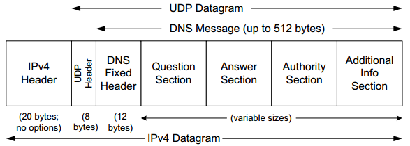

### **Chapter 11. Name Resolution and the Domain Name System (DNS)**

To identify hosts, IP addresses (especially IPv6 addresses) are cumbersome for humans to use and remember. The Internet supports the use of **host names** to identify hosts, both clients and servers. In order to be used by protocols such as TCP and IP, host names are converted into IP addresses using a process known as name resolution. There are different forms of name resolution in the Internet, but the most prevalent and important one uses a distributed database system known as the **Domain Name System** (DNS). DNS runs as an application on the Internet, using IPv4 or IPv6 (or both). For scalability, DNS names are hierarchical, as are the servers that support name resolution.

DNS is a distributed client/server networked database used by TCP/IP applications to map between host names and IP addresses (and vice versa), to provide capabilities like electronic mail routing information and service naming. The DNS provides the protocol that allows clients and servers to communicate
with each other and also a protocol for allowing servers to exchange information. [p511]

From an application’s point of view, access to the DNS is through an application library called a **resolver**. <u>An application must convert a host name to an IPv4 and/or IPv6 address before it can ask TCP to open a connection or send a unicast datagram using UDP.</u> The TCP and IP protocol implementations know nothing about the DNS; they operate only with the addresses.

This chapter covers:

* How the names in DNS are set up
* How resolvers and servers communicate using the Internet protocols (mainly UDP)
* Some other resolution mechanisms used in Internet environments.

### The DNS Name Space

The DNS **name space** is the set of all names used with DNS. This space is partitioned hierarchically and is case insensitive.

The current DNS name space is a tree of domains with an unnamed root at the top. The top echelons of the tree are the so-called
top-level domains (TLDs), which include:

* Generic TLDs (gTLDs)
* Country-code TLDs (ccTLDs)
* Internationalized country-code TLDs (IDN ccTLDs)
* A special infrastructure TLD called, for historical reasons, ARPA [RFC3172].

These form the top levels of a naming tree with the form shown below.

 include generic TLDs (gTLDs), countrycode TLDs (ccTLDs), internationalized TLDs (IDN ccTLDs), and a special infrastructure TLD called ARPA.")

There are five commonly used groups of TLDs, and one group of specialized domains being used for **internationalized domain names** (IDNs). [p512]

The gTLDs are grouped into categories:

* Generic
* Generic-restricted
* Sponsored

The generic gTLDs (*generic* appears twice) are open for unrestricted use. The others (generic-restricted and sponsored) are limited to various sorts of uses or are constrained as to what entity may assign names from the domain.

There is a "new gTLD" program in the works that may significantly expand the current set, possibly to several hundred or even thousand. This program and policies relating to TLD management in general are maintained by the [Internet Corporation for Assigned Names and Numbers](https://en.wikipedia.org/wiki/ICANN) (ICANN).

Because some of these two-letter country codes of ccTLDs are suggestive of other uses and meanings, various countries have been able to find commercial windfalls from selling names within their ccTLDs. For example, the domain name `cnn.tv` is really a registration in the Pacific island of Tuvalu, which has been selling domain names associated with the television entertainment industry. This is called a [**domain hack**](https://en.wikipedia.org/wiki/Domain_hack).

### DNS Naming Syntax

The names below a TLD in the DNS name tree are further partitioned into **subdomains**, which is very common practice, especially for the ccTLDs.

#### Fully qualified domain name (FQDN) *

The example names we have seen so far are known as [**fully qualified domain names**](https://en.wikipedia.org/wiki/Fully_qualified_domain_name) (FQDNs). They are sometimes written more formally with a trailing period (e.g., `mit.edu.`). This trailing period indicates that the name is complete; no additional information should be added to the name when performing a name resolution.

#### Unqualified domain name *

An **unqualified domain name**, which is used in combination with a default domain or domain search list set during system configuration, has one or more strings appended to the end. During configuration, system is typically assigned a default domain extension and search list using DHCP. For example, the default domain `cs.berkeley.edu` might be configured in systems at the computer science department at UC Berkeley. If a user on one of these machines types in the name `vangogh`, the local resolver software converts this name to the FQDN `vangogh.cs.berkeley.edu`. before invoking a resolver to determine `vangogh`’s IP address.

A domain name consists of a sequence of *labels* separated by periods. The name represents a location in the name hierarchy, where the period is the hierarchy delimiter and descending down the tree takes place from right to left in the name.

<u>The hierarchical structure of the DNS name space allows different administrative authorities to manage different parts of the name space.</u> For example, creating a new DNS name `elevator.cs.berkeley.edu` wouldrequire dealing with the owner of the `cs.berkeley.edu` subdomain only. The `berkeley.edu` and `edu` portions of the name space would not require alteration, so the owners of those would not need to be bothered. <u>This feature of DNS is one key aspect of its *scalability*. No single entity is required to administer all the changes for the entire DNS name space.</u> [p516]

### Name Servers and Zones

A person responsible for managing part of the active DNS name space is supposed to arrange for at least two **name servers** or **DNS servers** to hold information about the name space so that Internet users can perform queries on the names.

The DNS (formed by servers) is a distributed system whose primary job is to provide name-to-address mappings; however, it can also provide a wide array of additional information.

A *zone*, as the unit of administrative delegation, is a subtree of the DNS name space that can be administered separately from other zones. Every domain name exists within some zone (even the TLDs that exist in the root zone). Whenever a new record is added to a zone, the DNS administrator for the zone allocates a name and additional information (usually an IP address) for the new entry into the name server’s database. For example:

* At a small campus, one person could do this each time a new server is added to the network;
* In a large enterprise the responsibility would have to be delegated (probably by departments or other organizational units), as one person likely could not keep up with the work.

A DNS server can contain information for more than one zone. At any hierarchical change point in a domain name (i.e., wherever a period appears), a different zone and containing server may be accessed to provide information for the name. This is called a *delegation*. A common delegation approach uses a zone for implementing a second-level domain name, such as `berkeley.edu`. In this domain, there may be individual hosts (e.g., `www.berkeley.edu`) or other domains (e.g., `cs.berkeley.edu`). <u>Each zone has a designated owner or responsible party who is given authority to manage the names, addresses, and subordinate zones within the zone. Often this person manages not only the contents of the zone but also the name servers that contain the zone’s database(s).</u>

For redundancy, zone information is supposed to exist in at least two places: there should be at least two servers containing information for each zone. All of these servers contain identical information about a zone. Among the servers, a primary server contains the zone database in a disk file, and one or more secondary servers obtain copies from the primary using a process called a [**zone transfer**](zone transfer). DNS has a special protocol for performing zone transfers, but copies of a zone’s contents can also be obtained using other means (e.g., the `rsync` utility).

### Caching

Name servers contain information (e.g. name-to-IP-address mappings) that
may be obtained from three sources:

1. Directly from the zone database,
2. As the result of a zone transfer (e.g., for a slave server),
3. From another server in the course of processing a resolution.

In the first case, the server is said to contain authoritative information about the zone and may be called an **authoritative server** for the zone. Such servers are identified by name within the zone information.

Most name servers (except some root and TLD servers) also *cache* zone information they learn, up to a time limit called the *time to live* (TTL). They use this cached information to answer queries. This greatly decreases the amount of DNS message traffic on the Internet. When answering a query, a server indicates whether the information it is returning has been derived from its cache or from its authoritative copy of the zone. When cached information is returned, it is common for a server to also include the domain names of the name servers that can be contacted to retrieve authoritative information about the corresponding zone.

Each DNS record has its own TTL, which are set and altered by the zone administrator when necessary. If a zone changes, there still may exist cached data within the network, leading to incorrect DNS resolution behavior until expiry of the TTL. For this reason, some zone administrators, anticipating a change to the zone contents, first reduce the TTL before implementing the change. This reduces the window for incorrect cached data to be present in the network.

Caching is applied both for successful and unsuccessful resolutions (called [**negative caching**](https://en.wikipedia.org/wiki/Negative_cache)). <u>If a request for a particular domain name fails to return a record, this fact is also cached. This reduces Internet traffic when errant applications repeatedly make requests for names that do not exist.</u>

In some network configurations, the cache is maintained in a nearby name server, not in the resolvers resident in the clients. Placing the cache in the server allows any hosts on the LAN that use the nearby server to benefit from the server’s cache but implies a small delay in accessing the cache over the local network. In Windows and more recent systems, the client can maintain a cache, and it is made available to all applications running on the same system. In Windows, this happens by default, and in Linux, it is a service that can be enabled or disabled.

#### `nscd(8)` and `nsswitch.conf(5)` *

In Linux , the **Name Service Caching Daemon** (NSCD) provides a client-side caching capability. It is controlled by the `/etc/nscd.conf` file that can indicate which types of resolutions (for DNS and some other services) are cached, along with some cache parameters such as TTL settings. T

The file `/etc/nsswitch.conf` controls how name resolution for applications takes place. It also controls whether local files, the DNS protocol, and/or NSCD is employed for mappings.

### The DNS Protocol

The DNS protocol consists of two main parts:

* Query/response protocol used for performing queries against the DNS for particular names
* Protocol for name servers to exchange database records (zone transfers)

It has other functionalities:

* Notifying secondary servers that the zone database has evolved and a zone transfer is necessary (DNS Notify)
* Dynamically updating the zone (dynamic updates).

DNS name resolution is the process of mapping a domain name to an IPv4 address, although IPv6 addresses mappings work in essentially the same way. DNS query/response operations are supported over the distributed DNS infrastructure consisting of servers deployed locally at each site or ISP, and a special set of [**root servers**](https://en.wikipedia.org/wiki/Root_name_server). There is also a special set of **generic top-level domain servers** used for scaling some of the larger gTLDs, including COM and NET.

As of mid-2011, there are:

* 13 root servers named by the letters *A* through *M*; 9 of them have IPv6 addresses.
* 13 gTLD servers named by *A* through *M*; 2 of them have IPv6 addresses.

Some of them are not a single physical server but a group of servers (over 50 for the J root server) that use the same IP address (i.e., using IP anycast addressing; [Chapter 2](ch2.md#anycast-addresses)).

#### Recursive query *

A full resolution that is unable to benefit from preexisting cached entries takes place among several entities, as shown in the figure below:

 uses a DNS server provided by its ISP. That server, in turn, uses an Internet root name server and a gTLD server (for COM and NET TLDs) to find the name server for the EXAMPLE.COM domain. That name server (A.IANA-SERVERS.NET here) provides the required IP address for the host EXAMPLE.COM. All of the recursive servers cache any information learned for later use. ")

Here's what happened:

* **Message 1**. The resolver software (assuming it does not know the IP address for the server EXAMPLE.COM) on A.HOME first makes a request to its local name server, GW.HOME.
* **Message 2 through 6**.
    * If GW.HOME does not already know the IP address for EXAMPLE.COM or the name servers for either the EXAMPLE.COM domain or the COM TLD, it forwards the request to another DNS server (called *recursion*), in this case, an ISP-provided DNS server.
    * Assuming that the ISP-provided DNS server also does not know the required address or other information, it contacts one of the root name servers (message 3).
    * The root servers are not recursive, so they do not process the request further but instead return the information required to contact a name server for the COM TLD. For example, it might return the name A.GTLD-SERVERS.NET and one or more of its IP addresses (message 4).
    * With this (the above) information, the ISP-provided server contacts the gTLD server (message 5) and discovers the name and IP addresses of the name servers for the domain EXAMPLE.COM (message 6). In this case, one of the servers is A.IANA-SERVERS.NET.
* **Message 7 through 10**.
    * Given the correct server for the domain, the ISP-provided server contacts the appropriate server (message 7), which responds with the requested IP address (message 8). At this point, the ISP-provided server can respond to GW.HOME with the required information (message 9).
    * GW.HOME is now able to complete the initial query and responds to the client with the desired IPv4 and/or IPv6 address(es) (message 10)

From A.HOME's side it seems the local name server was able to perform the request. What really happened is a **recursive query**, where the GW.HOME and ISP-provided servers in turn made additional DNS requests to satisfy A.HOME’s query. In general, most name servers perform recursive queries such as this. The notable exceptions are the root servers and other TLD servers that do not perform recursive queries. These servers are a relatively precious resource, so encumbering them with recursive queries for every machine that performs a DNS query would lead to poor global Internet performance.

#### Default domain search list *

In the previous query example, if the A.HOME system is configured with a default domain search list, there may be additional queries. For example, if .HOME is a default search domain used by A.HOME, the first DNS query may be for the name EXAMPLE.COM.HOME, which will fail at the GW.HOME name server, which is authoritative for .HOME. A subsequent query will typically remove the default extension, resulting in a query for EXAMPLE.COM.

#### DNS Message Format

There is one basic DNS message format used for all DNS operations (queries, responses, zone transfers, notifications, and dynamic updates), as illustrated in the figure below:

 uses the field names ZOCOUNT, PRCOUNT, UPCOUNT, and ADCOUNT. A special extension format (called EDNS0) allows messages to be larger than 512 bytes, which is required for DNSSEC (see Chapter 18). ")

The basic DNS message begins with a fixed 12-byte header followed by four variable-length sections:

* Questions (or queries)
* Answers
* Authority records
* Additional records.

All but the first section (question section) contain one or more **resource records** (RRs), which is detailed in [Section 11.5.6](#resource-record-types). The question section contains a data item that is very close in structure to an RR. RRs can be cached; questions are not.

* The **Transaction ID** field is set by the client and returned by the server, which lets the client match responses to requests.
* **QR** is a 1-bit field:
    * 0 means the message is a query;
    * 1 means it is a response.
* **OpCode** is a 4-bit field.
    * The normal value is 0 (a standard query) for requests and responses.
    * Other values are: 4 (notify), and 5 (update).
    * Other values (1–3) are deprecated or never seen in operational use.
* The **AA** bit field indicates an "authoritative answer" as opposed to a cached answer.
* **TC** is a 1-bit field that means "truncated". With UDP, this flag being set means that the total size of the reply exceeded 512 bytes, and only the first 512 bytes of the reply were returned.
* **RD** is a bit field that means "recursion desired". It tells the server to perform a **recursive query**.
    * It can be set in a query and is then returned in the response.
    * If the bit is not set and the requested name server does not have an authoritative answer, the requested name server returns a list of other name servers to contact for the answer. At this point, the overall query may be continued by contacting the list of other name servers. This is called an **iterative query**.
* **RA** is a bit field that means "recursion available". This bit is set in the response if the server supports recursion. Root servers generally do not support recursion, thereby forcing clients to perform iterative queries to complete name resolution.
* The **Z** bit field must be 0 for now but is reserved for future use.
* The **AD** bit field is set to true if the contained information is authenticated.
* The **CD** bit is set to true if security checking is disabled.
* The **Response Code** (**RCODE**) field is a 4-bit field with the return code. The common values include 0 (no error) and 3 (name error or "nonexistent domain", written as NXDOMAIN). A name error is returned only from an authoritative name server and means that the domain name specified in the query does not exist. A list of the first 11 error codes for RCODE is in the following table.

Value | Name | Reference | Description and Purpose
----- | ---- | --------- | -----------------------
0 | NoError | [RFC1035] | No error
1 | FormErr | [RFC1035] | Format error; query cannot be interpreted
2 | ServFail | [RFC1035] | Server failure; error in processing at server
3 | NXDomain | [RFC1035] | Nonexistent domain; unknown domain referenced
4 | NotImp | [RFC1035] | Not implemented; request not supported in server
5 | Refused | [RFC1035] | Refused; server unwilling to provide answer
6 | YXDomain | [RFC2136] | Name exists but should not (used with updates)
7 | YXRRSet | [RFC2136] | RRSet exists but should not (used with updates)
8 | NXRRSet | [RFC2136] | RRSet does not exist but should (used with updates)
9 | NotAuth | [RFC2136] | Server not authorized for zone (used with updates)
10 | NotZone | [RFC2136] | Name not contained in zone (used with updates)

The next four fields are 16 bits in size and specify the number of entries in the question, answer, authority, and additional information sections that complete the DNS message.

* For a query, the number of questions is normally 1 and the other three counts are 0.
* For a reply, the number of answers is at least 1.

Questions have a name, type, and class. All of the other sections contain zero or more RRs. RRs contain a name, type, and class information, but also the TTL value that controls how long the data can be cached. [p521]

##### **Names and Labels**

The variable-length sections at the end of a DNS message contain a collection of:

* Questions.
* Answers.
* Authority information: names of name servers that contain authoritative information for certain data.
* Additional information: useful to reduce the number of necessary queries.

Each question and each RR begins with a **name** (called the domain name or owning name) to which it refers. Each name consists of a sequence of **labels**. There are two categories of label types:

* **Data labels** contain characters that constitute a label.
* **Compression labels** act as pointers to other labels, which helps save space in a DNS message when multiple copies of the same string of characters are present across multiple labels.

##### **Data Labels**

Each data label begins with a 1-byte count that specifies the number of bytes that immediately follow. The name is terminated with a byte containing the value 0, which is a label with a length of 0 (the label of the root).

 has four labels. The end of the name is identified by a 0-length label of the nameless root.")

* Each label Length byte must be in the range of 0 to 63, as labels are limited to 63 bytes.
* The labels contain non-ASCII values, but this is uncommon and not recommended. It is suggested that labels start with a letter, end with a letter or digit, and have as interior characters only letters, digits and hyphen. [p523]

##### **Compression Labels**

A DNS response may carry information in the answer, authority, and additional information sections relating to the same domain name. For data labels the same characters would be repeated in the DNS message when referring to the same name. To avoid this redundancy and save space, a compression scheme is used.

The following figure illustrates how to encode the domain names `usc.edu` and `ucla.edu` using compression labels.

In the above figure, common label `edu` can be shared by the two domain names:

* Assuming the names start at offset 0, data labels are used to encode `usc.edu` as described previously.
* The next name is `ucla.edu`, and the label `ucla` is encoded using a data label.
* The label `edu` of `ucla.edu` may be reused from the encoding of `usc.edu`. This is accomplished by setting the 2 high-order bits of the label **Type** byte to 1 and encoding the offset of `edu` in the remaining 14 bits. Because the first occurrence of `edu` is at offset 4, we only need to set the first byte to 192 (6 bits of 0) and the next byte to 4.

This example shows a savings of only 4 bytes, but it is clear how compression of larger common labels can result in more substantial savings.

#### The DNS Extension Format (EDNS0)

An extension mechanism called **EDNS0** (because there could be future extensions beyond the index 0) is specified in [RFC2671]. It is necessary for supporting DNS security ([DNSSEC](https://en.wikipedia.org/wiki/Domain_Name_System_Security_Extensions); see [Chapter 18](ch18.md)).

EDNS0 specifies a particular type of RR (called an **OPT pseudo-RR** or **meta-RR**) that is added to the additional data section of a request or response to indicate the use of EDNS0; at most one such record may be present in any DNS message. If a UDP DNS message includes an OPT RR, it is permitted to exceed the 512-byte length limitation and may contain an expanded set of error codes.

EDNS0 also defines an extended label type (extending beyond the data labels and compression labels mentioned earlier). Extended labels have their first 2 bits in the label Type/Length byte set to 01, corresponding to values between 64 and 127 (inclusive). [p525]

#### UDP or TCP

The well-known port number for DNS is 53, for both UDP and TCP.  The most common format uses the UDP/IPv4 datagram structure is shown below:

 contains a set of resource records")

* **UDP and truncated response**. When a resolver issues a query and the response comes back with the TC bit field set ("truncated"), the size of the true response exceeded 512 bytes, so only the first 512 bytes are returned by the server.
* **TCP and full response**. The resolver may issue the request again, using TCP (which now must be a supported configuration [RFC5966]). This allows more than 512 bytes to be returned because TCP breaks up large messages into multiple segments.

When a secondary name server for a zone starts up, it normally performs a [zone transfer](https://en.wikipedia.org/wiki/DNS_zone_transfer) from the primary name server for the zone. Zone transfers can also be initiated by a timer or as a result of a DNS NOTIFY message ([Section 11.5.8.3](#dns-notify)).

* Full zone transfers use TCP as they can be large.
* Incremental zone transfers, where only the updated entries are transferred, may use UDP at first but switch to TCP if the response is too large, just like a conventional query.

When UDP is used, both the resolver and the server application software must perform their own timeout and retransmission. RFC1536 suggests starting with a timeout of at least 4s, and that subsequent timeouts result in an exponential increase of the timeout (a bit like TCP’s algorithms; see [Chapter 14](ch14.md)). Linux and UNIX-like systems allow a change to be made to the retransmission timeout parameters by altering the contents of the `/etc/resolv.conf` file (by setting the timeout and attempts options).

#### Question (Query) and Zone Section Format

The question or query section of a DNS message lists the question(s) being referenced. The format of each question in the question section is shown the figure below. There is normally just one, although the protocol can support more. The same structure is also used for the zone section in dynamic updates ([Section 11.5.7](#dynamic-updates-dns-update)), but with different names.

* The **Query Name** is the domain name being looked up (using the encoding for labels discussed earlier)
* The **Query Class** has the following values:
    * 1: the Internet class
    * 254: no class
    * 255: all classes
* The **Query Type** field holds a value indicating the type of query being performed.
    * The most common query type is A (or AAAA if IPv6 DNS resolution is enabled), which means that an IP address is desired for the query name.
    * A query of type ANY returns all RRs of any type in the same class that match the query name.

#### Answer, Authority, and Additional Information Section Formats

The answer, authority, and additional information (final sections in the DNS message) sections contain sets of RRs. RRs in these sections can, for the most part, have wildcard domain names as owning names. These are domain names in which the asterisk label (a data label containing only the asterisk character) appears first.

.")

* The **Name** field (sometimes called the "owning name", "owner", or "record owner’s name") is the domain name to which the following resource data corresponds. It uses the same for format for names and labels described earlier.
* The **Type** field specifies one of the RR type codes, which are the same as the query type value described earlier.
* The **Class** field is 1 for Internet data.
* The **TTL** field is the number of seconds for which the RR can be cached.
* The **Resource Data Length** (**RDLENGTH**) field specifies the number of bytes contained in the **Resource Data** (**RDATA**) field. The format of this data depends on the type. For example, A records (type 1) have a 32-bit IPv4 address in the RDATA area.

The **Resource Record Set** (RRSet) is a set of resource records that share the same name, class, and type but not the same data. For example, <u>RRSet occurs when a host has more than one address record for its name (e.g., because it has more than one IP address). TTLs for RRs in the same RRSet must be equal.</u>

#### Resource Record Types

There are many types of resource records and a single name may have multiple matching RRs. The following table provides a listing of the most common RR types used with conventional DNS (i.e., DNS without the DNSSEC security extensions).

Value | RR Type | Reference | Description and Purpose
----- | ------- | --------- | -----------------------
1 | A | [RFC1035] | Address record for IPv4 (32-bit IPv4 address)
2 | NS | [RFC1035] | Name server; provides name of authoritative name server for zone
5 | CNAME | [RFC1035] | Canonical name; maps one name to another (to provide a form of name aliasing)
6 | SOA | [RFC1035] | Start of authority; provides authoritative information for the zone (name servers, e-mail address of contact, serial number, zone transfer timers)
12 | PTR | [RFC1035] | Pointer; provides address to (canonical) name mapping; used with in-addr.arpa and ip6.arpa domains for IPv4 and IPv6 reverse queries
15 | MX | [RFC1035] | Mail exchanger; provides name of e-mail handling host for a domain
16 | TXT | [RFC1035] [RFC1464] | Text; provides a variety of information (e.g., used with SPF anti-spam scheme to identify authorized e-mail servers)
28 | AAAA | [RFC3596] | Address record for IPv6 (128-bit IPv6 address)
33 | SRV | [RFC2782] | Server selection; transport endpoints of a generic service
35 | NAPTR | [RFC3403] | Name authority pointer; supports alternative name spaces
41 | OPT | [RFC2671] | Pseudo-RR; supports larger datagrams, labels, return codes in EDNS0
251 | IXFR | [RFC1995] | Incremental zone transfer
252 | AXFR | [RFC1035] [RFC5936] | Full zone transfer; carried over TCP
255 | (ANY) | [RFC1035] | Request for all (any) records

#### Dynamic Updates (DNS UPDATE)

#### Zone Transfers and DNS NOTIFY

##### **Full Zone Transfers (AXFR Messages)**

##### **Incremental Zone Transfers (IXFR Messages)**

##### **DNS NOTIFY**

### Sort Lists, Round-Robin, and Split DNS

Consider what data is returned and in what order in response to a DNS query. A DNS server could return all matching data to any client in whatever order the server finds most convenient. However, special configuration options and behaviors are available in most DNS server software to achieve certain operational, privacy, or performance goals. Consider the the topology shown below:

A host wishing to contact M performs a DNS lookup that returns two addresses: one associated with the internal network and one with the DMZ. <u>It would be more efficient if A, B, and R reached M via the DMZ and C reached M via the internal network, which happens if the DNS server orders its returned address records based on the source IP address of the request</u> (It could also use the destination IP address, especially if M uses multiple IP addresses from different subnets on the same network interface.):

* If the requesting system uses a source IP address with the same network prefix as the source of a returning address record, the DNS server places the set of such matching records early in the returned message. This behavior encourages the client to find the "closest" IP address for a particular server it is attempting to contact, because most simple applications attempt to contact the first address found among the returned address records.
* The precise behavior can usually be controlled using a so-called `sortlist` or `rrset-order` directive (options used in configuration files for resolvers and servers). Such sorting behavior may also happen automatically if performed by the DNS server software by default.

#### Load-balancing *

A related situation arises when one service is offered using more than one server such that the incoming connections are load-balanced (i.e., divided among the servers).

In the preceding example, imagine that a service is offered on both A and B and such a service may be identified by the URL `http://www.example.com`:

* Requesting clients (like R) perform a DNS query on the domain name `www.example.com`, and the DNS server eventually returns a set of address records.
* To achieve load balancing, the DNS server may be configured to use DNS round-robin, which means that the server permutes the order of the returned address records. This encourages each new client to access the service on a different server from the previous client.

However, this load balancing mechanism is far from perfect:

* When records are cached, the desired effect may not occur because of reuse of existing cached address records.
* In addition, this scheme may balance the number of connections well across servers, but not the load. Different connections can have radically different processing requirements, so the true processing load is likely to remain unbalanced unless the particular service always has the same processing requirements.

#### Split DNS

A final consideration regarding the data returned by a DNS server is support for privacy. In the previous example, we may wish to arrange for hosts within the enterprise to be able to retrieve resource records for every computer in the network, while we limit the set of systems that remain visible to R.

[**Split DNS**](https://en.wikipedia.org/wiki/Split-horizon_DNS) is a technique for implementing this goal. In split DNS, the set of resource records returned in response to a query is dependent on the identity of the client and possibly query destination address. Most often, the client is identified by IP address or address prefix. With split DNS, we could arrange for any host in the enterprise (i.e., those sharing a set of prefixes) to be provided with the entire DNS database, whereas those outside are given visibility only to A and B, where the main Web service is offered.
