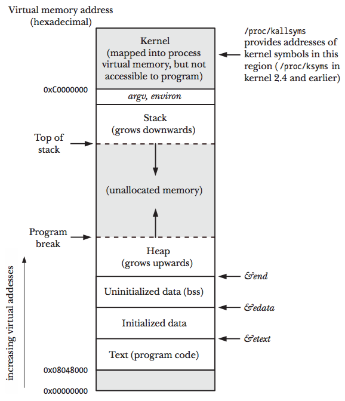

### **Chapter 6. Processes**

### Processes and Programs

### Process ID and Parent Process ID

### Memory Layout of a Process

The memory allocated to each process is composed of a number of parts, usually referred to as **segments**. These segments are as follows:

* The **text segment** contains the machine-language instructions of the program run by the process.
    * The text segment is made read-only so that a process doesn’t accidentally modify its own instructions via a bad pointer value.
    * Since many processes may be running the same program, the text segment is made sharable so that a single copy of the program code can be mapped into the virtual address space of all of the processes.
* The **initialized data segment** contains global and static variables that are explicitly initialized. The values of these variables are read from the executable file when the program is loaded into memory.
* The **uninitialized data segment** contains global and static variables that are not explicitly initialized. Before starting the program, the system initializes all memory in this segment to 0.
    * For historical reasons, this is often called the **bss segment**, a name derived from an old assembler mnemonic for "block started by symbol".
    * The main reason for placing global and static variables that are initialized into a separate segment from those that are uninitialized is that, when a program is stored on disk, it is not necessary to allocate space for the uninitialized data. Instead, the executable merely needs to record the location and size required for the uninitialized data segment, and this space is allocated by the program loader at run time.
* The **stack** is a dynamically growing and shrinking segment containing stack frames. One stack frame is allocated for each currently called function. A frame stores the function’s local variables (so-called automatic variables), arguments, and return value. Stack frames are detailed in [Section 6.5](#the-stack-and-stack-frames).
* The **heap** is an area from which memory (for variables) can be dynamically allocated at run time. The top end of the heap is called the **program break**.

The following code shows various types of C variables along with comments indicating in which segment each variable is located. These comments assume a nonoptimizing compiler and an application binary interface in which all arguments are passed on the stack. In practice, an optimizing compiler may allocate frequently used variables in registers, or optimize a variable out of existence altogether. Furthermore, some ABIs require function arguments and the function result to be passed via registers, rather than on the stack. Nevertheless, this example serves to demonstrate the mapping between C variables and the segments of a process.

<small>[proc/mem_segments.c](https://github.com/shichao-an/tlpi-dist/blob/master/proc/mem_segments.c)</small>

```c
#define _BSD_SOURCE
#include <stdio.h>
#include <stdlib.h>

char globBuf[65536];            /* Uninitialized data segment */
int primes[] = { 2, 3, 5, 7 };  /* Initialized data segment */

static int
square(int x)                   /* Allocated in frame for square() */
{
    int result;                 /* Allocated in frame for square() */

    result = x * x;
    return result;              /* Return value passed via register */
}

static void
doCalc(int val)                 /* Allocated in frame for doCalc() */
{
    printf("The square of %d is %d\n", val, square(val));

    if (val < 1000) {
        int t;                  /* Allocated in frame for doCalc() */

        t = val * val * val;
        printf("The cube of %d is %d\n", val, t);
    }
}

int
main(int argc, char *argv[])    /* Allocated in frame for main() */
{
    static int key = 9973;      /* Initialized data segment */
    static char mbuf[10240000]; /* Uninitialized data segment */
    char *p;                    /* Allocated in frame for main() */

    p = malloc(1024);           /* Points to memory in heap segment */

    doCalc(key);

    exit(EXIT_SUCCESS);
}
```

An [**application binary interface**](https://en.wikipedia.org/wiki/Application_binary_interface) (ABI) is a set of rules specifying how a binary executable should exchange information with some service (e.g., the kernel or a library) at run time. Among other things, an ABI specifies which registers and stack locations are used to exchange this information, and what meaning is attached to the exchanged values. Once compiled for a particular ABI, a binary executable should be able to run on any system presenting the same ABI. This contrasts with a standardized API (such as SUSv3), which guarantees portability only for applications compiled from source code.

Although not specified in SUSv3, the C program environment on most UNIX implementations (including Linux) provides three global symbols: `etext`, `edata`, and `end`. These symbols can be used from within a program to obtain the addresses of the next byte past, respectively, the end of the program text, the end of the initialized data segment, and the end of the uninitialized data segment. To make use of these symbols, we must explicitly declare them, as follows:

```c
extern char etext, edata, end;
 /* For example, &etext gives the address of the end
 of the program text / start of initialized data */
```

The following figure (Figure 6-1) shows the arrangement of the various memory segments on the x86-32 architecture.

* The space labeled `argv`, `environ` at the top of this diagram holds the program command-line arguments (available in C via the `argv` argument of the `main()` function) and the process environment list.
* The hexadecimal addresses shown in the diagram may vary, depending on kernel configuration and program linking options.
* The grayed-out areas represent invalid ranges in the process’s virtual address space; that is, areas for which page tables have not been created (see the following discussion of virtual memory management).

[](figure_6-1.png "Figure 6-1: Typical memory layout of a process on Linux/x86-32")

### Virtual Memory Management

### The Stack and Stack Frames


