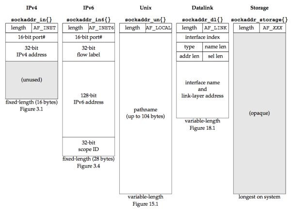

### **Chapter 3. Sockets Introduction**

### Introduction

This chapter begins the description of the sockets API.


### Socket Address Structures

The name of socket address structures begin with `sockaddr_` and end with a unique suffix for each protocol suite.

#### IPv4 Socket Address Structure

An IPv4 socket address structure, commonly called an "Internet socket address structure", is named `sockaddr_in` and is defined by including the `<netinet/in.h>` header.

```c
struct in_addr {
  in_addr_t   s_addr;           /* 32-bit IPv4 address */
                                /* network byte ordered */
};

struct sockaddr_in {
  uint8_t         sin_len;      /* length of structure (16) */
  sa_family_t     sin_family;   /* AF_INET */
  in_port_t       sin_port;     /* 16-bit TCP or UDP port number */
                                /* network byte ordered */
  struct in_addr  sin_addr;     /* 32-bit IPv4 address */
                                /* network byte ordered */
  char            sin_zero[8];  /* unused */
};
```

* `sin_len`: the length field. We need never set it and need never examine it.
    * The four socket functions that pass a socket address structure from the process to the kernel, `bind`, `connect`, `sendto`, and `sendmsg`, all go through the `sockargs` function in a Berkeley-derived implementation. This function copies the socket address structure from the process and explicitly sets its `sin_len` member to the size of the structure that was passed as an argument to these four functions. The five socket functions that pass a socket address structure from the kernel to the process, `accept`, `recvfrom`, `recvmsg`, `getpeername`, and `getsockname`, all set the `sin_len` member before returning to the process.
* POSIX requires only three members in the structure: `sin_family`, `sin_addr`, and `sin_port`. Almost all implementations add the `sin_zero` member so that all socket address structures are at least 16 bytes in size.
*  The `in_addr_t` datatype must be an unsigned integer type of at least 32 bits, `in_port_t` must be an unsigned integer type of at least 16 bits, and `sa_family_t` can be any unsigned integer type. The latter is normally an 8-bit unsigned integer if the implementation supports the length field, or an unsigned 16-bit integer if the length field is not supported.
* Both the IPv4 address and the TCP or UDP port number are always stored in the structure in **network byte order**.
* The `sin_zero` member is unused. By convention, we always set the entire structure to 0 before filling it in.
* Socket address structures are used only on a given host: The structure itself is not communicated between different hosts

#### Generic Socket Address Structure

A socket address structures is always passed by reference when passed as an argument to any socket functions. But any socket function that takes one of these pointers as an argument must deal with socket address structures from any of the supported protocol families.

A generic socket address structure in the `<sys/socket.h>` header:

```c
struct sockaddr {
  uint8_t      sa_len;
  sa_family_t  sa_family;    /* address family: AF_xxx value */
  char         sa_data[14];  /* protocol-specific address */
};
```

The socket functions are then defined as taking a pointer to the generic socket address structure, as shown here in the ANSI C function prototype for the `bind` function:

```c
int bind(int, struct sockaddr *, socklen_t);
```

This requires that any calls to these functions must cast the <u>pointer to the *protocol-specific socket address structure*</u> to be a <u>pointer to a *generic socket address structure*.</u>

For example:

```c
struct sockaddr_in  serv;      /* IPv4 socket address structure */

/* fill in serv{} */

bind(sockfd, (struct sockaddr *) &serv, sizeof(serv));
```

[In Chapter 1 in our unp.h header](/unp/ch1/#a-simple-daytime-client), we define `SA` to be the string `struct sockaddr`, just to shorten the code that we must write to cast these pointers.

* From an application programmer ’s point of view, <u>the only use of these generic socket address structures is to cast pointers to protocol-specific structures.</u>
* From the kernel’s perspective, another reason for using pointers to generic socket address structures as arguments is that the kernel must take the caller’s pointer, cast it to a `struct sockaddr *`, and then look at the value of `sa_family` to determine the type of the structure.

#### IPv6 Socket Address Structure

The IPv6 socket address is defined by including the `<netinet/in.h>` header:

```c
struct in6_addr {
  uint8_t  s6_addr[16];          /* 128-bit IPv6 address */
                                 /* network byte ordered */
};

#define SIN6_LEN      /* required for compile-time tests */

struct sockaddr_in6 {
  uint8_t         sin6_len;      /* length of this struct (28) */
  sa_family_t     sin6_family;   /* AF_INET6 */
  in_port_t       sin6_port;     /* transport layer port# */
                                 /* network byte ordered */
  uint32_t        sin6_flowinfo; /* flow information, undefined */
  struct in6_addr sin6_addr;     /* IPv6 address */
                                 /* network byte ordered */
  uint32_t        sin6_scope_id; /* set of interfaces for a scope */
};
```

* The `SIN6_LEN` constant must be defined if the system supports the length member for socket address structures.
* The IPv6 family is `AF_INET6`, whereas the IPv4 family is `AF_INET`
* The members in this structure are ordered so that if the `sockaddr_in6` structure is 64-bit aligned, so is the 128-bit `sin6_addr` member.
* The `sin6_flowinfo` member is divided into two fields:
    * The low-order 20 bits are the flow label
    * The high-order 12 bits are reserved
* The `sin6_scope_id` identifies the scope zone in which a scoped address is meaningful, most commonly an interface index for a link-local address

#### New Generic Socket Address Structure

A new generic socket address structure was defined as part of the IPv6 sockets API, to overcome some of the shortcomings of the existing `struct sockaddr`. Unlike the `struct sockaddr`, the new `struct sockaddr_storage` is large enough to hold any socket address type supported by the system. The `sockaddr_storage` structure is defined by including the `<netinet/in.h>` header:

```c
struct sockaddr_storage {
  uint8_t      ss_len;       /* length of this struct (implementation dependent) */
  sa_family_t  ss_family;    /* address family: AF_xxx value */
  /* implementation-dependent elements to provide:
   * a) alignment sufficient to fulfill the alignment requirements of
   *    all socket address types that the system supports.
   * b) enough storage to hold any type of socket address that the
   *    system supports.
   */
};
```

The `sockaddr_storage` type provides a generic socket address structure that is different from `struct sockaddr` in two ways:

1. If any socket address structures that the system supports have alignment requirements, the `sockaddr_storage` provides the strictest alignment requirement.
2. The `sockaddr_storage` is large enough to contain any socket address structure that the system supports.

The fields of the `sockaddr_storage` structure are opaque to the user, except for `ss_family` and `ss_len` (if present). The `sockaddr_storage` must be cast or copied to the appropriate socket address structure for the address given in `ss_family` to access any other fields.

#### Comparison of Socket Address Structures

In this figure, we assume that:

* Socket address structures all contain a one-byte length field 
* The family field also occupies one byte
* Any field that must be at least some number of bits is exactly that number of bits

[](figure_3.6.png "Figure 3.6 Comparison of various socket address structures.")

To handle variable-length structures, whenever we pass a pointer to a socket address structure as an argument to one of the socket functions, we pass its length as another argument. 

### Value-Result Arguments

When a socket address structure is passed to any socket function, it is always passed by reference (a pointer to the structure is passed). The length of the structure is also passed as an argument. 

The way in which the length is passed depends on which direction the structure is being passed:

1. From the **process to the kernel**
2. From the **kernel to the process**

#### From process to kernel

`bind`, `connect`, and `sendto` functions pass a socket address structure from the process to the kernel.

Arumgents to these functions:

* The pointer to the socket address structure
* The integer size of the structure

```c
struct sockaddr_in serv;

/* fill in serv{} */
connect (sockfd, (SA *) &serv, sizeof(serv));
```

[](figure_3.7.png "Figure 3.7 Socket address structure passed from process to kernel.")

The datatype for the size of a socket address structure is actually `socklen_t` and not `int`, but the POSIX specification recommends that `socklen_t` be defined as `uint32_t`.


#### From kernel to process

`accept`, `recvfrom`, `getsockname`, and `getpeername` functions pass a socket address structure from the kernel to the process.

Arguments to these functions:

* The pointer to the socket address structure 
* The pointer to an integer containing the size of the structure.

```c
struct sockaddr_un  cli;   /* Unix domain */
socklen_t  len;

len = sizeof(cli);         /* len is a value */
getpeername(unixfd, (SA *) &cli, &len);
/* len may have changed */
```

[](figure_3.8.png "Figure 3.8 Socket address structure passed from kernel to process.")

**Value-result argument** (Figure 3.8): the size changes from an integer to be a pointer to an integer because the size is both <u>a value when the function is called and a result when the function returns.</u>

* As a **value**: it tells the kernel the size of the structure so that the kernel does not write past the end of the structure when filling it in
* As a **result**: it tells the process how much information the kernel actually stored in the structure

For two other functions that pass socket address structures, `recvmsg` and `sendmsg`, the length field is not a function argument but a structure member.

If the socket address structure is fixed-length, the value returned by the kernel will always be that fixed size: 16 for an IPv4 `sockaddr_in` and 28 for an IPv6 `sockaddr_in6`. But with a variable-length socket address structure (e.g., a Unix domain `sockaddr_un`), the value returned can be less than the maximum size of the structure.

Though the most common example of a value-result argument is the length of a returned socket address structure, we will encounter other value-result arguments in this text:

* The middle three arguments for the `select` function (Section 6.3)
* The length argument for the `getsockopt` function (Section 7.2)
* The `msg_namelen` and `msg_controllen` members of the `msghdr` structure, when used with `recvmsg` (Section 14.5)
* The `ifc_len` member of the `ifconf` structure (Figure 17.2)
* The first of the two length arguments for the `sysctl` function (Section 18.4)

### Byte Ordering Functions

For a 16-bit integer that is made up of 2 bytes, there are two ways to store the two bytes in memory:

* **Little-endian** order: low-order byte is at the starting address.
* **Big-endian** order: high-order byte is at the starting address.

[](figure_3.9.png "Figure 3.9 Little-endian byte order and big-endian byte order for a 16-bit integer.")

The figure shows the most significant bit (MSB) as the leftmost bit of the 16-bit value and the least significant bit (LSB) as the rightmost bit.

The terms "little-endian" and "big-endian" indicate which end of the multibyte value, the little end or the big end, is stored at the starting address of the value.

**Host byte order** refer to the byte ordering used by a given system. The program below prints the host byte order:

* [byteorder.c](https://github.com/shichao-an/unpv13e/blob/master/intro/byteorder.c)

<script src="https://gist.github.com/shichao-an/ee430bf440011d96f76a.js"></script>

We store the two-byte value `0x0102` in the short integer and then look at the two consecutive bytes, `c[0]` (the address *A*) and `c[1]` (the address *A+1*) to determine the byte order.

The string `CPU_VENDOR_OS` is determined by the GNU `autoconf` program.

```text
freebsd4 % byteorder
i386-unknown-freebsd4.8: little-endian

macosx % byteorder
powerpc-apple-darwin6.6: big-endian

freebsd5 % byteorder
sparc64-unknown-freebsd5.1: big-endian

aix % byteorder
powerpc-ibm-aix5.1.0.0: big-endian

hpux % byteorder
hppa1.1-hp-hpux11.11: big-endian

linux % byteorder
i586-pc-linux-gnu: little-endian

solaris % byteorder
sparc-sun-solaris2.9: big-endian
```

Networking protocols must specify a **network byte order**. The sending protocol stack and the receiving protocol stack must agree on the order in which the bytes of these multibyte fields will be transmitted. <u>The Internet protocols use big-endian byte ordering for these multibyte integers.</u>

But, both history and the POSIX specification say that certain fields in the socket address structures must be maintained in network byte order. We use the following four functions to convert between these two byte orders:

<script src="https://gist.github.com/shichao-an/27bb5bebddf78e36198e.js"></script>

* `h` stands for *host*
* `n` stands for *network*
* `s` stands for *short* (16-bit value, e.g. TCP or UDP port number)
* `l` stands for *long* (32-bit value, e.g. IPv4 address)

When using these functions, we do not care about the actual values (big-endian or little-endian) for the host byte order and the network byte order. What we must do is call the appropriate function to convert a given value between the host and network byte order. On those systems that have the same byte ordering as the Internet protocols (big-endian), these four functions are usually defined as null macros.

We use the term "byte" to mean an 8-bit quantity since almost all current computer systems use 8-bit bytes. Most Internet standards use the term **octet** instead of byte to mean an 8-bit quantity.

Bit ordering is an important convention in Internet standards, such as the the first 32 bits of the IPv4 header from RFC 791:

```text
 0                   1                   2                   3
 0 1 2 3 4 5 6 7 8 9 0 1 2 3 4 5 6 7 8 9 0 1 2 3 4 5 6 7 8 9 0 1
+-+-+-+-+-+-+-+-+-+-+-+-+-+-+-+-+-+-+-+-+-+-+-+-+-+-+-+-+-+-+-+-+
|Version|  IHL |Type of Service|           Total Length         |
+-+-+-+-+-+-+-+-+-+-+-+-+-+-+-+-+-+-+-+-+-+-+-+-+-+-+-+-+-+-+-+-+
```

This represents four bytes in the order in which they appear on the wire; the leftmost bit is the most significant. However, the numbering starts with zero assigned to the most significant bit. 


### Byte Manipulation Functions

Two types functions differ in whether they deal with null-terminated C strings:

* The functions that operate on multibyte fields, without interpreting the data, and without assuming that the data is a null-terminated C string. These types of functions deal with socket address structures to manipulate fields such as IP addresses, which can contain bytes of 0, but are not C character strings. 
    * The functions whose names begin with `b` (for byte) (from 4.2BSD)
    * The functions whose names begin with `mem` (for memory) (from ANSI C)
* The functions that deal with null-terminated C character strings (beginning with `str` (for string), defined by including the `<string.h>` header)

<script src="https://gist.github.com/shichao-an/4871b3026c68dc6c4140.js"></script>

The memory pointed to by the `const` pointer is read but not modified by the function.

* `bzero` sets the specified number of bytes to 0 in the destination. We often use this function to initialize a socket address structure to 0.
* `bcopy` moves the specified number of bytes from the source to the destination. 
* `bcmp` compares two arbitrary byte strings. The return value is zero if the two byte strings are identical; otherwise, it is nonzero

<script src="https://gist.github.com/shichao-an/c229d6cc4ac8d310567b.js"></script>

* `memset` sets the specified number of bytes to the value `c` in the destination
* `memcpy` is similar to `bcopy`, but the order of the two pointer arguments is swapped
* `memcmp` compares two arbitrary byte strings 

Note:

* One way to remember the order of the two pointers for `memcpy` is to remember that they are written in the same left-to-right order as an assignment statement in C:

        dest = src;

* One way to remember the order of the final two arguments to `memset` is to realize that all of the ANSI C `memXXX` functions require a length argument, and it is always the final argument. The comparison is done assuming the two unequal bytes are `unsigned chars`.
