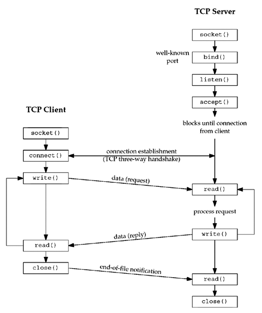
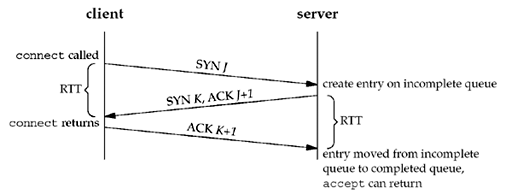
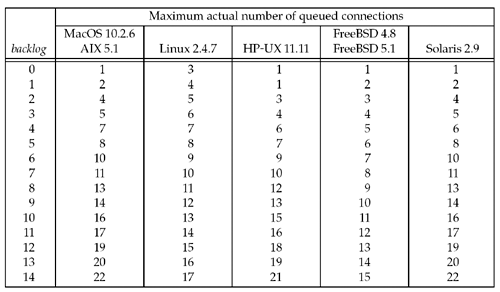

### **Chapter 4. Elementary TCP Sockets**

> In C, we cannot represent a constant structure on the right-hand side of an assignment.
> <small>[*UNP*](#wildcard-address-and-inaddr_any)</small>

### Introduction

This chapter describes the elementary socket functions required to write a complete TCP client and server, along with concurrent servers, a common Unix technique for providing concurrency when numerous clients are connected to the same server at the same time. Each client connection causes the server to fork a new process just for that client. In this chapter, we consider only the one-process-per-client model using `fork`.

The figure below shows a timeline of the typical scenario that takes place between a TCP client and server. First, the server is started, then sometime later, a client is started that connects to the server. We assume that the client sends a request to the server, the server processes the request, and the server sends a reply back to the client. This continues until the client closes its end of the connection, which sends an end-of-file notification to the server. The server then closes its end of the connection and either terminates or waits for a new client connection.

[](figure_4.1.png "Figure 4.1. Socket functions for elementary TCP client/server.")

### `socket` Function

To perform network I/O, the first thing a process must do is call the `socket` function, specifying the type of communication protocol desired (TCP using IPv4, UDP using IPv6, Unix domain stream protocol, etc.).

```c
#include <sys/socket.h>

int socket (int family, int type, int protocol);

/* Returns: non-negative descriptor if OK, -1 on error */
```

Arguments:

* *family* specifies the protocol family and is one of the constants in the table below. This argument is often referred to as *domain* instead of *family*.

    *family* | Description
    -------- | -----------
    `AF_INET` | IPv4 protocols
    `AF_INET6` | IPv6 protocols
    `AF_LOCAL` | Unix domain protocols ([Chapter 15](ch15.md))
    `AF_ROUTE` | Routing sockets ([Chapter 18](ch18.md))
    `AF_KEY` | Key socket ([Chapter 19](ch19.md))

* The socket *type* is one of the constants shown in table below:

    *type* | Description
    ------ | -----------
    `SOCK_STREAM` | stream socket
    `SOCK_DGRAM` | datagram socket
    `SOCK_SEQPACKET` | sequenced packet socket
    `SOCK_RAW` | raw socket

* The *protocol* argument to the `socket` function should be set to the specific protocol type found in the table below, or 0 to select the system's default for the given combination of *family* and *type*.

    *protocol* | Description
    ---------- | -----------
    `IPPROTO_TCP` | TCP transport protocol
    `IPPROTO_UDP` | UDP transport protocol
    `IPPROTO_SCTP` | SCTP transport protocol

Not all combinations of socket *family* and *type* are valid. The table below shows the valid combinations, along with the actual protocols that are valid for each pair. The boxes marked "Yes" are valid but do not have handy acronyms. The blank boxes are not supported.

| | | | | |
|-|-|-|-|-|-
| | `AF_INET` | `AF_INET6` | `AF_LOCAL` | `AF_ROUTE` | `AF_KEY`
|`SOCK_STREAM` | TCP/SCTP | TCP/SCTP | Yes | |
|`SOCK_DGRAM` | UDP | UDP | Yes | |
|`SOCK_SEQPACKET` | SCTP | SCTP | Yes | |
|`SOCK_RAW` | IPv4 | IPv6 | | Yes | Yes

Notes:

* You may also encounter the corresponding `PF_`*xxx* constant as the first argument to socket. This is discussed in the next section in this Chapter.
* You may encounter `AF_UNIX` (the historical Unix name) instead of `AF_LOCAL` (the POSIX name). This is discussed in [Chapter 15](ch15.md).
* Linux supports a new socket type, `SOCK_PACKET`, that provides access to the datalink, similar to BPF and DLPI ([Section 2.2](ch2.md#the-big-picture)). This is discussed in [Chapter 29](ch29.md)
* The key socket, `AF_KEY`, is newer than the others. It provides support for cryptographic security. Similar to the way that a routing socket (`AF_ROUTE`) is an interface to the kernel's routing table, the key socket is an interface into the kernel's key table. This is discussed in [Chapter 19](ch19.md).

On success, the socket function returns a small non-negative integer value, similar to a file descriptor. We call this a **socket descriptor**, or a *sockfd*. To obtain this socket descriptor, all we have specified is a protocol family (IPv4, IPv6, or Unix) and the socket type (stream, datagram, or raw). We have not yet specified either the local protocol address or the foreign protocol address.

#### `AF_`*xxx* Versus `PF_`*xxx*

The "`AF_`" prefix stands for "address family" and the "`PF_`" prefix stands for "protocol family." Historically, the intent was that a single protocol family might support multiple address families and that the `PF_` value was used to create the socket and the `AF_` value was used in socket address structures. But in actuality, a protocol family supporting multiple address families has never been supported and the `<sys/socket.h>` header defines the `PF_` value for a given protocol to be equal to the `AF_` value for that protocol. While there is no guarantee that this equality between the two will always be true, should anyone change this for existing protocols, lots of existing code would break.

To conform to existing coding practice, we use only the `AF_` constants in this text, although you may encounter the `PF_` value, mainly in calls to `socket`.

[p98-99]

### `connect` Function

The `connect` function is used by a TCP client to establish a connection with a TCP server.

```c
#include <sys/socket.h>

int connect(int sockfd, const struct sockaddr *servaddr, socklen_t addrlen);

/* Returns: 0 if OK, -1 on error */
```

* *sockfd* is a socket descriptor returned by the `socket` function.
* The *servaddr* and *addrlen* arguments are a pointer to a socket address structure (which contains the IP address and port number of the server) and its size. ([Section 3.3](ch3.md#value-result-arguments))

<u>The client does not have to call `bind` before calling `connect`: the kernel will choose both an ephemeral port and the source IP address if necessary.</u>

In the case of a TCP socket, the connect function initiates TCP's three-way handshake ([Section 2.6](ch2.md#tcp-connection-establishment-and-termination)). The function returns only when the connection is established or an error occurs. There are several different error returns possible:

1. If the client TCP receives no response to its SYN segment, `ETIMEDOUT` is returned.
    * For example, in 4.4BSD, the client sends one SYN when `connect` is called, sends another SYN 6 seconds later, and sends another SYN 24 seconds later. If no response is received after a total of 75 seconds, the error is returned.
    * Some systems provide administrative control over this timeout.
2. If the server's response to the client's SYN is a reset (RST), this indicates that no process is waiting for connections on the server host at the port specified (the server process is probably not running). This is a **hard error** and the error `ECONNREFUSED` is returned to the client as soon as the RST is received. An RST is a type of TCP segment that is sent by TCP when something is wrong. Three conditions that generate an RST are:
    * When a SYN arrives for a port that has no listening server.
    * When TCP wants to abort an existing connection.
    * When TCP receives a segment for a connection that does not exist.
3. If the client's SYN elicits an ICMP "destination unreachable" from some intermediate router, this is considered a **soft error**. The client kernel saves the message but keeps sending SYNs with the same time between each SYN as in the first scenario. If no response is received after some fixed amount of time (75 seconds for 4.4BSD), the saved ICMP error is returned to the process as either `EHOSTUNREACH` or `ENETUNREACH`. It is also possible that the remote system is not reachable by any route in the local system's forwarding table, or that the connect call returns without waiting at all. Note that Network unreachables are considered obsolete, and applications should just treat `ENETUNREACH` and `EHOSTUNREACH` as the same error.

#### Example: nonexistent host on the local subnet *

We run the client `daytimetcpcli` ([Figure 1.5](ch1.md#a-simple-daytime-client)) and specify an IP address that is on the local subnet (192.168.1/24) but the host ID (100) is nonexistent. When the client host sends out ARP requests (asking for that host to respond with its hardware address), it will never receive an ARP reply.

```shell-session
solaris % daytimetcpcli 192.168.1.100
connect error: Connection timed out
```

We only get the error after the connect times out. Notice that our `err_sys` function prints the human-readable string associated with the `ETIMEDOUT` error.

#### Example: no server process running *

We specify a host (a local router) that is not running a daytime server:

```shell-session
solaris % daytimetcpcli 192.168.1.5
connect error: Connection refused
```

The server responds immediately with an RST.

#### Example: destination not reachable on the Internet *

Our final example specifies an IP address that is not reachable on the Internet. If we watch the packets with `tcpdump`, we see that a router six hops away returns an ICMP host unreachable error.

```shell-session
solaris % daytimetcpcli 192.3.4.5
connect error: No route to host
```

As with the `ETIMEDOUT` error, `connect` returns the `EHOSTUNREACH` error only after waiting its specified amount of time.

In terms of the TCP state transition diagram ([Figure 2.4](figure_2.4.png)):

* `connect` moves from the CLOSED state (the state in which a socket begins when it is created by the `socket` function) to the SYN_SENT state, and then, on success, to the ESTABLISHED state.
* If `connect` fails, the socket is no longer usable and must be closed. We cannot call `connect` again on the socket.

In [Figure 11.10](ch4.md#tcp_connect-function), we will see that when we call `connect` in a loop, trying each IP address for a given host until one works, each time `connect` fails, we must close the socket descriptor and call `socket` again.

### `bind` Function

The `bind` function assigns a local protocol address to a socket. The protocol address is the combination of either a 32-bit IPv4 address or a 128-bit IPv6 address, along with a 16-bit TCP or UDP port number.

```c
#include <sys/socket.h>

int bind (int sockfd, const struct sockaddr *myaddr, socklen_t addrlen);

/* Returns: 0 if OK,-1 on error */
```

* The second argument *myaddr* is a pointer to a protocol-specific addres
* The third argument *addrlen* is the size of this address structure.

<u>With TCP, calling `bind` lets us specify a port number, an IP address, both, or neither.</u>

* **Servers bind their well-known port when they start.** ([Figure 1.9](ch1.md#a-simple-daytime-server)) If a TCP client or server does not do this, the kernel chooses an ephemeral port for the socket when either `connect` or `listen` is called.
    * It is normal for a TCP client to let the kernel choose an ephemeral port, unless the application requires a reserved port ([Figure 2.10](figure_2.10.png))
    * However, it is rare for a TCP server to let the kernel choose an ephemeral port, since servers are known by their well-known port.

    Exceptions to this rule are Remote Procedure Call (RPC) servers. They normally let the kernel choose an ephemeral port for their listening socket since this port is then registered with the RPC [port mapper](https://en.wikipedia.org/wiki/Portmap). Clients have to contact the port mapper to obtain the ephemeral port before they can connect to the server. This also applies to RPC servers using UDP.

* **A process can bind a specific IP address to its socket.** <u>The IP address must belong to an interface on the host.</u>
    * For a TCP client, this assigns the source IP address that will be used for IP datagrams sent on the socket. Normally, a TCP client does not `bind` an IP address to its socket. The kernel chooses the source IP address when the socket is connected, based on the outgoing interface that is used, which in turn is based on the route required to reach the server
    * For a TCP server, this restricts the socket to receive incoming client connections destined only to that IP address. <u>If a TCP server does not `bind` an IP address to its socket, the kernel uses the destination IP address of the client's SYN as the server's source IP address.</u>

As mentioned, calling `bind` lets us specify the IP address, the port, both, or neither. The following table summarizes the values to which we set `sin_addr` and `sin_port`, or `sin6_addr` and `sin6_port`, depending on the desired result.

IP address | Port | Result
---------- | ---- | ------
Wildcard | 0 | Kernel chooses IP address and port
Wildcard | nonzero | Kernel chooses IP address, process specifies port
Local IP address | 0 | Process specifies IP address, kernel chooses port
Local IP address | nonzero | Process specifies IP address and port

* If we specify a port number of 0, the kernel chooses an ephemeral port when `bind` is called.
* If we specify a wildcard IP address, the kernel does not choose the local IP address until either the socket is connected (TCP) or a datagram is sent on the socket (UDP).

#### Wildcard Address and `INADDR_ANY` *

With IPv4, the *wildcard* address is specified by the constant `INADDR_ANY`, whose value is normally 0. This tells the kernel to choose the IP address. [Figure 1.9](ch1.md#a-simple-daytime-server) has the assignment:

```c
    struct sockaddr_in   servaddr;
    servaddr.sin_addr.s_addr = htonl (INADDR_ANY);     /* wildcard */
```

While this works with IPv4, where an IP address is a 32-bit value that can be represented as a simple numeric constant (0 in this case), we cannot use this technique with IPv6, since the 128-bit IPv6 address is stored in a structure. <u>In C we cannot represent a constant structure on the right-hand side of an assignment.</u> To solve this problem, we write:

```c
struct sockaddr_in6    serv;
serv.sin6_addr = in6addr_any;     /* wildcard */
```

The system allocates and initializes the `in6addr_any` variable to the constant `IN6ADDR_ANY_INIT`. The `<netinet/in.h>` header contains the extern declaration for `in6addr_any`.

The value of `INADDR_ANY` (0) is the same in either network or host byte order, so the use of `htonl` is not really required. But, since all the `INADDR_`constants defined by the `<netinet/in.h>` header are defined in host byte order, we should use `htonl` with any of these constants.

If we tell the kernel to choose an ephemeral port number for our socket (by specifying a 0 for port number), `bind` does not return the chosen value. It cannot return this value since the second argument to `bind` has the `const` qualifier. <u>To obtain the value of the ephemeral port assigned by the kernel, we must call `getsockname` to return the protocol address.</u>

#### Binding a non-wildcard IP address *

A common example of a process binding a non-wildcard IP address to a socket is a host that provides Web servers to multiple organizations:

* First, each organization has its own domain name, such as www.organization.com.
* Next, each organization's domain name maps into a different IP address, but typically on the same subnet.

For example, if the subnet is 198.69.10, the first organization's IP address could be 198.69.10.128, the next 198.69.10.129, and so on. All these IP addresses are then *aliased* onto a single network interface (using the `alias` option of the `ifconfig` command on 4.4BSD, for example) so that the IP layer will accept incoming datagrams destined for any of the aliased addresses. Finally, one copy of the HTTP server is started for each organization and each copy `bind`s only the IP address for that organization.

An alternative technique is to run a single server that binds the wildcard address. When a connection arrives, the server calls `getsockname` to obtain the destination IP address from the client, which in our discussion above could be 198.69.10.128, 198.69.10.129, and so on. The server then handles the client request based on the IP address to which the connection was issued.

One advantage in binding a non-wildcard IP address is that the demultiplexing of a given destination IP address to a given server process is then done by the kernel.

We must be careful to distinguish between the interface on which a packet arrives versus the destination IP address of that packet. In [Section 8.8](ch8.md#verifying-received-response), we will talk about the **weak end system model** and the **strong end system model**. Most implementations employ the former, meaning it is okay for a packet to arrive with a destination IP address that identifies an interface other than the interface on which the packet arrives. (This assumes a multihomed host.) Binding a non-wildcard IP address restricts the datagrams that will be delivered to the socket based only on the destination IP address. It says nothing about the arriving interface, unless the host employs the strong end system model.

A common error from bind is `EADDRINUSE` ("Address already in use"), which is detailed in [Section 7.5](ch7.md#generic-socket-options) when discussing the `SO_REUSEADDR` and `SO_REUSEPORT` socket options.

### `listen` Function

The `listen` function is called only by a TCP server and it performs two actions:

1. The `listen` function converts an unconnected socket into a passive socket, indicating that the kernel should accept incoming connection requests directed to this socket. In terms of the TCP state transition diagram ([Figure 2.4](figure_2.4.png)), the call to `listen` moves the socket from the CLOSED state to the LISTEN state.
    * When a socket is created by the `socket` function (and before calling `listen`), it is assumed to be an active socket, that is, a client socket that will issue a `connect`.
2. The second argument *backlog* to this function specifies the maximum number of connections the kernel should queue for this socket.

This function is normally called after both the `socket` and `bind` functions and must be called before calling the `accept` function.

#### Connection queues *

To understand the *backlog* argument, we must realize that for a given listening socket, the kernel maintains two queues:

1. An **incomplete connection queue**, which contains an entry for each SYN that has arrived from a client for which the server is awaiting completion of the TCP three-way handshake. These sockets are in the `SYN_RCVD` state ([Figure 2.4](figure_2.4.png)).
2. A **completed connection queue**, which contains an entry for each client with whom the TCP three-way handshake has completed. These sockets are in the ESTABLISHED state ([Figure 2.4](figure_2.4.png)).

These two queues are depicted in the figure below:

[](figure_4.7.png "Figure 4.7. The two queues maintained by TCP for a listening socket.")

When an entry is created on the incomplete queue, the parameters from the listen socket are copied over to the newly created connection. <u>The connection creation mechanism is completely automatic; the server process is not involved.</u>

#### Packet exchanges during conenction establishment *

The following figure depicts the packets exchanged during the connection establishment with these two queues:

[](figure_4.8.png "Figure 4.8. TCP three-way handshake and the two queues for a listening socket.")

* When a SYN arrives from a client, TCP creates a new entry on the incomplete queue and then responds with the second segment of the three-way handshake: the server's SYN with an ACK of the client's SYN ([Section 2.6](ch2.md#tcp-connection-establishment-and-termination)).
* This entry will remain on the incomplete queue, until:
    * The third segment of the three-way handshake arrives (the client's ACK of the server's SYN), or
    * The entry times out. (Berkeley-derived implementations have a timeout of 75 seconds for these incomplete entries.)
* If the three-way handshake completes normally, the entry moves from the incomplete queue to the end of the completed queue.
* When the process calls `accept`:
    * The first entry on the completed queue is returned to the process, or
    * If the queue is empty, the process is put to sleep until an entry is placed onto the completed queue.

#### The *backlog* argument *

Several points to consider when handling the two queues:

* **Sum of both queues**. The *backlog* argument to the `listen` function has historically specified the maximum value for the sum of both queues.
* **Multiplied by 1.5**. Berkeley-derived implementations add a fudge factor to the *backlog*: It is multiplied by 1.5.
    * If the *backlog* specifies the maximum number of completed connections the kernel will queue for a socket, then the reason for the fudge factor is to take into account incomplete connections on the queue.
* **Do not specify value of 0** for *backlog*, as different implementations interpret this differently ([Figure 4.10](figure_4.10.png)). If you do not want any clients connecting to your listening socket, close the listening socket.
* **One RTT**. If the three-way handshake completes normally (no lost segments and no retransmissions), an entry remains on the incomplete connection queue for one RTT.
* **Configurable maximum value**. Many current systems allow the administrator to modify the maximum value for the *backlog*. Historically, sample code always shows a *backlog* of 5 (which is adequate today).
* **What value should the application specify for the *backlog* ** (5 is often inadequate)? There is no easy answer to this.
    * HTTP servers now specify a larger value, but if the value specified is a constant in the source code, to increase the constant requires recompiling the server.
    * Another method is to allow a command-line option or an environment variable to override the default. It is always acceptable to specify a value that is larger than supported by the kernel, as the kernel should silently truncate the value to the maximum value that it supports, without returning an error. The following example is the wrapper function for `listen` which allows the environment variable `LISTENQ` to override the value specified by the caller:

<small>[lib/wrapsock.c#L166](https://github.com/shichao-an/unpv13e/blob/master/lib/wrapsock.c#L166)</small>

```c
void
Listen(int fd, int backlog)
{
	char	*ptr;

		/* can override 2nd argument with environment variable */
	if ( (ptr = getenv("LISTENQ")) != NULL)
		backlog = atoi(ptr);

	if (listen(fd, backlog) < 0)
		err_sys("listen error");
}
/* end Listen */
```

* **Fixed number of connections**. Historically the reason for queuing a fixed number of connections is to handle the case of the server process being busy between successive calls to `accept`. This implies that of the two queues, the completed queue should normally have more entries than the incomplete queue. Again, busy Web servers have shown that this is false. The reason for specifying a large *backlog* is because the incomplete connection queue can grow as client SYNs arrive, waiting for completion of the three-way handshake.
* **No RST sent if queues are full**. If the queues are full when a client SYN arrives, TCP ignores the arriving SYN; it does not send an RST. This is because the condition is considered temporary, and the client TCP will retransmit its SYN, hopefully finding room on the queue in the near future. If the server TCP immediately responded with an RST, the client's `connect` would return an error, forcing the application to handle this condition instead of letting TCP's normal retransmission take over. Also, the client could not differentiate between an RST in response to a SYN meaning "there is no server at this port" versus "there is a server at this port but its queues are full."
* **Data queued in the socket's receive buffer**. Data that arrives after the three-way handshake completes, but before the server calls `accept`, should be queued by the server TCP, up to the size of the connected socket's receive buffer.

The following figure shows actual number of queued connections for values of *backlog*:

[](figure_4.10.png "Figure 4.10. Actual number of queued connections for values of backlog.")

#### SYN Flooding *

[**SYN flooding**](https://en.wikipedia.org/wiki/SYN_flood) is a type of attack (the attacker writes a program to send SYNs at a high rate to the victim) that attempts to fill the incomplete connection queue for one or more TCP ports. Additionally, the source IP address of each SYN is set to a random number (called [**IP spoofing**](https://en.wikipedia.org/wiki/IP_address_spoofing)) so that the server's SYN/ACK goes nowhere.This also prevents the server from knowing the real IP address of the attacker. By filling the incomplete queue with bogus SYNs, legitimate SYNs are not queued, providing a [denial of service](https://en.wikipedia.org/wiki/Denial-of-service_attack) to legitimate clients.

The `listen`'s *backlog* argument should specify the maximum number of completed connections for a given socket that the kernel will queue. The purpose ofto limit completed connections is to stop the kernel from accepting new connection requests for a given socket when the application is not accepting them. If a system implements this interpretation, then the application need not specify huge *backlog* values just because the server handles lots of client requests or to provide protection against SYN flooding. The kernel handles lots of incomplete connections, regardless of whether they are legitimate or from a hacker. But even with this interpretation, scenarios do occur where the traditional value of 5 is inadequate.

### `accept` Function

`accept` is called by a TCP server to return the next completed connection from the front of the completed connection queue ([Figure 4.7](figure_4.7.png)). If the completed connection queue is empty, the process is put to sleep (assuming the default of a blocking socket).

```c
#include <sys/socket.h>

int accept (int sockfd, struct sockaddr *cliaddr, socklen_t *addrlen);

/* Returns: non-negative descriptor if OK, -1 on error */
```

The *cliaddr* and *addrlen* arguments are used to return the protocol address of the connected peer process (the client). *addrlen* is a value-result argument ([Section 3.3](ch3.md#value-result-arguments)):

* Before the call, we set the integer value referenced by \**addrlen* to the size of the socket address structure pointed to by *cliaddr*;
* On return, this integer value contains the actual number of bytes stored by the kernel in the socket address structure.

If successful, `accept` returns a new descriptor automatically created by the kernel. This new descriptor refers to the TCP connection with the client.

* The **listening socket** is the first argument (*sockfd*) to `accept` (the descriptor created by `socket` and used as the first argument to both `bind` and `listen`).
* The **connected socket** is the return value from `accept` the connected socket.

It is important to differentiate between these two sockets:

* A given server normally creates only one listening socket, which then exists for the lifetime of the server.
* The kernel creates one connected socket for each client connection that is accepted (for which the TCP three-way handshake completes).
* When the server is finished serving a given client, the connected socket is closed.

This function returns up to three values:

* An integer return code that is either a new socket descriptor or an error indication,
* The protocol address of the client process (through the *cliaddr* pointer),
* The size of this address (through the *addrlen* pointer).

If we are not interested in having the protocol address of the client returned, we set both *cliaddr* and *addrlen* to null pointers. See [intro/daytimetcpsrv.c](https://github.com/shichao-an/unpv13e/blob/master/intro/daytimetcpsrv.c).

#### Example: Value-Result Arguments

The following code shows how to handle the value-result argument to `accept` by modifying the code from [intro/daytimetcpsrv.c](https://github.com/shichao-an/unpv13e/blob/master/intro/daytimetcpsrv.c) to print the IP address and port of the client:

```c
#include	"unp.h"
#include	<time.h>

int
main(int argc, char **argv)
{
	int					listenfd, connfd;
	socklen_t			len;
	struct sockaddr_in	servaddr, cliaddr;
	char				buff[MAXLINE];
	time_t				ticks;

	listenfd = Socket(AF_INET, SOCK_STREAM, 0);

	bzero(&servaddr, sizeof(servaddr));
	servaddr.sin_family      = AF_INET;
	servaddr.sin_addr.s_addr = htonl(INADDR_ANY);
	servaddr.sin_port        = htons(13);	/* daytime server */

	Bind(listenfd, (SA *) &servaddr, sizeof(servaddr));

	Listen(listenfd, LISTENQ);

	for ( ; ; ) {
		len = sizeof(cliaddr);
		connfd = Accept(listenfd, (SA *) &cliaddr, &len);
		printf("connection from %s, port %d\n",
			   Inet_ntop(AF_INET, &cliaddr.sin_addr, buff, sizeof(buff)),
			   ntohs(cliaddr.sin_port));

        ticks = time(NULL);
        snprintf(buff, sizeof(buff), "%.24s\r\n", ctime(&ticks));
        Write(connfd, buff, strlen(buff));

		Close(connfd);
	}
}
```

This program does the following:

* **New declarations**. Two new variables are defined:
    * `len` will be a value-result variable.
    * `cliaddr` will contain the client's protocol address.
* **Accept connection and print client's address**.
    * Initialize `len` to the size of the socket address structure
    * Pass a pointer to the `cliaddr` structure and a pointer to `len` as the second and third arguments to accept.
    * Call `inet_ntop` ([Section 3.7](ch3.md#inet_pton-and-inet_ntop-functions)) to convert the 32-bit IP address in the socket address structure to a dotted-decimal ASCII string and call `ntohs` ([Section 3.4](ch3.md#byte-ordering-functions)) to convert the 16-bit port number from network byte order to host byte order.

Run this new server and then run our client on the same host, connecting to our server twice in a row:

```text
solaris % daytimetcpcli 127.0.0.1
Thu Sep 11 12:44:00 2003
solaris % daytimetcpcli 192.168.1.20
Thu Sep 11 12:44:09 2003
```

We first specify the server's IP address as the loopback address (127.0.0.1) and then as its own IP address (192.168.1.20). Here is the corresponding server output:

```text
solaris # daytimetcpsrv1
connection from 127.0.0.1, port 43388
connection from 192.168.1.20, port 43389
```

Since our daytime client ([Figure 1.5](ch1.md#a-simple-daytime-client)) does not call `bind`, the kernel chooses the source IP address based on the outgoing interface that is used ([Section 4.4](ch4.md#bind-function)).

* In the first case, the kernel sets the source IP address to the loopback address;
* In the second case, it sets the address to the IP address of the Ethernet interface.

We can also see in this example that the ephemeral port chosen by the Solaris kernel is 43388, and then 43389

The pound sign (#) as the shell prompt indicates that our server must run with superuser privileges to bind the reserved port of 13. If we do not have superuser privileges, the call to `bind` will fail:

```text
solaris % daytimetcpsrv1
bind error: Permission denied
```
