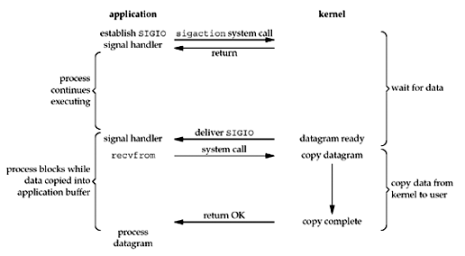
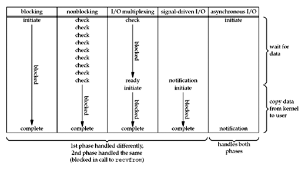
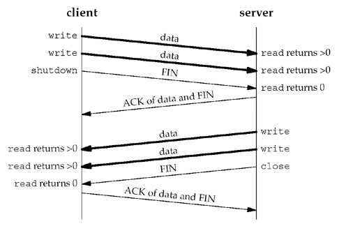
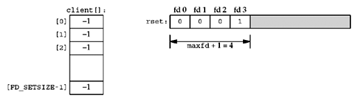

### **Chapter 6. I/O Multiplexing: The `select` and `poll` Functions**

### Introduction

When the TCP client is handling two inputs at the same time: standard input and a TCP socket, we encountered a problem when the client was blocked in a call to `fgets` (on standard input) and the server process was killed. The server TCP correctly sent a FIN to the client TCP, but since the client process was blocked reading from standard input, it never saw the EOF until it read from the socket (possibly much later).

We want to be notified if one or more I/O conditions are ready (i.e., input is ready to be read, or the descriptor is capable of taking more output). This capability is called **I/O multiplexing** and is provided by the `select` and `poll` functions, as well as a newer POSIX variation of the former, called `pselect`.

I/O multiplexing is typically used in networking applications in the following scenarios:

* When a client is handling multiple descriptors (normally interactive input and a network socket)
* When a client to handle multiple sockets at the same time (this is possible, but rare)
* If a TCP server handles both a listening socket and its connected sockets
* If a server handles both TCP and UDP
* If a server handles multiple services and perhaps multiple protocols

I/O multiplexing is not limited to network programming. Many nontrivial applications find a need for these techniques.

### I/O Models

We first examine the basic differences in the five I/O models that are available to us under Unix:

* blocking I/O
* nonblocking I/O
* I/O multiplexing (`select` and `poll`)
* signal driven I/O (`SIGIO`)
* asynchronous I/O (the POSIX `aio_` functions)

There are normally two distinct phases for an input operation:

1. Waiting for the data to be ready. This involves waiting for data to arrive on the network. When the packet arrives, it is copied into a buffer within the kernel.
2. Copying the data from the kernel to the process. This means copying the (ready) data from the kernel's buffer into our application buffer

#### Blocking I/O Model

The most prevalent model for I/O is the blocking I/O model (which we have used for all our examples in the previous sections). By default, all sockets are blocking. The scenario is shown in the figure below:

[](figure_6.1.png "Figure 6.1. Blocking I/O model.")

We use UDP for this example instead of TCP because with UDP, the concept of data being "ready" to read is simple: either an entire datagram has been received or it has not. With TCP it gets more complicated, as additional variables such as the socket's low-water mark come into play.

We also refer to `recvfrom` as a system call to differentiate between our application and the kernel, regardless of how `recvfrom` is implemented (system call on BSD and function that invokes `getmsg` system call on System V). There is normally a switch from running in the application to running in the kernel, followed at some time later by a return to the application.

In the figure above, the process calls `recvfrom` and the system call does not return until the datagram arrives and is copied into our application buffer, or an error occurs. The most common error is the system call being interrupted by a signal, as we described in [Section 5.9](ch5.md#handling-sigchld-signals). We say that the process is blocked the entire time from when it calls `recvfrom` until it returns. When `recvfrom` returns successfully, our application processes the datagram.

#### Nonblocking I/O Model

When a socket is set to be nonblocking, we are telling the kernel "when an I/O operation that I request cannot be completed without putting the process to sleep, do not put the process to sleep, but return an error instead". The figure is below:

[](figure_6.2.png "Figure 6.2. Nonblocking I/O model.")

* For the first three `recvfrom`, there is no data to return and the kernel immediately returns an error of `EWOULDBLOCK`.
* For the fourth time we call recvfrom, a datagram is ready, it is copied into our application buffer, and `recvfrom` returns successfully. We then process the data.

When an application sits in a loop calling `recvfrom` on a nonblocking descriptor like this, it is called **polling**. The application is continually polling the kernel to see if some operation is ready. This is often a waste of CPU time, but this model is occasionally encountered, normally on systems dedicated to one function.

#### I/O Multiplexing Model

With **I/O multiplexing**, we call `select` or `poll` and block in one of these two system calls, instead of blocking in the actual I/O system call. The figure is a summary of the I/O multiplexing model:

[](figure_6.3.png "Figure 6.3. I/O multiplexing model.")

We block in a call to `select`, waiting for the datagram socket to be readable. When `select` returns that the socket is readable, we then call `recvfrom` to copy the datagram into our application buffer.

##### **Comparing to the blocking I/O model** *

Comparing [Figure 6.3](figure_6.3.png) to [Figure 6.1](figure_6.1.png):

* Disadvantage: using `select` requires two system calls (`select` and `recvfrom`) instead of one
* Advantage: we can wait for more than one descriptor to be ready (see [the `select` function](#select-function) later in this chapter)

##### **Multithreading with blocking I/O** *

Another closely related I/O model is to use multithreading with blocking I/O. That model very closely resembles the model described above, except that instead of using `select` to block on multiple file descriptors, the program uses multiple threads (one per file descriptor), and each thread is then free to call blocking system calls like `recvfrom`.

#### Signal-Driven I/O Model

The **signal-driven I/O model** uses signals, telling the kernel to notify us with the `SIGIO` signal when the descriptor is ready. The figure is below:

[](figure_6.4.png "Figure 6.4. Signal-Driven I/O model.")

* We first enable the socket for signal-driven I/O ([Section 25.2](ch25.md)) and install a signal handler using the `sigaction` system call. The return from this system call is immediate and our process continues; it is not blocked.
* When the datagram is ready to be read, the `SIGIO` signal is generated for our process. We can either:
    * read the datagram from the signal handler by calling `recvfrom` and then notify the main loop that the data is ready to be processed ([Section 25.3](ch25.md))
    * notify the main loop and let it read the datagram.

The advantage to this model is that we are not blocked while waiting for the datagram to arrive. The main loop can continue executing and just wait to be notified by the signal handler that either the data is ready to process or the datagram is ready to be read.

#### Asynchronous I/O Model

**Asynchronous I/O** is defined by the POSIX specification, and various differences in the *real-time* functions that appeared in the various standards which came together to form the current POSIX specification have been reconciled.

These functions work by telling the kernel to start the operation and to notify us when the entire operation (including the copy of the data from the kernel to our buffer) is complete. <u>The main difference between this model and the signal-driven I/O model is that with signal-driven I/O, the kernel tells us when an I/O operation can be initiated, but with asynchronous I/O, the kernel tells us when an I/O operation is complete.</u> See the figure below for example:

[](figure_6.5.png "Figure 6.5. Asynchronous I/O model.")

* We call `aio_read` (the POSIX asynchronous I/O functions begin with `aio_` or `lio_`) and pass the kernel the following:
    * descriptor, buffer pointer, buffer size (the same three arguments for `read`),
    * file offset (similar to `lseek`),
    * and how to notify us when the entire operation is complete.

    This system call returns immediately and our process is not blocked while waiting for the I/O to complete.

* We assume in this example that we ask the kernel to generate some signal when the operation is complete. This signal is not generated until the data has been copied into our application buffer, which is different from the signal-driven I/O model.

#### Comparison of the I/O Models

The figure below is a comparison of the five different I/O models.

[](figure_6.6.png "Figure 6.6. Comparison of the five I/O models.")

The main difference between the first four models is the first phase, as the second phase in the first four models is the same: the process is blocked in a call to `recvfrom` while the data is copied from the kernel to the caller's buffer. Asynchronous I/O, however, handles both phases and is different from the first four.

#### Synchronous I/O versus Asynchronous I/O

POSIX defines these two terms as follows:

* A synchronous I/O operation causes the requesting process to be blocked until that I/O operation completes.
* An asynchronous I/O operation does not cause the requesting process to be blocked.

Using these definitions, the first four I/O models (blocking, nonblocking, I/O multiplexing, and signal-driven I/O) are all synchronous because the actual I/O operation (`recvfrom`) blocks the process. Only the asynchronous I/O model matches the asynchronous I/O definition.

### `select` Function

The `select` function allows the process to instruct the kernel to either:

* Wait for any one of multiple events to occur and to wake up the process only when one or more of these events occurs, or
* When a specified amount of time has passed.

This means that we tell the kernel what descriptors we are interested in (for reading, writing, or an exception condition) and how long to wait. The descriptors in which we are interested are not restricted to sockets; any descriptor can be tested using `select`.

```c
#include <sys/select.h>
#include <sys/time.h>

int select(int maxfdp1, fd_set *readset, fd_set *writeset, fd_set *exceptset,
           const struct timeval *timeout);

/* Returns: positive count of ready descriptors, 0 on timeout, –1 on error */
```

##### **The *timeout* argument** *

The *timeout* argument tells the kernel how long to wait for one of the specified descriptors to become ready. A `timeval` structure specifies the number of seconds and microseconds.

```c
struct timeval  {
  long   tv_sec;          /* seconds */
  long   tv_usec;         /* microseconds */
};
```
There are three possibilities for the *timeout*:

1. **Wait forever** (*timeout* is specified as a null pointer). Return only when one of the specified descriptors is ready for I/O.
2. **Wait up to a fixed amount of time** (*timeout* points to a `timeval` structure). Return when one of the specified descriptors is ready for I/O, but do not wait beyond the number of seconds and microseconds specified in the `timeval` structure.
3. **Do not wait at all** (*timeout* points to a `timeval` structure and the timer value is 0, i.e. the number of seconds and microseconds specified by the structure are 0). Return immediately after checking the descriptors. This is called **polling**.

Note:

* The wait in the first two scenarios is normally interrupted if the process catches a signal and returns from the signal handler. For portability, we must be prepared for `select` to return an error of `EINTR` if we are catching signals. Berkeley-derived kernels never automatically restart `select`.
* Although the `timeval` structure has a microsecond field `tv_usec`, the actual resolution supported by the kernel is often more coarse. Many Unix kernels round the timeout value up to a multiple of 10 ms. There is also a scheduling latency involved, meaning it takes some time after the timer expires before the kernel schedules this process to run.
* On some systems, the `timeval` structure can represent values that are not supported by `select`; it will fail with `EINVAL` if the `tv_sec` field in the timeout is over 100 million seconds.
* The `const` qualifier on the *timeout* argument means it is not modified by `select` on return.

##### **The descriptor sets arguments** *

The three middle arguments, *readset*, *writeset*, and *exceptset*, specify the descriptors that we want the kernel to test for reading, writing, and exception conditions. There are only two exception conditions currently supported:

* The arrival of [out-of-band data](https://en.wikipedia.org/wiki/Out-of-band_data) for a socket.
* The presence of control status information to be read from the master side of a pseudo-terminal that has been put into packet mode. (Not covered in UNP)

`select` uses **descriptor sets**, typically an array of integers, with each bit in each integer corresponding to a descriptor. For example, using 32-bit integers, the first element of the array corresponds to descriptors 0 through 31, the second element of the array corresponds to descriptors 32 through 63, and so on. All the implementation details are irrelevant to the application and are hidden in the `fd_set` datatype and the following four macros:

```c
void FD_ZERO(fd_set *fdset);         /* clear all bits in fdset */
void FD_SET(int fd, fd_set *fdset);  /* turn on the bit for fd in fdset */
void FD_CLR(int fd, fd_set *fdset);  /* turn off the bit for fd in fdset */
int FD_ISSET(int fd, fd_set *fdset); /* is the bit for fd on in fdset ? */
```

We allocate a descriptor set of the `fd_set` datatype, we set and test the bits in the set using these macros, and we can also assign it to another descriptor set across an equals sign (=) in C.

An array of integers using one bit per descriptor, is just one possible way to implement select. Nevertheless, it is common to refer to the individual descriptors within a descriptor set as bits, as in "turn on the bit for the listening descriptor in the read set."

The following example defines a variable of type `fd_set` and then turn on the bits for descriptors 1, 4, and 5:

```c
fd_set rset;

FD_ZERO(&rset);          /* initialize the set: all bits off */
FD_SET(1, &rset);        /* turn on bit for fd 1 */
FD_SET(4, &rset);        /* turn on bit for fd 4 */
FD_SET(5, &rset);        /* turn on bit for fd 5 */
```

It is important to initialize the set, since unpredictable results can occur if the set is allocated as an automatic variable and not initialized.

Any of the middle three arguments to `select`, *readset*, *writeset*, or *exceptset*, can be specified as a null pointer if we are not interested in that condition. Indeed, if all three pointers are null, then we have a higher precision timer than the normal Unix `sleep` function. The `poll` function provides similar functionality.

##### **The *maxfdp1* argument** *

The *maxfdp1* argument specifies the number of descriptors to be tested. Its value is the maximum descriptor to be tested plus one. The descriptors 0, 1, 2, up through and including *maxfdp1*–1 are tested.

The constant `FD_SETSIZE`, defined by including `<sys/select.h>`, is the number of descriptors in the `fd_set` datatype. Its value is often 1024, but few programs use that many descriptors.

The reason the *maxfdp1* argument exists, along with the burden of calculating its value, is for efficiency. Although each `fd_set` has room for many descriptors, typically 1,024, this is much more than the number used by a typical process. The kernel gains efficiency by not copying unneeded portions of the descriptor set between the process and the kernel, and by not testing bits that are always 0.

##### ***readset*, *writeset*, and *exceptset* as value-result arguments** *

`select` modifies the descriptor sets pointed to by the *readset*, *writeset*, and *exceptset* pointers. These three arguments are value-result arguments. When we call the function, we specify the values of the descriptors that we are interested in, and on return, the result indicates which descriptors are ready. We use the `FD_ISSET` macro on return to test a specific descriptor in an `fd_set` structure. Any descriptor that is not ready on return will have its corresponding bit cleared in the descriptor set. To handle this, we turn on all the bits in which we are interested in all the descriptor sets each time we call select.

##### **Return value of `select`** *

The return value from this function indicates the total number of bits that are ready across all the descriptor sets. If the timer value expires before any of the descriptors are ready, a value of 0 is returned. A return value of –1 indicates an error (which can happen, for example, if the function is interrupted by a caught signal).


#### Conditions for a Ready Descriptor

Previous sections discusses waiting for a descriptor to become ready for I/O (reading or writing) or to have an exception condition pending on it (out-of-band data). The following discussion are specific about the conditions that cause select to return "ready" for sockets

1. **A socket is ready for reading** if any of the following four conditions is true:
    * The number of bytes of data in the socket receive buffer is greater than or equal to the current size of the low-water mark for the socket receive buffer. A read operation on the socket will not block and will return a value greater than 0 (i.e., the data that is ready to be read). We can set this low-water mark using the `SO_RCVLOWAT` socket option. It defaults to 1 for TCP and UDP sockets.
    * The read half of the connection is closed (i.e., a TCP connection that has received a FIN). A read operation on the socket will not block and will return 0 (i.e., EOF).
    * The socket is a listening socket and the number of completed connections is nonzero.
    * A socket error is pending. A read operation on the socket will not block and will return an error (–1) with `errno` set to the specific error condition. These pending errors can also be fetched and cleared by calling `getsockopt` and specifying the `SO_ERROR` socket option.
2. **A socket is ready for writing** if any of the following four conditions is true:
    * The number of bytes of available space in the socket send buffer is greater than or equal to the current size of the low-water mark for the socket send buffer and either: (i) the socket is connected, or (ii) the socket does not require a connection (e.g., UDP). This means that if we set the socket to nonblocking ([Chapter 16](ch16.md)), a write operation will not block and will return a positive value (e.g., the number of bytes accepted by the transport layer). We can set this low-water mark using the `SO_SNDLOWAT` socket option. This low-water mark normally defaults to 2048 for TCP and UDP sockets.
    * The write half of the connection is closed. A write operation on the socket will generate `SIGPIPE` ([Section 5.12](ch5.md#sigpipe-signal)).
    * A socket using a non-blocking connect has completed the connection, or the connect has failed.
    * A socket error is pending. A write operation on the socket will not block and will return an error (–1) with `errno` set to the specific error condition. These pending errors can also be fetched and cleared by calling getsockopt with the `SO_ERROR` socket option.
3. **A socket has an exception condition pending if there is out-of-band data for the socket or the socket is still at the out-of-band mark** ([Chapter 24](ch24.md)).

<u>When an error occurs on a socket, it is marked as both readable and writable by select.</u>

The purpose of the receive and send low-water marks is to give the application control over how much data must be available for reading or how much space must be available for writing before select returns a readable or writable status. For example, if we know that our application has nothing productive to do unless at least 64 bytes of data are present, we can set the receive low-water mark to 64 to prevent select from waking us up if less than 64 bytes are ready for reading.

As long as the send low-water mark for a UDP socket is less than the send buffer size (which should always be the default relationship), the UDP socket is always writable, since a connection is not required.

The following table is the summary of conditions that cause a socket to be ready for select.

Condition | Readable? | Writable? | Exception
--------- | --------- | --------- | ---------
Data to read | x | |
Read half of the connection closed | x | |
New connection ready for listening socket | x | |
Space available for writing | | x |
Write half of the connection closed | | x |
Pending error | x | x |
TCP out-of-band data | | | x

#### Maximum Number of Descriptors for `select`

Most applications do not use lots of descriptors. It is rare to find an application that uses hundreds of descriptors, but such applications do exist, and they often use `select` to multiplex the descriptors.

When `select` was originally designed, the OS normally had an upper limit on the maximum number of descriptors per process (the 4.2BSD limit was 31), and select just used this same limit. But, current versions of Unix allow for a virtually unlimited number of descriptors per process (often limited only by the amount of memory and any administrative limits), which affects `select`.

Many implementations have declarations similar to the following, which are taken from the 4.4BSD `<sys/types.h>` header:

```c
/*
 * Select uses bitmasks of file descriptors in longs. These macros
 * manipulate such bit fields (the filesystem macros use chars).
 * FD_SETSIZE may be defined by the user, but the default here should
 * be enough for most uses.
 */
#ifndef FD_SETSIZE
#define FD_SETSIZE      256
#endif
```

This makes us think that we can just `#define FD_SETSIZE` to some larger value before including this header to increase the size of the descriptor sets used by `select`. Unfortunately, this normally does not work. The three descriptor sets are declared within the kernel and also uses the kernel's definition of `FD_SETSIZE` as the upper limit. The only way to increase the size of the descriptor sets is to increase the value of `FD_SETSIZE` and then recompile the kernel. Changing the value without recompiling the kernel is inadequate.

Some vendors are changing their implementation of select to allow the process to define `FD_SETSIZE` to a larger value than the default. BSD/OS has changed the kernel implementation to allow larger descriptor sets, and it also provides four new `FD_`*xxx* macros to dynamically allocate and manipulate these larger sets. From a portability standpoint, however, beware of using large descriptor sets.

### `str_cli` Function (Revisited)

The problem with earlier version of the `str_cli` ([Section 5.5](ch5.md#tcp-echo-client-str_cli-function)) was that we could be blocked in the call to `fgets` when something happened on the socket. We can now rewrite our `str_cli` function using `select` so that:

* The client process is notified as soon as the server process terminates.
* The client process blocks in a call to `select` waiting for either standard input or the socket to be readable.

The figure below shows the various conditions that are handled by our call to `select`:

[](figure_6.8.png "Figure 6.8. Conditions handled by select in str_cli.")

Three conditions are handled with the socket:

1. If the peer TCP sends data, the socket becomes readable and read `returns` greater than 0 (the number of bytes of data).
2. If the peer TCP sends a FIN (the peer process terminates), the socket becomes readable and read returns 0 (EOF).
3. If the peer TCP sends an RST (the peer host has crashed and rebooted), the socket becomes readable, read returns –1, and `errno` contains the specific error code.

Below is the source code for this new version.

<small>[select/strcliselect01.c](https://github.com/shichao-an/unpv13e/blob/master/select/strcliselect01.c)</small>

```c
#include	"unp.h"

void
str_cli(FILE *fp, int sockfd)
{
	int			maxfdp1;
	fd_set		rset;
	char		sendline[MAXLINE], recvline[MAXLINE];

	FD_ZERO(&rset);
	for ( ; ; ) {
		FD_SET(fileno(fp), &rset);
		FD_SET(sockfd, &rset);
		maxfdp1 = max(fileno(fp), sockfd) + 1;
		Select(maxfdp1, &rset, NULL, NULL, NULL);

		if (FD_ISSET(sockfd, &rset)) {	/* socket is readable */
			if (Readline(sockfd, recvline, MAXLINE) == 0)
				err_quit("str_cli: server terminated prematurely");
			Fputs(recvline, stdout);
		}

		if (FD_ISSET(fileno(fp), &rset)) {  /* input is readable */
			if (Fgets(sendline, MAXLINE, fp) == NULL)
				return;		/* all done */
			Writen(sockfd, sendline, strlen(sendline));
		}
	}
}
```

This code does the following:

* **Call `select`**.
    * We only need one descriptor set (`rset`) to check for readability. This set is initialized by `FD_ZERO` and then two bits are turned on using `FD_SET`: the bit corresponding to the standard I/O file pointer, `fp`, and the bit corresponding to the socket, `sockfd`. The function `fileno` converts a standard I/O file pointer into its corresponding descriptor, since `select` (and `poll`) work only with descriptors.
    * `select` is called after calculating the maximum of the two descriptors. In the call, the write-set pointer and the exception-set pointer are both null pointers. The final argument (the time limit) is also a null pointer since we want the call to block until something is ready.
* **Handle readable socket**. On return from select, if the socket is readable, the echoed line is read with `readline` and output by `fputs`.
* **Handle readable input**. If the standard input is readable, a line is read by `fgets` and written to the socket using `writen`.

Instead of the function flow being driven by the call to `fgets`, it is now driven by the call to `select`.

### Batch Input and Buffering

Unfortunately, our `str_cli` function is still not correct. Our original version in [Section 5.5](ch5.md#tcp-echo-client-str_cli-function) operates in a stop-and-wait mode, which is fine for interactive use: It sends a line to the server and then waits for the reply. This amount of time is one RTT plus the server's processing time (which is close to 0 for a simple echo server). We can therefore estimate how long it will take for a given number of lines to be echoed if we know the RTT between the client and server. We can use `ping` to measure RTTs.

#### Stop-and-wait mode *

If we consider the network between the client and server as a full-duplex pipe, with requests going from the client to the server and replies in the reverse direction, then the following figure shows our stop-and-wait mode:

[](figure_6.10.png "Figure 6.10. Time line of stop-and-wait mode: interactive input.")

Note that this figure:

* Assumes that there is no server processing time and that the size of the request is the same as the reply
* Shows show only the data packets, ignoring the TCP acknowledgments that are also going across the network

A request is sent by the client at time 0 and we assume an RTT of 8 units of time. The reply sent at time 4 is received at time 7.

This stop-and-wait mode is fine for interactive input. The problem is: if we run our client in a batch mode, when we redirect the input and output, however, the resulting output file is always smaller than the input file (and they should be identical for an echo server).

#### Batch mode *

To see what's happening, realize that in a batch mode, we can keep sending requests as fast as the network can accept them. The server processes them and sends back the replies at the same rate. This leads to the full pipe at time 7, as shown below:

[](figure_6.11.png "Figure 6.11. Filling the pipe between the client and server: batch mode.")

We assume:

* After sending the first request, we immediately send another, and then another
* We can keep sending requests as fast as the network can accept them, along with processing replies as fast as the network supplies them.

Assume that the input file contains only nine lines. The last line is sent at time 8, as shown in the above figure. But we cannot close the connection after writing this request because there are still other requests and replies in the pipe. The cause of the problem is our handling of an EOF on input: The function returns to the `main` function, which then terminates. But <u>in a batch mode, an EOF on input does not imply that we have finished reading from the socket; there might still be requests on the way to the server, or replies on the way back from the server.</u>

The solution is to close one-half of the TCP connection by sending a FIN to the server, telling it we have finished sending data, but leave the socket descriptor open for reading. This is done with the `shutdown` function, described in the next section.

#### Buffering concerns *

Buffering for performance as in `str_cli` ([Section 6.7](#str_cli-function-revisited)) adds complexity to a network application.

When several lines of input are available from the standard input. `select` will cause the code ([select/strcliselect01.c#L24](https://github.com/shichao-an/unpv13e/blob/master/select/strcliselect01.c#L24)) to read the input using `fgets`, which will read the available lines into a buffer used by stdio. But, `fgets` only returns a single line and leaves any remaining data sitting in the stdio buffer. The following code ([select/strcliselect01.c#L26](https://github.com/shichao-an/unpv13e/blob/master/select/strcliselect01.c#L26)) writes that single line to the server and then `select` is called again to wait for more work, even if there are additional lines to consume in the stdio buffer. The reason is that `select` knows nothing of the buffers used by stdio;it will only show readability from the viewpoint of the `read` system call, not calls like `fgets`. Thus, mixing stdio and `select` is considered very error-prone and should only be done with great care.

The same problem exists with `readline` in this example (`str_cli` function). Instead of data being hidden from `select` in a stdio buffer, it is hidden in `readline`'s buffer. In [Section 3.9](ch3.md#readn-writen-and-readline-functions) we provided a function ([lib/readline.c#L52](https://github.com/shichao-an/unpv13e/blob/master/lib/readline.c#L52)) that gives visibility into `readline`'s buffer, so one possible solution is to modify our code to use that function before calling `select` to see if data has already been read but not consumed. But again, the complexity grows out of hand quickly when we have to handle the case where the readline buffer contains a partial line (meaning we still need to read more) as well as when it contains one or more complete lines (which we can consume).

We will address these buffering concerns in the improved version of `str_cli` shown in [Section 6.7](#str_cli-function-revisited-again).

### `shutdown` Function

The normal way to terminate a network connection is to call the `close` function. But, there are two limitations with `close` that can be avoided with `shutdown`:

1. `close` decrements the descriptor's reference count and closes the socket only if the count reaches 0 ([Section 4.8](ch4.md#concurrent-servers)). With `shutdown`, we can initiate TCP's normal connection termination sequence (the four segments beginning with a FIN in [Figure 2.5](figure_2.5.png)), regardless of the reference count.
2. `close` terminates both directions of data transfer, reading and writing. Since a TCP connection is full-duplex, there are times when we want to tell the other end that we have finished sending, even though that end might have more data to send us. This is the scenario we encountered in the previous section with batch input to our `str_cli` function. The figure below shows the typical function calls in this scenario.

[](figure_6.12.png "Figure 6.12. Calling shutdown to close half of a TCP connection.")


```c
#include <sys/socket.h>

int shutdown(int sockfd, int howto);

/* Returns: 0 if OK, –1 on error */
```

The action of the function depends on the value of the *howto* argument:

* `SHUT_RD`: **The read half of the connection is closed.** No more data can be received on the socket and any data currently in the socket receive buffer is discarded. The process can no longer issue any of the read functions on the socket. Any data received after this call for a TCP socket is acknowledged and then silently discarded.
* `SHUT_WR`: **The write half of the connection is closed.** In the case of TCP, this is called a **half-close**. Any data currently in the socket send buffer will be sent, followed by TCP's normal connection termination sequence. As we mentioned earlier, this closing of the write half is done regardless of whether or not the socket descriptor's reference count is currently greater than 0. The process can no longer issue any of the write functions on the socket.
* `SHUT_RDWR`: **The read half and the write half of the connection are both closed.** This is equivalent to calling `shutdown` twice: first with `SHUT_RD` and then with `SHUT_WR`.

The three `SHUT_`*xxx* names are defined by the POSIX specification. Typical values for the howto argument that you will encounter will be 0 (close the read half), 1 (close the write half), and 2 (close the read half and the write half).

### `str_cli` Function (Revisited Again)

The following code is our revised and correct version of the `str_cli` function that uses `select` and `shutdown`. In the function, `select` notifies us as soon as the server closes its end of the connection and `shutdown` lets us handle batch input correctly.

<small>[select/strcliselect02.c](https://github.com/shichao-an/unpv13e/blob/master/select/strcliselect02.c)</small>

```c
#include	"unp.h"

void
str_cli(FILE *fp, int sockfd)
{
	int			maxfdp1, stdineof;
	fd_set		rset;
	char		buf[MAXLINE];
	int		n;

	stdineof = 0;
	FD_ZERO(&rset);
	for ( ; ; ) {
		if (stdineof == 0)
			FD_SET(fileno(fp), &rset);
		FD_SET(sockfd, &rset);
		maxfdp1 = max(fileno(fp), sockfd) + 1;
		Select(maxfdp1, &rset, NULL, NULL, NULL);

		if (FD_ISSET(sockfd, &rset)) {	/* socket is readable */
			if ( (n = Read(sockfd, buf, MAXLINE)) == 0) {
				if (stdineof == 1)
					return;		/* normal termination */
				else
					err_quit("str_cli: server terminated prematurely");
			}

			Write(fileno(stdout), buf, n);
		}

		if (FD_ISSET(fileno(fp), &rset)) {  /* input is readable */
			if ( (n = Read(fileno(fp), buf, MAXLINE)) == 0) {
				stdineof = 1;
				Shutdown(sockfd, SHUT_WR);	/* send FIN */
				FD_CLR(fileno(fp), &rset);
				continue;
			}

			Writen(sockfd, buf, n);
		}
	}
}
```

* `stdineof` is a new flag that is initialized to 0. As long as this flag is 0, each time around the main loop, we `select` on standard input for readability.
* **Normal and premature termination.** When we read the EOF on the socket, and:
    * If we have already encountered an EOF on standard input, this is normal termination and the function returns.
    * If we have not yet encountered an EOF on standard input, the server process has prematurely terminated. We now call `read` and `write` to operate on buffers instead of lines and allow select to work for us as expected.
* `shutdown`. When we encounter the EOF on standard input, our new flag, `stdineof`, is set and we call `shutdown` with a second argument of `SHUT_WR` to send the FIN. Here we also use buffers instead of lines, using `read` and `writen`.

### TCP Echo Server (Revisited)

We now rewrite the TCP echo server ([Section 5.2](ch5.md#tcp-echo-server-main-function) and [5.3](ch5.md#tcp-echo-server-str_echo-function) as a single process that uses `select` to handle any number of clients, instead of `fork`ing one child per client.

#### Before first client has established a connection *

Before the first client has established a connection, the server has a single listening descriptor.

* The server maintains only a read descriptor set (*rset*), shown in the following figure. Assuming the server is started in the foreground, descriptors 0, 1, and 2 are set to standard input, output, and error, so the first available descriptor for the listening socket is 3.
* We also show an array of integers named `client` that contains the connected socket descriptor for each client. All elements in this array are initialized to –1.

[](figure_6.15.png "Figure 6.15. Data structures for TCP server with just a listening socket.")

The only nonzero entry in the descriptor set is the entry for the listening sockets and the first argument to `select` will be 4.

#### After first client establishes connection *

When the first client establishes a connection with our server, the listening descriptor becomes readable and our server calls `accept`. The new connected descriptor returned by accept will be 4. The following figure shows this connection:

[](figure_6.16.png "Figure 6.16. TCP server after first client establishes connection.")

The server must remember the new connected socket in its `client` array, and the connected socket must be added to the descriptor set. The updated data structures are shown in the figure below:

[](figure_6.17.png "Figure 6.17. Data structures after first client connection is established.")

#### After second client connection is established *

Sometime later a second client establishes a connection and we have the scenario shown below:

[](figure_6.18.png "Figure 6.18. TCP server after second client connection is established.")

The new connected socket (which we assume is 5) must be remembered, giving the data structures shown below:

[](figure_6.19.png "Figure 6.19. Data structures after second client connection is established.")

#### After first client terminates its connection *

Next, we assume the first client terminates its connection. The client TCP sends a FIN, which makes descriptor 4 in the server readable. When our server reads this connected socket, `read` returns 0. We then close this socket and update our data structures accordingly. The value of `client[0]` is set to –1 and descriptor 4 in the descriptor set is set to 0. This is shown in the figure below. Notice that the value of `maxfd` does not change.

[](figure_6.20.png "Figure 6.20. Data structures after first client terminates its connection.")

#### Summary of TCP echo server (revisited) *

* As clients arrive, we record their connected socket descriptor in the first available entry in the client array (the first entry with a value of –1) and also add the connected socket to the read descriptor set.
* The variable `maxi` is the highest index in the client array that is currently in use and the variable `maxfd` (plus one) is the current value of the first argument to select.
* The only limit on the number of clients that this server can handle is the minimum of the two values `FD_SETSIZE` and the maximum number of descriptors allowed for this process by the kernel ([Section 6.3](#maximum-number-of-descriptors-for-select)).

<small>[tcpcliserv/tcpservselect01.c](https://github.com/shichao-an/unpv13e/blob/master/tcpcliserv/tcpservselect01.c)</small>

```c
/* include fig01 */
#include	"unp.h"

int
main(int argc, char **argv)
{
	int					i, maxi, maxfd, listenfd, connfd, sockfd;
	int					nready, client[FD_SETSIZE];
	ssize_t				n;
	fd_set				rset, allset;
	char				buf[MAXLINE];
	socklen_t			clilen;
	struct sockaddr_in	cliaddr, servaddr;

	listenfd = Socket(AF_INET, SOCK_STREAM, 0);

	bzero(&servaddr, sizeof(servaddr));
	servaddr.sin_family      = AF_INET;
	servaddr.sin_addr.s_addr = htonl(INADDR_ANY);
	servaddr.sin_port        = htons(SERV_PORT);

	Bind(listenfd, (SA *) &servaddr, sizeof(servaddr));

	Listen(listenfd, LISTENQ);

	maxfd = listenfd;			/* initialize */
	maxi = -1;					/* index into client[] array */
	for (i = 0; i < FD_SETSIZE; i++)
		client[i] = -1;			/* -1 indicates available entry */
	FD_ZERO(&allset);
	FD_SET(listenfd, &allset);
/* end fig01 */

/* include fig02 */
	for ( ; ; ) {
		rset = allset;		/* structure assignment */
		nready = Select(maxfd+1, &rset, NULL, NULL, NULL);

		if (FD_ISSET(listenfd, &rset)) {	/* new client connection */
			clilen = sizeof(cliaddr);
			connfd = Accept(listenfd, (SA *) &cliaddr, &clilen);
#ifdef	NOTDEF
			printf("new client: %s, port %d\n",
					Inet_ntop(AF_INET, &cliaddr.sin_addr, 4, NULL),
					ntohs(cliaddr.sin_port));
#endif

			for (i = 0; i < FD_SETSIZE; i++)
				if (client[i] < 0) {
					client[i] = connfd;	/* save descriptor */
					break;
				}
			if (i == FD_SETSIZE)
				err_quit("too many clients");

			FD_SET(connfd, &allset);	/* add new descriptor to set */
			if (connfd > maxfd)
				maxfd = connfd;			/* for select */
			if (i > maxi)
				maxi = i;				/* max index in client[] array */

			if (--nready <= 0)
				continue;				/* no more readable descriptors */
		}

		for (i = 0; i <= maxi; i++) {	/* check all clients for data */
			if ( (sockfd = client[i]) < 0)
				continue;
			if (FD_ISSET(sockfd, &rset)) {
				if ( (n = Read(sockfd, buf, MAXLINE)) == 0) {
						/* connection closed by client */
					Close(sockfd);
					FD_CLR(sockfd, &allset);
					client[i] = -1;
				} else
					Writen(sockfd, buf, n);

				if (--nready <= 0)
					break;				/* no more readable descriptors */
			}
		}
	}
}
/* end fig02 */
```

The code does the following:

* **Create listening socket and initialize for `select`.** We create the listening socket using `socket`, `bind`, and `listen` and initialize our data structures assuming that the only descriptor that we will `select` on initially is the listening socket.
* **Block in `select`**. `select` waits for something to happen, which is one of the following:
    * The establishment of a new client connection.
    * The arrival of data on the existing connection.
    * A FIN on the existing connection.
    * A RST on the existing connection.
* **`accept` new connections**. * If the listening socket is readable, a new connection has been established.
    * We call `accept` and update our data structures accordingly. We use the first unused entry in the `client` array to record the connected socket.
    * The number of ready descriptors is decremented, and if it is 0 ([tcpcliserv/tcpservselect01.c#L62](https://github.com/shichao-an/unpv13e/blob/master/tcpcliserv/tcpservselect01.c#L62)), we can avoid the next `for` loop. This lets us use the return value from `select` to avoid checking descriptors that are not ready.
* **Check existing connections**.
    * In the second nested `for` loop, a test is made for each existing client connection as to whether or not its descriptor is in the descriptor set returned by `select`, and a line is read from the client and echoed back to the client. Otherwsie, if the client closes the connection, read returns 0 and we update our data structures accordingly.
    * We never decrement the value of `maxi`, but we could check for this possibility each time a client closes its connection.

This server is more complicated than the earlier version ([Section 5.2](ch5.md#tcp-echo-server-main-function) and [5.3](ch5.md#tcp-echo-server-str_echo-function), but it avoids all the overhead of creating a new process for each client and it is a nice example of `select`. Nevertheless, in [Section 16.6](ch16.md#nonblocking-accept), we will describe a problem with this server that is easily fixed by making the listening socket nonblocking and then checking for, and ignoring, a few errors from `accept`.

#### Denial-of-Service Attacks

There is a problem with the server in the above example. If a malicious client connects to the server, sends one byte of data (other than a newline), and then goes to sleep. The server will call `read`, which will read the single byte of data from the client and then block in the next call to `read`, waiting for more data from this client. The server is then blocked ("hung") by this one client and will not service any other clients, until the malicious client either sends a newline or terminates.

The basic concept here is that when a server is handling multiple clients, the server can never block in a function call related to a single client. Doing so can hang the server and deny service to all other clients. This is called a **denial-of-service** attack, which prevents the server from servicing other legitimate clients.

Possible solutions are:

* Use nonblocking I/O ([Chapter 16](ch16.md))
* Have each client serviced by a separate thread of control (either spawn a process or a thread to service each client)
* Place a timeout on the I/O operations

### `pselect` Function

The `pselect` function was invented by POSIX and is now supported by many of the Unix variants.

```c
#include <sys/select.h>
#include <signal.h>
#include <time.h>

int pselect (int maxfdp1, fd_set *readset, fd_set *writeset, fd_set *exceptset,
             const struct timespec *timeout, const sigset_t *sigmask);

/* Returns: count of ready descriptors, 0 on timeout, –1 on error */
```

`pselect` contains two changes from the normal `select` function:

1. `pselect` uses the `timespec` structure (another POSIX invention) instead of the `timeval` structure. The `tv_nsec` member of the newer structure specifies nanoseconds, whereas the `tv_usec` member of the older structure specifies microseconds.

        struct timespec {
          time_t tv_sec;       /* seconds */
          long   tv_nsec;      /* nanoseconds */
        };

2. `pselect` adds a sixth argument: a pointer to a signal mask. This allows the program to disable the delivery of certain signals, test some global variables that are set by the handlers for these now-disabled signals, and then call `pselect`, telling it to reset the signal mask.

With regard to the second point, consider the following example (discussed on [APUE](../apue/ch10.md#example-of-signals-that-synchronize-a-parent-and-child)). Our program's signal handler for `SIGINT` just sets the global `intr_flag` and returns. If our process is blocked in a call to `select`, the return from the signal handler causes the function to return with `errno` set to `EINTR`. But when `select` is called, the code looks like the following:

```c
if (intr_flag)
    handle_intr();       /* handle the signal */

/* signals occurring in here are lost */

if ( (nready = select( ... )) < 0) {
    if (errno == EINTR) {
        if (intr_flag)
            handle_intr();
    }
    ...
}
```

The problem is that between the test of `intr_flag` and the call to `select`, if the signal occurs, it will be lost if `select` blocks forever.

With `pselect`, we can now code this example reliably as:

```c
sigset_t newmask, oldmask, zeromask;

sigemptyset(&zeromask);
sigemptyset(&newmask);
sigaddset(&newmask, SIGINT);

sigprocmask(SIG_BLOCK, &newmask, &oldmask); /* block SIGINT */
if (intr_flag)
    handle_intr();     /* handle the signal */
if ( (nready = pselect ( ... , &zeromask)) < 0) {
    if (errno == EINTR)  {
        if (intr_flag)
            handle_intr ();
    }
    ...
}
```

Before testing the `intr_flag` variable, we block `SIGINT`. When `pselect` is called, it replaces the signal mask of the process with an empty set (i.e., `zeromask`) and then checks the descriptors, possibly going to `sleep`. But when `pselect` returns, the signal mask of the process is reset to its value before `pselect` was called (i.e., `SIGINT` is blocked).

