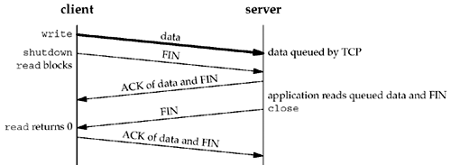
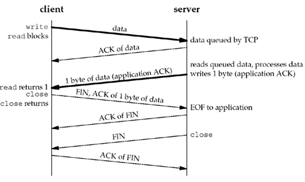

### **Chapter 7. Socket Options**

### Introduction

There are various ways to get and set the options that affect a socket:

* The `getsockopt` and `setsockopt` functions.
* The `fcntl` function, which is the POSIX way to set a socket for nonblocking I/O, signal-driven I/O, and to set the owner of a socket.
* The `ioctl` function.

### `getsockopt` and `setsockopt` Functions

These two functions apply only to sockets:

```c
#include <sys/socket.h>

int getsockopt(int sockfd, int level, int optname, void *optval, socklen_t *optlen);
int setsockopt(int sockfd, int level, int optname, const void *optval socklen_t optlen);

/* Both return: 0 if OK,–1 on error */
```

Arguments:

* *sockfd* must refer to an open socket descriptor.
* *level* specifies the code in the system that interprets the option: the general socket code or some protocol-specific code (e.g., IPv4, IPv6, TCP, or SCTP).
* *optval* is a pointer to a variable from which the new value of the option is fetched by `setsockopt`, or into which the current value of the option is stored by `getsockopt`. The size of this variable is specified by the final argument *optlen*, as a value for `setsockopt` and as a value-result for `getsockopt`.

The following table lists socket and IP-layer socket options for `getsockopt` and `setsockopt`.

*level* | *optname* | `get` | `set` | Description | Flag | Datatype
------- | --------- | ----- | ----- | ----------- | ---- | --------
`SOL_SOCKET` | `SO_BROADCAST` | x | x | Permit sending of broadcast datagrams | x | `int`
  | `SO_DEBUG` | x | x | Enable debug tracing | x | `int`
  | `SO_DONTROUTE` | x | x | Bypass routing table lookup | x | `int`
  | `SO_ERROR` | x | | Get pending error and clear | | `int`
  | `SO_KEEPALIVE` | x | x | Periodically test if connection still alive | x | `int`
  | `SO_LINGER` | x | x | Linger on close if data to send | | `linger{}`
  | `SO_OOBINLINE` | x | x | Leave received out-of-band data inline | x | `int`
  | `SO_RCVBUF` | x | x | Receive buffer size | | `int`
  | `SO_SNDBUF` | x | x | Send buffer size | | `int`
  | `SO_RCVLOWAT` | x | x | Receive buffer low-water mark | | `int`
  | `SO_SNDLOWAT` | x | x | Send buffer low-water mark | | `int`
  | `SO_RCVTIMEO` | x | x | Receive timeout | | `timeval{}`
  | `SO_SNDTIMEO` | x | x | Send timeout | | `timeval{}`
  | `SO_REUSEADDR` | x | x | Allow local address reuse | x | `int`
  | `SO_REUSEPORT` | x | x | Allow local port reuse | x | `int`
  | `SO_TYPE` | x | | Get socket type | | `int`
  | `SO_USELOOPBACK` | x | x | Routing socket gets copy of what it sends | x | `int`
`IPPROTO_IP` | `IP_HDRINCL` | x | x | IP header included with data | x | `int`
  | `IP_OPTIONS` | x | x | IP header options | | (see text)
  | `IP_RECVDSTADDR` | x | x | Return destination IP address | x | `int`
  | `IP_RECVIF` | x | x | Return destination IP address | x | `int`
  | `IP_TOS` | x | x | Type-of-service and precedence | | `int`
  | `IP_TTL` | x | x | TTL | | `int`
  | `IP_MULTICAST_IF` | x | x | Specify outgoing interface | | `in_addr{}`
  | `IP_MULTICAST_TTL` | x | x | Specify outgoing TTL | | `u_char`
  | `IP_MULTICAST_LOOP` | x | x | Specify loopback | | `u_char`
  | `IP_{ADD,DROP}_MEMBERSHIP` | | x | Join or leave multicast group | | `ip_mreq{}`
  | `IP_{BLOCK,UNBLOCK}_SOURCE` | | x | Block or unblock multicast source | | `ip_mreq_source{}`
  | `IP_{ADD,DROP}_SOURCE_MEMBERSHIP` | | x | Join or leave source-specific multicast | | `ip_mreq_source{}`
`IPPROTO_ICMPV6` | `ICMP6_FILTER` | x | x | Specify ICMPv6 message types to pass | | `icmp6_filter{}`
`IPPROTO_IPV6` | `IPV6_CHECKSUM` | x | x | Offset of checksum field for raw sockets | | `int`
  | `IPV6_DONTFRAG` | x | x | Drop instead of fragment large packets | x | `int`
  | `IPV6_NEXTHOP` | x | x | Specify next-hop address | | `sockaddr_in6{}`
  | `IPV6_PATHMTU` | x | | Retrieve current path MTU | | `ip6_mtuinfo{}`
  | `IPV6_RECVDSTOPTS` | x | | Receive destination options | x | `int`
  | `IPV6_RECVHOPLIMIT` | x | x | Receive unicast hop limit | x | `int`
  | `IPV6_RECVHOPOPTS` | x | x | Receive hop-by-hop options | x | `int`
  | `IPV6_RECVPATHMTU` | x | x | Receive path MTU | x | `int`
  | `IPV6_RECVPKTINFO` | x | x | Receive packet information | x | `int`
  | `IPV6_RECVRTHDR` | x | x | Receive source route | x | `int`
  | `IPV6_RECVTCLASS` | x | x | Receive traffic class | x | `int`
  | `IPV6_UNICAT_HOPS` | x | x | Default unicast hop limit | | `int`
  | `IPV6_USE_MIN_MTU` | x | x | Use minimum MTU | x | `int`
  | `IPV6_V6ONLY` | x | x | Disable v4 compatibility | x | `int`
  | `IPV6_XXX` | x | x | Sticky ancillary data | | (see text)
  | `IPV6_MULTICAST_IF` | x | x | Specify outgoing interface | | `u_int`
  | `IPV6_MULTICAST_HOPS` | x | x | Specify outgoing hop limit | | `int`
  | `IPV6_MULTICAST_LOOP` | x | x | Specify loopback | x | `u_int`
  | `IPV6_JOIN_GROUP` | | x | Join multicast group | | `ipv6_mreq{}`
  | `IPV6_LEAVE_GROUP` | | x | Leave multicast group | | `ipv6_mreq{}`
`IPPROTO_IP` or `IPPROTO_IPV6` | `MCAST_JOIN_GROUP` | | x | Join multicast group | | `group_req{}`
  | `MCAST_LEAVE_GROUP` | | x | Leave multicast group | | `group_source_req{}`
  | `MCAST_BLOCK_SOURCE` | | x | Block multicast source | | `group_source_req{}`
  | `MCAST_UNBLOCK_SOURCE` | | x | Unblock multicast source | | `group_source_req{}`
  | `MCAST_JOIN_SOURCE_GROUP` | | x | Join source-specific multicast | | `group_source_req{}`
  | `MCAST_LEAVE_SOURCE_GROUP` | | x | Leave source-specific multicast | | `group_source_req{}`

[](figure_7.1.png "Figure 7.1. Summary of socket and IP-layer socket options for getsockopt and setsockopt.")

The following table lists transport-layer socket options.

[](figure_7.2.png "Figure 7.2. Summary of transport-layer socket options.")

There are two basic types of options:

* **Flags**: binary options that enable or disable a certain feature (flags)
* **Values**: options that fetch and return specific values that we can either set or examine.

The column labeled "Flag" specifies a flag option:

* `getsockopt`: `*optval` is an integer. The value returned in `*optval` is zero if the option is disabled, or nonzero if the option is enabled.
* `setsockopt`: it requires a nonzero `*optval` to turn the option on, and a zero value to turn the option off.

If the "Flag" column does not contain a block dot, then the option is used to pass a value of the specified datatype between the user process and the system.

### Checking if an Option Is Supported and Obtaining the Default

[sockopt/checkopts.c](https://github.com/shichao-an/unpv13e/blob/master/sockopt/checkopts.c)

### Socket States

The following socket options are inherited by a connected TCP socket from the listening socket:

* `SO_DEBUG`
* `SO_DONTROUTE`
* `SO_KEEPALIVE`
* `SO_LINGER`
* `SO_OOBINLINE`
* `SO_RCVBUF`
* `SO_RCVLOWAT`
* `SO_SNDBUF`
* `SO_SNDLOWAT`
* `TCP_MAXSEG`
* `TCP_NODELAY`

This is important with TCP because the connected socket is not returned to a server by `accept` until the three-way handshake is completed by the TCP layer. <u>To ensure that one of these socket options is set for the connected socket when the three-way handshake completes, we must set that option for the listening socket.</u>

### Generic Socket Options

Generic socket options are protocol-independent (they are handled by the protocol-independent code within the kernel, not by one particular protocol module such as IPv4), but some of the options apply to only certain types of sockets. For example, even though the `SO_BROADCAST` socket option is called "generic," it applies only to datagram sockets.

### IPv4 Socket Options

#### `SO_BROADCAST` Socket Option

This option enables or disables the ability of the process to send broadcast messages. Broadcasting is supported for only datagram sockets and only on networks that support the concept of a broadcast message (e.g., Ethernet, token ring, etc.). You cannot broadcast on a point-to-point link or any connection-based transport protocol such as SCTP or TCP.

Since an application must set this socket option before sending a broadcast datagram, it prevents a process from sending a broadcast when the application was never designed to broadcast. For example, a UDP application might take the destination IP address as a command-line argument, but the application never intended for a user to type in a broadcast address. Rather than forcing the application to try to determine if a given address is a broadcast address or not, the test is in the kernel: If the destination address is a broadcast address and this socket option is not set, `EACCES` is returned.

#### `SO_DEBUG` Socket Option

This option is supported only by TCP. When enabled for a TCP socket, the kernel keeps track of detailed information about all the packets sent or received by TCP for the socket. These are kept in a [circular buffer](https://en.wikipedia.org/wiki/Circular_buffer) within the kernel that can be examined with the `trpt` program.

#### `SO_DONTROUTE` Socket Option

This option specifies that outgoing packets are to bypass the normal routing mechanisms of the underlying protocol. The destination must be on a directly-connected network, and messages are directed to the appropriate network interface according to the destination address [[Use of Options](http://pubs.opengroup.org/onlinepubs/9699919799/functions/V2_chap02.html#tag_15_10_16)]. For example, with IPv4, the packet is directed to the appropriate local interface, as specified by the network and subnet portions of the destination address. If the local interface cannot be determined from the destination address (e.g., the destination is not on the other end of a point-to-point link, or is not on a shared network), `ENETUNREACH` is returned.

The equivalent of this option can also be applied to individual datagrams using the `MSG_DONTROUTE` flag with the `send`, `sendto`, or `sendmsg` functions.

This option is often used by routing daemons (e.g., `routed` and `gated`) to bypass the routing table and force a packet to be sent out a particular interface.

#### `SO_ERROR` Socket Option

This option is one that can be fetched but cannot be set.

When an error occurs on a socket, the protocol module in a Berkeley-derived kernel sets a variable named `so_error` for that socket to one of the standard Unix `E`xxx values. This is called the *pending error* for the socket. The process can be immediately notified of the error in one of two ways:

1. If the process is blocked in a call to `select` on the socket ([Section 6.3](ch6.md#select-function)), for either readability or writability, `select` returns with either or both conditions set.
2. If the process is using signal-driven I/O, the `SIGIO` signal is generated for either the process or the process group.

The process can then obtain the value of `so_error` by fetching the `SO_ERROR` socket option. The integer value returned by `getsockopt` is the pending error for the socket. The value of `so_error` is then reset to 0 by the kernel.

* If `so_error` is nonzero when the process calls `read` and there is no data to return, `read` returns –1 with `errno` set to the value of `so_error`. The value of `so_error` is then reset to 0. If there is data queued for the socket, that data is returned by `read` instead of the error condition.
* If `so_error` is nonzero when the process calls `write`, –1 is returned with `errno` set to the value of `so_error` and `so_error` is reset to 0.

#### `SO_KEEPALIVE` Socket Option

When the keep-alive option is set for a TCP socket and no data has been exchanged across the socket in either direction for two hours, TCP automatically sends a **keep-alive probe** to the peer. This probe is a TCP segment to which the peer must respond. One of three scenarios results:

1. The peer responds with the expected ACK. The application is not notified (since everything is okay). TCP will send another probe following another two hours of inactivity.
2. The peer responds with an RST, which tells the local TCP that the peer host has crashed and rebooted. The socket's pending error is set to `ECONNRESET` and the socket is closed.
3. There is no response from the peer to the keep-alive probe. Berkeley-derived TCPs send 8 additional probes, 75 seconds apart, trying to elicit a response. TCP will give up if there is no response within 11 minutes and 15 seconds after sending the first probe.

##### **No response and errors** *

* If there is no response at all to TCP's keep-alive probes, the socket's pending error is set to `ETIMEDOUT` and the socket is closed.
* If the socket receives an ICMP error in response to one of the keep-alive probes, the corresponding error ([Figures A.15](figure_a.15.png) and [Figure A.16](figure_a.16.png)) is returned instead, and the socket is still closed.
    * A common ICMP error in this scenario is "host unreachable", where the pending error is set to `EHOSTUNREACH`. This can occur because of either of the following:
        * Network failure.
        * <u>The remote host has crashed and the last-hop router has detected the crash.</u>

##### **Changing the inactivity time** *

A common question regarding this option is about modifying the timing parameters (usually to reduce the two-hour period of inactivity to some shorter value). Appendix E of TCPv1 discusses how to change these timing parameters for various kernels, but be aware that most kernels maintain these parameters on a per-kernel basis, not on a per-socket basis. For example, changing the inactivity period from 2 hours to 15 minutes will affect all sockets on the host that enables this option. However, such questions usually result from a misunderstanding of the purpose of this option, as discussed below.

##### **Misunderstanding of the purpose** *

<u>The purpose of this option is to detect if the peer *host* crashes or becomes unreachable</u> (e.g., dial-up modem connection drops, power fails, etc.). If the peer *process* crashes, its TCP will send a FIN across the connection, which we can easily detect with `select`, which was why we used `select` in [Section 6.4](ch6.md#str_cli-function-revisited). If there is no response to any of the keep-alive probes (scenario 3), we are not guaranteed that the peer host has crashed, and TCP may well terminate a valid connection. It could be that some intermediate router has crashed for 15 minutes, and that period of time just happens to completely overlap our host's 11-minute and 15-second keep-alive probe period. In fact, this function might more properly be called "make-dead" rather than "keep-alive" since it can terminate live connections.

##### **Usages of the `SO_KEEPALIVE` option** *

This option is normally used by servers, although clients can also use the option. Servers use the option because they spend most of their time blocked waiting for input across the TCP connection (waiting for a client request). The server process won't know if the client host's connection drops, is powered off, or crashes, and the server will continually wait for input (which never arrives). This is called a **half-open connection**. <u>The keep-alive option will detect these half-open connections and terminate them.</u>

Some servers (e.g. FTP servers) provide an application timeout, often on the order of minutes. This is done by the application itself, normally around a call to `read`, reading the next client command. This timeout does not involve this socket option. This is often a better method of eliminating connections to missing clients, since the application has complete control if it implements the timeout itself.

##### **Ways to detect various TCP conditions**

The following table (originally [figure_7.6.png](figure_7.6.png)) summarizes the various methods that we have to detect when something happens on the other end of a TCP connection. "Using `select` for readability" means calling `select` to test whether a socket is readable.

Scenario | Peer process crashes | Peer host crashes | Peer host is unreachable
-------- | -------------------- | ----------------- | ------------------------
Our TCP is actively sending data | Peer TCP sends a FIN, which we can detect immediately using `select` for readability. If TCP sends another segment, peer TCP responds with an RST. If the application attempts to write to the socket after TCP has received an RST, our socket implementation sends us `SIGPIPE`. | Our TCP will time out and our socket's pending error will be set to `ETIMEDOUT` | Our TCP will time out and our socket's pending error will be set to `EHOSTUNREACH`.
Our TCP is actively receiving data | Peer TCP will send a FIN, which we will read as (possibly permature) EOF. | We will stop receiving data. | We will stop receiving data.
Connection is idle, keep-alive set | Peer TCP sends a FIN, which we can detect immediately using `select` for readability. | Nine keep-alive probes are sent after two hours of inactivity and then our socket's pending error is set to `ETIMEDOUT`. | Nine keep-alive probes are sent after two hours of inactivity and then our socket's pending error is set to `EHOSTUNREACH`.
Connection is idle, keep-alive not set | Peer TCP sends a FIN, which we can detect immediately using `select` for readability. | (Nothing) | (Nothing)

#### `SO_LINGER` Socket Option

This option specifies how the `close` function operates for a connection-oriented protocol (for TCP, but not for UDP). By default, `close` returns immediately, but if there is any data still remaining in the socket send buffer, the system will try to deliver the data to the peer.

The `SO_LINGER` socket option can change this default. This option requires the following structure to be passed (as the `*optval` argument) between the user process and the kernel. It is defined by including `<sys/socket.h>`.

```c
struct linger {
  int   l_onoff;        /* 0=off, nonzero=on */
  int   l_linger;       /* linger time, POSIX specifies units as seconds */
};
```

Calling `setsockopt` leads to one of the following three scenarios, depending on the values of the two structure members:

1. If `l_onoff` is 0, the option is turned off. The value of `l_linger` is ignored and the previously discussed TCP default applies: `close` returns immediately.
2. If `l_onoff` is nonzero and `l_linger` is zero, TCP aborts the connection when it is closed.
    * In this case, TCP discards any data still remaining in the socket send buffer and sends an RST to the peer, not the normal four-packet connection termination sequence ([Section 2.6](ch2.md#tcp-connection-establishment-and-termination)). See [example](https://github.com/shichao-an/unpv13e/blob/master/nonblock/tcpcli03.c).
    * This scenario avoids TCP's TIME_WAIT state, but leaves open the possibility of another incarnation of this connection being created within 2MSL seconds ([Section 2.7](#time_wait-state)) and having old duplicate segments from the just-terminated connection being incorrectly delivered to the new incarnation.
    * Occasional USENET postings advocate the use of this feature just to avoid the TIME_WAIT state and to be able to restart a listening server even if connections are still in use with the server's well-known port. This should NOT be done and could lead to data corruption, as detailed in [RFC 1337](https://tools.ietf.org/html/rfc1337). Instead, the `SO_REUSEADDR` socket option should always be used in the server before the call to `bind`. <u>We should make use of the TIME_WAIT state to let old duplicate segments expire in the network rather than trying to avoid it.</u>
    * There are certain circumstances which warrant using this feature to send an abortive close. One example is an [RS-232](https://en.wikipedia.org/wiki/RS-232) terminal server, which might hang forever in CLOSE_WAIT trying to deliver data to a stuck terminal port, but would properly reset the stuck port if it got an RST to discard the pending data.
3. If `l_onoff` is nonzero and `l_linger` is nonzero, then the kernel will linger when the socket is closed.
    * In this scenario, if there is any data still remaining in the socket send buffer, the process is put to sleep until either:
        1. All the data is sent and acknowledged by the peer TCP, or
        2. The linger time expires.
    * If the socket has been set to nonblocking, it will not wait for the `close` to complete, even if the linger time is nonzero. When using this feature of the `SO_LINGER` option, it is important for the application to check the return value from `close`, because if the linger time expires before the remaining data is sent and acknowledged, `close` returns `EWOULDBLOCK` and any remaining data in the send buffer is discarded.

Given the above three scenarios, consider the situations when a `close` on a socket returns. Assume that the client writes data to the socket and then calls `close`.

##### **Default operation of `close`: it returns immediately** *

[](figure_7.7.png "Figure 7.7. Default operation of close: it returns immediately.")

Assume that when the client's data arrives, the server is temporarily busy, so the data is added to the socket receive buffer by its TCP. Similarly, the next segment, the client's FIN, is also added to the socket receive buffer. But by default, the client's `close` returns immediately. In the scenario shown above, the client's `close` can return before the server reads the remaining data in its socket receive buffer. Therefore, it is possible for the server host to crash before the server application reads this remaining data, and the client application will never know.

##### **`close` with `SO_LINGER` socket option set and `l_linger` a positive value** *

The client can set the `SO_LINGER` socket option, specifying some positive linger time. When this occurs, the client's `close` does not return until all the client's data and its FIN have been acknowledged by the server TCP, as shown in the figure below.

[](figure_7.8.png "Figure 7.8. close with SO_LINGER socket option set and l_linger a positive value.")

But this still has the same problem as in [Figure 7.7](figure_7.7.png): The server host can crash before the server application reads its remaining data, and the client application will never know. Worse, the following figure shows what can happen when the `SO_LINGER` option is set to a value that is too low.

[](figure_7.9.png "Figure 7.9. close with SO_LINGER socket option set and l_linger a small positive value.")

It is important to know that a successful return from `close`, with the `SO_LINGER` socket option set, only tells us that the data we sent (and our FIN) have been acknowledged by the peer TCP. This does not tell us whether the peer application has read the data. If we do not set the `SO_LINGER` socket option, we do not know whether the peer TCP has acknowledged the data.

##### **Using `shutdown` to know that peer has received our data** *

One way for the client to know that the server has read its data is to call `shutdown` (with a second argument of `SHUT_WR`) instead of `close` and wait for the peer to `close` its end of the connection. This scenario is shown in the figure below:

[](figure_7.10.png "Figure 7.10. Using shutdown to know that peer has received our data.")

Depending on the function called (`close` or `shutdown`) and whether the `SO_LINGER` socket option is set, the return can occur at three different times:

1. `close` returns immediately, without waiting at all (the default; [Figure 7.7](figure_7.7.png)).
2. `close` lingers until the ACK of our FIN is received ([Figure 7.8](figure_7.8.png) and [Figure 7.9](figure_7.9.png)).
3. `shutdown` followed by a `read` waits until we receive the peer's FIN ([Figure 7.10](figure_7.10.png)).

Another way to know that the peer application has read our data is to use an *application-level acknowledgment*, or *application ACK*. For example, in the following, the client sends its data to the server and then calls `read` for one byte of data:

```c
char  ack;

Write(sockfd, data, nbytes);       /* data from client to server */
n = Read(sockfd, &ack, 1);         /* wait for application-level ACK */
```

The server reads the data from the client and then sends back the one-byte application-level ACK:

```c
nbytes = Read(sockfd, buff, sizeof(buff)); /* data from client */
         /* server verifies it received correct
            amount of data from client */
Write(sockfd, "", 1);           /* server's ACK back to client */
```

It is guaranteed that when the `read` in the client returns, the server process has read the data we sent. (This assumes that either the server knows how much data the client is sending, or there is some application-defined end-of-record marker.) Here, the application-level ACK is a byte of 0, but the contents of this byte could be used to signal other conditions from the server to the client. The following figure shows the possible packet exchange.

[](figure_7.11.png "Figure 7.11. Application ACK.")

The following table summarizes the two possible calls to `shutdown` and the three possible calls to `close` (with `SO_LINGER` scenarios), and the effect on a TCP socket.

Function | Description
-------- | -----------
`shutdown`, `SHUT_RD` | No more receives can be issued on the socket; process can still send on socket; socket receive buffer discarded; any further data received is discarded by TCP; no effect on socket send buffer.
`shutdown`, `SHUT_WR` | No more sends can be issued on socket; process can still receive on socket; contents of socket send buffer sent to other end, followed by normal TCP connection termination (FIN); no effect on socket receive buffer.
`close`, `l_onoff = 0` (default) | No more receives or sends can be issued on socket; contents of socket send buffer sent to other end. If descriptor reference count becomes 0: normal TCP connection termination (FIN) sent following data in send buffer and socket receive buffer discarded.
`close`, `l_onoff = 1`, `l_linger = 0` | No more receives or sends can be issued on socket. If descriptor reference count becomes 0: RST sent to other end; connection state set to CLOSED (no TIME_WAIT state); socket send buffer and socket receive buffer discarded.
`close`, `l_onoff = 1`, `l_linger != 0` | No more receives or sends can be issued on socket; contents of socket send buffer sent to other end. If descriptor reference count becomes 0: normal TCP connection termination (FIN) sent following data in send buffer; socket receive buffer discarded; and if linger time expires before connection CLOSED, `close` returns `EWOULDBLOCK`.

#### `SO_OOBINLINE` Socket Option

When this option is set, [out-of-band data](https://en.wikipedia.org/wiki/Out-of-band_data) will be placed in the normal input queue (i.e., inline). When this occurs, the `MSG_OOB` flag to the receive functions cannot be used to read the out-of-band data. Out-of-band data is detailed in [Chapter 24](ch24.md).

#### `SO_RCVBUF` and `SO_SNDBUF` Socket Options

Every socket has a send buffer and a receive buffer. The [operation of send buffers](ch2.md#tcp-output) are described in [Figure 2.15](figure_2.15.png) for TCP and [Figure 2.16](figure_2.16.png) for UDP.

The receive buffers are used by TCP and UDP to hold received data until it is read by the application.

* With TCP, the available room in the socket receive buffer limits the window that TCP can advertise to the other end. The TCP socket receive buffer cannot overflow because the peer is not allowed to send data beyond the advertised window. This is TCP's [flow control](https://en.wikipedia.org/wiki/Transmission_Control_Protocol#Flow_control), and if the peer ignores the advertised window and sends data beyond the window, the receiving TCP discards it.
* With UDP, when a datagram arrives that will not fit in the socket receive buffer, that datagram is discarded, because UDP has no flow control.
    * A fast sender can easily overwhelm a slower receiver, causing datagrams to be discarded by the receiver's UDP ([Section 8.13](ch8.md#lack-of-flow-control-with-udp)).
    * A fast sender can also overwhelm its own network interface, causing datagrams to be discarded by the sender itself.

The `SO_RCVBUF` and `SO_SNDBUF` socket options can change the default sizes. The default values differ widely between implementations:

* For TCP, older Berkeley-derived implementations would default the send and receive buffers to 4,096 bytes, but newer systems use larger values, anywhere from 8,192 to 61,440 bytes.
* The UDP send buffer size often defaults to a value around 9,000 bytes if the host supports NFS, and the UDP receive buffer size often defaults to a value around 40,000 bytes.

When setting the size of the TCP socket receive buffer, the ordering of the function calls is important, because of TCP's window scale option ([Section 2.6](ch2.md#tcp-options)), which is exchanged with the peer on the SYN segments when the connection is established:

* For a client, the `SO_RCVBUF` socket option must be set before calling `connect`.
* For a server, the `SO_RCVBUF` socket option must be set for the listening socket before calling `listen`.

Setting `SO_RCVBUF` option for the connected socket will have no effect on the possible window scale option because `accept` does not return with the connected socket until TCP's three-way handshake is complete. That is why this option must be set for the listening socket. (The sizes of the socket buffers are always inherited from the listening socket by the newly created connected socket)

##### **TCP socket buffer sizes** *

The TCP socket buffer sizes should be at least four times the MSS for the connection. The "socket buffer sizes" means different things in different scenarios:

* For unidirectional data transfer (such as a file transfer in one direction), it means socket send buffer size on the sending host and the socket receive buffer size on the receiving host.
* For bidirectional data transfer, it means mean both socket buffer sizes on the sender and both socket buffer sizes on the receiver.

With typical default buffer sizes of 8,192 bytes or larger, and a typical MSS of 512 or 1,460, this requirement is normally met.

The minimum MSS multiple of four is a result of the way that TCP's [fast recovery](https://en.wikipedia.org/wiki/TCP_congestion_control#Fast_retransmit) algorithm works. The TCP sender detects that a packet was lost ([RFC 2581](https://tools.ietf.org/html/rfc2581)) when it receives three duplicate acknowledgments. The receiver sends a duplicate acknowledgment for each segment it receives after a lost segment. If the window size is smaller than four segments, there cannot be three duplicate acknowledgments, so the fast recovery algorithm cannot be invoked.

To avoid wasting potential buffer space, the TCP socket buffer sizes should also be an even multiple of the MSS for the connection. Some implementations handle this detail for the application, rounding up the socket buffer size after the connection is established. For example, using the default 4.4BSD size of 8,192 and assuming an Ethernet with an MSS of 1,460, both socket buffers are rounded up to 8,760 (6 x 1,460) when the connection is established. This is another reason to set these two socket options before establishing a connection. This is not a crucial requirement; the additional space in the socket buffer above the multiple of the MSS is simply unused.

##### **Performance consideration of TCP socket buffer sizes** *

The following figure shows a TCP connection between two endpoints (called a *pipe*) with a capacity of eight segments.

[](figure_7.13.png "Figure 7.13. TCP connection (pipe) with a capacity of eight segments.")

It shows four data segments on the top and four ACKs on the bottom. Even though there are only four segments of data in the pipe, the client must have a send buffer capacity of at least eight segments, because the client TCP must keep a copy of each segment until the ACK is received from the server.

Some details are ignored here:

1. TCP's [slow-start](https://en.wikipedia.org/wiki/TCP_congestion_control#Slow_start) algorithm limits the rate at which segments are initially sent on an idle connection.
2. TCP often [acknowledges every other segment](https://en.wikipedia.org/wiki/TCP_delayed_acknowledgment), not every segment as shown.

It's important to understand the concept of the full-duplex pipe, its capacity, and how that relates to the socket buffer sizes on both ends of the connection. The capacity of the pipe is called the [bandwidth-delay product](https://en.wikipedia.org/wiki/Bandwidth-delay_product), which is calculated by multiplying the bandwidth (in bits/sec) times the RTT (in seconds), converting the result from bits to bytes. The RTT is easily measured with the `ping` program.

The bandwidth is the value corresponding to the slowest link between two endpoints and must somehow be known. For example, a T1 line (1,536,000 bits/sec) with an RTT of 60 ms gives a bandwidth-delay product of 11,520 bytes.

* If the socket buffer sizes are less than the bandwidth-delay product, the pipe will not stay full, and the performance will be less than expected.
* Large socket buffers are required when the bandwidth gets larger (e.g., T3 lines at 45 Mbits/sec) or when the RTT gets large (e.g., satellite links with an RTT around 500 ms). When the bandwidth-delay product exceeds TCP's maximum normal window size (65,535 bytes), both endpoints also need the TCP long fat pipe options ([Section 2.6](ch2.md#tcp-options)).

Most implementations have an upper limit for the sizes of the socket send and receive buffers. Older Berkeley-derived implementations had a hard upper limit of around 52,000 bytes, but newer implementations have a default limit of 256,000 bytes or more, and this can usually be increased by the administrator. Unfortunately, there is no simple way for an application to determine this limit. The following are possible ways:

* POSIX defines the `fpathconf` function and using the `_PC_SOCK_MAXBUF` constant as the second argument, which can retrieve the maximum size of the socket buffers.
* An application can try setting the socket buffers to the desired value, and if that fails, cut the value in half and try again until it succeeds.
* An application should make sure that it's not actually making the socket buffer smaller when it sets it to a preconfigured "large" value; calling `getsockopt` first to retrieve the system's default and seeing if that's large enough is often a good start.

#### `SO_RCVLOWAT` and `SO_SNDLOWAT` Socket Options

#### `SO_RCVTIMEO` and `SO_SNDTIMEO` Socket Options

#### `SO_REUSEADDR` and `SO_REUSEPORT` Socket Options

#### `SO_TYPE` Socket Option

#### `SO_USELOOPBACK` Socket Option


### ICMPv6 Socket Option

### IPv6 Socket Options

### TCP Socket Options

#### `TCP_MAXSEG` Socket Option

#### `TCP_NODELAY` Socket Option


### Doubts and Solutions

#### Verbatim

Section 7.5 on `SO_KEEPALIVE` Socket Option.

> Appendix E of TCPv1 discusses how to change these timing parameters for various kernels, ...

I did not find Appendix E (actually no appendix at all) in TCPv1 (3rd Edition).

Section 7.5 on `SO_LINGER`

> One example is an RS-232 terminal server, which might hang forever in CLOSE_WAIT trying to deliver data to a stuck terminal port, but would properly reset the stuck port if it got an RST to discard the pending data.

Not fully understood.
