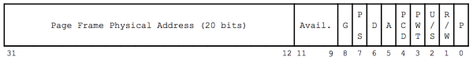
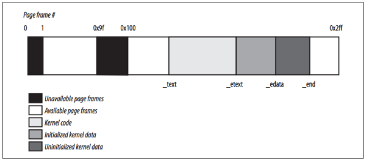

### **Chapter 2. Memory Addressing**

This chapter discusses addressing techniques by offering details in [80×86](http://en.wikipedia.org/wiki/X86) microprocessors address memory chips and how Linux uses the available addressing circuits.

### Memory Addresses

Programmers casually refer to a **memory address** as the way to access the contents of a memory cell. However, when dealing with 80×86 microprocessors, we have to distinguish three kinds of addresses:

* **Logical address**: included in the machine language instructions to specify the address of an operand or of an instruction.
    * This type of address embodies the well-known [80×86 segmented architecture](https://en.wikipedia.org/wiki/X86_memory_segmentation).
    * Each logical address consists of a *segment* and an *offset* (or *displacement*) that denotes the distance from the start of the segment to the actual address.
* **Linear address** (also known as **virtual address**): a single 32-bit unsigned integer that can be used to address up to 4 GB, that is, up to 4,294,967,296 memory cells.
    * Linear addresses are usually represented in hexadecimal notation: from `0x00000000` to `0xffffffff`.
* **Physical address**: used to address memory cells in memory chips. They correspond to the electrical signals sent along the address pins of the microprocessor to the memory bus.
    * <u>Physical addresses are represented as 32-bit or 36-bit unsigned integers.</u>

#### Memory Management Unit *

[Memory Management Unit](https://en.wikipedia.org/wiki/Memory_management_unit) (MMU) transforms a logical address into a linear address (using a hardware circuit called a segmentation unit), and the linear address into a physical address (using a second hardware circuit called a paging unit), as shown in the figure below:

[](figure_2-1.png "Figure 2-1. Logical address translation")

#### Memory Arbiter *

The [**memory arbiter**](https://en.wikipedia.org/wiki/Arbiter_(electronics)) is a hardware circuit inserted between the bus and every RAM chip. Its role is to grant access to a CPU if the chip is free and to delay it if the chip is busy servicing a request by another processor.

* In multiprocessor systems, RAM chips may be accessed concurrently by independent CPUs, since all CPUs usually share the same memory. Thus, memory arbiters are need, because read or write operations on a RAM chip must be performed serially.
* Uniprocessor systems also use memory arbiters, because they include specialized processors called [*DMA controllers*](https://en.wikipedia.org/wiki/Direct_memory_access) that operate concurrently with the CPU.

For multiprocessor systems, the structure of the arbiter is more complex because it has more input ports. The dual Pentium, for instance, maintains a two-port arbiter at each chip entrance and requires that the two CPUs exchange synchronization messages before attempting to use the common bus. From the programming point of view, the arbiter is hidden because it is managed by hardware circuits.

### Segmentation in Hardware

Starting with the [80286](https://en.wikipedia.org/wiki/Intel_80286) model, Intel microprocessors perform address translation in two different ways called [**real mode**](https://en.wikipedia.org/wiki/Real_mode) and [**protected mode**](https://en.wikipedia.org/wiki/Protected_mode). The following sections focus on address translation when **protected mode** is enabled. Real mode exists mostly to maintain processor compatibility with older models and to allow the operating system to bootstrap.

#### Segment Selectors and Segmentation Registers

A logical address consists of two parts:

* Segment identifier: 16-bit field called **Segment Selector** ([described later](#fast-access-to-segment-descriptors))
* Offset: 32-bit field

[](figure_2-2.png "Figure 2-2. Segment Selector format")

To retrieve segment selectors easily and quickly, the processor provides **segmentation registers** whose only purpose is to hold Segment Selectors:

* `cs`: code segment register, which points to a segment containing program instructions
    * It includes 2-bit field for CPU's [Current Privilege Level](https://en.wikipedia.org/wiki/Privilege_level) (CPL), Linux uses only levels 0 and 3 for Kernel Mode and User Mode
* `ss`: stack segment register, which points to a segment containing the current program stack
* `ds`: data segment register, which points to a segment containing global and static data
* `es`, `fs`, and `gs`: general purpose registers, which may refer to arbitrary data

Despite only six of them, a program can reuse the same segmentation register for different purposes by saving its content in memory and then restoring it later.

#### Segment Descriptors

Each segment is represented by an 8-byte **Segment Descriptor** that describes the segment characteristics. Segment Descriptors are stored either in the [**Global Descriptor Table**](https://en.wikipedia.org/wiki/Global_Descriptor_Table) (GDT) or in the [**Local Descriptor Table**](https://en.wikipedia.org/wiki/Global_Descriptor_Table#Local_Descriptor_Table) (LDT).

Usually only one GDT is defined, while each process is permitted to have its own LDT if it needs to create additional segments besides those stored in the GDT. The address and size of the GDT in main memory are contained in the `gdtr` [control register](https://en.wikipedia.org/wiki/Control_register), while the address and size of the currently used LDT are contained in the `ldtr` control register.

The Segment Descriptor format is illustrated in the following figure:

[](figure_2-3.png "Figure 2-3. Segment Descriptor format")

Segment Descriptor fields are explained in the following table:

Field name | Description
---------- | -----------
`Base` | Contains the linear address of the first byte of the segment.
`G` | *Granularity flag*: if it is cleared (equal to 0), the segment size is expressed in bytes; otherwise, it is expressed in multiples of 4096 bytes.
`Limit` | Holds the offset of the last memory cell in the segment, thus binding the segment length. When G is set to 0, the size of a segment may vary between 1 byte and 1 MB; otherwise, it may vary between 4 KB and 4 GB.
`S` | *System flag*: if it is cleared, the segment is asystem segment that stores critical data structures such as the Local Descriptor Table; otherwise, it is a normal code or data segment.
`Type` | Characterizes the segment type and its access rights (see the text that follows this table).
`DPL` | *Descriptor Privilege Level*: used to restrict accesses to the segment. It represents the minimal CPU privilege level requested for accessing the segment. Therefore, a segment with its DPL set to 0 is accessible only when the CPL is 0—that is, in Kernel Mode—while a segment with its DPL set to 3 is accessible with every CPL value.
`P` | *Segment-Present flag*: is equal to 0 if the segment is not stored currently in main memory. Linux always sets this flag (bit 47) to 1, because it never swaps out whole segments to disk.
`D` or `B` | Called `D` or `B` depending on whether the segment contains code or data. Its meaning is slightly different in the two cases, but it is basically set (equal to 1) if the addresses used as segment offsets are 32 bits long, and it is cleared if they are 16 bits long (see the Intel manual for further details).
`AVL` | May be used by the operating system, but it is ignored by Linux.

There are several types of segments, and thus several types of Segment Descriptors. The following list shows the types that are widely used in Linux:

* **Code Segment Descriptor**: indicates that the Segment Descriptor refers to a code segment; included in GDT or LDT.
    * This descriptor has the S flag set (non-system segment).
* **Data Segment Descriptor**: indicates that the Segment Descriptor refers to a data segment; included in GDT or LDT
    * This descriptor has the S flag set.
    * Stack segments are implemented by means of generic data segments.
* **Task State Segment Descriptor** (TSSD): refers to a [Task State Segment](https://en.wikipedia.org/wiki/Task_state_segment) (TSS), a segment used to save the contents of the processor registers; included in GDT only
    * The corresponding `Type` field has the value 11 or 9, depending on whether the corresponding process is currently executing on a CPU.
    * The `S` flag of such descriptors is set to 0.
* **Local Descriptor Table Descriptor** (LDTD): refers to a segment containing an LDT; included in GDT only
    * The corresponding `Type` field has the value 2.
    * The `S` flag of such descriptors is set to 0.

#### Fast Access to Segment Descriptors

Recall that <u>logical addresses consist of a 16-bit Segment Selector and a 32-bit Offset, and that segmentation registers store only the Segment Selector.</u>

To speed up the translation of logical addresses into linear addresses, the 80×86 processor provides an additional nonprogrammable register, which cannot be set by a programmer, for each of the six programmable segmentation registers.

1. Each nonprogrammable register contains the 8-byte Segment Descriptor specified by the Segment Selector contained in the corresponding segmentation register.
2. Every time a Segment Selector is loaded in a segmentation register, the corresponding Segment Descriptor is loaded from memory into the matching nonprogrammable CPU register.
3. From then on, translations of logical addresses referring to that segment can be performed without accessing the GDT or LDT stored in main memory; the processor can refer only directly to the CPU register containing the Segment Descriptor.
4. Accesses to the GDT or LDT are necessary only when the contents of the segmentation registers change.

The Segment Selector includes three fields, described in the following table:

Field name | Description
---------- | -----------
`index` | Identifies the Segment Descriptor entry contained in the GDT or in the LDT.
`TI` | *Table Indicator*: specifies whether the Segment Descriptor is included in the GDT (TI = 0) or in the LDT (`TI` = 1).
`RPL` | *Requestor Privilege Level:* specifies the [Current Privilege Level](#cpl-rpl-and-registers) (CPL)  of the CPU when the corresponding Segment Selector is loaded into the `cs` register; it also may be used to selectively weaken the processor privilege level when accessing data segments.

Because a Segment Descriptor is 8 bytes long, its relative address inside the GDT or the LDT is obtained by multiplying the 13-bit `index` field ([Figure 2-2](figure_2-2.png)) of the Segment Selector by 8. For instance, if the GDT is at `0x00020000` (the value stored in the `gdtr` register) and the `index` specified by the Segment Selector is 2, the address of the corresponding Segment Descriptor is `0x00020000 + (2 × 8)`, or `0x00020010`.

The first entry of the GDT is always set to 0. This ensures that logical addresses with a null Segment Selector will be considered invalid, thus causing a processor exception. The maximum number of Segment Descriptors that can be stored in the GDT is 8,191 (2<sup>13</sup>–1).

#### Segmentation Unit

The **segmentation unit** performs the following operations to obtain the linear address:

[](figure_2-5.png "Figure 2-5. Translating a logical address")

* Examines the `TI` field of the Segment Selector to determine which Descriptor Table (GDT or LDT) stores the Segment Descriptor.
    * If the Descriptor is in the GDT, then the segmentation unit gets the base linear address of the GDT from the `gdtr` register.
    * If the Descriptor is in the active LDT, then the segmentation unit gets the base linear address of that LDT from the `ldtr` register.
* Computes the address of the Segment Descriptor from the `index` field of the Segment Selector.
    * The `index` field is multiplied by 8 (the size of a Segment Descriptor), and the result is added to the content of the `gdtr` or `ldtr` register.
* Adds the offset of the logical address to the `Base` field of the Segment Descriptor to obtain the linear address.

Thanks to the nonprogrammable registers associated with the segmentation registers, the first two operations need to be performed only when a segmentation register has been changed.

### Segmentation in Linux

Segmentation has been included in 80×86 microprocessors to encourage programmers to split their applications into logically related entities, such as subroutines or global and local data areas. However, Linux uses segmentation in a very limited way. Both segmentation and paging can be used to separate the physical address spaces of processes:

* Segmentation can assign a different linear address space to each process.
* Paging can map the same linear address space into different physical address spaces.

Linux prefers paging to segmentation for the following reasons:

* Memory management is simpler when all processes use the same segment register values: they share the same set of linear addresses.
* Paging makes Linux is portable to a wide range of architectures; RISC architectures in particular have limited support for segmentation.

<u>The 2.6 version of Linux uses segmentation only when required by the 80×86 architecture.</u>

* All Linux processes running in User Mode use the same pair of segments to address instructions and data, called **user code segment** and **user data segment**, respectively.
* All Linux processes running in Kernel Mode use the same pair of segments to address instructions and data, called **kernel code segment** and **kernel data segment**, respectively.

The following table shows the values of the Segment Descriptor fields for these four crucial segments.

Segment | Base | G | Limit | S | Type | DPL | D/B | P
------- | ---- | - | ----- | - | ---- | --- | --- | -
user code | `0x00000000` | 1 | `0xfffff` | 1 | 10 | 3 | 1 | 1
user data | `0x00000000` | 1 | `0xfffff` | 1 | 2 | 3 | 1 | 1
kernel code | `0x00000000` | 1 | `0xfffff` | 1 | 10 | 0 | 1 | 1
kernel data | `0x00000000` | 1 | `0xfffff` | 1 | 2 | 0 | 1 | 1

Segment Selectors are defined by the macros:

* `__USER_CS`
* `__USER_DS`
* `__KERNEL_CS`
* `__KERNEL_DS`

To address the kernel code segment, for instance, the kernel just loads the value yielded by the `__KERNEL_CS` macro into the `cs` segmentation register.

The linear addresses associated with such segments all start at 0 and reach the addressing limit of 2<sup>32</sup> –1. This means that all processes, either in User Mode or in Kernel Mode, may use the same logical addresses.

Another important consequence of having all segments start at `0x00000000` is that in Linux, logical addresses coincide with linear addresses: the value of the Offset field of a logical address always coincides with the value of the corresponding linear address.

#### [CPL](http://en.wikipedia.org/wiki/Protection_ring), `RPL` and registers *

The Current Privilege Level (CPL) of the CPU indicates whether the processor is in User or Kernel Mode and is specified by the `RPL` field of the Segment Selector stored in the `cs` register. [p42]

Whenever the CPL is changed, some segmentation registers must be correspondingly updated. For instance:

* When the CPL is equal to 3 (User Mode), the `ds` register must contain the Segment Selector of the user data segment; when the CPL is equal to 0, it must contain the Segment Selector of the kernel data segment.
* When the CPL is 3, the `ss` must refer to a User Mode stack inside the user data segment; when the CPL is 0, it must refer to a Kernel Mode stack inside the kernel data segment. When switching from User Mode to Kernel Mode, Linux always makes sure that the `ss` register contains the Segment Selector of the kernel data segment.

#### Implicit Segment Selector *

When saving a pointer to an instruction or to a data structure, the kernel does not need to store the Segment Selector component of the logical address, because the `ss` register contains the current Segment Selector.

For example, when the kernel invokes a function, it executes a `call` assembly language instruction specifying only the Offset component of its logical address; the Segment Selector is implicitly selected as the one referred to by the `cs` register. Because there is only one segment of type "executable in Kernel Mode", namely the code segment identified by `__KERNEL_CS`, it is sufficient to load `__KERNEL_CS` into `cs` whenever the CPU switches to Kernel Mode.

The same argument goes for pointers to kernel data structures (implicitly using the `ds` register), as well as for pointers to user data structures (the kernel explicitly uses the `es` register).

* `ss`: kernel saves a pointer to an instruction or to a data structure
* `cs`: kernel invokes a function
* `ds`: kernel data structure
* `es`: user data structure

Besides the four segments described, Linux makes use of a few other specialized segments (discussed in The Linux GDT).

#### The Linux GDT

In multiprocessor systems there is one GDT for every CPU [p43].

* All GDTs are stored in the [`cpu_gdt_table`](https://github.com/shichao-an/linux-2.6.11.12/blob/master/arch/i386/kernel/head.S#L479) array.
* The addresses and sizes of the GDTs (used when initializing the `gdtr` registers) are stored in the [`cpu_gdt_descr`](https://github.com/shichao-an/linux-2.6.11.12/blob/master/arch/i386/kernel/head.S) array.

These symbols are defined in the file [arch/i386/kernel/head.S](https://github.com/shichao-an/linux-2.6.11.12/blob/master/arch/i386/kernel/head.S).

The layout of the GDTs is shown schematically in the following figure:

[](figure_2-6.png "Figure 2-6. The Global Descriptor Table")

Each GDT includes 18 segment descriptors and 14 null, unused, or reserved entries. Unused entries are inserted on purpose so that Segment Descriptors usually accessed together are kept in the same 32-byte line of the [hardware cache](#hardware-cache).

The 18 segment descriptors included in each GDT point to the following segments:

* Four user and kernel code and data segments (see [previous section](#segmentation-in-linux))
* [Task State Segment](https://en.wikipedia.org/wiki/Task_state_segment) (TSS): different for each processor in the system.
    * The linear address space corresponding to a TSS is a small subset of the linear address space corresponding to the kernel data segment.
    * The Task State Segments are sequentially stored in the `init_tss` array; in particular, the `Base` field of the TSS descriptor for the *n*th CPU points to the *n*th component of the `init_tss` array.
    * The `G` (granularity) flag is cleared, while the `Limit` field is set to `0xeb`, because the TSS segment is 236 bytes long.
    * The `Type` field is set to 9 or 11 (available 32-bit TSS), and the `DPL` is set to 0, because processes in User Mode are not allowed to access TSS segments.
* A segment including the default Local Descriptor Table (LDT), usually shared by all processes
* Three [Thread-Local Storage](https://en.wikipedia.org/wiki/Thread-local_storage) (TLS) segments: allows multithreaded applications to make use of up to three segments containing data local to each thread. The `set_thread_area()` and `get_thread_area()` system calls, respectively, create and release a TLS segment for the executing process.
* Three segments related to [Advanced Power Management](https://en.wikipedia.org/wiki/Advanced_Power_Management) (APM)
* Five segments related to [Plug and Play](https://en.wikipedia.org/wiki/Plug_and_play) (PnP) BIOS services
* A special TSS segment used by the kernel to handle "Double fault" exceptions

There is a copy of the GDT for each processor in the system. All copies of the GDT store identical entries, except for a few cases:

1. Each processor has its own TSS segment, thus the corresponding GDT's entries differ.
2. A few entries in the GDT may depend on the process that the CPU is executing (LDT and TLS Segment Descriptors).
3. In some cases a processor may temporarily modify an entry in its copy of the GDT, for instance, when invoking an APM's BIOS procedure.

#### The Linux LDTs

Most Linux User Mode applications do not make use of a Local Descriptor Table. The kernel defines a default LDT to be shared by most processes. It has five entries but only two are used by the kernel:

* A [call gate](http://en.wikipedia.org/wiki/Call_gate) for [iBCS](http://en.wikipedia.org/wiki/Intel_Binary_Compatibility_Standard) executables
* A call gate for Solaris/x86 executables

**Call gates** are a mechanism provided by 80×86 microprocessors to change the privilege level of the CPU while invoking a predefined function.

In some cases, processes may require to set up their own LDT, such as applications (such as [Wine](https://en.wikipedia.org/wiki/Wine_(software))) that execute segment-oriented Microsoft Windows applications. The [`modify_ldt()`](http://man7.org/linux/man-pages/man2/modify_ldt.2.html) system call allows a process to do this.

Any custom LDT created by `modify_ldt()` also requires its own segment. When a processor starts executing a process having a custom LDT, the LDT entry in the CPU-specific copy of the GDT is changed accordingly.

User Mode applications also may allocate new segments by means of `modify_ldt()`; the kernel, however, never makes use of these segments, and it does not have to keep track of the corresponding Segment Descriptors, because they are included in the custom LDT of the process.

### Paging in Hardware

The paging unit translates linear addresses into physical ones. Its key task is to check the requested access type against the access rights of the linear address, and generates a [Page Fault](https://en.wikipedia.org/wiki/Page_fault) exception if memory access is not valid.

* **Pages**: grouped fixed-length intervals of linear addresses; contiguous linear addresses within a page are mapped into contiguous physical addresses. The term "page" to refer both to a set of linear addresses and to the data contained in this group of addresses.
* **Page frames** (or **physical pages**): the paging unit thinks of all RAM as partitioned into fixed-length page frames.
    * Each page frame contains a page, thus the length of a page frame coincides with that of a page.
    * A page frame is a constituent of main memory, and hence it is a storage area.
    * It is important to distinguish a page from a page frame: the former is just a block of data, which may be stored in any page frame or on disk.
* **Page table**: data structures that map linear to physical addresses
    * Page tables are stored in main memory and must be properly initialized by the kernel before enabling the paging unit.

Starting with the [80386](https://en.wikipedia.org/wiki/Intel_80386), all 80×86 processors support paging; it is enabled by setting the `PG` flag of a control register named `cr0`. When `PG = 0`, linear addresses are interpreted as physical addresses.

#### Regular Paging

Starting with the 80386, the paging unit of Intel processors handles 4 KB pages.

The 32 bits of a linear address are divided into three fields:

* **Directory**: the most significant 10 bits
* **Table**: the intermediate 10 bits
* **Offset**: the least significant 12 bits

The translation of linear addresses is accomplished in two steps, each based on a
type of translation table.

1. The first translation table is called the **Page Directory**.
2. The second is called the **Page Table**.

In the following texts

* The lowercase "page table" term denotes any page storing the mapping between linear and physical addresses.
* The capitalized "Page Table" term denotes a page in the last level of page tables.

The aim of this two-level scheme is to reduce the amount of RAM required for per-process Page Tables:

* If a simple one-level Page Table was used, then it would require up to 2<sup>20</sup> entries (at 4 bytes per entry, 4 MB of RAM) to represent the Page Table for each process (if the process used a full 4 GB linear address space), even though a process does not use all addresses in that range.
* <u>The two-level scheme reduces the memory by requiring Page Tables only for those virtual memory regions actually used by a process.</u>

Each active process must have a Page Directory assigned to it. However, there is no need to allocate RAM for all Page Tables of a process at once; it is more efficient to allocate RAM for a Page Table only when the process effectively needs it.

* The physical address of the Page Directory in use is stored in a control register named `cr3`.
* The Directory field within the linear address determines the entry in the Page Directory that points to the proper Page Table.
* The Table field determines the entry in the Page Table that contains the physical address of the page frame containing the page.
* The Offset field determines the relative position within the page frame (see the following figure).
    * Because it is 12 bits long, each page consists of 4096 bytes of data.

[](figure_2-7.png "Figure 2-7. Paging by 80 × 86 processors")

Both the Directory and the Table fields are 10 bits long, so Page Directories and Page Tables can include up to 1,024 entries. Thus, a Page Directory can address up to 1024 × 1024 × 4096=2<sup>32</sup> memory cells, which is expected in 32-bit addresses.

The entries of Page Directories and Page Tables have the same structure. Each entry includes the following fields:

* `Present` flag.
    * If it is set, the referred-to page (or Page Table) is contained in main memory.
    * If it is 0, the page is not contained in main memory. The remaining entry bits may be used by the operating system for its own purposes.
    * <u>If the entry of a Page Table or Page Directory needed to perform an address translation has the `Present` flag cleared, the paging unit stores the linear address in a control register named `cr2` and generates exception 14: the Page Fault exception.</u>
* Field containing the 20 most significant bits of a page frame physical address.
    * <u>Because each page frame has a 4-KB capacity, its physical address must be a multiple of 4096, so the 12 least significant bits of the physical address are always equal to 0.</u>
    * If the field refers to a Page Directory, the page frame contains a Page Table; if it refers to a Page Table, the page frame contains a page of data.
* `Accessed` flag.
    * This flag is set each time the paging unit addresses the corresponding page frame.
    * This flag may be used by the operating system when selecting pages to be swapped out.
    * The paging unit never resets this flag; this must be done by the operating system.
* `Dirty` flag.
    * This flag applies only to the Page Table entries. It is set each time a write operation is performed on the page frame.
    * As with the `Accessed` flag, `Dirty` may be used by the operating system when selecting pages to be swapped out.
    * The paging unit never resets this flag; this must be done by the operating system.
* `Read/Write` flag.
    * This flag contains the access right (Read/Write or Read) of the page or of the Page Table (see [Hardware Protection Scheme](#hardware-protection-scheme)).
* `User/Supervisor` flag.
    * This flag contains the privilege level required to access the page or Page Table (see [Hardware Protection Scheme](#hardware-protection-scheme)).
* `PCD` and `PWT` flags
    * The flags control the way the page or Page Table is handled by the hardware cache (see [Hardware Cache](#hardware-cache)).
* `Page Size` flag.
    * This flag applies only to Page Directory entries. If it is set, the entry refers to a 2 MB (or 4 MB) long page frame (see the following sections).
* `Global` flag.
    * This applies only to Page Table entries.
    * This flag was introduced in the Pentium Pro to prevent frequently used pages from being flushed from the TLB cache (see [Translation Lookaside Buffers](#translation-lookaside-buffers)).
    * It works only if the Page Global Enable (`PGE`) flag of register `cr4` is set.

The entries of Page Directories and Page Tables have the following structure:

[](figure_u2-1.png "Structure of a Page Directory and Page Table entry")

#### Extended Paging

Starting with the [Pentium](https://en.wikipedia.org/wiki/Pentium) model, 80×86 microprocessors introduce **extended paging**, which allows page frames to be 4 MB instead of 4 KB in size, as show in the following figure:

[](figure_2-8.png "Figure 2-8. Extended paging")

Extended paging is used to translate large contiguous linear address ranges into corresponding physical ones. The kernel can do without intermediate Page Tables and thus save memory and preserve TLB entries.

As mentioned in the previous section, extended paging is enabled by setting the `Page Size` flag of a Page Directory entry. In this case, the paging unit divides the 32 bits of a linear address into two fields:

* Directory: the most significant 10 bits
* Offset: the remaining 22 bits

Page Directory entries for extended paging are the same as for normal paging, except that:

* The Page Size flag must be set.
* Only the 10 most significant bits of the 20-bit physical address field are significant. This is because each physical address is aligned on a 4-MB boundary, so the 22 least significant bits of the address are 0.

```text
           |      Field       |
Regular    XXXXXXXXXXXXXXXXXXXX000000000000
           |      20 SGFNT    |

           |      Field       |
Extended   XXXXXXXXXX0000000000000000000000
           |10 SGFNT|
```

#### Hardware Protection Scheme

The paging unit uses a different protection scheme from the segmentation unit.  While 80×86 processors allow four possible privilege levels to a segment, only two privilege levels are associated with pages and Page Tables, because privileges are controlled by the `User/Supervisor` flag mentioned in [Regular Paging](#regular-paging):

* When this flag is 0, the page can be addressed only when the CPL is less than 3 (this means, for Linux, when the processor is in Kernel Mode).
* When the flag is 1, the page can always be addressed.

Instead of the three types of access rights (Read, Write, and Execute) associated with segments, only two types of access rights (Read and Write) are associated with pages:

* If the `Read/Write` flag of a Page Directory or Page Table entry is equal to 0, the corresponding Page Table or page can only be read.
* If the `Read/Write` flag is equal to 1, it can be read and written.

#### An Example of Regular Paging

This section help you understand how regular paging works. Assume that the kernel assigns the linear address space between `0x20000000` and `0x2003ffff` to a running process. (The 3 GB linear address space is an upper limit, but a User Mode process is allowed to reference only a subset of it.) This space consists of exactly 64 pages. We don't care about the physical addresses of the page frames containing the pages; in fact, some of them might not even be in main memory. We are interested only in the remaining fields of the Page Table entries.

##### **Directory field** *

The 10 most significant bits of the linear addresses assigned to the process are the Directory field (interpreted by the paging unit).

* The addresses start with a 2 followed by zeros, so the 10 bits all have the same value, namely `0x080` or 128 decimal.
    * Thus the Directory field in all the addresses refers to the 129th entry of the process Page Directory.
    * The corresponding entry must contain the physical address of the Page Table assigned to the process (see the following figure).
* If no other linear addresses are assigned to the process, all the remaining 1,023 entries of the Page Directory are filled with zeros.

[](figure_2-9.png "Figure 2-9. An example of paging")

##### **Table field** *

The values of the intermediate 10 bits, Table field, range from 0 to `0x03f`, or from 0 to 63 decimal. Thus, only the first 64 entries of the Page Table are valid. The remaining 960 entries are filled with zeros.

Suppose that the process needs to read the byte at linear address `0x20021406`. This address is handled by the paging unit as follows:

1. The Directory field `0x80` is used to select entry `0x80` of the Page Directory, which points to the Page Table associated with the process's pages.
2. The Table field `0x21` is used to select entry `0x21` of the Page Table, which points to the page frame containing the desired page.
3. Finally, the Offset field `0x406` is used to select the byte at offset `0x406` in the desired page frame.

##### **Page Fault exception** *

The paging unit issues a Page Fault exception while translating the linear address in the following two cases:

* If the `Present` flag of the `0x21` entry of the Page Table is cleared, then the page is not present in main memory.
* The process attempts to access linear addresses outside of the interval delimited by `0x20000000` and `0x2003ffff`. Because the Page Table entries not assigned to the process are filled with zeros, their `Present` flags are all cleared.

#### The Physical Address Extension (PAE) Paging Mechanism

The amount of RAM supported by a processor is limited by the number of address pins connected to the address bus. Older Intel processors from the 80386 to the Pentium used 32-bit physical addresses. In theory, up to 4 GB of RAM could be installed on such systems; in practice, <u>due to the linear address space requirements of User Mode processes, the kernel cannot directly address more than 1 GB of RAM</u>, as we will see in the later section [Paging in Linux](#paging-in-linux).

However, big servers require more than 4 GB of RAM, which in recent years created a pressure on Intel to expand the amount of RAM supported on the 32-bit 80×86 architecture. Intel has satisfied these requests by increasing the number of address pins on its processors from 32 to 36. Starting with the [Pentium Pro](https://en.wikipedia.org/wiki/Pentium_Pro), all Intel processors are now able to address up to 2<sup>36</sup> = 64 GB of RAM. However, the increased range of physical addresses can be exploited only by introducing a new paging mechanism that translates 32-bit linear addresses into 36-bit physical ones.

With the Pentium Pro processor, Intel introduced a mechanism called [Physical Address Extension](https://en.wikipedia.org/wiki/Physical_Address_Extension) (PAE). (Another mechanism, Page Size Extension (PSE-36), introduced in the Pentium III processor, is not used by Linux, and is thus ignored in this book.)

PAE is activated by setting the Physical Address Extension (`PAE`) flag in the `cr4` control register. The Page Size (`PS`) flag in the page directory entry enables large page sizes (2 MB when PAE is enabled).

Intel has changed the paging mechanism in order to support PAE.

* The 64 GB of RAM are split into 2<sup>24</sup> distinct page frames, and the physical address field of Page Table entries has been expanded from 20 to 24 bits.
    * A PAE Page Table entry must include the 12 flag bits (32 - 20 (`Field`) = 12, see [Regular Paging](#regular-paging)) and the 24 physical address bits, for a total of 36 bits, so the Page Table entry size has been doubled from 32 bits to 64 bits. As a result, a 4-KB PAE Page Table includes 512 entries instead of 1,024.
* A new level of Page Table called the Page Directory Pointer Table (PDPT) consisting of four 64-bit entries has been introduced.
* The `cr3` control register contains a 27-bit Page Directory Pointer Table base address field. Because PDPTs are stored in the first 4 GB of RAM and aligned to a multiple of 32 bytes (2<sup>5</sup>) (because each PDPT has four 8-byte entries), 27 bits are sufficient to represent the base address of such tables.
* When mapping linear addresses to 4 KB pages (`PS` flag cleared in Page Directory entry), the 32 bits of a linear address are interpreted in the following way:
    * `cr3`: points to a PDPT
    * bits 31–30: point to 1 of 4 possible entries in PDPT
    * bits 29–21: point to 1 of 512 possible entries in Page Directory
    * bits 20–12: point to 1 of 512 possible entries in Page Table
    * bits 11–0: Offset of 4-KB page
* When mapping linear addresses to 2-MB pages (`PS` flag set in Page Directory entry), the 32 bits of a linear address are interpreted in the following way:
    * `cr3`: points to a PDPT
    * bits 31–30: point to 1 of 4 possible entries in PDPT
    * bits 29–21: point to 1 of 512 possible entries in Page Directory
    * bits 20–0: Offset of 2-MB page

Once `cr3` is set, it is possible to address up to 4 GB of RAM. If we want to address more RAM, we'll have to put a new value in `cr3` or change the content of the PDPT.

However, the main problem with PAE is that linear addresses are still 32 bits long. This forces kernel programmers to reuse the same linear addresses to map different areas of RAM.

* How Linux initializes Page Tables when PAE is enabled is discussed in section [Final kernel Page Table when RAM size is more than 4096 MB](#final-kernel-page-table-when-ram-size-is-more-than-4096-mb).
* PAE does not enlarge the linear address space of a process, because it deals only with physical addresses.
* Only the kernel can modify the page tables of the processes, thus a process running in User Mode cannot use a physical address space larger than 4 GB.
* On the other hand, PAE allows the kernel to exploit up to 64 GB of RAM, and thus to increase significantly the number of processes in the system.

#### Paging for 64-bit Architectures

As seen in previous sections, two-level paging is commonly used by 32-bit microprocessors and is not suitable for computers that adopt a 64-bit architecture. (The third level of paging present in 80x86 processors with PAE enabled has been introduced only to lower from 1024 to 512 the number of entries in the Page Directory and Page Tables. This enlarges the Page Table entries from 32 bits to 64 bits so that they can store the 24 most significant bits of the physical address.)

Assume for a 64-bit architecture, the standard page size is 4 KB, so the Offset field is 12 bits. This leaves up to 52 bits of the linear address to be distributed between the Table and the Directory fields. If we use only 48 of the 64 bits for addressing (256 TB address space), the remaining 48-12 = 36 bits will have to be split among Table and the Directory fields. If we reserve 18 bits for each of these two fields, both the Page Directory and the Page Tables of each process should include 2<sup>18</sup> entries, which more than 256,000 entries.

For that reason, all hardware paging systems for 64-bit processors make use of additional paging levels. The number of levels used depends on the type of processor. The following table summarizes the main characteristics of the hardware paging systems used by some 64-bit platforms supported by Linux. See section [Hardware Dependency](ch1.md#hardware-dependency) in Chapter 1 for a short description of the hardware associated with the platform name.

##### **Paging levels in some 64-bit architectures** *

Platform name | Page size | Number of address bits used | Number of paging levels | Linear address splitting
------------- | --------- | --------------------------- | ----------------------- | ------------------------
`alpha` | 8 KB | 43 | 3 | 10 + 10 + 10 + 13
`ia64` | 4 KB | 39 | 3 | 9 + 9 + 9 + 12
`ppc64` | 4 KB | 41 | 3 | 10 + 10 + 9 + 12
`sh64` | 4 KB | 41 | 3 | 10 + 10 + 9 + 12
`x86_64` | 4 KB | 48 | 4 | 9 + 9 + 9 + 9 + 12

As we will see in the section [Paging in Linux](#paging-in-linux) later in this chapter, Linux succeeds in providing a common paging model that fits most of the supported hardware paging systems.

#### Hardware Cache

Today's microprocessors have clock rates of several gigahertz (GHz), while [dynamic RAM](https://en.wikipedia.org/wiki/Dynamic_random-access_memory) (DRAM) chips have access times in the range of hundreds of clock cycles. This means that the CPU may be held back considerably while executing instructions that require fetching operands from RAM and/or storing results into RAM.

Hardware cache memories were introduced to reduce the speed mismatch between CPU and RAM. They are based on the well-known [locality principle](https://en.wikipedia.org/wiki/Locality_of_reference), which holds both for programs and data structures. This states that because of the cyclic structure of programs and the packing of related data into linear arrays, addresses close to the ones most recently used have a high probability of being used in the near future. It makes sense to introduce a smaller and faster memory that contains the most recently used code and data. Therefore, a new unit called the [*line*](https://en.wikipedia.org/wiki/CPU_cache#Cache_entries) was introduced into the 80×86 architecture. It consists of a few dozen contiguous bytes that are transferred in [burst mode](https://en.wikipedia.org/wiki/Burst_mode_(computing)) between the slow DRAM and the fast on-chip static RAM (SRAM) used to implement caches.

The cache is subdivided into subsets of lines:

* At one extreme, the cache can be **direct mapped**, in which case a line in main memory is always stored at the exact same location in the cache.
* At the other extreme, the cache is **fully associative**, meaning that any line in memory can be stored at any location in the cache.
* Most caches are to some degree **N-way set associative**, where any line of main memory can be stored in any one of *N* lines of the cache.
    * For instance, a line of memory can be stored in two different lines of a two-way set associative cache.

[](figure_2-10.png "Figure 2-10. Processor hardware cache")

As shown in the figure above, the cache unit is inserted between the paging unit and the main memory.

The cache unit includes:

* A **hardware cache** memory, which stores actual lines of memory.
* A **cache controller**, which stores an array of entries, one entry for each line of the cache memory.
    * Each entry includes a *tag* and a few flags that describe the status of the cache line.
    * The tag consists of some bits that allow the cache controller to recognize the memory location currently mapped by the line.
    * The bits of the memory's physical address are usually split into three groups:
        * The most significant ones correspond to the tag
        * The middle ones to the cache controller subset index
        * The least significant ones to the offset within the line

When accessing a RAM memory cell, the CPU extracts the subset index from the physical address and compares the tags of all lines in the subset with the high-order bits of the physical address:

* If a line with the same tag as the high-order bits of the address is found, the CPU has a *cache hit*.
* Otherwise, it has a *cache miss*.

When a cache hit occurs, the cache controller behaves differently, depending on the access type:

* For a read operation, the controller selects the data from the cache line and transfers it into a CPU register; the RAM is not accessed and the CPU saves time.
* For a write operation, the controller may implement one of [two basic strategies](https://en.wikipedia.org/wiki/Cache_(computing)#Writing_policies) called *write-through* and *write-back*.
    * In a write-through, the controller always writes into both RAM and the cache line, effectively switching off the cache for write operations.
    * In a write-back, which offers more immediate efficiency, only the cache line is updated and the contents of the RAM are left unchanged. After a write-back, the RAM must eventually be updated.

    The cache controller writes the cache line back into RAM only when the CPU executes an instruction requiring a flush of cache entries or when a FLUSH hardware signal occurs (usually after a cache miss).

When a cache miss occurs, the cache line is written to memory if necessary, and the correct line is fetched from RAM into the cache entry.

Multiprocessor systems have a separate hardware cache for every processor, and therefore they need additional hardware circuitry to synchronize the cache contents.

As shown in the figure below, each CPU has its own local hardware cache. Whenever a CPU modifies its hardware cache, it must check whether the same data is contained in the other hardware cache; if so, it must notify the other CPU to update it with the proper value. This activity is often called [*cache snooping*](https://en.wikipedia.org/wiki/Cache_coherence#Coherency_mechanisms). Luckily, all this is done at the hardware level and is of no concern to the kernel.

[](figure_2-11.png "Figure 2-11. The caches in a dual processor")

Cache technology is rapidly evolving. For example, the first Pentium models included a single on-chip cache called the **L1-cache**. More recent models also include other larger, slower on-chip caches called the **L2-cache**, **L3-cache**, etc. The consistency between the cache levels is implemented at the hardware level. Linux ignores these hardware details and assumes there is a single cache.

* The `CD` flag of the `cr0` processor register is used to enable or disable the cache circuitry.
* The `NW` flag, in the same register, specifies whether the write-through or the write-back strategy is used for the caches.

The Pentium cache is lets an operating system associate a different cache management policy with each page frame. For this purpose, each Page Directory and each Page Table entry includes two flags:

* `PCD` (Page Cache Disable), which specifies whether the cache must be enabled or disabled while accessing data included in the page frame
* `PWT` (Page Write-Through), which specifies whether the write-back or the write-through strategy must be applied while writing data into the page frame.

Linux clears the `PCD` and `PWT` flags of all Page Directory and Page Table entries; as a result, caching is enabled for all page frames, and the write-back strategy is always adopted for writing.

#### Translation Lookaside Buffers (TLB)

Besides general-purpose hardware caches, 80×86 processors include another cache called [Translation Lookaside Buffers](https://en.wikipedia.org/wiki/Translation_lookaside_buffer) (TLB) to speed up linear address translation. When a linear address is used for the first time, the corresponding physical address is computed through slow accesses to the Page Tables in RAM. The physical address is then stored in a TLB entry so that further references to the same linear address can be quickly translated.

In a multiprocessor system, each CPU has its own TLB, called the *local TLB* of the CPU. Contrary to the hardware cache, the corresponding entries of the TLB need not be synchronized, because processes running on the existing CPUs may associate the same linear address with different physical ones.

When the `cr3` control register of a CPU is modified, the hardware automatically invalidates all entries of the local TLB, because a new set of page tables is in use and the TLBs are pointing to old data.

### Paging in Linux

Linux adopts a common paging model that fits both 32-bit and 64-bit architectures.  As explained in section [Paging for 64-bit Architectures](#paging-for-64-bit-architectures), two paging levels are sufficient for 32-bit architectures, while 64-bit architectures require a higher number of paging levels.

* Up to version 2.6.10, the Linux paging model consisted of three paging levels.
* Starting with version 2.6.11, a four-level paging model has been adopted.
    * This change has been made to fully support the linear address bit splitting used by the x86_64 platform. See [table](#paging-levels-in-some-64-bit-architectures).

The four types of page tables (as shown in the following figure) are:

* Page Global Directory
* Page Upper Directory
* Page Middle Directory
* Page Table

[](figure_2-12.png "Figure 2-12. The Linux paging model")

* The Page Global Directory includes the addresses of several Page Upper Directories, which in turn include the addresses of several Page Middle Directories, which in turn include the addresses of several Page Tables.
* Each Page Table entry points to a page frame.
* Thus the linear address can be split into up to five parts. The above figure does not show the bit numbers, because the size of each part depends on the computer architecture.

For 32-bit architectures with no Physical Address Extension, two paging levels are sufficient:

* Linux essentially eliminates the Page Upper Directory and the Page Middle Directory fields (so that the same code can work on 32-bit and 64-bit architectures) by saying that they contain zero bits.
* The kernel keeps a position for the Page Upper Directory and the Page Middle Directory by setting the number of entries in them to 1 and mapping these two entries into the proper entry of the Page Global Directory.

For 32-bit architectures with the Physical Address Extension enabled, three paging levels are used:

* The Linux's Page Global Directory corresponds to the 80×86's Page Directory Pointer Table.
* The Page Upper Directory is eliminated.
* The Page Middle Directory corresponds to the 80×86's Page Directory.
* The Linux's Page Table corresponds to the 80×86's Page Table.

For 64-bit architectures three or four levels of paging are used depending on the linear address bit splitting performed by the hardware (see [table](#paging-levels-in-some-64-bit-architectures)).

Linux's handling of processes relies heavily on paging. In fact, the automatic translation of linear addresses into physical ones makes the following design objectives feasible:

* Assign a different physical address space to each process, ensuring an efficient protection against addressing errors.
* <u>Distinguish pages (groups of data) from page frames (physical addresses in main memory). This allows the same page to be stored in a page frame, then saved to disk and later reloaded in a different page frame. This is the basic ingredient of the virtual memory mechanism.</u>

In the remaining part of this chapter, we will refer to the paging circuitry used by the 80×86 processors.

Each process has its own Page Global Directory and its own set of Page Tables. <u>When a process switch occurs, Linux saves the `cr3` control register in the descriptor of the process previously in execution and then loads `cr3` with the value stored in the descriptor of the process to be executed next. Thus, when the new process resumes its execution on the CPU, the paging unit refers to the correct set of Page Tables.</u>

Mapping linear to physical addresses now becomes a mechanical task, although it is still somewhat complex. The next few sections of this chapter are a list of functions and macros that retrieve information the kernel needs to find addresses and manage the tables.

#### The Linear Address Fields

The following macros simplify Page Table handling:

* `PAGE_SHIFT`: specifies the length in bits of the Offset field. When applied to 80×86 processors, it yields the value 12.
    * Because all the addresses in a page must fit in the Offset field, the size of a page on 80×86 systems is 2<sup>12</sup> or 4,096 bytes
    * The `PAGE_SHIFT` of 12 can be considered the logarithm base 2 of the total page size.
    * This macro is used by `PAGE_SIZE` to return the size of the page.
    * The `PAGE_MASK` macro yields the value `0xfffff000` and is used to mask all the bits of the Offset field.
* `PMD_SHIFT`: the total length in bits of the Offset and Table fields of a linear address, which is the logarithm of the size of the area a Page Middle Directory entry can map.
    * The `PMD_SIZE` macro computes the size of the area mapped by a single entry of the Page Middle Directory, that is, of a Page Table.
    * The `PMD_MASK` macro is used to mask all the bits of the Offset and Table fields.
    * When PAE is disabled:
        * `PMD_SHIFT` yields the value 22 (12 from Offset plus 10 from Table).
        * `PMD_SIZE` yields 2<sup>22</sup> or 4 MB.
        * `PMD_MASK` yields `0xffc00000`.
    * When PAE is enabled:
        * `PMD_SHIFT` yields the value 21 (12 from Offset plus 9 from Table).
        * `PMD_SIZE` yields 2<sup>21</sup> or 2 MB.
        * `PMD_MASK` yields `0xffe00000`.
    * Large pages do not make use of the last level of page tables:
        * `LARGE_PAGE_SIZE`, which yields the size of a large page, is equal to `PMD_SIZE` (2<sup>`PMD_SHIFT`</sup>).
        * `LARGE_PAGE_MASK`, which is used to mask all the bits of the Offset and Table fields in a large page address, is equal to `PMD_MASK`.
* `PUD_SHIFT`: determines the logarithm of the size of the area a Page Upper Directory entry can map.
    * The `PUD_SIZE` macro computes the size of the area mapped by a single entry of the Page Global Directory.
    * The `PUD_MASK` macro is used to mask all the bits of the Offset, Table, and Page Middle Directory fields.
    * On the 80×86 processors, `PUD_SHIFT` is always equal to `PMD_SHIFT`, and `PUD_SIZE` is equal to 4 MB or 2 MB.
* `PGDIR_SHIFT`: determines the logarithm of the size of the area that a Page Global Directory entry can map.
    * The `PGDIR_SIZE` macro computes the size of the area mapped by a single entry of the Page Global Directory.
    * The `PGDIR_MASK` macro is used to mask all the bits of the Offset, Table, Page Middle Directory, and PageUpper Directory fields.
    * When PAE is disabled:
        * `PGDIR_SHIFT` yields the value 22 (the same value yielded by `PMD_SHIFT` and by `PUD_SHIFT`)
        * `PGDIR_SIZE` yields 2<sup>22</sup> or 4 MB, and `PGDIR_MASK` yields `0xffc00000`.
    * When PAE is enabled:
        * `PGDIR_SHIFT` yields the value 30 (12 from Offset plus 9 from Table plus 9 from Page Middle Directory).
        * `PGDIR_SIZE` yields 2<sup>30</sup> or 1 GB.
        * `PGDIR_MASK` yields `0xc0000000`.
* `PTRS_PER_PTE`, `PTRS_PER_PMD`, `PTRS_PER_PUD`, and `PTRS_PER_PGD`: compute the number of entries in the Page Table, Page Middle Directory, Page Upper Directory, and Page Global Directory.
    * When PAE is disabled, they yield the values 1,024, 1, 1, and 1,024, respectively.
    * When PAE is enabled, they yield the values 512, 512, 1, and 4, respectively.

##### **Summary of linear address fields** *

For regular paging, the number of bits for each field in the linear address are:

PAE | Page Global Directory | Page Upper Directory | Page Middle Directory | Page Table | Offset
--- | --------------------- | -------------------- | --------------------- | ---------- | ------
Disabled | 10 | 0 | 0 | 10 | 12
Enabled | 2 | 0 | 9 | 9 | 12

For extended paging (large pages), the number of bits for each field in the linear address are:

PAE | Page Global Directory | Page Upper Directory | Page Middle Directory | Offset
--- | --------------------- | -------------------- | --------------------- | ------
Disabled | 10 | 0 | 0 | 22
Enabled | 2 | 0 | 9 | 21

#### Page Table Handling

`pte_t`, `pmd_t`, `pud_t`, and `pgd_t` describe the format of a Page Table, a Page Middle Directory, a Page Upper Directory, and a Page Global Directory entry, respectively. They are 64-bit data types when PAE is enabled and 32-bit data types otherwise. `pgprot_t` is another 64-bit (PAE enabled) or 32-bit (PAE disabled) data type that represents the protection flags associated with a single entry.

* Five type-conversion macros, `__pte`, `__pmd`, `__pud`, `__pgd`, and `__pgprot`, cast an unsigned integer into the required type.
* Five other type-conversion macros, `pte_val`, `pmd_val`, `pud_val`, `pgd_val`, and `pgprot_val`, perform the reverse casting from one of the four previously mentioned specialized types into an unsigned integer

The kernel also provides several macros and functions to read or modify page table entries:

* `pte_none`, `pmd_none`, `pud_none`, and `pgd_none` yield the value 1 if the corresponding entry has the value 0; otherwise, they yield the value 0.
* `pte_clear`, `pmd_clear`, `pud_clear`, and `pgd_clear` clear an entry of the corresponding page table, thus forbidding a process to use the linear addresses mapped by the page table entry.
    * The `ptep_get_and_clear()` function clears a Page Table entry and returns the previous value.
* `set_pte`, `set_pmd`, `set_pud`, and `set_pgd` write a given value into a page table entry.
    * `set_pte_atomic` is identical to `set_pte`, but when PAE is enabled it also ensures that the 64-bit value is written atomically.
* `pte_same(a,b)` returns 1 if two Page Table entries `a` and `b` refer to the same page and specify the same access privileges, 0 otherwise.
* `pmd_large(e)` returns 1 if the Page Middle Directory entry `e` refers to a large page (2 MB or 4 MB), 0 otherwise. See [Extended Paging](#extended-paging) and [The Linear Address Fields](#the-linear-address-fields) for large page sizes.

The `pmd_bad` macro is used by functions to check Page Middle Directory entries passed as input parameters. It yields the value 1 if the entry points to a bad Page Table, that is, if at least one of the following conditions applies:

* The page is not in main memory (`Present` flag cleared).
* The page allows only Read access (`Read/Write` flag cleared).
* Either `Accessed` or `Dirty` is cleared (<u>Linux always forces these flags to be set for every existing Page Table</u>).

The `pud_bad` and `pgd_bad` macros always yield 0. No `pte_bad` macro is defined, because it is legal for a Page Table entry to refer to a page that is not present in main memory, not writable, or not accessible at all.

The `pte_present` macro yields the value 1 if either the `Present` flag or the `Page Size` flag of a Page Table entry is equal to 1, the value 0 otherwise. Recall that the `Page Size` flag in Page Table entries has no meaning for the paging unit of the microprocessor; <u>the kernel, however, marks `Present` equal to 0 and `Page Size` equal to 1 for the pages present in main memory but without read, write, or execute privileges. In this way, any access to such pages triggers a Page Fault exception because `Present` is cleared, and the kernel can detect that the fault is not due to a missing page by checking the value of `Page Size`.</u>

The `pmd_present` macro yields the value 1 if the `Present` flag of the corresponding entry is equal to 1, that is, if the corresponding page or Page Table is loaded in main memory. The `pud_present` and `pgd_present` macros always yield the value 1.

The functions listed in the table below query the value of any flag in a Page Table entry; with the exception of `pte_file()`, these functions work properly only on Page Table entries for which `pte_present` returns 1.

Function name | Description
------------- | -----------
`pte_user()` | Reads the `User/Supervisor` flag
`pte_read()` | Reads the `User/Supervisor` flag (pages on the 80×86 processor cannot be protected against reading)
`pte_write()` | Reads the `Read/Write` flag
`pte_exec()` | Reads the `User/Supervisor` flag (pages on the 80x86 processor cannot be protected against code execution)
`pte_dirty()` | Reads the `Dirty` flag
`pte_young()` | Reads the `Accessed` flag
`pte_file()` | Reads the `Dirty` flag (when the `Present` flag is cleared and the `Dirty` flag is set, the page belongs to a non-linear disk file mapping)

The follow table lists another group of functions that sets the value of the flags in a Page Table entry:

Function name | Description
------------- | -----------
`mk_pte_huge()` | Sets the `Page Size` and `Present` flags of a Page Table entry
`pte_wrprotect()` | Clears the `Read/Write` flag
`pte_rdprotect()` | Clears the `User/Supervisor` flag
`pte_exprotect()` | Clears the `User/Supervisor` flag
`pte_mkwrite()` | Sets the `Read/Write` flag
`pte_mkread()` | Sets the `User/Supervisor` flag
`pte_mkexec()` | Sets the `User/Supervisor` flag
`pte_mkclean()` | Clears the `Dirty` flag
`pte_mkdirty()` | Sets the `Dirty` flag
`pte_mkold()` | Clears the `Accessed` flag (makes the page old)
`pte_mkyoung()` | Sets the `Accessed` flag (makes the page young)
`pte_modify(p,v)` | Sets all access rights in a Page Table entry `p` to a specified value `v`
`ptep_set_wrprotect()` | Like `pte_wrprotect()`, but acts on a pointer to a Page Table entry
`ptep_set_access_flags()` | If the `Dirty` flag is set, sets the page's access rights to a specified value and invokes `flush_tlb_page()` (see the section [Handling the Hardware Cache and the TLB](#handling-the-hardware-cache-and-the-tlb) later in this chapter)
`ptep_mkdirty()` | Like `pte_mkdirty()` but acts on a pointer to a Page Table entry
`ptep_test_and_clear_dirty()` | Like `pte_mkclean()` but acts on a pointer to a Page Table entry and returns the old value of the flag
`ptep_test_and_clear_young()` | Like `pte_mkold()` but acts on a pointer to a Page Table entry and returns the old value of the flag

The following table lists the macros that combine a page address and a group of protection flags into a page table entry or perform the reverse operation of extracting the page address from a page table entry. Notice that some of these macros refer to a page through the linear address of its "page descriptor" (see the section "Page Descriptors" in Chapter 8) rather than the linear address of the page itself.

(p64-65 skipped for now)

#### Physical Memory Layout

During the initialization phase the kernel must build a **physical addresses map** that specifies which physical address ranges are usable by the kernel and which are unavailable (either because they map hardware devices' I/O shared memory or because the corresponding page frames contain BIOS data).

The kernel considers the following page frames as *reserved*:

* Those falling in the unavailable physical address ranges
* Those containing the kernel’s code and initialized data structures

<u>A page contained in a reserved page frame can never be dynamically assigned or swapped to disk.</u>

As a general rule, the Linux kernel is installed in RAM starting from the physical address `0x00100000` (i.e. from the second megabyte). The total number of page frames required depends on how the kernel is configured. A typical configuration yields a kernel that can be loaded in less than 3 MB of RAM.

The reason why isn't the kernel loaded starting with the first available megabyte of RAM is: the PC architecture has several peculiarities that must be taken into account. For example:

* Page frame 0 is used by BIOS to store the system hardware configuration detected during the [Power-On Self-Test](https://en.wikipedia.org/wiki/Power-on_self-test) (POST)
    * Moreover, the BIOS of many laptops writes data on this page frame even after the system is initialized.
* Physical addresses ranging from `0x000a0000` to `0x000fffff` are usually reserved to BIOS routines and to map the internal memory of ISA graphics cards. This area is the well-known hole from 640 KB to 1 MB in all IBM-compatible PCs: the physical addresses exist but they are reserved, and the corresponding page frames cannot be used by the operating system.
* Additional page frames within the first megabyte may be reserved by specific computer models. For example, the IBM ThinkPad maps the `0xa0` page frame into the `0x9f` one.

In the early stage of the boot sequence, the kernel queries the BIOS and learns the size of the physical memory. In recent computers, the kernel also invokes a BIOS procedure to build a list of physical address ranges and their corresponding memory types.

Later, the kernel executes the `machine_specific_memory_setup()` function, which builds the physical addresses map.

* The kernel builds this table on the basis of the BIOS list, if this is available.
* Otherwise the kernel builds the table following the conservative default setup: all page frames with numbers from `0x9f` (`LOWMEMSIZE()`) to `0x100` (`HIGH_MEMORY`) are marked as reserved.

The following table shows typical configuration for a computer having 128 MB (`0x00000000` through `0x07ffffff`) of RAM.

Start | End | Type
----- | --- | ----
`0x00000000` | `0x0009ffff` | Usable
`0x000f0000` | `0x000fffff` | Reserved
`0x00100000` | `0x07feffff` | Usable
`0x07ff0000` | `0x07ff2fff` | ACPI data
`0x07ff3000` | `0x07ffffff` | ACPI NVS
`0xffff0000` | `0xffffffff` | Reserved

* The physical address range from `0x07ff0000` to `0x07ff2fff` (Type "ACPI data") stores information about the hardware devices of the system written by the BIOS in the POST phase; during the initialization phase, the kernel copies such information in a suitable kernel data structure, and then considers these page frames usable.
* Conversely, the physical address range of `0x07ff3000` to `0x07ffffff` (Type "ACPI NVS") is mapped to ROM chips of the hardware devices.
* The physical address range starting from `0xffff0000` is marked as reserved, because it is mapped by the hardware to the BIOS's ROM chip.
* Notice that the BIOS may not provide information for some physical address ranges (in the table, the range is `0x000a0000` to `0x000effff`). To be on the safe side, Linux assumes that such ranges are not usable.

The kernel might not see all physical memory reported by the BIOS: for instance, the kernel can address only 4 GB of RAM if it has not been compiled with PAE support, even if a larger amount of physical memory is actually available.

The `setup_memory()` function is invoked right after `machine_specific_memory_setup()`: it analyzes the table of physical memory regions and initializes a few variables that describe the kernel's physical memory layout. These variables are shown in the following table:

Variable name | Description
------------- | -----------
`num_physpages` | Page frame number of the highest usable page frame
`totalram_pages` | Total number of usable page frames
`min_low_pfn` | Page frame number of the first usable page frame after the kernel image in RAM
`max_pfn` | Page frame number of the last usable page frame
`max_low_pfn` | Page frame number of the last page frame directly mapped by the kernel (low memory)
`totalhigh_pages` | Total number of page frames not directly mapped by the kernel (high memory)
`highstart_pfn` | Page frame number of the first page frame not directly mapped by the kernel
`highend_pfn` | Page frame number of the last page frame not directly mapped by the kernel

To avoid loading the kernel into groups of noncontiguous page frames, Linux prefers to skip the first megabyte of RAM. Page frames not reserved by the PC architecture will be used by Linux to store dynamically assigned pages.

The figure below shows how the first 3 MB of RAM are filled by Linux, which assume that the kernel requires less than 3 MB of RAM.

[](figure_2-13.png "Figure 2-13. The first 768 page frames (3 MB) in Linux 2.6")

* The symbol `_text`, which corresponds to physical address `0x00100000`, denotes the address of the first byte of kernel code.
* The symbol `_etext` identifies the end of the kernel code.
* Kernel data is divided into two groups: initialized and uninitialized.
    * The initialized data starts right after `_etext` and ends at `_edata`.
    * The uninitialized data follows and ends up at `_end`.

The symbols appearing in the figure are not defined in Linux source code; they are produced while compiling the kernel. You can find the linear address of these symbols in the file [System.map](https://en.wikipedia.org/wiki/System.map), which is created right after the kernel is compiled.

#### Process Page Tables

The linear address space of a process is divided into two parts:

* Linear addresses from `0x00000000` to `0xbfffffff` can be addressed when the process runs in either User or Kernel Mode.
* Linear addresses from `0xc0000000` to `0xffffffff` can be addressed only when the process runs in Kernel Mode.

When a process runs in User Mode, it issues linear addresses smaller than `0xc0000000`; when it runs in Kernel Mode, it is executing kernel code and the linear addresses issued are greater than or equal to `0xc0000000`. In some cases, however, the kernel must access the User Mode linear address space to retrieve or store data.

The `PAGE_OFFSET` macro yields the value `0xc0000000`, which is the offset in the linear address space of a process where the kernel lives.

* The content of the first entries of the Page Global Directory that map linear addresses lower than `0xc0000000` (the first 768 entries with PAE disabled, or the first 3 entries with PAE enabled) depends on the specific process.
* Conversely, the remaining entries should be the same for all processes and equal to the corresponding entries of the master kernel Page Global Directory (see the following section).

#### Kernel Page Tables

The kernel maintains a set of page tables for its own use, rooted at a so-called **master kernel Page Global Directory**. After system initialization, this set of page tables is never directly used by any process or kernel thread; rather, the highest entries of the master kernel Page Global Directory are the reference model for the corresponding entries of the Page Global Directories of every regular process in the system.

The kernel ensures that changes to the master kernel Page Global Directory are propagated to the Page Global Directories that are actually used by processes. [p69]

The kernel initializes its own page tables in two phases. In fact, right after the kernel image is loaded into memory, the CPU is still running in real mode (see [Segmentation in Hardware](#segmentation-in-hardware)); thus, paging is not enabled.

1. In the first phase, the kernel creates a limited address space including the kernel's code and data segments, the initial Page Tables, and 128 KB for some dynamic data structures. This minimal address space is just large enough to install the kernel in RAM and to initialize its core data structures.
2. In the second phase, the kernel takes advantage of all of the existing RAM and sets up the page tables properly.

##### **Provisional kernel Page Tables**

A provisional Page Global Directory is initialized statically during kernel compilation, while the provisional Page Tables are initialized by the [`startup_32()`](https://github.com/shichao-an/linux-2.6.11.12/blob/master/arch/i386/kernel/head.S#L57) assembly language function defined in [`arch/i386/kernel/head.S`](https://github.com/shichao-an/linux-2.6.11.12/blob/master/arch/i386/kernel/head.S). We won't mention the Page Upper Directories and Page Middle Directories anymore, because they are equated to Page Global Directory entries. PAE support is not enabled at this stage.

The provisional Page Global Directory is contained in the `swapper_pg_dir` variable. The provisional Page Tables are stored starting from `pg0`, right after the end of the kernel's uninitialized data segments (symbol `_end` in [Figure 2-13](figure_2-13.png)). For simplicity, assume that the kernel's segments, the provisional Page Tables, and the 128 KB memory area fit in the first 8 MB of RAM. In order to map 8 MB of RAM, two Page Tables are required.

The objective of this first phase of paging is to allow these 8 MB of RAM to be easily addressed both in real mode and protected mode. Therefore, the kernel must create a mapping from both the linear addresses `0x00000000` through `0x007fffff` and the linear addresses `0xc0000000` through `0xc07fffff` into the physical addresses `0x00000000` through `0x007fffff`. In other words, the kernel during its first phase of initialization can address the first 8 MB of RAM by either linear addresses identical to the physical ones or 8 MB worth of linear addresses, starting from `0xc0000000`.

The kernel creates the desired mapping by filling all the `swapper_pg_dir` entries with zeroes, except for entries 0, 1, `0x300` (decimal 768), and `0x301` (decimal 769); the latter two entries span all linear addresses between `0xc0000000` and `0xc07fffff`. The 0, 1, `0x300`, and `0x301` entries are initialized as follows:

* The address field of entries 0 and `0x300` is set to the physical address of `pg0`, while the address field of entries 1 and `0x301` is set to the physical address of the page frame following `pg0`.
* The `Present`, `Read/Write`, and `User/Supervisor` flags are set in all four entries.
* The `Accessed`, `Dirty`, `PCD`, `PWD`, and `Page Size` flags are cleared in all four entries.

The `startup_32()` assembly language function also enables the paging unit. This is achieved by loading the physical address of `swapper_pg_dir` into the `cr3` control register and by setting the `PG` flag of the `cr0` control register, as shown in the following equivalent code fragment:

<small>[arch/i386/kernel/head.S#L186](https://github.com/shichao-an/linux-2.6.11.12/blob/master/arch/i386/kernel/head.S#L186)</small>

```gas
movl $swapper_pg_dir-0xc0000000,%eax
movl %eax,%cr3 /* set the page table pointer.. */
movl %cr0,%eax
orl $0x80000000,%eax
movl %eax,%cr0 /* ..and set paging (PG) bit */
```

##### **Final kernel Page Table when RAM size is less than 896 MB**

The final mapping provided by the kernel page tables must transform linear addresses starting from `0xc0000000` into physical addresses starting from 0.

* The `__pa` macro is used to convert a linear address starting from `PAGE_OFFSET` to the corresponding physical address.
* The `__va` macro does the reverse of `__pa`.

The master kernel Page Global Directory is still stored in `swapper_pg_dir`. It is initialized by the [`paging_init()`](https://github.com/shichao-an/linux-2.6.11.12/blob/master/arch/i386/mm/init.c#L499) function, which does the following:

1. Invokes [`pagetable_init()`](https://github.com/shichao-an/linux-2.6.11.12/blob/master/arch/i386/mm/init.c#L310) to set up the Page Table entries properly.
2. Writes the physical address of `swapper_pg_dir` in the `cr3` control register.
3. If the CPU supports PAE and if the kernel is compiled with PAE support, sets the PAE flag in the `cr4` control register.
4. Invokes [`__flush_tlb_all()`](https://github.com/shichao-an/linux-2.6.11.12/blob/master/include/asm-i386/tlbflush.h) to invalidate all TLB entries.

The actions performed by `pagetable_init()` depend on both the amount of RAM present and on the CPU model. In the simplest case, if the computer has less than 896 MB of RAM, 32-bit physical addresses are sufficient to address all the available RAM, and there is no need to activate the PAE mechanism. (See section [The Physical Address Extension (PAE) Paging Mechanism](#the-physical-address-extension-pae-paging-mechanism).)

<span class="text-muted">The highest 128 MB of linear addresses are left available for several kinds of mappings (see sections [Fix-Mapped Linear Addresses](#fix-mapped-linear-addresses) later in this chapter and "Linear Addresses of Noncontiguous Memory Areas" in Chapter 8). The kernel address space left for mapping the RAM is thus 1 GB – 128 MB = 896 MB.</span>

The `swapper_pg_dir` Page Global Directory is reinitialized by a cycle equivalent to the following:

```c
pgd = swapper_pg_dir + pgd_index(PAGE_OFFSET); /* 768 */
phys_addr = 0x00000000;
while (phys_addr < (max_low_pfn * PAGE_SIZE)) {
    pmd = one_md_table_init(pgd); /* returns pgd itself */
    set_pmd(pmd, __pmd(phys_addr | pgprot_val(__pgprot(0x1e3))));
    /* 0x1e3 == Present, Accessed, Dirty, Read/Write,
                Page Size, Global */
    phys_addr += PTRS_PER_PTE * PAGE_SIZE; /* 0x400000 */
    ++pgd;
}
```

The [`one_md_table_init`](https://github.com/shichao-an/linux-2.6.11.12/blob/master/arch/i386/mm/init.c#L55) function a Page Global Directory entry.

We assume that the CPU is a recent 80×86 microprocessor supporting 4 MB pages and "global" TLB entries. Notice that:

* The `User/Supervisor` flags in all Page Global Directory entries referencing linear addresses above `0xc0000000` are cleared, thus denying processes in User Mode access to the kernel address space.
* The `Page Size` flag is set so that the kernel can address the RAM by making use of large pages (see section [Extended Paging](#extended-paging)).

The identity mapping of the first megabytes of physical memory (8 MB in our example) built by the `startup_32()` function is required to complete the initialization phase of the kernel. When this mapping is no longer necessary, the kernel clears the corresponding page table entries by invoking the `zap_low_mappings()` function.

Actually, this description does not state the whole truth. The later section [Fix-Mapped Linear Addresses](#fix-mapped-linear-addresses) will discuss that the kernel also adjusts the entries of Page Tables corresponding to the "fix-mapped linear addresses".

##### **Final kernel Page Table when RAM size is between 896 MB and 4096 MB**

In this case, the RAM cannot be mapped entirely into the kernel linear address space. The best Linux can do during the initialization phase is to map a RAM window of size 896 MB into the kernel linear address space. If a program needs to address other parts of the existing RAM, some other linear address interval must be mapped to the required RAM. This implies changing the value of some page table entries. This kind of dynamic remapping is discussed in Chapter 8. To initialize the Page Global Directory, the kernel uses the same code as in the previous case.

##### **Final kernel Page Table when RAM size is more than 4096 MB**

The kernel Page Table initialization for computers with more than 4 GB deals with cases in which the following happens:

* The CPU model supports Physical Address Extension (PAE).
* The amount of RAM is larger than 4 GB.
* The kernel is compiled with PAE support.

Although PAE handles 36-bit physical addresses, linear addresses are still 32-bit addresses. As in the previous case, Linux maps a 896-MB RAM window into the kernel linear address space; the remaining RAM is left unmapped and handled by dynamic remapping, as described in Chapter 8. The main difference with the previous case is that a three-level paging model is used, so the Page Global Directory is initialized by a cycle equivalent to the following:

```c
pgd_idx = pgd_index(PAGE_OFFSET); /* 3 */
for (i=0; i<pgd_idx; i++)
    set_pgd(swapper_pg_dir + i, __pgd(__pa(empty_zero_page) + 0x001));
    /* 0x001 == Present */
pgd = swapper_pg_dir + pgd_idx;
phys_addr = 0x00000000;
for (; i<PTRS_PER_PGD; ++i, ++pgd) {
    pmd = (pmd_t *) alloc_bootmem_low_pages(PAGE_SIZE);
    set_pgd(pgd, __pgd(__pa(pmd) | 0x001)); /* 0x001 == Present */
    if (phys_addr < max_low_pfn * PAGE_SIZE)
        for (j=0; j < PTRS_PER_PMD /* 512 */
                  && phys_addr < max_low_pfn*PAGE_SIZE; ++j) {
            set_pmd(pmd, __pmd(phys_addr |
                                pgprot_val(__pgprot(0x1e3))));
            /* 0x1e3 == Present, Accessed, Dirty, Read/Write,
                        Page Size, Global */
            phys_addr += PTRS_PER_PTE * PAGE_SIZE; /* 0x200000 */
        }
}
swapper_pg_dir[0] = swapper_pg_dir[pgd_idx];
```

The above code does the following:

* The kernel initializes the first three entries in the Page Global Directory corresponding to the user linear address space with the address of an empty page (`empty_zero_page`).
* The fourth entry is initialized with the address of a Page Middle Directory (`pmd`) allocated by invoking `alloc_bootmem_low_pages()`. The first 448 entries in the Page Middle Directory (there are 512 entries, but the last 64 are reserved for noncontiguous memory allocation; see the section "Noncontiguous Memory Area Management" in Chapter 8) are filled with the physical address of the first 896 MB of RAM.
* The fourth Page Global Directory entry is then copied into the first entry, so as to mirror the mapping of the low physical memory in the first 896 MB of the linear address space. This mapping is required in order to complete the initialization of SMP systems: when it is no longer necessary, the kernel clears the corresponding page table entries by invoking the `zap_low_mappings()` function, as in the previous cases.

Notice that:

* All CPU models that support PAE also support large 2-MB pages and global pages.
* As in the previous cases, whenever possible, Linux uses large pages to reduce the number of Page Tables.

#### Fix-Mapped Linear Addresses

The previous sections discussed that the initial part of the fourth gigabyte of kernel linear addresses maps the physical memory of the system. However, at least 128 MB of linear addresses are always left available because the kernel uses them to implement:

* Noncontiguous memory allocation, which is just a special way to dynamically allocate and release pages of memory, and is described in the section "Linear Addresses of Noncontiguous Memory Areas" in Chapter 8.
* Fix-mapped linear addresses, which is focused in this section.

Basically, a *fix-mapped linear address* is a constant linear address like `0xffffc000` whose corresponding physical address does not have to be the linear address minus `0xc000000`, but rather a physical address set in an arbitrary way. Thus, each fix-mapped linear address maps one page frame of the physical memory. Later chapters discuss that the kernel uses fix-mapped linear addresses instead of pointer variables that never change their value.

Fix-mapped linear addresses are conceptually similar to the linear addresses that map the first 896 MB of RAM. However, a fix-mapped linear address can map any physical address, while the mapping established by the linear addresses in the initial portion of the fourth gigabyte is linear (linear address *X* maps physical address *X* - `PAGE_OFFSET`).

With respect to variable pointers, fix-mapped linear addresses are more efficient:

* Dereferencing a variable pointer requires one memory access more than dereferencing an immediate constant address.
* Checking the value of a variable pointer before dereferencing it is a good programming practice; conversely, the check is never required for a constant linear address.

Each fix-mapped linear address is represented by a small integer index defined in the [`enum fixed_addresses`](https://github.com/shichao-an/linux-2.6.11.12/blob/master/include/asm-i386/fixmap.h#L53) ([include/asm-i386/fixmap.h](https://github.com/shichao-an/linux-2.6.11.12/blob/master/include/asm-i386/fixmap.h)) data structure:

```c
enum fixed_addresses {
    FIX_HOLE,
    FIX_VSYSCALL,
    FIX_APIC_BASE,
    FIX_IO_APIC_BASE_0,
    [...]
    __end_of_fixed_addresses
};
```

Fix-mapped linear addresses are placed at the end of the fourth gigabyte of linear addresses. The [`fix_to_virt()`](https://github.com/shichao-an/linux-2.6.11.12/blob/master/include/asm-i386/fixmap.h#L134) function computes the constant linear address starting from the index:

```c
inline unsigned long fix_to_virt(const unsigned int idx)
{
    if (idx >= __end_of_fixed_addresses)
        __this_fixmap_does_not_exist();
    return (0xfffff000UL - (idx << PAGE_SHIFT));
}
```

Assume that some kernel function invokes `fix_to_virt(FIX_IO_APIC_BASE_0)`:

* Because the function is declared as "inline", the C compiler does not generate a call to `fix_to_virt()`, but inserts its code in the calling function.
* The check on the index value is never performed at runtime.
    * `FIX_IO_APIC_BASE_0` is a constant equal to 3, so the compiler can cut away the `if` statement because its condition is false at compile time.
    * Conversely, if the condition is true or the argument of `fix_to_virt()` is not a constant, the compiler issues an error during the linking phase because the symbol `__this_fixmap_does_not_exist` is not defined anywhere.
* Eventually, the compiler computes `0xfffff000-(3<<PAGE_SHIFT)` and replaces the `fix_to_virt()` function call with the constant linear address `0xffffc000`.

To associate a physical address with a fix-mapped linear address, the kernel uses the following two macros:

* `set_fixmap(idx,phys)`
* `set_fixmap_nocache(idx,phys)`

Both of them initialize the Page Table entry corresponding to the `fix_to_virt(idx)` linear address with the physical address `phys`; however, the second function also sets the `PCD` flag of the Page Table entry, thus disabling the hardware cache when accessing the data in the page frame (see the section [Hardware Cache](#hardware-cache) earlier in this chapter).

Conversely, `clear_fixmap(idx)` removes the linking between a fix-mapped linear address `idx` and the physical address.

#### Handling the Hardware Cache and the TLB

The last topic of memory addressing is how the kernel makes an optimal use of the hardware caches. Hardware caches and Translation Lookaside Buffers play a crucial role in boosting the performance of modern computer architectures. Several techniques are used by kernel developers to reduce the number of cache and TLB misses.

##### **Handling the hardware cache**

As [mentioned earlier in this chapter](#hardware-cache), hardware caches are addressed by cache lines.

The `L1_CACHE_BYTES` macro yields the size of a cache line in bytes:

* On Intel models earlier than the Pentium 4, this macro yields the value 32
* On a Pentium 4, this macro it yields the value 128.

To optimize the cache hit rate, the kernel considers the architecture in making the following decisions:

* The most frequently used fields of a data structure are placed at the low offset within the data structure, so they can be cached in the same line.
* When allocating a large set of data structures, the kernel tries to store each of them in memory in such a way that all cache lines are used uniformly.

Cache synchronization is performed automatically by the 80×86 microprocessors, thus the Linux kernel for this kind of processor does not perform any hardware cache flushing. The kernel does provide, however, cache flushing interfaces for processors that do not synchronize caches.

##### **Handling the TLB**

Processors cannot synchronize their own TLB cache automatically because it is the kernel (not the hardware) that decides when a mapping between a linear and a physical address is no longer valid.

Linux 2.6 offers several TLB flush methods that should be applied appropriately, depending on the type of page table change. The following table shows architecture-independent TLB-invalidating methods:

Method name | Description | Typically used when
----------- | ----------- | -------------------
`flush_tlb_all` | Flushes all TLB entries (including those that refer to global pages, that is, pages whose `Global` flag is set) | Changing the kernel page table entries
`flush_tlb_kernel_range` | Flushes all TLB entries in a given range of linear addresses (including those that refer to global pages) | Changing a range of kernel page table entries
`flush_tlb` | Flushes all TLB entries of the non-global pages owned by the current process | Performing a process switch
`flush_tlb_mm` | Flushes all TLB entries of the non-global pages owned by a given process | Forking a new process
`flush_tlb_range` | Flushes the TLB entries corresponding to a linear address interval of a given process | Releasing a linear address interval of a process
`flush_tlb_pgtables` | Flushes the TLB entries of a given contiguous subset of page tables of a given process | Releasing some page tables of a process
`flush_tlb_page` | Flushes the TLB of a single Page Table entry of a given process | Processing a Page Fault

Although the generic Linux kernel offers a rich set of TLB methods, every microprocessor usually offers a far more restricted set of TLB-invalidating assembly language instructions, such as the more flexible hardware platforms, Sun's [UltraSPARC](https://en.wikipedia.org/wiki/UltraSPARC). In contrast, Intel microprocessors offers only two TLB-invalidating techniques:

* All Pentium models automatically flush the TLB entries relative to non-global pages when a value is loaded into the `cr3` register.
* In Pentium Pro and later models, the `invlpg` assembly language instruction invalidates a single TLB entry mapping a given linear address.

The following table lists the Linux TLB-invalidating macros for the Intel Pentium Pro and later processor, which exploit the hardware techniques mentioned above. These macros are the basic ingredients to implement the architecture-independent methods listed in the previous table.

Macro name | Description | Used by
---------- | ----------- | -------
`__flush_tlb()` | Rewrites `cr3` register back into itself | `flush_tlb`, `flush_tlb_mm`, `flush_tlb_range`
`__flush_tlb_global()` | Disables global pages by clearing the `PGE` flag of `cr4`, rewrites `cr3` register back into itself, and sets again the `PGE` flag | `flush_tlb_all`, `flush_tlb_kernel_range`
`__flush_tlb_single(addr)` | Executes `invlpg` assembly language instruction with parameter `addr` | `flush_tlb_page`

Notice that the `flush_tlb_pgtables` method is missing from the above table: in the 80×86 architecture nothing has to be done when a page table is unlinked from its parent table, thus the function implementing this method is empty.

The architecture-independent TLB-invalidating methods are extended quite simply to multiprocessor systems. The function running on a CPU sends an [Interprocessor Interrupt](https://en.wikipedia.org/wiki/Inter-processor_interrupt) (see "Interprocessor Interrupt Handling" in [Chapter 4](ch4.md)) to the other CPUs that forces them to execute the proper TLB-invalidating function.

As a general rule, <u>any process switch implies changing the set of active page tables. Local TLB entries relative to the old page tables must be flushed; this is done automatically when the kernel writes the address of the new Page Global Directory into the `cr3` control register.</u> However, the kernel succeeds in avoiding TLB flushes in the following cases:

* When performing a process switch between two regular processes that use the same set of page tables (see the section [The `schedule()` Function](ch7.md#the-schedule-function) in [Chapter 7](ch7.md)).
* When performing a process switch between a regular process and a kernel thread. <u>In fact, kernel threads do not have their own set of page tables; they use the set of page tables owned by the regular process that was scheduled last for execution on the CPU.</u> This is discussed in section [Memory Descriptor of Kernel Threads](ch9.md#memory-descriptor-of-kernel-threads) in [Chapter 9](ch9.md.).

Besides process switches, there are other cases in which the kernel needs to flush some entries in a TLB. For instance:

* When the kernel assigns a page frame to a User Mode process and stores its physical address into a Page Table entry, it must flush any local TLB entry that refers to the corresponding linear address.
* On multiprocessor systems, the kernel also must flush the same TLB entry on the CPUs that are using the same set of page tables, if any.

To avoid useless TLB flushing in multiprocessor systems, the kernel uses a technique called *lazy TLB mode*. The basic idea is the following: if several CPUs are using the same page tables and a TLB entry must be flushed on all of them, then TLB flushing may, in some cases, be delayed on CPUs running kernel threads.

In fact, each kernel thread does not have its own set of page tables; rather, it makes use of the set of page tables belonging to a regular process. However, there is no need to invalidate a TLB entry that refers to a User Mode linear address, because no kernel thread accesses the User Mode address space.

By the way, the `flush_tlb_all` method does not use the lazy TLB mode mechanism; it is usually invoked whenever the kernel modifies a Page Table entry relative to the Kernel Mode address space.

### Doubts and Solution

#### Verbatim

##### **p72 on Final kernel Page Table when RAM size is more than 4096 MB**

> The fourth Page Global Directory entry is then copied into the first entry, so as to mirror the mapping of the low physical memory in the first 896 MB of the linear address space. This mapping is required in order to complete the initialization of SMP systems

<span class="text-danger">Question</span>: Why is that?
